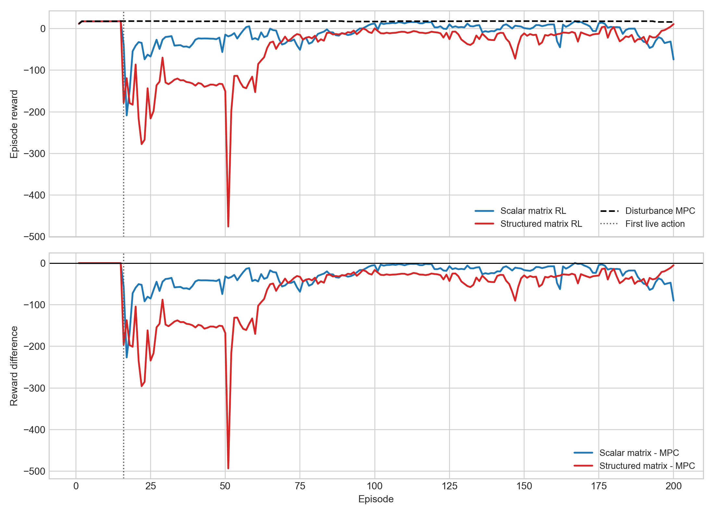
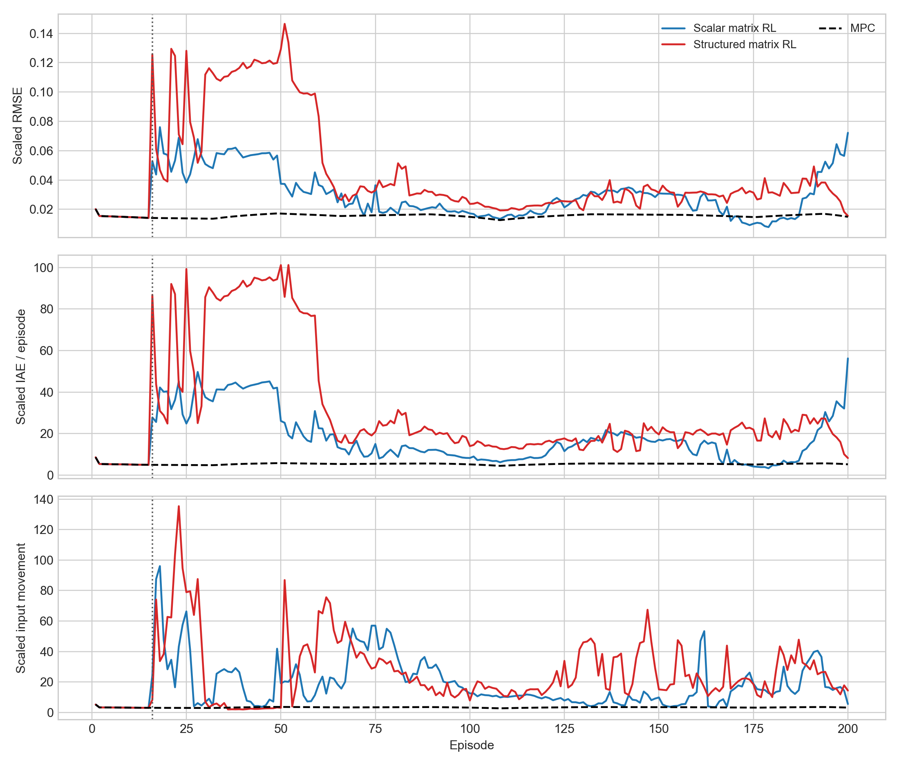
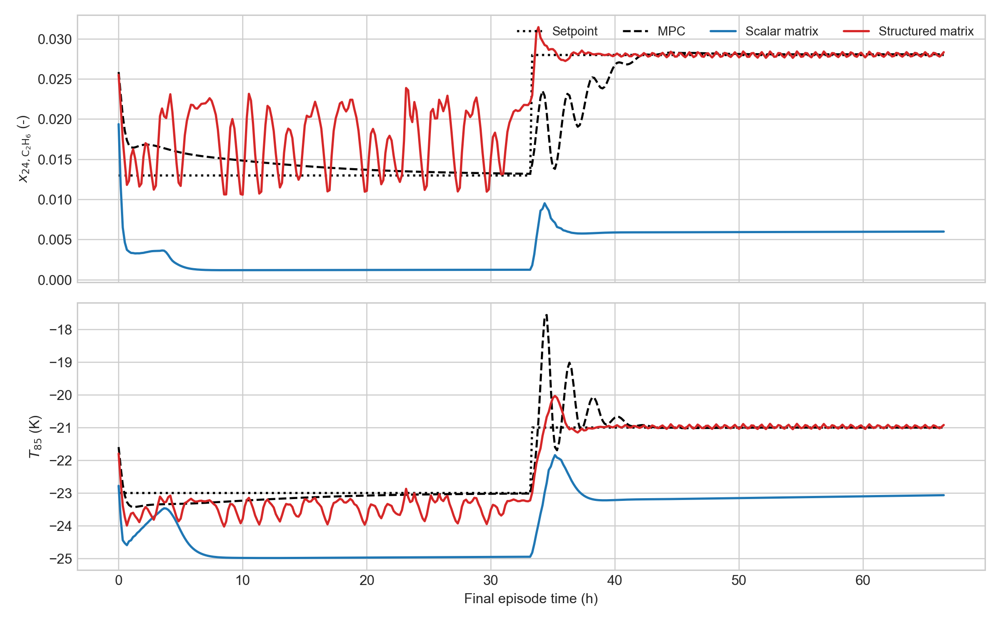
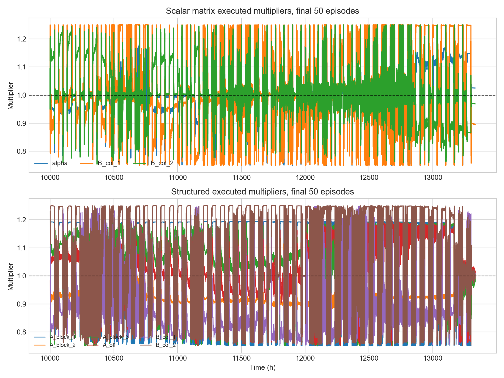

# Distillation Matrix And Structured-Matrix Step 4G Review

Date: 2026-05-04

## Objective

This report analyzes the latest saved TD3 matrix-family runs for the distillation column under disturbance fluctuation:

- Scalar matrix run: `Distillation/Results/distillation_matrix_td3_disturb_fluctuation_mismatch_unified/20260503_062605`
- Structured matrix run: `Distillation/Results/distillation_structured_matrix_td3_disturb_fluctuation_mismatch_unified/20260503_083936`
- Disturbance MPC baseline: `Distillation/Data/mpc_results_disturb_fluctuation.pickle`

Both runs are the Step 4G handoff variant: behavioral cloning is active and the Step 2 release-protected advisory cap is active. The Step 3D usefulness gate and Step 3C shadow logic are disabled in the saved bundles, so the live protection is Step 2 plus the Step 4G behavioral-cloning handoff, not cost-gated MPC fallback.

The generated analysis assets are in:

`report/figures/distillation_matrix_structured_step4g_20260504/`

## Method Reconstruction

The distillation case tracks tray-24 ethane composition and tray-85 temperature:

$$ y_t = [x_{24,\mathrm{C_2H_6}},\; T_{85}]^\top, \qquad u_t = [\mathrm{reflux},\; \mathrm{reboiler}]^\top. $$

The nominal offset-free MPC uses the augmented identified model and solves the usual quadratic tracking/move-suppression problem over fixed horizons:

$$ \min_{U_t} \sum_{k=0}^{H_p-1} \|y_{t+k|t}-y^{\mathrm{sp}}_{t+k}\|_Q^2 + \|\Delta u_{t+k|t}\|_R^2. $$

The scalar matrix supervisor changes the prediction model, not the plant input directly:

$$ A_t^{\mathrm{MPC}}[:n_x,:n_x] = \alpha_t A_0[:n_x,:n_x], \qquad B_t^{\mathrm{MPC}}[:n_x,j] = \delta_{j,t} B_0[:n_x,j]. $$

The structured matrix supervisor uses a block-lite model update. The action is:

$$ a_t = [\theta_{A,1}, \theta_{A,2}, \theta_{A,3}, \theta_{A,\mathrm{off}}, \theta_{B,1}, \theta_{B,2}], $$

where diagonal physical-state blocks are scaled separately, off-block couplings share one multiplier, and each input column of `B` has its own multiplier.

The reward is the relative-band reward used by the distillation notebooks:

$$ r_t = -(\mathrm{err}_{\mathrm{eff}} + \mathrm{move} + \mathrm{lin}_{\mathrm{out}} + \mathrm{lin}_{\mathrm{in}}) + \mathrm{bonus}. $$

The active reward bands are defined in physical output units from:

$$ b(y^{\mathrm{sp}}) = \max(k_{\mathrm{rel}} \odot |y^{\mathrm{sp}}|,\; b_{\mathrm{floor}}). $$

## Run Configuration Check

| Item | Scalar matrix | Structured matrix |
|---|---:|---:|
| Episodes | 200 | 200 |
| Steps per episode | 400 | 400 |
| Warm-start episodes | 10 | 10 |
| Hidden action-freeze episodes | 5 | 5 |
| First live action episode | 16 | 16 |
| Step 2 release guard | active | active |
| Step 4G behavioral cloning | active | active |
| Step 3D usefulness gate | off | off |
| Nonfinite action count | 0 | 0 |
| Solver/update fallback count | 0 | 0 |
| Saved-run decision interval | 1 | 1 |

Important note: these saved runs were completed before the May 4 decision-interval change. They use per-step continuous action selection (`decision_interval = 1`). Future distillation matrix and structured-matrix runs now default to `decision_interval = 20`.

## Reward Results

| Metric | Scalar matrix | Structured matrix | Disturbance MPC reference |
|---|---:|---:|---:|
| Final episode reward | -74.07 | 10.94 | 16.08 |
| Final reward delta vs MPC | -90.15 | -5.14 | 0 |
| Final reward percent vs MPC | -560.7% | -31.9% | 0% |
| Post-live mean reward delta | -29.89 | -68.67 | 0 |
| Post-live win rate vs MPC | 0.54% | 0.00% | 100% reference |
| Final 10 episode mean reward delta | -53.54 | -26.96 | 0 |
| Worst episode reward delta | -226.76 | -493.44 | 0 |

The scalar matrix run is not just slightly below MPC; it becomes unstable late in training/evaluation. Its final episode is much worse than the disturbance MPC baseline, and the final ten episodes are also poor.

The structured run is more nuanced. It also loses to MPC overall and never beats MPC episode-wise in the post-live window, but it recovers substantially by the final episode. The final reward gap is only `-5.14`, compared with `-90.15` for the scalar run. That recovery is visible in the reward plot, but it is not enough to claim an improvement.

## Tracking And Input Movement

| Metric | Scalar matrix | Structured matrix | Disturbance MPC |
|---|---:|---:|---:|
| Post-live scaled RMSE | 0.0308 | 0.0476 | 0.0156 |
| Final 10 scaled RMSE | 0.0524 | 0.0314 | 0.0162 |
| Post-live scaled IAE / episode | 18.49 | 33.26 | 5.31 |
| Final 10 scaled IAE / episode | 30.35 | 20.18 | 5.49 |
| Post-live input movement / episode | 19.38 | 27.23 | 3.28 |
| Final 10 input movement / episode | 21.69 | 20.84 | 3.41 |

The tracking metrics agree with the reward comparison. The RL-assisted matrix variants move the inputs about 6 to 8 times more than MPC while also tracking worse. This is not a reward-only artifact.

Final episode physical mean absolute errors:

| Output | Scalar matrix | Structured matrix | Disturbance MPC |
|---|---:|---:|---:|
| Tray-24 ethane composition | 0.01668 | 0.00268 | 0.00151 |
| Tray-85 temperature | 1.947 K | 0.275 K | 0.179 K |

The structured method is much closer to MPC in the final episode than the scalar method. However, the full post-live trajectory has large excursions, with maximum post-live structured errors of `0.443` in composition and `13.66 K` in temperature. The final recovery should therefore be treated as a late recovery from earlier bad behavior, not as a stable win.

## Multiplier Behavior

Scalar matrix post-live executed multipliers:

| Quantity | Mean | Min/Max or final-window mean |
|---|---:|---:|
| `alpha` post-live mean | 0.979 | min 0.750, max 1.1929 |
| `B_col_1` post-live mean | 0.991 | final 10 mean 1.101 |
| `B_col_2` post-live mean | 1.054 | final 10 mean 0.958 |

Structured matrix post-live executed multiplier means:

| Quantity | Post-live mean | Final 10 mean |
|---|---:|---:|
| `A_block_1` | 1.011 | 1.018 |
| `A_block_2` | 1.013 | 0.976 |
| `A_block_3` | 0.991 | 1.065 |
| `A_off` | 1.011 | 1.040 |
| `B_col_1` | 1.032 | 0.960 |
| `B_col_2` | 1.028 | 1.084 |

Step 2 release clipping was not the dominant event: the scalar run has mean post-live clip fraction `0.003`, and the structured run has mean post-live clip fraction `0.024`. The release guard is active for about `24.3%` of post-live steps, but most executed actions remain inside the protected bounds.

The structured action still spends substantial time near action limits: mean action saturation is `13.8%` and mean near-bound fraction is `23.1%`. That points to the learned policy leaning on model distortion authority even when Step 2 clips only a small fraction of coordinates.

## Interpretation

The Step 4G behavioral-cloning schedule and Step 2 release caps reduce obvious numerical failures, but they do not make the distillation matrix-family policy competitive with disturbance MPC in these runs.

The strongest evidence is:

- There are no nonfinite actions and no structured prediction fallback events, so the poor result is not explained by solver crashes.
- Reward, scaled tracking error, physical output error, and input movement all point in the same direction: the RL-assisted model update is worse than MPC after live release.
- The structured supervisor is less damaging at the end than scalar matrix, but it still underperforms the MPC final episode and has large earlier excursions.
- Step 2 caps constrain the most extreme advisory actions, but the allowed model multipliers are still broad enough to harm MPC prediction quality.

Scientifically, the current saved result should be reported as: "Step 4G plus Step 2 stabilized execution enough to complete the rollout, but did not produce a controller improvement over disturbance MPC. Structured matrix updates are a better direction than scalar matrix updates, because they recover late and avoid solver failures, but they still require slower action updates and/or tighter authority before another full distillation run is defensible."

## Recommended Next Experiment

The next run should use the May 4 decision-interval change:

- Distillation scalar matrix: `decision_interval = 20`
- Distillation structured matrix: `decision_interval = 20`

This should test whether the main failure mode is high-frequency model switching. The current runs changed the prediction model every MPC step after live release. Holding the model update for 20 steps keeps the plant, replay buffer, and training active at every step, but prevents the MPC prediction model from being reshaped at every sample.

I would prioritize structured matrix first, because it has the better final recovery and no structured fallback events. I would also keep Step 2 and Step 4G active, and add one diagnostic plot for held-action intervals:

$$ \Delta a_t = \|a_t - a_{t-1}\|_2, \qquad \Delta \theta_t = \|\theta_t - \theta_{t-1}\|_2. $$

The acceptance criterion for the next run should be stricter than "finishes the rollout":

- final episode reward at least matches MPC within 5%
- final 10 episode mean reward no worse than MPC by more than 10%
- post-live win rate above 25% before considering wider authority
- final episode temperature MAE below 0.25 K
- final episode composition MAE below 0.0025

## Figure Index

- New reward comparison: `report/figures/distillation_matrix_structured_step4g_20260504/fig_reward_comparison.png`
- New tracking/input summary: `report/figures/distillation_matrix_structured_step4g_20260504/fig_tracking_input_metrics.png`
- New final-episode output overlay: `report/figures/distillation_matrix_structured_step4g_20260504/fig_final_episode_outputs.png`
- New multiplier activity plot: `report/figures/distillation_matrix_structured_step4g_20260504/fig_multiplier_activity.png`
- Original scalar comparison reward plot copied as: `matrix_compare_rewards_original.png`
- Original structured comparison reward plot copied as: `structured_compare_rewards_original.png`

## Files Inspected

- `Distillation/Results/distillation_matrix_td3_disturb_fluctuation_mismatch_unified/20260503_062605/input_data.pkl`
- `Distillation/Results/distillation_structured_matrix_td3_disturb_fluctuation_mismatch_unified/20260503_083936/input_data.pkl`
- `Distillation/Results/distillation_compare_matrix_td3_disturb_fluctuation_mismatch/20260503_062617/input_data.pkl`
- `Distillation/Results/distillation_compare_structured_matrix_td3_disturb_fluctuation_mismatch/20260503_083950/input_data.pkl`
- `Distillation/Data/mpc_results_disturb_fluctuation.pickle`
- `distillation_RL_assisted_MPC_matrices_unified.ipynb`
- `distillation_RL_assisted_MPC_structured_matrices_unified.ipynb`
- `systems/distillation/notebook_params.py`
- `systems/distillation/config.py`
- `utils/matrix_runner.py`
- `utils/structured_matrix_runner.py`
- `utils/structured_model_update.py`
- `utils/rewards.py`

## Files Changed

- `report/distillation_matrix_structured_step4g_latest_2026_05_04.md`
- `report/figures/distillation_matrix_structured_step4g_20260504/metrics_summary.csv`
- `report/figures/distillation_matrix_structured_step4g_20260504/metrics_summary.json`
- `report/figures/distillation_matrix_structured_step4g_20260504/fig_reward_comparison.png`
- `report/figures/distillation_matrix_structured_step4g_20260504/fig_tracking_input_metrics.png`
- `report/figures/distillation_matrix_structured_step4g_20260504/fig_final_episode_outputs.png`
- `report/figures/distillation_matrix_structured_step4g_20260504/fig_multiplier_activity.png`
- copied original comparison/action figures under `report/figures/distillation_matrix_structured_step4g_20260504/`
