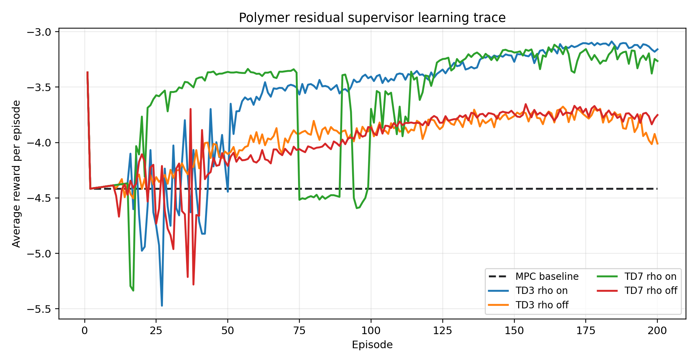
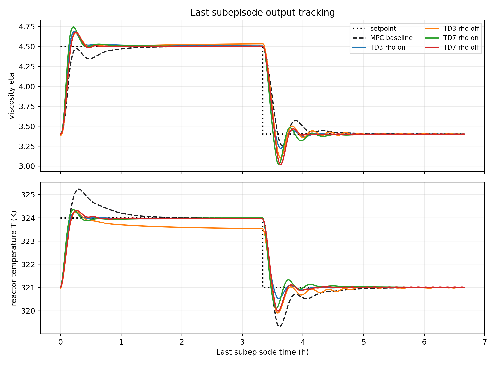
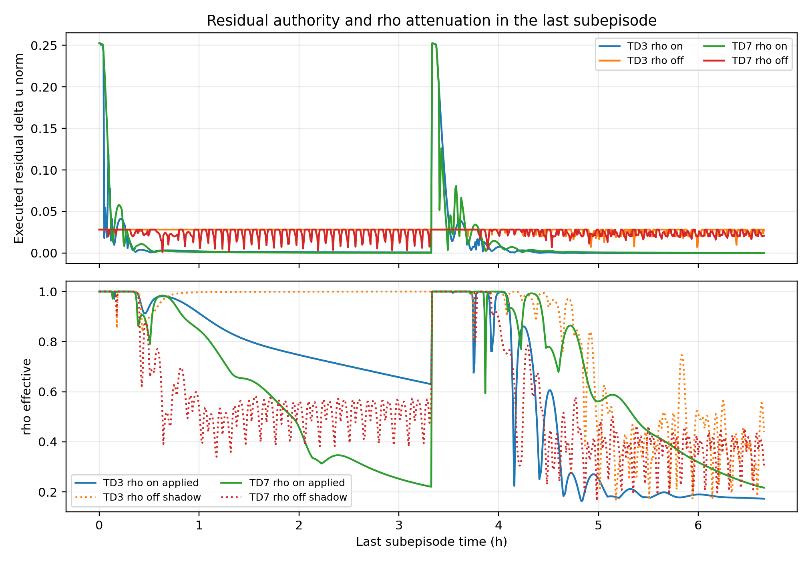
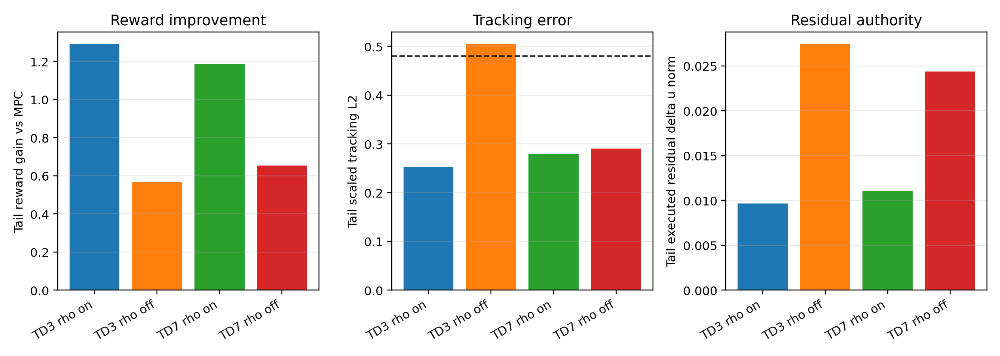

# Polymer Residual TD3 vs TD7 and Rho Authority Report

Date: 2026-06-01

## Objective

This report analyzes the new polymer CSTR residual-supervisor runs for TD3 and TD7. The main question is whether TD7/SALE improves the residual supervisor relative to TD3, and whether disabling `rho` authority helps or hurts now that both rho-enabled and rho-disabled runs exist.

The short answer is: rho-enabled residual control is still the better setting in these runs. TD7/SALE is viable and close to TD3 under rho-enabled authority, but the current TD3 rho-enabled run remains the best single run by tail reward. Disabling rho increases residual authority by roughly 2x, but that extra authority does not improve the reward. For TD3 it also worsens the last-cycle tracking error relative to the MPC baseline. TD7 is more tolerant of rho-off than TD3, but rho-off TD7 is still clearly weaker than rho-on TD7.

## Files Inspected

Implementation and history:

- `RL_assisted_MPC_residual_unified.py`
- `RL_assisted_MPC_residual_td7_unified.py`
- `utils/residual_runner.py`
- `utils/state_features.py`
- `utils/plotting_core.py`
- `TD3Agent/`
- `TD7Agent/`
- `systems/polymer/notebook_params.py`
- `change-reports/2026-04-02_residual_rho_toggle.md`
- `change-reports/2026-06-01_polymer_residual_td7_runner.md`
- `change-reports/2026-06-01_residual_td7_sale_initial_implementation.md`
- `Paper/td3_td7_sale_note/td7_sale_integration_roadmap_2026_06_01.md`

Result bundles:

- `Polymer/Data/mpc_results_dist.pickle`
- `Polymer/Results/td3_residual_disturb/20260520_214325/input_data.pkl`
- `Polymer/Results/td3_residual_disturb/20260601_000722/input_data.pkl`
- `Polymer/Results/td7_residual_disturb/20260531_225718/input_data.pkl`
- `Polymer/Results/td7_residual_disturb/20260601_002221/input_data.pkl`

Generated analysis artifacts:

- `Paper/td3_td7_sale_note/figures/polymer_residual_td3_td7_rho_2026_06_01/polymer_residual_td3_td7_rho_metrics.csv`
- `Paper/td3_td7_sale_note/figures/polymer_residual_td3_td7_rho_2026_06_01/fig_reward_episode_comparison.png`
- `Paper/td3_td7_sale_note/figures/polymer_residual_td3_td7_rho_2026_06_01/fig_last_cycle_tracking.png`
- `Paper/td3_td7_sale_note/figures/polymer_residual_td3_td7_rho_2026_06_01/fig_residual_authority_rho_tail.png`
- `Paper/td3_td7_sale_note/figures/polymer_residual_td3_td7_rho_2026_06_01/fig_metric_bars.png`

## Experimental Setup

All analyzed residual runs use the polymer disturbance case with 160000 finite elements, 200 subepisodes, 800 steps per subepisode, and `delta_t = 0.5`. The controlled outputs are viscosity `eta` and reactor temperature `T`. The manipulated inputs are coolant flow `Qc` and monomer flow `Qm`.

The comparison uses the saved disturbed OF-MPC baseline in `Polymer/Data/mpc_results_dist.pickle`. This is important because the single-run RL bundles store `y_mpc` and `u_mpc` as aliases of the executed RL trajectory. The true baseline for this report is therefore loaded directly from the MPC pickle.

## Method

The residual supervisor leaves the offset-free MPC structure in place and learns a residual correction around the MPC move. Let the linear-MPC move in scaled input coordinates be `u_mpc,k`, and let the RL residual action be `a_res,k` in normalized coordinates. The applied input is:

$$ u_k = \Pi_{\mathcal{U}}(u_{\mathrm{mpc},k} + \Delta u_{\mathrm{res},k}). $$

The residual action is bounded by configured low and high coefficients. In mismatch-state mode, the residual authority can also be scaled by a tracking-dependent rho term:

$$ |\Delta u_{\mathrm{res},j}| \leq \rho_{\mathrm{eff}} \beta_j (|\Delta u_{\mathrm{mpc},j}| + d_{u0,j}). $$

When rho is disabled in these runs, the residual authority removes the rho multiplier and the rho feature is not appended to the residual state:

$$ |\Delta u_{\mathrm{res},j}| \leq \beta_j (|\Delta u_{\mathrm{mpc},j}| + d_{u0,j}). $$

The TD3 residual agent uses a deterministic actor with twin critics:

$$ a_k = \pi_{\theta}(s_k), \qquad Q_i = Q_{\phi_i}(s_k,a_k), \quad i \in \{1,2\}. $$

The TD7 residual agent keeps the same runtime role but augments the actor and critic with SALE state-action representations. It learns a state embedding and state-action embedding:

$$ z_s = f_{\psi}(s), \qquad z_{sa} = g_{\psi}(z_s,a). $$

The SALE encoder is trained with a next-state embedding target:

$$ \mathcal{L}_{\mathrm{enc}} = \mathbb{E}[\|g_{\psi}(f_{\psi}(s_k),a_k) - \mathrm{stopgrad}(f_{\psi}(s_{k+1}))\|_2^2]. $$

This means TD7 changes the representation used by the actor and critic. It does not change the offset-free MPC baseline, the plant model, or the basic residual-control role.

## Figures

Reward evolution over 200 subepisodes:



Last-subepisode physical output tracking:



Residual authority and rho attenuation in the final subepisode:



Summary metrics:



## Quantitative Results

Higher reward is better. Lower scaled tracking L2 is better. Tail metrics use the last 800-step subepisode.

| Case | Rho authority | Mean reward | Tail reward | Tail gain vs MPC | Tail scaled L2 | Tail residual norm |
|---|---:|---:|---:|---:|---:|---:|
| MPC baseline | baseline | -4.412 | -4.417 | 0.000 | 0.480 | n/a |
| TD3 residual | on | -3.605 | -3.129 | +1.289, 29.2 percent | 0.253 | 0.0097 |
| TD3 residual | off | -3.958 | -3.850 | +0.568, 12.8 percent | 0.504 | 0.0274 |
| TD7 residual | on | -3.583 | -3.232 | +1.186, 26.8 percent | 0.280 | 0.0111 |
| TD7 residual | off | -3.997 | -3.764 | +0.654, 14.8 percent | 0.290 | 0.0244 |

Physical tracking errors:

| Case | Tail MAE eta | Tail MAE T | Full MAE eta | Full MAE T |
|---|---:|---:|---:|---:|
| MPC baseline | 0.0646 | 0.2654 K | 0.0646 | 0.2652 K |
| TD3 residual rho on | 0.0466 | 0.1036 K | 0.0545 | 0.1949 K |
| TD3 residual rho off | 0.0595 | 0.2879 K | 0.0564 | 0.2090 K |
| TD7 residual rho on | 0.0495 | 0.1196 K | 0.0514 | 0.1688 K |
| TD7 residual rho off | 0.0501 | 0.1307 K | 0.0561 | 0.2126 K |

Rho and residual-authority diagnostics:

| Case | Applied rho tail | Shadow rho tail | Authority projection rate | Shadow authority rate | Residual delta-u tail norm |
|---|---:|---:|---:|---:|---:|
| TD3 rho on | 0.560 | n/a | 0.778 | n/a | 0.0097 |
| TD3 rho off | n/a | 0.833 | 0.000 | 0.969 | 0.0274 |
| TD7 rho on | 0.551 | n/a | 1.000 | n/a | 0.0111 |
| TD7 rho off | n/a | 0.561 | 0.000 | 0.973 | 0.0244 |

## Interpretation

The rho-enabled runs are the strongest evidence so far. TD3 rho-on is best by final tail reward, with a +1.289 reward gain over the disturbed OF-MPC baseline. TD7 rho-on is close, with a +1.186 tail reward gain. Both rho-enabled runs sharply reduce the final-subepisode tracking error relative to baseline.

Disabling rho does not help in this residual setting. The rho-off runs execute much larger residual corrections: TD3 tail residual norm rises from 0.0097 to 0.0274, and TD7 rises from 0.0111 to 0.0244. This extra authority produces lower reward. For TD3 rho-off, the final temperature tracking error is worse than MPC, with tail MAE T of 0.2879 K versus 0.2654 K for MPC. TD7 rho-off is less damaged, with tail scaled L2 of 0.290 and tail MAE T of 0.1307 K, but it still underperforms rho-on TD7 in reward.

The rho-off shadow logs explain why. When rho is disabled, the shadow rho projection would still be active in about 90 percent of the run and about 97 percent of the final subepisode. In other words, rho is not a cosmetic feature here. It is repeatedly trying to attenuate residual moves that the no-rho controller is allowed to execute.

TD7/SALE appears useful but not yet superior to TD3 in this first polymer residual comparison. TD7 rho-on has slightly better full-run physical MAE than TD3 rho-on, especially for temperature, but TD3 rho-on has better tail reward and tail scaled L2. The reward plot also shows that TD7 rho-on learns quickly early, then has a mid-run degradation window before recovering. That pattern should be investigated before claiming TD7 is more stable.

## Bugs, Inconsistencies, and Risks

The RL single-run bundles duplicate the executed RL trajectory into `y_mpc` and `u_mpc`. This can make a script accidentally compare a run against itself. The report script avoids that by loading `Polymer/Data/mpc_results_dist.pickle` directly for OF-MPC.

The TD3 rho-on run is older than the June 1 TD7 runner and does not contain the newer `residual_authority_enabled` or shadow-rho diagnostics. It does contain `use_rho_authority=True` and `append_rho_to_state=True`, so it is a valid rho-on residual run, but it is not a perfectly paired rerun under the exact current logging schema.

The rho-off setting in these runs disables both rho authority and rho state augmentation. It is not only a test of setting rho to one while keeping the same state vector. That distinction matters scientifically because the agent also loses the rho feature.

The current evidence is single-run for TD7. TD3 has older historical runs, but this report does not use those as a formal seed study. Publication-level claims need repeated seeds under matched current code.

## Literature Connections

The TD7 comparison is connected to the local TD7/SALE note and paper assets in `Paper/td3_td7_sale_note/`. SALE is relevant here because the residual action should be judged by how it changes the next closed-loop state, not just by its immediate magnitude. The current result is consistent with that motivation, but it does not yet prove TD7 superiority. TD7 remains competitive with TD3 under rho-on authority, while rho-off exposes that better representation alone does not replace a process-aware authority limiter.

## Recommended Next Experiments

1. Rerun TD3 rho-on with the current June 1 logging schema.
   - File: `RL_assisted_MPC_residual_unified.py`
   - Change: set `USE_RHO_AUTHORITY = True` with current residual logging.
   - Metric to improve or confirm: tail reward near or above -3.13 and tail scaled L2 near 0.25.
   - Failure mode to watch: schema drift or a different safety/ramp configuration changing the apparent rho effect.

2. Run a matched TD3 and TD7 rho-on seed sweep.
   - Files: `RL_assisted_MPC_residual_unified.py` and `RL_assisted_MPC_residual_td7_unified.py`
   - Change: repeat at least seeds 7, 11, and 23 with identical disturbance, warm start, reward, and authority settings.
   - Metric to improve or confirm: mean tail reward and seed spread.
   - Figure to generate: reward mean plus seed band, and final-cycle tracking overlay.

3. Test rho-in-state with authority disabled as a separate ablation.
   - File: `systems/polymer/notebook_params.py`
   - Change: keep `append_rho_to_state=True` while setting authority rho scaling off.
   - Metric to inspect: whether the policy learns to self-attenuate when it can see rho but is not externally attenuated.
   - Failure mode to watch: larger residual corrections still causing lower reward.

4. Diagnose TD7 rho-on mid-run collapse.
   - File: `TD7Agent/agent.py`
   - Change: no algorithm change first. Plot `encoder_losses`, `critic_losses`, `q_value_min_trace`, `q_target_min_trace`, checkpoint activity, and reward for episodes 70 to 120.
   - Metric to inspect: whether the reward drop aligns with value clipping, checkpoint updates, encoder loss spikes, or critic range saturation.

## Remaining Uncertainty

The rho-enabled conclusion is strong for these saved runs, but the TD3 rho-on comparison is not fully paired with the latest logging schema. The TD7 conclusion is also preliminary because it is single-run evidence. The safest current claim is: TD7 residual control is working and competitive, rho-enabled authority remains beneficial, and rho-disabled residual authority should not be used as the default without a more targeted ablation.

## How to Reproduce

Run:

```powershell
& 'C:\Users\hamediaa\.conda\envs\rl-env\python.exe' 'Paper/td3_td7_sale_note/scripts/analyze_polymer_residual_td3_td7_rho_2026_06_01.py'
```

This regenerates the metrics CSV and all figures in:

`Paper/td3_td7_sale_note/figures/polymer_residual_td3_td7_rho_2026_06_01/`
