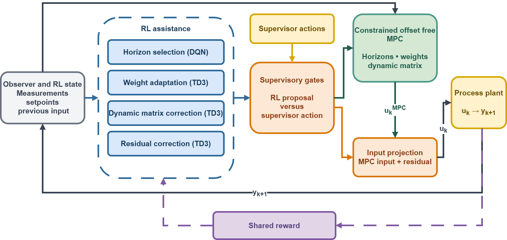
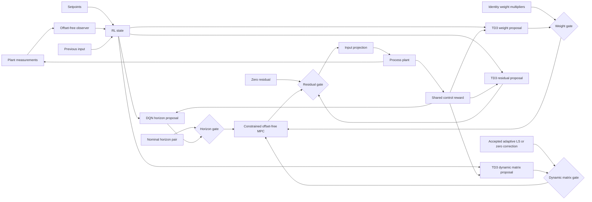

# Critic-Based Supervisory Gating for RL-Assisted MPC

This repository is the active code companion to the manuscript **Critic-Based Supervisory Gating for Multi-Channel Reinforcement Learning-Assisted Model Predictive Control**. It implements an assistance layer around constrained offset-free model predictive control (MPC) for a polymer continuous stirred tank reactor and an Aspen Dynamics distillation column.

The reinforcement learning agents do not replace MPC. They propose bounded adjustments to four assistance channels:

1. prediction and control horizon selection
2. objective function weight adaptation
3. dynamic matrix correction
4. residual input correction

A critic-based supervisory gate (SG) can compare each learned proposal with the supervisor action for that channel before deciding which action is executed. The repository also preserves the corresponding plain DQN and TD3 configurations so the value of the gate can be studied under the same plant, reward, disturbance, and training schedule.

> [!IMPORTANT]
> This is research software. The supervisory gate limits the execution authority of the learned assistance layer, but it is not a formal stability or plant safety certificate. Plant deployment requires independent constraint handling, fail safe logic, engineering review, and staged validation.

## Framework



The observer supplies the augmented state estimate used by the MPC and the RL state. The four agents then act on different parts of the control calculation. Horizon, weight, and dynamic matrix actions affect the MPC optimization. The residual action is applied after the MPC move and projected into the admissible input range. The combined runner executes these four channels in one control loop. It is an integration experiment, not a fifth assistance channel.



## Assistance channels

| Channel | Learned action | Algorithm | Supervisor action | Effect on the controller |
|---|---|---|---|---|
| Horizon selection | One admissible \((N_p,N_c)\) pair | DQN | Nominal horizon pair | Changes the prediction and control horizons at the decision instants |
| Objective weights | Bounded multipliers for the output and input movement penalties | TD3 | Identity multipliers | Retunes the MPC tracking and move suppression priorities |
| Dynamic matrix | Bounded correction coordinates | TD3 | Accepted adaptive least squares correction, otherwise zero correction | Updates the lifted model response used by MPC |
| Residual correction | Bounded additive input correction | TD3 | Zero residual | Adjusts the MPC move before the final input projection |

The source code retains `markov` in filenames and configuration keys for backward compatibility. In the manuscript and this README, that channel is called **dynamic matrix correction**.

### Supervisory decision

For the finite horizon action set, DQN assigns a value to every admissible horizon pair. The gate directly compares the value of the learned pair with the nominal pair.

For a continuous channel, TD3 supplies one bounded learned proposal. Its gate forms a conservative critic score from the lower twin-critic value, critic disagreement, distance from the supervisor action, and optional movement from the previously executed action. Once the configured readiness conditions are met, the learned action is executed only when its score exceeds the supervisor score by the required margin. Otherwise, the supervisor action is retained.

The executed action, rather than an unexecuted proposal, is stored in replay for the gated implementations. This keeps the learning record aligned with the action that affected the plant.

## Active publication scope

Only the active publication runners, their import closure, focused tests, and the identification inputs needed to initialize the two case studies are tracked. Historical experiments, generated results, local reports, proprietary Aspen models, and local development artifacts are intentionally excluded by `.gitignore`.

In the implementation, manuscript **Scenario 1** and **Scenario 2** are named **Phase 1** and **Phase 2**. The scenario phase is independent of whether a plain or SG agent is selected.

### Polymer reactor

The polymer workflow controls viscosity and reactor temperature using coolant and monomer flows. Its active disturbed profile is `robustness_200_100`.

| Item | Active setting |
|---|---|
| Episodes | 300 |
| Control samples per setpoint hold | 400 |
| Scenario 1 / Phase 1 | Episodes 1 to 200 |
| Phase 1 setpoints | `[4.5, 324.0]` and `[3.4, 321.0]` |
| Scenario 2 / Phase 2 | Episodes 201 to 300 |
| Phase 2 setpoints | `[4.0, 321.5]` and `[3.3, 324.5]` |
| Continued mismatch | Coolant and monomer feed changes with persistent fouling |
| Nominal MPC horizons | \(N_p=9\), \(N_c=3\) |
| Horizon grid | \(N_p\in\{8,\ldots,19\}\), \(N_c\in\{3,\ldots,9\}\) |
| Default agent arm | Plain DQN and TD3 |

### Distillation column

The distillation workflow controls tray-24 ethane composition and tray-85 temperature using reflux flow and reboiler duty. Its active disturbed profile is `temperature_flip_200_100`.

| Item | Active setting |
|---|---|
| Episodes | 300 |
| Control samples per setpoint hold | 200 |
| Scenario 1 / Phase 1 | Episodes 1 to 200 |
| Phase 1 setpoints | `[0.013, -23.0]` and `[0.028, -21.0]` |
| Scenario 2 / Phase 2 | Episodes 201 to 300 |
| Phase 2 setpoints | `[0.013, -21.0]` and `[0.028, -23.0]` |
| Continued mismatch | Feed fluctuation under the changed operating mode |
| Nominal MPC horizons | \(N_p=6\), \(N_c=3\) |
| Horizon grid | \(N_p\in\{6,\ldots,11\}\), \(N_c\in\{3,\ldots,11\}\) |
| Default agent arm | Supervisory gated DQN and TD3 |

## Repository layout

```text
.
|-- MPCOffsetFree_unified.py                  # Polymer baseline
|-- RL_assisted_MPC_*_unified.py              # Polymer RL runners
|-- distillation_MPCOffsetFree_unified.py     # Distillation baseline
|-- distillation_RL_assisted_MPC_*_unified.py # Distillation RL runners
|-- Simulation/                               # MPC and closed loop simulation code
|-- systems/
|   |-- polymer/                              # Polymer model, data loading, and defaults
|   |-- distillation/                         # Aspen interface, data loading, and defaults
|   `-- vandevusse/                           # Shared tracked import dependencies
|-- DQN/                                      # Discrete horizon agent
|-- TD3Agent/                                 # Continuous assistance agents
|-- SACAgent/                                 # Alternative continuous agent support
|-- utils/                                    # Gates, rewards, states, runners, and plotting
|-- Polymer/Data/                             # Tracked polymer identification inputs
|-- Distillation/Data/                        # Tracked distillation identification inputs
|-- docs/                                     # Workflow guide and documentation figures
`-- tests/                                    # Focused implementation checks
```

SAC utilities remain in the source tree for alternative studies. The reported manuscript workflow uses DQN for the discrete horizon action and TD3 for the continuous assistance actions.

## Installation

### 1. Clone and enter the repository

```powershell
git clone https://github.com/amirhm10/RLAssistedMPC.git
Set-Location RLAssistedMPC
```

All entrypoints expect the repository root to be the working directory.

### 2. Create a Python environment

Python package versions are not yet pinned in this publication snapshot. Create an isolated environment and record the versions used for any reported experiment.

```powershell
python -m venv .venv
.\.venv\Scripts\Activate.ps1
python -m pip install --upgrade pip
python -m pip install numpy scipy pandas matplotlib control torch pytest
```

If a CUDA build of PyTorch is required, install the build that matches the workstation and driver before installing the remaining packages.

Check the main imports before starting a long experiment:

```powershell
python -c "import control, matplotlib, numpy, pandas, scipy, torch; print('Core imports OK')"
```

### 3. Additional distillation requirements

The distillation case additionally requires:

- Windows
- a licensed Aspen Dynamics installation
- `pywin32`
- the required `C2S_SS_simulation*.dynf` models and their snapshot directories

```powershell
python -m pip install pywin32
```

The proprietary Aspen files are not distributed in this repository. Point the code to their parent directory with either the environment variable

```powershell
$env:DISTILLATION_ASPEN_ROOT = 'D:\AspenModels\Plant'
```

or `aspen_root_override` in `systems/distillation/notebook_params.py`. The more specific `aspen_path_override` and `snaps_path_override` settings take precedence when a family needs explicit paths.

## Run a study

The root scripts are executable research entrypoints exported from the development notebooks. They use the dictionaries in `systems/polymer/notebook_params.py` and `systems/distillation/notebook_params.py` rather than command line arguments.

### Polymer quick start

Generate the matching offset-free MPC baseline first:

```powershell
python MPCOffsetFree_unified.py
```

Then run one assistance channel or the combined study. For example:

```powershell
python RL_assisted_MPC_horizons_unified.py
python RL_assisted_MPC_combined_unified.py
```

The active polymer baseline is written to `Polymer/Data/mpc_results_dist_robustness_200_100.pickle`. This file and all generated result folders are ignored because they can be regenerated.

### Distillation quick start

After configuring Aspen Dynamics, generate the matching baseline:

```powershell
python distillation_MPCOffsetFree_unified.py
```

Then run one assistance channel or the combined study. For example:

```powershell
python distillation_RL_assisted_MPC_markov_unified.py
python distillation_RL_assisted_MPC_combined_unified.py
```

The active distillation baseline is written to `Distillation/Data/mpc_results_disturb_fluctuation_temperature_flip_200_100.pickle`. The baseline writer intentionally refuses to replace an existing file. Move the old ignored baseline to an archival location or set `baseline_save_path_override` before regenerating it.

For a complete preflight checklist, run order, output interpretation, and Aspen troubleshooting, see [docs/experiment-workflow.md](docs/experiment-workflow.md).

## Choose plain or supervisory gated execution

Configuration is explicit so that SG and plain studies share the same runner.

### Polymer

Edit `systems/polymer/notebook_params.py`:

| Runner | Plain value | SG value |
|---|---|---|
| Horizon | `POLYMER_HORIZON_STANDARD_DEFAULTS["agent_kind"] = "dqn"` | `"sg_dqn"` |
| Dynamic matrix | `POLYMER_MARKOV_DEFAULTS["agent_kind"] = "td3"` | `"sg_td3"` |
| Weights | `POLYMER_WEIGHT_DEFAULTS["agent_kind"] = "td3"` | `"sg_td3"` |
| Residual | `POLYMER_RESIDUAL_DEFAULTS["agent_kind"] = "td3"` | `"sg_td3"` |
| Combined | `POLYMER_COMBINED_DEFAULTS["combined_agent_mode"] = "plain"` | `"sg"` |

The active publication default is `plain` for the polymer case.

### Distillation

Edit the active defaults in `systems/distillation/notebook_params.py`:

| Runner | Plain value | SG value |
|---|---|---|
| Horizon | `DISTILLATION_HORIZON_STANDARD_DEFAULTS["agent_mode"] = "plain"` | `"sg"` |
| Dynamic matrix | `DISTILLATION_MARKOV_DEFAULTS["agent_mode"] = "plain"` | `"sg"` |
| Weights | `DISTILLATION_WEIGHT_DEFAULTS["agent_mode"] = "plain"` | `"sg"` |
| Residual | `DISTILLATION_RESIDUAL_DEFAULTS["agent_mode"] = "plain"` | `"sg"` |
| Combined | `"combined_agent_mode": "plain"` | `"combined_agent_mode": "sg"` |

The standalone assignments are grouped in `_apply_active_runner_defaults()`. The combined mode is returned by `_build_active_combined_defaults()`. The standalone runners resolve `agent_mode` to DQN or TD3 automatically, while the combined runner resolves all four agent kinds from `combined_agent_mode`. The active publication default is `sg` for the distillation case.

Before launching a long run, inspect the setup summary printed by the entrypoint and confirm the profile, scenario schedule, agent mode, result path, and Aspen path.

## Active entrypoints

| Controller family | Polymer command | Distillation command |
|---|---|---|
| Offset-free MPC baseline | `python MPCOffsetFree_unified.py` | `python distillation_MPCOffsetFree_unified.py` |
| Horizon selection | `python RL_assisted_MPC_horizons_unified.py` | `python distillation_RL_assisted_MPC_horizons_unified.py` |
| Dynamic matrix correction | `python RL_assisted_MPC_markov_unified.py` | `python distillation_RL_assisted_MPC_markov_unified.py` |
| Objective weight adaptation | `python RL_assisted_MPC_weights_unified.py` | `python distillation_RL_assisted_MPC_weights_unified.py` |
| Residual input correction | `python RL_assisted_MPC_residual_unified.py` | `python distillation_RL_assisted_MPC_residual_unified.py` |
| Combined four channel study | `python RL_assisted_MPC_combined_unified.py` | `python distillation_RL_assisted_MPC_combined_unified.py` |

## Training and decision timing

The active manuscript studies use a common staged handoff:

- Episodes 1 to 10 provide the warm start.
- The next three episodes keep learned execution frozen while critic learning is established.
- Learned proposals and actor learning are enabled after this handoff.
- Episode 300 is evaluation only.
- Scenario 2 changes the operating condition while preserving the established training sequence.

Horizon decisions are made every four control samples, and the selected pair is held between decision instants. The active dynamic matrix, weight, and residual configurations evaluate a continuous proposal every control sample. During weight agent training, one Gaussian exploration perturbation is applied to each proposal, giving the tested proposal to perturbation ratio of 1:1.

For slower industrial adaptation, the same decision interval mechanism can be extended to the continuous channels so a selected action is held between update instants. The appropriate interval depends on the process dynamics, measurement noise, and operational requirements. No universal ratio is claimed by this repository.

## State, objective, and reward

The controller minimizes a finite horizon tracking and input movement objective of the form

$$
\min_U \sum_{j=1}^{N_p}\lVert y_{sp,k}-\hat y_{k+j\mid k}\rVert_{Q_y}^2
+\sum_{j=0}^{N_c-1}\lVert\Delta u_{k+j\mid k}\rVert_{R_{\Delta u}}^2
$$

subject to the configured input and input movement bounds.

The mismatch aware RL state combines the augmented observer estimate, setpoint, previous input, normalized prediction innovation, and normalized tracking error. Prediction innovation means the current plant measurement minus the one step prediction. A signed logarithmic transform is used by the active mismatch state configuration to retain sign while compressing large deviations.

The shared reward combines acceptable band tracking performance, input movement, inside band and outside band shaping, and a near setpoint bonus. The exact state transformations, normalization rules, and reward coefficients are implemented in `utils/state_features.py` and `utils/rewards.py`.

## Outputs and reproducibility

Runs create timestamped result directories under:

- `Polymer/Results/`
- `Distillation/Results/`

Each result bundle contains an `input_data.pkl` history and the figures requested by the runner. PDF export can be enabled with `save_pdf = True`. Generated baselines, bundles, plots, and checkpoints are deliberately ignored and should be stored separately with the experiment metadata needed to reproduce them.

For every reported run, record at least:

- Git commit and branch
- Python and package versions
- plant and runner
- run profile and scenario schedule
- plain or SG agent mode
- random seeds
- edited configuration values
- baseline filename
- Aspen model and snapshot identifiers for distillation
- output directory name

Do not compare an RL run against a baseline from a different profile, setpoint schedule, or disturbance realization.

## Validation

Compile every tracked Python source without importing local ignored modules:

```powershell
git ls-files "*.py" | ForEach-Object { python -m py_compile $_ }
```

Run the checks that are self contained in the public snapshot:

```powershell
python -m pytest tests --ignore=tests/test_exploration_defaults.py --ignore=tests/test_supervisor_gated_dqn.py
```

The two excluded tests exercise an older local `DuelingDQN` implementation that is intentionally outside the publication snapshot. The active horizon runner uses the tracked `DQN` implementation. Aspen integration is not exercised by the public unit tests and must be verified on a configured Windows workstation.

## Scope and limitations

- The repository contains research entrypoints, not a packaged command line application.
- The Python environment is not yet locked to exact dependency versions.
- Distillation execution depends on commercial software and proprietary model files that cannot be distributed here.
- Generated result histories from the manuscript are not committed.
- The SG is an execution selection mechanism. It does not replace formal safety analysis, MPC feasibility checks, plant interlocks, or operator authority.
- Plant evaluation should begin with simulation and historical replay, continue in shadow mode, and only then consider bounded online activation.

## Citation

If this code supports a publication, cite the companion manuscript:

> *Critic-Based Supervisory Gating for Multi-Channel Reinforcement Learning-Assisted Model Predictive Control.*

Complete bibliographic metadata will be added after publication.

## License

No open source license file is currently included. Unless a license is added, the repository contents remain subject to the copyright holder's default rights. Contact the repository owner before redistribution or external reuse.
