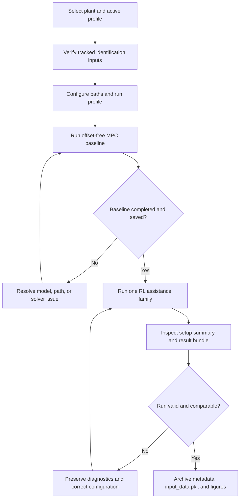
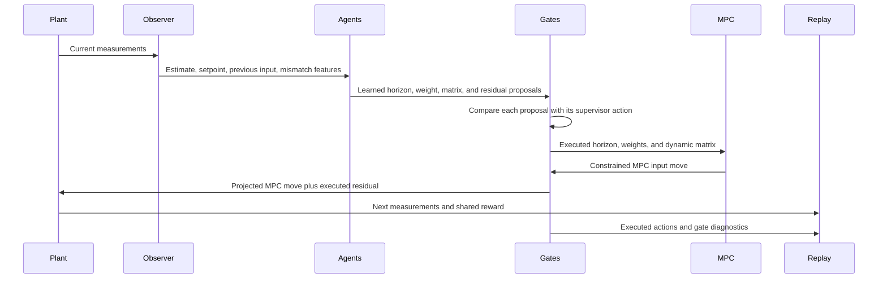

# Experiment Workflow

This guide turns the active publication snapshot into a repeatable run sequence. It covers only files tracked by Git. Local historical notebooks, old result bundles, private Aspen models, and other ignored artifacts are not required for the polymer workflow and are not treated as evidence for the commands below.

## 1. Choose the experiment before editing configuration

Record four decisions:

1. Plant: polymer or distillation
2. Assistance family: horizon, dynamic matrix, weights, residual, or combined
3. Execution mode: plain or supervisory gated
4. Run profile: use the active manuscript profile unless a new experiment is intended

The active profiles are:

| Plant | Profile | Scenario 1 | Scenario 2 | Default execution mode |
|---|---|---|---|---|
| Polymer | `robustness_200_100` | Episodes 1 to 200 | Episodes 201 to 300 | Plain |
| Distillation | `temperature_flip_200_100` | Episodes 1 to 200 | Episodes 201 to 300 | Supervisory gated |

Do not change the scenario phase merely to switch the gate on or off. The phase describes the operating regime. The agent mode describes how execution authority is assigned.

## 2. Preflight checklist

From the repository root, confirm the branch and local changes:

```powershell
git status --short --branch
git rev-parse --short HEAD
```

Activate the intended environment and verify the core imports:

```powershell
python --version
python -c "import control, matplotlib, numpy, pandas, scipy, torch; print('Core imports OK')"
```

Confirm that the tracked identification inputs exist:

```powershell
Get-ChildItem Polymer\Data\system_dict, Polymer\Data\scaling_factor.pickle, Polymer\Data\min_max_states.pickle
Get-ChildItem Distillation\Data\system_dict.pickle, Distillation\Data\scaling_factor.pickle, Distillation\Data\min_max_states.pickle
```

Only the second line is needed for a distillation run. Only the first line is needed for a polymer run.

## 3. Configure the run

The entrypoints read a deep copy of the dictionaries in:

- `systems/polymer/notebook_params.py`
- `systems/distillation/notebook_params.py`

Use the smallest configuration change possible. Avoid editing a root runner for a routine mode, path, display, or episode override.

### Common overrides

Both plants expose these settings in their common default dictionaries:

| Setting | Purpose |
|---|---|
| `data_dir_override` | Redirect identification and baseline inputs |
| `results_dir_override` | Redirect generated result bundles |
| `result_prefix_override` | Assign a unique run prefix |
| `compare_prefix_override` | Assign a unique comparison prefix |
| `baseline_mpc_path_override` | Select an existing compatible baseline |
| `baseline_save_path_override` | Choose where a new baseline is written |
| `n_tests_override` | Override the episode count |
| `set_points_len_override` | Override the control samples per setpoint hold |
| `warm_start_override` | Override the warm-start duration |
| `training_profile_override` | Select another defined training profile |
| `style_profile` | Select `hybrid`, `paper`, or `debug` plot styling |
| `save_pdf` | Save PDF figures in addition to PNG figures |

Leave an override as `None` to retain the active family and profile default.

### Agent mode switches

For polymer standalone runners, set the corresponding `agent_kind` to `dqn` or `sg_dqn` for horizons, and `td3` or `sg_td3` for a continuous family. Set `POLYMER_COMBINED_DEFAULTS["combined_agent_mode"]` to `plain` or `sg` for the combined runner.

For distillation standalone runners, set the active family `agent_mode` assignments in `_apply_active_runner_defaults()` to `plain` or `sg`. Set the `combined_agent_mode` returned by `_build_active_combined_defaults()` to `plain` or `sg`. The runner resolves the corresponding DQN and TD3 implementation.

### Keep an experiment record

Before execution, capture the Git commit, configuration diff, and intended output name in an external experiment log. If configuration edits are temporary, do not discard them until the generated result has been labelled with enough information to reconstruct the run.

## 4. Generate a compatible baseline

Every RL comparison should use the baseline generated for the same plant, setpoint schedule, profile, and disturbance setup.



### Polymer baseline

```powershell
python MPCOffsetFree_unified.py
```

Expected active baseline:

```text
Polymer/Data/mpc_results_dist_robustness_200_100.pickle
```

The polymer baseline writer replaces the target if it already exists. Set `baseline_save_path_override` when the previous baseline must be preserved.

### Distillation baseline

```powershell
python distillation_MPCOffsetFree_unified.py
```

Expected active baseline:

```text
Distillation/Data/mpc_results_disturb_fluctuation_temperature_flip_200_100.pickle
```

The distillation baseline uses exclusive creation. If that path already exists, preserve it under a different name or choose a new `baseline_save_path_override` before rerunning.

## 5. Run an assistance family

### Polymer

```powershell
python RL_assisted_MPC_horizons_unified.py
python RL_assisted_MPC_markov_unified.py
python RL_assisted_MPC_weights_unified.py
python RL_assisted_MPC_residual_unified.py
python RL_assisted_MPC_combined_unified.py
```

### Distillation

```powershell
python distillation_RL_assisted_MPC_horizons_unified.py
python distillation_RL_assisted_MPC_markov_unified.py
python distillation_RL_assisted_MPC_weights_unified.py
python distillation_RL_assisted_MPC_residual_unified.py
python distillation_RL_assisted_MPC_combined_unified.py
```

These are separate studies. Running all five commands is not required. Select the command that matches the question being evaluated.

## 6. What happens in one combined control step



The horizon action is reconsidered every four samples in the active studies and held between those decision instants. Dynamic matrix, weight, and residual proposals are evaluated each sample. In the combined runner, the horizon decision is resolved first, then the weight and dynamic matrix actions configure the MPC problem, and finally the residual correction is applied to the MPC move before input projection.

## 7. Monitor a run

At startup, inspect the printed setup information. At minimum, verify:

- repository, data, and result paths
- plant profile and disturbance mode
- episode count, setpoint length, and warm start
- plain or SG mode and resolved agent kinds
- horizon grid and continuous action bounds
- baseline path
- Aspen dynamic model and snapshot paths for distillation

During execution, monitor:

- MPC solve or feasibility failures
- NaN or infinite observations, rewards, critic values, or actions
- repeated action clipping or input projection
- gate source fractions and score margins
- tracking performance and manipulated-variable movement
- Aspen communication, pause, and reset behavior

Stop and preserve the diagnostics if the active profile or model path is not the one intended. A completed script is not sufficient evidence that two runs are scientifically comparable.

## 8. Interpret generated outputs

The result utilities create a timestamped directory under the plant's ignored `Results` folder. The exact prefix depends on the family, profile, and agent mode. The central history file is:

```text
input_data.pkl
```

It contains the histories used by the plotting and comparison utilities. Depending on the family, these histories include plant outputs, setpoints, manipulated variables, reward components, proposed and executed assistance actions, gate selections, critic diagnostics, and family-specific values such as horizon pairs, weight multipliers, or dynamic matrix corrections.

Interpret gate selections together with control behavior. Near a settled setpoint, several small actions can have almost the same immediate control effect and reward. Low learned effort or frequent selection of the supervisor action can therefore be consistent with good closed loop performance. The gate source fraction alone is not a performance metric.

For dynamic matrix studies, inspect the time resolved corrections together with prediction innovation and operating mode transitions. Average episode metrics can hide when a correction was introduced, rejected, or held.

## 9. Distillation setup and troubleshooting

The distillation plant creates a separate Aspen Dynamics COM process through `win32com.client.DispatchEx("AD application")`. The model is expected to expose the configured `C2S` flowsheet objects, including the feed stream, reflux and reboiler inputs, tray-24 composition, and tray-85 temperature.

Before a long run:

1. Open each required `.dynf` model manually in Aspen Dynamics.
2. Confirm that its associated snapshot directory exists.
3. Confirm that the model initializes and advances without Python.
4. Close manual Aspen sessions that might lock the same files.
5. Set `DISTILLATION_ASPEN_ROOT` or the path overrides.
6. Start with a short diagnostic override before launching all 300 episodes.

If COM dispatch fails, verify Windows registration and the Python environment's `pywin32` installation. If a family opens the wrong Aspen model, inspect the family to file mapping in `systems/distillation/config.py` and use `aspen_path_override` only when the mapping should intentionally be bypassed.

If a run is interrupted, confirm that the Aspen process closes before restarting. Do not assume that an orphaned Aspen process has released the model or snapshot files.

## 10. Validate the public snapshot

Compile every tracked Python source:

```powershell
git ls-files "*.py" | ForEach-Object { python -m py_compile $_ }
```

Run the self contained public tests:

```powershell
python -m pytest tests --ignore=tests/test_exploration_defaults.py --ignore=tests/test_supervisor_gated_dqn.py
```

The excluded tests import a historical local `DuelingDQN` package that is intentionally ignored. They are not required by the active DQN horizon runner. Aspen execution requires a separate integration check on the licensed workstation.

## 11. Archive a completed experiment

Keep the generated result bundle outside the Git publication snapshot together with:

- the exact Git commit
- the configuration diff
- environment package versions
- random seeds
- baseline file and its provenance
- console log
- Aspen model and snapshot identifiers when applicable
- notes about interruptions, restarts, or manual intervention

The repository intentionally does not track generated result histories. Reproducibility therefore depends on preserving this metadata with the external experimental archive.
