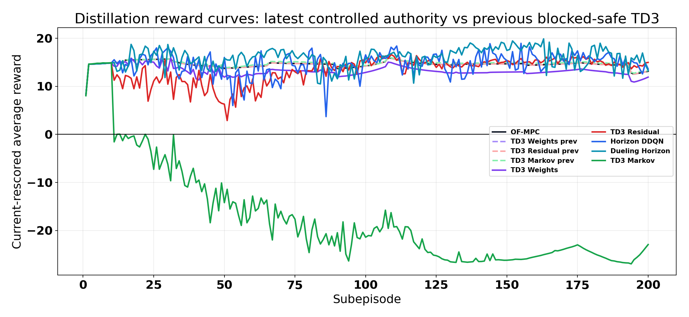
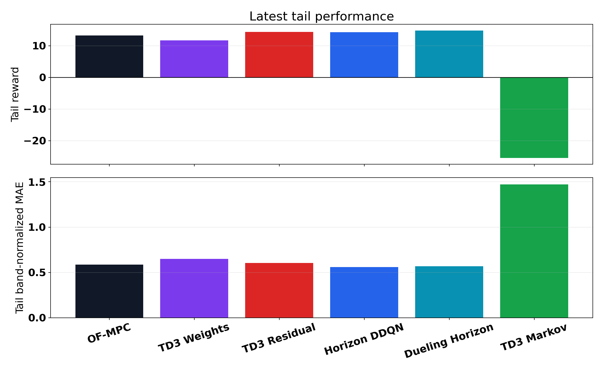
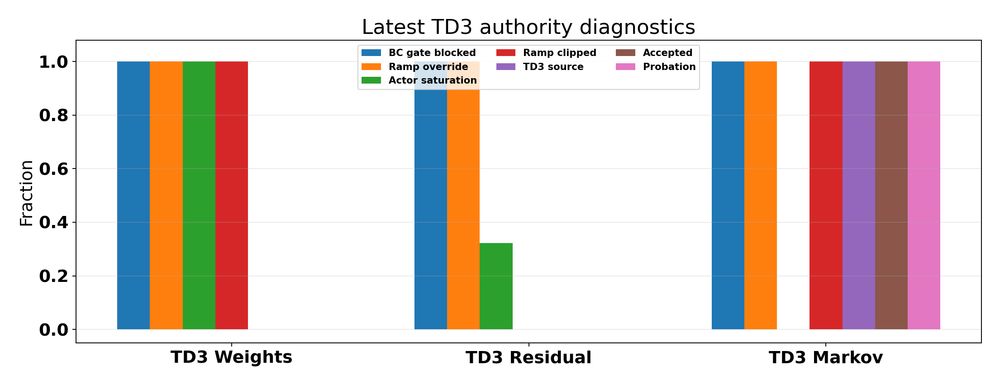
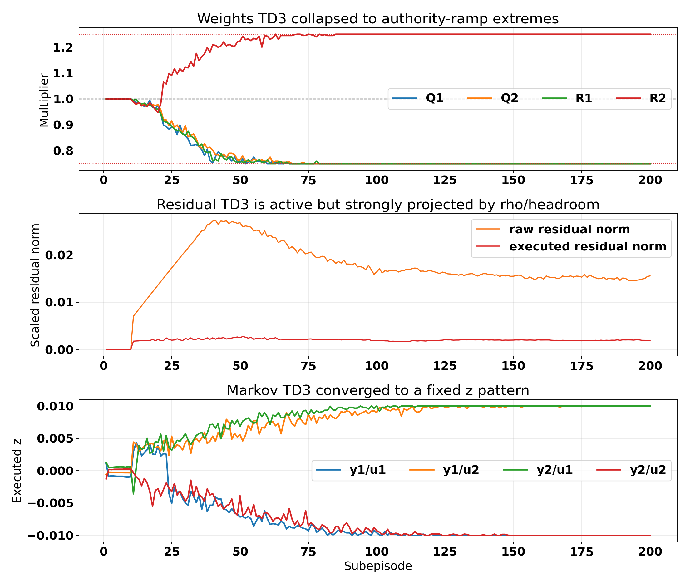
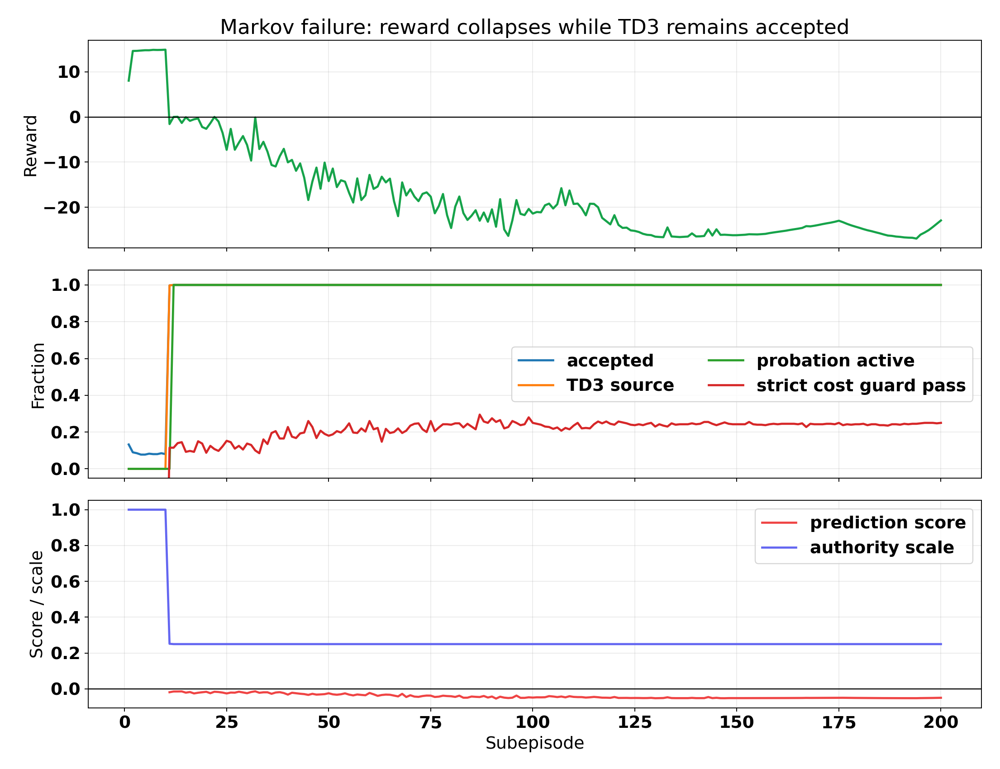
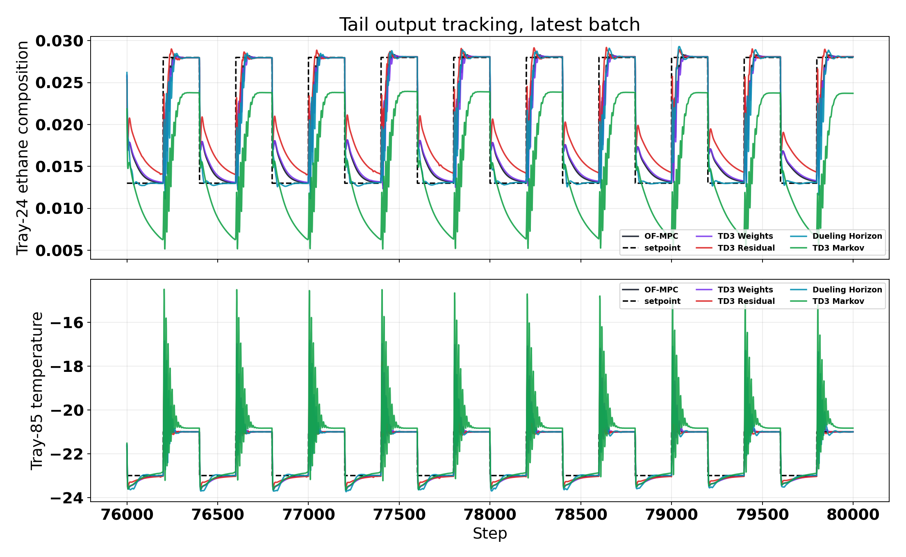

# Distillation Controlled-Authority Failure Analysis

Date: 2026-05-24  
Case study: Aspen distillation column, disturbance profile `fluctuation`  
Runs analyzed: latest five active distillation families from 2026-05-23 evening, plus OF-MPC and the previous blocked-safe TD3 batch from 2026-05-22

## Executive Summary

The latest controlled-authority change made the distillation TD3 behavior worse because we converted the protected-BC release gate from a veto into a diagnostic while the actors were still far from safe behavior. The new authority ramp successfully made TD3 live, but it did not make TD3 safe or useful.

The key diagnosis is:

$$ \text{latest failure} \neq \text{no training update}. $$

The logs show that TD3 was still training. The failure is that the learned actors collapsed into saturated or fixed actions, then the new controlled-authority path allowed those actions into the controller despite the original BC release gate remaining blocked.

The most severe case is Markov:

- Tail reward collapsed from `13.466` in the previous blocked-safe run to `-25.467`.
- Post-warm TD3 source fraction became `1.000`.
- Accepted fraction became `1.000`.
- Reward probation was active in the tail with fraction `1.000`, but it only scaled authority to `0.25`; it did not force fallback.
- The actor saturated at raw action `[-1, 1, 1, -1]`, which became executed `z = [-0.01, 0.01, 0.01, -0.01]`.
- The requested prediction score was negative in the tail: `-0.05095`.
- The strict cost guard passed only `24.7%` of tail steps, but the priority fallback cost cap still allowed TD3 acceptance.

Weights also failed clearly:

- Tail reward dropped from `13.277` to `11.676`.
- The release gate remained blocked `100%` post-warm, but ramp override was active `100%`.
- The actor saturation trace was `1.000` in the tail.
- The final multiplier vector collapsed to `[0.75, 0.75, 0.75, 1.25]`, exactly the ramp-extreme pattern.

Residual is the exception:

- Tail reward improved to `14.378`.
- But it did not become a freely trusted actor. Its raw residual was heavily projected: tail raw residual norm `0.0149`, executed norm `0.0020`, projection active `100%`.
- So residual improvement is best interpreted as a useful small correction under the rho/headroom projection, not proof that the general controlled-authority release is safe.

The DQN horizon families were not damaged by the TD3 authority change. Dueling horizon remains the strongest latest active RL method by tail reward.

## Files Inspected

Latest result bundles:

| Method | Latest bundle |
|---|---|
| TD3 weights | `Distillation/Results/distillation_weights_td3_disturb_fluctuation_mismatch_unified/20260523_204146/input_data.pkl` |
| TD3 residual | `Distillation/Results/distillation_residual_td3_disturb_fluctuation_mismatch_rho_unified/20260523_203649/input_data.pkl` |
| Horizon DDQN | `Distillation/Results/distillation_horizon_disturb_fluctuation_mismatch_unified/20260523_210449/input_data.pkl` |
| Dueling horizon | `Distillation/Results/distillation_dueling_horizon_disturb_fluctuation_mismatch_unified/20260523_210709/input_data.pkl` |
| TD3 Markov | `Distillation/Results/distillation_markov_td3_disturb_fluctuation_unified/20260523_224108/input_data.pkl` |

Reference result bundles:

| Method | Reference bundle |
|---|---|
| OF-MPC | `Distillation/Data/mpc_results_disturb_fluctuation.pickle` |
| TD3 weights previous blocked-safe | `Distillation/Results/distillation_weights_td3_disturb_fluctuation_mismatch_unified/20260522_181031/input_data.pkl` |
| TD3 residual previous blocked-safe | `Distillation/Results/distillation_residual_td3_disturb_fluctuation_mismatch_rho_unified/20260522_180223/input_data.pkl` |
| TD3 Markov previous blocked-safe | `Distillation/Results/distillation_markov_td3_disturb_fluctuation_unified/20260522_190448/input_data.pkl` |

Code paths inspected:

| File | Relevant mechanism |
|---|---|
| `utils/weights_runner.py` | The BC release gate is still blocked, but controlled authority now overrides the hard nominal replacement. |
| `utils/residual_runner.py` | Residual TD3 now passes through ramp clipping and then rho/headroom projection. |
| `utils/markov_runner.py` | Markov TD3 now treats gate-blocked post-warm actions as live if the ramp is enabled. |
| `systems/distillation/notebook_params.py` | Current authority-ramp, protected-BC, TD3 priority, and reward-probation defaults. |
| `utils/behavioral_cloning.py` | BC active window and release-gate thresholds. |

Analysis artifacts:

| Artifact | Purpose |
|---|---|
| `report/scripts/analyze_distillation_controlled_authority_failure_20260524.py` | Recomputes current-reward metrics and authority/failure diagnostics. |
| `report/figures/distillation_controlled_authority_failure_20260524/summary_metrics.csv` | Performance summary. |
| `report/figures/distillation_controlled_authority_failure_20260524/authority_diagnostics.csv` | Gate, ramp, saturation, and acceptance diagnostics. |
| `report/figures/distillation_controlled_authority_failure_20260524/mechanism_summary.json` | Machine-readable summary. |

## What Changed Mechanistically

Before the controlled-authority change, the protected-BC release gate was effectively a hard veto:

$$ a_{\mathrm{exec}} = a_{\mathrm{safe}} \quad \text{if the release gate is blocked}. $$

After the change, the release gate still logs that the actor is unsafe, but the ramp can override that block:

$$ a_{\mathrm{exec}} = \Pi_{\mathcal{A}_{\mathrm{ramp}}}(a_\theta(s)) \quad \text{even when the release gate is blocked}. $$

For weights, the ramp projects physical multipliers around identity:

$$ m_{\mathrm{exec},i} = \mathrm{clip}(m_{\theta,i}, 1-c_k, 1+c_k), \qquad c_k: 0.05 \rightarrow 0.25. $$

For residual, the ramp clips residual input corrections before the existing residual safety layer:

$$ \Delta u_{\mathrm{res,ramp}} = \mathrm{clip}(\Delta u_{\theta}, -c_k, c_k), \qquad c_k: 0.005 \rightarrow 0.02. $$

For Markov, the gate override allows TD3 z proposals through z-safety and the Markov candidate acceptance logic:

$$ z_{\mathrm{exec}} = \Pi_{\mathrm{z\mbox{-}safety}}\left(z_\theta\right). $$

The intended idea was modest: let TD3 touch the plant gently. The observed behavior was different: the actor saturated, and the ramp merely converted saturation into fixed boundary actions.

## Active TD3 Safety Layers And Ranges

This section lists the extra safety and authority layers currently active for the three continuous TD3 families. This is the checklist I would use before changing code again.

### Shared protected-BC release gate

All three TD3 families use a protected behavioral-cloning phase. The actor is trained toward a safe label, but live authority should only release when the policy action is close to that label over one full subepisode.

The BC weight is active for 15 subepisodes and decays exponentially:

$$ \lambda_{\mathrm{BC}}(p) = \lambda_{\mathrm{end}} + (\lambda_{\mathrm{start}}-\lambda_{\mathrm{end}})\frac{\exp(-5p)-\exp(-5)}{1-\exp(-5)}, \qquad \lambda_{\mathrm{start}}=1.0,\quad \lambda_{\mathrm{end}}=0.05. $$

The release gate compares the actor action with the safe target action:

$$ g_t = a_\theta(s_t)-a_{\mathrm{safe},t}. $$

Release requires both:

$$ \frac{1}{W}\sum_{j=t-W+1}^{t} \lVert g_j\rVert_2 \le 0.25,\qquad \max_{j=t-W+1,\dots,t}\lVert g_j\rVert_\infty \le 0.20. $$

Here `W` is one subepisode. In the latest TD3 runs this gate did not release. The controlled-authority ramp made actions live anyway, so the gate became diagnostic rather than binding.

| Family | BC target | Raw actor range | Release rule |
|---|---|---:|---|
| Weights | nominal identity multipliers | `[-1, 1]^4` | mean gap <= `0.25`, max coordinate gap <= `0.20` |
| Residual | executed projection-safe residual action | `[-1, 1]^2` | mean gap <= `0.25`, max coordinate gap <= `0.20` |
| Markov | LS action mapped as `z_to_raw_action(z_LS_safe)` | `[-1, 1]^4` | mean gap <= `0.25`, max coordinate gap <= `0.20` |

### Controlled-authority ramp

The new controlled-authority layer is the one that converted a blocked release gate into a live clipped action. It resolves a cap after warm start:

$$ c_k = c_{\mathrm{start}} + \alpha_k(c_{\mathrm{end}}-c_{\mathrm{start}}),\qquad \alpha_k \in [0,1]. $$

For weights and residual, this cap clips the physical action before execution. For Markov, the cap does not directly clip `z`; it enables live Markov TD3 even when the BC gate is blocked, then Markov-specific priority and z-safety layers take over.

| Family | Ramp units | Start cap | End cap | Ramp length | Current effect |
|---|---|---:|---:|---:|---|
| Weights | multiplier deviation from identity | `0.05` | `0.25` | 30 subepisodes | makes blocked actor executable inside `[1-c_k, 1+c_k]` |
| Residual | scaled input delta | `0.005` | `0.02` | 30 subepisodes | makes blocked actor executable inside `[-c_k, c_k]` before rho/headroom projection |
| Markov | live-release flag only | `0.0` | `0.0` | 1 subepisode | makes blocked actor live, then priority scale and z-safety decide final `z` |

For weights:

$$ m_{\mathrm{ramp},i} = \mathrm{clip}(m_{\theta,i}, 1-c_k, 1+c_k),\qquad m_i \in [0.75,2.0]. $$

For residual:

$$ \Delta u_{\mathrm{ramp},i} = \mathrm{clip}(\Delta u_{\theta,i}, -c_k, c_k),\qquad \Delta u_{\theta,i} \in [-0.02,0.02]. $$

For Markov:

$$ a_{\mathrm{scaled}} = s_k a_\theta,\qquad z_{\mathrm{pre}} = z_{\max} a_{\mathrm{scaled}},\qquad z_{\max}=0.04. $$

The Markov priority scale `s_k` is separate from the controlled-authority ramp. It is `0.25` in the protected phase, ramps to `1.0`, and returns to `0.25` during reward probation.

### Weights safety and range

The weights actor chooses four penalty multipliers:

$$ m = [m_{Q_1},m_{Q_2},m_{R_1},m_{R_2}]. $$

The raw actor action is mapped to physical multiplier bounds:

$$ m_i = 0.75 + \frac{a_i+1}{2}(2.0-0.75),\qquad a_i\in[-1,1]. $$

So the full possible multiplier range is:

| Quantity | Range |
|---|---:|
| raw actor action `a_i` | `[-1, 1]` |
| physical multiplier `m_i` | `[0.75, 2.0]` |
| ramped multiplier early post-warm | `[0.95, 1.05]` |
| ramped multiplier after 30 subepisodes | `[0.75, 1.25]` |

The important detail is that the ramp does not allow the upper full bound `2.0`. It clips around identity. In the failed run the actor saturated, and the ramp converted that to:

$$ m_{\mathrm{exec}} = [0.75,0.75,0.75,1.25]. $$

This is a ramp-boundary policy, not a freely learned use of the full `[0.75,2.0]` multiplier range.

### Residual safety and range

The residual actor chooses an additive scaled-input correction after nominal MPC:

$$ u_{\mathrm{exec}} = u_{\mathrm{MPC}} + \Delta u_{\mathrm{res,exec}}. $$

The raw TD3 action maps to:

$$ \Delta u_{\mathrm{res,raw},i} = -0.02 + \frac{a_i+1}{2}(0.04),\qquad a_i\in[-1,1]. $$

The nominal residual range is therefore:

| Quantity | Range |
|---|---:|
| raw actor action `a_i` | `[-1, 1]` |
| raw residual correction `Delta u_res_raw,i` | `[-0.02, 0.02]` |
| early ramp correction | `[-0.005, 0.005]` |
| final ramp correction | `[-0.02, 0.02]` |

Then the rho/headroom authority projection applies a second, state-dependent cap:

$$ \rho = 1-\exp(-0.55 e_{\max}),\qquad \rho_{\mathrm{eff}} = 0.2 + 0.8\rho. $$

Here `e_max` is the maximum absolute raw tracking error used by the residual authority layer. The executable residual is bounded by:

$$ \Delta u_{\mathrm{res,exec},i} \in [-h_i,h_i],\qquad h_i = \rho_{\mathrm{eff}}\beta_i\left(\lvert \Delta u_{\mathrm{MPC},i}\rvert + d_{0,i}\right). $$

Current defaults are:

| Parameter | Value |
|---|---:|
| `beta_i` | `0.3` |
| `d0_i` | `0.003` |
| `rho_floor` | `0.2` |
| `rho_mapping` | `1 - exp(-0.55 e_max)` |
| zero deadband tracking threshold | `0.1` |
| zero deadband innovation threshold | `0.1` |

A final headroom projection enforces physical scaled-input bounds:

$$ u_{\min} \le u_{\mathrm{MPC}}+\Delta u_{\mathrm{res,exec}} \le u_{\max}. $$

This is why residual improved in the latest batch without becoming fully trusted. The raw residual was still larger than the executed residual, but the state-dependent projection made the actual correction small.

### Markov safety and range

The Markov actor chooses a four-dimensional lifted-response correction:

$$ z = [z_{y_1u_1},z_{y_1u_2},z_{y_2u_1},z_{y_2u_2}]. $$

The raw TD3 action maps to:

$$ z_i = z_{\max}a_i,\qquad a_i\in[-1,1],\qquad z_{\max}=0.04. $$

So the nominal coordinate range is:

| Quantity | Range |
|---|---:|
| raw actor action `a_i` | `[-1, 1]` |
| nominal Markov coordinate `z_i` | `[-0.04, 0.04]` |
| protected z cap | `[-0.02, 0.02]` |
| ramp z cap | `[-0.03, 0.03]` to `[-0.04, 0.04]` |
| full z cap | `[-0.04, 0.04]` |
| probation z cap | `[-0.02, 0.02]` |
| vector 2-norm cap | `0.06` |

The active coordinate cap is:

$$ c_{z,k} = \min(c_{\mathrm{phase},k}, c_{\mathrm{probation}} \ \text{if probation is active}, z_{\max}). $$

The z-safety projection first clips each coordinate:

$$ \tilde{z}_i = \mathrm{clip}(z_i,-c_{z,k},c_{z,k}). $$

Then it projects the vector if the 2-norm is too large:

$$ z_{\mathrm{exec}} = \begin{cases}\tilde{z}, & \lVert \tilde{z}\rVert_2 \le 0.06,\\ 0.06\tilde{z}/\lVert \tilde{z}\rVert_2, & \lVert \tilde{z}\rVert_2 > 0.06. \end{cases} $$

Markov also has TD3-priority candidate checks. A TD3 Markov candidate is allowed only if the solver succeeds, gain drift is below the limit, and the nominal-cost margin is below the phase cap:

$$ d_{\mathrm{gain}} \le 0.10. $$

$$ J_{\mathrm{cand}}-J_0 \le \epsilon_{\mathrm{abs},p}+\epsilon_{\mathrm{rel},p}\lvert J_0\rvert. $$

The current phase caps are:

| Phase | Absolute cost cap | Relative cost cap | Authority scale |
|---|---:|---:|---:|
| protected | `0.02` | `5.0` | `0.25` |
| ramp | `0.05` | `20.0` | `0.25` to `1.0` |
| full | `0.10` | `50.0` | `1.0` |
| reward probation | unchanged cost caps | unchanged cost caps | min with `0.25` |

The prediction-score hard minimum is currently disabled:

$$ s_{\min} = \mathrm{None}. $$

That means a negative prediction score is logged but does not veto the candidate unless another guard fails. This is one reason the failed Markov run could have:

$$ s_{\mathrm{pred}} < 0,\qquad \text{probation active},\qquad \text{TD3 accepted}. $$

### Replay safety detail

The continuous TD3 runs are configured to store executed safe actions where applicable. For Markov:

$$ a_{\mathrm{replay}} = a_{\mathrm{exec}} \quad \text{when executed-action replay is enabled}. $$

For residual, replay uses the projection-safe executed residual action. This is good for consistency, but it also means that if a bad live-authority loop dominates the plant, replay becomes dominated by the filtered behavior from that loop.

## Performance Results

All rewards below are recomputed using the current shared distillation reward settings.

| Method | Batch | Tail reward | Final reward | Band-norm MAE | Outside-band frac |
|---|---|---:|---:|---:|---:|
| OF-MPC | baseline | 13.277 | 13.136 | 0.586 | 0.249 |
| TD3 weights | previous blocked-safe | 13.277 | 13.136 | 0.586 | 0.249 |
| TD3 residual | previous blocked-safe | 13.277 | 13.136 | 0.586 | 0.249 |
| TD3 Markov | previous blocked-safe | 13.466 | 13.267 | 0.577 | 0.242 |
| TD3 weights | latest controlled-authority | 11.676 | 11.914 | 0.650 | 0.269 |
| TD3 residual | latest controlled-authority | 14.378 | 14.969 | 0.605 | 0.251 |
| Horizon DDQN | latest | 14.290 | 13.605 | 0.559 | 0.256 |
| Dueling horizon | latest | 14.791 | 13.309 | 0.569 | 0.256 |
| TD3 Markov | latest controlled-authority | -25.467 | -22.910 | 1.471 | 0.657 |

The latest Markov run is the central failure. It is not a small regression; it is a qualitative collapse.

## Authority Diagnostics

| Method | Gate blocked post-warm | Ramp override post-warm | Actor/ramp saturation tail | TD3 source tail | Accepted tail | Probation tail |
|---|---:|---:|---:|---:|---:|---:|
| TD3 weights | 1.000 | 1.000 | 1.000 | n/a | n/a | n/a |
| TD3 residual | 1.000 | 1.000 | 0.322 | n/a | n/a | n/a |
| TD3 Markov | 1.000 | 1.000 | 1.000 | 1.000 | 1.000 | 1.000 |

This table is the core causal evidence. The old release gate never actually passed. The only reason TD3 became active is that the new ramp override made the gate non-binding.

## Failure Mode 1: Weights Saturated to a Boundary Policy

The latest weights run ended with:

$$ [Q_1, Q_2, R_1, R_2] = [0.75, 0.75, 0.75, 1.25]. $$

That is not a nuanced learned policy. It is the actor saturating, then the authority ramp clipping to its final allowed boundary.

Relevant logs:

| Diagnostic | Value |
|---|---:|
| Release gate release step | `-1` |
| Post-warm release blocked fraction | `1.000` |
| Post-warm ramp override fraction | `1.000` |
| Tail ramp projection fraction | `1.000` |
| Tail action saturation fraction | `1.000` |
| Tail BC policy-target gap | `1.744` |
| Tail reward change vs previous weights | `-1.601` |

The actor did update, but toward a saturated local solution. The update count was not zero: the run stored `39,737` actor loss samples and `79,473` critic loss samples. So the failure is not an inactive optimizer. The failure is that the actor/critic feedback drove the action to the boundary, and the ramp made that boundary executable.

## Failure Mode 2: Markov Accepted a Bad Fixed z Pattern

The latest Markov run is worse because it did not just clip a weight vector; it changed the lifted dynamic response used by MPC. The actor saturated at:

$$ a_\theta = [-1, 1, 1, -1]. $$

With authority scale `0.25` and `z_bound = 0.04`, that became:

$$ z_{\mathrm{exec}} = [-0.01, 0.01, 0.01, -0.01]. $$

The tail logs show this exact fixed pattern:

| Markov diagnostic | Tail value |
|---|---:|
| TD3 source fraction | 1.000 |
| Accepted fraction | 1.000 |
| Probation active fraction | 1.000 |
| Authority scale | 0.250 |
| Requested prediction score | -0.05095 |
| Strict cost-guard pass fraction | 0.247 |
| z-safety cap | 0.020 |
| z-safety projection fraction | 0.000 |
| q95(|z|) | 0.010 |

The important contradiction is:

$$ \text{prediction score} < 0, \qquad \text{probation active} = 1, \qquad \text{accepted} = 1. $$

That means the safety/probation system detected something was wrong but did not actually veto the TD3 action. In the current Markov code, `_td3_priority_candidate_allowed` only enforces prediction score if `score_hard_min` is not `None`. The default is `score_hard_min = None`, so negative prediction score does not block acceptance. The priority cost caps are also very loose, especially with relative caps up to `50.0` in the full phase.

The result is exactly what the plot shows: reward collapses while TD3 remains accepted.

## Failure Mode 3: BC Was Too Short to Anchor the Actor

Protected BC was active for 15 subepisodes, which corresponds to `6000` steps. After that, the BC weight decays to zero and the actor is controlled mainly by TD3 critic feedback.

Evidence:

| Method | BC active steps | Tail BC gap |
|---|---:|---:|
| TD3 weights | 6000 | 1.744 |
| TD3 residual | 6000 | 0.656 |
| TD3 Markov | 6000 | 0.140 |

For weights, the tail BC gap is very large. For Markov, the raw gap is smaller because the executed action is scaled, but the actor itself is saturated and the original release gate still remains blocked. So BC did not produce a robust safe actor before live authority was granted.

The previous blocked-safe runs had the same release-gate problem, but they avoided collapse by keeping the actor out of the plant. The latest runs removed that protection before the actor was actually ready.

## Failure Mode 4: Reward Probation Was Not a Fallback

The Markov reward-probation system did detect collapse:

- Tail probation active fraction was `1.000`.
- Probation trigger count was `190`.
- The warm reference reward was about `14.87`.
- Tail reward was `-25.47`.

But probation only reduced authority scale to `0.25`; it did not force nominal or LS fallback. That was not strong enough. The fixed z pattern at 25% authority still destabilized tracking.

In this case, probation should have meant:

$$ \text{if reward collapses, execute nominal or LS fallback until recovery}. $$

Instead, the effective behavior was:

$$ \text{if reward collapses, keep executing the same TD3 pattern at 25% scale}. $$

That explains why the local minimum persisted.

## Failure Mode 5: The Markov Candidate Guard Is Model-Internal

The Markov candidate guard evaluates lifted-MPC candidate quality under the identified linear model and Markov-corrected response. It does not directly know whether the nonlinear Aspen plant will behave well.

That is why a small-looking z norm can still be bad:

$$ \lVert z \rVert_2 \approx 0.02 \quad \nRightarrow \quad \text{safe nonlinear closed-loop behavior}. $$

The tail tracking plot confirms this. Markov temperature tracking develops large oscillatory spikes, and composition tracking repeatedly undershoots the setpoint.

## Why Residual Did Not Collapse

Residual is the one useful signal in the batch. It improved tail reward relative to OF-MPC by about `+1.10`. But the reason is not that the raw actor is now trustworthy.

Residual diagnostics:

| Diagnostic | Tail value |
|---|---:|
| Raw residual norm | 0.0149 |
| Executed residual norm | 0.0020 |
| Projection active fraction | 1.000 |
| Projection due to authority fraction | 0.691 |
| Tail reward delta vs previous residual | +1.101 |

So residual worked because the safety projection made the executed residual tiny and structured. This is exactly the family where a small projected correction can help without changing the MPC model or weights globally.

The lesson is not "all TD3 authority is bad." The lesson is:

- residual authority can be useful when the final executed action is strongly safety-filtered;
- weights and Markov need stricter usefulness gates before they get live authority.

## Root Cause Summary

The failure chain is:

1. Protected BC trained early, but did not make the continuous actors pass the release gate.
2. The old release gate still stayed blocked for weights, residual, and Markov.
3. The new controlled-authority ramp overrode the blocked gate anyway.
4. Weights and Markov actors saturated to boundary/fixed actions.
5. The ramp clipped saturation, but did not make the resulting action useful.
6. Markov reward probation detected collapse but only scaled authority; it did not fallback.
7. Markov candidate acceptance allowed negative prediction-score candidates because `score_hard_min = None`.
8. The bad action became self-reinforcing through replay and critic updates, producing the observed local minimum.

This is why it looked "not updated." It was updating, but updating inside a bad closed-loop data distribution generated by its own saturated actions.

## Immediate Recommendations

### Do Not Rerun the Same Controlled-Authority Defaults

The latest Markov run is too unsafe to repeat as-is. It is not a noisy bad seed; the logs show a deterministic mechanism.

### Markov: Revert Live TD3 Authority First

Recommended immediate Markov changes:

- Turn off the Markov gate override.
- Require `score_hard_min > 0`, not `None`.
- Require the stricter cost guard to pass before TD3 execution.
- If reward probation is active, force nominal or LS fallback instead of merely scaling TD3.
- Keep z-safety, but do not treat z-norm safety as sufficient for closed-loop safety.

A safe Markov next run should have:

$$ \text{TD3 source fraction} = 0 \quad \text{until prediction score and reward probation agree}. $$

### Weights: Remove Ramp Override or Add MPC Usefulness Gate

Recommended immediate weights changes:

- Disable weight live-authority override.
- Or reduce cap to `0.02 -> 0.05`, not `0.05 -> 0.25`.
- Add a candidate MPC usefulness check before executing changed weights.
- Add anti-saturation penalty or BC tail anchor so the actor cannot settle at `[0.75, 0.75, 0.75, 1.25]`.

The current weight result shows that multiplier authority is too global: once it chooses a bad penalty vector, the entire MPC objective is distorted.

### Residual: Keep, But Study Carefully

Residual should not be rolled back immediately. It is the only continuous TD3 run that improved. But the next residual report must verify:

- whether the improvement is consistent across seeds;
- whether projection remains responsible for safety;
- whether raw/executed residual ratio remains bounded;
- whether the actor learns a meaningful residual or only benefits from projection-shaped noise.

### DQN/Dueling Horizon: Leave Alone

The horizon families are not part of the TD3 controlled-authority failure. Dueling horizon remains the strongest active learned controller in this latest batch.

## Concrete Next Experiment

Run a small corrected TD3 diagnostic batch:

1. Markov: live TD3 disabled; LS/nominal fallback only; keep logging TD3 shadow proposals.
2. Weights: live TD3 disabled or cap reduced to `0.02 -> 0.05`; log shadow candidate multipliers.
3. Residual: keep latest residual setup as the only live TD3 branch.
4. Add hard abort/fallback if any subepisode reward drops more than `3.0` below the warm-reference reward for two consecutive subepisodes.
5. Extend BC or tail-anchor BC until the release gate passes, instead of stopping BC after 15 subepisodes.

Acceptance criterion for the next batch:

| Metric | Required behavior |
|---|---|
| Markov reward | No negative-reward collapse |
| Markov TD3 source | 0 until positive prediction score and no probation |
| Weights multipliers | Not stuck at ramp extremes |
| Residual reward | Maintains improvement without projection explosion |
| Release gate | Either passes naturally or remains a hard veto |

## Bottom Line

The latest controlled-authority experiment answered the question very clearly: TD3 should not be allowed into distillation just because its action is clipped. Clipping bounded the action magnitude, but it did not guarantee usefulness.

For distillation, the next safe path is:

$$ \text{protected BC} + \text{hard release/usefulness gate} + \text{fallback-on-probation}, $$

not:

$$ \text{protected BC} + \text{always-live clipped saturated actor}. $$

Residual remains promising because its safety projection is strong and local. Weights and Markov need their live authority pulled back until the candidate checks become real vetoes again.
