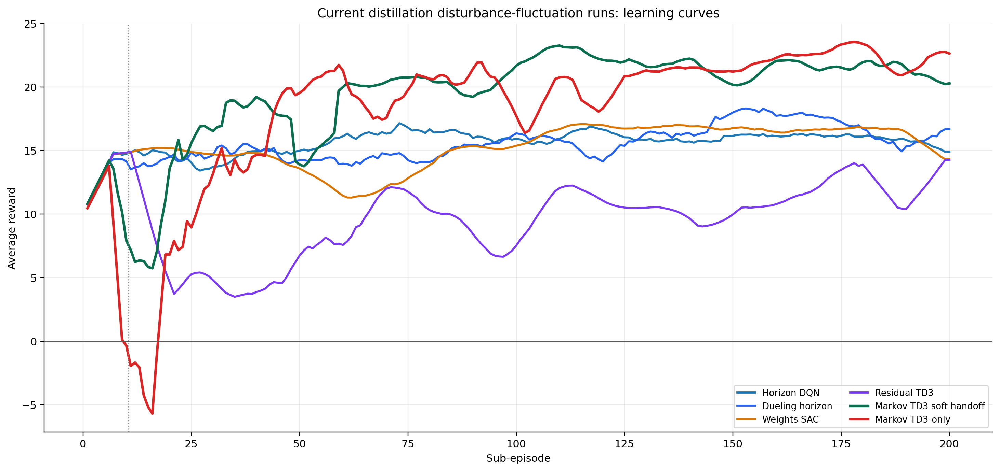
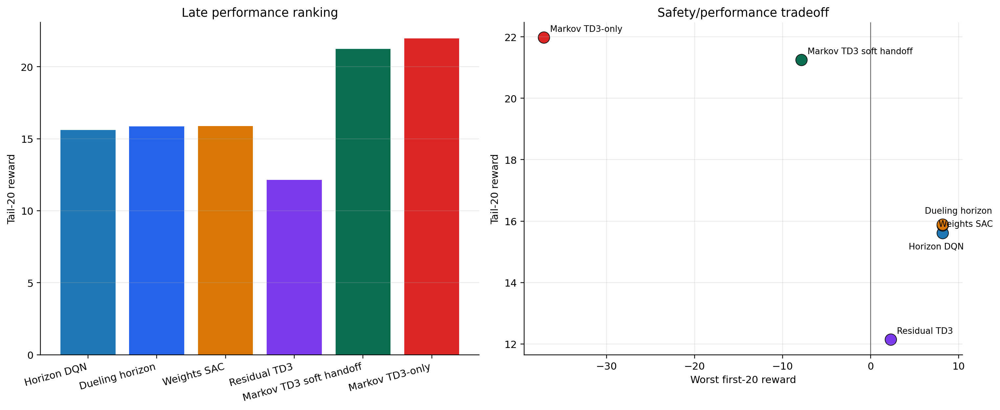
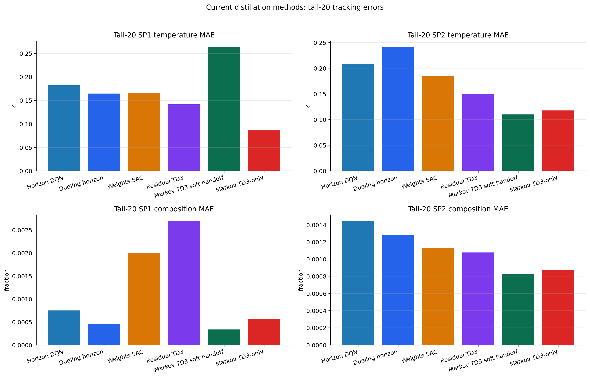
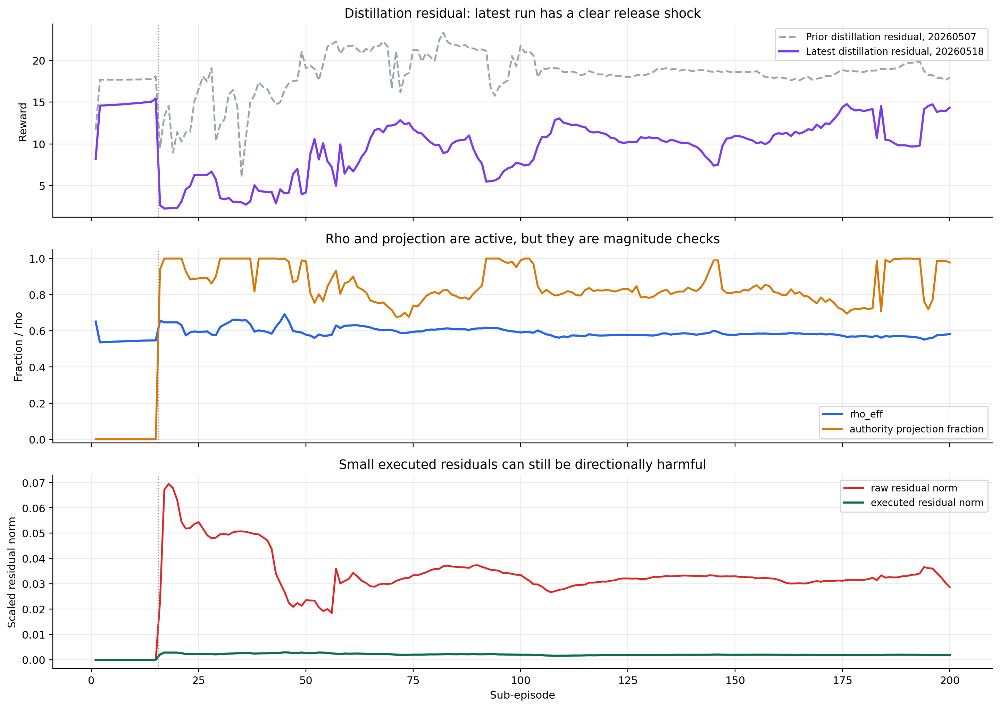
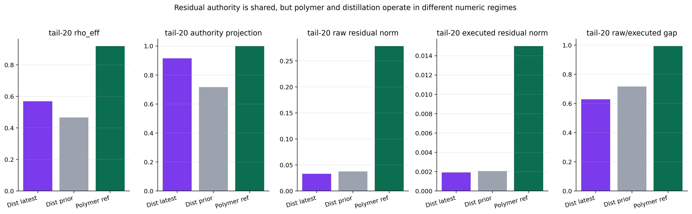

# Current Distillation Methods Safety Audit

Date: 2026-05-18

## Objective

Analyze the current comparable distillation disturbance-fluctuation runs from May 18, excluding matrix, structured-matrix, and reidentification methods. The main goal is to compare performance, quantify release risk, and decide what a generic safety layer should check before an assisted action reaches the plant.

Generated assets:

- `report/scripts/analyze_distillation_current_methods_safety_20260518.py`
- `report/figures/distillation_current_methods_safety_20260518/`

## Runs Compared

| Method | Run folder |
| --- | --- |
| MPC reference | `Distillation/Data/mpc_results_disturb_fluctuation.pickle` |
| Horizon DQN mismatch | `Distillation/Results/distillation_horizon_disturb_fluctuation_mismatch_unified/20260518_141636/` |
| Dueling horizon mismatch | `Distillation/Results/distillation_dueling_horizon_disturb_fluctuation_mismatch_unified/20260518_140746/` |
| Weights SAC mismatch | `Distillation/Results/distillation_weights_sac_disturb_fluctuation_mismatch_unified/20260518_142138/` |
| Residual TD3 mismatch/rho | `Distillation/Results/distillation_residual_td3_disturb_fluctuation_mismatch_rho_unified/20260518_135423/` |
| Markov TD3 soft handoff | `Distillation/Results/distillation_markov_td3_disturb_fluctuation_unified/20260518_184548/` |
| Markov TD3-only no safeguard | `Distillation/Results/distillation_markov_td3_disturb_fluctuation_td3_only_no_safeguard_unified/20260518_091937/` |

The old combined run is not ranked because the saved combined run is nominal-only, not the current disturbance-fluctuation setup.

## Reward Comparison

Most current May 18 runs use the temperature-emphasis reward geometry, but the report still compares each run against its own saved `avg_rewards_mpc` where available. This avoids claiming that older or differently logged reward traces are perfectly interchangeable.

| Method | Mean reward | Tail-20 | Final | Best episode | Worst first-20 | Tail-20 vs own MPC |
| --- | ---: | ---: | ---: | ---: | ---: | ---: |
| Horizon DQN | `15.6457` | `15.6092` | `14.6759` | `18.2431` ep. `84` | `8.1755` | `+1.7108` |
| Dueling horizon | `15.5315` | `15.8585` | `16.7153` | `19.5943` ep. `150` | `8.1755` | `+1.9602` |
| Weights SAC | `15.2818` | `15.8847` | `14.2946` | `17.4390` ep. `116` | `8.1755` | `+1.9864` |
| Residual TD3 | `9.7497` | `12.1396` | `14.3457` | `15.4328` ep. `15` | `2.2857` | `-1.7587` |
| Markov TD3 soft handoff | `19.3342` | `21.2472` | `20.3863` | `24.0631` ep. `105` | `-7.8572` | `+7.3489` |
| Markov TD3-only | `18.1931` | `21.9784` | `22.2229` | `24.2982` ep. `178` | `-37.1003` | `+8.0801` |

The ranking is clear:

1. Markov TD3-only has the highest late reward.
2. Markov soft handoff is close in tail-20 reward and much safer during release.
3. Horizon, dueling horizon, and weights SAC form a stable middle group around `15.6-15.9` tail-20 reward.
4. The latest residual TD3 run is the weakest current run, despite recovering by the final episode.

## Tracking Comparison

Tail-20 tracking shows why reward alone is not enough. Markov TD3-only has the best SP1 temperature and strong composition tracking. Markov soft handoff has excellent composition and SP2 temperature, but its SP1 temperature is worse than the other current methods.

| Method | SP1 temp MAE | SP2 temp MAE | SP1 comp MAE | SP2 comp MAE |
| --- | ---: | ---: | ---: | ---: |
| Horizon DQN | `0.1822 K` | `0.2087 K` | `0.000752` | `0.001444` |
| Dueling horizon | `0.1644 K` | `0.2413 K` | `0.000453` | `0.001284` |
| Weights SAC | `0.1655 K` | `0.1849 K` | `0.002008` | `0.001133` |
| Residual TD3 | `0.1417 K` | `0.1503 K` | `0.002695` | `0.001078` |
| Markov TD3 soft handoff | `0.2634 K` | `0.1101 K` | `0.000337` | `0.000831` |
| Markov TD3-only | `0.0862 K` | `0.1179 K` | `0.000561` | `0.000873` |
| MPC reference | `0.1717 K` | `0.2125 K` | `0.001508` | `0.001582` |

Interpretation:

- TD3-only Markov is the best current controller on reward and SP1 temperature, but it is not safe during release.
- Soft handoff keeps almost all the Markov reward benefit, but it trades back some SP1 temperature quality.
- Residual TD3 improves both temperature blocks relative to MPC, but composition tracking is poor and the reward remains below MPC in tail-20.
- Horizon and dueling horizon are stable and useful, but their late reward is far below the Markov family.

## Markov Soft Handoff

The latest soft-handoff Markov run is important because it proves that the new TD3-priority path is not returning to the old fallback-dominated behavior.

Key facts:

- tail-20 reward: `21.2472`
- TD3-only tail-20 reward: `21.9784`
- worst first-20 reward: `-7.8572`
- TD3-only worst first-20 reward: `-37.1003`
- TD3 fraction overall: `0.9500`
- TD3 fraction in tail-20: `1.0000`
- nominal fallback overall: `0.0466`
- LS fallback overall: `0.0000`
- probation trigger count: `8`
- probation active episodes: `12-18`, `28-29`, `54-55`

The soft handoff is therefore doing the right thing: it softens the release and keeps TD3 as the main decision source. It does not fully solve catastrophic-risk prevention, because the soft-handoff run still has negative release episodes and one later reward dip around episode `53`.

## Residual TD3

The latest residual run is:

`Distillation/Results/distillation_residual_td3_disturb_fluctuation_mismatch_rho_unified/20260518_135423/`

It confirms the earlier live-run concern:

- tail-20 reward: `12.1396`
- final reward: `14.3457`
- first-20 minimum: `2.2857`
- prior saved distillation residual tail-20 reward: `18.8243`
- latest tail-20 `rho_eff`: `0.5684`
- latest tail-20 authority projection fraction: `0.9150`
- latest tail-20 raw residual norm: `0.0331`
- latest tail-20 executed residual norm: `0.00192`
- latest tail-20 raw/executed action gap: `0.6284`

The residual mechanism is active. The issue is not missing rho or missing projection. The issue is that rho/projection asks how large the residual is allowed to be, not whether the residual direction is useful.

The cross-case residual comparison shows that polymer and distillation use the same shared methodology, but not the same numeric regime:

| Tail-20 metric | Distillation latest | Distillation prior | Polymer reference |
| --- | ---: | ---: | ---: |
| `rho_eff` | `0.5684` | `0.4664` | `0.9181` |
| authority projection fraction | `0.9150` | `0.7165` | `0.9990` |
| raw residual norm | `0.0331` | `0.0377` | `0.2783` |
| executed residual norm | `0.00192` | `0.00207` | `0.01498` |
| raw/executed action gap | `0.6284` | `0.7163` | `0.9926` |

The polymer residual can tolerate much larger executed residuals. Distillation is more direction-sensitive: a small residual can still harm composition or temperature because the two controlled outputs are tightly coupled.

## Safety-Layer Activation Audit

The safety-layer audit uses exact logs where available and proxy triggers where the current bundle does not save candidate-vs-nominal diagnostics.

Exact logs available:

- Markov: cost margin, gain drift, prediction score, action source, authority scale, probation
- Residual: rho, rho_eff, projection reason, raw/executed gap, residual norms

Proxy logs only:

- horizon, dueling horizon, weights: reward-collapse and move-change proxies

| Method | Combined safety proxy episodes | Main reason |
| --- | ---: | --- |
| Horizon DQN | `1` | first-episode transient only |
| Dueling horizon | `2` | first episode plus one release-period dip |
| Weights SAC | `12` | move-change proxy around episodes `56-66` |
| Residual TD3 | `186` | persistent projection/raw-executed-gap risk plus reward-collapse period |
| Markov TD3 soft handoff | `31` | actual authority ramp/probation/fallback plus a few reward dips |
| Markov TD3-only | `20` | reward-collapse and move-change proxy, with no active protection |

The activation audit says:

- A hard safety layer would mostly stay quiet for horizon and dueling horizon.
- It would inspect weights SAC around the move-change burst.
- It would be active heavily for residual, because projection and raw/executed gaps are persistent.
- It would be crucial for Markov TD3-only during release.
- For Markov soft handoff, the current probation already catches much of the early risk, but not every bad outcome.

## Safety-Layer Recommendation

The next safety layer should be shared and method-independent:

$$ u_{\mathrm{nom},k} = \mathrm{MPC}(x_k, y_{\mathrm{sp},k}) $$

$$ u_{\mathrm{cand},k} = u_{\mathrm{nom},k} + \Delta u_{\mathrm{RL},k} $$

Then evaluate before plant application:

$$ \Delta J_k = \frac{J_{\mathrm{nom}}(u_{\mathrm{cand},k}) - J_{\mathrm{nom}}(u_{\mathrm{nom},k})}{\max(1,\lvert J_{\mathrm{nom}}(u_{\mathrm{nom},k})\rvert)}. $$

The decision should be:

- execute the candidate when risk is low
- shrink or blend when risk is moderate
- fall back to nominal MPC only when risk is catastrophic or candidate evaluation fails

For replay correctness:

$$ (s_k, a_{\mathrm{exec},k}, r_k, s_{k+1}) $$

must use the executed action. The raw candidate should be logged separately as diagnostic data.

## Method-Specific Next Steps

### Markov

Keep the soft handoff. It is the best current compromise between TD3 authority and release safety.

Next improvement:

- add a shared safety evaluator after TD3 action scaling
- keep probation as a release mechanism
- add predicted tracking-risk checks, because cost margin and gain drift did not fully prevent negative reward

### Residual

Keep rho enabled, but add a direction-aware screen after rho projection.

The first residual safety diagnostic should compare one-step predicted tracking error:

$$ E_{\mathrm{res},k}^{+} - E_{\mathrm{nom},k}^{+}. $$

If the residual-applied first move increases predicted tracking error beyond a phase-aware cap, shrink the residual:

$$ \Delta u_{\mathrm{exec},k} = \alpha_k \Delta u_{\mathrm{res},k}. $$

Recommended first changes:

- add residual authority ramp after the freeze window
- add reward-collapse probation like Markov
- add residual one-step shadow evaluator
- log `residual_safety_scale`, `residual_safety_reason`, and `residual_predicted_error_margin`

### Horizon, Dueling, And Weights

These methods look much safer in the current May 18 runs, but their saved bundles do not yet contain enough candidate-vs-nominal diagnostics for a real safety gate.

Before deploying a shared safety layer here, add:

- candidate nominal objective
- candidate first move
- nominal first move
- predicted tracking margin
- safety decision and reason logs

## Main Conclusion

The current distillation results point to a clear hierarchy.

Markov TD3 is the most promising family. TD3-only shows the strongest learned behavior, while soft handoff makes it usable by reducing the worst release shock from `-37.1003` to `-7.8572` and still keeping TD3 active in `100%` of tail-20 steps.

Residual TD3 is not broken at the wiring level, but it needs a direction-aware safety layer. The rho mechanism is active and frequently projecting, but that is not enough for distillation because small residuals can be harmful if their direction is wrong.

The shared safety layer should not be a return to conservative fallback. It should be a candidate evaluator that preserves learned authority while blocking or shrinking only the actions that are predicted to be harmful.

## Remaining Uncertainty

- This is a latest-run comparison, not a multi-seed study.
- Safety activation for horizon, dueling horizon, and weights is proxy-based because full candidate diagnostics are not saved.
- The residual comparison shows different numeric regimes, but proving the exact bad direction requires one-step residual shadow predictions in the runner.
- Matrix, structured-matrix, and reidentification families were intentionally excluded from this pass.
