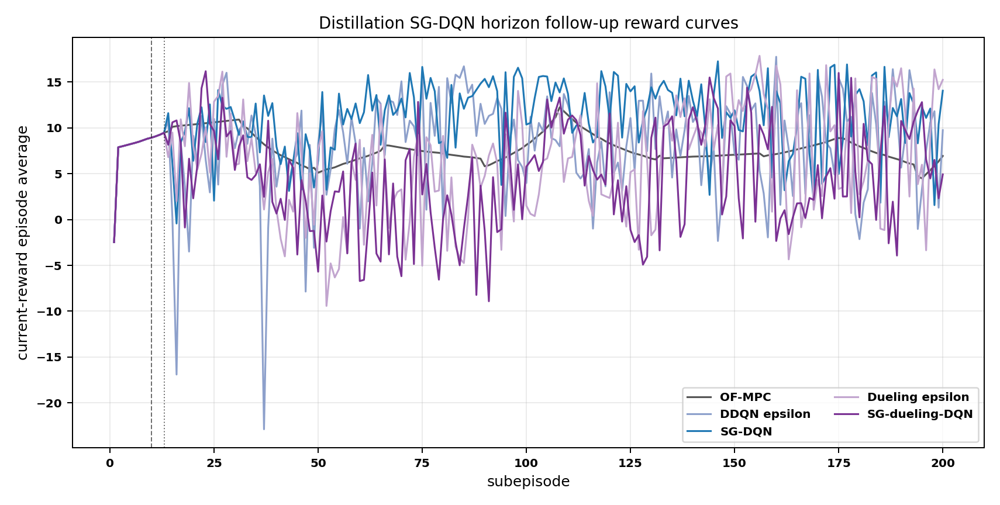
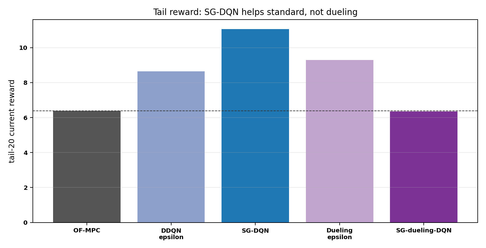
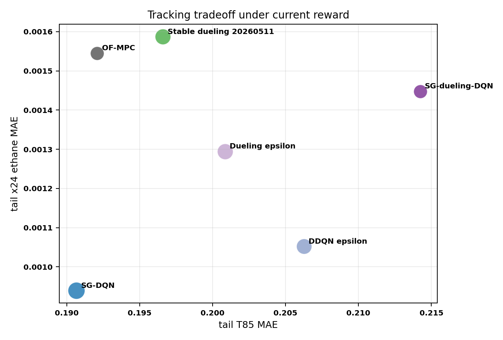
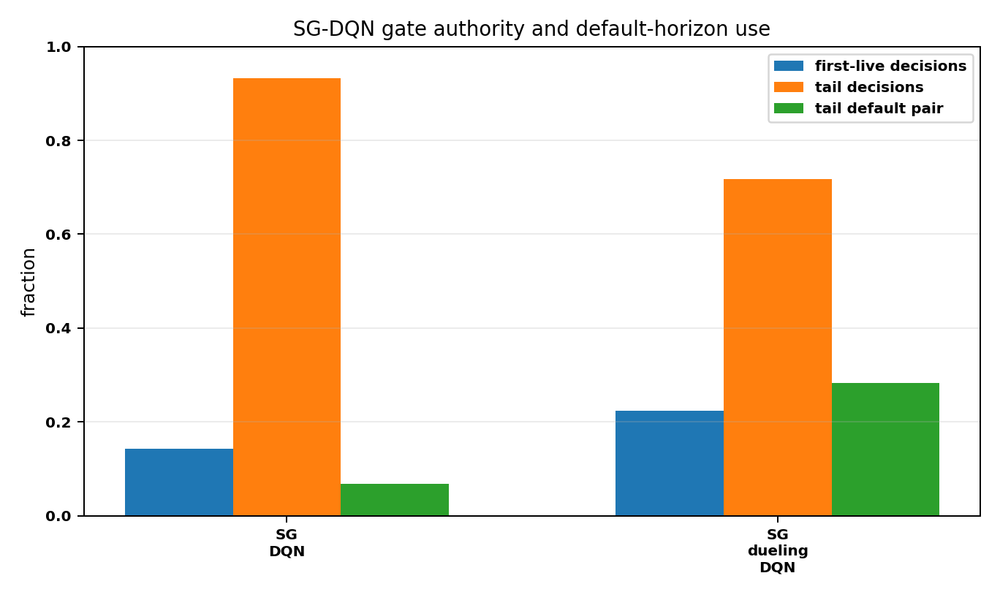
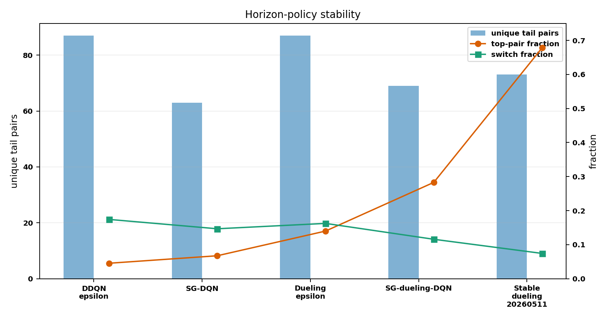
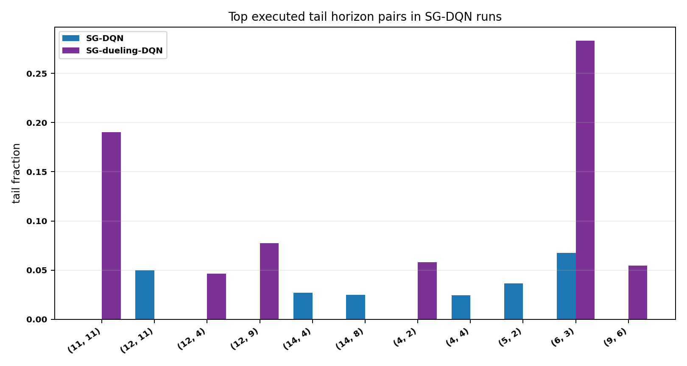

# Distillation Horizon and SG-DQN History

Date: 2026-06-04

## Objective

This report first reviews the distillation dueling-horizon DQN family, including both `standard` and `mismatch` state modes, across all saved disturbed-fluctuation run bundles found under `Distillation/Results/`. It then extends that history with the completed June 4 SG-DQN and SG-dueling-DQN horizon runs. The goal is to explain why earlier dueling-horizon runs looked more successful, why the SG-dueling result is weaker than expected, and what horizon recipe range or candidates look better for the next ablation.

No Aspen run was launched for this analysis. All results are from saved `input_data.pkl` bundles.

## Executive Summary

The older success was not only a reward artifact, but reward drift explains a large part of the visual difference. Older good-looking runs often used the legacy horizon reward with `Q2 = 1500`, `k_rel[1] = 0.02`, and `band_floor_T = 0.3`. Current runs use a much harsher temperature objective, `Q2 = 20000`, `k_rel[1] = 0.01`, and `band_floor_T = 0.2`.

Under common current-reward rescoring, several older dueling trajectories still beat OF-MPC, but the mechanism is narrower than the logged rewards suggested. Successful dueling runs either protect T85 near OF-MPC while improving composition, or they concentrate on a useful small set of horizon recipes. Failed recent runs often worsen T85 and churn across too many recipes.

The best current-reward saved dueling trajectory is an April standard-state run, `20260410_114609`, with tail reward `10.60` versus OF-MPC `6.39`, but it is not a stable policy: it uses `86` of `87` recipes in the tail and its top recipe appears only `4%`. The most stable strong mismatch run is `20260511_131656`, with tail reward `9.08`, top recipe `(6, 3)` at `67.8%`, and tail T85 MAE `0.197`.

The latest completed dueling mismatch run, `20260603_130106`, is better than the June 1 and June 2 runs under current reward: tail reward `9.29`, delta `+2.90` versus OF-MPC. But it still churns across all `87` recipes and ends with epsilon about `0.133`, so it is not yet a settled controller.

The June 4 SG-DQN follow-up splits the story. Standard SG-DQN is a real improvement: tail reward rises to `11.06`, the worst post-warm episode improves from `-22.86` to `-0.44`, and tail T85 MAE improves from `0.2063` to `0.1907`. SG-dueling-DQN is the disappointing run: tail reward drops to `6.35`, essentially OF-MPC level, negative post-warm episodes increase to `43`, and tail T85 MAE worsens to `0.2142`.

The SG-dueling failure is not caused by epsilon staying high; the corrected schedule reaches `0.02`. It is also not caused by the old horizon safety layer, which is disabled. The gate accepts the SG-dueling policy on `71.7%` of tail decision points, but the accepted dueling schedule concentrates around `(6, 3)` and `(11, 11)` while still worsening T85. In other words, the gate reduces random churn but does not guarantee that the dueling Q ranking is aligned with the current reward.

## Files Inspected

- `Distillation/Results/distillation_dueling_horizon_disturb_fluctuation_standard_unified/*/input_data.pkl`
- `Distillation/Results/distillation_dueling_horizon_disturb_fluctuation_mismatch_unified/*/input_data.pkl`
- `Distillation/Results/distillation_horizon_sg_dqn_critic_warm3_default_ofmpc_eps02_002_disturb_fluctuation_mismatch/20260604_103231/input_data.pkl`
- `Distillation/Results/distillation_compare_horizon_sg_dqn_critic_warm3_default_ofmpc_eps02_002_disturb_fluctuation/20260604_103242/input_data.pkl`
- `Distillation/Results/distillation_dueling_horizon_sg_dqn_critic_warm3_default_ofmpc_eps02_002_disturb_fluctuation_mismatch/20260604_105140/input_data.pkl`
- `Distillation/Results/distillation_compare_dueling_horizon_sg_dqn_critic_warm3_default_ofmpc_eps02_002_disturb_fluctuation/20260604_105151/input_data.pkl`
- `Distillation/Results/distillation_horizon_disturb_fluctuation_mismatch_unified/20260603_130635/input_data.pkl`
- `Distillation/Results/distillation_dueling_horizon_disturb_fluctuation_mismatch_unified/20260603_130106/input_data.pkl`
- `Distillation/Data/mpc_results_disturb_fluctuation.pickle`
- `systems/distillation/config.py`
- `systems/distillation/notebook_params.py`
- `distillation_RL_assisted_MPC_horizons_dueling_unified.py`
- `distillation_RL_assisted_MPC_horizons_supervisor_gated_dueling_dqn_unified.py`
- `distillation_RL_assisted_MPC_horizons_supervisor_gated_dqn_unified.py`
- `utils/horizon_runner_dueling.py`
- `utils/horizon_runner.py`
- `utils/rewards.py`
- `DQN/supervisor_gated_dqn_agent.py`
- `DuelingDQN/supervisor_gated_dueling_dqn_agent.py`
- Prior reports:
  - `report/distillation_horizon_dqn_dueling_diagnosis_2026_06_02.md`
  - `report/distillation_horizon_agents_failure_analysis_2026_06_01.md`
  - `report/distillation_run_history_audit_2026_05_19.md`
  - `report/distillation_weights_horizon_next_experiments_2026_06_03.md`

## Analysis Artifacts

Script:

```powershell
C:\Users\hamediaa\.conda\envs\rl-env\python.exe report\scripts\analyze_distillation_dueling_horizon_history_20260604.py
C:\Users\hamediaa\.conda\envs\rl-env\python.exe report\scripts\analyze_distillation_sg_dqn_horizon_followup_20260604.py
```

Generated outputs:

- `report/figures/distillation_dueling_horizon_history_20260604/dueling_horizon_history_summary.csv`
- `report/figures/distillation_dueling_horizon_history_20260604/dueling_horizon_unique_trajectory_summary.csv`
- `report/figures/distillation_dueling_horizon_history_20260604/recommended_horizon_pairs.csv`
- `report/figures/distillation_dueling_horizon_history_20260604/recommended_horizon_ranges.csv`
- `report/figures/distillation_dueling_horizon_history_20260604/summary.json`
- `report/figures/distillation_dueling_horizon_history_20260604/sg_dqn_followup_summary.csv`
- `report/figures/distillation_dueling_horizon_history_20260604/sg_dqn_followup_comparisons.csv`
- `report/figures/distillation_dueling_horizon_history_20260604/sg_dqn_followup_top_pairs.csv`
- `report/figures/distillation_dueling_horizon_history_20260604/sg_dqn_followup_summary.json`

The scan found `22` saved dueling run folders but only `17` unique trajectories. Some timestamped folders are exact duplicate trajectories, so the report avoids treating folder count as independent evidence.

## Method Differences Across Runs

The historical scan covers saved dueling DDQN value-architecture runs. The SG follow-up covers both standard SG-DQN and SG-dueling-DQN. Both SG wrappers use the OF-MPC default horizon `(6, 3)` as the supervisor action, disable the older horizon safety/probation layer, and use the corrected epsilon schedule on decision-call scale.

Important differences across the dueling runs are:

| Axis | Older runs | Later runs | Why it matters |
|---|---:|---:|---|
| State mode | `standard` in April, then `mismatch` | mostly `mismatch` | Mismatch adds innovation and tracking-error features; it is richer, but not automatically more stable. |
| Reward | often `Q2 = 1500` or `5000` | `Q2 = 20000` after May 30 | Current reward punishes T85 error much more strongly. |
| Temperature band | often `k_rel[1] = 0.02`, floor `0.3` | `k_rel[1] = 0.01`, floor `0.2` | Current reward has a tighter temperature acceptable band. |
| Replay capacity | `40000`, `150000`, then `50000`, then `150000` | latest restored to `150000` | The 50k period cannot retain the full 80k-step run distribution. |
| Horizon recipes | `87`, then widened to `263`, then back to `87` | current is `87` | The 263-action space strongly increased churn and worsened results. |
| Exploration | mostly NoisyNet | latest epsilon-greedy | Latest epsilon schedule still leaves tail epsilon near `0.133`, not `0.02`. |

## Reward Provenance

Current reward parameters:

| Quantity | Value |
|---|---:|
| `Q_diag` | `[37000, 20000]` |
| `R_diag` | `[2500, 2500]` |
| `k_rel` | `[0.3, 0.01]` |
| `band_floor_phys` | `[0.003, 0.2]` |
| `beta` | `7.0` |
| `reward_scale` | `1.0` |

Legacy horizon reward parameters:

| Quantity | Value |
|---|---:|
| `Q_diag` | `[37000, 1500]` |
| `R_diag` | `[2500, 2500]` |
| `k_rel` | `[0.3, 0.02]` |
| `band_floor_phys` | `[0.003, 0.3]` |
| `beta` | `7.0` |
| `reward_scale` | `1.0` |

The key reward mechanism is:

$$ b_{i,k} = \frac{\max(k_{\mathrm{rel},i} \lvert y_{\mathrm{sp},i,k}^{\mathrm{phys}}\rvert, b_{\mathrm{floor},i}^{\mathrm{phys}})}{y_{\max,i} - y_{\min,i}}. $$

So lowering the temperature band from `0.3` to `0.2` and increasing `Q2` from `1500` to `20000` sharply changes what counts as a successful T85 trajectory.


Interpretation:

- Many old logged rewards are not comparable with current logged rewards.
- Some old runs still beat OF-MPC under current rescoring, so reward drift is not the whole story.
- The latest epsilon-greedy run is a real improvement over the June 1 and June 2 dueling runs under current reward.

## Best And Failed Runs

OF-MPC disturbed-fluctuation reference:

| Metric | Value |
|---|---:|
| Current reward tail-20 | `6.391` |
| Legacy reward tail-20 | `17.298` |
| Tail x24 MAE | `0.001545` |
| Tail T85 MAE | `0.1921` |

Representative dueling runs:

| Run | State | Current tail reward | Delta vs OF-MPC | Legacy tail reward | Tail x24 MAE | Tail T85 MAE | Unique tail pairs | Top pair | Top frac |
|---|---|---:|---:|---:|---:|---:|---:|---|---:|
| `20260410_114609` | standard | `10.602` | `+4.211` | `21.436` | `0.000913` | `0.1913` | `86` | `(8, 4)` | `0.040` |
| `20260511_131656` | mismatch | `9.084` | `+2.693` | `17.615` | `0.001587` | `0.1966` | `73` | `(6, 3)` | `0.678` |
| `20260521_154934` | mismatch | `9.073` | `+2.682` | `20.441` | `0.000895` | `0.2007` | `62` | `(11, 11)` | `0.314` |
| `20260603_130106` | mismatch | `9.292` | `+2.901` | `19.779` | `0.001295` | `0.2008` | `87` | `(4, 2)` | `0.140` |
| `20260602_144134` | mismatch | `3.993` | `-2.398` | `18.739` | `0.001252` | `0.2198` | `79` | `(9, 2)` | `0.172` |
| `20260601_160947` | mismatch | `-0.351` | `-6.742` | `17.278` | `0.001410` | `0.2442` | `74` | `(5, 4)` | `0.158` |
| `20260530_223346` | mismatch | `-0.908` | `-7.299` | `16.657` | `0.001338` | `0.2353` | `139` | `(7, 1)` | `0.163` |


Logical read:

- The strongest current-reward trajectories do not necessarily have the highest logged reward.
- The failed latest runs mainly lose through T85. Composition usually improves, but temperature MAE rises enough that the current reward rejects the trajectory.
- The April standard run is physically strong under current reward but not a good policy-stability model because it still uses nearly all recipes.

## Horizon Policy Stability


The clearest behavioral difference is policy concentration:

- Stable successful mismatch run `20260511_131656`: top pair `(6, 3)` at `67.8%`, switch fraction `0.074`.
- Good but less concentrated mismatch run `20260521_154934`: top pair `(11, 11)` at `31.4%`, switch fraction `0.147`.
- Latest epsilon run `20260603_130106`: all `87` recipes used, top pair `(4, 2)` at only `14.0%`, switch fraction `0.163`.
- Failed wide-grid run `20260530_223346`: `139` unique tail pairs from the `263`-recipe grid, top pair only `16.3%`, T85 MAE `0.235`.

So the problem is not only "which horizon is best." The practical problem is that dueling DQN often fails to become a low-churn scheduler. It keeps sampling or dithering among many recipes, and the plant sees a horizon-switching controller rather than a settled MPC design.


## Why Previous Runs Were More Successful

### 1. Softer Reward Made Them Look Better

The legacy reward gave much lower penalty to T85 and allowed a wider T85 band. Runs with current tail reward around `8` to `9` often have legacy tail reward around `19` to `20`. That is why old reward curves looked very successful.

### 2. Some Previous Trajectories Were Actually Better

Reward drift is not the full explanation. For example, `20260511_131656` still scores `9.084` under the current reward and has a stable default-horizon-heavy tail. The trajectory is genuinely better than OF-MPC in scalar reward.

### 3. Recent Failures Worsened Temperature

The June 1 and June 2 dueling runs lose because T85 MAE is too high:

- OF-MPC tail T85 MAE: `0.1921`
- `20260601_160947`: `0.2442`
- `20260602_144134`: `0.2198`

This is exactly what the current reward is designed to expose.

### 4. The 263-Recipe Grid Was Too Wide

The widened grid created too many actions and encouraged high-churn schedules. The May 30 `263`-recipe dueling run had current tail reward `-0.908`, T85 MAE `0.2353`, and `139` unique tail pairs. This is strong evidence against using a wider horizon search for the next dueling ablation.

### 5. Epsilon-Greedy Helped, But Did Not Settle Yet

The latest run, `20260603_130106`, improved to current tail reward `9.292`, but the saved tail epsilon is still `0.133`. That means the schedule is still deliberately exploratory late in training. It is encouraging, but not a final policy.

## Horizon Candidates And Ranges

The candidate-mining step used only unique trajectories. It defined a stable-success trajectory as one that:

- beats OF-MPC by more than `1.0` under current reward,
- has tail T85 MAE no worse than `0.205`,
- uses the `87`-recipe grid,
- and has at least moderate concentration through top-pair or default-pair usage.

There are `7` such stable-success trajectories and `8` failure or overwide trajectories.


Top pair candidates:

| Pair | Weighted success tail frac | Weighted failure tail frac | Success support | Comment |
|---|---:|---:|---:|---|
| `(6, 3)` | `0.441` | `0.175` | `7` | Strong default anchor; should always stay. |
| `(11, 11)` | `0.090` | `0.001` | `2` | Useful long-horizon anchor from successful mismatch runs. |
| `(8, 2)` | `0.058` | `0.002` | `2` | Appears in successful tails with low failure usage. |
| `(13, 5)` | `0.037` | `0.002` | `2` | Useful long-prediction, moderate-control candidate. |
| `(10, 8)` | `0.035` | `0.001` | `1` | Strong in one successful run. |
| `(11, 2)` | `0.026` | `0.001` | `1` | Useful low-control long-prediction candidate. |
| `(10, 7)` | `0.021` | `0.001` | `1` | Medium-long candidate. |
| `(5, 3)` | `0.023` | `0.012` | `1` | Default-neighborhood candidate, but less clean. |
| `(9, 3)` | `0.012` | `0.002` | `1` | Default-neighborhood extension. |
| `(12, 3)` | `0.014` | `0.006` | `1` | Optional long-prediction candidate. |


Range candidates:

| Candidate | Np range | Nc range | Actions | Stable-success coverage | Failure coverage | Interpretation |
|---|---|---|---:|---:|---:|---|
| Current grid | `4-14` | `2-13` | `87` | `1.000` | `0.788` | Best if SG-DQN gate filters poor actions. |
| Reduced broad | `4-11` | `2-11` | `52` | `0.834` | `0.630` | Keeps default and `(11, 11)` while pruning long tails. |
| Reduced mid | `6-11` | `2-11` | `45` | `0.771` | `0.494` | Cleaner pruning; removes short-horizon churn like `(4, 2)`. |
| Reduced mid-plus | `5-11` | `2-11` | `49` | `0.806` | `0.608` | Middle ground; keeps `(5, 3)` neighborhood. |
| Medium compact | `4-11` | `2-8` | `46` | `0.733` | `0.574` | Excludes `(11, 11)`; safer but may remove useful long-control behavior. |

Recommendation:

1. For the next SG-dueling-DQN run, keep the current `87` recipes if the purpose is to test whether the supervisor gate can stop churn. The current grid contains all successful candidates.
2. If you want a recipe-pruning ablation before or after SG-DQN, use `Np = 6..11`, `Nc = 2..11` as the first reduced grid. It keeps `(6, 3)`, `(8, 2)`, `(10, 8)`, and `(11, 11)` while removing many short and very long recipes that appeared in failed or high-churn tails.
3. Do not return to the `263`-recipe grid for dueling unless there is a separate action-pruning or gate-preselection mechanism.
4. A manual candidate whitelist is also defensible: `{(6, 3), (8, 2), (10, 8), (11, 11), (13, 5), (11, 2), (10, 7), (5, 3), (9, 3), (12, 3)}`. This should be treated as an exploratory reduced candidate set, not a final design.

## SG-DQN Follow-Up: June 4 Runs

The SG-DQN ablation tested the exact question proposed after the June 3 horizon analysis: can a value gate against the OF-MPC default horizon protect the horizon agent without reintroducing the old safety/probation layer?

The answer is mixed:

- Standard SG-DQN works much better than the previous standard DDQN run.
- SG-dueling-DQN does not. It is safer than the worst old crash, but it falls back to OF-MPC-level tail reward and worsens T85.

The SG gate is:

$$ a_{\mathrm{exec}} = \begin{cases} a_{\pi}, & Q(s,a_{\pi}) > Q(s,a_{\mathrm{sup}}) + m, \\ a_{\mathrm{sup}}, & \mathrm{otherwise}, \end{cases} \qquad a_{\mathrm{sup}}=(6,3),\quad m=0. $$

The old release filter, reward probation, and shadow default-MPC safety layer are disabled in these SG runs, so the observed behavior is the learned Q gate plus the default supervisor, not manual horizon safety.

### SG-DQN Outcome Table

All rewards below use the current reward definition. The OF-MPC tail reward is `6.391`.

| Method | Tail current reward | Delta vs OF-MPC | Final reward | Worst post-warm | Negative post-warm eps | x24 MAE | T85 MAE | Outside-band frac | Tail unique pairs | Top pair | Top frac | Default frac | Switch frac | Final epsilon |
|---|---:|---:|---:|---:|---:|---:|---:|---:|---:|---|---:|---:|---:|---:|
| OF-MPC | `6.391` | `NA` | `6.926` | `4.488` | `0` | `0.001545` | `0.1921` | `25.1%` | `NA` |  | `NA` | `NA` | `NA` | `NA` |
| DDQN epsilon | `8.653` | `+2.262` | `9.736` | `-22.864` | `13` | `0.001052` | `0.2063` | `24.9%` | `87` | `(4, 3)` | `4.5%` | `0.1%` | `17.4%` | `0.133` |
| SG-DQN | `11.058` | `+4.668` | `14.042` | `-0.438` | `1` | `0.000940` | `0.1907` | `23.7%` | `63` | `(6, 3)` | `6.8%` | `6.8%` | `14.7%` | `0.020` |
| Dueling epsilon | `9.292` | `+2.901` | `15.222` | `-9.422` | `30` | `0.001295` | `0.2008` | `28.0%` | `87` | `(4, 2)` | `14.0%` | `0.5%` | `16.3%` | `0.133` |
| SG-dueling-DQN | `6.354` | `-0.037` | `4.915` | `-8.914` | `43` | `0.001448` | `0.2142` | `30.1%` | `69` | `(6, 3)` | `28.3%` | `28.3%` | `11.6%` | `0.020` |
| Stable dueling `20260511` | `9.084` | `+2.693` | `7.360` | `-11.836` | `10` | `0.001587` | `0.1966` | `29.4%` | `73` | `(6, 3)` | `67.8%` | `67.8%` | `7.4%` | `0.000` |







### What Improved In Standard SG-DQN

Standard SG-DQN is the best horizon result in this small follow-up. Relative to the June 3 standard DDQN run:

| Comparison | Tail reward delta | T85 MAE delta | x24 MAE delta | Negative post-warm delta | Tail unique-pair delta | Tail default-frac delta | Tail policy decision frac |
|---|---:|---:|---:|---:|---:|---:|---:|
| SG-DQN vs DDQN epsilon | `+2.405` | `-0.0156` | `-0.000112` | `-12` | `-24` | `+0.066` | `93.25%` |

The important mechanism is the first-live window. Standard SG-DQN uses the default supervisor heavily immediately after release:

| Method | First-live reward | First-live T85 MAE | First-live default frac | First-live policy decision frac | Tail policy decision frac | Tail policy step frac | Tail supervisor step frac | Tail held step frac | Tail advantage median | Tail advantage q10 to q90 |
|---|---:|---:|---:|---:|---:|---:|---:|---:|---:|---:|
| SG-DQN | `9.445` | `0.1779` | `79.2%` | `14.3%` | `93.2%` | `23.3%` | `1.7%` | `75.0%` | `15.961` | `2.900` to `37.232` |
| SG-dueling-DQN | `8.707` | `0.1871` | `67.7%` | `22.3%` | `71.7%` | `17.9%` | `7.1%` | `75.0%` | `1.776` | `0.000` to `18.573` |

The step-level SG fractions include held plant steps between horizon decisions. The decision-level fraction is the clearer gate metric. Standard SG-DQN starts conservative, then trusts the learned policy on `93.2%` of tail decisions after epsilon reaches `0.02`. That is the handover behavior we wanted.

### Why SG-Dueling-DQN Did Not Work

SG-dueling-DQN fixed the exploration-rate problem but not the value-ranking problem. The final epsilon is `0.02`, and tail recipe count drops from `87` to `69`, so the run is less random than the June 3 dueling epsilon run. But reward drops by `2.94`, T85 MAE worsens by `0.0134`, and negative post-warm episodes increase from `30` to `43`.

The top executed tail pairs show why:

| Run | Rank | Pair | Tail fraction |
|---|---:|---|---:|
| SG-DQN | `1` | `(6, 3)` | `6.75%` |
| SG-DQN | `2` | `(12, 11)` | `5.00%` |
| SG-DQN | `3` | `(5, 2)` | `3.65%` |
| SG-DQN | `4` | `(14, 4)` | `2.70%` |
| SG-DQN | `5` | `(14, 8)` | `2.50%` |
| SG-dueling-DQN | `1` | `(6, 3)` | `28.30%` |
| SG-dueling-DQN | `2` | `(11, 11)` | `19.00%` |
| SG-dueling-DQN | `3` | `(12, 9)` | `7.75%` |
| SG-dueling-DQN | `4` | `(4, 2)` | `5.80%` |
| SG-dueling-DQN | `5` | `(9, 6)` | `5.45%` |







The bad result is not because SG-dueling never leaves the supervisor. It accepts policy on `71.7%` of tail decision points. The bad result is that the accepted dueling policy is not better under the current reward. It overweights a default-plus-long-horizon mixture, especially `(6,3)`, `(11,11)`, and `(12,9)`, while tail T85 worsens to `0.2142`. This is the same failure mode diagnosed earlier: the agent can improve or preserve composition, but the current reward punishes the temperature degradation.

There is also an architectural lesson. Dueling DQN is not automatically better for this horizon problem. Dueling helps when the state value and action advantage can be separated reliably. Here, many horizon recipes are close in value, the reward is temperature-sensitive, and the Q differences around the supervisor can be small or noisy. The SG-dueling tail advantage median is only `1.776`, versus `15.961` for standard SG-DQN, so the dueling gate has a weaker ranking signal even though it still accepts many policy decisions.

### Updated Horizon Recommendation

The SG-DQN follow-up changes the recommendation slightly:

1. Keep standard SG-DQN as the current best distillation horizon baseline.
2. Do not repeat SG-dueling-DQN unchanged. Its first-live protection is acceptable, but its tail Q ranking is not aligned with the current reward.
3. For a second SG-dueling attempt, add one of these changes before rerunning:
   - reduce the grid to `Np = 6..11`, `Nc = 2..11`,
   - or use the manual candidate set from the earlier mining step,
   - or add a short supervised Q prefill around `(6,3)`, `(8,2)`, `(10,8)`, and `(11,11)` before policy release.
4. Keep the corrected epsilon schedule. It worked as intended: both SG runs reach `0.02` in the tail.
5. Judge horizon methods primarily by tail T85 MAE and negative post-warm episodes, not only scalar reward. The disappointing dueling run is mainly a T85 failure.

Generated SG follow-up artifacts:

- `report/figures/distillation_dueling_horizon_history_20260604/sg_dqn_followup_summary.csv`
- `report/figures/distillation_dueling_horizon_history_20260604/sg_dqn_followup_comparisons.csv`
- `report/figures/distillation_dueling_horizon_history_20260604/sg_dqn_followup_top_pairs.csv`
- `report/figures/distillation_dueling_horizon_history_20260604/sg_dqn_followup_summary.json`
- `report/figures/distillation_dueling_horizon_history_20260604/fig_sg_dqn_followup_reward_curves.png`
- `report/figures/distillation_dueling_horizon_history_20260604/fig_sg_dqn_followup_tail_reward.png`
- `report/figures/distillation_dueling_horizon_history_20260604/fig_sg_dqn_followup_tracking_tradeoff.png`
- `report/figures/distillation_dueling_horizon_history_20260604/fig_sg_dqn_followup_gate_diagnostics.png`
- `report/figures/distillation_dueling_horizon_history_20260604/fig_sg_dqn_followup_horizon_stability.png`
- `report/figures/distillation_dueling_horizon_history_20260604/fig_sg_dqn_followup_top_pairs.png`

Files changed in this extension:

- `report/distillation_dueling_horizon_history_2026_06_04.md`
- `report/scripts/analyze_distillation_sg_dqn_horizon_followup_20260604.py`
- `report/figures/distillation_dueling_horizon_history_20260604/sg_dqn_followup_summary.csv`
- `report/figures/distillation_dueling_horizon_history_20260604/sg_dqn_followup_comparisons.csv`
- `report/figures/distillation_dueling_horizon_history_20260604/sg_dqn_followup_top_pairs.csv`
- `report/figures/distillation_dueling_horizon_history_20260604/sg_dqn_followup_summary.json`
- `report/figures/distillation_dueling_horizon_history_20260604/fig_sg_dqn_followup_reward_curves.png`
- `report/figures/distillation_dueling_horizon_history_20260604/fig_sg_dqn_followup_tail_reward.png`
- `report/figures/distillation_dueling_horizon_history_20260604/fig_sg_dqn_followup_tracking_tradeoff.png`
- `report/figures/distillation_dueling_horizon_history_20260604/fig_sg_dqn_followup_gate_diagnostics.png`
- `report/figures/distillation_dueling_horizon_history_20260604/fig_sg_dqn_followup_horizon_stability.png`
- `report/figures/distillation_dueling_horizon_history_20260604/fig_sg_dqn_followup_top_pairs.png`

## Bottom Line

We are not failing because DQN horizon selection can never work for distillation. The saved history has real successful dueling trajectories, and the June 4 standard SG-DQN run is now a strong horizon result. The current failures come from three interacting causes:

- reward drift made older curves look better and made current temperature errors more visible,
- several recent policies worsened T85 enough to fail under the current reward,
- and the learned horizon policy often remains too high-churn instead of settling into a small recipe schedule.

The new conclusion is that SG-DQN is promising, but SG-dueling-DQN should not be repeated unchanged. Keep standard SG-DQN as the immediate horizon baseline. For dueling, either prune the action grid to `Np = 6..11`, `Nc = 2..11`, or use the manual candidate whitelist before rerunning the SG gate. The acceptance metric is not just higher reward; it is higher reward without T85 degradation and without many negative post-warm episodes.
