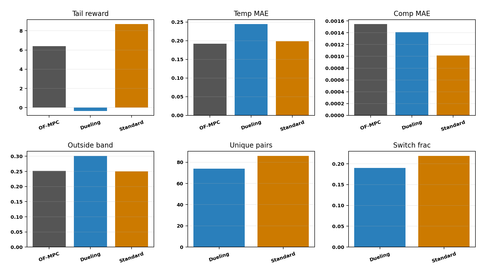
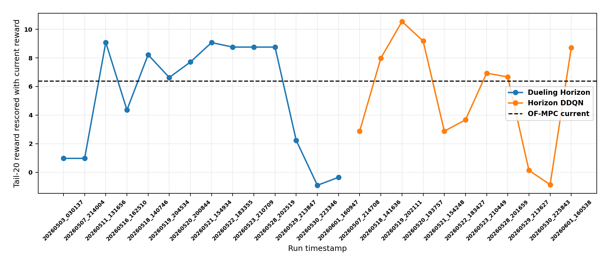

# Distillation Horizon Agents: Latest Failure Analysis

Date: 2026-06-01

## Executive Summary

This report analyzes the two active distillation horizon agents:

- standard DDQN horizon supervisor
- dueling DDQN horizon supervisor

The short answer is nuanced. The latest standard horizon run is not a pure tail failure: under the current reward it beats OF-MPC on tail-20 reward, `8.708` versus `6.391`. But it is not a robust win because its final episode reward is lower than OF-MPC, its first live window still has a severe crash, and its tail horizon schedule is almost unconcentrated. The latest dueling horizon run is a clearer failure: tail-20 reward is `-0.351`, which is `6.742` below OF-MPC, mostly because temperature tracking is worse.

The old impression that the horizon agents outperformed OF-MPC is partly true and partly reward-provenance dependent. Earlier reports used or logged older reward settings with a much smaller temperature weight. When old runs are rescored with today's reward, several old wins shrink sharply. The latest runs also used a `50k` replay buffer, while the stronger older runs used `150k`; this has already been fixed for future runs in the distillation defaults, but it did not affect the completed June 1 horizon runs.

## Data And Method

I rescored saved bundles only. No Aspen run was launched.

Primary latest runs:

| Method | Bundle |
|---|---|
| Standard horizon DDQN | `Distillation/Results/distillation_horizon_disturb_fluctuation_mismatch_unified/20260601_160538/input_data.pkl` |
| Dueling horizon DDQN | `Distillation/Results/distillation_dueling_horizon_disturb_fluctuation_mismatch_unified/20260601_160947/input_data.pkl` |
| OF-MPC | `Distillation/Data/mpc_results_disturb_fluctuation.pickle` |

The current reward defaults used for rescoring are:

| Quantity | Value |
|---|---:|
| `Q_diag` | `[37000, 20000]` |
| `R_diag` | `[2500, 2500]` |
| `k_rel` | `[0.3, 0.01]` |
| `band_floor_phys` | `[0.003, 0.2]` |
| `beta` | `7.0` |
| `gate` | `geom` |

The horizon action is a discrete MPC recipe:

$$ a_k \in \mathcal{A}_H = \{(N_p,N_c): N_c \le N_p\}. $$

The current active grid is the restored 87-action grid:

$$ N_p \in \{4,\ldots,14\}, \qquad N_c \in \{2,\ldots,13\}, \qquad N_c \le N_p. $$

The default OF-MPC-like recipe is `(6, 3)`. The horizon agent changes only the MPC prediction and control horizons; it does not change the model, the Q/R penalties, or add residual input moves.

Generated artifacts:

| Artifact | Path |
|---|---|
| Analysis script | `report/scripts/analyze_distillation_horizon_agents_20260601.py` |
| All-run summary | `report/figures/distillation_horizon_agents_20260601/all_horizon_runs_current_reward_summary.csv` |
| Focus-run summary | `report/figures/distillation_horizon_agents_20260601/focus_horizon_runs_current_reward_summary.csv` |
| Latest summary | `report/figures/distillation_horizon_agents_20260601/latest_horizon_pair_summary.csv` |
| OF-MPC summary | `report/figures/distillation_horizon_agents_20260601/ofmpc_current_reward_summary.csv` |

## Latest Results

Tail metrics are over the final 20 subepisodes, rescored with the current reward.

| Method | Tail reward | Delta vs OF-MPC | Final reward | First live min | Comp MAE | Temp MAE | Outside band | Tail unique pairs | Top pair | Switch frac |
|---|---:|---:|---:|---:|---:|---:|---:|---:|---|---:|
| OF-MPC | `6.391` | `0.000` | `6.926` | `9.070` | `0.001545` | `0.1921` | `0.2515` | NA | NA | NA |
| Standard horizon | `8.708` | `+2.317` | `4.356` | `-31.580` | `0.001012` | `0.1982` | `0.2500` | `86` | `(12, 7)` | `0.2190` |
| Dueling horizon | `-0.351` | `-6.742` | `5.652` | `4.962` | `0.001410` | `0.2442` | `0.3014` | `74` | `(5, 4)` | `0.1903` |

Key interpretation:

- Standard horizon improves composition and slightly beats OF-MPC in tail scalar reward, but it does not improve temperature enough to be a clean controller improvement.
- Dueling improves composition relative to OF-MPC but worsens temperature and outside-band frequency, so the current temperature-sensitive reward punishes it.
- Both latest horizon agents are fully live in the tail: accepted fraction is `1.000`, projection fraction is `0.000`, cooldown fraction is `0.000`, and reward probation is disabled. So the latest tail behavior is not being suppressed by the safety layer.

## Historical Comparison Under Current Reward

The table below rescored selected old runs with the current reward. This avoids comparing old logged rewards against new logged rewards.

| Method | Run | Current tail reward | Logged tail reward | Saved Q2 | Buffer | Recipes | Temp MAE | Unique pairs | Top pair frac | Tail DQN loss |
|---|---|---:|---:|---:|---:|---:|---:|---:|---:|---:|
| Horizon | `20260519_202111` | `10.547` | `17.691` | `5000` | `150000` | `87` | `0.1850` | `31` | `0.5135` | `16.849` |
| Horizon | `20260520_193757` | `9.177` | `16.485` | `5000` | `150000` | `87` | `0.1934` | `26` | `0.4435` | `11.354` |
| Horizon | `20260521_154248` | `2.878` | `16.164` | `1500` | `150000` | `87` | `0.2233` | `45` | `0.0680` | `31.181` |
| Horizon | `20260530_225843` | `-0.862` | `-0.862` | `20000` | `50000` | `263` | `0.2360` | `183` | `0.0350` | `57.578` |
| Horizon | `20260601_160538` | `8.708` | `8.708` | `20000` | `50000` | `87` | `0.1982` | `86` | `0.0560` | `51.456` |
| Dueling | `20260518_140746` | `8.223` | `15.859` | `5000` | `150000` | `87` | `0.2029` | `51` | `0.5855` | `8.473` |
| Dueling | `20260521_154934` | `9.073` | `17.934` | `1500` | `150000` | `87` | `0.2007` | `62` | `0.3135` | `11.671` |
| Dueling | `20260530_223346` | `-0.908` | `-0.908` | `20000` | `50000` | `263` | `0.2353` | `139` | `0.1630` | `22.423` |
| Dueling | `20260601_160947` | `-0.351` | `-0.351` | `20000` | `50000` | `87` | `0.2442` | `74` | `0.1575` | `23.513` |

This table explains the apparent contradiction with older reports:

1. Older logged rewards were often computed with lower temperature weight. For example, the May 21 standard horizon logged `16.164`, but under today's reward it is only `2.878`, below OF-MPC.
2. The strongest old current-reward standard runs were May 19 and May 20, not the May 21 run highlighted later. They used `150k` replay and had concentrated tail policies.
3. The widened 263-action grid on May 29 and May 30 clearly hurt both agents.
4. The June 1 grid rollback fixed most of the standard horizon tail reward problem, but did not fix policy concentration or dueling temperature tracking.

## Diagnosis

### 1. Reward change is a major reason old wins did not carry over

The reward now strongly weights tray-85 temperature:

$$ Q = \mathrm{diag}(37000, 20000). $$

Earlier successful horizon runs saved lower temperature weights, including `Q2 = 1500` or `Q2 = 5000`. When those old trajectories are rescored with `Q2 = 20000`, apparent wins can shrink or vanish.

This is especially visible for May 21 standard horizon:

- logged tail reward: `16.164`
- current-rescored tail reward: `2.878`
- OF-MPC current tail reward: `6.391`

So the old "horizon beat OF-MPC" statement was not universally robust to the current reward geometry.

### 2. The latest June 1 runs were still trained with a 50k replay buffer

The completed June 1 horizon bundles show:

- standard horizon replay capacity: `50000`
- dueling horizon replay capacity: `50000`

The older stronger runs often used `150000`. A full run has about `80000` environment steps, so a 50k buffer cannot retain the full trajectory distribution. That matters for horizon DQN because old setpoint phases and transition regimes can be overwritten before late value estimates settle.

This is not a code bug in the latest analysis; it is a completed-run configuration issue. The active distillation defaults have now been changed back to `150000`, so the next horizon rerun will test whether this was a causal bottleneck.

### 3. Tail action concentration is still poor

The latest standard run uses `86` of `87` possible horizon pairs in the final 20 subepisodes. Its top pair `(12, 7)` appears only `5.6%` of tail steps, and the switch-step fraction is `21.9%`.

That is not a settled horizon policy. It is a high-churn policy that happens to score better in the tail window.

By contrast, stronger older standard runs were much more concentrated:

- May 19 standard: top pair `(6, 3)` at `51.35%`, only `31` unique pairs
- May 20 standard: top pair `(6, 3)` at `44.35%`, only `26` unique pairs

For the horizon family, outperforming OF-MPC seems to require not just the right grid but a stable schedule over a small subset of good recipes.

### 4. The widened grid was bad, but rollback alone is not enough

The May 29 and May 30 widened-grid runs used `263` valid recipes. They failed badly:

- standard May 30 tail reward: `-0.862`
- dueling May 30 tail reward: `-0.908`

The June 1 rollback to `87` recipes rescued standard horizon tail reward to `8.708`. But the latest standard policy still uses almost every recipe in the tail, and dueling still loses to OF-MPC. So the grid width was a real problem, but not the only problem.

### 5. Safety blocking is not the latest tail cause

For both latest horizon agents:

- accepted fraction: `1.000`
- projection fraction: `0.000`
- cooldown fraction: `0.000`
- reward probation: disabled

Therefore, the latest tail results are not caused by the horizon safety layer forcing the default `(6, 3)`.

### 6. No obvious exploration-noise bug is visible

The agents use NoisyNet exploration. In this mode, tail epsilon being zero is expected; the noise is in the noisy linear layers. The saved traces show nonzero tail noisy-layer sigma:

- standard tail noisy sigma: `0.0270`
- dueling tail noisy sigma: `0.0415`

This does not look like a simple "noise accidentally off" or "Gaussian noise added to a discrete action" bug. The more likely issue is that NoisyNet plus the current reward and replay size is not producing a confident value ranking over the horizon pairs.

## What To Do Next

1. Rerun both horizon agents with the new `150k` replay default, keeping the 87-action grid and current reward.

2. Add a no-exploration/frozen-policy evaluation pass after training. The current saved runs are training rollouts; high tail switching makes it hard to tell whether the learned greedy policy is actually good.

3. Add a horizon dwell or switching penalty. The standard run's `21.9%` tail switch fraction is too high for a stable MPC supervisor.

4. Add a value-confidence gate for horizon changes. Only change `(N_p,N_c)` when the chosen Q value beats the current/default pair by a margin.

5. Test a curated medium action set instead of all 87 recipes. Good historical pairs include `(6, 3)`, `(10, 8)`, `(11, 11)`, and the latest standard top pair `(12, 7)`, but the candidate set should be chosen from saved-run frequency and objective diagnostics rather than hand-picked permanently.

6. For dueling specifically, compare against standard DDQN settings under the same 150k buffer. Dueling is more concentrated than standard in the latest run, but it is concentrating on a temperature-worse policy.

## Files Inspected

- `distillation_RL_assisted_MPC_horizons_unified.py`
- `distillation_RL_assisted_MPC_horizons_dueling_unified.py`
- `utils/horizon_runner.py`
- `utils/horizon_runner_dueling.py`
- `DQN/dqn_agent.py`
- `DuelingDQN/dueling_dqn_agent.py`
- `systems/distillation/config.py`
- `systems/distillation/notebook_params.py`
- `report/distillation_latest_family_runs_2026_05_21.md`
- `report/distillation_5runner_wider_safety_analysis_2026_05_30.md`
- `report/distillation_post_reward_no_probation_5runner_analysis_2026_05_31.md`
- `change-reports/2026-06-01_distillation_rollback_td3_only_markov_residual_guard.md`

## Files Created

- `report/distillation_horizon_agents_failure_analysis_2026_06_01.md`
- `report/scripts/analyze_distillation_horizon_agents_20260601.py`
- `report/figures/distillation_horizon_agents_20260601/all_horizon_runs_current_reward_summary.csv`
- `report/figures/distillation_horizon_agents_20260601/focus_horizon_runs_current_reward_summary.csv`
- `report/figures/distillation_horizon_agents_20260601/latest_horizon_pair_summary.csv`
- `report/figures/distillation_horizon_agents_20260601/ofmpc_current_reward_summary.csv`
- `report/figures/distillation_horizon_agents_20260601/manifest.json`
- `report/figures/distillation_horizon_agents_20260601/fig_horizon_current_reward_history.png`
- `report/figures/distillation_horizon_agents_20260601/fig_latest_horizon_vs_ofmpc_metrics.png`
