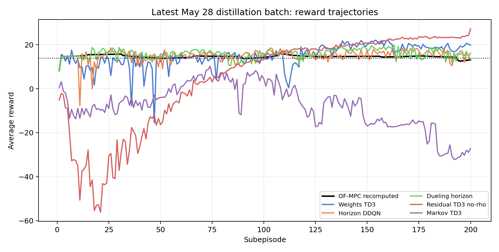
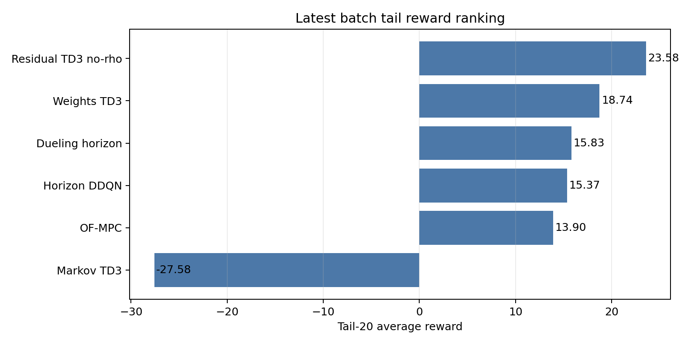
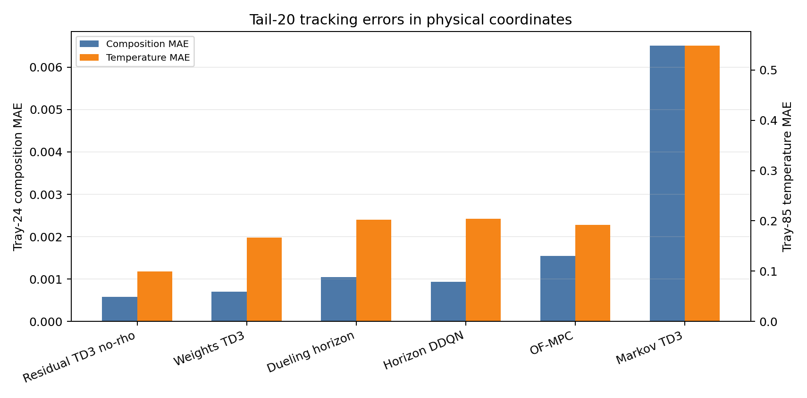
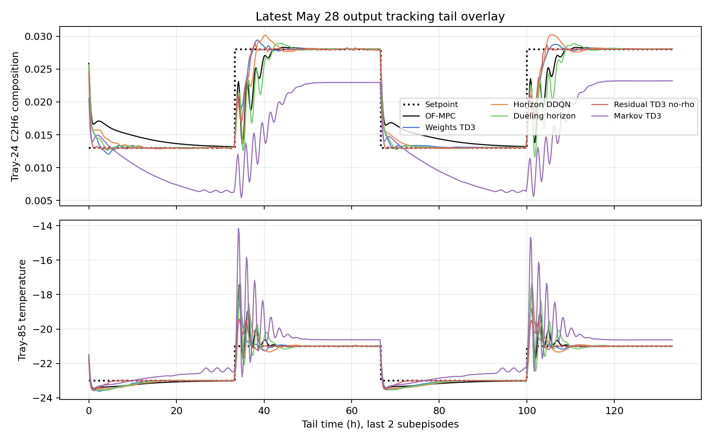
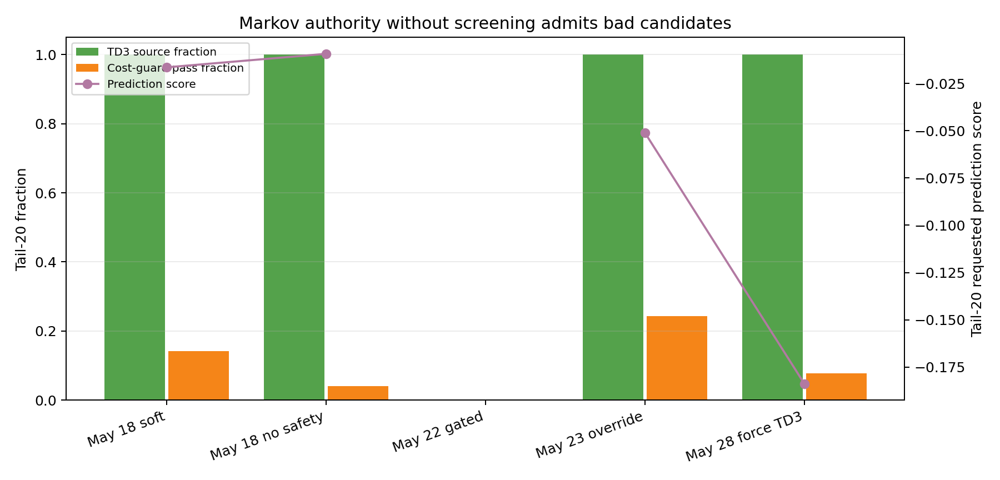
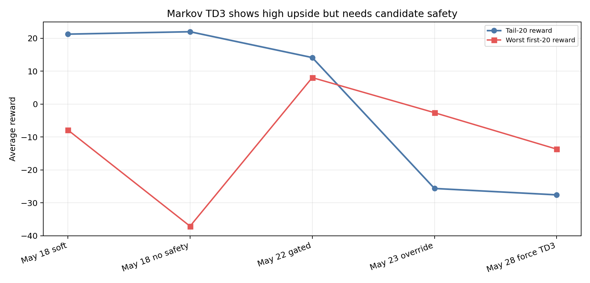
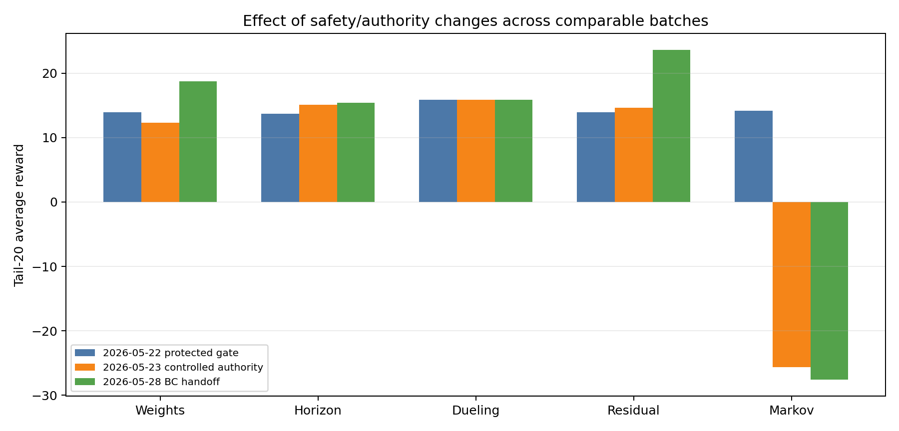

# Distillation Five-Runner Analysis After Latest Safety And Authority Settings

Date: 2026-05-29  
Case study: Aspen C2 splitter distillation column  
Scenario: `run_mode = "disturb"`, `disturbance_profile = "fluctuation"`  
Latest active batch: 2026-05-28  

## Executive Summary

This report analyzes all five active distillation RL-assisted MPC runners, not only residual:

- TD3 weights
- standard horizon DDQN
- dueling horizon DDQN
- TD3 residual
- TD3 Markov correction

The newest batch is not a uniform win or loss. The new BC-handoff setting improved weights and residual strongly, kept the horizon families active and mostly safe, and broke Markov by removing the candidate screen while still forcing TD3 execution.

The latest tail-20 ranking is:

| Runner | Tail-20 reward | Final reward | Tail band-normalized MAE | Outside-band fraction | Main diagnosis |
|---|---:|---:|---:|---:|---|
| TD3 residual no-rho | 23.580 | 27.221 | 0.272 | 0.071 | Best late tracking, but severe early release shock |
| TD3 weights | 18.742 | 19.857 | 0.436 | 0.124 | Real improvement from live penalty adaptation |
| Dueling horizon | 15.828 | 13.309 | 0.542 | 0.146 | Stable active horizon selection |
| Horizon DDQN | 15.370 | 16.146 | 0.545 | 0.144 | Active, broader, less stable horizon selection |
| OF-MPC | 13.898 | 13.136 | 0.583 | 0.163 | Robust reference |
| TD3 Markov | -27.582 | -27.171 | 1.811 | 0.618 | Forced bad Markov candidates through disabled safety |

The main research conclusion is:

**The latest settings prove that continuous TD3 authority can help the column, but only for action spaces where the proposed move is local and directly corrective. Residual and weights benefited. Markov failed because the lifted model correction was forced through with no priority fallback, no reward probation, and no active candidate veto.**

## Files Inspected

Latest result bundles:

| Runner | Bundle |
|---|---|
| OF-MPC baseline | `Distillation/Data/mpc_results_disturb_fluctuation.pickle` |
| TD3 weights | `Distillation/Results/distillation_weights_td3_disturb_fluctuation_mismatch_unified/20260528_194904/input_data.pkl` |
| Horizon DDQN | `Distillation/Results/distillation_horizon_disturb_fluctuation_mismatch_unified/20260528_201659/input_data.pkl` |
| Dueling horizon | `Distillation/Results/distillation_dueling_horizon_disturb_fluctuation_mismatch_unified/20260528_202519/input_data.pkl` |
| TD3 residual no-rho | `Distillation/Results/distillation_residual_td3_disturb_fluctuation_mismatch_no_rho_unified/20260528_213902/input_data.pkl` |
| TD3 Markov | `Distillation/Results/distillation_markov_td3_disturb_fluctuation_unified/20260528_230949/input_data.pkl` |

Previous safety-reference bundles:

| Purpose | Bundle |
|---|---|
| Protected-gate TD3 reference | May 22 weights, residual, Markov bundles |
| Controlled-authority TD3 reference | May 23 weights, residual, Markov bundles |
| Best historical residual rho reference | `Distillation/Results/distillation_residual_td3_disturb_fluctuation_mismatch_rho_unified/20260507_212833/input_data.pkl` |
| Markov soft-handoff and no-safeguard references | May 18 Markov bundles |

Implementation files inspected:

| File | Why it matters |
|---|---|
| `systems/distillation/config.py` | Reward weights, residual bounds, input bounds, horizon grids |
| `systems/distillation/notebook_params.py` | Active defaults for BC handoff, rho authority, Markov priority fallback, DQN settings |
| `utils/weights_runner.py` | Penalty multiplier action path and BC-handoff execution |
| `utils/horizon_runner.py` | Standard horizon action selection and MPC rebuild path |
| `utils/horizon_runner_dueling.py` | Dueling horizon execution path |
| `utils/residual_runner.py` | Residual action mapping, BC handoff, rho/headroom projection hooks |
| `utils/residual_authority.py` | Rho authority, deadband, headroom projection logic |
| `utils/markov_runner.py` | Markov z correction, z-safety, TD3 source, priority fallback, candidate logs |
| `utils/behavioral_cloning.py` | Protected-BC release gate and raw-action handoff |

Analysis artifacts created:

| Artifact | Purpose |
|---|---|
| `report/scripts/analyze_distillation_latest_settings_20260529.py` | Recomputes metrics and creates figures from saved bundles |
| `report/figures/distillation_latest_settings_20260529/latest_settings_summary_metrics.csv` | Reward, tracking, input, and episode metrics |
| `report/figures/distillation_latest_settings_20260529/latest_settings_mechanism_diagnostics.csv` | Per-runner safety and action-mechanism diagnostics |
| `report/figures/distillation_latest_settings_20260529/latest_horizon_pair_counts.csv` | Tail horizon-pair usage for both horizon runners |
| `report/figures/distillation_latest_settings_20260529/*.png` | Figures used below |

## Method Reconstruction

The baseline controller is the identified offset-free linear MPC around the Aspen steady state. The plant outputs are:

$$ y_k = [x_{24,\mathrm{C_2H_6},k}, T_{85,k}]^\top. $$

The manipulated inputs are:

$$ u_k = [F_{\mathrm{reflux},k}, Q_{\mathrm{reb},k}]^\top. $$

The augmented model used by the MPC and observer has the form:

$$ x^+_{\mathrm{aug},k}=A_{\mathrm{aug}}x_{\mathrm{aug},k}+B_{\mathrm{aug}}\Delta u_k,\qquad y_k=C_{\mathrm{aug}}x_{\mathrm{aug},k}. $$

At each step, nominal MPC solves a finite-horizon problem:

$$ \min_{\Delta U}\sum_{j=1}^{N_p} e_{k+j}^\top Q e_{k+j}+\sum_{j=0}^{N_c-1}\Delta u_{k+j}^\top R\Delta u_{k+j}. $$

The current reward is band-aware. In compact form:

$$ r_k=-\left(e_k^\top Q_r e_k+\Delta u_k^\top R_r\Delta u_k+L_{\mathrm{out},k}+L_{\mathrm{in},k}\right)+B_{\mathrm{inside},k}. $$

For distillation, the active reward defaults use:

$$ Q_r=\mathrm{diag}(37000,5000),\qquad R_r=\mathrm{diag}(2500,2500). $$

### Runner Actions

Weights TD3 changes MPC penalty multipliers:

$$ m_k=[m_{Q_1},m_{Q_2},m_{R_1},m_{R_2}],\qquad m_i\in[0.75,2.0]. $$

Horizon DDQN and dueling horizon choose a discrete pair:

$$ a_k=(N_{p,k},N_{c,k}),\qquad N_p\in\{4,\dots,14\},\quad N_c\in\{2,\dots,13\}. $$

Residual TD3 applies an additive scaled-input correction after nominal MPC:

$$ u_{\mathrm{exec},k}=u_{\mathrm{MPC},k}+\Delta u_{\mathrm{res},k},\qquad \Delta u_{\mathrm{res},i}\in[-0.02,0.02]. $$

Markov TD3 changes lifted input-output response coordinates:

$$ z_k=[z_{y_1u_1},z_{y_1u_2},z_{y_2u_1},z_{y_2u_2}],\qquad z_i\in[-0.04,0.04]. $$

## What Changed In The Latest Settings

The May 28 TD3 batch used a BC-integrated handoff:

$$ a_{\mathrm{exec},k}=(1-\alpha_k)a_{\mathrm{safe},k}+\alpha_k a_{\theta,k}. $$

For the first 10 subepisodes, the handoff authority ramps from 0.1 to 1.0. After that, the actor has full authority. The protected release gate is disabled. The old controlled-authority ramp is disabled.

The effect by family:

| Runner | Latest safety state |
|---|---|
| Weights | BC handoff enabled, release gate disabled, authority ramp disabled |
| Horizon DDQN | No BC handoff, direct discrete horizon actions |
| Dueling horizon | No BC handoff, direct discrete horizon actions |
| Residual | BC handoff enabled, release gate disabled, rho authority disabled, fixed residual bounds and input headroom remain |
| Markov | BC handoff enabled, release gate disabled, priority fallback disabled, reward probation disabled, `force_td3_execute=True`, z-safety still active |

This means the latest batch is not only a reward tuning experiment. It is a safety-layer ablation.

## Latest Quantitative Results

The table below compares the latest runs to OF-MPC under the same recomputed reward.

| Runner | Tail-20 reward delta vs OF-MPC | Band MAE change | Outside-band change | Composition MAE change | Temperature MAE change |
|---|---:|---:|---:|---:|---:|
| TD3 weights | +4.843 | -25.3 percent | -24.1 percent | -54.3 percent | -13.1 percent |
| Horizon DDQN | +1.472 | -6.6 percent | -12.0 percent | -39.3 percent | +6.3 percent |
| Dueling horizon | +1.929 | -7.0 percent | -10.3 percent | -32.4 percent | +5.3 percent |
| TD3 residual no-rho | +9.682 | -53.4 percent | -56.3 percent | -62.2 percent | -48.1 percent |
| TD3 Markov | -41.480 | +210.4 percent | +278.8 percent | +321.5 percent | +185.6 percent |

## Runner 1: TD3 Weights

### Observed performance

TD3 weights is the second-best latest runner:

- tail-20 reward: 18.742
- final reward: 19.857
- composition MAE: 0.000706
- temperature MAE: 0.166929
- outside-band fraction: 0.123938

This is a real improvement over OF-MPC, not a nominal-overlap result. In the May 22 protected-gate batch, weights was effectively nominal with tail-20 reward 13.898. In the May 23 controlled-authority batch, it dropped to 12.315 because the actor saturated into a poor boundary pattern. In the May 28 BC-handoff batch, the same family finally produced useful late behavior.

### Mechanism

The latest tail mean multiplier vector is:

$$ \bar m_{\mathrm{tail}}=[1.407,\;1.401,\;1.381,\;1.240]. $$

The final multiplier vector is:

$$ m_{\mathrm{final}}=[1.448,\;1.133,\;1.250,\;1.685]. $$

The tail standard deviations are large enough to show that the policy is not frozen:

$$ \sigma_m=[0.452,\;0.402,\;0.413,\;0.381]. $$

The raw action saturation tail mean is 0.0568, with q95 absolute raw action equal to 1.0. So the weights actor still occasionally uses action-space boundaries, but unlike the May 23 run this did not collapse tracking.

### Interpretation

Weights is now learning a useful penalty schedule. The likely reason is that penalty multipliers change the MPC objective rather than directly injecting an input correction. This gives the plant a structural safety cushion: the MPC optimization still enforces the nominal model, input bounds, and move penalties. The TD3 action alters controller preference, not the plant input directly.

The risk is that the action remains partly saturated. A safety layer should not block weights completely, but it should log and screen candidate cost, first move, and input movement when the multiplier vector is extreme.

### Safety-layer recommendation for weights

Bring back a method-aware candidate evaluator, not the old hard blocking release gate. For a proposed multiplier vector `m_k`, compute the nominal first move and the weighted-MPC first move, then screen:

$$ \Delta J_k=\frac{J_{\mathrm{nom}}(u_{\mathrm{cand},k})-J_{\mathrm{nom}}(u_{\mathrm{nom},k})}{\max(1,\lvert J_{\mathrm{nom}}(u_{\mathrm{nom},k})\rvert)}. $$

Recommended first rule:

- accept if cost and first-move margins are small
- blend toward identity if the multiplier is saturated and the candidate is worse than nominal
- store the executed multiplier in replay

## Runner 2: Standard Horizon DDQN

### Observed performance

Standard horizon DDQN is active and modestly better than OF-MPC:

- tail-20 reward: 15.370
- final reward: 16.146
- composition MAE: 0.000938
- temperature MAE: 0.204095
- outside-band fraction: 0.143625

It improves composition tracking and outside-band fraction, but it slightly worsens temperature MAE relative to OF-MPC.

### Mechanism

The tail horizon statistics are:

$$ \bar N_p=10.001,\qquad \bar N_c=5.905. $$

The runner used 87 distinct horizon pairs in the last 20 subepisodes. The most common pair was `(10, 4)`, but it only represented 5.75 percent of tail decisions. This is broad exploration or high switching, not a compact settled policy.

Top tail pairs:

| Rank | Prediction horizon | Control horizon | Tail fraction |
|---:|---:|---:|---:|
| 1 | 10 | 4 | 0.0575 |
| 2 | 14 | 2 | 0.0190 |
| 3 | 12 | 12 | 0.0185 |
| 4 | 9 | 4 | 0.0180 |
| 5 | 12 | 7 | 0.0170 |

The early behavior is less safe than dueling. The worst first-20 reward was -7.779 at subepisode 11.

### Interpretation

The standard horizon runner is useful because it changes MPC planning geometry without changing the model or adding direct residual inputs. This makes it safer than Markov and generally less brittle than direct residual control. However, the broad tail horizon distribution means the policy has not converged to a small set of clearly preferred recipes.

The current reward improvement is probably a composition-temperature tradeoff. Composition improves strongly, while temperature gets slightly worse. This is acceptable for exploration, but it should be reported honestly.

### Safety-layer recommendation for standard horizon

The horizon runner does not need a TD3-style action gate. It needs a switching and candidate-quality layer:

- log the nominal objective for the selected horizon and the default `(6, 3)` horizon
- penalize or soften rapid horizon changes if the selected candidate worsens predicted tracking
- add a horizon dwell-time or hysteresis rule only if switching is linked to reward dips

## Runner 3: Dueling Horizon DDQN

### Observed performance

Dueling horizon is also active and better than OF-MPC:

- tail-20 reward: 15.828
- final reward: 13.309
- composition MAE: 0.001045
- temperature MAE: 0.202245
- outside-band fraction: 0.146375

It has a slightly better tail reward than standard horizon, but the final subepisode drops close to OF-MPC. Its worst first-20 reward stayed at 8.175, which makes it much safer during early learning than the standard horizon run.

### Mechanism

The tail horizon statistics are:

$$ \bar N_p=9.548,\qquad \bar N_c=5.628. $$

The dueling policy used 68 tail horizon pairs, but the mass is more concentrated than standard horizon. Its top six pairs explain most of the tail:

| Rank | Prediction horizon | Control horizon | Tail fraction |
|---:|---:|---:|---:|
| 1 | 11 | 11 | 0.269 |
| 2 | 11 | 2 | 0.179 |
| 3 | 6 | 3 | 0.135 |
| 4 | 10 | 6 | 0.111 |
| 5 | 9 | 4 | 0.092 |
| 6 | 9 | 3 | 0.080 |

This concentration is a strong sign that dueling decomposes horizon-value estimation better than the standard DQN in this scenario.

### Interpretation

Dueling horizon is the most robust discrete runner. It did not benefit from the TD3 safety changes because those changes do not touch it. The identical tail metrics across the May 22, May 23, and May 28 comparison rows support that: the horizon runner is a separate family and should be treated as a stable benchmark.

Its limitation is that it does not solve the last-step temperature tradeoff as well as residual or weights. The final reward of 13.309 is much weaker than its tail average.

### Safety-layer recommendation for dueling horizon

Keep dueling as the low-risk active RL baseline. The next useful addition is not a veto. It is richer logging:

- selected horizon candidate objective
- default horizon objective
- predicted first move
- horizon-change count per subepisode
- tail horizon entropy

## Runner 4: TD3 Residual No-Rho

### Observed performance

Residual is the strongest latest runner by a wide margin:

- tail-20 reward: 23.580
- tail-10 reward: 23.886
- final reward: 27.221
- composition MAE: 0.000584
- temperature MAE: 0.099658
- outside-band fraction: 0.071375

It cuts band-normalized MAE by 53.4 percent and outside-band fraction by 56.3 percent relative to OF-MPC.

### Mechanism

The latest residual run disabled both rho as a state feature and rho authority:

- `append_rho_to_state=False`
- `authority_use_rho=False`
- `residual_authority_enabled=False`

Therefore, the successful tail result is not caused by rho. It is caused by the TD3 residual policy learning a useful small additive input trim under fixed residual bounds and physical headroom.

Tail residual norms:

| Metric | Value |
|---|---:|
| Raw residual norm mean | 0.006021 |
| Executed residual norm mean | 0.006021 |
| Raw residual q95 | 0.028261 |
| Executed residual q95 | 0.028261 |
| Material raw-executed projection fraction | 0.000 |
| Authority projection fraction | 0.000 |
| Deadband projection fraction | 0.000 |
| Headroom projection fraction | 0.000 |

The old `projection_active_log` is numerically near 1.0 in this bundle, but the raw-executed difference is only about `4e-8`. That flag is not a material safety intervention here. The reason-specific projection logs and the material-difference threshold show that the residual was effectively executed as proposed.

### Why residual significantly outperformed at the end

There are four likely reasons.

First, residual acts locally on the first move after nominal MPC. It does not replace MPC. It trims the action:

$$ u_{\mathrm{exec},k}=u_{\mathrm{MPC},k}+\Delta u_{\mathrm{res},k}. $$

Second, the action range is small. A mean tail scaled residual norm of 0.006 is enough to correct the remaining offset and disturbance mismatch, but it is not large enough to dominate the controller in the tail.

Third, the column has a persistent mismatch/disturbance pattern under the fluctuation profile. Once the residual policy learns the sign of the needed trim, it can compensate faster than changing horizons and more directly than changing weights.

Fourth, the removal of rho authority allowed the actor to keep a useful nonzero correction near the setpoint. Historical rho runs often compressed the executed residual to about 0.002 even when raw proposals were larger. The best historical rho reference had tail reward 18.824. The no-rho run reached 23.580 because it was allowed to execute roughly three times the useful tail residual norm.

### The danger

The same run had severe early release shock:

- first-10 mean reward: -18.026
- worst first-20 reward: -55.383
- worst episode overall: -56.133 at subepisode 21

So the correct interpretation is not "remove safety permanently." It is:

**Residual has the strongest late policy, but the early handoff needs safety.**

### Safety-layer recommendation for residual

Bring back residual safety in layers, but do not simply restore the old rho-only behavior.

Recommended production path:

1. Keep `append_rho_to_state=False` for the learning ablation.
2. Re-enable execution-time rho/headroom/deadband as a named safety mode.
3. Add a residual direction check after rho projection.
4. Use softening, not hard zero fallback, unless the predicted residual direction is clearly harmful.

The key missing test is:

$$ \Delta E^+_k=E^+_{\mathrm{res},k}-E^+_{\mathrm{nom},k}. $$

If the residual-applied first move increases predicted tracking error, shrink:

$$ \Delta u_{\mathrm{exec},k}=\alpha_k\Delta u_{\mathrm{res},k},\qquad 0\leq\alpha_k\leq1. $$

This would preserve the late no-rho upside while suppressing the early release shock.

## Runner 5: TD3 Markov Correction

### Observed performance

Markov is the latest batch failure:

- tail-20 reward: -27.582
- final reward: -27.171
- composition MAE: 0.006512
- temperature MAE: 0.548673
- outside-band fraction: 0.618437
- input saturation fraction: 0.065

The tail output overlay shows the failure directly. Markov settles far from the composition setpoint and has large temperature excursions.

### Mechanism

The latest Markov defaults disabled the layers that used to decide whether a Markov candidate should reach the plant:

- `force_td3_execute=True`
- `td3_priority_fallback.enabled=False`
- reward probation disabled through the priority system
- no LS fallback
- protected release gate disabled

The remaining z-safety layer only bounds the size of `z`. It does not ask whether the candidate is useful.

Tail diagnostics:

| Markov diagnostic | Value |
|---|---:|
| TD3 source fraction | 1.000 |
| LS fallback fraction | 0.000 |
| Nominal fallback fraction | 0.000 |
| z requested projection fraction | 1.000 |
| z vector projection fraction | 1.000 |
| tail z norm mean | 0.060 |
| requested cost-guard pass fraction | 0.077 |
| requested prediction-score mean | -0.184 |
| requested gain-drift mean | 0.030 |

The actor was forced through even though only 7.7 percent of tail requested candidates passed the cost guard. The prediction score was negative. The z-safety projection was active every tail step and pushed the action to the vector norm cap.

### Interpretation

Markov has high upside in older runs, but it is brittle. The lifted-response action modifies the model used by MPC, not just a local first-move trim. A bad Markov correction can make the optimizer confidently solve the wrong local prediction problem.

The May 18 Markov runs already showed this tradeoff:

- no-safeguard Markov had very high late reward, but severe early collapse
- soft handoff retained much of the benefit with less release shock
- May 22 protected-gate Markov was safe but mostly nominal
- May 23 and May 28 Markov forced TD3 too aggressively and collapsed

### Safety-layer recommendation for Markov

Bring back Markov safety immediately:

- set `force_td3_execute=False`
- re-enable `td3_priority_fallback`
- re-enable reward probation
- re-enable LS fallback
- keep z-safety, but treat z-safety as a bound, not a quality filter
- reject or soften candidates with negative prediction score
- reject or soften candidates that fail the nominal-cost guard

For Markov, the safety layer must be candidate-quality aware. Magnitude clipping alone is not enough.

## Cross-Batch Interpretation

The three recent batches show the role of safety clearly:

| Runner | May 22 protected gate | May 23 controlled authority | May 28 BC handoff | Interpretation |
|---|---:|---:|---:|---|
| Weights | 13.898 | 12.315 | 18.742 | Hard blocking was too conservative, uncontrolled boundary action was bad, BC handoff worked |
| Horizon DDQN | 13.699 | 15.059 | 15.370 | Discrete horizon runner improved independently of TD3 safety changes |
| Dueling horizon | 15.828 | 15.828 | 15.828 | Stable reproducible active benchmark |
| Residual | 13.898 | 14.620 | 23.580 | Late residual authority is highly valuable, but handoff is unsafe early |
| Markov | 14.130 | -25.638 | -27.582 | Removing candidate safety is catastrophic for lifted model correction |

The safety lesson is asymmetric:

- For weights, the old gate blocked useful learning too much.
- For residual, rho safety protected early behavior but limited late authority.
- For Markov, candidate safety is essential.
- For horizon families, the main safety need is switching and candidate logging, not a TD3-style release gate.

## Safety Layers To Bring Back

### 1. Protected BC, But Method-Aware

The old release gate prevented bad TD3 actions, but in May 22 it also kept continuous policies mostly nominal. The gate should return as a diagnostic and softening signal, not as a permanent hard veto.

Recommended:

- weights: gate in physical multiplier space, not raw action space
- residual: gate on residual effect and direction, not only raw distance to zero
- Markov: gate on LS target quality, prediction score, and cost margin

### 2. Rho/Headroom/Deadband For Residual

Rho should return as an execution safety ablation, not necessarily as a state feature. The latest result suggests that giving rho to the actor is not required. But execution-time residual authority still helps prevent early damage.

Recommended residual modes:

| Mode | Purpose |
|---|---|
| `rho_state_off_rho_authority_off` | Current high-upside ablation |
| `rho_state_off_rho_authority_on` | Main safe residual production candidate |
| `rho_state_off_direction_filter_on` | Test whether direction filtering can replace part of rho conservatism |
| `rho_state_off_rho_authority_on_direction_filter_on` | Safest next deployment-style residual run |

### 3. Markov Priority Fallback And Probation

Markov must recover the candidate screen. The existing logs already contain the needed diagnostics:

- requested cost margin
- requested prediction score
- requested gain drift
- cost-guard pass flag
- z projection flags
- action source

The May 28 Markov run is almost a textbook example of why those logs should become active safety decisions.

### 4. Generic Candidate Safety Filter

For all five runners, use the same accept, soften, fallback structure:

$$ u_{\mathrm{exec},k}=u_{\mathrm{nom},k}+\alpha_k(u_{\mathrm{cand},k}-u_{\mathrm{nom},k}). $$

Here `alpha = 1` means accept, `0 < alpha < 1` means soften, and `alpha = 0` means fallback.

Candidate risk channels:

| Runner | Candidate risk channel |
|---|---|
| Weights | nominal objective margin, first-move difference, multiplier saturation |
| Horizon | selected-horizon objective versus default horizon, horizon switching rate |
| Dueling horizon | same as horizon, plus horizon-value entropy |
| Residual | one-step predicted tracking margin, residual direction, headroom |
| Markov | prediction score, cost guard, gain drift, z norm, z projection |

Replay should always store the executed action:

$$ (s_k,a_{\mathrm{exec},k},r_k,s_{k+1}). $$

The raw proposal should be logged separately for diagnostics.

## Literature Connections

The result is consistent with MPC-RL literature that argues MPC is a useful structured policy class, but learning still needs constraint-aware supervision. Gros and Zanon's data-driven economic NMPC view supports treating MPC parameters as learnable policy parameters rather than replacing MPC entirely: [Data-driven Economic NMPC using Reinforcement Learning](https://arxiv.org/abs/1904.04152).

The residual result matches the residual-learning idea that a learned policy can improve a conventional controller by adding a residual correction rather than replacing the base controller: [Residual Reinforcement Learning for Robot Control](https://arxiv.org/abs/1812.03201).

The Markov failure supports the safety-filter literature: a learning action should be checked and minimally modified before application, not merely clipped by magnitude. This is close to model predictive safety certification: [Linear model predictive safety certification for learning-based control](https://arxiv.org/abs/1803.08552).

The broader safe-RL lesson also matches Lyapunov and stability-certificate work: exploration can be valuable, but unsafe actions must be filtered before they damage the process: [Safe Model-based Reinforcement Learning with Stability Guarantees](https://arxiv.org/abs/1705.08551).

No new BibTeX entries were added in this pass.

## Recommended Next Experiments

### Experiment A: Five-Runner Safety Restoration Batch

Purpose:
separate useful authority from unsafe release.

Files:

- `systems/distillation/notebook_params.py`
- `utils/weights_runner.py`
- `utils/residual_runner.py`
- `utils/markov_runner.py`
- `utils/horizon_runner.py`
- `utils/horizon_runner_dueling.py`

Changes:

- weights: keep BC handoff, add candidate cost and first-move logging
- horizon: add selected-versus-default horizon objective logging
- dueling: keep as benchmark, add the same logging
- residual: run `rho_state_off_rho_authority_on` and add direction-shadow diagnostics
- Markov: re-enable priority fallback, reward probation, and LS fallback

Success metric:

- residual tail reward remains above 20 without first-20 reward below 0
- weights tail reward remains above 17 without increasing saturation
- Markov no longer has negative tail reward
- horizon and dueling remain above OF-MPC with no switching-induced collapse

### Experiment B: Residual Safety Ablation

Purpose:
decide whether no-rho performance can be made safe.

Run four residual variants:

| Variant | Rho state | Rho authority | Direction filter |
|---|---|---|---|
| current reference | off | off | off |
| authority restored | off | on | off |
| direction only | off | off | on |
| combined safety | off | on | on |

Confirming result:
tail reward above 20 and worst first-20 reward above 0.

Rejecting result:
if all safe variants fall back to OF-MPC-level tail reward, the current no-rho residual is too unsafe for a final method without a richer predictor.

### Experiment C: Markov Candidate-Safety Recovery

Purpose:
recover Markov upside without forced bad candidates.

Changes:

- `force_td3_execute=False`
- `td3_priority_fallback.enabled=True`
- `reward_probation.enabled=True`
- `rl_fallback_to_ls=True`
- block negative prediction-score candidates during protected and ramp phases

Confirming result:
tail reward above 18 with first-20 minimum above -10.

Rejecting result:
if Markov remains negative after candidate screening, the current Markov action basis or reward is not aligned with the column under this disturbance profile.

### Experiment D: Multi-Seed Finalization

Purpose:
turn latest single-run conclusions into defensible research evidence.

Run at least three seeds for:

- OF-MPC reference is fixed
- TD3 weights safe candidate
- horizon DDQN
- dueling horizon
- residual safe candidate
- Markov candidate-safety recovery

Report:

- mean and standard deviation of tail-20 reward
- worst first-20 reward
- band-normalized MAE
- outside-band fraction
- input saturation
- live-authority fraction
- safety intervention fraction

## Remaining Uncertainty

The latest result is a single-seed, single-profile comparison. It is strong enough to guide the next experiment, but not enough to claim final superiority.

The residual tail performance is excellent, but the early collapse is too large to ignore. It must be safety-filtered before it becomes the final method.

The weights result is promising, but action saturation still appears in the tail. We need candidate objective logs to prove the multiplier changes are consistently useful rather than sometimes lucky.

The horizon families are comparatively safe, but their candidate-quality diagnostics are thin. The next report should include selected-versus-default horizon objective margins.

The Markov result should not be treated as evidence that Markov is a bad idea. It is evidence that Markov is unsafe when forced through without candidate screening.

## Bottom Line

The five-runner story is now clearer:

- weights: useful and salvageable with candidate screening
- horizon: active and moderately useful, but broad and sometimes unstable
- dueling horizon: stable low-risk benchmark
- residual: best late performance, but needs safety restored around release
- Markov: high-upside family that currently fails because the safety layers were removed

The next phase should not be another blind rerun. It should be a five-runner safety restoration study where every runner logs candidate quality, executed action, and safety intervention reason.
