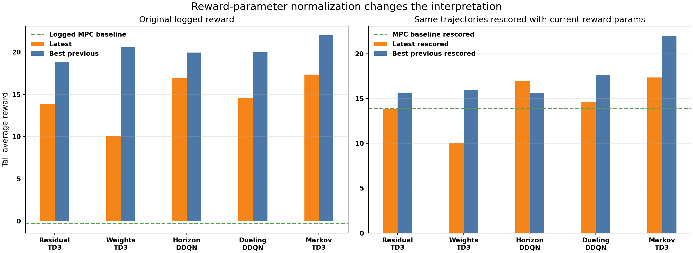
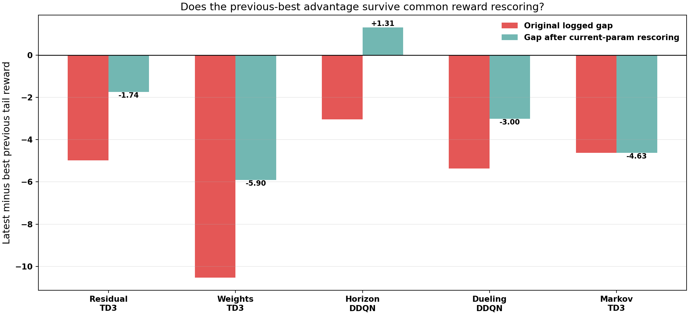
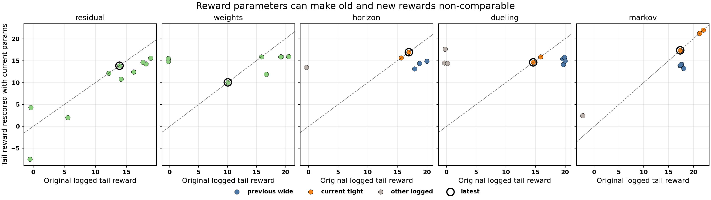
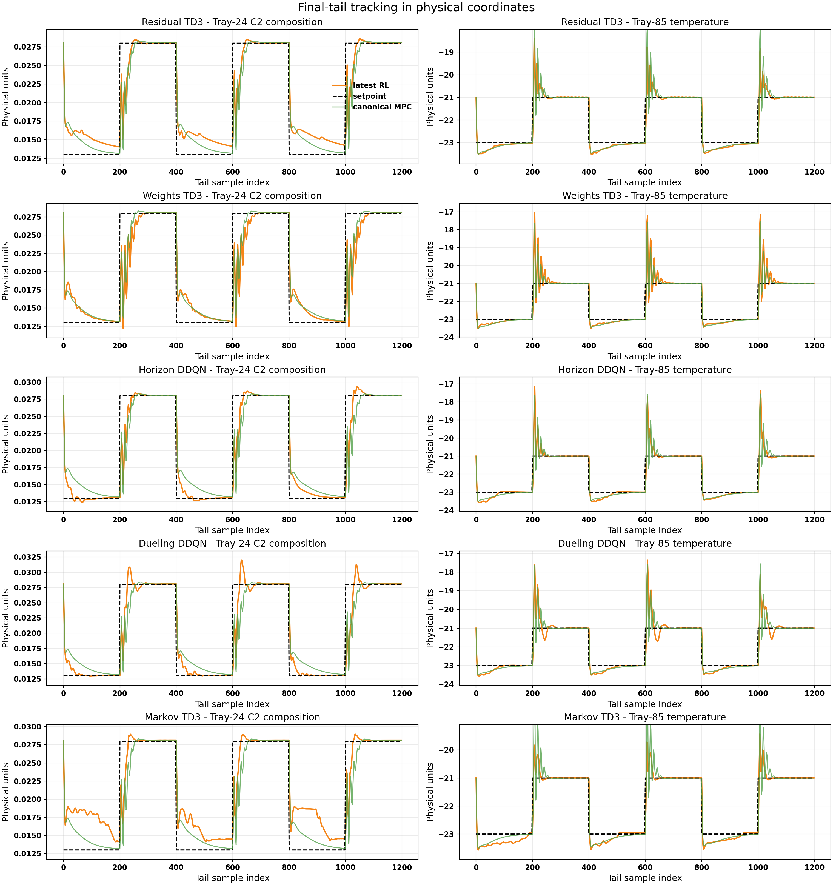
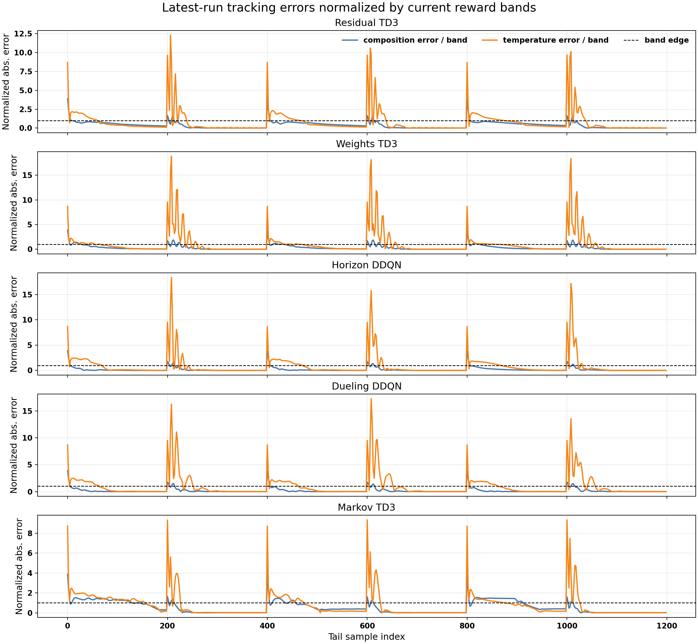
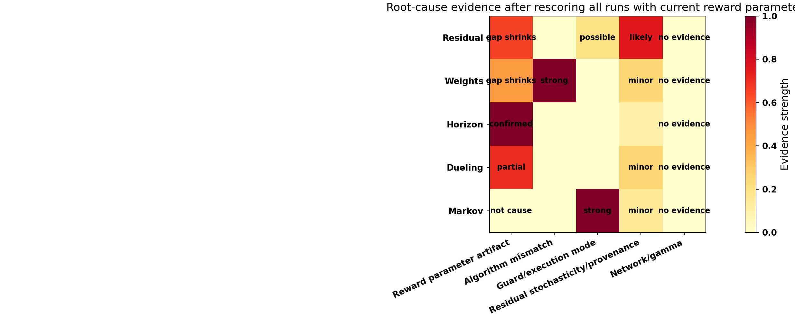

# Distillation Latest Family Runs: Current-Reward Rescoring Update

Date updated: 2026-05-20

## Executive Summary

This update re-checks the previous conclusion using a fairer comparison: every saved distillation trajectory is re-scored with the same current reward parameters instead of comparing each run by its originally logged reward. That matters because several older runs were trained and logged under different reward parameters.

The answer changes in an important way:

- The earlier conclusion that "every latest run is worse than its historical best" does **not** fully hold after current-parameter rescoring.
- Horizon DDQN is no longer worse. Under the current reward, the latest horizon run is better than every previous horizon run in the saved history.
- Residual TD3 is still below its best previous run, but the gap shrinks from `-4.98` to `-1.74`.
- Weights TD3 is still below the best previous weights run, but the comparison is still TD3 latest versus SAC historical best.
- Dueling DDQN is still below an older previous run under current reward, so reward parameters explain part, but not all, of the drop.
- Markov TD3 is unchanged by reward rescoring because the best previous Markov run and the latest Markov run already used the same current reward profile. Its main difference remains the guarded/fallback execution mode versus TD3-only/no-safeguard.

The plotting issue is also fixed. The previous final tracking plot mixed physical outputs with scaled setpoint deviations. The new tracking figure converts setpoints back to physical units before plotting, so the curves are now meaningful.

## Files Inspected

Latest result bundles:

- `Distillation/Results/distillation_residual_td3_disturb_fluctuation_mismatch_rho_unified/20260519_200250/input_data.pkl`
- `Distillation/Results/distillation_weights_td3_disturb_fluctuation_mismatch_unified/20260519_201951/input_data.pkl`
- `Distillation/Results/distillation_horizon_disturb_fluctuation_mismatch_unified/20260519_202111/input_data.pkl`
- `Distillation/Results/distillation_dueling_horizon_disturb_fluctuation_mismatch_unified/20260519_204534/input_data.pkl`
- `Distillation/Results/distillation_markov_td3_disturb_fluctuation_unified/20260519_210736/input_data.pkl`

Baseline and historical bundles:

- `Distillation/Data/mpc_results_disturb_fluctuation.pickle`
- `Distillation/Results/distillation_residual_*_disturb_fluctuation*_unified/*/input_data.pkl`
- `Distillation/Results/distillation_weights_*_disturb_fluctuation*_unified/*/input_data.pkl`
- `Distillation/Results/distillation_horizon_disturb_fluctuation*_unified/*/input_data.pkl`
- `Distillation/Results/distillation_dueling_horizon_disturb_fluctuation*_unified/*/input_data.pkl`
- `Distillation/Results/distillation_markov_td3_disturb_fluctuation*_unified/*/input_data.pkl`

Code and reward logic:

- `systems/distillation/config.py`
- `systems/distillation/notebook_params.py`
- `utils/rewards.py`
- `utils/horizon_runner.py`
- `utils/horizon_runner_dueling.py`
- `utils/weights_runner.py`
- `utils/residual_runner.py`
- `utils/markov_runner.py`
- `report/scripts/analyze_distillation_latest_family_runs_20260519.py`

Generated May 20 analysis assets:

- `report/figures/distillation_latest_family_runs_20260520_rescored/latest_family_summary.csv`
- `report/figures/distillation_latest_family_runs_20260520_rescored/history_tail_reward_summary.csv`
- `report/figures/distillation_latest_family_runs_20260520_rescored/summary.json`
- `report/figures/distillation_latest_family_runs_20260520_rescored/fig_rescored_tail_reward_summary.png`
- `report/figures/distillation_latest_family_runs_20260520_rescored/fig_rescored_gap_to_previous_best.png`
- `report/figures/distillation_latest_family_runs_20260520_rescored/fig_original_vs_rescored_reward_scatter.png`
- `report/figures/distillation_latest_family_runs_20260520_rescored/fig_final_tail_tracking_physical.png`
- `report/figures/distillation_latest_family_runs_20260520_rescored/fig_latest_normalized_tail_error.png`
- `report/figures/distillation_latest_family_runs_20260520_rescored/fig_root_cause_after_rescoring.png`

## What Was Recalculated

The old report compared the saved `avg_rewards` arrays directly. That is not always a fair comparison because different historical runs used different reward profiles. This update recomputes the step reward for every stored trajectory using the current distillation reward defaults:

- `k_rel = [0.3, 0.01]`
- `band_floor_phys = [0.003, 0.2]`
- `Q_diag = [37000, 5000]`
- `R_diag = [2500, 2500]`
- `beta = 7`
- `reward_scale = 1`

The recomputation uses the saved scaled tracking and move arrays:

$$ r_t^{\mathrm{new}} = R_{\mathrm{current}}(\Delta y_t^{\mathrm{scaled}}, \Delta u_t^{\mathrm{scaled}}, y_{\mathrm{sp},t}^{\mathrm{phys}}). $$

The setpoint conversion is important. The saved `y_sp` arrays are scaled deviations, not physical outputs. The physical setpoint used for plotting and reward rescoring is:

$$ y_{\mathrm{sp},t}^{\mathrm{phys}} = \mathrm{unscale}(y_{\mathrm{sp},t}^{\mathrm{scaled-dev}} + y_{\mathrm{ss}}^{\mathrm{scaled}}). $$

This conversion fixes the final tracking plot. The previous version plotted physical `y_rl` against scaled-deviation `y_sp`, which made the setpoint/output overlay meaningless.

## Main Quantitative Result

The canonical MPC baseline also changes when rescored with the current reward. Its logged tail reward was `-0.303`, but its current-parameter rescored tail reward is `13.90`. That changes the baseline comparison.

| Family | Latest logged tail | Logged best previous | Latest rescored tail | Rescored best previous | Latest minus rescored best | Latest minus rescored MPC |
| --- | ---: | ---: | ---: | ---: | ---: | ---: |
| Residual TD3 | `13.85` | `18.82` | `13.85` | `15.59` | `-1.74` | `-0.05` |
| Weights TD3 | `10.04` | `20.58` | `10.04` | `15.95` | `-5.90` | `-3.85` |
| Horizon DDQN | `16.92` | `19.97` | `16.92` | `15.61` | `+1.31` | `+3.02` |
| Dueling DDQN | `14.61` | `19.97` | `14.61` | `17.61` | `-3.00` | `+0.71` |
| Markov TD3 | `17.35` | `21.98` | `17.35` | `21.98` | `-4.63` | `+3.45` |

Figure interpretation: the left panel shows the original logged rewards, where old runs look much better. The right panel shows the same saved trajectories rescored with one reward function. Horizon changes from "latest is worse" to "latest is better than previous horizon runs." Residual and weights become less extreme. Markov does not change.

Figure interpretation: if the teal bar moves toward zero, the old advantage was partly a reward-parameter artifact. Horizon crosses above zero. Residual and weights gaps shrink. Markov stays the same.

## Reward-Parameter Artifact Check

The scatter below compares each run's originally logged tail reward with its current-parameter rescored tail reward.

Figure interpretation:

- Runs far from the diagonal are not comparable by logged reward alone.
- Horizon has the clearest reward-parameter artifact.
- Dueling has a partial reward-parameter artifact, but an older run still scores better after rescoring.
- Residual and weights are harder to audit because several bundles did not store `reward_params`.
- Markov's best run remains best because it already used the current reward profile.

## Tracking Figure Fix

The old final tracking plot was not scientifically valid because it overlaid physical output trajectories with scaled-deviation setpoints. The corrected plot below converts setpoints to physical units first.

Figure interpretation:

- Setpoints and outputs are now in the same physical coordinates.
- The two outputs are plotted in separate columns, so tray-24 composition and tray-85 temperature are not forced onto the same scale.
- The latest RL trajectories are visually close to canonical MPC in several blocks, but reward differences still depend on input movement, overshoot, and the relative reward band.

The normalized-error figure gives a reward-relevant view by dividing absolute physical tracking error by the current reward band:

Figure interpretation: values below one are inside the current reward band. This is more useful than raw physical units when comparing composition and temperature because the two variables have very different magnitudes.

## Family-Level Interpretation After Rescoring

### Horizon DDQN

The previous conclusion does not hold for horizon. Originally, the latest horizon run looked worse than the May 7 best by `-3.04` tail-reward units. After rescoring every horizon trajectory with the current reward, the latest run is `+1.31` above the best previous horizon run.

Interpretation:

- The older horizon advantage was mostly a reward-parameter artifact.
- The latest horizon run is the strongest saved horizon run under the current reward definition.
- The earlier claim that horizon was worse mainly because of reward shaping is confirmed, but the conclusion should be stronger: once corrected, latest horizon is not worse.

### Dueling Horizon

Dueling still has a gap after rescoring:

- original latest-minus-best gap: `-5.37`
- current-param rescored gap: `-3.00`

Interpretation:

- Reward parameters explain part of the old gap.
- They do not explain all of it.
- An older dueling run still rescored better under the current reward, so this family may also be affected by exploration, seed, dueling architecture behavior, or horizon-action selection differences.

### Weights TD3

Weights still trails the best previous weights run after rescoring:

- original latest-minus-best gap: `-10.54`
- current-param rescored gap: `-5.90`

Interpretation:

- Reward parameters explain part of the apparent drop.
- The comparison is still not apples-to-apples because the best previous run is SAC and the latest run is TD3.
- The latest TD3 weights run remains better than the old TD3 reference in the original same-agent comparison, but it is still below the best SAC trajectory under current reward.

### Residual TD3

Residual's gap shrinks substantially:

- original latest-minus-best gap: `-4.98`
- current-param rescored gap: `-1.74`
- latest versus rescored MPC baseline: `-0.05`

Interpretation:

- A meaningful part of the residual drop was reward-parameter or scoring-regime related.
- The latest residual run is almost tied with the canonical MPC baseline under current reward.
- The residual family still needs better provenance because the bundles do not store complete reward and TD3 hyperparameter metadata.

### Markov TD3

Markov's conclusion is unchanged:

- original latest-minus-best gap: `-4.63`
- current-param rescored gap: `-4.63`

Interpretation:

- Reward parameters do not explain the Markov gap.
- The previous best was the TD3-only/no-safeguard variant.
- The latest run used guarded/fallback execution and accepted about `95.3%` of TD3 candidates while falling back about `4.7%` of the time.
- The main interpretation remains safety/execution-regime tradeoff, not reward shaping.

## Updated Root-Cause Matrix

Interpretation:

- Reward-parameter artifacts are confirmed for horizon.
- Reward-parameter artifacts partially explain residual, weights, and dueling.
- Markov remains an execution-mode issue.
- Network size and gamma still do not have strong evidence as the cause of the May 19 drop.

## What Still Holds From The Earlier Report

The following conclusions still hold:

- Directly comparing saved `avg_rewards` across runs is unsafe when reward parameters changed.
- The bundles need better provenance for `reward_params`, `gamma`, hidden-layer sizes, run profile, and code commit.
- Bundle-level `y_mpc/u_mpc` fields are misleading because they mirror `y_rl/u_rl` in the latest RL bundles.
- Weights should be compared SAC-vs-SAC and TD3-vs-TD3 before making a method-level judgment.
- Markov guarded and no-safeguard variants should be reported separately.

The following conclusions changed:

- It is no longer correct to say every latest run is worse than its historical best.
- It is no longer correct to say every latest run beats MPC under a fair current reward. Residual is essentially tied with rescored MPC, and weights is below rescored MPC.
- Horizon's latest run is actually the best saved horizon run under the current reward.

## Bugs, Inconsistencies, And Risks Found

1. The previous final tracking figure mixed coordinate systems.
   `y_rl` was physical, while `y_sp` was saved as scaled deviation. The new figure converts `y_sp` to physical units.

2. Logged rewards are not directly comparable across reward regimes.
   The current-rescoring analysis shows that older high rewards partly came from reward-parameter differences.

3. The MPC baseline's interpretation changes after rescoring.
   The logged MPC baseline tail reward was `-0.303`, while the rescored current-reward value is `13.90`.

4. Weights and residual still lack full reward provenance.
   Some result bundles do not save `reward_params`, which makes reconstruction less clean than for horizon, dueling, and Markov.

5. The saved bundles still do not consistently store network size and gamma.
   Code inspection can infer defaults, but the result artifact itself should be self-contained.

## Recommended Next Experiments

1. Re-run all five active `.py` methods after the new default rollback.
   Use `gamma = 0.99` and `[128, 128]`, keep the current reward fixed, and compare against the May 20 rescored table.

2. For horizon, treat the May 19 latest run as the current-reward reference.
   The next question is not "why is horizon worse" but whether the smaller network and `gamma = 0.99` improves or hurts this new reference.

3. For dueling, run two seeds with current reward and the new smaller network.
   Dueling still has a real rescored gap, so seed and exploration sensitivity are plausible.

4. For weights, run SAC and TD3 under identical current reward, state mode, freeze schedule, and network/gamma.
   The current evidence says the old best is SAC, not that all weights methods got worse.

5. For residual, rerun with full provenance logging.
   Save reward params, actor/critic architecture, gamma, BC schedule, residual authority traces, and action-source traces.

6. For Markov, compare guarded and TD3-only/no-safeguard variants separately.
   The old best remains better after rescoring, but it is a different safety architecture.

## Bottom Line

Your suspicion was right: a significant part of the old advantage came from reward/scoring parameters. After recalculating old and new trajectories under the current reward, the analysis changes:

- Horizon is no longer worse.
- Residual is much closer than the original report suggested.
- Weights still trails the SAC historical best.
- Dueling still has a remaining gap.
- Markov is still mainly about guarded versus no-safeguard execution.

So the updated conclusion is not "the new runs are simply worse." It is more precise: some apparent regressions were reward-parameter artifacts, while the remaining gaps are family-specific.
