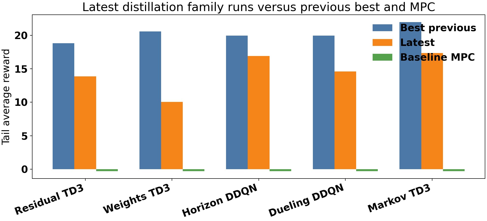
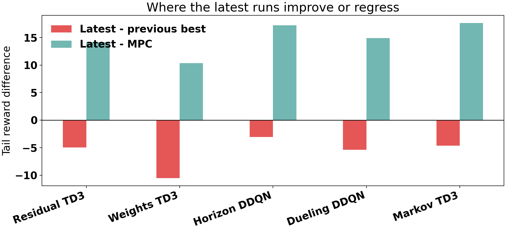
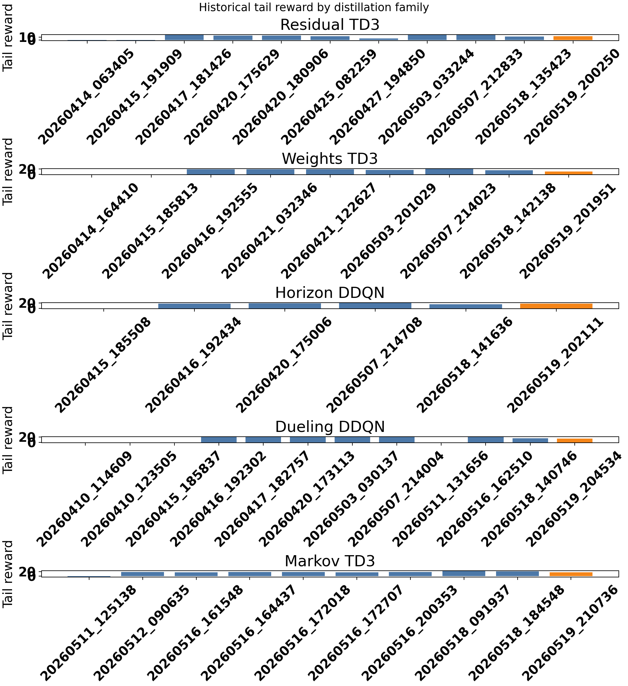
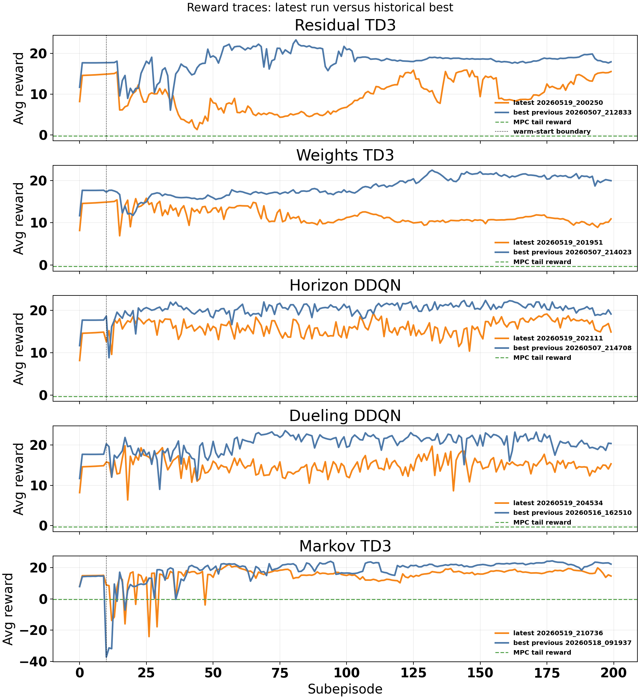
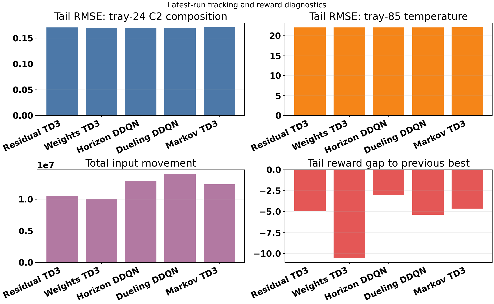
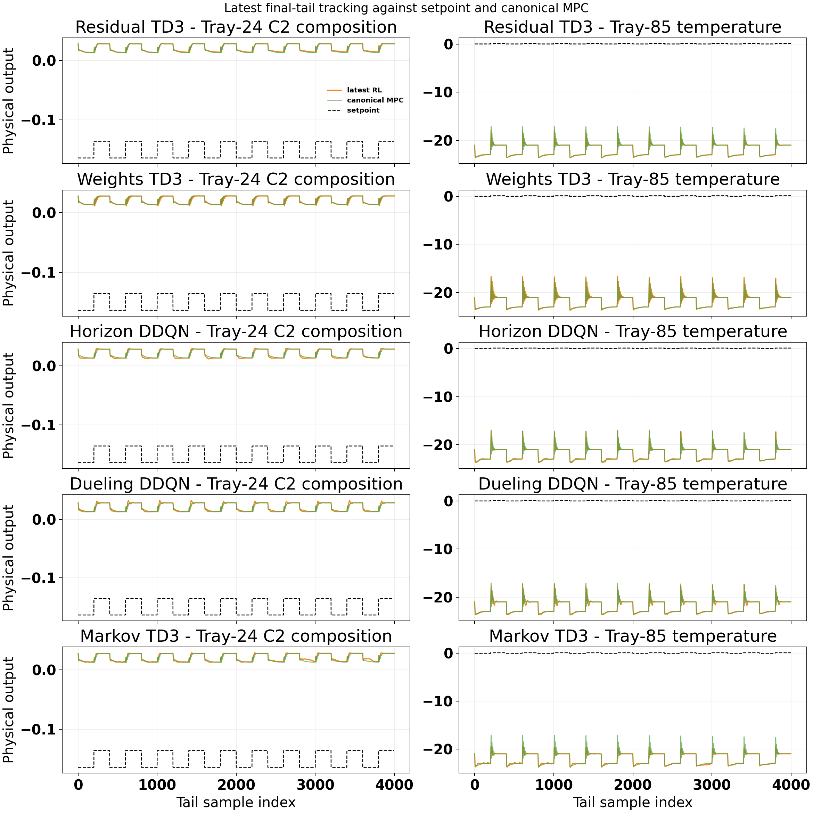
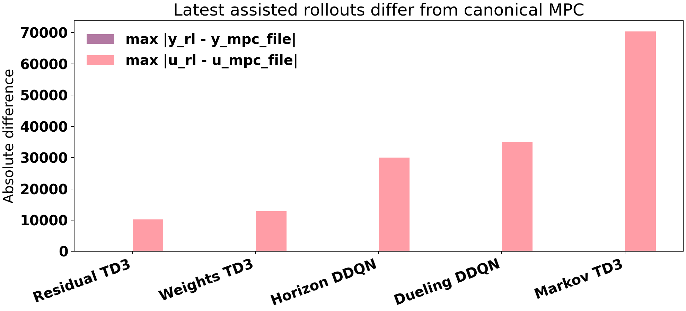
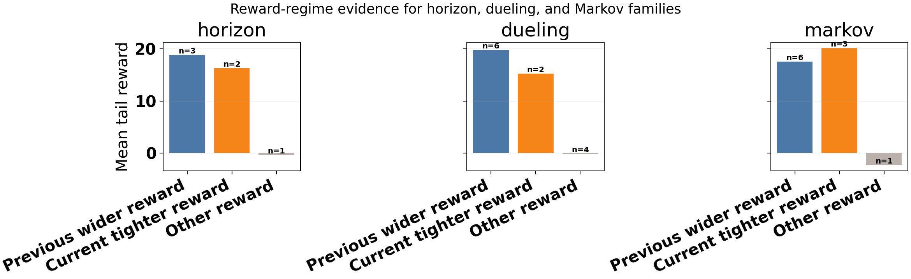
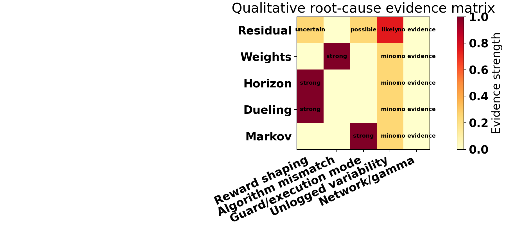

# Distillation Latest Family Runs: Extended Analysis

Date: 2026-05-19

## Executive Summary

This report analyzes the latest active distillation `.py` runs for the five current families:

- weights
- residual
- horizon
- dueling horizon
- Markov correction

The main question is why the May 19 runs were worse than earlier high-performing runs, and whether the drop is explained by network size, discount factor, or reward shaping.

The answer is method-dependent. The strongest evidence is:

- Horizon and dueling are most consistent with a reward-shaping change.
- Weights looks bad only if TD3 is compared against the historical SAC best; the latest TD3 run improved over the older TD3 reference.
- Residual is inconclusive because reward parameters and agent hyperparameters were not fully saved in the result bundle.
- Markov is mainly an execution-regime comparison: the historical best was a TD3-only/no-safeguard variant, while the latest run used guarded fallback logic.
- Network size and gamma were not the main observed cause in the May 19 comparison. The code defaults that produced these runs used `gamma = 0.995` and `[256, 256, 256]`, but those values did not change in a way that matches the family-level regressions.

Important update after this analysis: the distillation defaults were later restored to `gamma = 0.99` and `[128, 128]` in commit `a76313d`. That affects future `.py` runs only. It does not retroactively change the May 19 result bundles analyzed here.

## Files Inspected

Latest result bundles:

- `Distillation/Results/distillation_residual_td3_disturb_fluctuation_mismatch_rho_unified/20260519_200250/input_data.pkl`
- `Distillation/Results/distillation_weights_td3_disturb_fluctuation_mismatch_unified/20260519_201951/input_data.pkl`
- `Distillation/Results/distillation_horizon_disturb_fluctuation_mismatch_unified/20260519_202111/input_data.pkl`
- `Distillation/Results/distillation_dueling_horizon_disturb_fluctuation_mismatch_unified/20260519_204534/input_data.pkl`
- `Distillation/Results/distillation_markov_td3_disturb_fluctuation_unified/20260519_210736/input_data.pkl`

Baseline and history:

- `Distillation/Data/mpc_results_disturb_fluctuation.pickle`
- `Distillation/Results/distillation_residual_*_disturb_fluctuation*_unified/*/input_data.pkl`
- `Distillation/Results/distillation_weights_*_disturb_fluctuation*_unified/*/input_data.pkl`
- `Distillation/Results/distillation_horizon_disturb_fluctuation*_unified/*/input_data.pkl`
- `Distillation/Results/distillation_dueling_horizon_disturb_fluctuation*_unified/*/input_data.pkl`
- `Distillation/Results/distillation_markov_td3_disturb_fluctuation*_unified/*/input_data.pkl`

Code and defaults:

- `systems/distillation/config.py`
- `systems/distillation/notebook_params.py`
- `distillation_RL_assisted_MPC_weights_unified.py`
- `distillation_RL_assisted_MPC_residual_unified.py`
- `distillation_RL_assisted_MPC_horizons_unified.py`
- `distillation_RL_assisted_MPC_horizons_dueling_unified.py`
- `distillation_RL_assisted_MPC_markov_unified.py`
- `utils/rewards.py`
- `utils/horizon_runner.py`
- `utils/horizon_runner_dueling.py`
- `utils/weights_runner.py`
- `utils/residual_runner.py`
- `utils/markov_runner.py`

Generated analysis assets:

- `report/scripts/analyze_distillation_latest_family_runs_20260519.py`
- `report/figures/distillation_latest_family_runs_20260519/latest_family_summary.csv`
- `report/figures/distillation_latest_family_runs_20260519/history_tail_reward_summary.csv`
- `report/figures/distillation_latest_family_runs_20260519/summary.json`

## Method And Mathematical Framing

The distillation column controlled outputs are tray-24 ethane composition and tray-85 temperature. The manipulated inputs are reflux flow and reboiler duty. The canonical baseline is offset-free MPC under the fluctuation disturbance profile. Each RL family modifies the baseline in a different supervisory space:

- Horizon DQN selects prediction/control horizon recipes.
- Dueling DQN uses the same horizon-selection action space with dueling value and advantage decomposition.
- Weights TD3/SAC changes MPC penalty multipliers.
- Residual TD3/SAC adds bounded corrections to the MPC input move or input target.
- Markov TD3 proposes low-dimensional model-correction parameters that are either accepted or replaced by fallback logic.

For the closed loop, the output-tracking error is:

$$ e_t = y_t - y_{\mathrm{sp},t}. $$

The baseline MPC solves a constrained finite-horizon optimization with tracking and move-suppression terms:

$$ \min_{\Delta U} \sum_{k=0}^{N_p-1} \|y_{t+k|t} - y_{\mathrm{sp},t+k}\|_Q^2 + \sum_{k=0}^{N_c-1} \|\Delta u_{t+k|t}\|_R^2. $$

The RL supervisor receives a state containing tracking, observer, mismatch, or method-specific diagnostic features. The action changes the MPC recipe, penalties, residual authority, or Markov correction. The reward used in the current distillation family is a relative-band shaped reward:

$$ r_t = \left[-\left(\mathrm{err}_{\mathrm{eff}} + \mathrm{move} + \mathrm{lin}_{\mathrm{out}} + \mathrm{lin}_{\mathrm{in}}\right) + \mathrm{bonus}\right]\mathrm{reward\_scale}. $$

This matters because a controller can have similar physical tracking but receive a lower reward if the tolerance band is tightened or if the second-output penalty is increased. That is exactly the issue in the horizon and dueling families.

The report computes:

- final average reward
- last-20-subepisode average reward
- reward gap to the canonical MPC baseline
- reward gap to the best previous saved run
- reward gap to the best previous same-agent run when applicable
- output IAE and RMSE
- tail RMSE over the final 4000 samples
- total input movement
- config and reward-signature differences where saved

## Overall Result

All five latest runs still beat the canonical MPC reward baseline under the same comparison scoring. However, every latest run is worse than its own historical best saved run.

| Family | Latest run | Latest tail reward | Best previous tail reward | Gap to previous best | Gap to MPC baseline |
| --- | --- | ---: | ---: | ---: | ---: |
| Residual TD3 | `20260519_200250` | `13.85` | `18.82` | `-4.98` | `+14.15` |
| Weights TD3 | `20260519_201951` | `10.04` | `20.58` | `-10.54` | `+10.35` |
| Horizon DDQN | `20260519_202111` | `16.92` | `19.97` | `-3.04` | `+17.22` |
| Dueling DDQN | `20260519_204534` | `14.61` | `19.97` | `-5.37` | `+14.91` |
| Markov TD3 | `20260519_210736` | `17.35` | `21.98` | `-4.63` | `+17.65` |

Figure interpretation: the latest runs are not failures relative to MPC. The scientific problem is reproducibility of the best RL outcomes, not whether RL can beat the canonical MPC reward baseline in these saved runs.

Figure interpretation: the gap-to-MPC bars are positive for all families, while the gap-to-previous-best bars are negative for all families. This separates "better than MPC" from "worse than the historical best."

## Historical Context

The historical reward plot shows that each method family has gone through several regimes. Some early runs are near MPC-level or worse, while later runs become strongly positive after reward and workflow changes.

Figure interpretation: the latest run is not always the global family best. The high-performing windows are concentrated around earlier reward profiles or different execution modes.

The reward traces give the most direct evidence of whether the latest run is learning similarly to the previous best:

Figure interpretation: the latest runs generally reach useful positive reward, but they settle below the earlier best trajectories. The weights case is especially misleading because the previous best is SAC, while the latest run is TD3.

## Tracking And Input Diagnostics

The latest runs have broadly similar tracking RMSE magnitudes, especially on the tail window. Reward differences are therefore not explained only by large visible tracking failures.

Figure interpretation: the second output dominates the absolute error scale. Input movement differs across families and can affect the reward even when output traces look close.

The final-tail tracking overlay compares each latest RL rollout against the canonical MPC baseline and setpoint:

Figure interpretation: the latest RL rollouts are not identical to the canonical MPC baseline, but the family-to-family reward ranking is not simply a visual tracking ranking. Reward shaping and action/execution logic matter.

## Important Logging Inconsistency

Inside each latest RL bundle, the saved bundle-level `y_mpc` and `u_mpc` arrays match the RL trajectory:

- `max |y_rl - y_mpc| = 0`
- `max |u_rl - u_mpc| = 0`

However, comparing the same RL trajectories against `Distillation/Data/mpc_results_disturb_fluctuation.pickle` gives nonzero differences.

This means the per-run bundle fields called `y_mpc/u_mpc` should not be used as the MPC baseline for this analysis. The canonical MPC pickle is the meaningful comparator. Future result logging should either store the real same-scenario MPC trajectory or rename the mirrored arrays to avoid confusion.

## Reward-Regime Evidence

The horizon, dueling, and Markov families save `reward_params`, so they can be grouped by reward regime. The key reward change is:

| Parameter | Earlier wider reward | Latest tighter reward |
| --- | ---: | ---: |
| `k_rel[0]` | `0.3` | `0.3` |
| `k_rel[1]` | `0.02` | `0.01` |
| `band_floor_phys[0]` | `0.003` | `0.003` |
| `band_floor_phys[1]` | `0.3` | `0.2` |
| `Q_diag[0]` | `37000` | `37000` |
| `Q_diag[1]` | `1500` | `5000` |
| `beta` | `7` | `7` |
| `reward_scale` | `1` | `1` |

The second-output band became tighter and the second-output quadratic penalty increased by more than three times. This can reduce reward even for visually reasonable tray-85 temperature behavior.

Figure interpretation: for horizon and dueling, the previous wider reward regime is associated with the strongest historical tail rewards. Markov is different because the best current-tight run was also the TD3-only/no-safeguard execution variant.

## Family-Level Interpretation

### Horizon DDQN

Latest run:

- `20260519_202111`
- tail reward `16.92`
- previous best `20260507_214708`
- previous best tail reward `19.97`
- gap `-3.04`

The strongest explanation is reward shaping. The previous best used the wider reward profile:

- `k_rel = [0.3, 0.02]`
- `band_floor_phys = [0.003, 0.3]`
- `Q_diag = [37000, 1500]`

The latest run used:

- `k_rel = [0.3, 0.01]`
- `band_floor_phys = [0.003, 0.2]`
- `Q_diag = [37000, 5000]`

This narrows the acceptable tray-85 temperature band and increases the tray-85 penalty. The performance drop is therefore more consistent with reward geometry than with a network or discount-factor change.

### Dueling Horizon

Latest run:

- `20260519_204534`
- tail reward `14.61`
- previous best `20260516_162510`
- previous best tail reward `19.97`
- gap `-5.37`

This mirrors the standard horizon case. The previous best used the wider reward, while the latest run used the tighter current reward. Because the action space is still horizon selection, this is strong evidence that the dueling method is sensitive to the reward profile, especially the second-output band and weight.

### Weights TD3

Latest run:

- `20260519_201951`
- tail reward `10.04`
- previous all-agent best `20260507_214023`
- previous all-agent best tail reward `20.58`
- gap to all-agent best `-10.54`

This is not an apples-to-apples comparison. The historical best was SAC, while the latest run is TD3. Same-agent comparison gives a different story:

- latest TD3 tail reward: `10.04`
- previous TD3 tail reward: `-0.28`
- same-agent improvement: `+10.33`

So the weights result should not be framed as "the new weights code is worse" without saying "worse than the historical SAC weights run." The latest TD3 weights run is better than the older TD3 weights reference.

The missing piece is reward and hyperparameter provenance. The weights bundles do not save `reward_params`, `gamma`, or network layer sizes directly. This prevents a fully self-contained result audit from the pickle alone.

### Residual TD3

Latest run:

- `20260519_200250`
- tail reward `13.85`
- previous best `20260507_212833`
- previous best tail reward `18.82`
- gap `-4.98`

This family is the most ambiguous. The saved high-level config does not reveal a major difference between the latest run and the May 7 best run. Both are TD3 residual, mismatch-state, rho-authority runs with similar visible release setup.

The latest residual run had:

- behavioral cloning enabled
- BC active fraction around `0.10`
- post-warm-start action freeze of `5` subepisodes
- post-warm-start actor freeze of `5` subepisodes

Those features were also present in the recent residual family, so they do not cleanly explain the drop. Because residual bundles do not save `reward_params` or full TD3 architecture/discount metadata, the safest interpretation is:

- likely not proven to be network size
- likely not proven to be gamma
- possibly run-to-run RL variability
- possibly residual authority or BC handoff interacting poorly in this run
- definitely limited by missing provenance

### Markov TD3

Latest run:

- `20260519_210736`
- tail reward `17.35`
- previous best `20260518_091937`
- previous best tail reward `21.98`
- gap `-4.63`

This is not mainly a reward-shaping comparison. The latest and previous-best Markov bundles both store the current tighter reward:

- `k_rel = [0.3, 0.01]`
- `band_floor_phys = [0.003, 0.2]`
- `Q_diag = [37000, 5000]`
- `R_diag = [2500, 2500]`
- `beta = 7`
- `reward_scale = 1`

The key difference is execution regime:

- latest run: guarded Markov TD3 with `force_td3_execute = False`
- previous best: TD3-only/no-safeguard variant with `force_td3_execute = True`
- latest run: TD3 priority fallback enabled
- previous best: no saved priority fallback
- latest run: BC disabled
- previous best: BC enabled for 5 subepisodes

The latest Markov run accepted about `95.3%` of TD3 candidates and fell back about `4.7%` of the time. The previous best was less conservative and may receive higher reward when TD3 actions are useful, but it is not the same safety architecture.

## Root-Cause Matrix

The following matrix summarizes the evidence strength for each hypothesized cause.

Interpretation:

- Reward shaping is the strongest explanation for horizon and dueling.
- Algorithm mismatch is the strongest explanation for the weights gap versus historical best.
- Guard/execution mode is the strongest explanation for Markov.
- Residual remains uncertain because the saved provenance is incomplete.
- Network size and gamma have no strong evidence as the cause of the May 19 regressions.

## Network Size And Gamma Question

The saved result bundles do not directly store the network sizes or gamma values. That is a logging gap.

The conclusion about network size and gamma came from auditing the code defaults that produced the May 19 runs. Before the later rollback commit, the active distillation defaults were:

- DQN and dueling hidden layers: `[256, 256, 256]`
- TD3/SAC actor hidden layers: `[256, 256, 256]`
- TD3/SAC critic hidden layers: `[256, 256, 256]`
- discount factor: `gamma = 0.995`

Because those defaults were shared across the active families, they do not explain why horizon and dueling changed in a reward-specific way, why weights only regressed against SAC, or why Markov depended on guarded versus no-safeguard execution.

After this report was first created, we changed future distillation defaults back to:

- DQN and dueling hidden layers: `[128, 128]`
- TD3/SAC actor hidden layers: `[128, 128]`
- TD3/SAC critic hidden layers: `[128, 128]`
- discount factor: `gamma = 0.99`

That change is a good controlled next experiment, but it is not proof that the May 19 performance drop was caused by network size or gamma. To prove that, we need reruns where only network/gamma changes and reward/execution logic stays fixed.

## Bugs, Inconsistencies, And Risks Found

1. Bundle-level MPC trajectory fields are misleading.
   The latest bundles store `y_mpc/u_mpc` equal to `y_rl/u_rl`, so they cannot be used as an MPC comparator.

2. Reward provenance is incomplete for weights and residual.
   Those bundles do not save `reward_params`, which makes historical reward comparisons weaker.

3. Agent hyperparameter provenance is incomplete.
   The bundles do not consistently save `gamma`, actor/critic layer sizes, DQN hidden layers, or optimizer-level hyperparameters.

4. Weights historical comparison mixes algorithms.
   The apparent `-10.54` reward gap is TD3 latest versus SAC historical best, not TD3 versus TD3.

5. Markov historical comparison mixes safety regimes.
   The previous best is a no-safeguard TD3-only variant, while the latest run uses fallback logic.

## Recommended Next Experiments

1. Controlled network/gamma ablation.
   Run horizon, dueling, weights, residual, and Markov once with `gamma = 0.99` and `[128, 128]`, keeping reward and execution logic fixed. Confirm whether tail reward improves relative to the May 19 runs.

2. Controlled reward ablation for horizon and dueling.
   Re-run with the previous wider reward profile: `k_rel = [0.3, 0.02]`, `band_floor_phys = [0.003, 0.3]`, `Q_diag = [37000, 1500]`. If the reward recovers, the reward-shaping explanation is confirmed.

3. Weights SAC-vs-SAC and TD3-vs-TD3 comparison.
   Run latest code with both SAC and TD3 under the same reward, same state mode, same network/gamma, and same freeze schedule. Compare same-agent tail reward and tracking RMSE.

4. Residual provenance rerun.
   Repeat residual with explicit saved reward params, TD3 architecture, gamma, BC schedule, residual authority traces, and action-source traces.

5. Markov guarded versus no-safeguard matched comparison.
   Run guarded and no-safeguard Markov with identical reward and network/gamma settings. Report both reward and safety/fallback statistics.

6. Fix result logging.
   Save real canonical MPC comparison trajectories or remove mirrored `y_mpc/u_mpc` from RL bundles. Also save full `agent_config`, `reward_params`, `run_profile`, and commit hash.

## Bottom Line

The latest May 19 distillation runs are worse than the historical best runs, but the evidence does not support a single global cause. Reward shaping explains horizon and dueling. Algorithm mismatch explains much of the weights comparison. Execution/safety mode explains Markov. Residual remains uncertain because the result bundle does not preserve enough provenance.

Changing future defaults back to `gamma = 0.99` and `[128, 128]` is a good next controlled test. It should be evaluated as a new ablation, not treated as the already-proven explanation for the May 19 drop.
