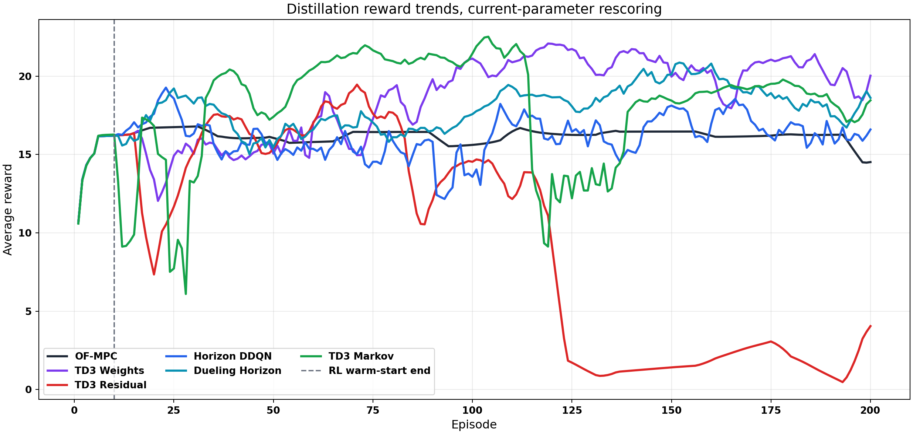
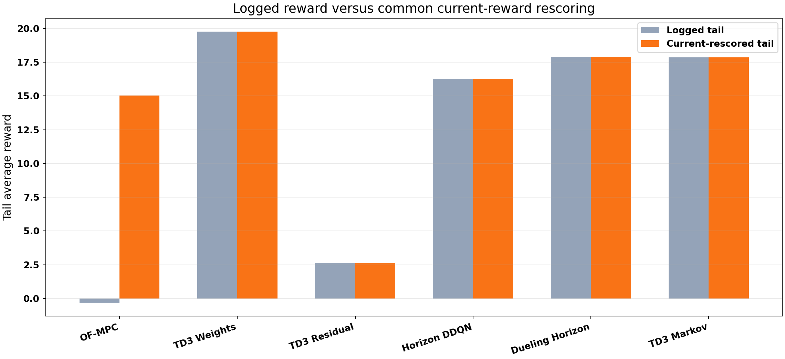
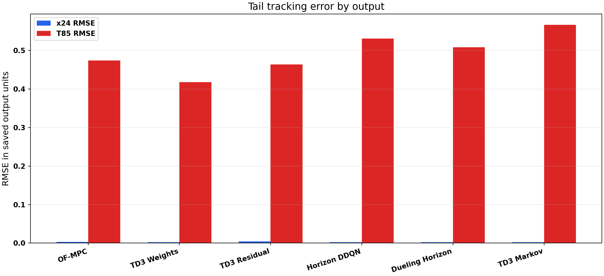
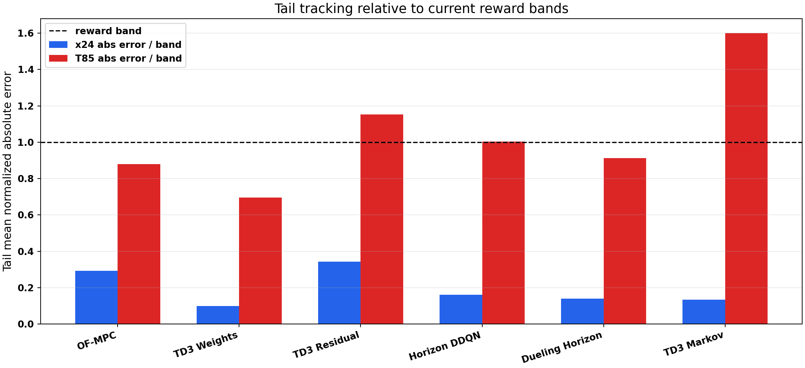
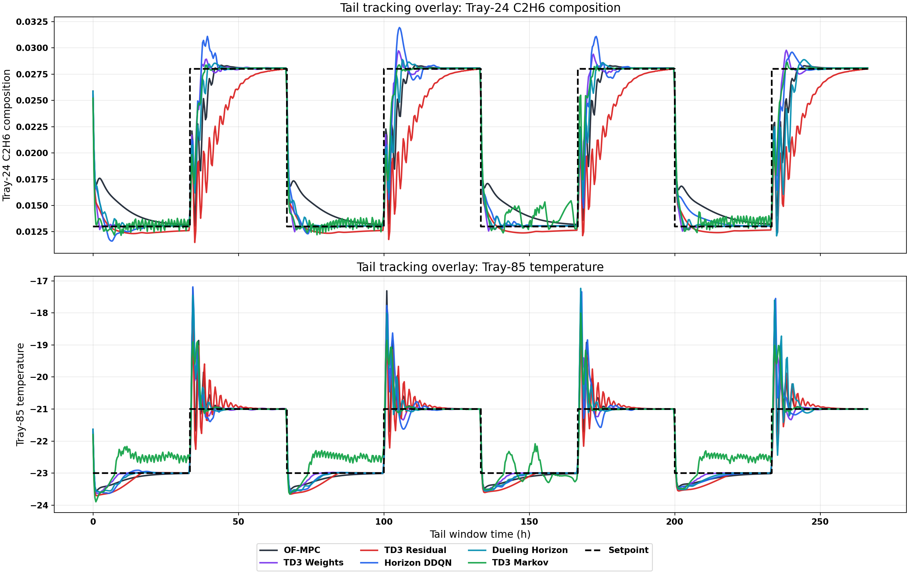
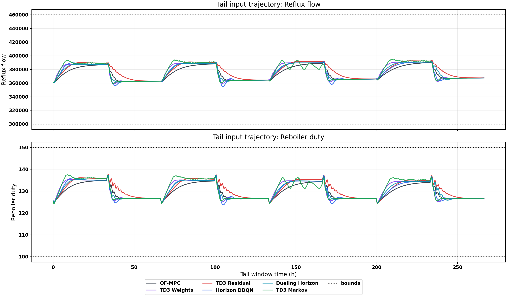
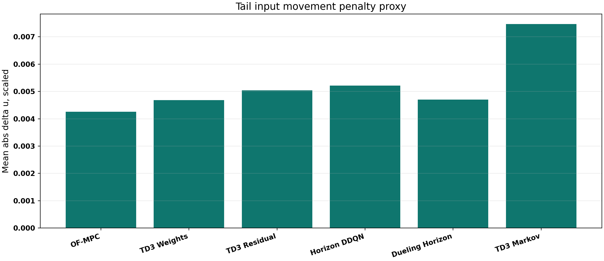
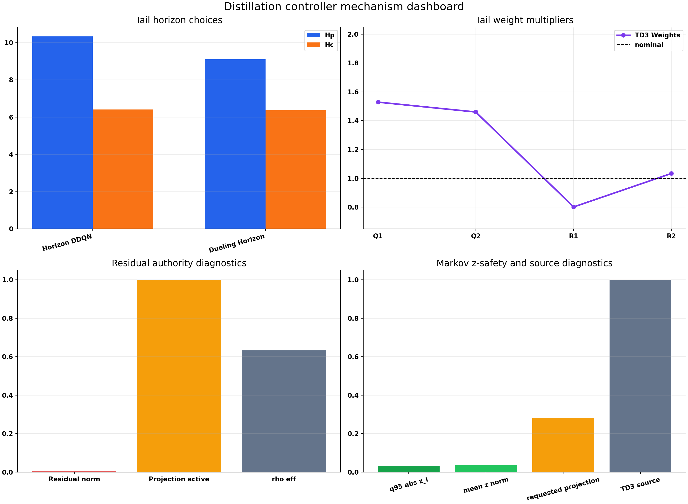
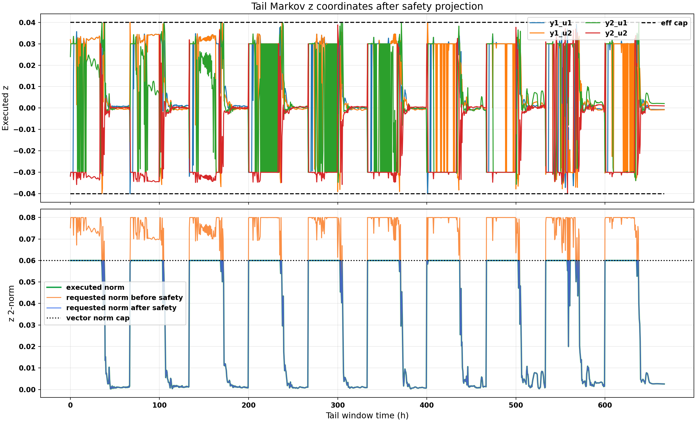
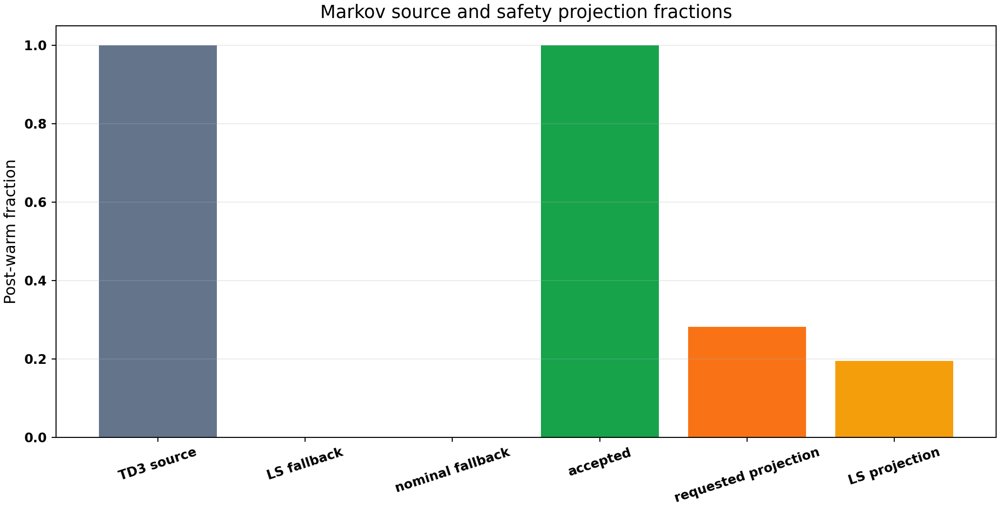

# Distillation Latest Family Runs Analysis

Date: 2026-05-21

## Objective

This report analyzes the latest disturbed distillation column runs for OF-MPC, TD3 weights, TD3 residual, horizon DDQN, dueling horizon DDQN, and TD3 Markov. The combined supervisor is intentionally excluded because it was not run in this batch.

## Files Inspected

| Method | Bundle | Episodes | Warm episodes |
| --- | --- | --- | --- |
| OF-MPC | Distillation/Data/mpc_results_disturb_fluctuation.pickle | 200 | 5 |
| TD3 Weights | Distillation/Results/distillation_weights_td3_disturb_fluctuation_mismatch_unified/20260521_150600/input_data.pkl | 200 | 10 |
| TD3 Residual | Distillation/Results/distillation_residual_td3_disturb_fluctuation_mismatch_rho_unified/20260521_152021/input_data.pkl | 200 | 10 |
| Horizon DDQN | Distillation/Results/distillation_horizon_disturb_fluctuation_mismatch_unified/20260521_154248/input_data.pkl | 200 | 10 |
| Dueling Horizon | Distillation/Results/distillation_dueling_horizon_disturb_fluctuation_mismatch_unified/20260521_154934/input_data.pkl | 200 | 10 |
| TD3 Markov | Distillation/Results/distillation_markov_td3_disturb_fluctuation_unified/20260521_162222/input_data.pkl | 200 | 10 |

All RL runs are disturbed fluctuation runs with 200 episodes and 400 control steps per episode. The saved RL `test_cycle` entries are all false, so these are training-rollout comparisons rather than frozen held-out evaluations.

## Coordinate And Reward Handling

The distillation controlled outputs are tray-24 ethane composition and tray-85 temperature, with reflux and reboiler duty as manipulated inputs. The saved output trajectory `y` is in the repository's output coordinates, while saved `y_sp` is a scaled-deviation setpoint. The report therefore converts setpoints before plotting or physical-error scoring:

$$ y_{\mathrm{sp},t}^{\mathrm{phys}} = \mathrm{unscale}(y_{\mathrm{sp},t}^{\mathrm{scaled-dev}} + y_{\mathrm{ss}}^{\mathrm{scaled}}). $$

Rewards are also recomputed from the saved scaled tracking and move arrays using the current distillation reward defaults. Current reward parameters are `Q_diag = [37000.0, 1500.0]`, `R_diag = [2500.0, 2500.0]`, `k_rel = [0.3, 0.01]`, `band_floor_phys = [0.003, 0.2]`.

For each output, the current reward band is `max(k_rel * abs(setpoint), band_floor_phys)`. The band-normalized error plots divide absolute physical tracking error by that band, so composition and temperature can be compared without forcing them onto the same raw scale.

## Controller Defaults Checked

The active distillation defaults resolve to the enlarged networks `[512, 512, 512, 512, 512]` and `gamma = 0.99` for the DQN/TD3 families. The latest Markov bundle stores `markov_z_bound = 0.040` and `z_safety = {"enabled": true, "full_cap": 0.04, "probation_cap": 0.02, "protected_cap": 0.02, "ramp_end_cap": 0.04, "ramp_start_cap": 0.03, "vector_norm_cap": {"enabled": true, "max_norm": 0.06}}`.

## Main Quantitative Results

| Method | Logged tail reward | Current tail reward | x24 RMSE | T85 RMSE | Band-normalized MAE | Mean abs du scaled |
| --- | --- | --- | --- | --- | --- | --- |
| OF-MPC | -0.31 | 15.05 | 0.00309 | 0.474 | 0.586 | 0.00426 |
| TD3 Weights | 19.76 | 19.76 | 0.00213 | 0.418 | 0.397 | 0.00469 |
| TD3 Residual | 2.64 | 2.64 | 0.00436 | 0.464 | 0.748 | 0.00504 |
| Horizon DDQN | 16.26 | 16.26 | 0.00249 | 0.531 | 0.583 | 0.00522 |
| Dueling Horizon | 17.90 | 17.90 | 0.00262 | 0.508 | 0.526 | 0.00470 |
| TD3 Markov | 17.85 | 17.85 | 0.00215 | 0.567 | 0.867 | 0.00746 |

Best current-rescored tail reward: **TD3 Weights** with `19.76`. Relative to OF-MPC, this is a tail-reward change of `4.72`.
Best x24 composition RMSE is **TD3 Weights**. Best T85 temperature RMSE is **TD3 Weights**.

## Ranking And Interpretation

| Method | Current tail reward | x24 RMSE | T85 RMSE | Outside-band fraction |
| --- | --- | --- | --- | --- |
| TD3 Weights | 19.76 | 0.00213 | 0.418 | 0.213 |
| Dueling Horizon | 17.90 | 0.00262 | 0.508 | 0.260 |
| TD3 Markov | 17.85 | 0.00215 | 0.567 | 0.337 |
| Horizon DDQN | 16.26 | 0.00249 | 0.531 | 0.277 |
| OF-MPC | 15.05 | 0.00309 | 0.474 | 0.245 |
| TD3 Residual | 2.64 | 0.00436 | 0.464 | 0.300 |

The current-reward ranking should be read together with physical tracking and input movement. A high scalar reward can come from staying inside the reward bands with modest move penalties, while raw RMSE exposes output-specific transients.

## Controller Mechanism Diagnostics

| Method | Tail Hp | Tail Hc | Q1 mult | Q2 mult | Residual norm | q95 abs z_i | TD3 source | Proj active |
| --- | --- | --- | --- | --- | --- | --- | --- | --- |
| OF-MPC | NA | NA | NA | NA | NA | NA | NA | NA |
| TD3 Weights | NA | NA | 1.529 | 1.460 | NA | NA | NA | NA |
| TD3 Residual | NA | NA | NA | NA | 0.00328 | NA | NA | NA |
| Horizon DDQN | 10.33 | 6.41 | NA | NA | NA | NA | NA | NA |
| Dueling Horizon | 9.10 | 6.38 | NA | NA | NA | NA | NA | NA |
| TD3 Markov | NA | NA | NA | NA | NA | 0.0333 | 1.000 | 0.281 |

## Findings

- **TD3 Weights** is the strongest latest run by current-rescored tail reward. Its tail reward is `19.76` versus OF-MPC `15.05`.
- TD3 Markov has current-rescored tail reward `17.85` and q95 abs z_i `0.0333` under the new `z_bound = 0.040` safety profile.
- Markov is strong by scalar reward but not uniformly best by tracking: it has composition RMSE `0.00215` while its T85 band-normalized tail error is `1.600`, the largest in this latest batch.
- Markov source diagnostics show post-warm TD3 source fraction `1.000`, LS fallback fraction `0.000`, and requested-z projection activity `0.281`.
- TD3 Residual is highly safety-projected in the tail: residual projection-active fraction is `1.000` and mean effective rho is `0.632`. That means the raw residual policy is asking for more authority than the safety/authority layer allows.
- TD3 Residual shows a late reward collapse in the learning curve and ends with tail reward `2.64`. The projection diagnostics make this look more like an authority mismatch than a simple reward-scaling artifact.
- TD3 Weights uses tail multipliers Q1 `1.529`, Q2 `1.460`, R1 `0.802`, and R2 `1.034`. The learned policy is not simply increasing all penalties uniformly.
- Horizon DDQN and dueling horizon choose average tail horizons near Hp/Hc `10.33/6.41` and `9.10/6.38` respectively.

## Bugs, Inconsistencies, And Risks

- The setpoint conversion remains essential. Plotting `y` directly against saved `y_sp` would again mix physical output coordinates with scaled-deviation setpoints.
- These runs are still training rollouts. Because the saved test cycles are all false, the report should not be treated as a final generalization claim.
- The bundles still do not consistently store network size and gamma directly, so this report checks current defaults from code and saved config snapshots rather than relying only on result bundles.
- High projection activity in residual or Markov means the learned raw policy and the safety layer disagree. That is not automatically bad, but it is a sign that the actor may be spending capacity outside the executable action set.

## Figure Audit

The generated figures were visually checked after creation. The tracking overlay uses converted physical setpoints and separate output panels, avoiding the previous unreadable mixed-scale plot. Input plots include the physical input bounds. Markov plots show executed z, effective caps, vector-norm cap, and projection/source fractions.

## Recommended Next Experiments

1. Run a frozen-policy evaluation pass for all five distillation RL families and OF-MPC under the same fluctuation disturbance. Metric to watch: current-rescored tail reward and band-normalized error without exploration.
2. For Markov, compare this guarded `z_bound = 0.04` run with the previous TD3-only/no-safeguard result under identical current reward scoring. Metric to watch: reward gained per projection/fallback avoided.
3. For residual, reduce raw residual authority or add a stronger behavior-cloning/inside-authority penalty if projection remains near one. Metric to watch: projection-active fraction and tail reward.
4. For weights and horizons, repeat with two additional seeds before drawing method-level conclusions, because these are single training rollouts with large networks.

## Remaining Uncertainty

The analysis uses saved bundles from completed runs and does not rerun Aspen. It gives a fair current-reward comparison for the latest trajectories, but it does not prove closed-loop robustness until frozen-policy tests or multi-seed repeats are available.
