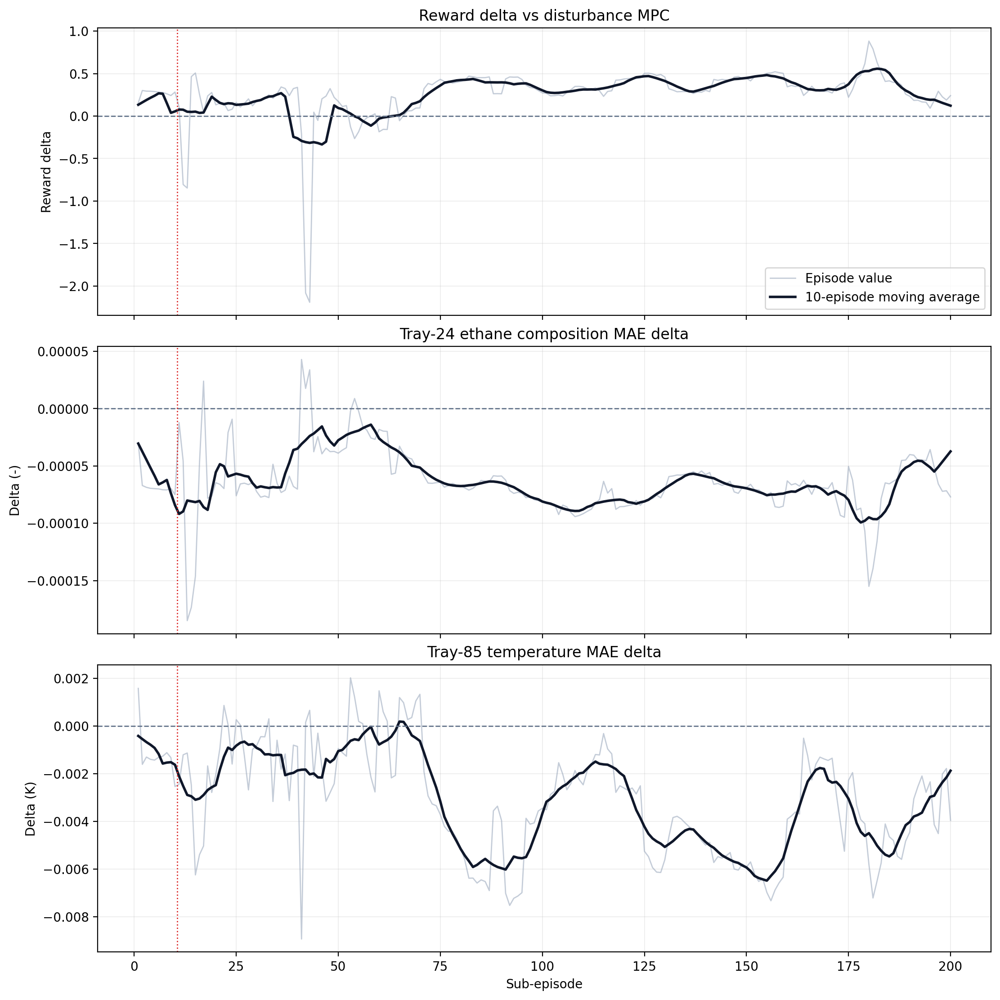
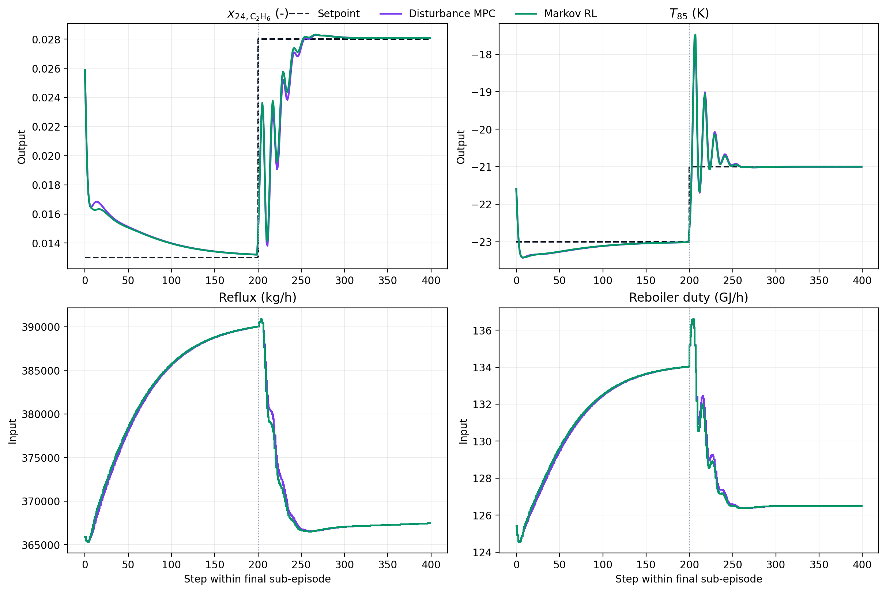
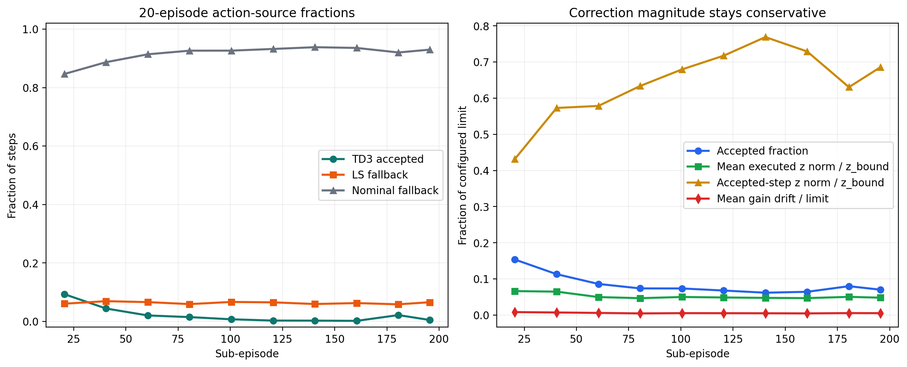

# Distillation Markov Latest Run Review

Date: 2026-05-13

## Objective

This note analyzes the latest saved distillation Markov-correction run against the canonical disturbance MPC baseline.

Exact artifacts used:

- Markov RL run: `Distillation/Results/distillation_markov_td3_disturb_fluctuation_unified/20260512_090635/`
- Paired comparison bundle: `Distillation/Results/distillation_compare_markov_td3_disturb_fluctuation/20260512_090646/input_data.pkl`
- Disturbance MPC baseline: `Distillation/Data/mpc_results_disturb_fluctuation.pickle`
- Generated analysis assets: `report/figures/distillation_markov_latest_20260513/`

The main question is whether the latest Markov controller is meaningfully better than disturbance MPC, or only marginally different while remaining stable.

## Files inspected

- `distillation_RL_assisted_MPC_markov_unified.ipynb`
- `systems/distillation/notebook_params.py`
- `utils/markov_runner.py`
- `utils/rewards.py`
- `Distillation/Results/distillation_markov_td3_disturb_fluctuation_unified/20260512_090635/input_data.pkl`
- `Distillation/Results/distillation_markov_td3_disturb_fluctuation_unified/20260512_090635/markov_stage_diagnostics.csv`
- `Distillation/Results/distillation_compare_markov_td3_disturb_fluctuation/20260512_090646/input_data.pkl`
- `Distillation/Data/mpc_results_disturb_fluctuation.pickle`
- `report/distillation_matrix_structured_step4g_latest_2026_05_04.md`
- `report/distillation_reward_audit.md`

## What the current method is doing

The distillation case tracks tray-24 ethane composition and tray-85 temperature:

$$ y_t = [x_{24,\mathrm{C_2H_6}},\; T_{85}]^\top, \qquad u_t = [\mathrm{reflux},\; \mathrm{reboiler}]^\top. $$

The baseline controller is the offset-free MPC already used elsewhere in the repo. The Markov layer keeps that nominal controller, then proposes a low-dimensional correction to the lifted finite-horizon Markov blocks:

$$ G(z_t) = G_0 + \sum_{i=1}^{d_z} z_{t,i} B_i. $$

The candidate correction is not executed directly. It is screened by three gates in `utils/markov_runner.py`:

$$ s_{\mathrm{pred}}(z_t) > s_{\min}, \qquad \mathrm{drift}(G(z_t), G_0) \le d_{\max}, \qquad J_{\mathrm{nom}}(G(z_t)) \le J_{\mathrm{nom}}(G_0) + \epsilon. $$

If the TD3 proposal is rejected, the runner can fall back to a least-squares correction and then to nominal MPC.

The reward comes from `utils/rewards.py` and remains the shared relative-band reward:

$$ r_t = -(\mathrm{err}_{\mathrm{eff}} + \mathrm{move} + \mathrm{lin}_{\mathrm{out}} + \mathrm{lin}_{\mathrm{in}}) + \mathrm{bonus}. $$

For this run the important qualitative point is that the reward can improve even when the closed loop stays visually close to nominal MPC, because the Markov layer is only a sparse correction surface on top of the baseline.

## Main result

The latest run is stable and slightly better than disturbance MPC, but the gain is small enough that the closed-loop behavior is still effectively baseline-like.

| Phase | Reward delta vs MPC | Output 1 MAE delta | Output 2 MAE delta | RL/MPC move ratio |
| --- | ---: | ---: | ---: | ---: |
| Post-live episodes 11-200 | `+0.259` | `-0.000064` | `-0.00320 K` | `1.012` |
| Tail-20 episodes | `+0.316` | `-0.000063` | `-0.00413 K` | `1.009` |
| Tail-10 episodes | `+0.192` | `-0.000055` | `-0.00292 K` | `1.016` |

Descriptive bootstrap intervals over post-live episodes:

- reward delta: `+0.259 [0.207, 0.300]`
- output-1 MAE delta: `-0.000064 [-0.000068, -0.000060]`
- output-2 MAE delta: `-0.00320 K [-0.00353, -0.00286]`
- normalized move delta: `+0.000074 [0.000062, 0.000087]`

These intervals are descriptive only. The sub-episodes are sequential, not independent experiments.

The figure above shows why the user description is accurate. The reward delta is usually positive after warm start, but the output-error deltas stay very close to zero. The controller is better in aggregate, not decisively different in trajectory shape.

## Why the gain is small

### 1. The trajectories remain very close to disturbance MPC

In the final sub-episode, the mean absolute RL-MPC output difference is only:

- composition: `8.34e-05`
- temperature: `0.0090 K`

Even the maximum final-episode output separation is modest:

- composition: `8.13e-04`
- temperature: `0.161 K`

That is consistent with a controller that slightly reshapes the nominal solution rather than replacing it.

### 2. Most steps still execute nominal MPC

Post-live action-source fractions are:

- accepted correction fraction: `8.52%`
- TD3 accepted fraction: `2.21%`
- LS fallback fraction: `6.31%`
- nominal fallback fraction: `91.48%`

In the tail-20 episodes the controller becomes even more nominal:

- accepted correction fraction: `7.21%`
- TD3 accepted fraction: `0.91%`
- LS fallback fraction: `6.30%`
- nominal fallback fraction: `92.79%`

So the current Markov workflow is not acting as a dominant adaptive controller. It is a conservative correction layer that intervenes rarely.

The correction size diagnostics reinforce that point:

- mean executed correction norm in tail-20: `0.00248`
- accepted-step mean correction norm in tail-20: `0.0344`
- with the canonical notebook default `z_bound = 0.05`, that is about `5.0%` of the bound on average over all steps and about `68.8%` of the bound only on accepted steps
- mean gain drift in tail-20: `0.000538`, which is about `0.54%` of the stored drift limit `0.10`

### 3. The small improvement is somewhat stronger in the second setpoint block

Each `400`-step sub-episode contains two `200`-step setpoint blocks. The tail-20 blockwise MAE summary is:

| Tail-20 block | Output 1 RL | Output 1 MPC | Delta | Output 2 RL | Output 2 MPC | Delta |
| --- | ---: | ---: | ---: | ---: | ---: | ---: |
| SP1, steps 1-200 | `0.001473` | `0.001508` | `-0.000035` | `0.1686 K` | `0.1717 K` | `-0.0031 K` |
| SP2, steps 201-400 | `0.001491` | `0.001582` | `-0.000092` | `0.2073 K` | `0.2125 K` | `-0.0052 K` |

This does not change the overall conclusion, but it suggests the current correction is slightly more useful in the second half of the episode, where the setpoint is more demanding.

## Mathematical interpretation

The latest run behaves like a gated bias-correction regime rather than a new plant-model regime.

The measured pattern is:

1. TD3 proposals are screened heavily.
2. Least-squares fallback remains the dominant accepted correction path.
3. Nominal MPC still supplies more than `90%` of executed steps post-live.

So the observed reward lift is best interpreted as:

$$ \text{small local improvement} + \text{strong nominal anchoring}, $$

not as evidence that the Markov policy has learned a materially different control law.

The fact that both outputs improve slightly while move effort rises slightly is also consistent with a conservative adaptation layer:

$$ \Delta J_{\mathrm{track}} < 0, \qquad \Delta J_{\mathrm{move}} > 0, \qquad |\Delta J| \text{ small}. $$

In other words, the controller is using a little extra actuator motion to buy a little extra tracking quality, but the tradeoff remains close to the disturbance MPC operating point.

## Bugs, inconsistencies, or risks found

- The saved Markov bundle does not persist a full `config_snapshot`. That weakens experiment provenance because the report cannot prove every runtime setting from the bundle alone.
- The saved bundle also omits `markov_z_bound`. The normalization in the correction-limit figure therefore uses the current canonical distillation notebook default `z_bound = 0.05` from `systems/distillation/notebook_params.py`. That does not affect reward, MAE, RMSE, or move calculations, but it does affect the normalized correction-scale interpretation.
- The paired compare bundle stores reward arrays and paths only. Output and input metrics had to be reconstructed from the RL bundle plus the baseline bundle. That reconstruction is valid, but the compare artifact is not fully self-contained.
- Because TD3 acceptance is extremely low in the tail, the current positive result might be driven mostly by LS fallback rather than by the learned policy itself.

## Figure and table updates made

New assets saved under `report/figures/distillation_markov_latest_20260513/`:

- `fig_reward_and_output_error_deltas.png`
- `fig_final_episode_tracking.png`
- `fig_action_source_and_correction_limits.png`
- `summary_metrics.csv`
- `summary.json`

## Literature and prior repo context

No new external citation was added for this note because the question is an internal run audit rather than a literature claim.

The interpretation is consistent with earlier repo findings:

- `report/distillation_reward_audit.md` already showed that the distillation reward geometry is sensitive and can create small reward differences without large visible tracking changes.
- `report/distillation_matrix_structured_step4g_latest_2026_05_04.md` already showed that distillation adaptation should be interpreted through acceptance behavior and fallback pressure, not by reward alone.

## Recommended next experiments

### 1. Separate the LS contribution from the TD3 contribution

Purpose:
determine whether the current gain is actually a learned-policy benefit or mostly an adaptive least-squares benefit.

Files:
`distillation_RL_assisted_MPC_markov_unified.ipynb`, `utils/markov_runner.py`

What to change:

- run an LS-only variant with `run_adaptive_ls = True` and `run_rl_proposal = False`
- run a TD3-without-LS variant with `run_adaptive_ls = False`, `run_rl_proposal = True`
- compare both with the current hybrid

What should improve:
if TD3 is genuinely useful, the hybrid should beat LS-only on reward delta and on tail-20 temperature MAE.

Failure mode to watch:
if LS-only matches the hybrid within `5%` on reward delta and MAE, then the current TD3 layer is not earning its complexity.

What figure should be generated:
reuse the reward-error delta figure plus the action-source figure for each variant.

What confirms the idea:
the hybrid should produce a clear gain over LS-only while keeping move ratio below `1.03`.

### 2. Run a conservative acceptance-budget ablation

Purpose:
test whether the current near-baseline result is caused by an over-tight acceptance gate.

Files:
`distillation_RL_assisted_MPC_markov_unified.ipynb`, `systems/distillation/notebook_params.py`

What to change:

- keep the current basis family
- increase `nominal_cost_relative_tol` slightly, for example `0.10 -> 0.15`
- reduce `s_pred_min` slightly, for example `1e-6 -> 5e-7`
- change one gate at a time

What should improve:
accepted-correction fraction should rise into roughly the `12%` to `15%` range, with a meaningful increase in reward delta or tail-20 temperature MAE improvement.

Failure mode to watch:
reward stays similar while move ratio or tail temperature variance increases.

What figure should be generated:
the same action-source figure plus a tail-20 blockwise MAE table.

What confirms the idea:
post-live reward delta should move beyond about `+0.5` and tail-20 temperature MAE improvement should exceed `0.01 K` without move ratio exceeding `1.03`.

### 3. Run a reward-balance pilot only after the mechanism split

Purpose:
test whether the current Markov controller is limited by the distillation reward geometry rather than by the adaptation surface itself.

Files:
`systems/distillation/config.py`, `distillation_RL_assisted_MPC_markov_unified.ipynb`

What to change:

- first pilot: reduce output-1 dominance by lowering `Q_diag[0]`, for example `37000 -> 10000`
- optional second pilot: keep that reweighting and change `bonus_kind` from `"exp"` to `"power"` with a smaller effective cliff

What should improve:
tail-20 temperature MAE should improve more than the current `0.004 K` scale, while composition does not regress materially.

Failure mode to watch:
reward improves only because composition dominates less, but total tracking quality does not change.

What figure should be generated:
the same reward-error delta figure and the final-episode tracking figure, plus the reward-geometry comparison already used in earlier distillation audits.

What confirms the idea:
temperature improvement grows materially while composition remains at least neutral and move ratio stays close to `1.0`.

## Remaining uncertainty

- The present result is positive but tiny. It is not yet clear whether the Markov family has hit its true performance ceiling on this case or whether the acceptance gate is simply too conservative.
- The bundle provenance is weaker than ideal because the full runtime config was not saved.
- The current report can show that the latest run is slightly better than disturbance MPC, but it cannot yet show that TD3 itself is the main cause of that improvement.
