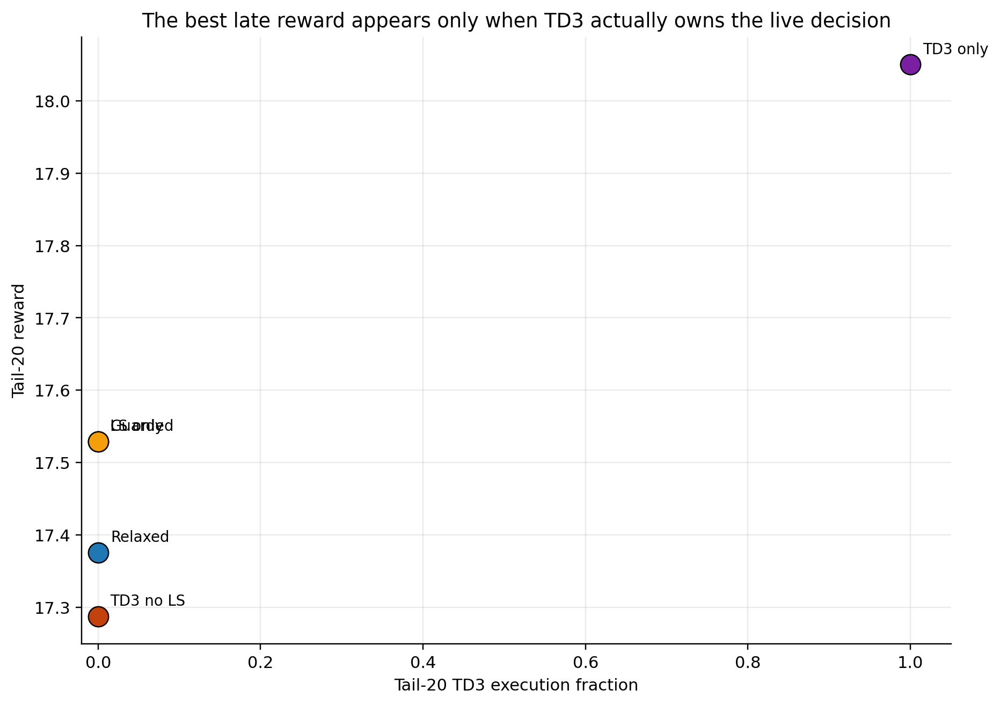
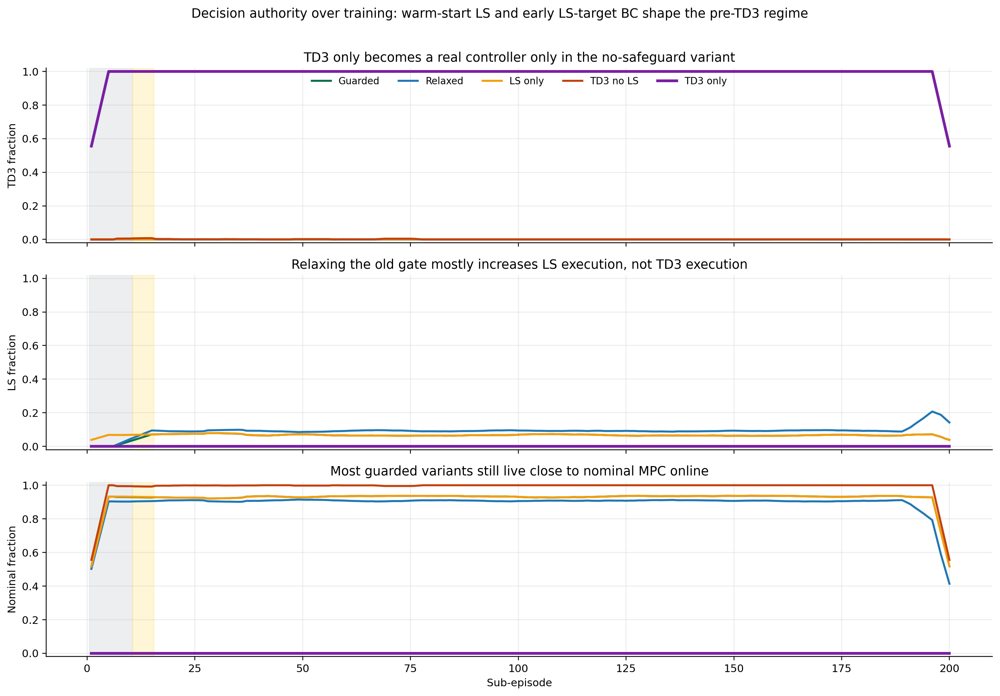
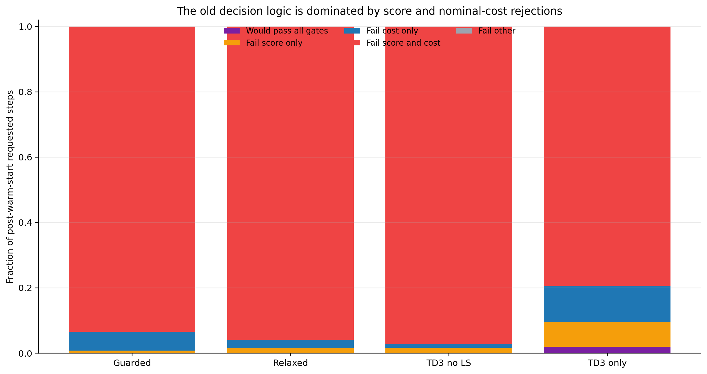
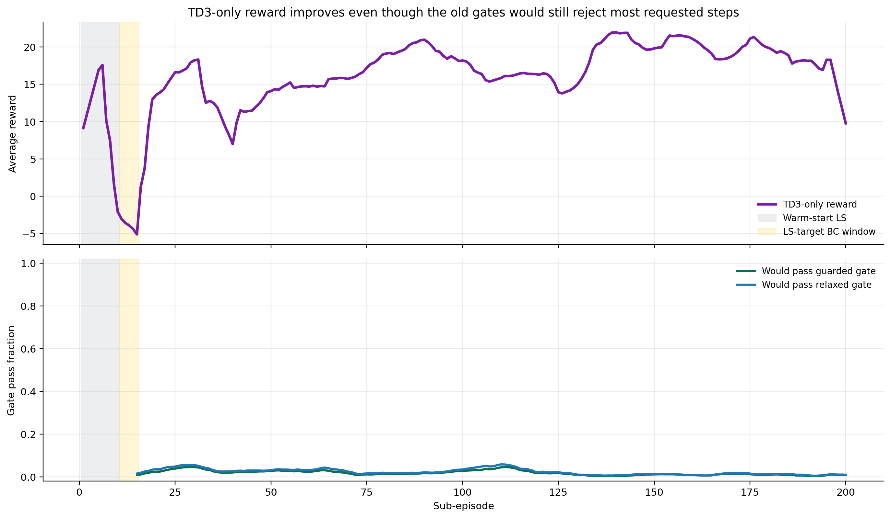

# Distillation Markov Decision-Authority Review For Making TD3 The Heart Of The Method

Date: 2026-05-17

## Objective

Extend the distillation Markov analysis beyond reward comparison and answer a more specific method question:

How do we redesign the decision logic so TD3 becomes the primary live decision-maker, while LS and nominal MPC remain disciplined fallback tools instead of dominating the controller?

This note is an extension of
[distillation_markov_td3_only_family_2026_05_16.md](distillation_markov_td3_only_family_2026_05_16.md),
but with a stronger focus on runtime authority, fallback logic, replay consequences, and training bias.

Important scope note:
this review is based on the latest **completed** saved Markov runs from 2026-05-16.
It does **not** include the currently running May 17 TD3-only temperature-retuned notebook.

## Files inspected

- `distillation_RL_assisted_MPC_markov_unified.ipynb`
- `distillation_RL_assisted_MPC_markov_relaxed_acceptance_unified.ipynb`
- `distillation_RL_assisted_MPC_markov_ls_only_unified.ipynb`
- `distillation_RL_assisted_MPC_markov_td3_without_ls_unified.ipynb`
- `distillation_RL_assisted_MPC_markov_td3_only_no_safeguard_unified.ipynb`
- `systems/distillation/notebook_params.py`
- `utils/markov_runner.py`
- `report/distillation_markov_td3_only_family_2026_05_16.md`
- `report/scripts/generate_distillation_markov_td3_only_family_assets_20260516.py`
- `Distillation/Results/distillation_markov_td3_disturb_fluctuation_unified/20260516_172018/input_data.pkl`
- `Distillation/Results/distillation_markov_td3_disturb_fluctuation_unified/20260516_172018/markov_stage_diagnostics.csv`
- `Distillation/Results/distillation_markov_td3_disturb_fluctuation_relaxed_acceptance_unified/20260516_172707/input_data.pkl`
- `Distillation/Results/distillation_markov_td3_disturb_fluctuation_relaxed_acceptance_unified/20260516_172707/markov_stage_diagnostics.csv`
- `Distillation/Results/distillation_markov_td3_disturb_fluctuation_ls_only_unified/20260516_164437/input_data.pkl`
- `Distillation/Results/distillation_markov_td3_disturb_fluctuation_ls_only_unified/20260516_164437/markov_stage_diagnostics.csv`
- `Distillation/Results/distillation_markov_td3_disturb_fluctuation_td3_without_ls_unified/20260516_161548/input_data.pkl`
- `Distillation/Results/distillation_markov_td3_disturb_fluctuation_td3_without_ls_unified/20260516_161548/markov_stage_diagnostics.csv`
- `Distillation/Results/distillation_markov_td3_disturb_fluctuation_td3_only_no_safeguard_unified/20260516_200353/input_data.pkl`
- `Distillation/Results/distillation_markov_td3_disturb_fluctuation_td3_only_no_safeguard_unified/20260516_200353/markov_stage_diagnostics.csv`
- `report/scripts/generate_distillation_markov_td3_decision_authority_assets_20260517.py`

## What the current Markov method is actually doing

The live decision is not raw TD3 control. The controller still solves MPC every step, then optionally lets TD3 reshape the Markov blocks that define the lifted prediction structure.

The runtime skeleton is:

$$ U_0 = \arg\min_U J(U; G_0). $$

TD3 proposes a bounded correction:

$$ z_{\mathrm{rl}} = z_{\max}\,\mathrm{clip}(a_{\mathrm{rl}}, -1, 1), \qquad G(z_{\mathrm{rl}}) = \mathcal{T}(M_0 + \Delta M(z_{\mathrm{rl}})). $$

Then the corrected candidate is solved again:

$$ U_{\mathrm{rl}} = \arg\min_U J(U; G(z_{\mathrm{rl}})). $$

In the guarded family, TD3 is accepted only when all of the following hold:

$$ s_{\mathrm{pred}} > s_{\min}, \qquad d_{\mathrm{gain}} \le d_{\max}, \qquad \Delta J_{\mathrm{nom}} \le \epsilon_{\mathrm{abs}} + \epsilon_{\mathrm{rel}} |J_0|. $$

If the TD3 proposal fails, the controller can fall back to LS and then to nominal MPC.

There are two training-side details that matter a lot:

1. `behavioral_cloning.target_mode = "ls_action"` is enabled in the Markov defaults.
2. `rl_store_executed_action_in_replay = True`, so fallback-heavy execution means replay is filled mostly with LS or nominal behavior rather than the raw TD3 proposal.

For the saved distillation Markov runs, warm start lasts 10 sub-episodes, and LS-target behavioral cloning remains active from step 4001 to step 6000, which is exactly the next 5 sub-episodes after warm start.

## Main family result

The authority picture is even clearer than the reward picture:

only the TD3-only no-safeguard notebook makes TD3 the actual live decision-maker.

### Tail-20 execution and reward summary

| Variant | Tail-20 reward | Final reward | Tail-20 TD3 | Tail-20 LS | Tail-20 nominal |
| --- | ---: | ---: | ---: | ---: | ---: |
| Guarded | `17.5291` | `16.2423` | `0.0000` | `0.0673` | `0.9328` |
| Relaxed | `17.3759` | `16.2185` | `0.00025` | `0.1425` | `0.8573` |
| LS only | `17.5291` | `16.2423` | `0.0000` | `0.0673` | `0.9328` |
| TD3 without LS | `17.2874` | `16.0475` | `0.0000` | `0.0000` | `1.0000` |
| TD3 only | `18.0502` | `19.2195` | `1.0000` | `0.0000` | `0.0000` |

This gives two strong conclusions:

1. the guarded and relaxed variants are still fallback-dominated controllers
2. the TD3-only variant is the only branch where TD3 is truly allowed to improve the live decision

## Why the older methods almost always fall back

The saved diagnostics say the bottleneck is **not** gain drift.

For every relevant run, the requested drift test passes on essentially `100%` of post-warm-start requested steps.

The real choke points are:

1. the positive prediction-score requirement
2. the nominal-cost guard
3. storing fallback behavior into replay
4. LS-target behavioral cloning right after warm start

### Post-warm-start requested-step gate statistics

| Variant | TD3 gate pass | Score pass | Drift pass | Cost pass |
| --- | ---: | ---: | ---: | ---: |
| Guarded | `0.0066%` | `5.70%` | `100%` | `0.80%` |
| Relaxed | `0.0066%` | `2.54%` | `100%` | `1.52%` |
| TD3 without LS | `0.0842%` | `1.20%` | `100%` | `1.68%` |
| TD3 only, under old gate | `1.8816%` | `12.99%` | `100%` | `9.50%` |

The decomposition is even more telling:

- Guarded run: `93.51%` of requested steps fail **both** score and cost together.
- Relaxed run: `95.95%` fail **both** score and cost together.
- TD3 without LS: `97.20%` fail **both** score and cost together.
- TD3-only trajectory under the old gate: `79.38%` still fails **both** score and cost together.

So the decision logic is not merely "slightly conservative." It is systematically screening out most TD3 behavior through a joint score-plus-cost veto.

## Why the current gate is misaligned with useful TD3 behavior

The strongest evidence comes from the successful TD3-only run itself.

If we replay the saved TD3-only requested actions against the old guarded gate:

- only `1.8816%` of all post-warm-start requested steps would pass
- only `0.975%` of tail-20 requested steps would pass

Even the relaxed gate barely changes that:

- `2.4066%` post-warm-start pass rate
- `1.2625%` tail-20 pass rate

That means the current guarded logic would reject between about `98.7%` and `99.0%` of the same TD3 behavior that produced the best late reward in the family.

This is the clearest sign that the current gate is not just protecting the controller. It is also vetoing behavior that is valuable on the actual episode-level objective.

Two details matter here:

1. the tail-20 TD3-only score-pass fraction is only `10.025%`
2. the tail-20 TD3-only cost-pass fraction is only `8.70%`

Yet that same run is the best late performer.

So the current prediction score and nominal-cost guard are poor proxies for actual useful TD3 behavior in this case study.

## What this means scientifically

The current guarded family suppresses TD3 in **three** ways at once:

1. **runtime suppression**  
   TD3 must pass a hard instantaneous score-and-cost veto to execute

2. **replay suppression**  
   when fallback happens, replay stores the executed fallback action, not the original TD3 intent

3. **imitation suppression**  
   after warm start, the actor is explicitly pulled toward LS actions for 2000 steps

That combination makes it very hard for TD3 to become the heart of the method.

It also explains why simple relaxation of the old thresholds did not solve the problem:
the 2026-05-16 relaxed notebook mostly increased LS usage, not TD3 usage.

## How to make TD3 the heart of the decision

The right redesign is not "remove MPC."

The right redesign is:
keep MPC as the optimization backbone, keep LS as a shadow backup, but invert the authority structure so TD3 is primary after warm start.

### 1. Use a TD3-first fallback hierarchy

After warm start:

1. evaluate TD3 candidate first
2. execute TD3 unless it violates a **catastrophic** guard
3. if TD3 is catastrophic, try LS
4. if LS also fails, use nominal MPC

That is different from the current logic, where TD3 must win a narrow three-part approval test before it is even allowed to execute.

### 2. Demote prediction score from hard veto to advisory diagnostic

The saved results show that positive instantaneous prediction score is not a reliable indicator of useful long-horizon TD3 behavior.

A better use of `s_pred` is:

- log it
- trend it
- maybe use it in a soft penalty or trust metric
- do **not** require `s_pred > 0` as a hard pass condition in the TD3-priority notebook

At minimum, the full-authority phase should allow mildly negative score values.

### 3. Turn the nominal-cost guard into a catastrophic cap, not a tiny screening rule

The nominal-cost guard is currently far too restrictive for a method whose whole point is to change the lifted Markov structure.

The relaxed notebook moved `nominal_cost_relative_tol` from `0.10` to `0.15`, and that still left TD3 usage essentially at zero.

So if the goal is a TD3-primary controller, anything still near `0.10` to `0.15` is unlikely to be enough.

A reasonable first pilot is to make the cost tolerance phase-dependent, for example:

- protected phase: keep it moderate
- ramp phase: widen it materially
- full-authority phase: allow much wider deviation before fallback

This should be treated as a design experiment, not as an already validated result.

### 4. Remove LS-target behavioral cloning from the TD3-priority notebook

For a TD3-priority branch, LS-target BC is working against the design goal.

If TD3 is supposed to become the heart of the decision, the cleanest options are:

- disable behavioral cloning entirely in the TD3-priority notebook, or
- restrict it to warm start only, not the 5 sub-episodes after warm start

Keeping `target_mode = "ls_action"` after warm start teaches the actor to stay close to the same fallback policy we are trying to move beyond.

### 5. Be careful with replay when fallback is still enabled

If `rl_store_executed_action_in_replay = True` and fallback remains frequent, the replay buffer becomes dominated by conservative behavior.

For a TD3-priority notebook, better options are:

- store requested TD3 action plus fallback metadata, or
- keep storing executed action but down-weight fallback-heavy transitions, or
- use a source-aware replay analysis so we know whether learning is still being driven by nominal and LS actions

## Best next pilot

The strongest next method experiment is not another tiny tolerance tweak.

It is a new **TD3-priority distillation Markov notebook** with this logic:

1. keep the current MPC backbone
2. keep LS available only as emergency fallback
3. keep nominal MPC as last-resort fallback
4. disable LS-target BC after warm start
5. do not use a positive-score hard veto in the TD3-priority phase
6. replace the old fixed cost guard with a wider phase-aware catastrophic cap

The success criterion should be:

- TD3 tail-20 execution remains dominant
- SP1 temperature improves versus the May 16 TD3-only baseline
- late reward remains above guarded and relaxed variants

## Practical interpretation

The most important finding from this review is simple:

the old Markov safeguards were not just "keeping TD3 safe." They were also preventing TD3 from becoming relevant.

That is why the no-safeguard TD3-only branch feels qualitatively different:
it is the first branch where the learned controller is actually allowed to matter.

The task now is to rebuild fallback around that fact, not to return to a gate structure that makes TD3 almost invisible online.

## Generated assets

- `report/figures/distillation_markov_td3_decision_authority_20260517/fig_reward_vs_td3_authority.png`
- `report/figures/distillation_markov_td3_decision_authority_20260517/fig_decision_authority_by_episode.png`
- `report/figures/distillation_markov_td3_decision_authority_20260517/fig_gate_breakdown.png`
- `report/figures/distillation_markov_td3_decision_authority_20260517/fig_td3_only_gate_misalignment.png`
- `report/figures/distillation_markov_td3_decision_authority_20260517/summary.json`
- `report/figures/distillation_markov_td3_decision_authority_20260517/summary_metrics.csv`

