# Distillation Markov Family Review With Focus On TD3-Only

Date: 2026-05-16

## Objective

Review the latest saved distillation column Markov runs across the full notebook family, with the main focus on the new
[distillation_RL_assisted_MPC_markov_td3_only_no_safeguard_unified.ipynb](../distillation_RL_assisted_MPC_markov_td3_only_no_safeguard_unified.ipynb)
variant.

The main questions are:

1. Which saved run is actually using TD3 online?
2. Does the TD3-only no-safeguard run show real improvement potential?
3. Why is the first temperature setpoint in the TD3-only run so far off even though the late reward is strongest?

## Runs compared

Latest saved run for each related notebook family:

- guarded hybrid:
  `Distillation/Results/distillation_markov_td3_disturb_fluctuation_unified/20260516_172018/`
- relaxed acceptance:
  `Distillation/Results/distillation_markov_td3_disturb_fluctuation_relaxed_acceptance_unified/20260516_172707/`
- LS only:
  `Distillation/Results/distillation_markov_td3_disturb_fluctuation_ls_only_unified/20260516_164437/`
- TD3 without LS:
  `Distillation/Results/distillation_markov_td3_disturb_fluctuation_td3_without_ls_unified/20260516_161548/`
- TD3 only, no safeguard:
  `Distillation/Results/distillation_markov_td3_disturb_fluctuation_td3_only_no_safeguard_unified/20260516_200353/`
- disturbance MPC baseline:
  `Distillation/Data/mpc_results_disturb_fluctuation.pickle`

Generated analysis assets:

- `report/figures/distillation_markov_td3_only_family_20260516/`

## Files inspected

- `distillation_RL_assisted_MPC_markov_unified.ipynb`
- `distillation_RL_assisted_MPC_markov_relaxed_acceptance_unified.ipynb`
- `distillation_RL_assisted_MPC_markov_ls_only_unified.ipynb`
- `distillation_RL_assisted_MPC_markov_td3_without_ls_unified.ipynb`
- `distillation_RL_assisted_MPC_markov_td3_only_no_safeguard_unified.ipynb`
- `systems/distillation/notebook_params.py`
- `utils/markov_runner.py`
- `utils/rewards.py`
- `Distillation/Data/mpc_results_disturb_fluctuation.pickle`
- each latest `input_data.pkl` and `markov_stage_diagnostics.csv` under the five run folders above
- `report/distillation_markov_latest_2026_05_13.md`
- `report/distillation_reward_audit.md`

## What the current method is doing

The distillation Markov family keeps the offset-free MPC baseline and adds a low-dimensional correction to the lifted Markov blocks. In the guarded variants, TD3 proposals are screened by prediction score, drift, and nominal-cost tests before execution. If the TD3 proposal fails, the runner can fall back to LS and then to nominal MPC.

The TD3-only notebook removes those fallback paths in practice by pinning:

- `run_adaptive_ls = False`
- `run_rl_proposal = True`
- `rl_fallback_to_ls = False`
- `force_td3_execute = True`

So the controller still builds the nominal MPC plan as the Markov baseline, but the executed correction path is TD3 on every live step.

The reward is still the shared relative-band reward:

$$ r_t = -(\mathrm{err}_{\mathrm{eff}} + \mathrm{move} + \mathrm{lin}_{\mathrm{out}} + \mathrm{lin}_{\mathrm{in}}) + \mathrm{bonus}. $$

The important distillation parameters remain:

- `Q_diag = [37000, 1500]`
- `R_diag = [2500, 2500]`
- `k_rel = [0.3, 0.02]`
- `band_floor_phys = [0.003, 0.3]`
- TD3 `gamma = 0.995`

That combination turns out to matter a lot for the first-setpoint temperature behavior.

## Main result

The full family comparison strongly supports the user's intuition:

The TD3-only no-safeguard run is the only distillation Markov variant where TD3 is truly active online, and it has the strongest late reward by a clear margin.

### Family-level comparison

| Variant | Tail-20 reward | Final reward | Tail-20 TD3 fraction | Tail-20 LS fraction | Tail-20 nominal fraction |
| --- | ---: | ---: | ---: | ---: | ---: |
| Guarded | `17.5291` | `16.2423` | `0.0000` | `0.0673` | `0.9328` |
| Relaxed | `17.3759` | `16.2185` | `0.00025` | `0.1425` | `0.8573` |
| LS only | `17.5291` | `16.2423` | `0.0000` | `0.0673` | `0.9328` |
| TD3 without LS | `17.2874` | `16.0475` | `0.0000` | `0.0000` | `1.0000` |
| TD3 only | `18.0502` | `19.2195` | `1.0000` | `0.0000` | `0.0000` |

Two conclusions fall out immediately:

1. the guarded, relaxed, and LS-only variants are essentially not TD3 controllers online
2. the TD3-only run is the only branch that gives the learned policy meaningful room to improve

That makes TD3-only the right branch to study if the goal is to improve the learned controller itself instead of polishing a fallback-heavy hybrid.

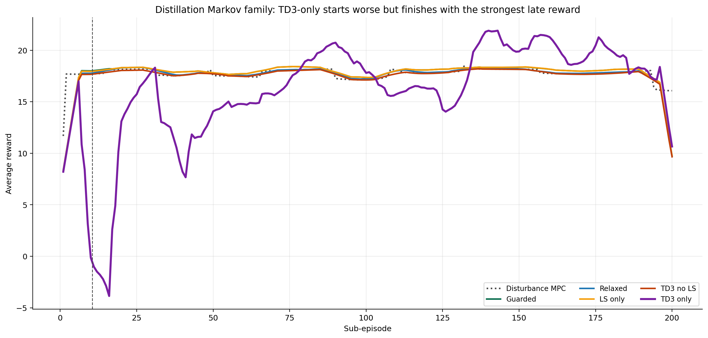

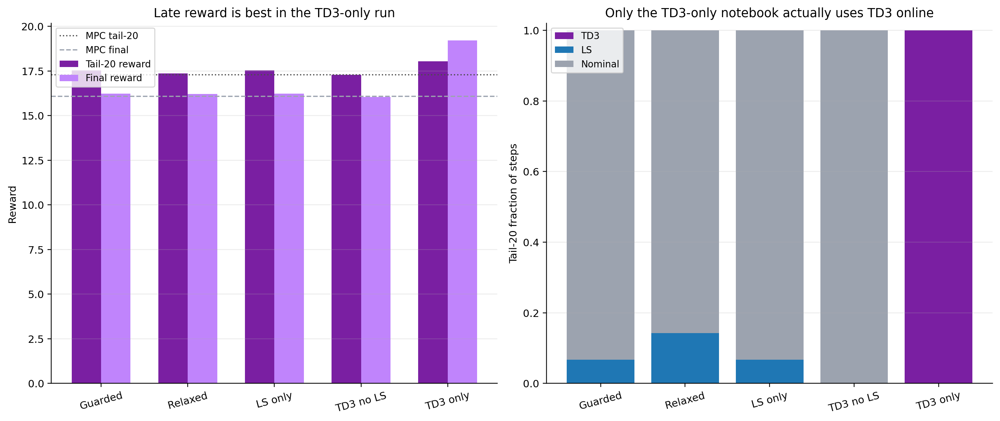

## Why TD3-only has the most room

The family comparison says more than "TD3-only is better late."

It also shows that the current guarded family has almost no TD3 content left:

- guarded TD3 tail-20 share: `0.0000`
- relaxed TD3 tail-20 share: `0.00025`
- LS-only tail-20 TD3 share: `0.0000`
- TD3-without-LS tail-20 TD3 share: `0.0000`

In fact, the guarded and LS-only runs are nearly identical in both reward and tracking:

- guarded final reward: `16.2423`
- LS-only final reward: `16.2423`

So for the current saved runs, the guarded hybrid is behaving much more like an LS/nominal controller than a TD3 controller. That is exactly why TD3-only is interesting: it is the only branch where policy improvement can still show up directly.

## What is wrong with the first temperature setpoint

This is the main weakness of the TD3-only run, and it is real.

### Final episode blockwise tracking

| Metric | TD3 only | MPC |
| --- | ---: | ---: |
| SP1 temperature MAE | `0.5583 K` | `0.1626 K` |
| SP2 temperature MAE | `0.1111 K` | `0.1958 K` |
| SP1 composition MAE | `0.000500` | `0.001509` |
| SP2 composition MAE | `0.000777` | `0.001508` |

So the final episode is not uniformly better. It is strongly asymmetric:

- first block temperature is much worse than MPC
- second block temperature is much better than MPC
- composition is better in both blocks

The tail-20 pattern says the same thing:

- tail-20 SP1 temperature MAE: `0.4582 K` for TD3-only vs `0.1717 K` for MPC
- tail-20 SP2 temperature MAE: `0.1771 K` for TD3-only vs `0.2125 K` for MPC

This is a genuine trade, not noise.

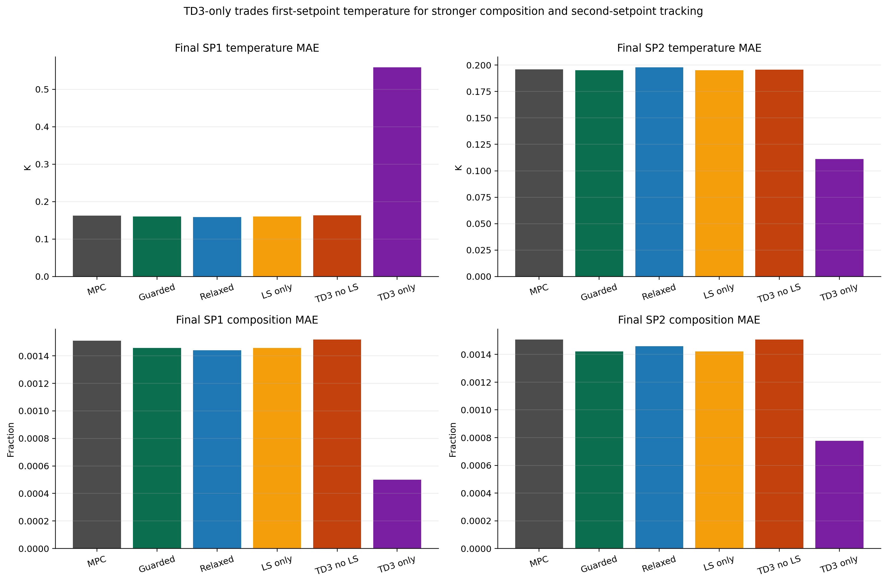

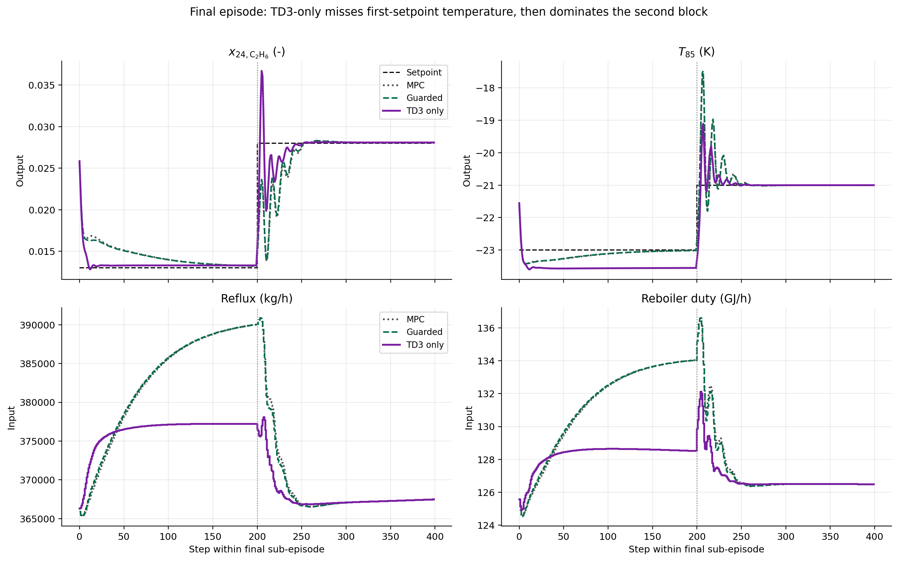

## Is it because of the reward function?

Mostly yes, but not in the simplistic sense of "the reward ignores temperature."

The better interpretation is:

The reward geometry plus the long-horizon episode structure make it rational for TD3 to sacrifice the first temperature block if that buys a bigger second-block payoff.

### Why that happens

The reward parameters strongly favor composition precision and late within-band bonus collection:

- composition weight: `37000`
- temperature weight: `1500`
- composition relative band: `30%` with floor `0.003`
- temperature relative band: `2%` with floor `0.3`
- TD3 discount: `gamma = 0.995`

For the final TD3-only episode:

- SP1 mean temperature reward band is about `0.46 K`
- SP2 mean temperature reward band is about `0.42 K`
- SP1 composition reward band is about `0.0039`
- SP2 composition reward band is about `0.0084`

The actual final-episode inside-band fractions make the trade obvious:

| Final-episode fraction inside reward band | TD3 only | MPC |
| --- | ---: | ---: |
| SP1 composition | `0.98` | `0.975` |
| SP1 temperature | `0.03` | `0.99` |
| SP2 composition | `0.985` | `0.935` |
| SP2 temperature | `0.925` | `0.875` |

So TD3-only is not "good everywhere." It is doing this instead:

1. protect composition almost immediately
2. accept a large SP1 temperature miss
3. arrive in a better condition for SP2
4. collect a much larger late bonus

### The reward breakdown confirms it

Final episode mean step reward by block:

| Block | TD3 only | Guarded | MPC |
| --- | ---: | ---: | ---: |
| SP1 | `0.5491` | `0.8128` | `0.7792` |
| SP2 | `37.9430` | `31.6717` | `31.4506` |

So the TD3-only controller actually loses reward relative to MPC in the first block, then wins it back decisively in the second block.

That means the first temperature problem is not an accidental blind spot. It is a learned trade under the current reward and discount.

### The Markov diagnostics support the same story

Final-episode TD3-only executed diagnostics:

| Block | Executed prediction score | Executed drift | Executed `\|\|z\|\|` |
| --- | ---: | ---: | ---: |
| SP1 | `-0.1508` | `0.0338` | `0.0669` |
| SP2 | `-0.0164` | `0.00359` | `0.00923` |

So the first block is exactly where the TD3-only controller is acting most aggressively and most against the model-score screen that the guarded controller would have used.

This explains why the other variants suppress TD3 almost completely, and why TD3-only shows both the biggest upside and the clearest weakness.

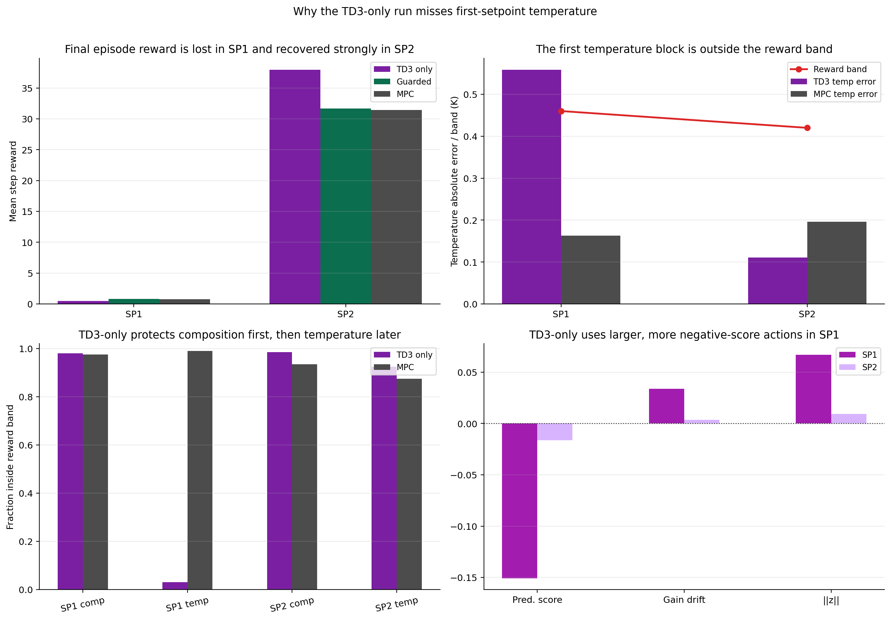

## Interpretation

The cleanest interpretation of all the saved runs is:

1. the current guarded family is so conservative that TD3 is almost absent online
2. the TD3-only family is the only one exposing the learned policy's real behavior
3. that behavior has genuine upside, because late reward and second-block tracking are clearly stronger
4. the cost is a structured first-block temperature sacrifice driven by reward geometry and long-horizon credit assignment

So the right next move is not to abandon TD3-only. It is to improve TD3-only deliberately.

## Risks and inconsistencies

- The TD3-only run has the best late reward, but its tail-20 executed prediction score is still negative: `-0.0944`.
- The first block of the final episode is especially misaligned with the model-score screen.
- The guarded variants and LS-only are nearly identical, so claims about "TD3 helping" in those notebooks would currently be overstated.
- Relaxing the acceptance gates alone did not create meaningful TD3 usage. It mostly increased LS usage.

## Recommended next experiments

### 1. Reward rebalance pilot on TD3-only

Purpose:
reduce the incentive to trade away SP1 temperature for composition and later bonus.

Files:
- `systems/distillation/notebook_params.py`
- `distillation_RL_assisted_MPC_markov_td3_only_no_safeguard_unified.ipynb`

Suggested first pilot:

- change `Q_diag` from `[37000, 1500]` to something closer to `[18000, 5000]`
- keep `R_diag` unchanged for the first pilot

Optional second pilot:

- tighten temperature band by changing `k_rel[1]` from `0.02` to `0.01`
- or reduce temperature `band_floor_phys[1]` from `0.3` to `0.2`

What should improve:

- SP1 temperature MAE should drop materially
- SP2 should stay better than MPC or at least near neutral
- TD3 should remain the executed controller

What would confirm the idea:

- SP1 temperature MAE drops toward the guarded/MPC range without collapsing late reward

### 2. Lower the TD3 discount slightly

Purpose:
reduce the tendency to sacrifice the first block to improve the second block.

Files:
- `systems/distillation/notebook_params.py`

Suggested pilot:

- change TD3 `gamma` from `0.995` to `0.99`

Why:

The current `gamma = 0.995` gives the later block a very strong influence on the current decision.

What should improve:

- SP1 temperature should become less sacrificial
- late reward may fall a bit, but the blockwise trade should become less extreme

### 3. Keep TD3-only, but add soft regularization instead of hard fallback

Purpose:
preserve full TD3 execution while discouraging the most negative-score SP1 actions.

Files:
- `utils/markov_runner.py`
- `utils/rewards.py`
- `distillation_RL_assisted_MPC_markov_td3_only_no_safeguard_unified.ipynb`

Suggested direction:

- do **not** reintroduce LS or nominal fallback
- instead add a small reward penalty for strongly negative prediction score or excessive drift

Why:

The current guarded screens are too strong and kill TD3 usage. A soft penalty is a better fit if the goal is "all TD3, but smarter TD3."

### 4. Only after reward pilots, test a smaller authority

Purpose:
check whether the SP1 miss is partly an authority issue rather than purely a reward issue.

Files:
- `distillation_RL_assisted_MPC_markov_td3_only_no_safeguard_unified.ipynb`

Suggested pilot:

- reduce `z_bound` from `0.05` to `0.03`

Why this is not first:

The current TD3-only run already shows meaningful improvement potential. The more important question is what TD3 is trying to optimize, not only how large its moves are.

## Remaining uncertainty

- This is still a latest-run family comparison, not a multi-seed study.
- The TD3-only late reward win is clear, but we do not yet know how robust it is to seed changes.
- Reward reshaping could fix SP1 temperature, but it might also reduce the strong SP2 gain.
- A softer model-alignment penalty may help, but it still needs to be tested against the current no-safeguard baseline rather than assumed.

## 2026-05-18 update: temperature-retuned TD3-only result

The latest saved TD3-only no-safeguard run is:

`Distillation/Results/distillation_markov_td3_disturb_fluctuation_td3_only_no_safeguard_unified/20260518_091937/`

It uses the temperature-emphasis reward parameters that were requested after the May 16 review:

- `Q_diag = [37000, 5000]`
- `k_rel = [0.3, 0.01]`
- `band_floor_phys = [0.003, 0.2]`
- `force_td3_execute = True`

This result is much stronger than the May 16 TD3-only run. The important caution is that the native reward is not perfectly comparable across the two runs because the reward geometry changed. To handle that, the analysis also rescored the May 16 trajectory under the May 18 reward parameters.

Generated assets:

- `report/figures/distillation_markov_td3_only_latest_20260518/`
- `report/scripts/analyze_distillation_markov_td3_only_latest_20260518.py`

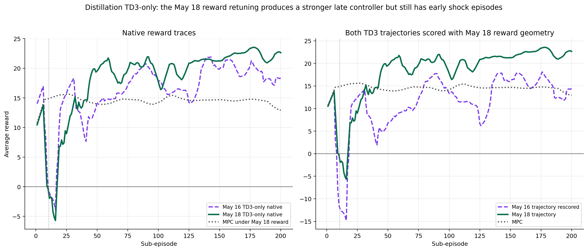

### Reward result

| Metric | May 18 TD3-only | May 16 TD3-only | MPC under May 18 reward |
| --- | ---: | ---: | ---: |
| native mean reward | `18.1931` | `16.2719` | n/a |
| native tail-20 reward | `21.9784` | `18.0502` | `13.8983` |
| native final reward | `22.2229` | `19.2195` | `13.1361` |
| best episode reward | `24.2982` at ep. `178` | n/a | n/a |

Under the May 18 reward geometry, the result is even clearer:

| Rescored metric | May 18 trajectory | May 16 trajectory | Difference |
| --- | ---: | ---: | ---: |
| tail-20 reward | `22.0056` | `13.2339` | `+8.7717` |
| final reward | `22.2505` | `15.2351` | `+7.0155` |
| tail-20 advantage over MPC | `+8.1073` | n/a | n/a |

So the new result is not only a reward-parameter artifact. The retuned policy produces a genuinely better trajectory when both TD3 trajectories are scored with the same May 18 reward.

### Tracking result

The most important change is that the old first-setpoint temperature weakness is largely fixed.

| Tail-20 metric | MPC | May 16 TD3-only | May 18 TD3-only |
| --- | ---: | ---: | ---: |
| SP1 temperature MAE | `0.1717 K` | `0.4582 K` | `0.0862 K` |
| SP2 temperature MAE | `0.2125 K` | `0.1771 K` | `0.1179 K` |
| SP1 composition MAE | `0.001508` | `0.001198` | `0.000561` |
| SP2 composition MAE | `0.001582` | `0.000778` | `0.000873` |

The May 18 final episode gives the same message:

- SP1 temperature MAE improved from `0.5583 K` to `0.0870 K`.
- SP1 composition MAE improved from `0.000500` to `0.000359`.
- SP2 temperature stayed strong at `0.1125 K`, close to the May 16 value of `0.1111 K`.
- SP2 composition remains much better than MPC, although it is slightly worse than the May 16 TD3-only final episode.

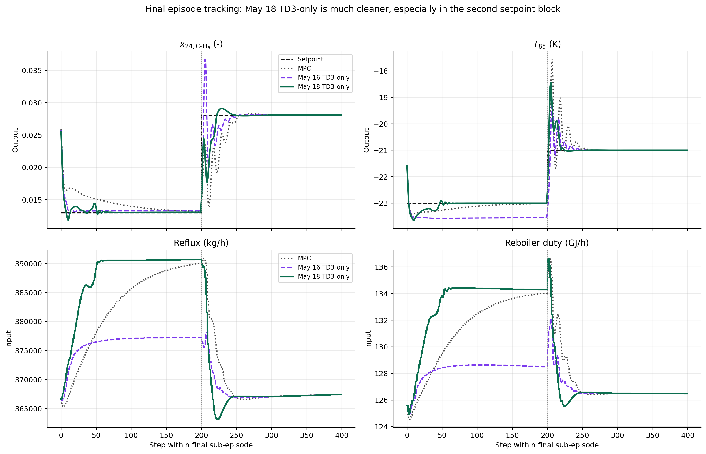

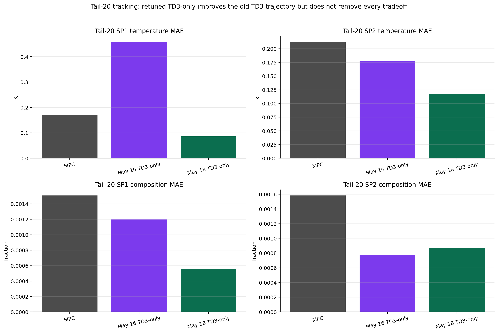

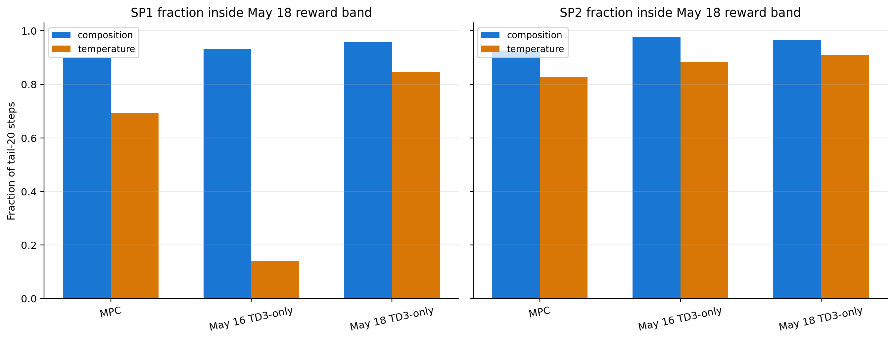

### Diagnostics

The May 18 policy is also less aggressive relative to the Markov model.

| Tail-20 diagnostic | May 16 TD3-only | May 18 TD3-only |
| --- | ---: | ---: |
| TD3 executed fraction | `1.0000` | `1.0000` |
| executed prediction score | `-0.0944` | `-0.00937` |
| executed gain drift | `0.0167` | `0.00827` |
| executed cost margin | `0.00240` | `0.000977` |
| executed `z` norm | `0.0327` | `0.0170` |

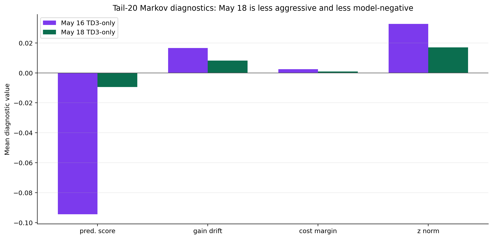

This supports the interpretation that the reward change did not simply force larger temperature moves. It led to a smaller and more model-consistent Markov correction that still produced better tracking and reward.

### Main interpretation

This is a very useful result.

The May 16 report said that the first temperature setpoint was probably a reward-geometry problem. The May 18 run strongly supports that diagnosis. Increasing the temperature weight, tightening the temperature relative band, and lowering the temperature floor removed most of the SP1 temperature sacrifice while preserving full TD3 authority.

The remaining problem is not late performance. The remaining problem is safe release. The May 18 run still has severe early negative episodes:

- first-20 minimum reward: `-37.1003` at subepisode `11`
- negative first-20 episodes: `11`, `12`, `13`, `15`, `18`

That means the no-safeguard TD3-only result is now scientifically more interesting, not less. It shows that the learned Markov policy can become better than nominal MPC after enough online learning, but it still needs a generic safety layer to prevent the bad-release episodes from reaching the plant.

## 2026-05-18 update: soft-handoff Markov run

After the TD3-priority soft release was added, the current unified Markov run is:

`Distillation/Results/distillation_markov_td3_disturb_fluctuation_unified/20260518_184548/`

This run is not a return to the old conservative Markov behavior. TD3 remains the dominant executed source:

- TD3 fraction overall: `0.9500`
- TD3 fraction in tail-20: `1.0000`
- nominal fallback overall: `0.0466`
- LS fallback overall: `0.0000`
- probation trigger count: `8`
- probation active episodes: `12-18`, `28-29`, `54-55`

The main comparison against TD3-only no-safeguard is:

| Metric | Soft handoff | TD3-only no safeguard |
| --- | ---: | ---: |
| mean reward | `19.3342` | `18.1931` |
| tail-20 reward | `21.2472` | `21.9784` |
| final reward | `20.3863` | `22.2229` |
| best reward | `24.0631` | `24.2982` |
| worst first-20 reward | `-7.8572` | `-37.1003` |

So soft handoff gives up about `0.7312` tail-20 reward relative to TD3-only, but it reduces the worst early crash by about `29.24` reward units. That is a very good trade if the goal is a long one-day run that should not be corrupted by release shock.

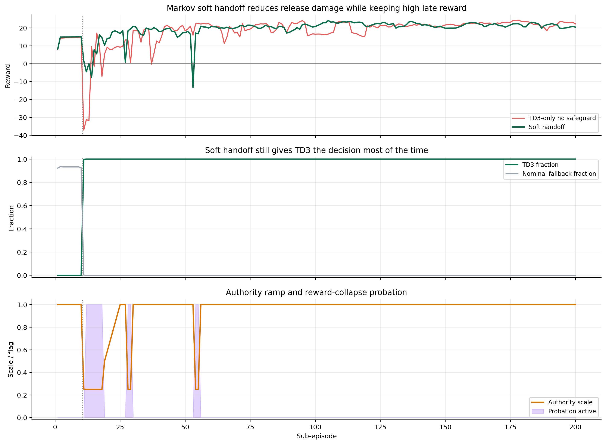

The remaining issue is that soft handoff still does not guarantee good SP1 temperature. In tail-20:

- soft handoff SP1 temperature MAE: `0.2634 K`
- TD3-only SP1 temperature MAE: `0.0862 K`
- MPC SP1 temperature MAE: `0.1717 K`

But soft handoff is strong on composition and SP2 temperature:

- soft handoff SP1 composition MAE: `0.000337`
- soft handoff SP2 composition MAE: `0.000831`
- soft handoff SP2 temperature MAE: `0.1101 K`

The interpretation is that soft handoff solved much of the release-safety problem while preserving TD3 authority, but the final safety layer still needs a predicted tracking-risk check. Cost margin, gain drift, and probation alone are not enough to guarantee that every accepted Markov correction helps the first setpoint temperature.
