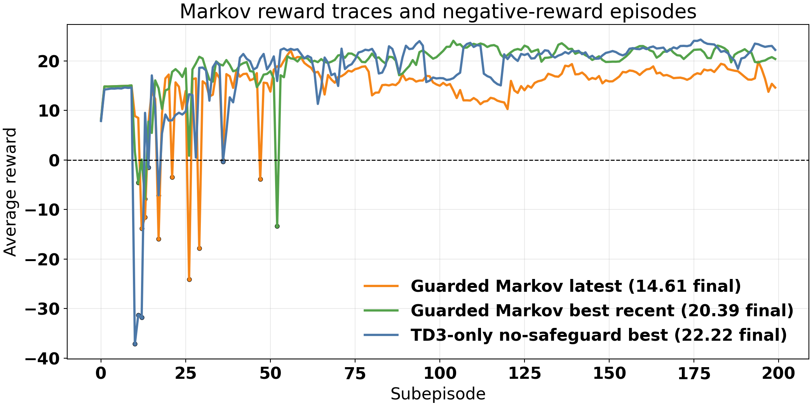
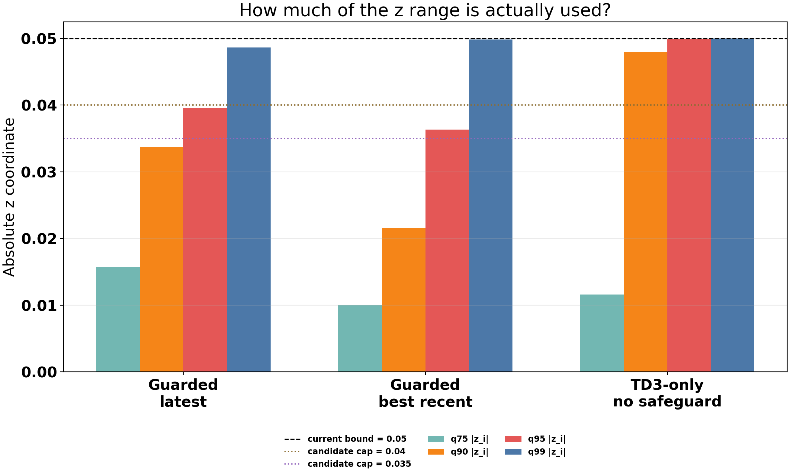
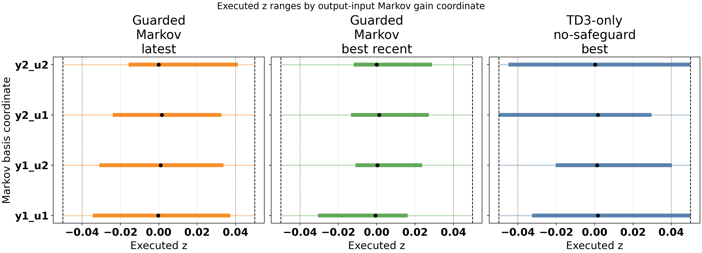
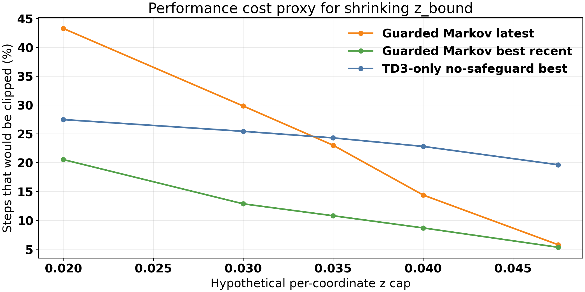
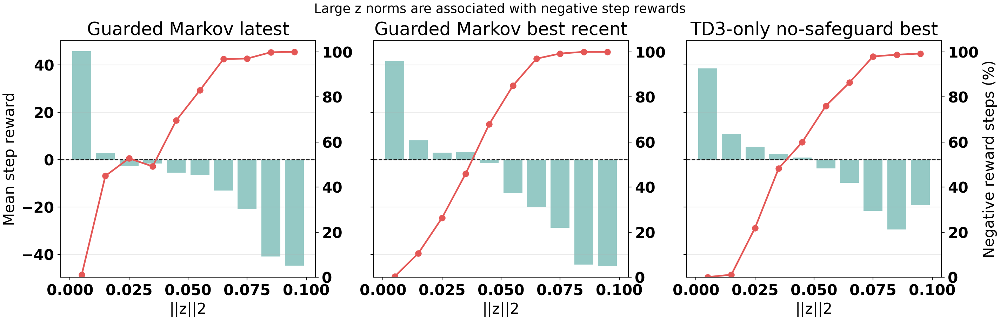
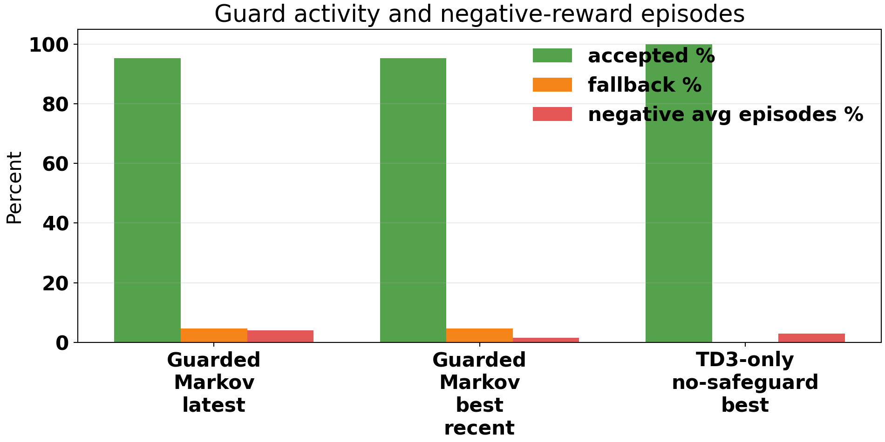

# Distillation Markov z-Bound and Safety-Layer Audit

Date: 2026-05-20

## Scope

This report audits the executed Markov correction variable `z` for the distillation Markov TD3 runs. The goal is to answer:

- What is the current `z` bound?
- What range of `z` is actually being used?
- Can the bound be shrunk for additional safety?
- What safety layer would help prevent, or at least reduce, negative reward events?

I interpreted the "TD3-only safeguard" request as the saved TD3-only/no-safeguard result family because the available run folder is named `distillation_markov_td3_disturb_fluctuation_td3_only_no_safeguard_unified`. If the intended comparison was `td3_without_ls_unified`, the same script can be pointed at that run as a follow-up.

## Files Inspected

- `distillation_RL_assisted_MPC_markov_unified.py`
- `systems/distillation/notebook_params.py`
- `utils/markov_runner.py`
- `Distillation/Results/distillation_markov_td3_disturb_fluctuation_unified/20260519_210736/input_data.pkl`
- `Distillation/Results/distillation_markov_td3_disturb_fluctuation_unified/20260518_184548/input_data.pkl`
- `Distillation/Results/distillation_markov_td3_disturb_fluctuation_td3_only_no_safeguard_unified/20260518_091937/input_data.pkl`

## Analysis Artifacts

Generated by `report/scripts/analyze_distillation_markov_z_safety_20260520.py`.

- `report/figures/distillation_markov_z_safety_20260520/markov_z_safety_summary.csv`
- `report/figures/distillation_markov_z_safety_20260520/markov_z_coordinate_summary.csv`
- `report/figures/distillation_markov_z_safety_20260520/summary.json`
- `report/figures/distillation_markov_z_safety_20260520/fig_markov_reward_traces.png`
- `report/figures/distillation_markov_z_safety_20260520/fig_z_abs_quantiles.png`
- `report/figures/distillation_markov_z_safety_20260520/fig_z_coordinate_ranges.png`
- `report/figures/distillation_markov_z_safety_20260520/fig_z_cap_clipping_pressure.png`
- `report/figures/distillation_markov_z_safety_20260520/fig_z_norm_reward_risk.png`
- `report/figures/distillation_markov_z_safety_20260520/fig_guard_activity_summary.png`

## Current Markov z Definition

The active distillation Markov defaults use:

- `basis_family = "io_pair_gain"`
- `z_bound = 0.05`
- `force_td3_execute = False`
- `run_adaptive_ls = True`
- `rl_fallback_to_ls = True`
- `td3_priority_fallback.enabled = True`

The Markov correction is an output-input gain perturbation on the nominal Markov blocks:

$$ M_z = M_0 + \sum_{i=1}^{4} z_i B_i. $$

For the current distillation plant, the four basis directions are:

- `y1_u1`
- `y1_u2`
- `y2_u1`
- `y2_u2`

The TD3 actor output is converted to `z` by clipping each raw action coordinate to `[-1, 1]` and multiplying by `z_bound`:

$$ z_i = 0.05\,\mathrm{clip}(a_i,-1,1). $$

So the current hard per-coordinate range is:

$$ z_i \in [-0.05, 0.05]. $$

Because there are four coordinates, the vector 2-norm can still reach about `0.10` even though each coordinate is individually capped at `0.05`.

## Runs Compared

| Run | Folder | z bound | Notes |
|---|---:|---:|---|
| Guarded Markov latest | `20260519_210736` | 0.05 | Latest guarded Markov run. |
| Guarded Markov best recent | `20260518_184548` | 0.05 | Stronger recent guarded run. |
| TD3-only no-safeguard best | `20260518_091937` | 0.05 | TD3 action is accepted directly; no LS/nominal safety fallback. |

## Reward-Level Summary

| Metric | Guarded latest | Guarded best recent | TD3-only no-safeguard |
|---|---:|---:|---:|
| Tail-20 average reward | 17.35 | 21.25 | 21.98 |
| Final average reward | 14.61 | 20.39 | 22.22 |
| Mean step reward | 14.94 | 19.33 | 18.19 |
| Negative average-reward episodes | 4.0% | 1.5% | 3.0% |
| Post-warm negative step fraction | 39.5% | 19.0% | 24.5% |
| Accepted action fraction | 95.34% | 95.34% | 100.0% |
| Fallback fraction | 4.66% | 4.66% | 0.0% |

The TD3-only/no-safeguard run has the best final and tail rewards among these three saved runs, but it also uses the z-bound much more aggressively. The best guarded run is close in tail reward while using smaller typical `z` values and fewer post-warm negative reward steps.

The latest guarded run is weaker than the best recent guarded run. That means the guard does not guarantee strong learning every time; it reduces some unsafe proposals, but training variance and learned action distribution still matter.

## How Much z Range Is Used?

| Metric | Guarded latest | Guarded best recent | TD3-only no-safeguard |
|---|---:|---:|---:|
| `q75 abs z_i` | 0.0158 | 0.0100 | 0.0116 |
| `q90 abs z_i` | 0.0337 | 0.0216 | 0.0480 |
| `q95 abs z_i` | 0.0396 | 0.0363 | 0.0499 |
| `q99 abs z_i` | 0.0486 | 0.0498 | 0.0500 |
| `q95 z 2-norm` | 0.0685 | 0.0665 | 0.0923 |
| `q95 abs Delta z_i` | 0.0190 | 0.0145 | 0.0152 |
| `q99 abs Delta z_i` | 0.0468 | 0.0487 | 0.0542 |

The most important pattern is the `q90` row. The guarded best run keeps 90% of absolute coordinate moves below `0.0216`, while the TD3-only/no-safeguard run pushes the 90th percentile almost to the hard cap at `0.0480`.

This says the current `0.05` bound is not just a loose theoretical bound. The controller actually reaches it, especially when TD3 is allowed to execute without the guard.

## Coordinate-Level z Ranges

| Run | Coordinate | `q95 abs z_i` | Steps with `abs z_i > 0.04` |
|---|---|---:|---:|
| Guarded latest | `y1_u1` | 0.0394 | 4.6% |
| Guarded latest | `y1_u2` | 0.0379 | 3.4% |
| Guarded latest | `y2_u1` | 0.0404 | 5.2% |
| Guarded latest | `y2_u2` | 0.0428 | 6.0% |
| Guarded best recent | `y1_u1` | 0.0391 | 4.7% |
| Guarded best recent | `y1_u2` | 0.0334 | 3.8% |
| Guarded best recent | `y2_u1` | 0.0350 | 3.5% |
| Guarded best recent | `y2_u2` | 0.0376 | 4.5% |
| TD3-only no-safeguard | `y1_u1` | 0.0499 | 13.3% |
| TD3-only no-safeguard | `y1_u2` | 0.0479 | 7.9% |
| TD3-only no-safeguard | `y2_u1` | 0.0498 | 15.7% |
| TD3-only no-safeguard | `y2_u2` | 0.0500 | 16.4% |

The guarded runs occasionally touch the hard bounds, but most of their mass stays closer to zero. The TD3-only/no-safeguard run saturates all four coordinates, with the temperature-related directions `y2_u1` and `y2_u2` being especially active.

## What Happens If We Shrink z_bound?

The figure estimates how many post-warm steps would have been clipped by smaller per-coordinate caps. This is not a counterfactual rerun, but it is a useful "how invasive would the new cap be?" diagnostic.

| Candidate cap | Guarded latest clipped steps | Guarded best recent clipped steps | TD3-only no-safeguard clipped steps |
|---:|---:|---:|---:|
| 0.040 | 14.4% | 8.7% | 22.8% |
| 0.035 | 23.0% | 10.8% | 24.3% |
| 0.030 | 29.8% | 12.9% | 25.4% |

My recommendation is not to jump straight from `0.05` to `0.03` as the new default. A `0.03` cap would substantially alter the latest guarded run and the TD3-only/no-safeguard run. It might be safer, but it could also remove useful Markov correction authority.

A better first controlled experiment is:

- Test `z_bound = 0.04` as the conservative default candidate.
- Test `z_bound = 0.035` as the stronger safety candidate.
- Keep `z_bound = 0.03` as a stress-test/safety-first variant, not the first replacement default.

The `0.04` cap is attractive because it clips less than 10% of the best guarded run while still trimming the no-safeguard run's boundary-seeking behavior.

## z Norm and Negative Reward Risk

| Condition | Guarded latest mean reward / negative steps | Guarded best mean reward / negative steps | TD3-only mean reward / negative steps |
|---|---:|---:|---:|
| `z 2-norm >= 0.03` | -7.56 / 73.2% | -14.29 / 77.6% | -15.17 / 88.4% |
| `z 2-norm >= 0.05` | -12.39 / 90.4% | -25.91 / 94.4% | -17.53 / 93.1% |
| `z 2-norm >= 0.07` | -25.56 / 97.7% | -38.53 / 99.7% | -22.65 / 98.8% |
| `z 2-norm >= 0.09` | -44.73 / 100.0% | -45.02 / 100.0% | -19.25 / 99.2% |

Large `z` norm is strongly associated with negative step rewards. This is still correlation, not proof of causality. Large `z` may be selected during difficult transients, setpoint moves, or disturbances where the reward would already be poor.

Even with that caveat, `||z||2` is a useful safety signal. Once `||z||2` gets above roughly `0.05`, almost all observed steps in these runs are negative-reward steps.

## Current Guard Behavior

The current guarded Markov setup already has a safety layer:

- TD3 priority fallback is enabled.
- Early post-warm training uses reduced TD3 authority.
- Candidate acceptance checks solver success, gain drift, and nominal-cost margin.
- Reward probation can reduce authority after reward collapse.
- LS and nominal fallback remain available because `force_td3_execute = False` and `rl_fallback_to_ls = True`.

The observed fallback rate is about `4.66%` in the guarded runs. This helps, but it is a binary accept/fallback design. If a TD3 proposal is too aggressive, the controller either accepts it or falls back; it does not yet try a smaller, safer version of the TD3 action.

## Safety-Layer Recommendation

The cleanest next safety layer is a trust-region shield around the TD3 Markov proposal. I would not rely only on changing `z_bound`, because a static cap does not distinguish between safe steady-state corrections and risky transient corrections.

### 1. Dynamic Effective z Cap

Keep the configured `z_bound` as the outer limit, but introduce an effective cap:

$$ |z_i| \leq z_{\mathrm{cap,eff}}(t). $$

Suggested first schedule:

- Warm/protected phase: `z_cap_eff = 0.02`
- Early release/ramp phase: `z_cap_eff = 0.03` to `0.04`
- Full phase: `z_cap_eff = 0.04`
- Cooldown after reward collapse: `z_cap_eff = 0.02` or `0.025`

This keeps TD3 away from the full `0.05` boundary unless a future experiment proves that boundary use is necessary.

### 2. z Rate Limiter

Add a coordinate-wise rate limit:

$$ |z_i(t)-z_i(t-1)| \leq \Delta z_{\max}. $$

A good first value is `Delta z_max = 0.015` per coordinate. That is close to the guarded-run `q95 abs Delta z_i`, so it should mostly block abrupt jumps rather than normal action changes.

### 3. Vector Norm Cap

Add a projection step after coordinate clipping:

$$ ||z||_2 \leq z_{\mathrm{norm,max}}. $$

Suggested first tests:

- `z_norm_max = 0.06` as a moderate safety layer.
- `z_norm_max = 0.05` as a stricter safety layer.

This is useful because the per-coordinate cap still allows all four coordinates to be large at once. The TD3-only/no-safeguard run has `q95 z 2-norm = 0.0923`, which is very close to the theoretical maximum of `0.10`.

### 4. Backtracking Candidate Shield

Instead of accepting or rejecting the raw TD3 proposal, evaluate a sequence of scaled proposals:

$$ z_{\alpha} = z_{\mathrm{safe}} + \alpha(z_{\mathrm{TD3}} - z_{\mathrm{safe}}), \quad \alpha \in \{1.0, 0.75, 0.5, 0.25, 0.0\}. $$

Use `z_safe` as the LS candidate if accepted, otherwise nominal `z = 0`. Accept the largest `alpha` that passes:

- MPC solve success.
- Gain drift limit.
- Nominal-cost margin limit.
- Prediction-score floor.
- Optional one-step predicted reward floor against nominal.

This is the main improvement I would make. It preserves useful TD3 directionality while preventing huge Markov corrections from entering the plant just because the full TD3 action failed the guard.

### 5. Reward-Aware Probation

The code already has subepisode-level reward probation. For stronger safety, add a shorter rolling trigger:

- If rolling mean step reward over the last `N = 10` to `20` steps falls below zero, switch to `z_cap_eff = 0.02`.
- If the candidate predicted reward is worse than nominal by more than a tolerance, backtrack or fallback.
- Release only after the rolling reward returns positive for a small window.

This should be compared against nominal rather than using an absolute reward threshold only, because some negative rewards may be unavoidable during setpoint changes or disturbances.

### 6. Setpoint/Disturbance Transition Guard

Several negative reward events can be transient-related rather than purely action-related. A practical layer is:

- Detect large setpoint changes or known disturbance release points.
- Temporarily use lower `z_cap_eff`.
- Require the candidate to improve or match nominal predicted cost during that window.

This is less blunt than making every timestep conservative.

## Recommendation

The current `z_bound = 0.05` is probably too permissive for unshielded TD3 execution. The TD3-only/no-safeguard run repeatedly drives coordinates to the bound, and large `||z||2` is strongly associated with negative step rewards.

For the guarded Markov default, I would not immediately reduce all the way to `0.03`. The data supports trying `0.04` first, then `0.035` if the goal is explicitly safety over peak reward. The best guarded run would only have about `8.7%` of post-warm steps affected by a `0.04` cap, while the TD3-only/no-safeguard run would have about `22.8%` affected.

The strongest next step is a safety shield that combines:

- Dynamic per-coordinate cap, initially full-phase `0.04`.
- Rate limiting with `Delta z_max = 0.015`.
- Vector norm cap, initially `||z||2 <= 0.06`.
- Backtracking of TD3 proposals before falling back to LS or nominal.
- Rolling reward probation and transition-aware authority reduction.

This should reduce negative-reward risk more intelligently than only shrinking `z_bound`, because it keeps useful small corrections available while suppressing large, abrupt, or high-norm Markov perturbations.

## Important Caveat

This analysis does not prove that smaller `z_bound` will improve reward. It measures how the saved trajectories used `z` and how that usage correlates with negative rewards. The only definitive test is to rerun the Markov experiments with `z_bound = 0.04`, `0.035`, and optionally `0.03`, ideally with identical seeds and the same disturbance profile.

## Files Changed

- Added `report/scripts/analyze_distillation_markov_z_safety_20260520.py`
- Added this report.
- Added generated summary tables and figures under `report/figures/distillation_markov_z_safety_20260520/`
