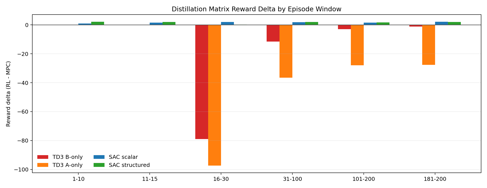
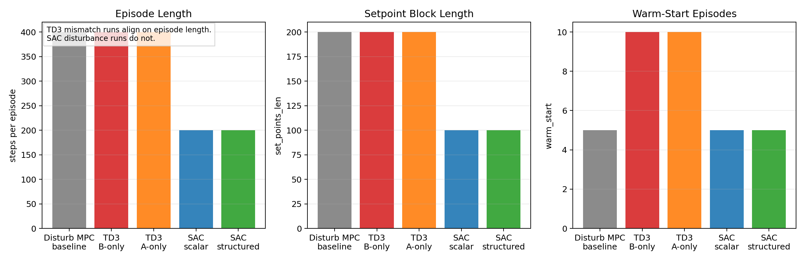
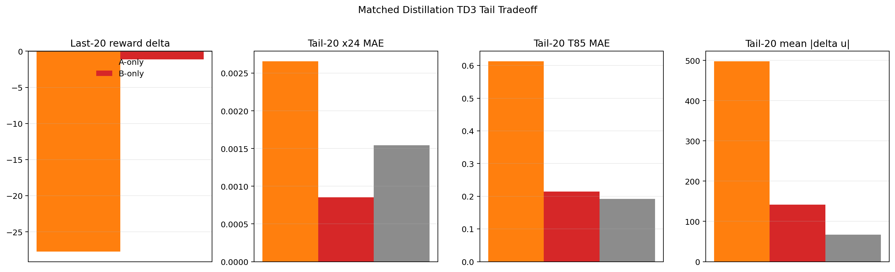

# Distillation Matrix Deep Review

Date: 2026-05-01

## Objective

This report reviews the saved distillation matrix-family runs only. The goal is to answer four questions:

1. Which saved run is the "one that improves at the end"?
2. Does that improvement survive a matched comparison against the disturbance MPC baseline?
3. Are the positive SAC matrix results scientifically trustworthy as saved?
4. What is the next defensible distillation experiment, given that repeated matrix-side tweaks have not produced a clear win?

## Files Inspected

- `Distillation/Results/distillation_matrix_td3_disturb_fluctuation_mismatch_unified/20260425_082831/input_data.pkl`
- `Distillation/Results/distillation_compare_matrix_td3_disturb_fluctuation_mismatch/20260425_082842/input_data.pkl`
- `Distillation/Results/distillation_matrix_td3_disturb_fluctuation_mismatch_unified/20260429_033606/input_data.pkl`
- `Distillation/Results/distillation_compare_matrix_td3_disturb_fluctuation_mismatch/20260429_033621/input_data.pkl`
- `Distillation/Results/distillation_matrix_sac_disturb_fluctuation_standard_unified/20260415_104840/input_data.pkl`
- `Distillation/Results/distillation_compare_matrix_sac_disturb_fluctuation_standard/20260415_104846/input_data.pkl`
- `Distillation/Results/distillation_structured_matrix_sac_disturb_fluctuation_standard_unified/20260415_120923/input_data.pkl`
- `Distillation/Results/distillation_compare_structured_matrix_sac_disturb_fluctuation_standard/20260415_120930/input_data.pkl`
- `Distillation/Data/mpc_results_disturb_fluctuation.pickle`
- `report/matrix_multiplier_cap_calculation_and_distillation_recovery.md`
- `report/distillation_reward_audit.md`
- `report/distillation_warm_start_training_analysis.md`
- `report/scripts/generate_distillation_matrix_family_failure_analysis.py`
- `report/figures/distillation_matrix_family_failure_analysis_20260501/distillation_matrix_run_summary.csv`
- `systems/distillation/config.py`
- `systems/distillation/notebook_params.py`
- `utils/matrix_runner.py`
- `utils/rewards.py`

## What The Current Method Is Doing

### Plant and supervisory surface

The distillation case controls:

- `y_1`: tray-24 ethane composition
- `y_2`: tray-85 temperature

with manipulated inputs:

- `u_1`: reflux flow
- `u_2`: reboiler duty

The scalar matrix supervisor perturbs the linear prediction model inside the MPC rollout as:

$$ A_t = \alpha_t A_0, \qquad B_t = B_0 \operatorname{diag}(\delta_{1,t}, \delta_{2,t}). $$

So the RL policy is not choosing plant moves directly. It is choosing how the MPC prediction model is distorted before the optimization step.

### Baseline MPC and reward

The underlying controller is the offset-free augmented MPC stack used throughout the repo. In generic form it solves:

$$ \min_{U_t} \sum_{k=0}^{H_p-1} \|y_{t+k|t} - y^{\mathrm{sp}}_{t+k}\|_Q^2 + \|\Delta u_{t+k|t}\|_R^2 $$

subject to the augmented prediction model and input constraints.

The distillation RL reward comes from `utils/rewards.py` and `systems/distillation/config.py`. It is a relative-band reward with inside-band bonus:

$$ r_t = -(\mathrm{err}_{\mathrm{eff}} + \mathrm{move} + \mathrm{lin}_{\mathrm{out}} + \mathrm{lin}_{\mathrm{in}}) + \mathrm{bonus}. $$

The physical tracking band is:

$$ b(y^{\mathrm{sp}}) = \max(k_{\mathrm{rel}} \odot |y^{\mathrm{sp}}|, b_{\mathrm{floor}}). $$

With the current distillation defaults:

- `k_rel = [0.3, 0.02]`
- `band_floor_phys = [0.003, 0.3]`
- `Q_diag = [3.7e4, 1.5e3]`
- `R_diag = [2.5e3, 2.5e3]`
- `beta = 7.0`
- `reward_scale = 1.0`

At the two default supervisory setpoints in `systems/distillation/config.py`,

- `y_sp = [0.013, -23.0]`
- `y_sp = [0.028, -21.0]`

the corresponding physical reward bands are:

$$ b_1 \in \{0.0039, 0.0084\}, \qquad b_2 \in \{0.46, 0.42\}. $$

This is not proof by itself, but it strongly suggests a reward geometry that is much tighter on composition than on temperature.

### Warm-start and current distillation defaults

The warm-start analysis in `report/distillation_warm_start_training_analysis.md` remains relevant here:

- the replay buffer is prefilled with nominal MPC behavior
- the first actor updates are trained on that narrow behavior support
- the first learned policy release happens immediately after that warm-start boundary

The current notebook defaults in `systems/distillation/notebook_params.py` now describe a wider and more conservative scalar matrix stack:

- offline multiplier diagnostics: enabled
- release-protected advisory caps: enabled
- behavioral cloning anchor: enabled
- dual-cost shadow diagnostics: enabled
- hard acceptance/fallback gate: disabled

However, there is no saved distillation result bundle in the repo showing this full current stack. The saved bundles reviewed here are older than the current default comment block.

## Mathematical Interpretation Of The Failure Mode

The matrix policy acts on an unusually high-leverage surface. A small policy error does not just add a modest correction to the input. It changes the model used by the optimizer:

$$ \hat{x}_{t+1|t} = A_t \hat{x}_{t|t} + B_t \Delta u_t + \cdots $$

and therefore changes the whole planned move sequence.

This creates a two-level risk:

1. The actor can request out-of-support multiplier values right after warm start.
2. The MPC optimizer then amplifies those requests into a full input trajectory.

The saved B-only run shows why this matters. The actor is almost nominal on `A`, but it uses wide `B` authority early. That produces:

- a massive first live reward collapse
- partial late recovery
- better composition tail error
- worse temperature tail error
- much larger input movement

The saved A-only run shows the opposite direction. Freezing `B` does reduce one source of authority, but the result is still poor:

- no post-live episode beats MPC
- tail reward remains strongly negative
- both output channels are worse than MPC
- input movement is far worse than MPC

So the reliable interpretation is not "A is bad, B is good" or "B is bad, A is safe." It is:

$$ \text{useful authority exists mostly on the B side, but uncontrolled release is not acceptable.} $$

## Main Result Interpretation

### Which run is the late improver?

The run you were referring to is:

- `Distillation/Results/distillation_matrix_td3_disturb_fluctuation_mismatch_unified/20260425_082831/input_data.pkl`
- comparison bundle: `Distillation/Results/distillation_compare_matrix_td3_disturb_fluctuation_mismatch/20260425_082842/input_data.pkl`

This is the TD3 scalar disturbance mismatch run with tight `A` and wide `B`. In the older report this was the "B-only" directionality run.

It does improve at the very end, but only weakly and only after a long bad region:

- best reward delta episode: `200`
- last episode reward delta: `+5.6609`
- positive post-live episodes: `5 / 185`
- first positive post-live episode: `172`
- last-20 mean reward delta: `-1.1113`

That is not a robust controller win. It is a partial late recovery.

### Reliable matched comparison: the two TD3 disturbance mismatch runs

The reliable physical comparison is between the two TD3 mismatch runs and `Distillation/Data/mpc_results_disturb_fluctuation.pickle`, because those runs all have `400` steps per episode.

| Run | Saved protection stack | Full-run reward delta mean | Last-20 reward delta mean | Tail-20 x24 MAE | Tail-20 T85 MAE | Tail-20 mean `|delta u|` |
| --- | --- | ---: | ---: | ---: | ---: | ---: |
| TD3 B-only, `20260425_082831` | no saved release-guard or BC logs | `-11.4801` | `-1.1113` | `0.000854` | `0.214390` | `141.4355` |
| TD3 A-only, `20260429_033606` | release guard only, BC disabled | `-34.0566` | `-27.7259` | `0.002658` | `0.613068` | `498.1519` |
| Disturb MPC baseline | nominal model | n/a | `0.0000` reference | `0.001545` | `0.192085` | `67.4474` |

Interpretation:

- The B-only run is the only distillation matrix run in this saved set that shows any late positive reward behavior.
- Even that run is still worse than MPC in the last-20 mean reward.
- Its late composition MAE is better than MPC.
- Its late temperature MAE is worse than MPC.
- Its late input movement is about `2.10x` the MPC baseline.
- Therefore the late improvement is real but incomplete, and it is not enough to claim a usable distillation matrix success.

The A-only mirror run is much clearer:

- no post-live episode beats MPC
- last-20 reward delta is strongly negative
- x24, T85, and movement are all worse than baseline

So freezing `B` is not the fix.

### Reward-window view

The windowed reward view makes the difference sharper:

| Run | Episodes `16-30` | Episodes `31-100` | Episodes `101-200` | Episodes `181-200` |
| --- | ---: | ---: | ---: | ---: |
| TD3 B-only | `-79.0156` | `-11.5530` | `-3.0208` | `-1.1113` |
| TD3 A-only | `-97.3724` | `-36.4801` | `-27.9714` | `-27.7259` |
| SAC scalar | `+1.9273` | `+1.8484` | `+1.6063` | `+2.0847` |
| SAC structured | `+0.1947` | `+1.9748` | `+1.7521` | `+1.9717` |

The new window figure makes this visible directly:

### Why the saved SAC "wins" are not yet trustworthy

The SAC runs are the most dangerous place to overclaim.

Their saved reward deltas are positive. But the compare bundles point to:

- `Distillation/Data/mpc_results_disturb_fluctuation.pickle`

while the saved SAC bundles use:

- `set_points_len = 100`
- `warm_start = 5`
- `steps_per_episode = 200`

and the referenced disturbance MPC bundle uses:

- `set_points_len = 200`
- `warm_start = 5`
- `steps_per_episode = 400`

That means the positive SAC compare curves are not clean apples-to-apples baseline comparisons.

This is visible in the provenance/alignment figure:

So the correct scientific status of the SAC disturbance results is:

- they may indicate something interesting
- they do not yet justify a distillation success claim
- they need matched-baseline reruns before they should drive the next project decision

## Bugs, Inconsistencies, Or Risks Found

### 1. SAC compare-bundle alignment problem

The saved SAC compare bundles reference the `400`-step disturbance MPC baseline while the RL bundles themselves are `200`-step schedules. That makes their reward-delta interpretation scientifically weak.

This is the highest-priority reporting problem found in this review.

### 2. The A-only versus B-only mirror test is still confounded

The B-only run is a pre-protection run. The A-only run has release protection enabled. So the comparison is not a pure A-versus-B isolation test.

Even with that caveat, the result is still informative because:

- the same disturbance baseline is matched on episode length
- the B-only run shows partial late recovery
- the A-only run does not

### 3. The current distillation default stack is not yet represented in saved results

`systems/distillation/notebook_params.py` now sets:

- BC enabled
- release guard enabled
- dual-cost shadow enabled

but the saved scalar TD3 distillation runs reviewed here do not show that complete stack. So the current default design is still unvalidated on distillation.

### 4. Reward alignment remains a real risk

The reward audit already showed that matrix-family conclusions can change under alternative scoring, and the reward structure itself is asymmetric across outputs. Inference from the current reward parameters and bands suggests:

- composition receives a much tighter physical band
- temperature can remain inside a wider band longer
- aggressive move penalties can still be outweighed by bonus structure in ways that do not cleanly reflect the practical temperature-versus-movement tradeoff

This review does not prove the reward is wrong. It does show that reward-positive alone is not enough for the distillation matrix family.

### 5. Warm-start support mismatch is still the core RL risk

The warm-start report remains consistent with the saved distillation matrix failures:

- early replay is narrow nominal-MPC data
- the actor is then released online
- out-of-support actor proposals are especially costly here because they alter the internal MPC model

## Figures And Report Assets Added

This review added:

- `report/scripts/generate_distillation_matrix_deep_review_assets.py`
- `report/figures/distillation_matrix_deep_review_20260501/distillation_matrix_deep_review_summary.csv`
- `report/figures/distillation_matrix_deep_review_20260501/distillation_matrix_window_summary.csv`
- `report/figures/distillation_matrix_deep_review_20260501/distillation_matrix_schedule_alignment.png`
- `report/figures/distillation_matrix_deep_review_20260501/distillation_matrix_family_reward_windows.png`
- `report/figures/distillation_matrix_deep_review_20260501/distillation_td3_tail_physical_tradeoff.png`

The matched TD3 tail tradeoff is summarized here:

## Literature Connections

The repo evidence matches a specific part of the RL literature much better than it matches a "just tune the policy more" story.

- [Fujimoto and Gu, "A Minimalist Approach to Offline Reinforcement Learning" (TD3+BC), arXiv:2106.06860](https://arxiv.org/abs/2106.06860): adding a behavior-cloning term to the actor update is specifically motivated by out-of-distribution action errors during offline-style learning. This supports the repo's move toward BC anchors during the warm-start handoff.
- [Kumar et al., "Conservative Q-Learning for Offline Reinforcement Learning", arXiv:2006.04779](https://arxiv.org/abs/2006.04779): conservative value estimation is designed to prevent optimistic evaluation of unsupported actions. That is closely related to the distillation release problem, where unsupported multiplier actions can look useful before plant rollout disproves them.
- [Nair et al., "AWAC: Accelerating Online Reinforcement Learning with Offline Datasets", arXiv:2006.09359](https://arxiv.org/abs/2006.09359): offline-to-online fine-tuning benefits from actor updates that remain tied to the prior data rather than immediately maximizing a noisy critic. This directly supports a more conservative warm-start-to-online handoff.
- [Laroche et al., "Safe Policy Improvement with Baseline Bootstrapping", arXiv:1712.06924](https://arxiv.org/abs/1712.06924): the policy should fall back to the baseline behavior when uncertainty is high. Conceptually this is the closest literature analogue to nominal-MPC backtracking for uncertain multiplier actions.
- [Koller et al., "Learning-based Model Predictive Control for Safe Exploration and Reinforcement Learning", arXiv:1906.12189](https://arxiv.org/abs/1906.12189): learning and safety are combined by keeping a recursively feasible MPC safety layer. This supports the idea that, for distillation, the safety judge should remain an MPC-side mechanism and not be delegated entirely to the actor.

Inference from those papers plus the repo evidence:

- another unconstrained continuous matrix actor release is not the best next bet
- the next distillation test should look more like safe policy improvement with a baseline controller than like another free continuous multiplier search

## Recommended Next Experiment

The project needs a stop-or-pivot sequence, not another open-ended tuning loop.

### D-M0: repair the compare contract first

Purpose:

- prevent false positives caused by mismatched RL and baseline schedules

Likely files:

- `distillation_RL_assisted_MPC_matrices_unified.ipynb`
- the compare/save helper path used by the notebook family
- possibly `utils/plotting.py` if compare metadata are assembled there

What to change:

- save `steps_per_episode`, `set_points_len`, and `warm_start` into compare bundles
- refuse to generate a reward-delta compare if the baseline schedule does not match the RL schedule

Metric that should improve:

- not controller performance
- scientific validity of every later claim

Failure mode to watch:

- silent reuse of `Distillation/Data/mpc_results_disturb_fluctuation.pickle` for non-matching RL runs

Figure to generate:

- rerun the schedule-alignment figure and make every compared run align on episode length

Confirm or reject criterion:

- a compare bundle is valid only if RL and baseline schedules match

### D-M1: replace free continuous `B` release with a vetted candidate library plus nominal fallback

Purpose:

- test whether the small late B-side benefit is real without paying the early release crash

Likely files:

- `distillation_RL_assisted_MPC_matrices_unified.ipynb`
- notebook-local supervisor logic first
- `utils/matrix_runner.py` only if the logic is promoted into shared code

What to change:

- keep `A` near nominal
- define a small finite library of vetted `B` candidates around nominal
- run each candidate in shadow
- execute the candidate only if its local MPC cost beats nominal by a chosen margin
- otherwise execute nominal MPC

Metric that should improve:

- tail-20 T85 MAE
- tail-20 mean `|delta u|`
- last-20 reward delta

Failure mode to watch:

- x24 gets better while T85 or movement still degrade

Figure to generate:

- candidate acceptance rate by episode window
- tail tradeoff chart against MPC

Confirm or reject criterion:

- if no vetted `B` candidate can beat nominal on matched tail metrics, direct continuous matrix adaptation should be deprioritized for distillation

### D-M2: if you want one more RL test, use executed-action BC with explicit nominal bootstrapping

Purpose:

- make the actor imitate what was safely executed, not what it originally asked for

Likely files:

- `utils/matrix_runner.py`
- `utils/behavioral_cloning.py`
- `systems/distillation/notebook_params.py`

What to change:

- BC target should be the executed action whenever nominal fallback or guarded execution intervenes
- add explicit nominal-MPC bootstrapping on uncertain steps
- store executed action in replay and clone that action during the active BC window

Metric that should improve:

- first positive post-live episode should move far earlier than episode `172`
- the `16-30` window crash should shrink sharply
- tail-20 T85 MAE and movement should not be worse than baseline

Failure mode to watch:

- the actor collapses to pure nominal behavior and never earns safe non-nominal execution

Figure to generate:

- executed-versus-requested action gap
- fallback rate
- reward windows

Confirm or reject criterion:

- if executed-action BC plus nominal bootstrapping still cannot earn a positive matched tail without harming T85 or movement, stop spending time on the direct matrix family for distillation

## Remaining Uncertainty

- There is no saved distillation run in the repo that uses the current full scalar default stack from `systems/distillation/notebook_params.py`.
- The SAC disturbance matrix results need matched-baseline reruns before they should count as evidence for success.
- This review was done from saved bundles and code, not by launching Aspen or rerunning the column.
- The matrix-family conclusion here does not automatically prove that every other distillation RL family must fail. It does show that the direct matrix family is not yet a reliable improvement path in its current form.

## Bottom Line

The saved distillation matrix evidence does not support a success claim.

The one run that improves at the end is the TD3 B-only disturbance mismatch run from `20260425_082831`, but its improvement is partial:

- late composition improves
- late temperature is still worse than MPC
- input movement is much larger than MPC
- the last-20 mean reward is still negative

The A-only mirror run is clearly worse.

The positive SAC matrix curves are not yet trustworthy because the saved compare bundles are not schedule-aligned with the disturbance MPC baseline they reference.

So the correct next move is not another unconstrained matrix sweep. The correct next move is:

1. repair the compare contract
2. test a safe discrete `B` candidate library with nominal fallback
3. if one more RL attempt is desired, make it an executed-action-BC or SPIBB-like baseline-bootstrapped test

If those do not produce a matched improvement on T85 and input movement, the direct distillation matrix family should be deprioritized.
