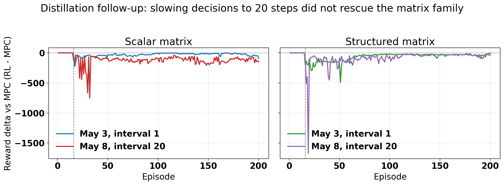
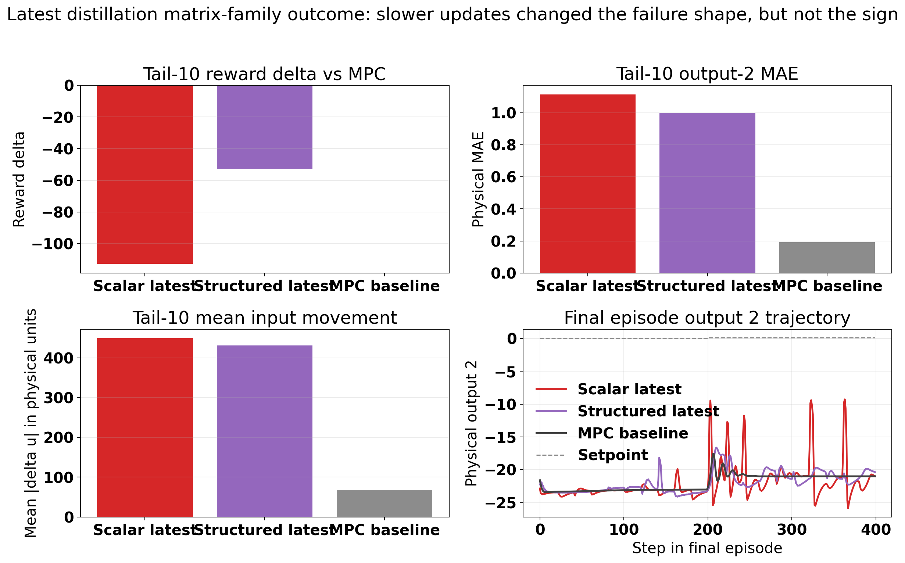
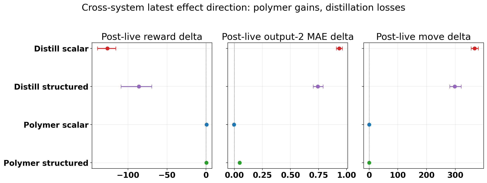
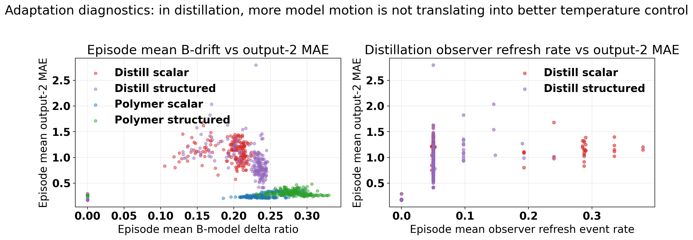

# Distillation Matrix And Structured-Matrix Step 4G Review With May 8 Follow-Up

Original stage note: 2026-05-04  
Follow-up update: 2026-05-08

## Objective

This note extends the earlier Step 4G distillation matrix-family review with the newest saved TD3 disturbance runs:

- previous scalar matrix run: `Distillation/Results/distillation_matrix_td3_disturb_fluctuation_mismatch_unified/20260503_062605`
- latest scalar matrix run: `Distillation/Results/distillation_matrix_td3_disturb_fluctuation_mismatch_unified/20260508_015834`
- previous structured matrix run: `Distillation/Results/distillation_structured_matrix_td3_disturb_fluctuation_mismatch_unified/20260503_083936`
- latest structured matrix run: `Distillation/Results/distillation_structured_matrix_td3_disturb_fluctuation_mismatch_unified/20260508_005027`
- disturbance MPC baseline: `Distillation/Data/mpc_results_disturb_fluctuation.pickle`

The update answers four questions:

1. Did the May 8 `decision_interval = 20` change rescue the distillation matrix family?
2. Why does distillation still fail while the polymer matrix family can succeed?
3. What do the latest figures and exploratory statistics say about the failure mechanism?
4. Would the Markov-correction idea currently under development be a good next direction?

New follow-up assets are under:

`report/figures/distillation_matrix_structured_followup_20260508/`

## Method Reconstruction

The distillation case tracks tray-24 ethane composition and tray-85 temperature:

$$ y_t = [x_{24,\mathrm{C_2H_6}},\; T_{85}]^\top, \qquad u_t = [\mathrm{reflux},\; \mathrm{reboiler}]^\top. $$

The baseline offset-free MPC solves the standard quadratic tracking and move-suppression problem on the identified augmented model:

$$ \min_{U_t} \sum_{k=0}^{H_p-1} \|y_{t+k|t}-y^{\mathrm{sp}}_{t+k}\|_Q^2 + \|\Delta u_{t+k|t}\|_R^2. $$

The scalar matrix supervisor changes the prediction model through one `A` multiplier and one multiplier for each `B` column:

$$ A_t^{\mathrm{MPC}}[:n_x,:n_x] = \alpha_t A_0[:n_x,:n_x], \qquad B_t^{\mathrm{MPC}}[:n_x,j] = \delta_{j,t} B_0[:n_x,j]. $$

The structured matrix supervisor uses grouped multipliers:

$$ a_t = [\theta_{A,1}, \theta_{A,2}, \theta_{A,3}, \theta_{A,\mathrm{off}}, \theta_{B,1}, \theta_{B,2}]. $$

Both latest runs use the relative-band reward:

$$ r_t = -(\mathrm{err}_{\mathrm{eff}} + \mathrm{move} + \mathrm{lin}_{\mathrm{out}} + \mathrm{lin}_{\mathrm{in}}) + \mathrm{bonus}, $$

with setpoint-dependent scaled bands:

$$ b_i^{\mathrm{scaled}}(y^{\mathrm{sp}}) = \frac{\max(k_{\mathrm{rel},i}|y_i^{\mathrm{sp}}|,\; b_{\mathrm{floor},i})}{y_i^{\max} - y_i^{\min}}. $$

The May 8 follow-up preserved Step 2 release protection, Step 4G behavioral cloning, and observer refresh on executed matrix changes. The main new runtime difference versus the May 3 report is:

$$ \texttt{decision\_interval}: 1 \rightarrow 20. $$

## Run Configuration Check

| Item | Scalar May 3 | Scalar May 8 | Structured May 3 | Structured May 8 |
| --- | ---: | ---: | ---: | ---: |
| Episodes | 200 | 200 | 200 | 200 |
| Steps per episode | 400 | 400 | 400 | 400 |
| Warm start episodes | 10 | 10 | 10 | 10 |
| First live episode | 16 | 16 | 16 | 16 |
| Decision interval | 1 | 20 | 1 | 20 |
| Step 2 release guard | on | on | on | on |
| Step 4G behavioral cloning | on | on | on | on |
| Step 3D usefulness gate | off | off | off | off |
| Observer refresh on executed model | not logged in old bundle | on | not logged in old bundle | on |

The intended May 4 hypothesis was that slower model switching might stabilize the distillation family. The May 8 saved runs are the direct test of that hypothesis.

## Follow-Up Result: `decision_interval = 20` Did Not Rescue Distillation

| Metric | Scalar May 3 | Scalar May 8 | Structured May 3 | Structured May 8 | Disturbance MPC |
| --- | ---: | ---: | ---: | ---: | ---: |
| Final reward delta vs MPC | -90.15 | -147.94 | -5.14 | -32.60 | 0 |
| Tail-10 reward delta vs MPC | -53.54 | -112.94 | -26.96 | -52.61 | 0 |
| Post-live mean reward delta | -29.89 | -126.41 | -68.67 | -86.01 | 0 |
| Post-live win rate | 0.54% | 0.00% | 0.00% | 0.00% | reference |
| Tail-10 output-2 MAE | 1.129 | 1.115 | 0.822 | 0.999 | 0.192 |
| Tail-10 mean input movement | 615.0 | 449.5 | 425.2 | 430.9 | 67.8 |

The slower `decision_interval = 20` update did change the episode-by-episode shape, but it did not improve the sign of the result.

- Scalar matrix became worse by reward, with tail-10 reward delta degrading from `-53.54` to `-112.94`.
- Structured matrix also became worse by reward, with tail-10 reward delta degrading from `-26.96` to `-52.61`.
- Scalar input movement dropped relative to May 3, but only from an already unacceptable level to another unacceptable level. It is still about `6.6x` the MPC tail-10 movement.
- Structured clipping dropped sharply, but that did not translate into better control. The tail-10 output-2 MAE still rose to `0.999`, versus `0.192` for MPC.

The earlier recommendation to try slower updates was scientifically reasonable, but the saved follow-up bundle now falsifies it as the main rescue mechanism.

## Latest Distillation Outcome

The latest distillation runs are not subtle near-misses. Both are decisively worse than the disturbance MPC baseline on reward, temperature tracking, and input movement.

Exploratory post-live statistics, computed on episodes 16-200 with episode-wise bootstrap intervals, are:

| Run | Post-live reward delta mean [95% CI] | Post-live output-2 MAE delta [95% CI] | Post-live move delta [95% CI] | Reward wins / losses |
| --- | --- | --- | --- | --- |
| Distillation scalar latest | `-126.41 [-139.28, -115.70]` | `0.935 [0.908, 0.963]` | `366.79 [354.42, 379.66]` | `0 / 185` |
| Distillation structured latest | `-86.01 [-109.13, -69.56]` | `0.745 [0.702, 0.791]` | `298.16 [280.12, 320.02]` | `0 / 185` |

These are exploratory rather than formal independent-sample tests, because the episodes come from one sequential training run. Still, the effect direction is not ambiguous.

## Why Distillation Failed While Polymer Worked

The cross-system comparison should be stated carefully. The polymer scalar matrix family is genuinely successful in the latest run. The polymer structured family is mixed but still reward-positive. Distillation has no corresponding win.

| Latest run | Post-live reward delta mean [95% CI] | Tail-10 output-2 MAE | Tail-10 move mean |
| --- | --- | --- | --- |
| Distillation scalar | `-126.41 [-139.28, -115.70]` | `1.115` vs MPC `0.192` | `449.5` vs MPC `67.8` |
| Distillation structured | `-86.01 [-109.13, -69.56]` | `0.999` vs MPC `0.192` | `430.9` vs MPC `67.8` |
| Polymer scalar | `0.536 [0.482, 0.584]` | `0.218` vs MPC `0.265` | `0.691` vs MPC `0.715` |
| Polymer structured | `0.366 [0.295, 0.432]` | `0.278` vs MPC `0.265` | `0.906` vs MPC `0.715` |

The main technical reasons are:

### 1. Distillation reward geometry is much more output-1 biased

The reward operates on scaled bands, not raw physical bands. When that scaling is respected, the asymmetry is much stronger in distillation than in polymer.

| System / setpoint | Edge-slope ratio out1/out2 | Bonus ratio out1/out2 | Current `Q1` | Edge-equalized `Q1` | Bonus-equalized `Q1` |
| --- | ---: | ---: | ---: | ---: | ---: |
| Polymer SP1 | 2.82 | 1.38 | 518 | 184 | 375 |
| Polymer SP2 | 2.15 | 0.80 | 518 | 241 | 645 |
| Distillation SP1 | 6.98 | 1.98 | 37000 | 5300 | 18725 |
| Distillation SP2 | 16.47 | 11.00 | 37000 | 2247 | 3365 |

So even before discussing learning, the distillation reward still encourages the policy to care much more about the composition output than the temperature output. That does not fully explain the failure, because both outputs degrade in the latest runs, but it does explain why severe temperature damage can coexist with a still-attempted RL policy.

### 2. In distillation, more model motion is not paying back in temperature control

For the latest distillation runs, larger mean B-side drift correlates with worse temperature error, not better:

- scalar latest: `corr(out2 MAE, B drift) = 0.70`
- structured latest: `corr(out2 MAE, B drift) = 0.33`

Observer refresh activity also trends the wrong way in the latest distillation runs:

- scalar latest: `corr(out2 MAE, observer refresh rate) = 0.26`
- structured latest: `corr(out2 MAE, observer refresh rate) = 0.49`

That is the opposite of the polymer scalar story. In the latest polymer scalar run, the B-side authority stays in a similar magnitude range, but the post-live reward delta is positive and the output-2 MAE is slightly better than baseline. In other words, polymer is getting useful predictive leverage from the multiplier family, while distillation is mostly injecting prediction-model motion that the closed loop cannot convert into better tracking.

### 3. Distillation structured control spends a lot of time at the authority boundary

For the latest distillation structured run:

- mean action saturation fraction is `0.509`
- mean near-bound fraction is `0.625`
- mean B-side model-delta ratio is `0.204`

This means the structured policy is often leaning on the edge of the allowed authority set, even though the Step 2 clipping fraction is low. The practical issue is not only hard clipping. It is that the learned policy spends much of its time in a high-authority regime whose induced model is still not useful for the actual plant-response correction needed by distillation.

### 4. Slower switching was not the missing ingredient

The May 8 follow-up directly tested the strongest prior hypothesis. Because the saved `decision_interval = 20` runs remain decisively negative, the dominant failure is not simply "the model changed too fast."

The more credible interpretation is:

- the distillation multiplier family is too blunt relative to the actual prediction mismatch,
- the reward still under-protects temperature relative to composition,
- and the observer-refresh plus model-refresh combination is not creating a helpful adaptive loop.

## Will The Current Markov-Correction Idea Help?

Probably yes as a better direction than direct distillation matrix multipliers, but only partially. It is not a complete fix by itself.

The current polymer Markov prototype changes lifted finite-horizon prediction blocks and accepts them only when recent measured-vs-predicted error improves:

$$ M_i(z_k)=M_{i,0}+\sum_{j=1}^r z_{j,k}M_{i,j}^{\mathrm{basis}}, $$

with acceptance driven by a prediction-improvement score of the form

$$ S_{\mathrm{pred}}(z)=\|Y^{\mathrm{meas}}-Y^0\|_2^2-\|Y^{\mathrm{meas}}-Y^z\|_2^2-\lambda_z\|z\|_2^2. $$

That addresses several of the current distillation failure modes more directly than global `A/B` multipliers:

| Distillation failure mode | Would Markov help? | Why |
| --- | --- | --- |
| Global `A/B` updates are too blunt | likely yes | Markov correction can target the horizon-local prediction defect instead of reshaping the full state-space model |
| Observer refresh appears coupled to worse output-2 MAE | likely yes | the first distillation Markov test can keep the observer nominal and only correct the lifted prediction model |
| High-authority structured action lives near the bounds | likely yes | prediction-error acceptance gives a data-driven gate instead of trusting authority magnitude alone |
| Reward still underweights temperature protection | no | Markov does not repair reward geometry by itself |
| Large input movement penalty mismatch | partial | Markov can reduce harmful model motion, but the control objective still needs correct output balance |

So the right conclusion is not "Markov will fix distillation." The right conclusion is:

1. Markov correction is a scientifically better next adaptation surface than the current distillation matrix family because it targets prediction error directly.
2. It should be tested with a nominal observer first, not with immediate observer refresh on every accepted correction.
3. It still needs a reward or evaluation design that explicitly protects the temperature output. Otherwise the same asymmetry can reappear on a different adaptation surface.

## Recommended Next Experiment

The next defensible distillation experiment is not another wider matrix run. It is a conservative distillation Markov pilot with the following rules:

1. Reuse the distillation baseline and mismatch-state infrastructure, but keep the observer nominal in the first pilot.
2. Build a very low-dimensional Markov basis, preferably B-side dominant or output-2-targeted first, not a large unconstrained basis.
3. Accept live corrections only when a recent prediction-error score improves and a loose nominal-cost guard still passes.
4. Re-run the reward geometry ablation at the same time, lowering distillation `Q1` toward the edge-equalized range before judging the method purely by reward.
5. Compare against disturbance MPC with the same three core metrics used here: reward delta, output-2 MAE, and input movement.

The acceptance bar should be:

- post-live reward delta mean at least above `-10`
- post-live win rate above `25%`
- tail-10 output-2 MAE below `0.30`
- tail-10 mean input movement below `2x` the MPC baseline

## Files Inspected

- `report/distillation_matrix_structured_step4g_latest_2026_05_04.md`
- `report/polymer_wide_range_matrix_structured_report.md`
- `report/polymer_markov_correction_progress.md`
- `report/scripts/generate_distillation_matrix_family_failure_analysis.py`
- `report/scripts/generate_distillation_matrix_deep_review_assets.py`
- `report/scripts/generate_distillation_matrix_structured_followup_assets.py`
- `utils/matrix_runner.py`
- `utils/structured_matrix_runner.py`
- `utils/rewards.py`
- `systems/distillation/config.py`
- `systems/distillation/notebook_params.py`
- `systems/polymer/notebook_params.py`
- latest and prior distillation matrix-family result bundles under `Distillation/Results/...`
- latest polymer matrix-family reference bundles under `Polymer/Results/...`

## Files Changed

- `report/distillation_matrix_structured_step4g_latest_2026_05_04.md`
- `report/scripts/generate_distillation_matrix_structured_followup_assets.py`
- `report/figures/distillation_matrix_structured_followup_20260508/`
