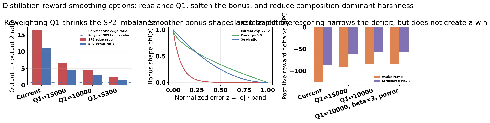

# Distillation Matrix And Structured-Matrix Step 4G Review With May 11 Scalar-Matrix Follow-Up

Original stage note: 2026-05-04  
First follow-up: 2026-05-08  
Second follow-up: 2026-05-10  
Third follow-up: 2026-05-11

## Objective

This note extends the Step 4G distillation matrix-family review with the newest saved TD3 disturbance runs:

- previous scalar matrix run: `Distillation/Results/distillation_matrix_td3_disturb_fluctuation_mismatch_unified/20260503_062605`
- first follow-up scalar run: `Distillation/Results/distillation_matrix_td3_disturb_fluctuation_mismatch_unified/20260508_015834`
- latest scalar matrix run: `Distillation/Results/distillation_matrix_td3_disturb_fluctuation_mismatch_unified/20260510_001108`
- previous structured matrix run: `Distillation/Results/distillation_structured_matrix_td3_disturb_fluctuation_mismatch_unified/20260503_083936`
- first follow-up structured run: `Distillation/Results/distillation_structured_matrix_td3_disturb_fluctuation_mismatch_unified/20260508_005027`
- latest structured matrix run: `Distillation/Results/distillation_structured_matrix_td3_disturb_fluctuation_mismatch_unified/20260510_111413`
- disturbance MPC baseline: `Distillation/Data/mpc_results_disturb_fluctuation.pickle`

New follow-up assets are under:

`report/figures/distillation_matrix_structured_followup_20260510/`

The May 10 update answers four questions:

1. Did the fixed-observer rerun improve on the May 8 `decision_interval = 20` result?
2. What does the saved configuration difference imply about the current distillation matrix family?
3. How do the latest distillation results compare with the polymer matrix-family reference runs?
4. Does the May 10 evidence change the case for a future distillation Markov-correction pilot?

The May 11 update adds one more question:

5. In the newest scalar-matrix rerun, is the final-episode second setpoint genuinely better, and if not, what is causing the first-setpoint jitter?

## Method Reconstruction

The distillation case tracks tray-24 ethane composition and tray-85 temperature:

$$ y_t = [x_{24,\mathrm{C_2H_6}},\; T_{85}]^\top, \qquad u_t = [\mathrm{reflux},\; \mathrm{reboiler}]^\top. $$

The offset-free MPC layer solves the standard quadratic tracking and move-suppression problem on the identified augmented model:

$$ \min_{U_t} \sum_{k=0}^{H_p-1} \|y_{t+k|t}-y^{\mathrm{sp}}_{t+k}\|_Q^2 + \|\Delta u_{t+k|t}\|_R^2. $$

The scalar matrix supervisor modifies the prediction model through one `A` multiplier and one multiplier per `B` column:

$$ A_t^{\mathrm{MPC}}[:n_x,:n_x] = \alpha_t A_0[:n_x,:n_x], \qquad B_t^{\mathrm{MPC}}[:n_x,j] = \delta_{j,t} B_0[:n_x,j]. $$

The structured matrix supervisor uses grouped multipliers:

$$ a_t = [\theta_{A,1}, \theta_{A,2}, \theta_{A,3}, \theta_{A,\mathrm{off}}, \theta_{B,1}, \theta_{B,2}]. $$

The observer layer matters in the May 10 follow-up. With observer refresh enabled, the estimator can be recomputed for the executed matrix-adjusted model:

$$ \hat{x}_{t+1} = A_t^{\mathrm{obs}} \hat{x}_t + B_t^{\mathrm{obs}} u_t + L_t \left(y_t - C \hat{x}_t\right). $$

With the May 10 fixed-observer reruns, the controller still optimizes with the RL-adjusted `A_t^{\mathrm{MPC}}, B_t^{\mathrm{MPC}}`, but the observer stays nominal instead of refreshing on executed model changes.

All compared runs use the relative-band reward:

$$ r_t = -(\mathrm{err}_{\mathrm{eff}} + \mathrm{move} + \mathrm{lin}_{\mathrm{out}} + \mathrm{lin}_{\mathrm{in}}) + \mathrm{bonus}, $$

with setpoint-dependent scaled bands:

$$ b_i^{\mathrm{scaled}}(y^{\mathrm{sp}}) = \frac{\max(k_{\mathrm{rel},i}|y_i^{\mathrm{sp}}|,\; b_{\mathrm{floor},i})}{y_i^{\max} - y_i^{\min}}. $$

## Configuration Check

The saved May 8 and May 10 bundles are nearly identical at the configuration level. The direct `config_snapshot` diff shows one substantive change in both families:

$$ \texttt{recalculate\_observer\_on\_matrix\_change}: \mathrm{True} \rightarrow \mathrm{False}. $$

| Item | Scalar May 8 | Scalar May 10 | Structured May 8 | Structured May 10 |
| --- | ---: | ---: | ---: | ---: |
| Decision interval | 20 | 20 | 20 | 20 |
| Warm start episodes | 10 | 10 | 10 | 10 |
| First live episode | 16 | 16 | 16 | 16 |
| Observer refresh on matrix change | on | off | on | off |
| Mean observer refresh event rate | 0.081 | 0.000 | 0.053 | 0.000 |
| Step 2 release guard | on | on | on | on |
| Step 4G behavioral cloning | on | on | on | on |
| Step 3D usefulness gate | off | off | off | off |

This matters because the May 10 reruns are not just "another bad seed" in the saved metadata. The latest bundles isolate the fixed-observer toggle as the only recorded run-configuration change relative to May 8.

## Main Result: Fixed Observer Was Not A Rescue, It Was Catastrophic

| Metric | Scalar May 3 | Scalar May 8 | Scalar May 10 | Structured May 3 | Structured May 8 | Structured May 10 | Disturbance MPC |
| --- | ---: | ---: | ---: | ---: | ---: | ---: | ---: |
| Final reward delta vs MPC | -90.15 | -147.94 | -1668.56 | -5.14 | -32.60 | -6693.69 | 0 |
| Tail-10 reward delta vs MPC | -53.54 | -112.94 | -1735.42 | -26.96 | -52.61 | -9723.81 | 0 |
| Post-live mean reward delta vs MPC | -29.89 | -126.41 | -1941.67 | -68.67 | -86.01 | -6228.49 | 0 |
| Post-live win rate | 0.54% | 0.00% | 0.00% | 0.00% | 0.00% | 0.00% | reference |
| Tail-10 output-2 MAE | 1.129 | 1.115 | 3.357 | 0.822 | 0.999 | 6.448 | 0.192 |
| Tail-10 mean input movement | 615.0 | 449.5 | 1789.1 | 425.2 | 430.9 | 2953.2 | 67.8 |

The May 8 `decision_interval = 20` reruns were already negative. The May 10 fixed-observer reruns are qualitatively worse:

- scalar tail-10 reward delta degraded from `-112.94` to `-1735.42`
- scalar tail-10 output-2 MAE rose from `1.115` to `3.357`
- scalar tail-10 mean input movement rose from `449.5` to `1789.1`
- structured tail-10 reward delta degraded from `-52.61` to `-9723.81`
- structured tail-10 output-2 MAE rose from `0.999` to `6.448`
- structured tail-10 mean input movement rose from `430.9` to `2953.2`

The baseline comparison is now extreme rather than borderline:

- scalar May 10 output-2 MAE is `17.5x` the MPC tail-10 value
- scalar May 10 mean input movement is `26.4x` the MPC tail-10 value
- structured May 10 output-2 MAE is `33.5x` the MPC tail-10 value
- structured May 10 mean input movement is `43.5x` the MPC tail-10 value

The practical conclusion is straightforward: for the current distillation state-space multiplier family, turning observer refresh off did not stabilize the loop. It removed one of the few mechanisms that was partly containing the damage.

## Latest Cross-System Outcome

The latest cross-system comparison should be stated carefully. Polymer remains the positive counterexample. The distillation fixed-observer reruns are not just slightly worse than polymer; they fail by orders of magnitude on the same evaluation axes.

| Latest run | Post-live reward delta mean [95% CI] | Post-live output-2 MAE delta [95% CI] | Post-live move delta [95% CI] | Reward wins / losses |
| --- | --- | --- | --- | --- |
| Distillation scalar latest | `-1941.67 [-2241.16, -1647.99]` | `3.54 [3.40, 3.69]` | `1326.96 [1216.87, 1430.44]` | `0 / 185` |
| Distillation structured latest | `-6228.49 [-6760.82, -5674.64]` | `4.83 [4.60, 5.05]` | `2204.17 [2086.79, 2314.09]` | `0 / 185` |
| Polymer scalar latest | `0.536 [0.482, 0.584]` | `-0.004 [-0.010, 0.003]` | `0.021 [0.011, 0.032]` | `165 / 23` |
| Polymer structured latest | `0.366 [0.295, 0.432]` | `0.047 [0.040, 0.054]` | `0.189 [0.178, 0.199]` | `145 / 42` |

These intervals are exploratory bootstrap summaries over sequential episodes, not formal independent-sample tests. Even with that caution, the effect direction is not ambiguous.

## Updated Failure Mechanism Interpretation

### 1. The current distillation matrix family appears to need observer refresh

The strongest new result is not merely that May 10 is bad. It is that the one saved configuration change from May 8 to May 10 was enough to turn an already negative family into a catastrophic one.

The likely mechanism is estimator-prediction inconsistency:

- the MPC optimizer reasons with the RL-adjusted `A_t^{\mathrm{MPC}}, B_t^{\mathrm{MPC}}`
- the fixed observer keeps estimating state with the nominal model
- the closed loop then acts on a state estimate that is no longer aligned with the prediction model the optimizer trusted

That interpretation is consistent with the simultaneous explosion in reward loss, temperature error, and input movement once observer refresh was disabled.

### 2. More model motion is still associated with worse temperature control

For the latest May 10 reruns:

- scalar latest: `corr(out2 MAE, B drift) = 0.69`
- structured latest: `corr(out2 MAE, B drift) = 0.73`

So the latest failure is not "the controller stopped adapting." The saved logs show the opposite. Model motion continues, but the distillation loop converts that motion into worse output-2 error rather than useful compensation.

### 3. Structured control still lives near the authority boundary

The structured May 10 run remains especially revealing:

- mean action saturation fraction is `0.643`
- mean near-bound fraction is `0.731`
- mean B-side model-delta ratio is `0.213`
- `corr(out2 MAE, saturation) = 0.845`
- `corr(reward, saturation) = -0.768`

So the fixed-observer degradation is not only an observer issue. The structured policy is still spending much of its time at the authority boundary, and the episodes with more boundary pressure are also the episodes with worse temperature control.

### 4. Reward geometry is still output-1 biased in distillation

The earlier reward-geometry concern still stands. The distillation reward remains much more output-1 biased than the polymer reward after scaling is respected:

- polymer edge-slope ratios out1/out2: `2.82` at SP1 and `2.15` at SP2
- distillation edge-slope ratios out1/out2: `6.98` at SP1 and `16.47` at SP2
- distillation bonus ratios out1/out2: `1.98` at SP1 and `11.00` at SP2

This does not explain the entire May 10 collapse by itself, because both outputs deteriorate strongly, but it still helps explain why temperature protection is too weak relative to composition.

## How To Smooth The Reward Geometry

The current relative-band reward separates into two different smoothing problems:

1. cross-output imbalance
2. cliff-like inside-band bonus decay

For the current helper, the distillation output-balance ratios are

$$
r_{\mathrm{edge}} = \frac{Q_1 b_1}{Q_2 b_2},
\qquad
r_{\mathrm{bonus}} = \frac{Q_1 b_1^2}{Q_2 b_2^2},
$$

where $b_i$ is the scaled relative band for output $i$.

That means:

- lowering `Q1` is the cleanest no-helper-change way to reduce both ratios at once
- lowering `beta` reduces the absolute bonus magnitude but does **not** change the output-1/output-2 bonus ratio
- changing `bonus_kind` smooths the inside-band reward shape but does **not** change the cross-output ratio
- changing `tau_frac` or `gate` smooths the transition between outside-band and inside-band regimes but does **not** directly fix composition dominance
- changing the physical bands can also change the ratio, but it simultaneously changes what the notebook counts as acceptable physical error, so it is a riskier first lever

To make that concrete, I generated a reward-smoothing follow-up asset bundle:

`report/figures/distillation_reward_geometry_smoothing_20260510/`

### Candidate reweighting table

The SP2 setpoint is the harshest current case, so it is the right place to compare candidate geometry changes.

| Candidate | SP2 edge ratio | SP2 bonus ratio | Scalar May 8 post-live reward delta | Structured May 8 post-live reward delta |
| --- | ---: | ---: | ---: | ---: |
| Current | 16.47 | 11.00 | -126.41 | -86.01 |
| `Q1 = 15000` | 6.68 | 4.46 | -91.62 | -62.59 |
| `Q1 = 10000` | 4.45 | 2.97 | -83.72 | -57.26 |
| `Q1 = 5300` | 2.36 | 1.58 | -76.29 | -52.26 |
| `Q1 = 10000`, `beta = 3`, `bonus_kind = "power"` | 4.45 | 2.97 | -83.28 | -56.92 |

The reward-delta columns above are **fixed-trajectory rescoring** on the May 8 observer-refresh runs, not retraining results. They answer a narrow question: if the saved May 8 trajectories were judged under smoother candidates, how much of the current negative reward gap is geometry-driven?

The answer is meaningful but limited:

- smoother reward geometry narrows the May 8 scalar and structured reward deficits substantially
- even aggressive smoothing does **not** make those saved trajectories beat disturbance MPC
- so reward geometry is part of the problem, but not the whole problem

### What each smoothing lever would do

#### 1. Lower `Q1` first

This is the most direct way to reduce the output-1 bias without redefining the physical temperature band.

- `Q1 = 15000` is the conservative first ablation:
  it cuts the SP2 edge ratio from `16.47` to `6.68` and the SP2 bonus ratio from `11.00` to `4.46`
- `Q1 = 10000` is the best middle-ground candidate from the current table:
  it cuts the SP2 edge ratio to `4.45` and the SP2 bonus ratio to `2.97`, while also bringing the SP1 edge ratio below the polymer SP1 value
- `Q1 = 5300` is a useful lower anchor because it is near the current SP1 edge-equalized target:
  it nearly equalizes SP1 edge pressure and pulls SP2 much closer to the polymer range, but it is aggressive enough that composition convergence could become noticeably slower

Expected run effect after retraining:

- less composition-only chasing near the band boundary
- more freedom for the policy to protect output 2
- lower saturation pressure and lower move amplification
- some increase in composition settling time or residual composition error if `Q1` is pushed too low

#### 2. Lower `beta` after the weight rebalance

`beta` does not change the ratio, but it does reduce the absolute size of the inside-band bonus. That matters because the current bonus is large enough to reward composition-band entry aggressively even when temperature quality is still poor.

At SP2, with `Q1 = 10000`:

- current output-1 bonus prefactor is `17.35`
- changing to `beta = 3` drops it to `7.44`

Expected run effect after retraining:

- less incentive to spike authority just to cross the composition band
- smaller reward swings between "just outside" and "just inside" behavior
- lower reward variance across episodes
- less chance that the policy learns a narrow band-hitting strategy that pays off in reward but not in temperature regulation

#### 3. Replace the cliff-like exponential bonus

The current `bonus_kind = "exp"` with `bonus_k = 12` is extremely steep. At the normalized band positions:

- `z = 0.25`: current exponential bonus shape is only `0.0498`
- `z = 0.50`: current exponential bonus shape is only `0.0025`
- `z = 0.75`: current exponential bonus shape is only `0.0001`

By comparison:

- `bonus_kind = "quadratic"` gives `0.5625`, `0.25`, and `0.0625`
- `bonus_kind = "power"` with `p = 0.6` gives `0.5647`, `0.3402`, and `0.1585`

So the current exponential bonus is not merely "strong." It is almost an on/off reward that collapses quickly once the error is no longer very close to zero.

Expected run effect after retraining:

- smoother credit assignment near the band edge
- less abrupt switching between exploration and authority saturation
- better chance that the agent values gradual temperature improvement instead of only sharp composition-band entry

This is why the `Q1 = 10000`, `beta = 3`, `bonus_kind = "power"` candidate is attractive as a second-stage smoothing option after the first weight-only ablation.

#### 4. Use `tau_frac` or `gate` only as secondary smoothers

If we want an even smoother transition between outside-band and inside-band penalties, the clean secondary levers are:

- increasing `tau_frac`, for example `0.7 -> 1.0`
- changing `gate` from `"geom"` to `"mean"`

These do not solve the composition/temperature balance by themselves. What they do is soften the regime switch in `w_in`, making the reward less brittle when one output is close to its band and the other is not.

Expected run effect after retraining:

- smoother episode-to-episode reward traces
- less reward discontinuity around band crossing
- probably modest improvement in optimization stability
- little direct change in output balance unless combined with a smaller `Q1`

#### 5. Do not start with band edits

Band edits can reduce ratios too, but they are more ambiguous scientifically:

- increasing the temperature band can make output 2 appear more acceptable without actual physical improvement
- shrinking the composition band reduces output-1 slope and bonus, but it also makes composition "inside-band" success harder to earn

So band edits are better treated as a second-order design decision after reweighting and bonus smoothing are understood.

### Practical recommendation

The strongest report extension from this analysis is a staged reward-smoothing path:

1. First rerun with `Q1 = 10000`, keeping the current band definitions and the rest of the reward helper unchanged.
2. If that helps temperature protection but the reward is still too brittle, lower `beta` from `7` to `3`.
3. If the reward remains cliff-like near the band edge, switch `bonus_kind` from `"exp"` to `"power"` or `"quadratic"`.
4. Only after those tests, consider `tau_frac` or `gate` smoothing.
5. Leave band edits for last, because they change the physical meaning of "good enough" tracking.

The most important scientific caution is that reward smoothing should be judged by both reward and physical metrics. The May 8 rescoring shows that smoother geometry can explain part of the current reward gap, but not all of it. So the right success criteria remain:

- better output-2 MAE
- lower input movement
- lower saturation and near-bound fractions
- and only then a better reward gap

## May 11 Scalar-Matrix Follow-Up: The Last Episode Is Not A Real Recovery

The newest scalar matrix disturbance run is:

- latest scalar matrix run: `Distillation/Results/distillation_matrix_td3_disturb_fluctuation_mismatch_unified/20260511_183650`
- disturbance MPC baseline: `Distillation/Data/mpc_results_disturb_fluctuation.pickle`

New follow-up assets are under:

`report/figures/distillation_matrix_latest_followup_20260511/`

The first important result is a reporting issue:

- the saved RL bundle stores `y_mpc` and `u_mpc` as exact copies of the RL trajectories
- the real MPC comparison must therefore be taken from `Distillation/Data/mpc_results_disturb_fluctuation.pickle`, not from the RL bundle’s internal `y_mpc/u_mpc` fields

This comes directly from [utils/plotting_core.py](../utils/plotting_core.py), where `build_storage_bundle(...)` writes:

- `stored["y_rl"] = bundle["y_line_full"]`
- `stored["u_rl"] = bundle["u_step_full"]`
- `stored["y_mpc"] = bundle["y_line_full"]`
- `stored["u_mpc"] = bundle["u_step_full"]`

So a naive inspection of the saved RL bundle can falsely suggest RL and MPC are identical inside the artifact, even though the true disturbance baseline differs.

### 1. The latest run is still catastrophically worse than disturbance MPC

Using the real disturbance baseline:

| Metric | Latest scalar TD3 matrix | Disturbance MPC |
| --- | ---: | ---: |
| Mean episode reward | `-17.5482` | `-0.00091` |
| Last 10 episode reward | `-115.0549` | `-0.00099` |
| Final test episode reward | `-127.2365` | `-0.00083` |

So this is not a near-success with a local anomaly in the last episode. It is globally far below the disturbance MPC baseline.

### 2. Only the final episode is a test episode

The saved `test_train_dict` marks only the last episode as a held-out test episode.

That means:

- the final episode is the cleanest place to examine the visible jitter
- but the tail training episodes still matter, because they show whether the same setpoint-block pattern is already present before the test rollout

### 3. The final episode really does split into a bad first setpoint block and a calmer second block

The final episode contains two `200`-step setpoint blocks:

- setpoint block 1: approximately `[0.013, -23]`
- setpoint block 2: approximately `[0.028, -21]`

For the final test episode:

| Metric | RL block 1 | MPC block 1 | RL block 2 | MPC block 2 |
| --- | ---: | ---: | ---: | ---: |
| x24 RMSE | `0.06973` | `0.00218` | `0.00504` | `0.00345` |
| T85 RMSE | `2.7724` | `0.2258` | `0.7539` | `0.5698` |
| x24 IAE | `0.03439` | `0.00151` | `0.00173` | `0.00151` |
| T85 IAE | `1.5969` | `0.1626` | `0.2540` | `0.1958` |
| Mean input-move norm | `4358.70` | `126.62` | `126.05` | `130.59` |
| Alpha total variation | `0.08846` | reference | `0.00214` | reference |

This confirms the qualitative impression:

- the first setpoint block is genuinely jittery and extremely aggressive
- the second setpoint block is much calmer

But the second block is **not** actually better than disturbance MPC on tracking. It is only less bad than the first block.

The one visual detail that can mislead here is temperature jitter in block 2:

- RL T85 jitter: `0.0716`
- MPC T85 jitter: `0.2438`

So the RL trace can look smoother there. But that smoother trace still comes with worse temperature tracking:

- RL T85 RMSE: `0.7539`
- MPC T85 RMSE: `0.5698`

So the second block is visually calmer, but it is not a real control improvement.

### 4. The same first-block problem is already present across the tail, not only in the last episode

Averaging over the last `20` episodes:

| Tail-20 metric (RL minus MPC) | Setpoint block 1 | Setpoint block 2 |
| --- | ---: | ---: |
| T85 RMSE delta | `+2.0252` | `+0.5965` |
| x24 RMSE delta | `+0.04375` | `+0.00831` |
| Mean input-move delta | `+2291.64` | `+160.35` |
| Alpha total variation | `0.03577` | `0.000758` |

So the last episode is not a one-off accident. The tail already contains the same pattern:

1. the first setpoint block is where the multipliers keep moving aggressively
2. the second setpoint block is much closer to nominal behavior

### 5. What likely happened mechanistically

By the tail of the run, the release schedule is fully open:

- release phase in the final episode: full-live phase for both setpoint blocks
- release guard active fraction: `0.0`
- release clip fraction: `0.0`

So the first-block jitter is not a protected-release artifact. It is happening in the fully released policy.

The multiplier trace explains the split:

- final episode block 1: `alpha` std = `0.2093`, `alpha` TV = `0.08846`
- final episode block 2: `alpha` std = `0.01099`, `alpha` TV = `0.00214`

And the tail average keeps the same ordering:

- tail block 1 alpha TV = `0.03577`
- tail block 2 alpha TV = `0.000758`

Inference:

- when the episode enters the first setpoint block, the actor is still making large model-side scalar changes
- those changes amplify input motion and destabilize tracking, especially for T85
- by the second setpoint block, the policy effectively settles closer to a near-nominal multiplier, so the trace looks calmer

That calmer second block can create the visual impression of "real recovery," but the quantitative comparison shows it is still below disturbance MPC.

### 6. Why the current result still leaves some hope

There is still one encouraging signal in this run:

- the policy clearly can collapse back toward a much calmer multiplier regime inside the same final episode

That means the scalar matrix family is not failing only because it must always explode. It fails because the released policy does not handle the first setpoint block robustly and pays a huge movement/tracking cost before it reaches the calmer regime.

So the newest result does not support a success claim, but it does support a more specific hypothesis:

- the main practical failure is now concentrated in the first setpoint block under the fully released scalar multiplier policy
- the second block looks better mainly because the multiplier dynamics calm down, not because the RL controller is outperforming disturbance MPC

### 7. Updated next-step interpretation

The May 11 evidence makes the scalar family story more precise:

1. this is not a "good final episode with one jittery section"
2. it is a globally negative run whose tail contains a repeatable first-setpoint instability pattern
3. the instability is strongly associated with large scalar-multiplier variation and enormous input movement in block 1
4. the calmer second setpoint block is not enough to rescue the run and should not be interpreted as a true win over MPC

## What This Changes About The Markov-Correction Direction

The May 10 evidence changes one part of the earlier interpretation and leaves another part intact.

What changes:

- the repo should not treat "fixed nominal observer plus global state-space matrix multipliers" as a benign distillation fallback
- the current matrix-family failure is now more clearly about model-estimator inconsistency, not only about switching speed

What does **not** change:

- a future distillation Markov pilot can still keep the observer nominal, because Markov correction does not have to rewrite the underlying state estimator the way global `A/B` multipliers do
- the stronger case is now to correct lifted prediction blocks directly, under prediction-error acceptance, rather than to keep pushing global state-space multipliers harder

So the correct takeaway is more precise than before:

1. The May 10 fixed-observer reruns rule out a nominal-observer version of the **current matrix family**.
2. They do **not** rule out a nominal-observer **Markov-correction** pilot, because that uses a different adaptation surface.
3. Any future distillation Markov pilot still needs explicit protection for temperature performance, either in reward design or in the acceptance metric.

## Recommended Next Experiment

The next defensible distillation experiment is no longer another matrix-family rerun with observer refresh off.

1. Stop the fixed-observer branch for the current scalar and structured matrix families.
2. If a matrix-family sanity rerun is needed, keep observer refresh enabled and treat May 8 as the safer reference, not May 10.
3. Move to a conservative distillation Markov pilot with a nominal observer, but only because the correction lives in lifted prediction blocks rather than global `A/B` multipliers.
4. Keep the first Markov basis low-dimensional and B-side dominant, with acceptance driven by recent prediction-error improvement.
5. Revisit the distillation reward geometry at the same time, lowering the output-1 weight materially from `37000` before using reward alone as the success criterion.

The acceptance bar should remain practical and transparent:

- post-live reward delta mean above `-10`
- post-live win rate above `25%`
- tail-10 output-2 MAE below `0.30`
- tail-10 mean input movement below `2x` the MPC baseline

## Remaining Uncertainty

- These results still come from one saved sequential training run per phase, not a multi-seed distillation study.
- The May 10 effect sizes are so large that the direction is hard to dismiss, but exact magnitudes could shift under additional seeds.
- The report infers mechanism from saved traces, configuration snapshots, and logged diagnostics rather than from a formal estimator-theory proof.
- A Markov pilot could fail for separate reasons if the lifted basis is too expressive or the acceptance guard is too weak.

## Files Inspected

- `report/distillation_matrix_structured_step4g_latest_2026_05_04.md`
- `change-reports/2026-05-04_distillation_matrix_structured_step4g_review.md`
- `change-reports/2026-05-08_disable_distillation_matrix_observer_recalc.md`
- `report/scripts/generate_distillation_matrix_structured_followup_assets.py`
- `report/scripts/generate_distillation_reward_smoothing_assets.py`
- `report/figures/distillation_matrix_structured_followup_20260510/distillation_phase_summary.csv`
- `report/figures/distillation_matrix_structured_followup_20260510/cross_system_latest_summary.csv`
- `report/figures/distillation_matrix_structured_followup_20260510/exploratory_stats_summary.csv`
- `report/figures/distillation_reward_geometry_smoothing_20260510/reward_smoothing_candidates.csv`
- `report/figures/distillation_reward_geometry_smoothing_20260510/summary.json`
- `Distillation/Results/distillation_matrix_td3_disturb_fluctuation_mismatch_unified/20260508_015834/input_data.pkl`
- `Distillation/Results/distillation_matrix_td3_disturb_fluctuation_mismatch_unified/20260510_001108/input_data.pkl`
- `Distillation/Results/distillation_matrix_td3_disturb_fluctuation_mismatch_unified/20260511_183650/input_data.pkl`
- `Distillation/Results/distillation_structured_matrix_td3_disturb_fluctuation_mismatch_unified/20260508_005027/input_data.pkl`
- `Distillation/Results/distillation_structured_matrix_td3_disturb_fluctuation_mismatch_unified/20260510_111413/input_data.pkl`
- `Distillation/Data/mpc_results_disturb_fluctuation.pickle`
- `utils/plotting_core.py`

## Files Changed

- `report/distillation_matrix_structured_step4g_latest_2026_05_04.md`
- `report/scripts/generate_distillation_matrix_structured_followup_assets.py`
- `report/scripts/generate_distillation_reward_smoothing_assets.py`
- `report/scripts/generate_distillation_matrix_latest_followup_assets_20260511.py`
- `report/figures/distillation_matrix_structured_followup_20260510/`
- `report/figures/distillation_reward_geometry_smoothing_20260510/`
- `report/figures/distillation_matrix_latest_followup_20260511/`
