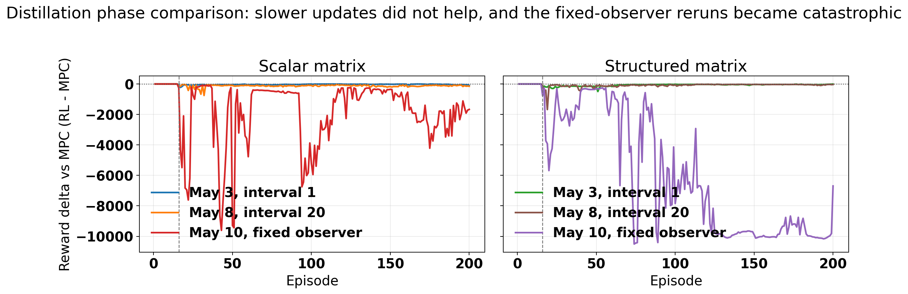
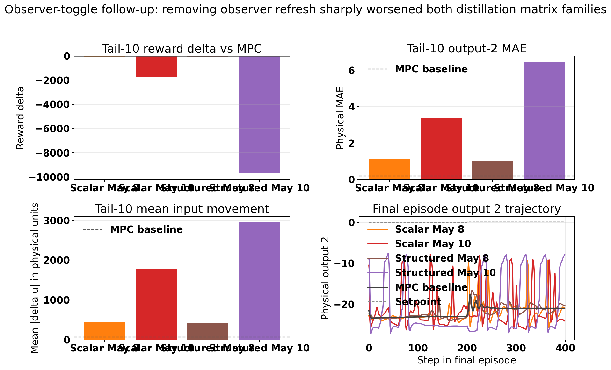
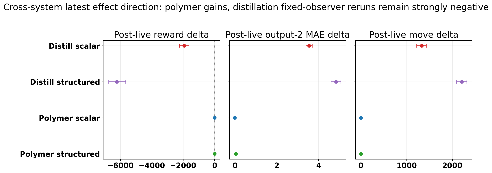
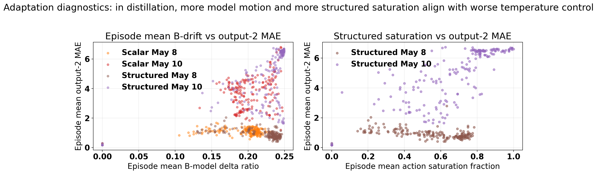
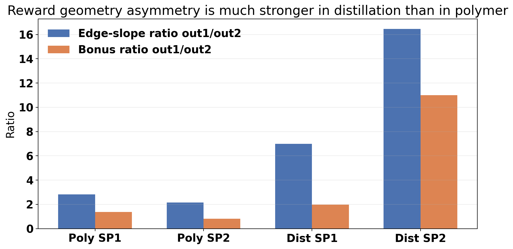

# Distillation Matrix And Structured-Matrix Step 4G Review With May 10 Fixed-Observer Follow-Up

Original stage note: 2026-05-04  
First follow-up: 2026-05-08  
Second follow-up: 2026-05-10

## Objective

This note extends the Step 4G distillation matrix-family review with the newest saved TD3 disturbance runs:

- previous scalar matrix run: `Distillation/Results/distillation_matrix_td3_disturb_fluctuation_mismatch_unified/20260503_062605`
- first follow-up scalar run: `Distillation/Results/distillation_matrix_td3_disturb_fluctuation_mismatch_unified/20260508_015834`
- latest scalar matrix run: `Distillation/Results/distillation_matrix_td3_disturb_fluctuation_mismatch_unified/20260510_001108`
- previous structured matrix run: `Distillation/Results/distillation_structured_matrix_td3_disturb_fluctuation_mismatch_unified/20260503_083936`
- first follow-up structured run: `Distillation/Results/distillation_structured_matrix_td3_disturb_fluctuation_mismatch_unified/20260508_005027`
- latest structured matrix run: `Distillation/Results/distillation_structured_matrix_td3_disturb_fluctuation_mismatch_unified/20260510_111413`
- disturbance MPC baseline: `Distillation/Data/mpc_results_disturb_fluctuation.pickle`

New follow-up assets are under:

`report/figures/distillation_matrix_structured_followup_20260510/`

The May 10 update answers four questions:

1. Did the fixed-observer rerun improve on the May 8 `decision_interval = 20` result?
2. What does the saved configuration difference imply about the current distillation matrix family?
3. How do the latest distillation results compare with the polymer matrix-family reference runs?
4. Does the May 10 evidence change the case for a future distillation Markov-correction pilot?

## Method Reconstruction

The distillation case tracks tray-24 ethane composition and tray-85 temperature:

$$ y_t = [x_{24,\mathrm{C_2H_6}},\; T_{85}]^\top, \qquad u_t = [\mathrm{reflux},\; \mathrm{reboiler}]^\top. $$

The offset-free MPC layer solves the standard quadratic tracking and move-suppression problem on the identified augmented model:

$$ \min_{U_t} \sum_{k=0}^{H_p-1} \|y_{t+k|t}-y^{\mathrm{sp}}_{t+k}\|_Q^2 + \|\Delta u_{t+k|t}\|_R^2. $$

The scalar matrix supervisor modifies the prediction model through one `A` multiplier and one multiplier per `B` column:

$$ A_t^{\mathrm{MPC}}[:n_x,:n_x] = \alpha_t A_0[:n_x,:n_x], \qquad B_t^{\mathrm{MPC}}[:n_x,j] = \delta_{j,t} B_0[:n_x,j]. $$

The structured matrix supervisor uses grouped multipliers:

$$ a_t = [\theta_{A,1}, \theta_{A,2}, \theta_{A,3}, \theta_{A,\mathrm{off}}, \theta_{B,1}, \theta_{B,2}]. $$

The observer layer matters in the May 10 follow-up. With observer refresh enabled, the estimator can be recomputed for the executed matrix-adjusted model:

$$ \hat{x}_{t+1} = A_t^{\mathrm{obs}} \hat{x}_t + B_t^{\mathrm{obs}} u_t + L_t \left(y_t - C \hat{x}_t\right). $$

With the May 10 fixed-observer reruns, the controller still optimizes with the RL-adjusted `A_t^{\mathrm{MPC}}, B_t^{\mathrm{MPC}}`, but the observer stays nominal instead of refreshing on executed model changes.

All compared runs use the relative-band reward:

$$ r_t = -(\mathrm{err}_{\mathrm{eff}} + \mathrm{move} + \mathrm{lin}_{\mathrm{out}} + \mathrm{lin}_{\mathrm{in}}) + \mathrm{bonus}, $$

with setpoint-dependent scaled bands:

$$ b_i^{\mathrm{scaled}}(y^{\mathrm{sp}}) = \frac{\max(k_{\mathrm{rel},i}|y_i^{\mathrm{sp}}|,\; b_{\mathrm{floor},i})}{y_i^{\max} - y_i^{\min}}. $$

## Configuration Check

The saved May 8 and May 10 bundles are nearly identical at the configuration level. The direct `config_snapshot` diff shows one substantive change in both families:

$$ \texttt{recalculate\_observer\_on\_matrix\_change}: \mathrm{True} \rightarrow \mathrm{False}. $$

| Item | Scalar May 8 | Scalar May 10 | Structured May 8 | Structured May 10 |
| --- | ---: | ---: | ---: | ---: |
| Decision interval | 20 | 20 | 20 | 20 |
| Warm start episodes | 10 | 10 | 10 | 10 |
| First live episode | 16 | 16 | 16 | 16 |
| Observer refresh on matrix change | on | off | on | off |
| Mean observer refresh event rate | 0.081 | 0.000 | 0.053 | 0.000 |
| Step 2 release guard | on | on | on | on |
| Step 4G behavioral cloning | on | on | on | on |
| Step 3D usefulness gate | off | off | off | off |

This matters because the May 10 reruns are not just "another bad seed" in the saved metadata. The latest bundles isolate the fixed-observer toggle as the only recorded run-configuration change relative to May 8.

## Main Result: Fixed Observer Was Not A Rescue, It Was Catastrophic

| Metric | Scalar May 3 | Scalar May 8 | Scalar May 10 | Structured May 3 | Structured May 8 | Structured May 10 | Disturbance MPC |
| --- | ---: | ---: | ---: | ---: | ---: | ---: | ---: |
| Final reward delta vs MPC | -90.15 | -147.94 | -1668.56 | -5.14 | -32.60 | -6693.69 | 0 |
| Tail-10 reward delta vs MPC | -53.54 | -112.94 | -1735.42 | -26.96 | -52.61 | -9723.81 | 0 |
| Post-live mean reward delta vs MPC | -29.89 | -126.41 | -1941.67 | -68.67 | -86.01 | -6228.49 | 0 |
| Post-live win rate | 0.54% | 0.00% | 0.00% | 0.00% | 0.00% | 0.00% | reference |
| Tail-10 output-2 MAE | 1.129 | 1.115 | 3.357 | 0.822 | 0.999 | 6.448 | 0.192 |
| Tail-10 mean input movement | 615.0 | 449.5 | 1789.1 | 425.2 | 430.9 | 2953.2 | 67.8 |

The May 8 `decision_interval = 20` reruns were already negative. The May 10 fixed-observer reruns are qualitatively worse:

- scalar tail-10 reward delta degraded from `-112.94` to `-1735.42`
- scalar tail-10 output-2 MAE rose from `1.115` to `3.357`
- scalar tail-10 mean input movement rose from `449.5` to `1789.1`
- structured tail-10 reward delta degraded from `-52.61` to `-9723.81`
- structured tail-10 output-2 MAE rose from `0.999` to `6.448`
- structured tail-10 mean input movement rose from `430.9` to `2953.2`

The baseline comparison is now extreme rather than borderline:

- scalar May 10 output-2 MAE is `17.5x` the MPC tail-10 value
- scalar May 10 mean input movement is `26.4x` the MPC tail-10 value
- structured May 10 output-2 MAE is `33.5x` the MPC tail-10 value
- structured May 10 mean input movement is `43.5x` the MPC tail-10 value

The practical conclusion is straightforward: for the current distillation state-space multiplier family, turning observer refresh off did not stabilize the loop. It removed one of the few mechanisms that was partly containing the damage.

## Latest Cross-System Outcome

The latest cross-system comparison should be stated carefully. Polymer remains the positive counterexample. The distillation fixed-observer reruns are not just slightly worse than polymer; they fail by orders of magnitude on the same evaluation axes.

| Latest run | Post-live reward delta mean [95% CI] | Post-live output-2 MAE delta [95% CI] | Post-live move delta [95% CI] | Reward wins / losses |
| --- | --- | --- | --- | --- |
| Distillation scalar latest | `-1941.67 [-2241.16, -1647.99]` | `3.54 [3.40, 3.69]` | `1326.96 [1216.87, 1430.44]` | `0 / 185` |
| Distillation structured latest | `-6228.49 [-6760.82, -5674.64]` | `4.83 [4.60, 5.05]` | `2204.17 [2086.79, 2314.09]` | `0 / 185` |
| Polymer scalar latest | `0.536 [0.482, 0.584]` | `-0.004 [-0.010, 0.003]` | `0.021 [0.011, 0.032]` | `165 / 23` |
| Polymer structured latest | `0.366 [0.295, 0.432]` | `0.047 [0.040, 0.054]` | `0.189 [0.178, 0.199]` | `145 / 42` |

These intervals are exploratory bootstrap summaries over sequential episodes, not formal independent-sample tests. Even with that caution, the effect direction is not ambiguous.

## Updated Failure Mechanism Interpretation

### 1. The current distillation matrix family appears to need observer refresh

The strongest new result is not merely that May 10 is bad. It is that the one saved configuration change from May 8 to May 10 was enough to turn an already negative family into a catastrophic one.

The likely mechanism is estimator-prediction inconsistency:

- the MPC optimizer reasons with the RL-adjusted `A_t^{\mathrm{MPC}}, B_t^{\mathrm{MPC}}`
- the fixed observer keeps estimating state with the nominal model
- the closed loop then acts on a state estimate that is no longer aligned with the prediction model the optimizer trusted

That interpretation is consistent with the simultaneous explosion in reward loss, temperature error, and input movement once observer refresh was disabled.

### 2. More model motion is still associated with worse temperature control

For the latest May 10 reruns:

- scalar latest: `corr(out2 MAE, B drift) = 0.69`
- structured latest: `corr(out2 MAE, B drift) = 0.73`

So the latest failure is not "the controller stopped adapting." The saved logs show the opposite. Model motion continues, but the distillation loop converts that motion into worse output-2 error rather than useful compensation.

### 3. Structured control still lives near the authority boundary

The structured May 10 run remains especially revealing:

- mean action saturation fraction is `0.643`
- mean near-bound fraction is `0.731`
- mean B-side model-delta ratio is `0.213`
- `corr(out2 MAE, saturation) = 0.845`
- `corr(reward, saturation) = -0.768`

So the fixed-observer degradation is not only an observer issue. The structured policy is still spending much of its time at the authority boundary, and the episodes with more boundary pressure are also the episodes with worse temperature control.

### 4. Reward geometry is still output-1 biased in distillation

The earlier reward-geometry concern still stands. The distillation reward remains much more output-1 biased than the polymer reward after scaling is respected:

- polymer edge-slope ratios out1/out2: `2.82` at SP1 and `2.15` at SP2
- distillation edge-slope ratios out1/out2: `6.98` at SP1 and `16.47` at SP2
- distillation bonus ratios out1/out2: `1.98` at SP1 and `11.00` at SP2

This does not explain the entire May 10 collapse by itself, because both outputs deteriorate strongly, but it still helps explain why temperature protection is too weak relative to composition.

## What This Changes About The Markov-Correction Direction

The May 10 evidence changes one part of the earlier interpretation and leaves another part intact.

What changes:

- the repo should not treat "fixed nominal observer plus global state-space matrix multipliers" as a benign distillation fallback
- the current matrix-family failure is now more clearly about model-estimator inconsistency, not only about switching speed

What does **not** change:

- a future distillation Markov pilot can still keep the observer nominal, because Markov correction does not have to rewrite the underlying state estimator the way global `A/B` multipliers do
- the stronger case is now to correct lifted prediction blocks directly, under prediction-error acceptance, rather than to keep pushing global state-space multipliers harder

So the correct takeaway is more precise than before:

1. The May 10 fixed-observer reruns rule out a nominal-observer version of the **current matrix family**.
2. They do **not** rule out a nominal-observer **Markov-correction** pilot, because that uses a different adaptation surface.
3. Any future distillation Markov pilot still needs explicit protection for temperature performance, either in reward design or in the acceptance metric.

## Recommended Next Experiment

The next defensible distillation experiment is no longer another matrix-family rerun with observer refresh off.

1. Stop the fixed-observer branch for the current scalar and structured matrix families.
2. If a matrix-family sanity rerun is needed, keep observer refresh enabled and treat May 8 as the safer reference, not May 10.
3. Move to a conservative distillation Markov pilot with a nominal observer, but only because the correction lives in lifted prediction blocks rather than global `A/B` multipliers.
4. Keep the first Markov basis low-dimensional and B-side dominant, with acceptance driven by recent prediction-error improvement.
5. Revisit the distillation reward geometry at the same time, lowering the output-1 weight materially from `37000` before using reward alone as the success criterion.

The acceptance bar should remain practical and transparent:

- post-live reward delta mean above `-10`
- post-live win rate above `25%`
- tail-10 output-2 MAE below `0.30`
- tail-10 mean input movement below `2x` the MPC baseline

## Remaining Uncertainty

- These results still come from one saved sequential training run per phase, not a multi-seed distillation study.
- The May 10 effect sizes are so large that the direction is hard to dismiss, but exact magnitudes could shift under additional seeds.
- The report infers mechanism from saved traces, configuration snapshots, and logged diagnostics rather than from a formal estimator-theory proof.
- A Markov pilot could fail for separate reasons if the lifted basis is too expressive or the acceptance guard is too weak.

## Files Inspected

- `report/distillation_matrix_structured_step4g_latest_2026_05_04.md`
- `change-reports/2026-05-04_distillation_matrix_structured_step4g_review.md`
- `change-reports/2026-05-08_disable_distillation_matrix_observer_recalc.md`
- `report/scripts/generate_distillation_matrix_structured_followup_assets.py`
- `report/figures/distillation_matrix_structured_followup_20260510/distillation_phase_summary.csv`
- `report/figures/distillation_matrix_structured_followup_20260510/cross_system_latest_summary.csv`
- `report/figures/distillation_matrix_structured_followup_20260510/exploratory_stats_summary.csv`
- `Distillation/Results/distillation_matrix_td3_disturb_fluctuation_mismatch_unified/20260508_015834/input_data.pkl`
- `Distillation/Results/distillation_matrix_td3_disturb_fluctuation_mismatch_unified/20260510_001108/input_data.pkl`
- `Distillation/Results/distillation_structured_matrix_td3_disturb_fluctuation_mismatch_unified/20260508_005027/input_data.pkl`
- `Distillation/Results/distillation_structured_matrix_td3_disturb_fluctuation_mismatch_unified/20260510_111413/input_data.pkl`

## Files Changed

- `report/distillation_matrix_structured_step4g_latest_2026_05_04.md`
- `report/scripts/generate_distillation_matrix_structured_followup_assets.py`
- `report/figures/distillation_matrix_structured_followup_20260510/`
