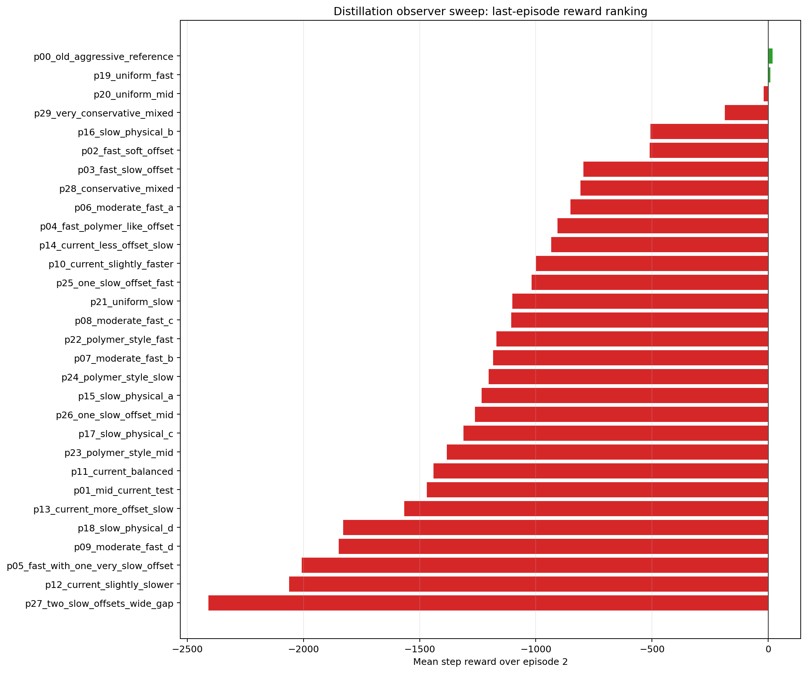
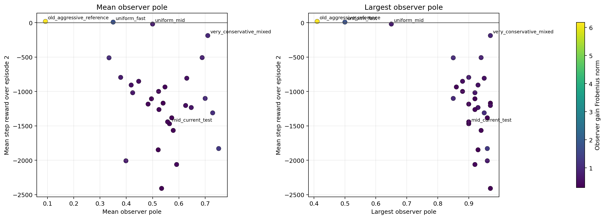
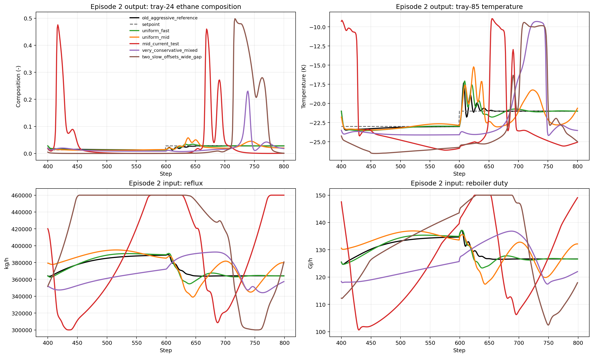

# Distillation Observer Pole Sweep, 2026-04-28

Date: 2026-04-28

This report analyzes the temporary distillation offset-free MPC observer sweep run stored under:

- `Distillation/Results/observer_pole_sweep_temp/20260428_010057/observer_pole_sweep_summary.csv`
- `Distillation/Data/observer_pole_sweep_temp/20260428_010057/*.pickle`

The experiment goal was narrow: test whether making the observer more steady helps the nominal distillation baseline MPC run.

## Setup

- notebook: `distillation_MPCOffsetFree_observer_pole_sweep_temp.ipynb`
- run mode: `nominal`
- disturbance profile: `none`
- episodes: `2`
- comparison metric: mean step reward over the second episode

This is a temporary nominal-only observer study. It does **not** say which observer is best for disturbance rejection yet.

## Headline Result

The observer sweep does **not** support the assumption that a steadier observer helps this baseline.

The best result is still the old aggressive reference:

- `p00_old_aggressive_reference`
- poles: `[0.0115, 0.0320, 0.0350, 0.0410, 0.0419, 0.0748, 0.4104]`
- last-episode mean reward: `+18.1192`

The only other clearly usable candidate is:

- `p19_uniform_fast`
- poles: `[0.20, 0.25, 0.30, 0.35, 0.40, 0.45, 0.50]`
- last-episode mean reward: `+8.7685`

Your current mid test is not competitive:

- `p01_mid_current_test`
- poles: `[0.35, 0.40, 0.45, 0.50, 0.55, 0.80, 0.90]`
- last-episode mean reward: `-1469.1401`

So the main conclusion is simple:

- making the observer much steadier did **not** improve the nominal baseline
- in most cases it made the controller much worse
- the good region is still on the aggressive-to-fast side, not the slow side

## Ranking

Top candidates by second-episode reward:

| Rank | Label | Last-episode mean reward | Mean pole | Max pole | Gain Fro norm |
|---|---|---:|---:|---:|---:|
| 1 | `p00_old_aggressive_reference` | `+18.1192` | `0.0924` | `0.4104` | `6.1833` |
| 2 | `p19_uniform_fast` | `+8.7685` | `0.3500` | `0.5000` | `1.7937` |
| 3 | `p20_uniform_mid` | `-20.1236` | `0.5000` | `0.6500` | `0.7761` |
| 4 | `p29_very_conservative_mixed` | `-187.2627` | `0.7100` | `0.9700` | `0.9564` |
| 5 | `p16_slow_physical_b` | `-507.5653` | `0.6886` | `0.9400` | `0.8517` |

Worst candidates:

| Label | Last-episode mean reward | Mean pole | Max pole |
|---|---:|---:|---:|
| `p27_two_slow_offsets_wide_gap` | `-2408.2415` | `0.5343` | `0.9700` |
| `p12_current_slightly_slower` | `-2060.8281` | `0.5914` | `0.9200` |
| `p05_fast_with_one_very_slow_offset` | `-2007.2579` | `0.3986` | `0.9600` |
| `p09_moderate_fast_d` | `-1847.5834` | `0.5214` | `0.9300` |
| `p18_slow_physical_d` | `-1829.1384` | `0.7500` | `0.9600` |

Two things stand out:

1. `p00` is not just the best. It is much better than the rest.
2. Once the observer poles move into the slower `0.5+` region, performance usually collapses.

## What "Steadier" Did

The reward trends support the same conclusion:

- correlation between last-episode reward and **largest pole**: about `-0.64`
- correlation between last-episode reward and **mean pole**: about `-0.35`

So, in this sweep:

- larger/slower poles generally mean worse reward
- slower observers are not stabilizing the closed loop
- they are usually under-correcting the estimator and degrading tracking

An important side result is that **smaller observer gain norm is not a good selection rule** here.

- correlation between reward and observer gain Frobenius norm: about `+0.48`

That matters because it rejects a tempting but weak heuristic:

- "smaller `L` must be safer"

That is not what this system did. The best candidate, `p00`, has by far the largest gain norm in the sweep and still gives the best closed-loop result.

## Representative Candidates

The table below shows the candidates that matter most for interpretation.

| Label | Last-episode mean reward | Output-1 MAE | Output-2 MAE | Reflux upper sat frac | Reboiler upper sat frac | Mean pole | Max pole |
|---|---:|---:|---:|---:|---:|---:|---:|
| `p00_old_aggressive_reference` | `+18.1192` | `0.0028` | `0.0105` | `0.0000` | `0.0000` | `0.0924` | `0.4104` |
| `p19_uniform_fast` | `+8.7685` | `0.0028` | `0.0197` | `0.0000` | `0.0000` | `0.3500` | `0.5000` |
| `p20_uniform_mid` | `-20.1236` | `0.0088` | `0.0558` | `0.0000` | `0.0000` | `0.5000` | `0.6500` |
| `p29_very_conservative_mixed` | `-187.2627` | `0.0240` | `0.1427` | `0.0000` | `0.0000` | `0.7100` | `0.9700` |
| `p01_mid_current_test` | `-1469.1401` | `0.0875` | `0.2259` | `0.2113` | `0.1150` | `0.5643` | `0.9000` |
| `p27_two_slow_offsets_wide_gap` | `-2408.2415` | `0.1164` | `0.2229` | `0.4288` | `0.1525` | `0.5343` | `0.9700` |

This is the cleanest way to read the sweep:

- `p00` tracks well and avoids saturation
- `p19` is weaker than `p00`, but still usable
- `p20` already crosses into clearly worse behavior
- `p01` and `p27` are not just mediocre; they are bad enough to drive the plant into frequent upper-bound action saturation

So the assumption “make the observer steadier” failed in exactly the direction you were worried about: the controller becomes slower to correct, the outputs drift harder, and the manipulated inputs spend more time on the bounds.

## Representative Episode-2 Trajectories

The representative trajectories make the failure mode more concrete:

- `p00_old_aggressive_reference`
  - stays close to both setpoints
  - no visible input saturation problem
- `p19_uniform_fast`
  - still tracks acceptably
  - slightly looser than `p00`, but still in the same qualitative regime
- `p20_uniform_mid`
  - already starts to drift enough that reward turns negative
- `p01_mid_current_test`
  - large composition excursion
  - large temperature excursion
  - both manipulated inputs hit the physical bounds often enough to dominate reward
- `p27_two_slow_offsets_wide_gap`
  - full collapse case
  - severe output excursion and heavy bound-hitting

So the current test family around `0.35` to `0.90` is not a mild improvement on `p00`. It is a different and much worse observer regime.

## What This Means

The nominal distillation baseline currently supports the following:

1. Do **not** continue the search in the direction "steadier observer."
2. Keep `p00_old_aggressive_reference` as the current nominal baseline reference.
3. If you want a second candidate family, `p19_uniform_fast` is the only good slower alternative from this sweep.
4. Treat `p20_uniform_mid` as the rough threshold where the observer has already become too slow for this baseline.

The important boundary from this sweep is:

- **good region:** aggressive to fast, with largest pole around `0.41` to `0.50`
- **bad region:** many candidates with largest pole `0.65+`, especially when the mean pole is also high

## Next Step

The next step should be a **narrow refinement sweep**, not another wide conceptual sweep.

Recommended order:

1. Keep `p00_old_aggressive_reference` as the reference.
2. Build a short shortlist around:
   - `p00_old_aggressive_reference`
   - `p19_uniform_fast`
   - a few intermediate fast candidates between them
3. Avoid spending more time on:
   - the `p01` current-test family
   - conservative or two-slow-offset families
   - large-pole candidates with max pole above about `0.65`
4. Once the shortlist is stable in nominal mode, rerun only that shortlist under disturbance.

A practical shortlist for the next sweep would be:

- `p00_old_aggressive_reference`
- `p19_uniform_fast`
- a new candidate between them with max pole around `0.45`
- a new candidate between them with max pole around `0.55`

That is the right next question now:

- not "can a steadier observer help?"
- but "how much can we relax the aggressive observer before the nominal baseline starts to deteriorate?"

## Artifacts

Generated analysis artifacts:

- `report/figures/distillation_observer_pole_sweep_20260428/observer_sweep_reward_ranking.png`
- `report/figures/distillation_observer_pole_sweep_20260428/observer_sweep_reward_vs_poles.png`
- `report/figures/distillation_observer_pole_sweep_20260428/observer_sweep_selected_outputs_inputs.png`
- `report/figures/distillation_observer_pole_sweep_20260428/observer_sweep_top10.csv`
- `report/figures/distillation_observer_pole_sweep_20260428/observer_sweep_bottom10.csv`
- `report/figures/distillation_observer_pole_sweep_20260428/observer_sweep_selected_candidates.csv`
