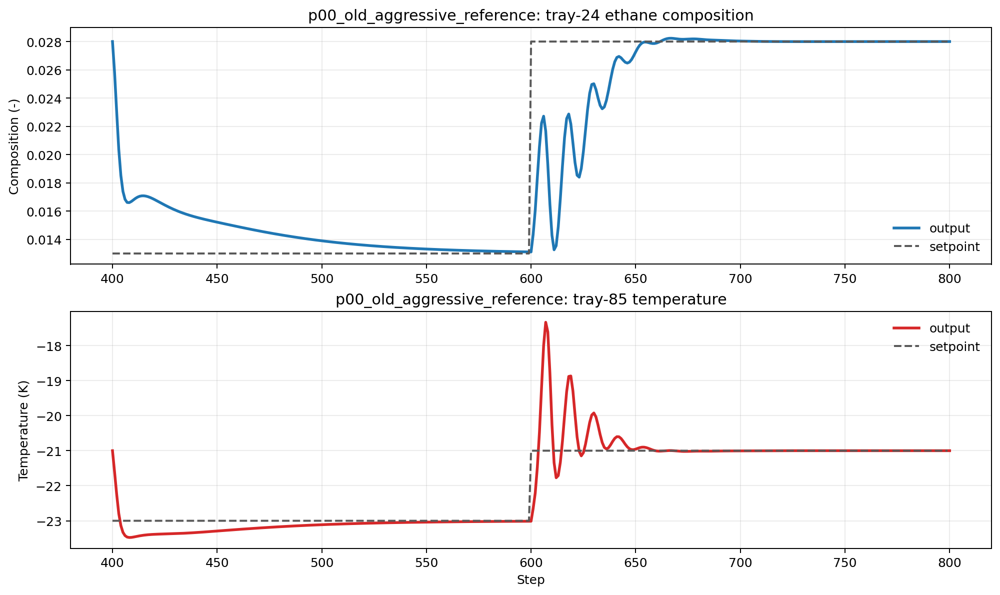
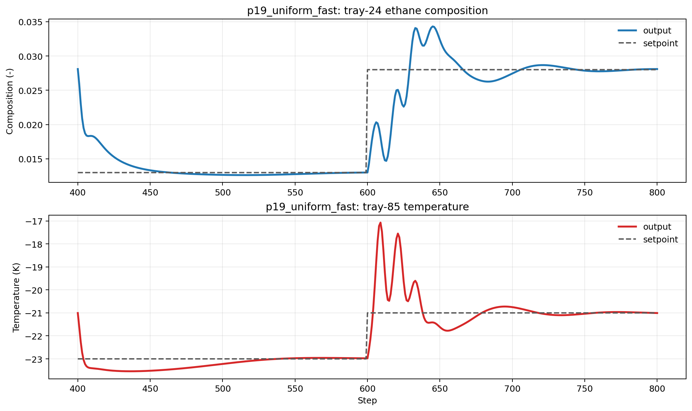
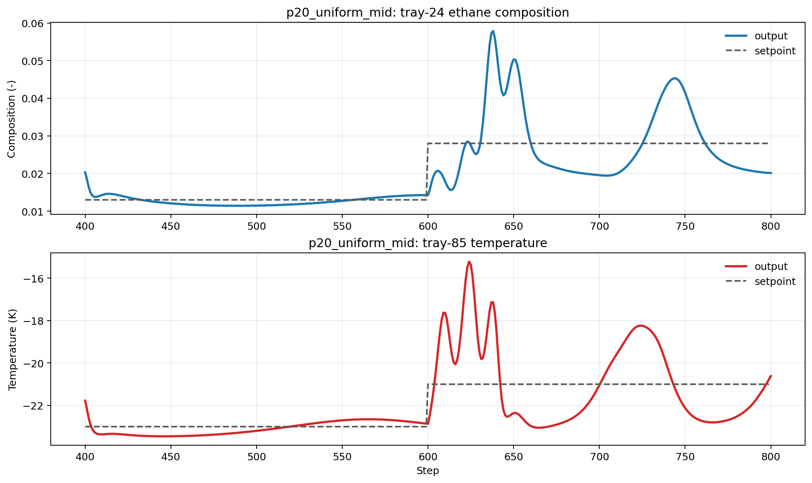
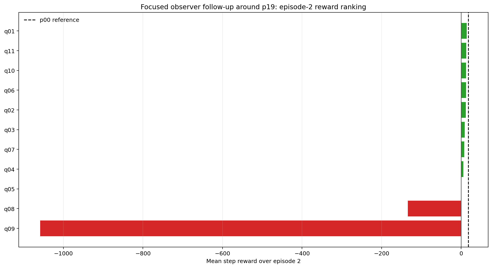
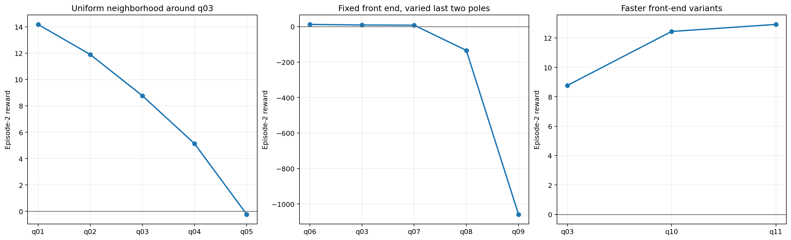
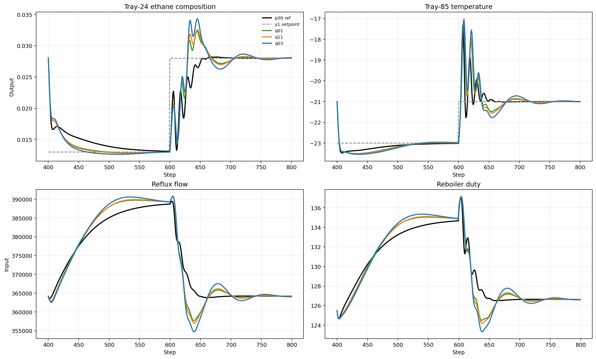

# Distillation Observer Pole Sweep, 2026-04-28

Date: 2026-04-28

This report analyzes the temporary distillation offset-free MPC observer sweep run stored under:

- `Distillation/Results/observer_pole_sweep_temp/20260428_010057/observer_pole_sweep_summary.csv`
- `Distillation/Data/observer_pole_sweep_temp/20260428_010057/*.pickle`

The experiment goal was narrow: test whether making the observer more steady helps the nominal distillation baseline MPC run.

## Setup

- notebook: `distillation_MPCOffsetFree_observer_pole_sweep_temp.ipynb`
- run mode: `nominal`
- disturbance profile: `none`
- episodes: `2`
- comparison metric: mean step reward over the second episode

This is a temporary nominal-only observer study. It does **not** say which observer is best for disturbance rejection yet.

Update: this report now covers two temporary nominal sweeps from 2026-04-28:

- the original broad conceptual sweep: `20260428_010057`
- the focused `p19` follow-up sweep: `20260428_141210`

The first sweep answered the question "does making the observer much steadier help?" The second sweep answered the narrower question "is there a better local neighborhood around `p19_uniform_fast`?"

## Headline Result

The observer sweep does **not** support the assumption that a steadier observer helps this baseline.

The best result is still the old aggressive reference:

- `p00_old_aggressive_reference`
- poles: `[0.0115, 0.0320, 0.0350, 0.0410, 0.0419, 0.0748, 0.4104]`
- last-episode mean reward: `+18.1192`

The only other clearly usable candidate is:

- `p19_uniform_fast`
- poles: `[0.20, 0.25, 0.30, 0.35, 0.40, 0.45, 0.50]`
- last-episode mean reward: `+8.7685`

Your current mid test is not competitive:

- `p01_mid_current_test`
- poles: `[0.35, 0.40, 0.45, 0.50, 0.55, 0.80, 0.90]`
- last-episode mean reward: `-1469.1401`

So the main conclusion is simple:

- making the observer much steadier did **not** improve the nominal baseline
- in most cases it made the controller much worse
- the good region is still on the aggressive-to-fast side, not the slow side

## Ranking

Top candidates by second-episode reward:

| Rank | Label | Last-episode mean reward | Mean pole | Max pole | Gain Fro norm |
|---|---|---:|---:|---:|---:|
| 1 | `p00_old_aggressive_reference` | `+18.1192` | `0.0924` | `0.4104` | `6.1833` |
| 2 | `p19_uniform_fast` | `+8.7685` | `0.3500` | `0.5000` | `1.7937` |
| 3 | `p20_uniform_mid` | `-20.1236` | `0.5000` | `0.6500` | `0.7761` |
| 4 | `p29_very_conservative_mixed` | `-187.2627` | `0.7100` | `0.9700` | `0.9564` |
| 5 | `p16_slow_physical_b` | `-507.5653` | `0.6886` | `0.9400` | `0.8517` |

Worst candidates:

| Label | Last-episode mean reward | Mean pole | Max pole |
|---|---:|---:|---:|
| `p27_two_slow_offsets_wide_gap` | `-2408.2415` | `0.5343` | `0.9700` |
| `p12_current_slightly_slower` | `-2060.8281` | `0.5914` | `0.9200` |
| `p05_fast_with_one_very_slow_offset` | `-2007.2579` | `0.3986` | `0.9600` |
| `p09_moderate_fast_d` | `-1847.5834` | `0.5214` | `0.9300` |
| `p18_slow_physical_d` | `-1829.1384` | `0.7500` | `0.9600` |

Two things stand out:

1. `p00` is not just the best. It is much better than the rest.
2. Once the observer poles move into the slower `0.5+` region, performance usually collapses.

## What "Steadier" Did

The reward trends support the same conclusion:

- correlation between last-episode reward and **largest pole**: about `-0.64`
- correlation between last-episode reward and **mean pole**: about `-0.35`

So, in this sweep:

- larger/slower poles generally mean worse reward
- slower observers are not stabilizing the closed loop
- they are usually under-correcting the estimator and degrading tracking

An important side result is that **smaller observer gain norm is not a good selection rule** here.

- correlation between reward and observer gain Frobenius norm: about `+0.48`

That matters because it rejects a tempting but weak heuristic:

- "smaller `L` must be safer"

That is not what this system did. The best candidate, `p00`, has by far the largest gain norm in the sweep and still gives the best closed-loop result.

## Representative Candidates

The table below shows the candidates that matter most for interpretation.

| Label | Last-episode mean reward | Output-1 MAE | Output-2 MAE | Reflux upper sat frac | Reboiler upper sat frac | Mean pole | Max pole |
|---|---:|---:|---:|---:|---:|---:|---:|
| `p00_old_aggressive_reference` | `+18.1192` | `0.0028` | `0.0105` | `0.0000` | `0.0000` | `0.0924` | `0.4104` |
| `p19_uniform_fast` | `+8.7685` | `0.0028` | `0.0197` | `0.0000` | `0.0000` | `0.3500` | `0.5000` |
| `p20_uniform_mid` | `-20.1236` | `0.0088` | `0.0558` | `0.0000` | `0.0000` | `0.5000` | `0.6500` |
| `p29_very_conservative_mixed` | `-187.2627` | `0.0240` | `0.1427` | `0.0000` | `0.0000` | `0.7100` | `0.9700` |
| `p01_mid_current_test` | `-1469.1401` | `0.0875` | `0.2259` | `0.2113` | `0.1150` | `0.5643` | `0.9000` |
| `p27_two_slow_offsets_wide_gap` | `-2408.2415` | `0.1164` | `0.2229` | `0.4288` | `0.1525` | `0.5343` | `0.9700` |

This is the cleanest way to read the sweep:

- `p00` tracks well and avoids saturation
- `p19` is weaker than `p00`, but still usable
- `p20` already crosses into clearly worse behavior
- `p01` and `p27` are not just mediocre; they are bad enough to drive the plant into frequent upper-bound action saturation

So the assumption "make the observer steadier" failed in exactly the direction you were worried about: the controller becomes slower to correct, the outputs drift harder, and the manipulated inputs spend more time on the bounds.

## Individual Output Tracking Review

The overlaid trajectory figure is useful for ranking, but the three most relevant candidates are easier to inspect one at a time:

- the current old aggressive observer (`p00`)
- the best slower alternative (`p19`)
- the next-best slower alternative (`p20`)

These are the three output-tracking views to review directly.

| Candidate | Episode-2 reward | Tray-24 composition MAE | Tray-85 temperature MAE |
| --- | ---: | ---: | ---: |
| `p00_old_aggressive_reference` | `+18.1192` | `0.0028` | `0.0105` |
| `p19_uniform_fast` | `+8.7685` | `0.0028` | `0.0197` |
| `p20_uniform_mid` | `-20.1236` | `0.0088` | `0.0558` |

This table matches what the plots show: `p00` is still the cleanest tracker, `p19` is the only slower alternative that stays reasonably close, and `p20` is already outside the good regime.

### `p00_old_aggressive_reference`

This is still the clean nominal reference:

- both outputs stay close to the setpoint changes
- the composition response is tight
- the tray-85 temperature follows without visible drift

### `p19_uniform_fast`

This is the only slower family member that still looks usable:

- composition tracking is still close to the setpoint
- temperature tracking is looser than `p00`, but still acceptable
- the gap from `p00` is visible, but it stays in the same qualitative regime

### `p20_uniform_mid`

This is the practical boundary case:

- it is not a full collapse like `p01` or `p27`
- but the outputs already drift enough that the reward turns negative
- this is where the observer has become too slow to keep the nominal baseline in the good regime

So if you want to visually review the observer-space transition, the clean sequence is:

1. `p00`: strong baseline
2. `p19`: slower, but still usable
3. `p20`: already too slow

## Representative Episode-2 Trajectories

The representative trajectories make the failure mode more concrete:

- `p00_old_aggressive_reference`
  - stays close to both setpoints
  - no visible input saturation problem
- `p19_uniform_fast`
  - still tracks acceptably
  - slightly looser than `p00`, but still in the same qualitative regime
- `p20_uniform_mid`
  - already starts to drift enough that reward turns negative
- `p01_mid_current_test`
  - large composition excursion
  - large temperature excursion
  - both manipulated inputs hit the physical bounds often enough to dominate reward
- `p27_two_slow_offsets_wide_gap`
  - full collapse case
  - severe output excursion and heavy bound-hitting

So the current test family around `0.35` to `0.90` is not a mild improvement on `p00`. It is a different and much worse observer regime.

## What This Means

The nominal distillation baseline currently supports the following:

1. Do **not** continue the search in the direction "steadier observer."
2. Keep `p00_old_aggressive_reference` as the current nominal baseline reference.
3. If you want a second candidate family, `p19_uniform_fast` is the only good slower alternative from this sweep.
4. Treat `p20_uniform_mid` as the rough threshold where the observer has already become too slow for this baseline.

The important boundary from this sweep is:

- **good region:** aggressive to fast, with largest pole around `0.41` to `0.50`
- **bad region:** many candidates with largest pole `0.65+`, especially when the mean pole is also high

## Next Step

The next step should be a **narrow refinement sweep**, not another wide conceptual sweep.

Recommended order:

1. Keep `p00_old_aggressive_reference` as the reference.
2. Build a short shortlist around:
   - `p00_old_aggressive_reference`
   - `p19_uniform_fast`
   - a few intermediate fast candidates between them
3. Avoid spending more time on:
   - the `p01` current-test family
   - conservative or two-slow-offset families
   - large-pole candidates with max pole above about `0.65`
4. Once the shortlist is stable in nominal mode, rerun only that shortlist under disturbance.

A practical shortlist for the next sweep would be:

- `p00_old_aggressive_reference`
- `p19_uniform_fast`
- a new candidate between them with max pole around `0.45`
- a new candidate between them with max pole around `0.55`

That is the right next question now:

- not "can a steadier observer help?"
- but "how much can we relax the aggressive observer before the nominal baseline starts to deteriorate?"

## Focused Follow-Up Sweep Around `p19`

The latest sweep reran the same temporary nominal baseline, but replaced the broad candidate list with a short follow-up family centered on `p19_uniform_fast`.

This follow-up run is stored under:

- `Distillation/Results/observer_pole_sweep_temp/20260428_141210/observer_pole_sweep_summary.csv`
- `Distillation/Data/observer_pole_sweep_temp/20260428_141210/*.pickle`

The follow-up question was narrower than the first sweep:

- is `p19` sitting in a good local neighborhood?
- can we move slightly faster than `p19` and recover more of the old aggressive observer performance?
- are the last two poles the sensitive part of that neighborhood?

### Headline Result

Yes. The focused sweep found several candidates that are **clearly better than `p19_uniform_fast`**, but still **do not beat `p00_old_aggressive_reference`**.

The best follow-up candidate is:

- `q01_uniform_fast_minus_04`
- poles: `[0.16, 0.21, 0.26, 0.31, 0.36, 0.41, 0.46]`
- last-episode mean reward: `+14.1764`

The next two best are:

- `q11_front_faster_b`
  - poles: `[0.12, 0.18, 0.24, 0.30, 0.36, 0.45, 0.55]`
  - last-episode mean reward: `+12.9200`
- `q10_front_faster_a`
  - poles: `[0.15, 0.20, 0.25, 0.30, 0.35, 0.45, 0.55]`
  - last-episode mean reward: `+12.4427`

The main interpretation is:

- the `p19` neighborhood is real and useful;
- moving **slightly faster** than `p19` helps;
- but the best local follow-up (`q01`) still remains below `p00` by about `3.94` reward units in episode 2.

So the original broad-sweep conclusion still holds: the good region is on the aggressive-to-fast side. The new follow-up just narrows that region much more precisely.

### Follow-Up Ranking

Top follow-up candidates by second-episode reward:

| Rank | Label | Last-episode mean reward | Output-1 MAE | Output-2 MAE |
|---|---|---:|---:|---:|
| 1 | `q01_uniform_fast_minus_04` | `+14.1764` | `0.0024` | `0.0157` |
| 2 | `q11_front_faster_b` | `+12.9200` | `0.0025` | `0.0171` |
| 3 | `q10_front_faster_a` | `+12.4427` | `0.0025` | `0.0174` |
| 4 | `q06_tail_faster` | `+12.0574` | `0.0026` | `0.0171` |
| 5 | `q02_uniform_fast_minus_02` | `+11.8952` | `0.0026` | `0.0174` |

Reference points:

| Label | Last-episode mean reward |
|---|---:|
| `p00_old_aggressive_reference` | `+18.1192` |
| `q03_uniform_fast_center` (`p19`) | `+8.7685` |
| `q05_uniform_fast_plus_04` | `-0.2288` |
| `q08_tail_slower` | `-134.3498` |
| `q09_tail_slowest` | `-1058.4610` |

This is the clean ranking picture:

- `q01` is the best local refinement;
- `q10`, `q11`, and `q06` are all good enough to confirm that the fast neighborhood is stable;
- once the sweep moves slower than the `p19` center, performance degrades quickly;
- once the last two poles are slowed enough, the baseline collapses again.

### What The Follow-Up Sweep Learned

The family trends answer the design questions directly.

#### 1. Uniform neighborhood around `p19`

The uniform family is monotone in the expected direction:

- `q01`: `+14.1764`
- `q02`: `+11.8952`
- `q03` (`p19`): `+8.7685`
- `q04`: `+5.1326`
- `q05`: `-0.2288`

So, in this neighborhood:

- moving a little **faster** than `p19` helps;
- moving a little **slower** than `p19` hurts;
- the sign change is already visible by `q05`.

That means `p19` was not the local optimum. It was already sitting on the **slow side** of the useful local region.

#### 2. Varying only the last two poles

Keeping the first five poles fixed and changing only the last two gives a very sharp result:

- `q06_tail_faster`: `+12.0574`
- `q03_uniform_fast_center`: `+8.7685`
- `q07_tail_mid`: `+7.6173`
- `q08_tail_slower`: `-134.3498`
- `q09_tail_slowest`: `-1058.4610`

So the last two poles matter a lot:

- modestly faster tail poles help;
- slightly slower tails are already harmful;
- much slower tails are catastrophic.

This is the strongest structural result in the follow-up sweep. It says the observer's slowest modes are still a critical performance bottleneck, even when the front end is held fixed.

#### 3. Faster front-end variants

The faster front-end family also helps:

- `q10_front_faster_a`: `+12.4427`
- `q11_front_faster_b`: `+12.9200`

So there is more than one way to improve on `p19`:

- make the whole uniform set slightly faster (`q01`, `q02`);
- or keep a moderate tail and make the front-end poles faster (`q10`, `q11`).

The best result still comes from `q01`, which suggests that the cleanest next refinement should stay close to that uniform-fast neighborhood rather than moving immediately toward a more mixed pole structure.

### Tracking Comparison

The trajectory comparison shows the improvement path clearly:

- `p00_old_aggressive_reference`
  - still tracks best overall
  - still has the cleanest temperature regulation
- `q01_uniform_fast_minus_04`
  - clearly better than `q03`
  - composition remains tight
  - temperature stays much closer to the setpoint than `q03`
- `q11_front_faster_b`
  - also clearly better than `q03`
  - similar qualitative regime to `q01`, but slightly weaker
- `q03_uniform_fast_center`
  - still usable
  - but visibly looser than `q01` and `q11`

So the follow-up sweep does not overturn the original observer conclusion. It sharpens it:

- `p00` is still the best nominal reference;
- `p19` was a good direction, but not the best point in that direction;
- the useful local neighborhood is a bit faster than `p19`, not slower.

### Updated Recommendation

The report recommendation should now change from "keep `p19` as the slower alternative" to:

1. Keep `p00_old_aggressive_reference` as the nominal baseline reference.
2. Replace `p19_uniform_fast` with **`q01_uniform_fast_minus_04`** as the best slower / smoother alternative found so far.
3. Keep **`q11_front_faster_b`** and **`q10_front_faster_a`** as the next backup candidates.
4. Stop exploring slower tails such as `q08` and `q09`.
5. If another refinement sweep is run, center it around:
   - `q01_uniform_fast_minus_04`
   - `q11_front_faster_b`
   - `q10_front_faster_a`
   - a small number of candidates between `q01` and `p00`

So the next question is now narrower than before:

- not "is `p19` good?"
- and not "does a steadier observer help?"
- but "how close can we move toward `p00` while keeping the smoother behavior of the best fast-local candidates?"

## Artifacts

Generated analysis artifacts:

- `report/figures/distillation_observer_pole_sweep_20260428/observer_sweep_reward_ranking.png`
- `report/figures/distillation_observer_pole_sweep_20260428/observer_sweep_reward_vs_poles.png`
- `report/figures/distillation_observer_pole_sweep_20260428/observer_sweep_selected_outputs_inputs.png`
- `report/figures/distillation_observer_pole_sweep_20260428/observer_sweep_top10.csv`
- `report/figures/distillation_observer_pole_sweep_20260428/observer_sweep_bottom10.csv`
- `report/figures/distillation_observer_pole_sweep_20260428/observer_sweep_selected_candidates.csv`

Follow-up sweep artifacts:

- `report/figures/distillation_observer_followup_20260428/observer_followup_reward_ranking.png`
- `report/figures/distillation_observer_followup_20260428/observer_followup_family_reward_trends.png`
- `report/figures/distillation_observer_followup_20260428/observer_followup_selected_outputs_inputs.png`
- `report/figures/distillation_observer_followup_20260428/observer_followup_ranked_summary.csv`
- `report/figures/distillation_observer_followup_20260428/observer_followup_selected_candidates.csv`
