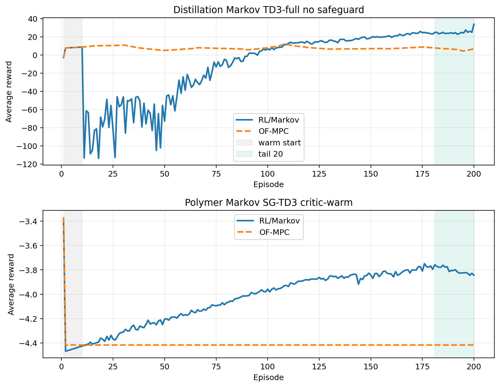
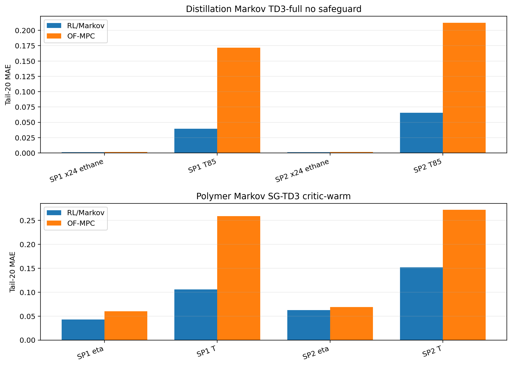
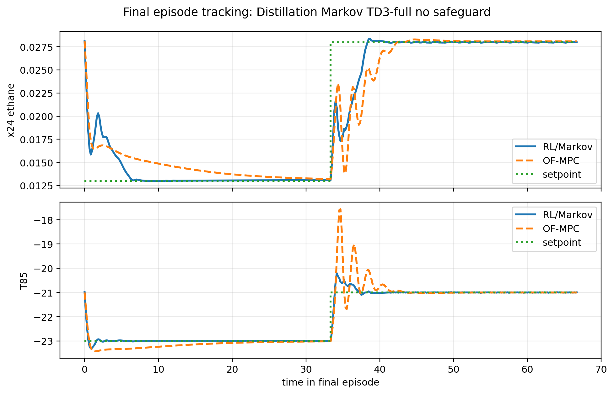
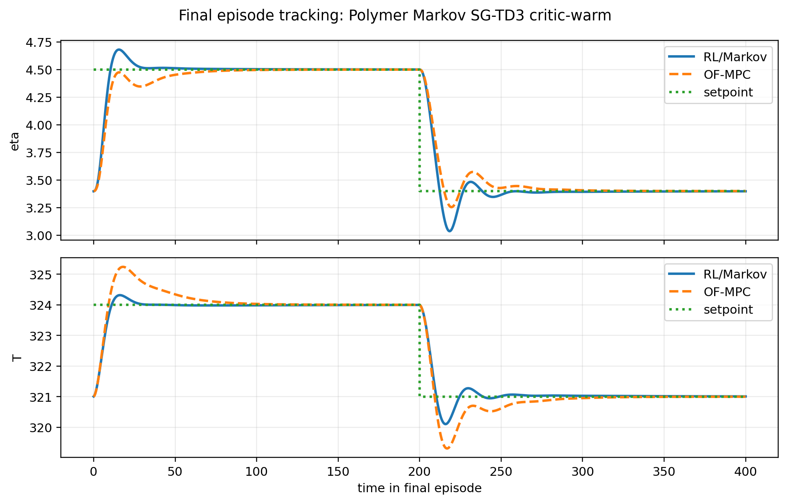
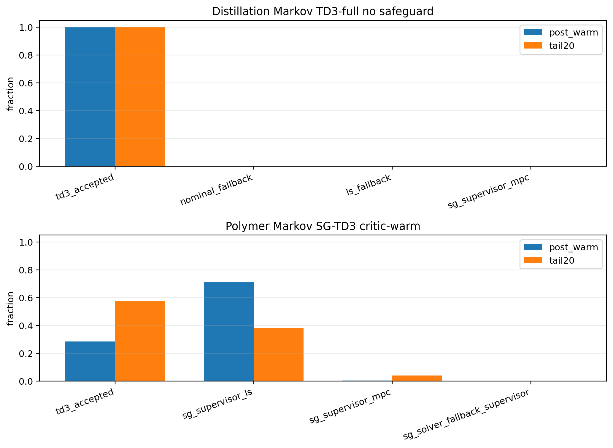
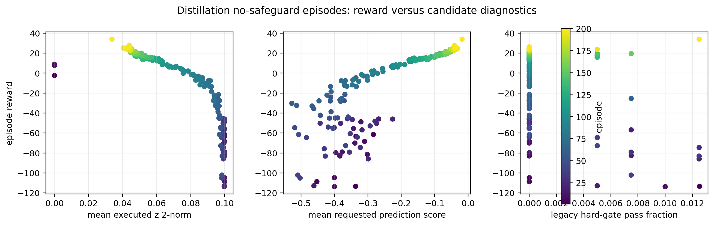

# Distillation Markov TD3-Full And Polymer Markov SG-TD3 Outcome Analysis

Date: 2026-06-02  
Result date: 2026-06-01  
Case studies: Aspen C2 splitter distillation column and polymer CSTR  
Scenario: disturbed runs, with distillation `disturbance_profile = "fluctuation"`

## Objective

This report analyzes the two latest Markov runs requested:

- Distillation Markov with full TD3 execution and no live safeguard:
  `Distillation/Results/distillation_markov_td3_disturb_fluctuation_td3_only_no_safeguard_current_reward_unified/20260601_214256/input_data.pkl`
- Polymer Markov SG-TD3 with critic-warm release and LS-or-MPC supervisor:
  `Polymer/Results/sg_td3_markov_critic_warm3_ls_else_mpc_shadow_disturb/20260601_215126/input_data.pkl`

The question is whether the outcomes support applying the polymer-style supervisor-gated TD3 idea to the distillation Markov controller.

Short answer:

The evidence supports trying SG-TD3 on distillation, but as a release-and-selection layer, not as the old hard safety gate. The distillation TD3-full no-safeguard run proves that the learned Markov correction has large late upside. It also proves that unfiltered release is unsafe, with a worst post-warm episode reward of `-113.802`. The polymer SG-TD3 run shows the mechanism we want: the gate keeps the supervisor dominant early, then releases the actor more in the tail, improving OF-MPC without a comparable release collapse.

## Files Inspected

Implementation and configuration:

- `distillation_RL_assisted_MPC_markov_td3_only_no_safeguard_current_reward_unified.py`
- `RL_assisted_MPC_markov_supervisor_gated_td3_critic_warm_unified.py`
- `RL_assisted_MPC_markov_unified.py`
- `systems/distillation/notebook_params.py`
- `utils/markov_runner.py`
- `TD3Agent/supervisor_gated_agent.py`
- `TD3Agent/supervisor_replay_buffer.py`
- `utils/supervisor_gated_action.py`
- `utils/plotting_core.py`

Result bundles and baselines:

| Case | RL bundle | Compare bundle | OF-MPC baseline |
| --- | --- | --- | --- |
| Distillation | `Distillation/Results/distillation_markov_td3_disturb_fluctuation_td3_only_no_safeguard_current_reward_unified/20260601_214256/input_data.pkl` | `Distillation/Results/distillation_compare_markov_td3_disturb_fluctuation_td3_only_no_safeguard_current_reward/20260601_214316/input_data.pkl` | `Distillation/Data/mpc_results_disturb_fluctuation.pickle` |
| Polymer | `Polymer/Results/sg_td3_markov_critic_warm3_ls_else_mpc_shadow_disturb/20260601_215126/input_data.pkl` | `Polymer/Results/disturb_compare_sg_td3_markov_critic_warm3_ls_else_mpc_shadow/20260601_215148/input_data.pkl` | `Polymer/Data/mpc_results_dist.pickle` |

Prior local reports used for context:

- `report/distillation_markov_td3_only_family_2026_05_16.md`
- `report/distillation_markov_safety_layer_audit_2026_05_29.md`
- `report/polymer_sg_td3_weight_residual_latest_2026_06_01.md`

Generated analysis artifacts:

| Artifact | Purpose |
| --- | --- |
| `report/scripts/analyze_markov_distillation_polymer_sg_td3_20260602.py` | Reproducible analysis script |
| `report/figures/markov_distillation_polymer_sg_td3_20260602/reward_summary.csv` | Episode reward summary |
| `report/figures/markov_distillation_polymer_sg_td3_20260602/tracking_summary.csv` | Physical-unit tracking metrics |
| `report/figures/markov_distillation_polymer_sg_td3_20260602/blockwise_tracking_summary.csv` | Per-setpoint block tracking metrics |
| `report/figures/markov_distillation_polymer_sg_td3_20260602/action_source_summary.csv` | TD3, SG supervisor, and fallback source fractions |
| `report/figures/markov_distillation_polymer_sg_td3_20260602/diagnostic_summary.csv` | Markov candidate and shadow-safety diagnostics |
| `report/figures/markov_distillation_polymer_sg_td3_20260602/episode_diagnostics.csv` | Per-episode reward and candidate diagnostics |
| `report/figures/markov_distillation_polymer_sg_td3_20260602/analysis_summary.json` | Machine-readable source path and artifact summary |

## What The Current Methods Are Doing

Both runs keep the offset-free MPC as the inner controller and add a low-dimensional correction to the lifted Markov response matrix used by MPC.

The offset-free linear model is

$$ x_{\mathrm{aug},k+1}=A_{\mathrm{aug}}x_{\mathrm{aug},k}+B_{\mathrm{aug}}\Delta u_k,\qquad y_k=C_{\mathrm{aug}}x_{\mathrm{aug},k}. $$

The nominal MPC prediction matrix is built from Markov blocks. The assisted Markov controller perturbs those blocks with four input-output-pair coefficients:

$$ G(z_k)=G_0+\sum_{i=1}^{4} z_{i,k}G_i. $$

At each step, MPC solves the same constrained move problem, but using either `G0` or the corrected `G(z_k)`:

$$ U_k^\star(z)=\arg\min_U \sum_{j=1}^{N_p} e_{k+j}(z)^\top Qe_{k+j}(z)+\sum_{j=0}^{N_c-1}\Delta u_{k+j}^\top R\Delta u_{k+j}. $$

The TD3 actor produces a normalized action:

$$ a_{\theta,k}\in[-1,1]^4,\qquad z_{\theta,k}=z_{\max}a_{\theta,k}. $$

For the distillation no-safeguard run:

- `run_adaptive_ls = False`
- `run_rl_proposal = True`
- `rl_fallback_to_ls = False`
- `force_td3_execute = True`
- `force_td3_respects_warm_start = True`
- `z_bound = 0.05`
- live `z_safety`, TD3 priority fallback, and authority ramp are disabled
- shadow safety diagnostics are logged

So the first ten episodes use the nominal zero-Markov action, and after warm start TD3 is effectively forced through.

For the polymer SG-TD3 run:

- `agent_kind = "sg_td3"`
- `run_adaptive_ls = True`
- `markov_supervisor_mode = "ls_else_mpc"`
- `markov_live_safety_mode = "shadow_only"`
- `force_td3_execute = False`
- live Markov safety layers are disabled, but shadow diagnostics are kept
- behavioral cloning and BC handoff are disabled
- a 3-subepisode critic-warm/action-freeze window follows the ten warm-start episodes

The SG-TD3 gate scores the actor and supervisor candidates with a conservative twin-critic score:

$$ S(s,a)=\min(Q_1(s,a),Q_2(s,a))-\rho_Q\,\mathrm{gap}_Q(s,a)-\kappa_{\mathrm{sup}}\|a-a_{\mathrm{sup}}\|_2^2-\kappa_{\mathrm{prev}}\|a-a_{\mathrm{prev}}\|_2^2. $$

The actor is selected only when

$$ S(s_k,a_{\theta,k})>S(s_k,a_{\mathrm{sup},k})+\epsilon_A. $$

In the polymer Markov runner used here, `epsilon_A = 0`, `rho_Q = 0.5`, `kappa_sup = 0.02`, and `kappa_prev = 0.01`.

## Reward Outcome

| Case | Method | Mean reward | Worst post-warm | Worst episode | Worst first 20 post-warm | Tail-20 reward | Final reward |
| --- | --- | ---: | ---: | ---: | ---: | ---: | ---: |
| Distillation | RL | `-8.760` | `-113.802` | `18` | `-113.802` | `25.071` | `33.919` |
| Distillation | OF-MPC | `7.719` | `4.488` | `195` | `9.069` | `6.391` | `6.926` |
| Polymer | RL | `-4.025` | `-4.420` | `11` | `-4.420` | `-3.804` | `-3.844` |
| Polymer | OF-MPC | `-4.412` | `-4.418` | `159` | `-4.418` | `-4.417` | `-4.417` |

The distillation result is two-sided:

1. It is the strongest late Markov evidence in this pair. Tail-20 reward improves from `6.391` for OF-MPC to `25.071`, and final reward improves from `6.926` to `33.919`.
2. It has a severe release failure. The worst post-warm episode is `-113.802`, far below the OF-MPC worst post-warm episode of `4.488`.

The polymer SG-TD3 result is less dramatic but more controlled:

1. Tail-20 reward improves from `-4.417` to `-3.804`.
2. Final reward improves from `-4.417` to `-3.844`.
3. The worst post-warm episode is only `-4.420`, essentially comparable to OF-MPC. There is no distillation-style release crash.

This is the key contrast: distillation TD3-full has the larger asymptotic upside, while polymer SG-TD3 shows the release-control behavior that the distillation run is missing.

## Tracking Outcome

Tail metrics use the final 20 subepisodes. Errors are computed in the saved physical output coordinates, comparing the next plant output to the active setpoint.

| Case | Method | Output | Tail-20 MAE | Tail-20 RMSE | Mean abs scaled input move |
| --- | --- | --- | ---: | ---: | ---: |
| Distillation | RL | x24 ethane | `0.00109` | `0.00280` | `0.0065` |
| Distillation | RL | T85 | `0.05258` | `0.15194` | `0.0065` |
| Distillation | OF-MPC | x24 ethane | `0.00155` | `0.00308` | `0.0042` |
| Distillation | OF-MPC | T85 | `0.19209` | `0.47208` | `0.0042` |
| Polymer | RL | eta | `0.05281` | `0.18141` | `0.0145` |
| Polymer | RL | T | `0.12894` | `0.44669` | `0.0145` |
| Polymer | OF-MPC | eta | `0.06463` | `0.19170` | `0.0179` |
| Polymer | OF-MPC | T | `0.26538` | `0.56779` | `0.0179` |

Both Markov-assisted runs beat OF-MPC in tail tracking.

For distillation, the TD3-full Markov correction improves both outputs in the tail. The T85 tail MAE drops from `0.192` to `0.0526`, and the composition MAE drops from `0.00155` to `0.00109`. This is strong evidence that the learned Markov correction eventually becomes useful.

For polymer, SG-TD3 improves both outputs while using smaller mean scaled input movement than OF-MPC. Tail eta MAE drops from `0.0646` to `0.0528`, and tail temperature MAE drops from `0.265` to `0.129`.

### Blockwise Tail Tracking

| Case | Method | Block | Output | Tail-20 MAE | Tail-20 RMSE |
| --- | --- | --- | --- | ---: | ---: |
| Distillation | RL | SP1 | x24 ethane | `0.000952` | `0.00228` |
| Distillation | RL | SP1 | T85 | `0.0395` | `0.107` |
| Distillation | RL | SP2 | x24 ethane | `0.00124` | `0.00323` |
| Distillation | RL | SP2 | T85 | `0.0656` | `0.186` |
| Distillation | OF-MPC | SP1 | x24 ethane | `0.00151` | `0.00232` |
| Distillation | OF-MPC | SP1 | T85 | `0.172` | `0.251` |
| Distillation | OF-MPC | SP2 | x24 ethane | `0.00158` | `0.00368` |
| Distillation | OF-MPC | SP2 | T85 | `0.212` | `0.618` |
| Polymer | RL | SP1 | eta | `0.0430` | `0.168` |
| Polymer | RL | SP1 | T | `0.106` | `0.415` |
| Polymer | RL | SP2 | eta | `0.0626` | `0.194` |
| Polymer | RL | SP2 | T | `0.152` | `0.476` |
| Polymer | OF-MPC | SP1 | eta | `0.0601` | `0.183` |
| Polymer | OF-MPC | SP1 | T | `0.259` | `0.545` |
| Polymer | OF-MPC | SP2 | eta | `0.0691` | `0.200` |
| Polymer | OF-MPC | SP2 | T | `0.272` | `0.590` |

The old May 16 distillation TD3-only run had a first-block temperature tradeoff. The June 1 current-reward run no longer shows that weakness in the tail. Both SP1 and SP2 T85 MAE are better than OF-MPC in the final 20 episodes.

Final episode overlays show the same late behavior:

## Action Source And Gate Behavior

| Case | Window | Source | Fraction |
| --- | --- | --- | ---: |
| Distillation | Post-warm | TD3 accepted | `1.000` |
| Distillation | Tail 20 | TD3 accepted | `1.000` |
| Polymer | Post-warm | TD3 policy | `0.284` |
| Polymer | Post-warm | SG LS supervisor | `0.712` |
| Polymer | Post-warm | SG MPC supervisor | `0.004` |
| Polymer | Tail 20 | TD3 policy | `0.577` |
| Polymer | Tail 20 | SG LS supervisor | `0.382` |
| Polymer | Tail 20 | SG MPC supervisor | `0.041` |

The distillation run is a true TD3-full benchmark after warm start. That explains why it exposes both upside and risk.

The polymer run is not TD3-only. It is supervisor-gated:

- In the full post-warm period, the gate selects TD3 only `28.4%` of the time.
- In the tail, the gate selects TD3 `57.7%` of the time.
- The remaining tail steps are mostly LS supervisor steps, with a smaller MPC-supervisor fraction.

This is exactly the behavior that would be useful in distillation: keep a supervisor active during weak-critic or bad-candidate periods, then let the actor take over when the critic begins to prefer it.

The SG critic diagnostics support that interpretation:

| Case | Window | Diagnostic | Value |
| --- | --- | --- | ---: |
| Polymer | First 20 post-warm | SG advantage mean | `-14.618` |
| Polymer | First 20 post-warm | SG advantage q95 | `0.000` |
| Polymer | Tail 20 | SG advantage mean | `14.568` |
| Polymer | Tail 20 | SG advantage q95 | `56.922` |

In the first 20 post-warm episodes, the policy score is usually below the supervisor score, so the gate has a reason to keep the actor out. In the tail, the critic score reverses and the actor receives more authority.

## Markov Candidate Diagnostics

The distillation no-safeguard run shows why some live selection layer is needed.

| Case | Window | Diagnostic | Value |
| --- | --- | --- | ---: |
| Distillation | First 20 post-warm | Executed z 2-norm mean | `0.0998` |
| Distillation | First 20 post-warm | Executed z 2-norm q95 | `0.1000` |
| Distillation | First 20 post-warm | First-move diff from nominal mean | `0.0269` |
| Distillation | First 20 post-warm | Full-sequence diff from nominal mean | `0.0825` |
| Distillation | First 20 post-warm | Cost-guard pass fraction | `0.030` |
| Distillation | First 20 post-warm | Legacy hard-gate pass fraction | `0.0024` |
| Distillation | First 20 post-warm | Shadow z projection active | `0.9999` |
| Distillation | First 20 post-warm | Shadow z coordinate clip active | `0.9999` |
| Distillation | Tail 20 | Executed z 2-norm mean | `0.0429` |
| Distillation | Tail 20 | Executed z 2-norm q95 | `0.0964` |
| Distillation | Tail 20 | Cost-guard pass fraction | `0.012` |
| Distillation | Tail 20 | Legacy hard-gate pass fraction | `0.0015` |

The first 20 post-warm episodes are almost pinned at the maximum four-coordinate Markov radius. Shadow safety would project or clip nearly every requested action. The legacy hard gate would pass almost none of the candidates.

The tail is more subtle. The TD3 policy is useful in the tail even though the legacy hard-gate pass fraction is still only `0.0015`. This is why simply restoring the old hard gate would likely destroy the useful TD3 behavior.

The per-episode scatter makes the same point:

Episodes with large executed z norm and strongly negative prediction score are the bad release episodes. Later episodes move toward lower z norm, better prediction score, and higher reward. A good selection layer should reject early high-risk actions without making the late useful actor disappear.

## Main Interpretation

### Distillation TD3-full no-safeguard

Outcome: high upside, unsafe release.

The current-reward distillation Markov actor eventually becomes a very strong controller. Tail-20 tracking is better than OF-MPC on both composition and temperature, and the final episode reward is almost five times the OF-MPC final reward.

The problem is not late performance. The problem is release. The actor is forced through after warm start, and the result is a large collapse around the early post-warm episodes. During that collapse, the action norm is near its cap and almost every action would be touched by shadow z-safety. That is exactly the failure mode a supervisor-gated release should target.

### Polymer Markov SG-TD3

Outcome: moderate improvement, controlled release.

The polymer SG-TD3 run improves OF-MPC in tail reward and tail tracking while avoiding a large post-warm collapse. It does this by relying on the supervisor for most of the post-warm trajectory and gradually selecting the policy more often in the tail.

The improvement is not as spectacular as the distillation late reward improvement. But the mechanism is the one we need: do not force the actor when the critic score says the supervisor is safer.

### Would SG-TD3 Help Distillation?

Likely yes, but the expected benefit is specific:

SG-TD3 should help distillation by reducing the release crash while preserving some of the late TD3 upside. It should not be expected to improve the already-high final reward unless it can still select the actor frequently in the tail.

The positive evidence is:

- Distillation TD3-full has strong tail reward and tracking, so there is a valuable policy to preserve.
- Distillation TD3-full has a severe early post-warm collapse, so there is a real need for a selector.
- Polymer SG-TD3 shows that a critic gate can keep the supervisor dominant early and release the actor later.
- The polymer SG-TD3 tail policy fraction is `57.7%`, not zero, so the gate does not necessarily collapse to copy-paste MPC.

The caution is:

- The old distillation hard gate would reject almost all useful tail candidates. Tail legacy hard-gate pass is only `0.0015`.
- The BC release gate diagnostics in the no-safeguard run never pass, so using that gate as a live blocker would likely prevent release entirely.
- Markov corrections are more dangerous than weight or residual actions because they change the response model used by MPC. A critic gate helps, but it is not a proof of safety.
- These are single-seed runs.

Therefore the next distillation experiment should be TD3-first SG-TD3 with an LS-or-MPC supervisor, not a return to the old hard Markov gate.

## Bugs, Inconsistencies, And Risks Found

1. The Markov result bundle's plotting fields can be misleading for MPC comparison.
   The RL `input_data.pkl` includes `y_mpc` and `u_mpc` fields that mirror the RL trajectory in the Markov plotting bundle. For fair MPC comparison, the analysis must use the compare bundle for recomputed reward and the referenced baseline pickle for physical trajectories.

2. The distillation no-safeguard run records `td3_seed = None`.
   The result is useful, but the exact training trajectory is less reproducible than the polymer SG-TD3 run, which records `td3_seed = 7`.

3. The distillation metadata labels T85 as K while the saved output coordinate is negative.
   This report keeps the saved output coordinate and label name `T85`. Absolute temperature-unit claims should be treated carefully unless the distillation plant adapter's unit convention is rechecked.

4. Live safety was intentionally disabled in both runs.
   The distillation run logs shadow safety only. The polymer run also uses shadow-only Markov safety, but the SG-TD3 supervisor gate is live.

5. Single-seed evidence should not be treated as final algorithm ranking.
   The conclusions are strong for mechanism diagnosis and next-experiment design, but not yet for publication-level ranking.

## Literature And Prior-Report Connections

No new external citations were added in this pass. The interpretation is grounded in the local Markov reports already in the repo:

- The May 16 distillation Markov family review showed that TD3-only was the only branch with real online TD3 authority, while guarded and LS-only variants were nearly indistinguishable from nominal or fallback-heavy behavior.
- The May 29 distillation Markov safety audit concluded that magnitude clipping alone is not enough and that the old hard gate can erase TD3. The June 1 no-safeguard run reinforces both points.
- The June 1 polymer SG-TD3 weight/residual report showed the same general SG-TD3 pattern: the gate can improve OF-MPC while protecting steady or sensitive windows by selecting the supervisor.

The conceptual connection is to safe or supervised RL for process control: the critic should not be used only to improve reward, but also to decide when the learned action is credible relative to a stabilizing supervisor.

## Recommended Next Experiment

Create a distillation Markov SG-TD3 critic-warm wrapper analogous to `RL_assisted_MPC_markov_supervisor_gated_td3_critic_warm_unified.py`.

Recommended first-run configuration:

| Setting | Recommendation |
| --- | --- |
| Base runner | `distillation_RL_assisted_MPC_markov_unified.py` |
| New wrapper | `distillation_RL_assisted_MPC_markov_supervisor_gated_td3_critic_warm_unified.py` |
| Agent | `agent_kind = "sg_td3"` |
| Run mode | `run_mode = "disturb"`, `disturbance_profile = "fluctuation"` |
| Reward | keep the current high-temperature reward used by the June 1 no-safeguard run |
| z bound | start with `z_bound = 0.05` for comparability, but keep shadow z-safety active |
| Supervisor | `markov_supervisor_mode = "ls_else_mpc"` |
| Warm start | 10 episodes |
| Critic/action freeze | 3 subepisodes after warm start |
| Live hard Markov safety | disabled for first SG ablation, shadow only |
| Old BC release gate | diagnostic only or disabled as live blocker |
| Gate score | `rho_Q = 0.5`, `kappa_sup = 0.02`, `kappa_prev = 0.01`, `epsilon_A = 0.0` |
| Replay | store executed action with supervisor metadata |

Success criteria:

| Metric | Target |
| --- | ---: |
| Worst first 20 post-warm reward | better than `-30`, ideally above `-10` |
| Tail-20 reward | at least `20` |
| Final reward | at least `20` |
| Tail TD3 policy fraction | at least `0.30` |
| First 20 post-warm TD3 policy fraction | low during collapse-prone episodes |
| Tail T85 MAE | below `0.10` |
| Tail x24 ethane MAE | below `0.0015` |

Failure modes to watch:

- Copy-paste MPC failure: tail TD3 policy fraction below `0.10` and reward close to OF-MPC.
- Unsafe release failure: worst post-warm reward below `-30`.
- Over-trusting the critic: high TD3 policy fraction during episodes with poor prediction score and high z norm.
- Gate-score drift: policy chosen because both critic scores become unreliable rather than because policy value is genuinely better.

Figures to generate for the next run:

- reward curves versus OF-MPC with warm-start and tail shading
- final-episode tracking and first 20 post-warm tracking
- action-source fractions by episode
- SG score advantage versus episode reward
- z norm, prediction score, and first-move deviation versus episode reward
- tail blockwise MAE table against OF-MPC

## Remaining Uncertainty

The strongest remaining uncertainty is whether the distillation critic can learn a reliable action-selection score quickly enough. Polymer SG-TD3 worked because the critic score was negative for the policy during early risky periods and positive in the tail. Distillation needs the same pattern. If the critic overestimates the actor during the first post-warm episodes, SG-TD3 may still release bad Markov corrections. If the critic remains too conservative, SG-TD3 may become another near-nominal controller.

The current evidence says the experiment is worth running. It does not yet prove the distillation SG-TD3 result will dominate the no-safeguard tail. The realistic target is a better safety-performance compromise: keep most of the no-safeguard tail gain while removing the catastrophic early release.
