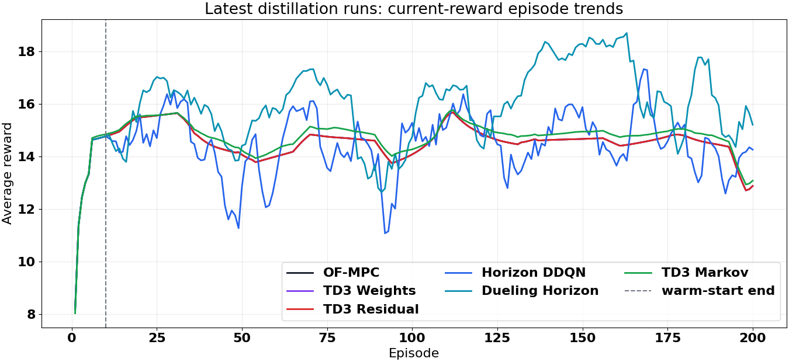
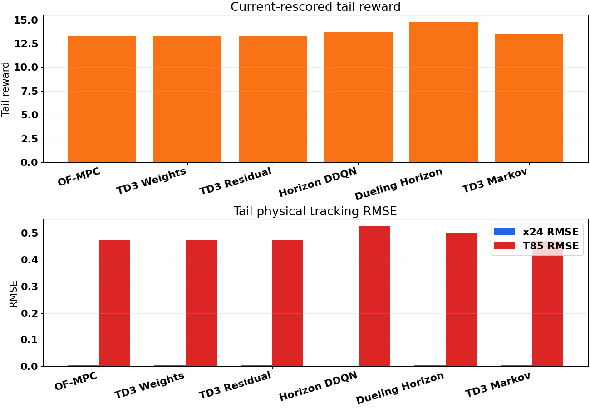
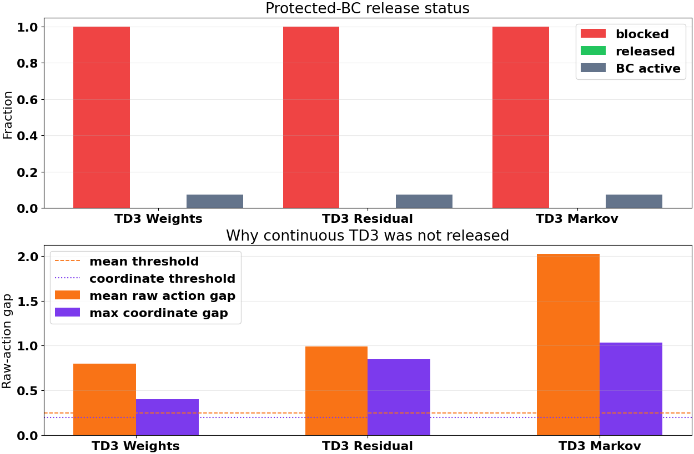
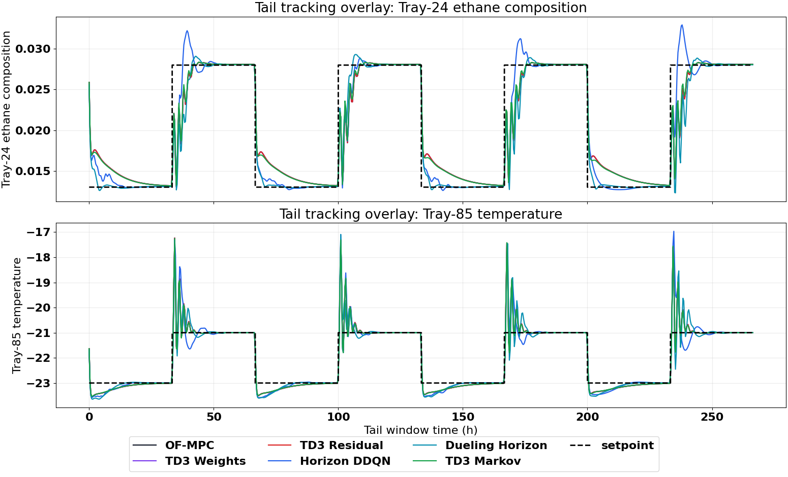
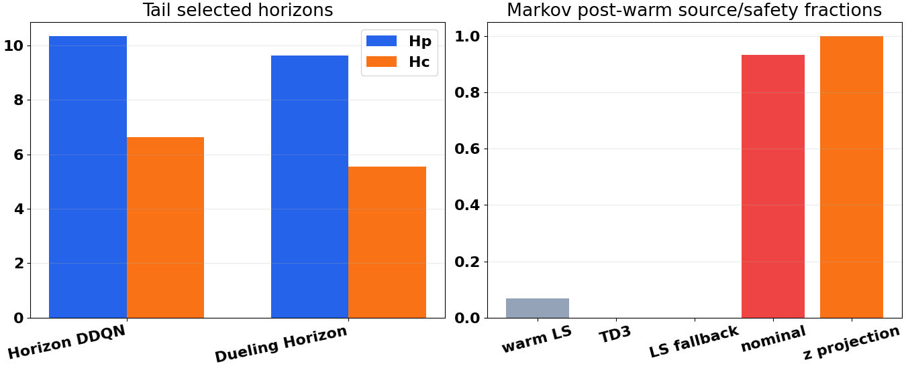

# Distillation Latest Family Runs: Protected-BC and TD3 Authority Audit

Date: 2026-05-23  
Case study: Aspen distillation column, disturbance profile `fluctuation`  
Runs analyzed: latest completed active distillation runs from 2026-05-22, excluding combined

## Executive Summary

The May 22 distillation batch is an important result, but the interpretation is more subtle than "TD3 worked." The safer conclusion is:

**The protected TD3 scaffolding worked as a safety mechanism, but the continuous TD3 actors did not meaningfully receive live authority in these runs.**

The evidence is direct from the saved logs. For TD3 weights, TD3 residual, and TD3 Markov, the protected-BC release gate never opened:

$$ \mathrm{release\_step} = -1, \qquad \mathrm{post\mbox{-}warm\ released\ fraction}=0. $$ 

This means:

- TD3 weights stayed at the nominal multiplier vector `[1, 1, 1, 1]`.
- TD3 residual stayed effectively at zero executed correction.
- TD3 Markov executed no post-warm TD3 source actions; its slight improvement came from nominal/LS/safety-projected behavior, not from live TD3 proposals.
- The horizon agents were the genuinely active learned policies in this batch. The dueling horizon run is the strongest overall run by tail reward and band-normalized tracking.

This is good news in one sense: the new protected-BC/safety layer prevented unstable TD3 behavior. But it also means the next step should focus less on generic reward/noise tuning and more on releasing useful continuous TD3 authority without reintroducing the old unsafe behavior.

## Files Inspected

Latest result bundles:

| Method | Result bundle |
|---|---|
| OF-MPC baseline | `Distillation/Data/mpc_results_disturb_fluctuation.pickle` |
| TD3 weights | `Distillation/Results/distillation_weights_td3_disturb_fluctuation_mismatch_unified/20260522_181031/input_data.pkl` |
| TD3 residual | `Distillation/Results/distillation_residual_td3_disturb_fluctuation_mismatch_rho_unified/20260522_180223/input_data.pkl` |
| Horizon DDQN | `Distillation/Results/distillation_horizon_disturb_fluctuation_mismatch_unified/20260522_183427/input_data.pkl` |
| Dueling horizon | `Distillation/Results/distillation_dueling_horizon_disturb_fluctuation_mismatch_unified/20260522_183355/input_data.pkl` |
| TD3 Markov | `Distillation/Results/distillation_markov_td3_disturb_fluctuation_unified/20260522_190448/input_data.pkl` |

Implementation/configuration context:

| File | Why inspected |
|---|---|
| `systems/distillation/config.py` | Current reward, residual, and multiplier bounds |
| `systems/distillation/notebook_params.py` | Current active-family TD3/DQN defaults, protected BC, replay, noise, and z-safety |
| `utils/behavioral_cloning.py` | Protected-BC release gate implementation and logs |
| `utils/weights_runner.py` | Weights release-gated execution path |
| `utils/residual_runner.py` | Residual projection, replay action, and release-gated execution path |
| `utils/markov_runner.py` | Markov z-safety, LS/TD3 source logs, and protected-BC gate path |
| `change-reports/2026-05-22_distillation_protected_bc_replay_noise_reward.md` | Change history for the current run defaults |

Analysis artifacts created:

| Artifact | Purpose |
|---|---|
| `report/scripts/analyze_distillation_protected_bc_latest_20260523.py` | Recompute metrics, summarize authority logs, generate figures |
| `report/figures/distillation_protected_bc_latest_20260523/summary_metrics.csv` | Numeric performance table |
| `report/figures/distillation_protected_bc_latest_20260523/td3_authority_diagnostics.csv` | TD3 release/safety mechanism table |
| `report/figures/distillation_protected_bc_latest_20260523/summary.json` | Machine-readable summary |

## Current Experimental Setup

The five active distillation RL families were run under the newer protected-BC defaults:

- Continuous TD3 actor/critic networks use `[512, 512, 512, 512, 512]`.
- Continuous TD3 discount factor is `gamma = 0.99`.
- Continuous TD3 exploration mode is parameter noise with `std_start = 0.2`, `std_end = 0.02`.
- TD3 target policy smoothing is `0.1` with clip `0.2`.
- Replay buffer defaults use `buffer_size = 50_000`, `PER fraction = 0.4`, `recent fraction = 0.3`, and `recent_window_mult = 10`.
- DQN/dueling horizon agents keep NoisyNet exploration with `noisy_sigma_init = 0.5`.
- Distillation reward uses `Q_diag = [37000, 5000]`.
- Distillation residual bounds are now `[-0.02, 0.02]`.
- Distillation Markov uses `z_bound = 0.04` with dynamic z-safety and vector norm cap `0.06`.

The current reward can be summarized as a band-aware tracking reward:

$$ r_t = -\left(e_t^\top Q e_t + \Delta u_t^\top R \Delta u_t + L_{\mathrm{out},t} + L_{\mathrm{in},t}\right) + B_{\mathrm{inside},t}. $$

The important implementation detail for this run is the protected-BC release gate. For a continuous TD3 policy action `a_theta(s_t)` and its protected BC label `a_BC,t`, the gate logs:

$$ g_t = \lVert a_\theta(s_t) - a_{\mathrm{BC},t} \rVert_2, \qquad c_t = \lVert a_\theta(s_t) - a_{\mathrm{BC},t} \rVert_\infty. $$

Live TD3 authority is released only after warm-up if the rolling one-subepisode window satisfies:

$$ \overline{g} \le 0.25, \qquad \max(c_t) \le 0.20. $$

In this batch, none of the continuous TD3 families met those release conditions.

## Fair Metric Definition

The report recomputes all rewards under the current shared reward settings, because the stored OF-MPC baseline reward was generated under older reward conventions. Tail metrics use the last 10 subepisodes.

Tracking errors are reported in physical output units:

- `x24 RMSE`: tray-24 ethane composition RMSE.
- `T85 RMSE`: tray-85 temperature RMSE.
- `band_norm_mae`: average absolute tracking error normalized by the current output tolerance band.
- `outside_band_frac`: fraction of output samples outside the reward band.

## Main Quantitative Results

| Method | Current tail reward | Final reward | x24 RMSE tail | T85 RMSE tail | Band-norm MAE tail | Outside-band frac |
|---|---:|---:|---:|---:|---:|---:|
| OF-MPC | 13.277 | 13.136 | 0.003086 | 0.474 | 0.586 | 0.249 |
| TD3 weights | 13.277 | 13.136 | 0.003086 | 0.474 | 0.586 | 0.249 |
| TD3 residual | 13.277 | 13.136 | 0.003086 | 0.474 | 0.586 | 0.249 |
| Horizon DDQN | 13.749 | 11.939 | 0.002635 | 0.527 | 0.593 | 0.277 |
| Dueling horizon | 14.791 | 13.309 | 0.003048 | 0.501 | 0.569 | 0.256 |
| TD3 Markov | 13.466 | 13.267 | 0.003018 | 0.469 | 0.577 | 0.242 |

The ranking by tail reward is:

1. Dueling horizon: `14.791`
2. Horizon DDQN: `13.749`
3. TD3 Markov: `13.466`
4. TD3 weights: `13.277`
5. TD3 residual: `13.277`
6. OF-MPC: `13.277`

But this ranking should not be interpreted as "continuous TD3 learned superior actions." The mechanism logs show that weights and residual are essentially nominal, and Markov is mostly nominal with small LS/safety behavior.

## TD3 Authority Diagnostics

| Method | Post-warm blocked frac | Post-warm released frac | Release step | BC gap mean | Release gap mean | Max-coordinate gap mean |
|---|---:|---:|---:|---:|---:|---:|
| TD3 weights | 1.000 | 0.000 | -1 | 0.800 | 0.800 | 0.400 |
| TD3 residual | 1.000 | 0.000 | -1 | 0.988 | 0.988 | 0.849 |
| TD3 Markov | 1.000 | 0.000 | -1 | 1.511 | 2.024 | 1.033 |

The gate thresholds are rolling norm gap `<= 0.25` and max-coordinate gap `<= 0.20`. All three TD3 families stayed above the thresholds, so the gate blocked live TD3 authority for the full post-warm run.

This explains the repeated console pattern where weights printed average multipliers `[1, 1, 1, 1]`. That was not just a formatting artifact. The saved `weight_log` confirms the tail multiplier vector stayed exactly nominal.

## Output Tracking Interpretation

The tracking overlay makes the mechanism visible:

- TD3 weights and TD3 residual almost exactly overlap OF-MPC.
- TD3 Markov is close to OF-MPC but slightly different, consistent with tiny safe Markov corrections or warm-LS/nominal switching.
- Dueling horizon is visibly different and is the main active RL improvement in this batch.
- Horizon DDQN improves reward relative to OF-MPC, but its temperature RMSE and outside-band fraction are worse than dueling horizon.

## Method-by-Method Diagnosis

### TD3 Weights

TD3 weights did not execute live learned multipliers in this run. The tail multiplier vector is exactly:

$$ [Q_1, Q_2, R_1, R_2] = [1, 1, 1, 1]. $$

The run is therefore a protected nominal-MPC-equivalent run, not a successful live weight policy. This explains why its reward and tracking metrics are identical to OF-MPC.

The likely reason is the release gate being too strict in raw actor coordinates. The identity multiplier is inside the physical multiplier range `[0.75, 2.0]`, but in raw actor coordinates it is not necessarily close to the initial policy output. With bounds `[0.75, 2.0]`, the identity multiplier maps away from the center of the tanh action space. The observed post-warm action-gap norm stayed near `0.8`, while the gate requires `<= 0.25`.

### TD3 Residual

TD3 residual also did not execute useful live learned residual actions. The saved logs show:

| Residual diagnostic | Value |
|---|---:|
| Tail raw residual norm | 0.000000 |
| Tail executed residual norm | 0.000002 |
| Tail projection-active fraction | 1.000 |
| Tail raw/executed norm ratio | 0.000002 |

The residual controller is now very safe, but it is not yet learning an active correction. The stricter residual bounds `[-0.02, 0.02]`, projection, rho authority, and release gate together keep the residual correction essentially zero.

This is not bad from a safety perspective. It is exactly what we wanted if the raw actor is not trustworthy. But it also means reward changes alone will not produce residual improvement unless the release gate and BC target alignment allow nonzero executable residuals to enter the closed loop.

### TD3 Markov

TD3 Markov looks slightly better than OF-MPC in the summary table, but the source logs show it was not a live TD3 success:

| Markov diagnostic | Value |
|---|---:|
| Post-warm TD3 source fraction | 0.000 |
| Post-warm LS fallback source fraction | 0.000 |
| Post-warm nominal source fraction | 0.932 |
| Post-warm warm-LS source fraction | 0.068 |
| Post-warm z-safety projection fraction | 1.000 |
| Tail q95 absolute z | 0.000677 |
| Tail mean z norm | 0.002098 |

The Markov controller is almost nominal in the tail. The slight reward improvement is probably from occasional tiny safe z corrections and/or the protected LS/nominal decision path, not from live TD3 authority.

This also answers the earlier concern about prediction-score safety. In the current batch, the main reason Markov did not become active is the protected-BC release gate. Prediction scoring and z-safety still matter for Markov, but the saved logs show TD3 had zero post-warm source fraction before it could matter as a live policy.

### Horizon DDQN

The standard horizon DDQN is active. It selected many distinct horizon pairs and improved current tail reward from `13.277` to `13.749`. Its tail mean horizons were:

$$ \bar{H}_p = 10.352, \qquad \bar{H}_c = 6.623. $$

However, it increased temperature RMSE and outside-band fraction. This suggests it may be improving reward through some favorable composition/error tradeoff or move profile, but it is not the cleanest tracking solution.

### Dueling Horizon

Dueling horizon is the best run in this batch. It has the highest current tail reward, the best band-normalized tail MAE, and active horizon selection. Its tail mean horizons were:

$$ \bar{H}_p = 9.629, \qquad \bar{H}_c = 5.548. $$

Compared with standard horizon DDQN, dueling appears to find a more useful horizon-selection policy under the new reward. It does not beat OF-MPC on temperature RMSE, but it improves band-normalized reward and appears to produce a better compromise under the current reward shaping.

## Why TD3 Looked Better But Was Mostly Nominal

The new protected setup did what it was designed to do: it prevented live TD3 actions from entering the plant unless the actor was close to safe labels. That removed the catastrophic negative-reward behavior we saw in earlier continuous TD3 runs.

But the release gate appears too strict or mis-scaled for the current action spaces:

- For weights, the identity multiplier label is not centered in raw action coordinates, so a near-zero initial actor is not close enough to pass.
- For residual, the executable target is near zero, but the policy gap remains large; because execution is gated to zero, the actor receives little closed-loop evidence that nonzero residuals can be useful.
- For Markov, the actor is asked to imitate safety-projected LS z actions, while z-safety projects nearly every requested candidate; the actor remains far from labels in raw action space, and the gate never releases.

So the continuous TD3 result is best understood as a **successful safety veto**, not yet a successful actor.

## Implications for Reward Parameters

The new reward with `Q_T = 5000` did not hurt the nominal-safe behavior. But the latest results do not let us fairly conclude whether TD3 would benefit from this reward, because live TD3 authority did not release.

The reward change did help make dueling horizon look better, because the horizon agent is active and actually explores different MPC horizons. For the continuous TD3 families, reward tuning is currently downstream of the authority bottleneck.

Recommended interpretation:

- Keep `Q_T = 5000` for the next diagnostic batch so the reward target is consistent.
- Do not tune reward again before fixing the continuous-action release mechanism.
- After continuous TD3 actually releases, compare `Q_T = 1500` versus `Q_T = 5000` as a controlled reward ablation.

## Recommended Next Experiment

The next experiment should target live TD3 authority without removing safety. I would not rerun the same defaults expecting TD3 to become active.

Recommended changes for the next diagnostic batch:

1. Keep protected BC training and safe execution during early subepisodes.
2. Make release gates method-specific and action-space-aware.
3. For weights, evaluate gate distance in physical multiplier space or relax the raw-space gate enough for the identity multiplier geometry.
4. For residual, keep projection/rho safety but allow small executable residuals after BC rather than blocking forever on raw action gap.
5. For Markov, gate on safety-projected z usefulness and candidate cost, not only raw actor distance to LS labels.
6. Add a report-facing metric: live-authority fraction, not just reward.
7. Keep the dueling horizon run as the current best active distillation RL baseline.

A reasonable next acceptance criterion is:

$$ 0.05 \le \mathrm{live\ TD3\ source\ fraction} \le 0.30 $$

for the first controlled release experiment, with no negative reward collapse. That target is intentionally modest. We want the actor to touch the plant enough to learn, but not enough to recreate the older unsafe TD3 behavior.

## Bottom Line

The May 22 distillation batch is a safety success and a learning-diagnostics success, but not yet a live continuous-TD3 success.

The best active learned controller in this batch is **dueling horizon**. The continuous TD3 families are currently protected into near-nominal behavior. The next step is not more blind reward tuning; it is a calibrated release mechanism that lets safe TD3 actions gradually become executable while preserving the protection that prevented collapse.
