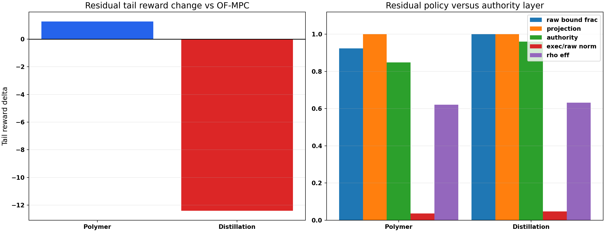
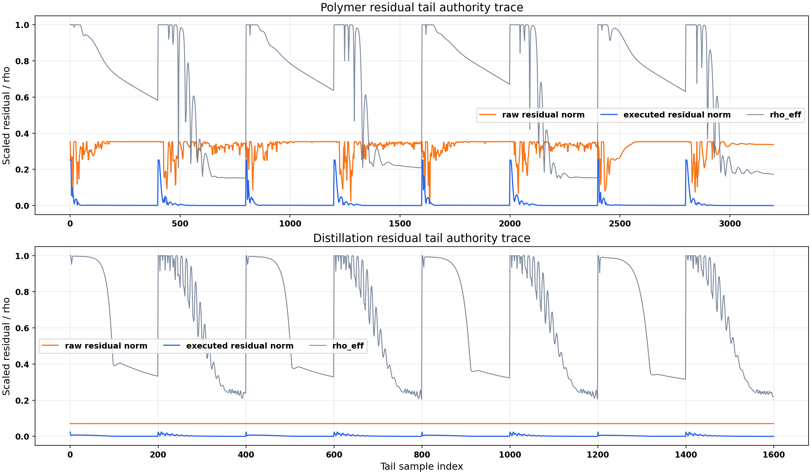
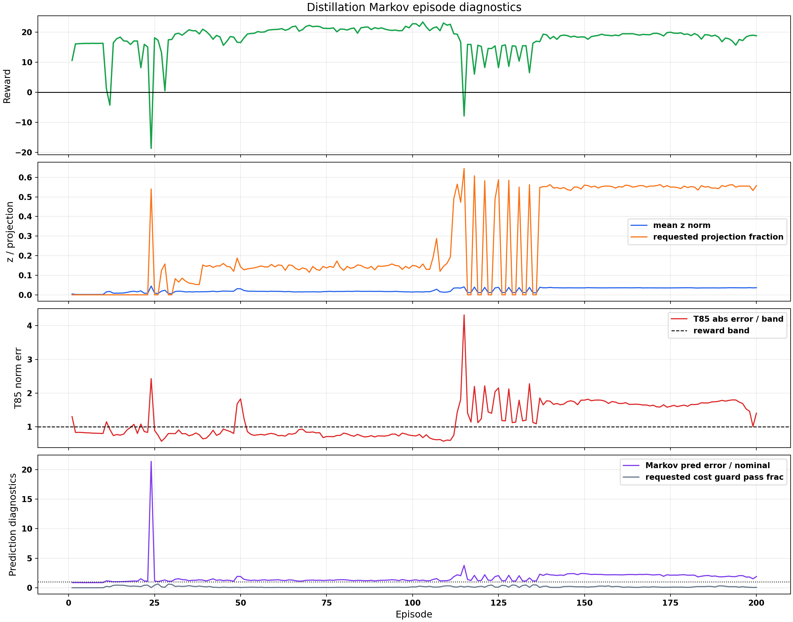
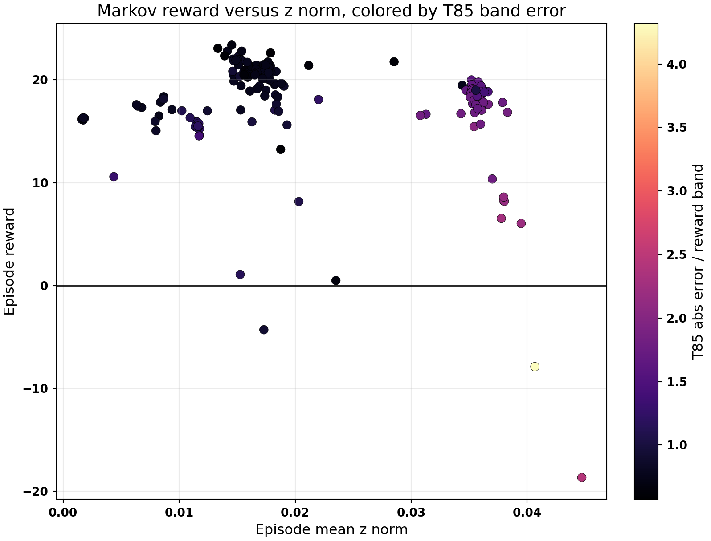
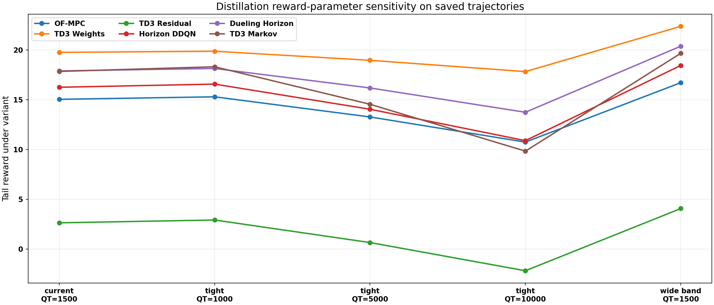
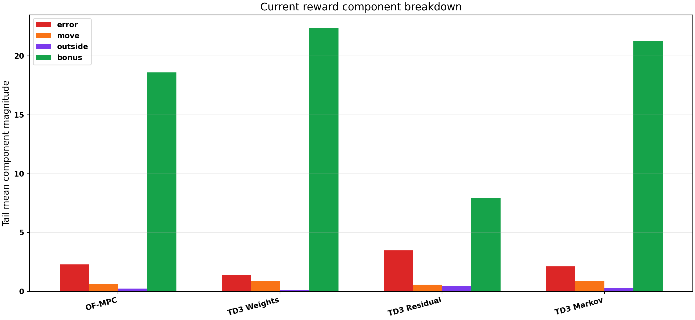

# Distillation Residual, Markov, And Reward-Parameter Focus Report

Date: 2026-05-21

## Executive Summary

This focused report answers three questions: why the residual policy helps in the polymer case but fails in the latest distillation run, why the latest distillation Markov run looks strange, and what reward-parameter changes are worth testing next.

- Residual is not failing because the residual layer is inactive. It is failing because the distillation residual actor saturates the raw correction at the action bounds while the authority layer projects every tail step. Tail projection is `1.000` and raw-bound fraction is `1.000`.
- Polymer residual also gets projected, but it still improves tail reward over OF-MPC by `1.28` on the saved polymer reward basis. Distillation residual changes tail reward by `-12.40` versus OF-MPC after recomputing all distillation trajectories with the current reward, which is the opposite sign.
- The Markov run is weird because TD3 is the executed source in the tail, but the Markov prediction/cost diagnostics are not reassuring: tail requested projection fraction is `0.553`, T85 normalized error is `1.600`, and requested cost-guard pass fraction is only `0.132`.
- Reward sensitivity says increasing the temperature weight from `Q_T = 1500` to `5000` or `10000` mostly punishes the Markov and residual trajectories more. It does not rescue residual. The ranking remains led by `TD3 Weights` under current reward and `TD3 Weights` under `Q_T = 5000`.

## Files Inspected

- Distillation OF-MPC: `Distillation/Data/mpc_results_disturb_fluctuation.pickle`
- Distillation TD3 Weights: `Distillation/Results/distillation_weights_td3_disturb_fluctuation_mismatch_unified/20260521_150600/input_data.pkl`
- Distillation TD3 Residual: `Distillation/Results/distillation_residual_td3_disturb_fluctuation_mismatch_rho_unified/20260521_152021/input_data.pkl`
- Distillation Horizon DDQN: `Distillation/Results/distillation_horizon_disturb_fluctuation_mismatch_unified/20260521_154248/input_data.pkl`
- Distillation Dueling Horizon: `Distillation/Results/distillation_dueling_horizon_disturb_fluctuation_mismatch_unified/20260521_154934/input_data.pkl`
- Distillation TD3 Markov: `Distillation/Results/distillation_markov_td3_disturb_fluctuation_unified/20260521_162222/input_data.pkl`
- Polymer OF-MPC: `Polymer/Data/mpc_results_dist.pickle`
- Polymer TD3 Residual: `Polymer/Results/td3_residual_disturb/20260520_214325/input_data.pkl`
- `utils/residual_runner.py`
- `utils/markov_runner.py`
- `systems/distillation/config.py`
- `systems/distillation/notebook_params.py`
- `systems/polymer/config.py`
- `systems/polymer/notebook_params.py`

## Method Reconstruction

For residual RL, the MPC proposes a nominal first move `u_MPC`, and TD3 proposes a scaled residual `a_res`. The executable correction is not the raw actor output; it is projected through the authority layer:

$$ \Delta u_{\mathrm{res,exec}} = \Pi_{\rho,\mathrm{bounds},\mathrm{deadband}}(\Delta u_{\mathrm{res,raw}}), \qquad u_0 = u_{\mathrm{MPC}} + \Delta u_{\mathrm{res,exec}}. $$

For Markov RL, the TD3 action selects a lifted response correction:

$$ M_z = M_0 + \sum_i z_i B_i, \qquad |z_i| \leq z_{\mathrm{cap,eff}}, \qquad ||z||_2 \leq z_{\mathrm{norm,max}}. $$

The latest distillation Markov bundle uses `markov_z_bound = 0.040` and `z_safety = {"enabled": true, "full_cap": 0.04, "probation_cap": 0.02, "protected_cap": 0.02, "ramp_end_cap": 0.04, "ramp_start_cap": 0.03, "vector_norm_cap": {"enabled": true, "max_norm": 0.06}}`.

For reward sensitivity, each saved distillation trajectory is rescored without rerunning Aspen using:

$$ r_t = -\ell_{e,t} - \ell_{\Delta u,t} - \ell_{\mathrm{outside},t} - \ell_{\mathrm{inside},t} + b_t. $$

The alternatives change only the reward parameters used to evaluate the same saved trajectories; they are not counterfactual closed-loop simulations.

## 1. Why Residual Works In Polymer But Not Here

| Case | Reward basis | Residual tail reward | Delta vs OF-MPC | Raw bound frac | Projection frac | Authority frac | Exec/raw norm | rho eff |
| --- | --- | --- | --- | --- | --- | --- | --- | --- |
| Polymer | native saved reward | -3.14 | 1.28 | 0.924 | 1.000 | 0.848 | 0.036 | 0.621 |
| Distillation | recomputed current distillation reward | 2.64 | -12.40 | 1.000 | 1.000 | 0.960 | 0.046 | 0.632 |

Note: the distillation row uses recomputed current reward because the historical OF-MPC pickle stores an older native reward that is not comparable to the latest reward function. The polymer row uses its native saved reward because the comparison is within the same saved polymer reward basis.

The mechanism is different across plants. In polymer, residual authority is also constrained, but the executed correction still gives a useful local input nudge and the tail reward improves relative to OF-MPC. In distillation, the raw residual actor is almost a bang-bang controller at `[+0.05, -0.05]`, while the authority layer scales it back every tail step. That means the critic is learning around a raw action that is mostly not executable.

The distillation column is also more sensitive to direct input residuals: reflux and reboiler duty are tightly coupled through slow tray/composition dynamics, and the reward band on T85 is tight. A residual correction that looks small in scaled input coordinates can create long thermal/composition transients. The residual layer has no prediction model of that long tail; it only adds a direct move correction after the MPC solve.

My interpretation: residual is not a good first standalone authority mechanism for this distillation setup unless we either reduce residual bounds, train the actor inside the projected action set, or add a candidate-cost/safety gate analogous to the Markov gate.

## 2. Why The Latest Markov Run Looks Weird

The latest Markov run is strong by scalar reward but strange by diagnostics. Tail TD3 source is effectively always on, requested z is projected in `0.553` of tail steps, and the T85 normalized error stays around `1.600`. The output plot shows good composition behavior but poor/oscillatory T85 behavior.

A key red flag is that Markov prediction error is often worse than nominal prediction error, while TD3 remains the executed source. That does not mean the run is unusable; it means the scalar reward is rewarding some parts of the behavior even when the Markov model correction is not a uniformly better local predictor.

My interpretation: the z-safety layer is doing its job as a magnitude shield, but the acceptance metric is still too permissive for this plant. The next Markov step should not be only a smaller z bound; it should also require prediction/cost usefulness, especially on T85-sensitive transients.

## 3. Reward-Parameter Sensitivity

| Method | Current QT1500 | Tight QT5000 | Tight QT10000 | Wide band QT1500 |
| --- | --- | --- | --- | --- |
| OF-MPC | 15.05 | 13.28 | 10.75 | 16.72 |
| TD3 Weights | 19.76 | 18.97 | 17.83 | 22.38 |
| TD3 Residual | 2.64 | 0.66 | -2.17 | 4.08 |
| Horizon DDQN | 16.26 | 14.05 | 10.90 | 18.45 |
| Dueling Horizon | 17.90 | 16.19 | 13.74 | 20.38 |
| TD3 Markov | 17.85 | 14.55 | 9.84 | 19.67 |

| Method | Tail reward | Error penalty | Move penalty | Outside penalty | Inside penalty | Bonus | T85 quad | w_in |
| --- | --- | --- | --- | --- | --- | --- | --- | --- |
| OF-MPC | 15.05 | 2.30 | 0.61 | 0.24 | 0.41 | 18.60 | 1.062 | 0.658 |
| TD3 Weights | 19.76 | 1.42 | 0.89 | 0.16 | 0.16 | 22.38 | 0.827 | 0.702 |
| TD3 Residual | 2.64 | 3.48 | 0.57 | 0.45 | 0.79 | 7.94 | 1.016 | 0.590 |
| TD3 Markov | 17.85 | 2.12 | 0.91 | 0.28 | 0.16 | 21.31 | 1.519 | 0.524 |

Under the current tight reward with `Q_T = 1500`, the best saved trajectory is `TD3 Weights`. Under `Q_T = 5000`, the best saved trajectory is `TD3 Weights`. Under `Q_T = 10000`, the best saved trajectory is `TD3 Weights`.

Increasing `Q_T` makes T85 error more visible and penalizes Markov's weird temperature behavior. That is scientifically useful if we care about tray-85 temperature, but it will not by itself fix residual. Residual is already failing dynamically and through projection, so a stronger temperature penalty may simply make the failure more obvious.

The wide-band variant raises rewards by making the temperature target easier. That is helpful for diagnosing whether a reward is too harsh, but it should not be used to claim better control unless we explicitly accept a looser T85 tolerance.

## Recommended Next Steps

1. **Residual next run:** shrink residual bounds for distillation from `[-0.05, 0.05]` to about `[-0.02, 0.02]`, keep rho authority, and store executed actions in replay. Metric: projection fraction should drop and raw-bound fraction should no longer be near one.
2. **Residual safety gate:** add an MPC candidate-cost usefulness gate or behavior-cloning penalty to keep raw residual actions close to the executable region. Metric: raw/executed residual norm ratio should increase without tail reward collapse.
3. **Markov next run:** keep `z_bound = 0.04`, but add a usefulness gate that rejects/probates TD3 when Markov prediction error is worse than nominal or when T85 band error is growing. Metric: T85 normalized error should fall below one without losing composition tracking.
4. **Reward experiment:** do not jump to `Q_T = 10000` first. Run one controlled `Q_T = 5000` tight-band experiment and compare to `Q_T = 1500`. Metric: T85 band-normalized error, not only scalar reward.
5. **Evaluation protocol:** freeze policies and run a common fluctuation schedule. Current reports are training-rollout diagnostics, not final generalization evidence.

## Bottom Line

For the next distillation work, I would prioritize **TD3 Weights as the current best performer**, **Markov with a stronger usefulness/T85 gate**, and **a much smaller residual-authority experiment**. Reward changes are worth testing, but they should be treated as diagnostics unless the closed-loop behavior also improves.
