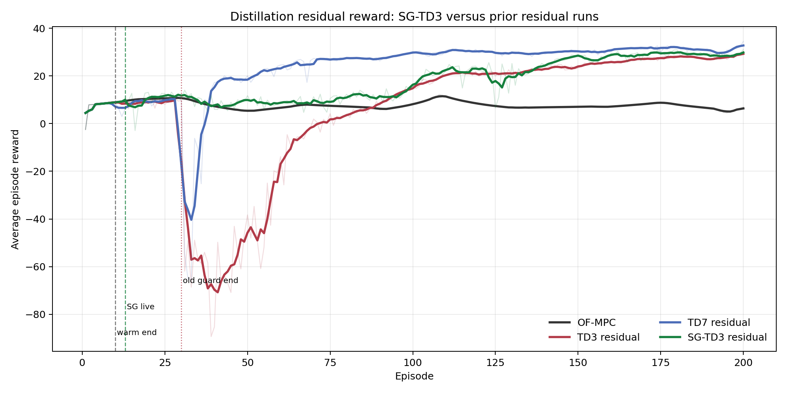
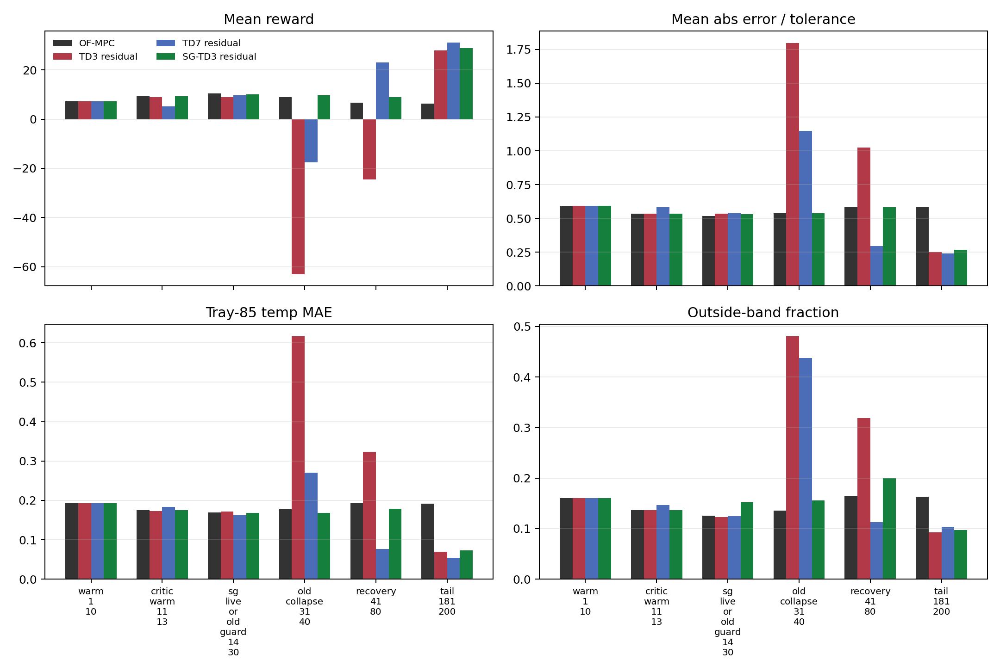
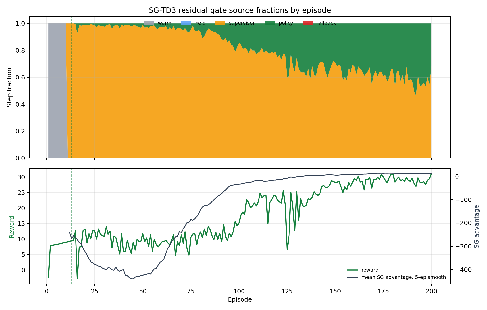
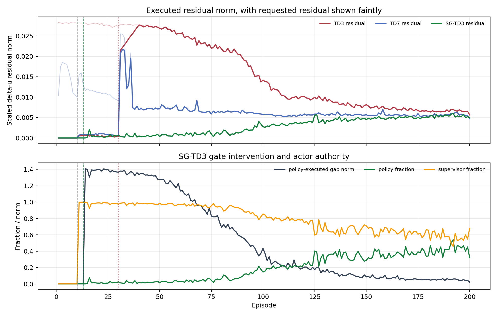
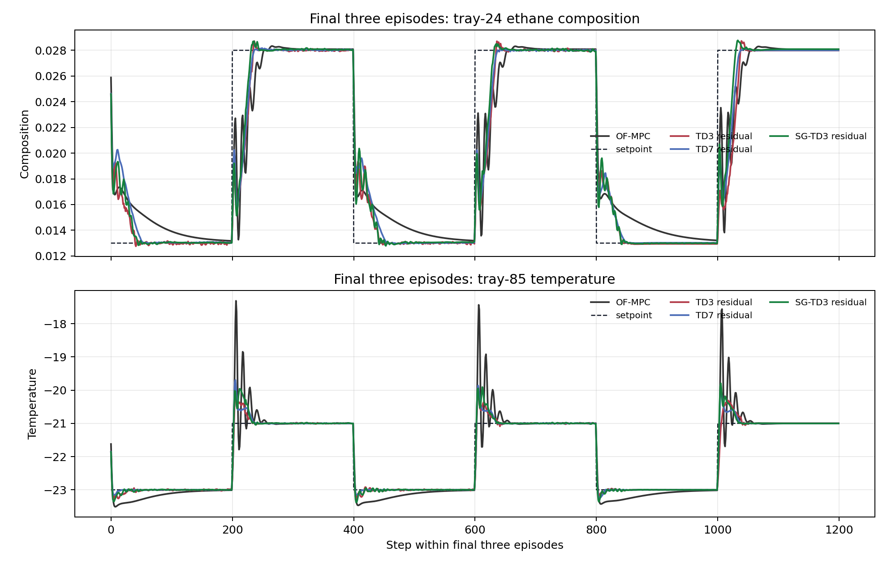

# Distillation Residual SG-TD3 Outcome Analysis

Date: 2026-06-02

Case study: Aspen Dynamics C2 splitter distillation column

Scenario: `run_mode = "disturb"`, fluctuation feed-flow disturbance

New run analyzed: `distillation_residual_sg_td3_critic_warm3_manual_off_disturb_fluctuation_mismatch_no_rho`

## Executive Summary

The residual SG-TD3 result is the best safety-release result so far for the distillation residual family.

The main finding is not only that the tail reward is high. The important result is that SG-TD3 removed the severe post-release collapse seen in the earlier TD3 and TD7 residual runs. The old residual TD3 run reached a worst post-warm reward of `-89.38`, and TD7 reached `-65.34`. The new SG-TD3 run reached only `-2.91`, then recovered above OF-MPC by episode 18 using a 5-episode reward mean criterion.

In the old collapse window, episodes 31 to 40, SG-TD3 stayed close to OF-MPC instead of collapsing:

- OF-MPC reward mean: `8.89`
- TD3 residual reward mean: `-63.13`
- TD7 residual reward mean: `-17.60`
- SG-TD3 residual reward mean: `9.73`

The mechanism is clear from the gate logs. During episodes 14 to 40, the SG gate rejected almost all actor residuals. The policy was selected only `1.7%` to `1.8%` of the time, while the zero-residual supervisor was selected about `98%` of the time. By the final 20 episodes, the actor was selected `42.4%` of the time and the tail reward was `28.92`, much higher than OF-MPC and slightly higher than the previous TD3 residual run.

This is a strong result, but not a final proof. It is a single run. TD7 still has the highest tail reward and the lowest tail temperature MAE. SG-TD3 is the better safety-release compromise: it sacrifices some TD7 tail temperature performance while avoiding the catastrophic early actor release.

## Files Inspected

Implementation:

- `distillation_RL_assisted_MPC_residual_supervisor_gated_td3_critic_warm_unified.py`
- `distillation_RL_assisted_MPC_residual_unified.py`
- `utils/residual_runner.py`
- `utils/supervisor_gated_action.py`
- `TD3Agent/supervisor_gated_agent.py`
- `TD3Agent/supervisor_replay_buffer.py`

Prior reports:

- `report/distillation_residual_td3_td7_collapse_analysis_2026_06_01.md`
- `report/06_supervisor_gated_td3.md`
- `change-reports/2026-06-01_distillation_sg_td3_critic_warm3_manual_off.md`

Result bundles:

- `Distillation/Results/distillation_residual_sg_td3_critic_warm3_manual_off_disturb_fluctuation_mismatch_no_rho/20260602_125954/input_data.pkl`
- `Distillation/Results/distillation_compare_residual_sg_td3_critic_warm3_manual_off_disturb_fluctuation/20260602_130007/input_data.pkl`
- `Distillation/Results/distillation_residual_td3_disturb_fluctuation_mismatch_no_rho_unified/20260601_170240/input_data.pkl`
- `Distillation/Results/distillation_residual_td7_disturb_fluctuation_mismatch_no_rho_unified/20260601_172611/input_data.pkl`
- `Distillation/Data/mpc_results_disturb_fluctuation.pickle`

Generated analysis artifacts:

- `report/scripts/analyze_distillation_residual_sg_td3_20260602.py`
- `report/figures/distillation_residual_sg_td3_20260602/summary_metrics.csv`
- `report/figures/distillation_residual_sg_td3_20260602/window_metrics.csv`
- `report/figures/distillation_residual_sg_td3_20260602/sg_episode_metrics.csv`
- `report/figures/distillation_residual_sg_td3_20260602/analysis_summary.json`

## Current Method

The controlled outputs are tray-24 ethane composition and tray-85 temperature:

$$ y_k = \begin{bmatrix}x_{24,\mathrm{C2H6},k} \\ T_{85,k}\end{bmatrix}. $$

The manipulated inputs are reflux flow and reboiler duty:

$$ u_k = \begin{bmatrix}F_{\mathrm{reflux},k} \\ Q_{\mathrm{reb},k}\end{bmatrix}. $$

The residual controller does not replace MPC. It adds a small learned correction to the MPC input move.

First, offset-free MPC computes the nominal scaled move:

$$ \Delta u^{\mathrm{mpc}}_k = \kappa_{\mathrm{MPC}}(\hat{x}_k,y_{\mathrm{sp},k}). $$

The residual actor proposes a bounded correction:

$$ a_{\theta,k}\in[-1,1]^2,\qquad \Delta u^{\mathrm{res}}_{\theta,k} = s_{\mathrm{res}} a_{\theta,k}. $$

The executed move is:

$$ \Delta u^{\mathrm{exec}}_k = \Delta u^{\mathrm{mpc}}_k + \Delta u^{\mathrm{res,exec}}_k. $$

For the SG-TD3 residual run, the supervisor residual is zero:

$$ a_{\mathrm{sup},k}=0,\qquad \Delta u^{\mathrm{res,sup}}_k=0. $$

So the supervisor action recovers plain OF-MPC.

## SG-TD3 Mathematics

TD3 gives two critics:

$$ Q_{\phi_1}(s,a),\qquad Q_{\phi_2}(s,a). $$

The actor proposes:

$$ a_{\mathrm{rl},k} = \mu_{\theta}(s_k). $$

The residual SG-TD3 gate compares this actor action against the zero-residual supervisor action:

$$ a_{\mathrm{sup},k}=0. $$

The conservative value is:

$$ Q_{\min}(s_k,a)=\min(Q_{\phi_1}(s_k,a),Q_{\phi_2}(s_k,a)). $$

The critic disagreement penalty is:

$$ D_Q(s_k,a)=\lvert Q_{\phi_1}(s_k,a)-Q_{\phi_2}(s_k,a)\rvert. $$

The SG score is:

$$ S(s_k,a)=Q_{\min}(s_k,a)-\rho_QD_Q(s_k,a)-\kappa_{\mathrm{prev}}\lVert a-a_{\mathrm{prev},k}\rVert_2^2-\kappa_{\mathrm{sup}}\lVert a-a_{\mathrm{sup},k}\rVert_2^2. $$

The current residual wrapper uses:

$$ \rho_Q=0.5,\qquad \kappa_{\mathrm{sup}}=0.05,\qquad \kappa_{\mathrm{prev}}=0.01,\qquad \epsilon_A=0.5. $$

The actor advantage over the supervisor is:

$$ A_{\mathrm{rl}\mid\mathrm{sup}}(s_k)=S(s_k,a_{\mathrm{rl},k})-S(s_k,a_{\mathrm{sup},k}). $$

The policy action is executed only when:

$$ A_{\mathrm{rl}\mid\mathrm{sup}}(s_k)>\epsilon_A. $$

Otherwise, the zero-residual supervisor is executed:

$$ a_k^{\mathrm{exec}}=a_{\mathrm{sup},k}=0. $$

This means SG-TD3 does not make the actor safe by assumption. It requires the critic score to justify actor authority at each step.

The replay buffer stores the executed action:

$$ \mathcal{D}\leftarrow(s_k,a_k^{\mathrm{exec}},r_k,s_{k+1},d_k). $$

This matters because the plant transition was caused by the executed residual, not necessarily by the actor proposal. The buffer also stores the actor action, supervisor action, scores, advantage, and selected source for diagnostics.

## Run Configuration Verified From Bundle

The saved SG-TD3 bundle shows:

| Field | Value |
| --- | --- |
| `agent_kind` | `sg_td3` |
| `notebook_source` | `distillation_RL_assisted_MPC_residual_supervisor_gated_td3_critic_warm_unified.py` |
| `state_mode` | `mismatch` |
| warm-start episodes | `10` |
| critic-warm action-freeze episodes | `3` |
| actor-freeze episodes | `3` |
| behavioral cloning | disabled |
| BC handoff | disabled |
| BC release gate | disabled |
| TD3 authority ramp | disabled |
| rho authority | disabled |
| residual zero deadband | disabled |
| early-release guard | disabled |
| nonfinite fallback to zero | enabled |

No live residual cap, old early-release guard, headroom projection, or nonfinite fallback was active in the analyzed windows. The main active protection was therefore the SG-TD3 actor-versus-supervisor gate.

## Figure Evidence

### Reward Comparison

The reward figure shows the main story. The old TD3 and TD7 residual runs collapse after the old guard release. SG-TD3 has one shallow negative release episode near episode 16, then remains much closer to OF-MPC until the actor earns more authority later.

### Window Metrics

The window metrics show that SG-TD3 is not only better in reward. In the old collapse window, the temperature MAE is close to OF-MPC and far below the old residual TD3/TD7 collapse values.

### SG Gate Source Fractions

This figure explains why the release is stable. Early after release, the policy advantage is strongly negative and the supervisor dominates. Near the tail, the actor advantage becomes positive and the policy fraction rises.

### Residual Norms And Gate Intervention

SG-TD3 keeps the executed residual almost zero during the old collapse window even though the policy-executed gap is large. This is exactly the intended behavior: the actor can propose risky residuals, but the gate does not execute them unless the critic score supports them.

### Tail Tracking

The final three episodes show that the SG-TD3 residual run is not merely safe because it stays at OF-MPC forever. The tail tracking improves substantially relative to OF-MPC, especially in tray-85 temperature.

## Main Metrics

Tail metrics use episodes 181 to 200.

| Run | Tail-20 reward | Final reward | Worst post-warm reward | Worst post-warm episode | Tail comp MAE | Tail temp MAE | Tail band MAE | Tail outside-band frac |
| --- | ---: | ---: | ---: | ---: | ---: | ---: | ---: | ---: |
| OF-MPC | `6.391` | `6.926` | `4.488` | `195` | `0.001545` | `0.1921` | `0.5833` | `0.1633` |
| TD3 residual | `27.888` | `30.394` | `-89.375` | `39` | `0.001061` | `0.0698` | `0.2517` | `0.0922` |
| TD7 residual | `31.069` | `34.480` | `-65.344` | `33` | `0.001290` | `0.0541` | `0.2411` | `0.1041` |
| SG-TD3 residual | `28.916` | `31.090` | `-2.910` | `16` | `0.001141` | `0.0726` | `0.2696` | `0.0971` |

Interpretation:

- SG-TD3 tail reward is `+22.52` above OF-MPC and `+1.03` above TD3 residual.
- SG-TD3 tail reward is `2.15` below TD7 residual, so TD7 still has the strongest tail reward in this comparison.
- SG-TD3 tail temperature MAE improves `62.2%` relative to OF-MPC.
- SG-TD3 tail composition MAE improves `26.2%` relative to OF-MPC.
- SG-TD3 tail outside-band fraction improves `40.5%` relative to OF-MPC.

## Release And Collapse-Window Metrics

The old collapse window is episodes 31 to 40. This is where the previous TD3 and TD7 residual runs failed.

| Run | Reward mean, eps 31-40 | Reward min, eps 31-40 | Comp MAE | Temp MAE | Band MAE | Outside-band frac |
| --- | ---: | ---: | ---: | ---: | ---: | ---: |
| OF-MPC | `8.893` | `7.265` | `0.001424` | `0.1771` | `0.537` | `0.1360` |
| TD3 residual | `-63.127` | `-89.375` | `0.004183` | `0.6164` | `1.796` | `0.4805` |
| TD7 residual | `-17.602` | `-65.344` | `0.006143` | `0.2705` | `1.146` | `0.4375` |
| SG-TD3 residual | `9.727` | `5.125` | `0.001763` | `0.1687` | `0.537` | `0.1555` |

This is the strongest evidence in favor of SG-TD3. The prior residual agents had high late upside but unsafe release behavior. SG-TD3 preserves a high tail reward while making the release window behave like a conservative controller.

Compared with the old TD3 residual run in episodes 31 to 40:

- SG-TD3 improves mean reward by `72.85`.
- SG-TD3 reduces temperature MAE by `72.6%`.
- SG-TD3 reduces outside-band fraction by `67.6%`.

Compared with the old TD7 residual run:

- SG-TD3 improves mean reward by `27.33`.
- SG-TD3 reduces temperature MAE by `37.6%`.
- SG-TD3 reduces outside-band fraction by `64.5%`.

## SG Gate Diagnostics

| Window | Reward mean | Policy frac | Supervisor frac | Executed residual norm mean | Policy-executed gap mean | Mean SG advantage |
| --- | ---: | ---: | ---: | ---: | ---: | ---: |
| Episodes 1-10 | `7.292` | `0.000` | `0.000` | `0.000000` | `0.0044` | not scored |
| Episodes 11-13 | `9.256` | `0.000` | `0.999` | `0.000000` | `0.0043` | not scored |
| Episodes 14-30 | `10.142` | `0.0169` | `0.9831` | `0.000475` | `1.3837` | `-337.7` |
| Episodes 31-40 | `9.727` | `0.0178` | `0.9823` | `0.000500` | `1.3585` | `-400.7` |
| Episodes 41-80 | `8.948` | `0.0329` | `0.9671` | `0.000815` | `1.1044` | `-325.4` |
| Episodes 181-200 | `28.916` | `0.4236` | `0.5764` | `0.005374` | `0.0503` | `10.51` |

This table gives the mechanism.

Early after release, the actor proposal is far from the executed supervisor action. The policy-executed gap is about `1.36` to `1.38` in normalized action coordinates. The mean SG advantage is strongly negative, so the gate blocks the actor.

In the tail, the actor proposal is much closer to the executed action. The policy-executed gap falls to `0.050`, the mean SG advantage becomes positive, and the gate allows policy authority `42.4%` of the time.

This is exactly the behavior we wanted from SG-TD3:

1. protect the plant while the critics do not trust the actor,
2. let the actor participate once critic scores support it,
3. keep zero-residual OF-MPC as a live fallback.

## Why This Result Looks So Good

The old residual safety stack tried to protect release using manually designed layers:

- behavioral cloning,
- BC handoff,
- authority ramp,
- early-release guard,
- diagnostic release gate,
- residual cap,
- shadow rho/deadband diagnostics.

Those layers delayed collapse but did not solve it. The collapse happened when the early-release guard expired.

The SG-TD3 run is different. It disables those manually created live layers and uses a candidate-selection rule at every step. The decision is local and repeated:

$$ \text{execute actor only if critic score of actor exceeds critic score of zero residual by the margin.} $$

That makes release smoother because there is no single episode where a manual guard expires and actor authority suddenly becomes unconditional.

The most important diagnostic is that SG-TD3 did not need residual caps or the old early-release guard to prevent the collapse. The gate itself held the residual near zero in the dangerous period.

## Comparison Against Prior Residual Runs

SG-TD3 is better than TD3 residual in both release safety and tail reward:

- worst post-warm reward improves from `-89.38` to `-2.91`,
- old-collapse-window temperature MAE improves from `0.6164` to `0.1687`,
- tail reward improves from `27.89` to `28.92`.

SG-TD3 is safer than TD7 residual but not stronger in tail reward:

- worst post-warm reward improves from `-65.34` to `-2.91`,
- old-collapse-window outside-band fraction improves from `0.4375` to `0.1555`,
- tail reward decreases from `31.07` to `28.92`,
- tail temperature MAE increases from `0.0541` to `0.0726`,
- tail composition MAE improves from `0.001290` to `0.001141`.

So the correct statement is:

SG-TD3 is not the absolute best tail-temperature controller in this set, but it is the best release-safe residual controller so far.

## Bugs, Inconsistencies, Or Risks Found

No obvious logging contradiction was found in the SG-TD3 result bundle. The key provenance fields are consistent:

- `agent_kind = "sg_td3"`
- the notebook source is the SG-TD3 critic-warm wrapper,
- residual authority, rho authority, BC, handoff, TD3 ramp, deadband, and early-release guard are disabled,
- fallback-to-zero on nonfinite actions remains enabled.

Important caveats:

1. The saved bundle did not include a populated top-level `supervisor_gate` dictionary. The SG gate hyperparameters in this report come from the wrapper implementation.
2. This is one run, not a multi-seed result.
3. The TD3 and TD7 comparison runs are prior residual runs with the older manual safety stack. That comparison is useful because it targets the known failure mode, but it is not a pure ablation.
4. SG-TD3 still had a shallow negative release episode at episode 16. It is much smaller than the TD3/TD7 collapse, but it should still be inspected.
5. The gate depends on critic ranking quality. If the critics overestimate a bad actor action, SG-TD3 can still pass an unsafe residual.

## Literature Connection

This result fits the control interpretation of safe residual RL. Residual RL is attractive because the learned policy only corrects a stabilizing baseline controller. However, residual authority can still destabilize performance when the actor is released before it is reliable.

SG-TD3 behaves like an online action-selection shield around residual RL. It does not prove safety in the formal Lyapunov sense, but it adds a conservative critic-based decision layer. That makes the approach closer to safe policy improvement: the actor must outperform a known fallback action before it is allowed to affect the plant.

No new external citation was added in this report. The interpretation is based on the saved bundles and local implementation.

## Recommended Next Experiments

1. Repeat SG-TD3 residual with at least three random seeds.

   Purpose: verify that the release stability is not seed-specific.

   Metric to watch: worst post-warm reward, episodes 14 to 40 reward mean, tail reward, policy fraction.

   Confirmation criterion: all seeds avoid a TD3/TD7-style collapse and retain tail reward above OF-MPC.

2. Run a TD3 residual baseline with the same manual-off settings but without SG gating.

   Purpose: isolate the effect of the gate from the effect of turning off old safety layers.

   Metric to watch: episodes 14 to 40 reward and executed residual norm.

   Confirmation criterion: if manual-off TD3 collapses but SG-TD3 does not, the gate is the key protective mechanism.

3. Run SG-TD3 residual with a smaller advantage margin sweep.

   Candidate values: `0.0`, `0.25`, `0.5`, `1.0`.

   Purpose: determine whether the current `0.5` margin is too conservative in the tail.

   Metric to watch: tail reward, tail temperature MAE, policy fraction, and worst post-warm reward.

   Confirmation criterion: keep worst post-warm reward near the current SG-TD3 level while increasing tail policy fraction or tail reward.

4. Add bundle-level persistence for the full supervisor gate config.

   Purpose: make future audit reports independent of wrapper source inspection.

   File likely involved: `utils/residual_runner.py`.

   Metric to watch: saved `input_data.pkl` includes `supervisor_gate` fields and source-name mapping.

## Remaining Uncertainty

The main uncertainty is whether this is robust across seeds and disturbances. The current run strongly supports SG-TD3 as the correct safety direction for residual distillation, but it is still one Aspen trajectory.

The other uncertainty is the tail tradeoff. TD7 has the best tail reward and temperature MAE, while SG-TD3 has the best release behavior and slightly better tail composition/outside-band behavior than TD7. The next question is whether SG-TD3 can recover more of TD7's tail upside without reintroducing release collapse.

My interpretation is:

SG-TD3 residual has likely solved the main release-collapse mechanism, and now the research problem shifts from emergency safety protection to controlled authority expansion.
