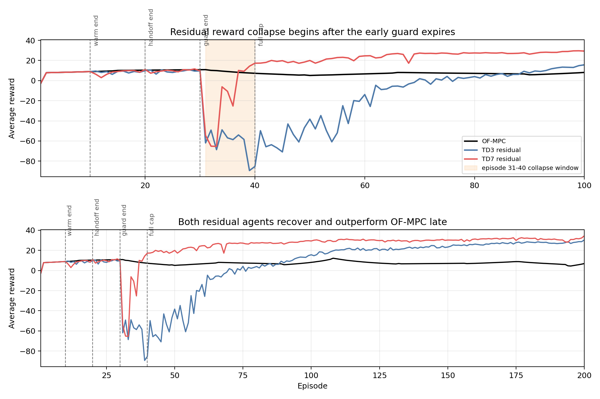
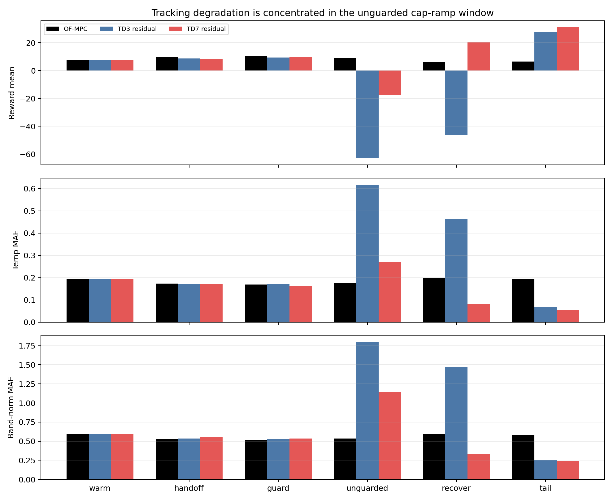
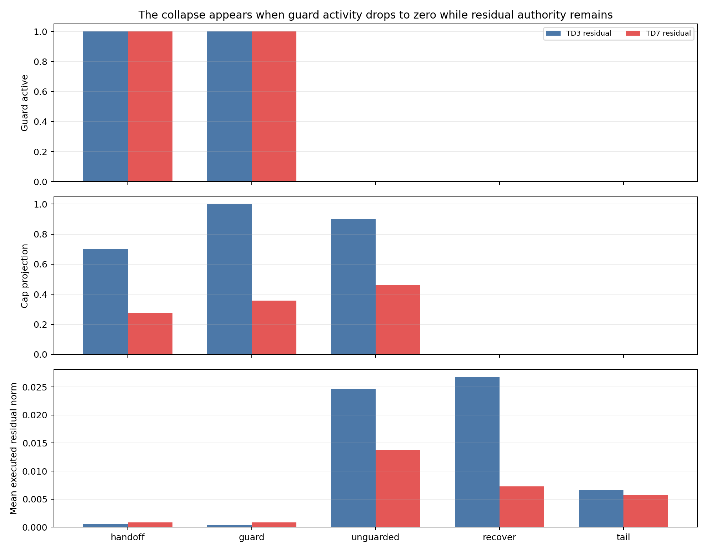
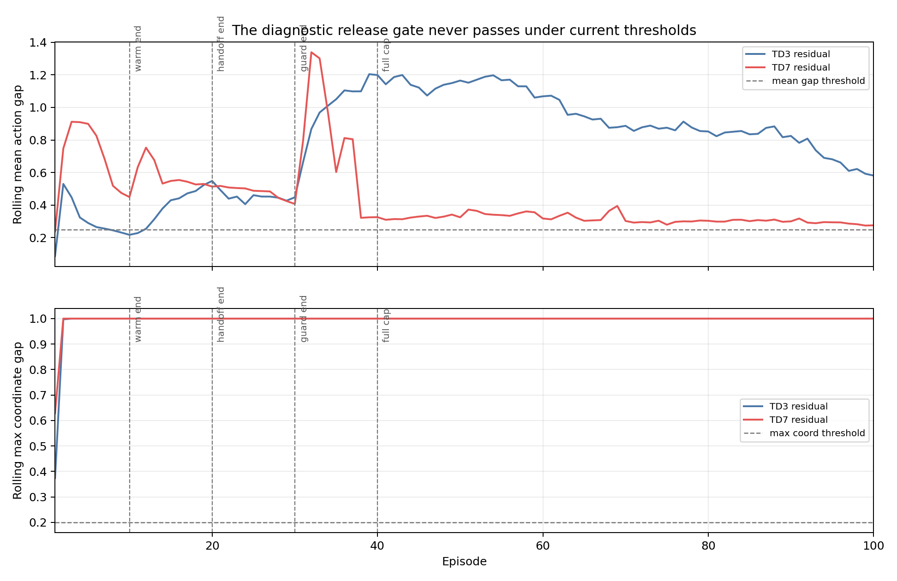
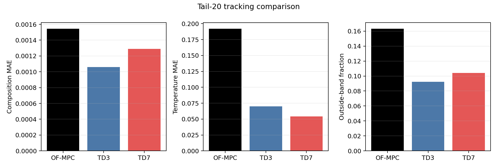

# Distillation Residual TD3 And TD7 Collapse-Recovery Analysis

Date: 2026-06-01  
Case study: Aspen C2 splitter distillation column  
Scenario: `run_mode = "disturb"`, `disturbance_profile = "fluctuation"`  
Residual setting: `state_mode = "mismatch"`, `use_rho_authority = False`, `residual_authority_enabled = False`

## Executive Summary

The new TD3 and TD7 residual runs did not remove the collapse-then-recover problem. They changed its shape.

TD7 is clearly better than TD3 in this pair. TD7 has higher tail reward, higher final reward, lower tail temperature error, and much faster recovery after collapse. But the same structural failure remains: both residual agents collapse immediately after the early-release guard expires.

The key timing is:

- warm zero residual runs through episode 10
- BC handoff runs over episodes 11 to 20
- early-release guard runs through episode 30
- collapse begins at episode 31
- residual cap reaches its full value after episode 40 and remains active

That timing is too exact to ignore. The failure is not simply "TD3 is bad" or "TD7 fixes it." The current guard suppresses unsafe residuals while it is active, then the learned residual is allowed through while the residual policy is still not aligned with the nominal safe action.

The diagnostic release gate also never passed for either run, with `release_step = -1`. However, it was diagnostic only, with live blocking disabled. So the run had a detector saying the actor was not release-ready, but that detector was not allowed to affect execution.

## Files Inspected

Implementation and configuration:

- `distillation_RL_assisted_MPC_residual_unified.py`
- `distillation_RL_assisted_MPC_residual_td7_unified.py`
- `utils/residual_runner.py`
- `utils/residual_authority.py`
- `systems/distillation/notebook_params.py`
- `systems/distillation/config.py`

Current result bundles:

- `Distillation/Results/distillation_residual_td3_disturb_fluctuation_mismatch_no_rho_unified/20260601_170240/input_data.pkl`
- `Distillation/Results/distillation_residual_td7_disturb_fluctuation_mismatch_no_rho_unified/20260601_172611/input_data.pkl`
- `Distillation/Results/distillation_compare_residual_td3_disturb_fluctuation/20260601_170255/input_data.pkl`
- `Distillation/Results/distillation_compare_residual_td7_disturb_fluctuation/20260601_172624/input_data.pkl`
- `Distillation/Data/mpc_results_disturb_fluctuation.pickle`

Prior local reports:

- `report/distillation_post_reward_no_probation_5runner_analysis_2026_05_31.md`
- `report/distillation_5runner_wider_safety_analysis_2026_05_30.md`
- `report/rl_state_scaling_diagnostics.md`
- `change-reports/2026-06-01_residual_td7_sale_initial_implementation.md`

Generated analysis artifacts:

- `report/scripts/analyze_distillation_residual_td3_td7_20260601.py`
- `report/figures/distillation_residual_td3_td7_20260601/summary_metrics.csv`
- `report/figures/distillation_residual_td3_td7_20260601/window_metrics.csv`
- `report/figures/distillation_residual_td3_td7_20260601/episode_metrics.csv`
- `report/figures/distillation_residual_td3_td7_20260601/analysis_summary.json`

## Current Method

The controlled outputs are tray-24 ethane composition and tray-85 temperature:

$$ y_k = [x_{24,\mathrm{C2H6},k}, T_{85,k}]^\top. $$

The manipulated inputs are reflux flow and reboiler duty:

$$ u_k = [F_{\mathrm{reflux},k}, Q_{\mathrm{reb},k}]^\top. $$

The residual controller keeps the offset-free MPC solve as the base controller:

$$ x_{\mathrm{aug},k+1} = A_{\mathrm{aug}} x_{\mathrm{aug},k} + B_{\mathrm{aug}} \Delta u_k,\qquad y_k = C_{\mathrm{aug}} x_{\mathrm{aug},k}. $$

Nominal MPC computes the first scaled input move:

$$ \Delta u^{\mathrm{mpc}}_k = \arg\min_{\Delta U} \sum_{j=1}^{N_p} e_{k+j}^\top Q e_{k+j} + \sum_{j=0}^{N_c-1} \Delta u_{k+j}^\top R \Delta u_{k+j}. $$

The residual actor then proposes a bounded correction in scaled delta-input coordinates:

$$ a_{\theta,k} \in [-1,1]^2,\qquad \Delta u^{\mathrm{res,raw}}_k \in [-0.02,0.02]^2. $$

The executed move is:

$$ \Delta u^{\mathrm{exec}}_k = \Delta u^{\mathrm{mpc}}_k + \Pi_{\mathrm{headroom}}\left(\Pi_{\mathrm{cap}}\left(\Pi_{\mathrm{guard}}\left(\Delta u^{\mathrm{res,raw}}_k\right)\right)\right). $$

The reward is the current relative-band reward. Each output uses a physical tolerance band:

$$ b_i = \max(k_{\mathrm{rel},i}|y_{\mathrm{sp},i}|, b_{\mathrm{floor},i}). $$

The active reward weights are:

- `Q_diag = [3.7e4, 2.0e4]`
- `R_diag = [2.5e3, 2.5e3]`
- `band_floor_phys = [0.003, 0.2]`

## Active Safety Stack

The run label says "all layers," but the saved bundle shows that some layers are live and others are shadow diagnostics.

| Layer | Status in these runs | Evidence |
| --- | --- | --- |
| Zero residual warm start | Live | episodes 1 to 10 |
| Behavioral cloning loss | Live | first 4000 steps |
| BC handoff | Live | episodes 11 to 20 |
| Diagnostic release gate | Diagnostic only | `live_blocking_enabled = False` |
| Residual cap ramp | Live | starts at `0.005`, reaches `0.02` after episode 40 |
| Early-release guard | Live | active through episode 30 |
| Reward probation | Off | `residual_reward_probation_enabled = False` |
| Rho authority | Off in execution | `use_rho_authority = False` |
| Near-zero deadband | Shadow only | live deadband fraction is `0.0` because authority projection is off |
| Shadow rho and deadband | Diagnostic | shadow rho projection fraction is `1.0` in the tail |

This matters because the collapse begins when the early-release guard turns off, not when the cap ramp turns off.

## Figure Evidence

### Reward Collapse And Recovery



The reward trace shows the main result. TD3 and TD7 both behave acceptably while the early-release guard is active. The collapse starts at episode 31, exactly after guard expiry. TD7 recovers around episode 37, while TD3 does not recover above OF-MPC on a 5-episode mean until episode 86.

### Window Tracking



Tracking degradation is concentrated in the episode 31 to 40 unguarded cap-ramp window.

### Safety Activity



The safety plot shows that guard activity drops to zero while residual authority remains. TD3 also has much higher cap projection and larger executed residual norm than TD7 during the collapse window.

### Release Gate Diagnostics



The diagnostic release gate never passes under the current thresholds. The rolling max-coordinate gap is effectively stuck near `1.0`, far above the configured `0.20` threshold. A hard live gate with the current thresholds would probably erase residual authority rather than produce a usable residual controller.

### Tail Tracking



Both residual agents outperform OF-MPC in the final 20 episodes. TD7 is the stronger tail result on reward and temperature, while TD3 has the smaller composition MAE and lower outside-band fraction.

## Main Metrics

Tail metrics use episodes 181 to 200. Recovery is the first episode after the collapse minimum where a 5-episode residual reward mean is at least the corresponding OF-MPC 5-episode mean.

| Run | Tail-20 reward | Final reward | Worst post-warm reward | Worst episode | Recovery episode | Tail comp MAE | Tail temp MAE | Outside-band frac |
| --- | ---: | ---: | ---: | ---: | ---: | ---: | ---: | ---: |
| OF-MPC | `6.391` | `6.926` | `4.488` | `195` | `196` | `0.001545` | `0.1921` | `0.1633` |
| TD3 residual | `27.888` | `30.394` | `-89.375` | `39` | `86` | `0.001061` | `0.0698` | `0.0922` |
| TD7 residual | `31.069` | `34.480` | `-65.344` | `33` | `37` | `0.001290` | `0.0541` | `0.1041` |

Interpretation:

- TD7 has the best final and tail reward.
- TD7 cuts tail temperature MAE by about `71.8%` relative to OF-MPC.
- TD3 cuts tail composition MAE by about `31.3%` relative to OF-MPC.
- TD7 is not just higher reward. It also recovers about 49 episodes sooner than TD3 by the 5-episode recovery metric.
- Neither TD3 nor TD7 removes the release collapse.

## Collapse Window

The collapse window is episodes 31 to 40. This is after the early-release guard ends and before the cap has fully settled at its final value.

| Run | Reward mean | Reward min | Comp MAE | Temp MAE | Band MAE | Outside-band frac |
| --- | ---: | ---: | ---: | ---: | ---: | ---: |
| OF-MPC | `8.893` | `7.265` | `0.001424` | `0.1771` | `0.537` | `0.136` |
| TD3 residual | `-63.127` | `-89.375` | `0.004183` | `0.6164` | `1.796` | `0.4805` |
| TD7 residual | `-17.602` | `-65.344` | `0.006143` | `0.2705` | `1.146` | `0.4375` |

TD3 collapses harder thermally. TD7 collapses less thermally, but its composition error is worse during the collapse window. This is why TD7 is better overall but still not safe enough to call solved.

## Safety Diagnostics

| Run | Guard active frac | Cap projection frac | Executed residual norm mean | Release gate pass frac | Release gate would-block frac |
| --- | ---: | ---: | ---: | ---: | ---: |
| TD3 residual, eps 31 to 40 | `0.00025` | `0.89825` | `0.02460` | `0.0` | `1.0` |
| TD7 residual, eps 31 to 40 | `0.00025` | `0.46025` | `0.01376` | `0.0` | `1.0` |

The guard is effectively off during the collapse window. The cap is still active, but cap projection is only a magnitude limiter. It is not a candidate-quality filter.

The release gate would have blocked every step in the collapse window, but it was diagnostic only. That does not mean the current gate should simply be turned on. Because the gate never passes at all, hard live blocking would likely make the residual branch behave like zero residual for the whole run.

## What TD7 Improved

TD7 changed the action behavior in the right direction:

- TD7 requested smaller residual corrections than TD3 in the collapse window.
- TD7 cap projection was about `0.460`, compared with TD3 at `0.898`.
- TD7 executed residual norm during the collapse window was `0.01376`, compared with TD3 at `0.02460`.
- TD7 recovered by episode 37 on the 5-episode recovery metric, compared with TD3 at episode 86.
- TD7 tail reward is `31.069`, compared with TD3 at `27.888`.

This is a meaningful architecture improvement. It is not a release-safety solution.

## What Failed

The current stack protects while the early-release guard is active, but then releases into an actor that the diagnostic gate still considers unready.

The strongest evidence is the sequence:

1. Guard active through episode 30.
2. Release gate never passes.
3. Collapse starts at episode 31.
4. Cap projection remains active, especially for TD3.
5. Tail eventually recovers once the actor has adapted.

The collapse therefore looks like an early-release quality problem, not a pure magnitude problem.

## Bugs, Inconsistencies, And Risks

1. `y_mpc` and `u_mpc` inside the residual run pickle are aliases of the residual trajectory, not independent OF-MPC trajectories. The analysis used `Distillation/Data/mpc_results_disturb_fluctuation.pickle` for the baseline trajectory and the latest compare pickle for the current reward calculation.

2. `release_gate_blocked_log` can be misread. It logs that the diagnostic release gate would have blocked, but `protected_bc_release_gate_live_blocking_enabled = False`, so it did not block execution.

3. The residual action-source code is not enough to measure active clipping. Both TD3 and TD7 show nearly all tail steps as `projected_td3`, but tail cap projection is `0.0` and the raw-executed difference is tiny. The cap and residual norm diagnostics are more reliable.

4. The configured residual zero-deadband is not live in these runs because it is applied inside `project_residual_action` only when residual authority projection is enabled. The live `deadband_active_log` is `0.0`. Shadow deadband is active in many tail steps, especially TD7, but that did not affect execution.

5. Turning the current diagnostic release gate into a hard live gate without redesign would likely be too conservative. The max-coordinate criterion never passes, including in the good tail region.

## Literature Connection

No new citations were added to this report. The result is consistent with the literature direction already summarized in `report/rl_state_scaling_diagnostics.md`: residual RL can be useful when a learned correction is layered on a baseline controller, but the residual action needs shielding or predictive safety filtering when the learned correction is released to the plant.

The relevant local literature map points to:

- Johannink et al., "Residual Reinforcement Learning for Robot Control"
- Alshiekh et al., "Safe Reinforcement Learning via Shielding"
- Wabersich and Zeilinger, "A Predictive Safety Filter for Learning-Based Control of Constrained Nonlinear Dynamical Systems"
- Rosolia et al., "Safety-Critical Reinforcement Learning for Process Control Systems Using Adaptive Robust Model Predictive Shielding"

The practical lesson for this repo is that scalar caps and handoff ramps are not enough. The release mechanism needs a candidate-quality check that can reject or shrink directionally poor residuals without suppressing useful tail corrections forever.

## Recommended Next Experiments

### 1. Extend The Early Guard Through The Cap-Ramp Transition

Purpose: test whether the episode 31 collapse is mainly caused by guard expiry.

Change:

- file: `systems/distillation/notebook_params.py`
- field: `DISTILLATION_RESIDUAL_DEFAULTS["residual_safety"]["early_release_guard"]["post_warm_subepisodes"]`
- test value: `30`

This extends the guard from episodes 11 to 30 through episodes 11 to 40.

Metrics:

- minimum reward over episodes 31 to 60
- recovery episode on the 5-episode metric
- tail-20 reward
- tail temperature MAE
- cap projection fraction over episodes 31 to 40

Success criterion:

- no episode below `-10` during episodes 31 to 60
- tail-20 reward remains above `25`

Failure mode to watch:

- the collapse simply moves from episode 31 to episode 41

### 2. Use The Release Gate As A Guard Extender, Not A Permanent Hard Block

Purpose: use the diagnostic signal that already detected non-readiness without erasing residual authority.

Change:

- file: `utils/residual_runner.py`
- behavior: if the release gate would block after the fixed guard window, keep `_apply_residual_early_release_guard` active or temporarily lower the residual cap instead of forcing zero residual forever
- keep this phase limited, for example a maximum of 30 additional subepisodes

Metrics:

- release-gate pass fraction
- guard-trigger fraction after episode 30
- executed residual norm over episodes 31 to 60
- tail-20 reward

Success criterion:

- collapse is prevented or reduced
- the residual tail still beats OF-MPC

Failure mode to watch:

- the policy becomes nominal copy-paste because the gate never releases

### 3. Redesign The Release-Gate Thresholds Before Enabling Live Blocking

Purpose: avoid a live gate that blocks forever.

Current evidence:

- release gate pass fraction is `0.0` for both TD3 and TD7
- rolling max-coordinate gap stays near `1.0`
- the configured max-coordinate threshold is `0.20`

Change:

- use rolling mean gap as the primary release metric
- relax or remove the max-coordinate condition
- require stability over several episodes rather than a strict all-step pass

Metrics:

- release episode
- fraction of TD3 or TD7 action that enters execution
- tail reward and tail tracking

Success criterion:

- release occurs before the tail
- collapse does not occur
- the residual branch remains visibly different from zero residual

### 4. Keep TD7 As The Preferred Residual Agent For The Next Safety Test

Purpose: test the safety layer on the stronger actor.

TD7 has better recovery and higher final performance. The next guard experiment should run TD7 first, then rerun TD3 only if TD7 confirms that the guard change addresses the collapse mechanism.

## Remaining Uncertainty

The analysis is from one TD3 run and one TD7 run. It is strong mechanistic evidence because the collapse aligns exactly with guard expiry, but it is not a statistical result.

The saved bundle does not prove what would have happened if the release gate had been live. It only proves that the diagnostic gate would not have passed under the current thresholds.

The shadow rho logs show that active rho would have changed many actions, but during the collapse window the shadow `rho_eff` was still high. That means rho alone is unlikely to be a complete solution.

## Files Changed

- `report/scripts/analyze_distillation_residual_td3_td7_20260601.py`
- `report/distillation_residual_td3_td7_collapse_analysis_2026_06_01.md`
- `report/figures/distillation_residual_td3_td7_20260601/analysis_summary.json`
- `report/figures/distillation_residual_td3_td7_20260601/episode_metrics.csv`
- `report/figures/distillation_residual_td3_td7_20260601/summary_metrics.csv`
- `report/figures/distillation_residual_td3_td7_20260601/window_metrics.csv`
- `report/figures/distillation_residual_td3_td7_20260601/fig_reward_collapse_recovery.png`
- `report/figures/distillation_residual_td3_td7_20260601/fig_window_tracking_errors.png`
- `report/figures/distillation_residual_td3_td7_20260601/fig_safety_window_diagnostics.png`
- `report/figures/distillation_residual_td3_td7_20260601/fig_release_gate_diagnostics.png`
- `report/figures/distillation_residual_td3_td7_20260601/fig_tail_tracking_comparison.png`

## How To Verify

Run:

```powershell
& 'C:\Users\hamediaa\.conda\envs\rl-env\python.exe' 'report/scripts/analyze_distillation_residual_td3_td7_20260601.py'
```

Then inspect:

- `report/figures/distillation_residual_td3_td7_20260601/summary_metrics.csv`
- `report/figures/distillation_residual_td3_td7_20260601/window_metrics.csv`
- `report/figures/distillation_residual_td3_td7_20260601/fig_reward_collapse_recovery.png`
