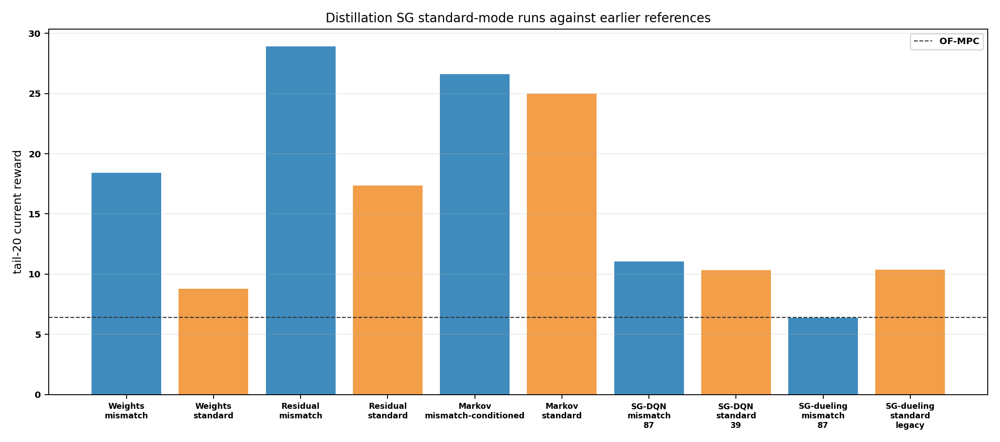
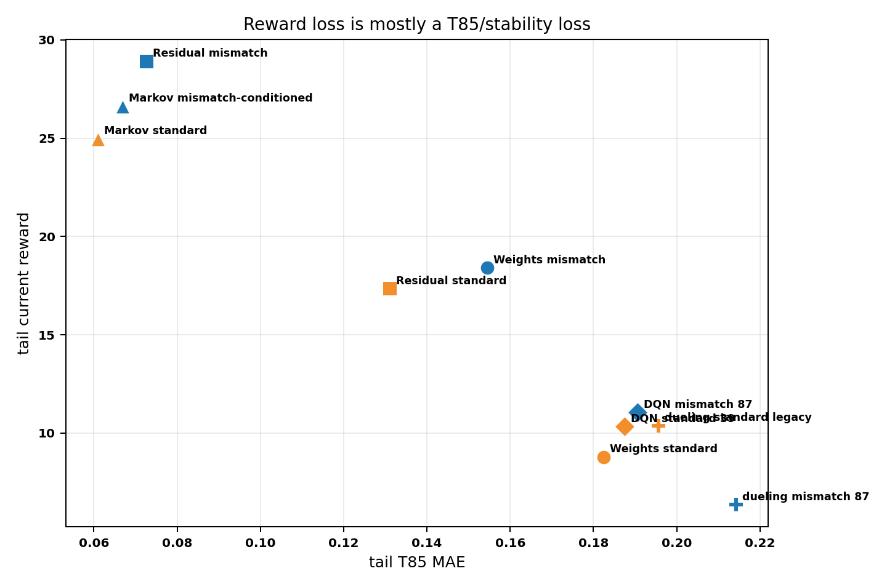
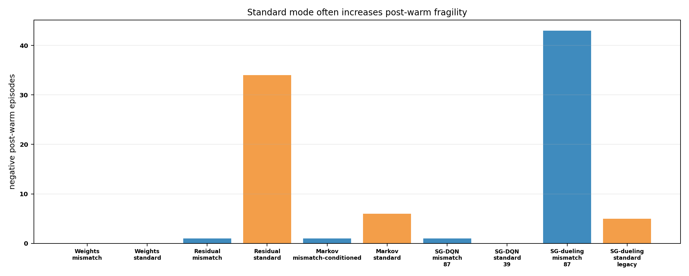
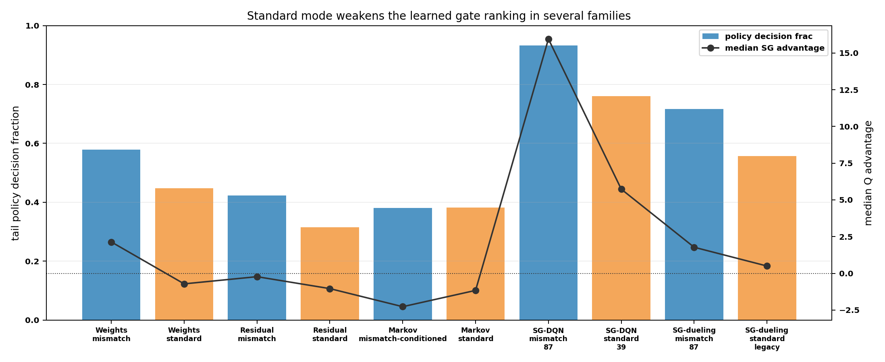
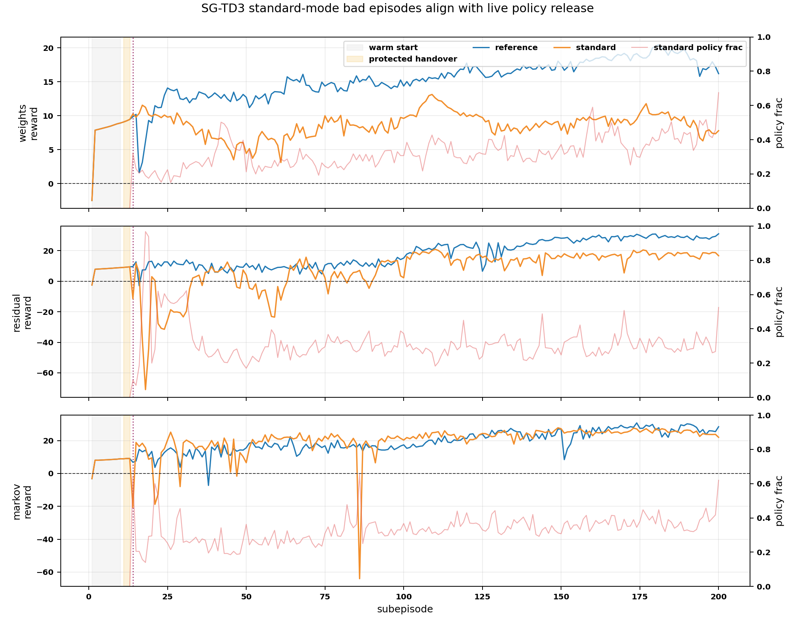
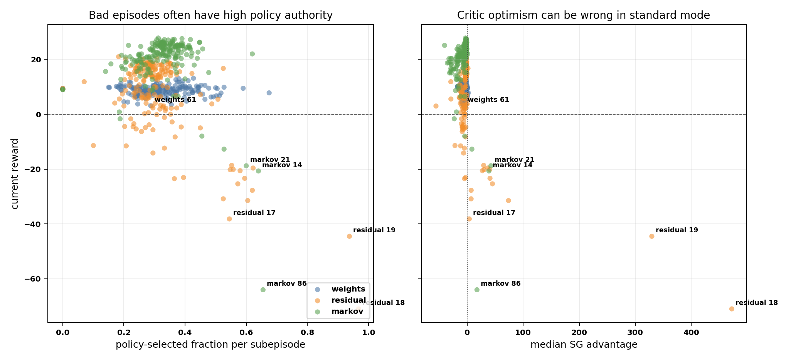
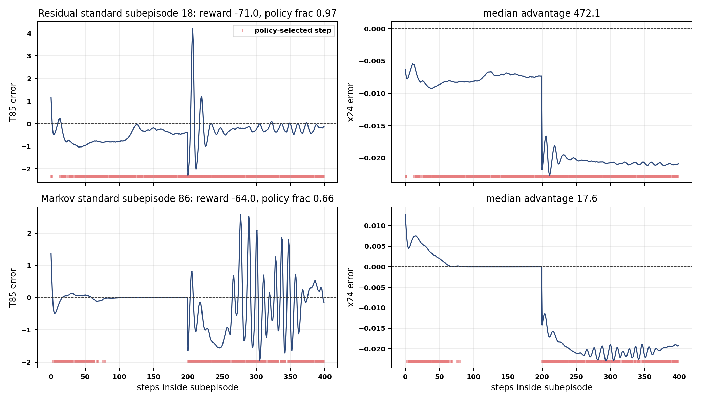

# Distillation Standard-Mode SG Runner Analysis

Date: 2026-06-05

## Objective

Analyze the completed distillation supervisor-gated standard-mode runs and decide whether the weaker results are caused by using standard observations or by other confounding changes.

No Aspen run was launched for this analysis. All metrics come from saved `input_data.pkl` bundles under `Distillation/Results/`.

## Files Inspected

- `Distillation/Results/distillation_weights_sg_td3_critic_warm3_margin0_sup001_gauss015_003_manual_off_disturb_fluctuation_standard/20260605_105053/input_data.pkl`
- `Distillation/Results/distillation_residual_sg_td3_critic_warm3_manual_off_disturb_fluctuation_standard_no_rho/20260605_110345/input_data.pkl`
- `Distillation/Results/distillation_markov_sg_td3_critic_warm3_ls_else_mpc_shadow_disturb_fluctuation_standard/20260605_114125/input_data.pkl`
- `Distillation/Results/distillation_horizon_sg_dqn_critic_warm3_default_ofmpc_eps02_002_disturb_fluctuation_standard_np6_11_nc3_11/20260605_105331/input_data.pkl`
- `Distillation/Results/distillation_dueling_horizon_sg_dqn_aspen6_legacyreward_critic_warm3_default_ofmpc_eps02_002_disturb_fluctuation_standard/20260605_105758/input_data.pkl`
- Earlier SG reference bundles for weights, residual, Markov, SG-DQN, and SG-dueling.
- `TD3Agent/supervisor_gated_agent.py`
- `utils/supervisor_gated_action.py`
- `report/scripts/analyze_distillation_standard_mode_sg_20260605.py`
- `report/figures/distillation_standard_mode_sg_20260605/distillation_standard_mode_sg_td3_episode_diagnostics.csv`
- `report/figures/distillation_standard_mode_sg_20260605/distillation_standard_mode_sg_td3_worst_episodes.csv`

## Method

The standard observation removes the explicit mismatch features that were used to tell the agent how the observer/model prediction disagreed with the plant. Conceptually:

$$ s_{\mathrm{std},k} = [x_{\mathrm{aug},k}^{\mathrm{scaled}},\, y_{\mathrm{sp},k}^{\mathrm{scaled}},\, u_{k-1}^{\mathrm{scaled}}]. $$

The mismatch observation adds innovation and tracking-error features:

$$ s_{\mathrm{mis},k} = [s_{\mathrm{std},k},\, \tilde{e}_{\mathrm{innov},k},\, \tilde{e}_{\mathrm{track},k}]. $$

For a high-order distillation column, those extra features are not just decorative. They carry information about hidden tray/composition lag, model error, disturbance response, and whether the current output deviation is due to setpoint motion or plant/model mismatch.

All runs below are rescored with the current reward definition so reward values are comparable across saved bundles.

## Summary Table

| Method | State / variant | Tail reward | Delta vs OF-MPC | Final reward | Worst post-warm | Negative post-warm eps | Tail T85 MAE | Tail x24 MAE | Policy decision frac | Median SG advantage |
|---|---|---:|---:|---:|---:|---:|---:|---:|---:|---:|
| OF-MPC | baseline | `6.391` | `0.000` | `6.926` | `4.488` | `0` | `0.1921` | `0.001545` | `NA` | `NA` |
| Weights SG-TD3 | mismatch | `18.412` | `+12.021` | `16.195` | `1.627` | `0` | `0.1545` | `0.001216` | `0.579` | `2.137` |
| Weights SG-TD3 | standard | `8.774` | `+2.383` | `7.795` | `3.111` | `0` | `0.1824` | `0.001561` | `0.448` | `-0.718` |
| Residual SG-TD3 | mismatch | `28.916` | `+22.525` | `31.090` | `-2.910` | `1` | `0.0726` | `0.001141` | `0.424` | `-0.229` |
| Residual SG-TD3 | standard | `17.351` | `+10.960` | `16.728` | `-70.970` | `34` | `0.1312` | `0.001531` | `0.315` | `-1.042` |
| Markov SG-TD3 | mismatch-conditioned | `26.622` | `+20.232` | `28.426` | `-7.284` | `1` | `0.0669` | `0.001117` | `0.381` | `-2.272` |
| Markov SG-TD3 | standard | `24.970` | `+18.579` | `22.002` | `-64.004` | `6` | `0.0610` | `0.001293` | `0.383` | `-1.163` |
| SG-DQN horizon | mismatch 87 actions | `11.058` | `+4.668` | `14.042` | `-0.438` | `1` | `0.1907` | `0.000940` | `0.933` | `15.961` |
| SG-DQN horizon | standard 39 actions | `10.342` | `+3.952` | `12.459` | `6.479` | `0` | `0.1875` | `0.001006` | `0.760` | `5.730` |
| SG-dueling horizon | mismatch 87 actions | `6.354` | `-0.037` | `4.915` | `-8.914` | `43` | `0.2142` | `0.001448` | `0.717` | `1.776` |
| SG-dueling horizon | standard legacy | `10.383` | `+3.993` | `9.374` | `-8.642` | `5` | `0.1956` | `0.000857` | `0.558` | `0.497` |

## Pairwise Effects

| Comparison | Tail reward delta | T85 MAE delta | Negative post-warm delta | Policy decision frac delta | Median advantage delta | Confounded? |
|---|---:|---:|---:|---:|---:|---|
| Weights standard vs weights mismatch | `-9.638` | `+0.0279` | `0` | `-0.131` | `-2.855` | No |
| Residual standard vs residual mismatch | `-11.565` | `+0.0586` | `+33` | `-0.109` | `-0.813` | No |
| Markov standard vs Markov mismatch-conditioned | `-1.652` | `-0.0059` | `+5` | `+0.002` | `+1.109` | No |
| SG-DQN standard 39 vs SG-DQN mismatch 87 | `-0.716` | `-0.0031` | `-1` | `-0.173` | `-10.231` | Yes |
| SG-dueling standard legacy vs SG-dueling mismatch 87 | `+4.029` | `-0.0187` | `-38` | `-0.159` | `-1.279` | Yes |

The strongest clean evidence is weights and residual. Removing mismatch features sharply reduces reward and worsens T85. In residual, standard mode also creates many more bad post-warm episodes.

Markov is less harmed because the Markov runner still appends Markov-specific information, such as the previous correction, LS correction, LS score, and drift diagnostics. So it is not a pure base-only standard observation.

The horizon comparisons are confounded. SG-DQN standard also changed the action grid from `87` to `39`, and the Aspen-6 legacy SG-dueling run changed reward parameters and Aspen preset. These should not be used as pure evidence against standard mode.

## SG-TD3 Episode-Level Failure Diagnosis

For the SG-TD3 families, the saved traces allow a more precise diagnosis than the tail averages. The older SG-TD3 gate scores a candidate action as:

$$ S(a_k) = \min(Q_1(s_k,a_k),Q_2(s_k,a_k)) - \lambda_{\mathrm{gap}} |Q_1(s_k,a_k)-Q_2(s_k,a_k)| - \lambda_{\mathrm{sup}}\|a_k-a_{\mathrm{sup},k}\|_2^2 - \lambda_{\mathrm{prev}}\|a_k-a_{k-1}\|_2^2. $$

The policy executes when:

$$ S(a_{\mathrm{pol},k}) > S(a_{\mathrm{sup},k}) + m. $$

In these distillation SG-TD3 runs, the wrapper used 10 warm-start subepisodes and 3 protected post-warm subepisodes, so subepisode 14 is the first nominal live-release subepisode. The worst standard-mode episodes are all in the live phase.

| Family | Standard bad subepisode | Standard reward | Reference same subepisode | Standard policy frac | Reference policy frac | Standard median advantage | Reference median advantage | Main symptom |
|---|---:|---:|---:|---:|---:|---:|---:|---|
| Weights | 61 | `3.11` | `13.47` | `0.288` | `0.415` | `-6.31` | `-1.49` | under-helped T85 tracking |
| Residual | 18 | `-70.97` | `7.51` | `0.968` | `0.018` | `472.11` | `-280.86` | bad residual takeover |
| Residual | 19 | `-44.50` | `12.79` | `0.938` | `0.013` | `329.51` | `-229.87` | bad residual takeover |
| Markov | 14 | `-20.68` | `6.83` | `0.640` | `0.030` | `38.88` | `-155.56` | first-live-release false positive |
| Markov | 86 | `-64.00` | `17.86` | `0.655` | `0.055` | `17.60` | `-152.63` | later false-positive correction |

The failure mechanisms are different by family:

- **Weights SG-TD3 standard did not catastrophically collapse.** It mostly failed by becoming less useful. In its worst episode, reward was `3.11` versus `13.47` for the mismatch run at the same subepisode. T85 MAE rose from `0.167` to `0.208`, while the gate selected fewer policy actions and had a negative median advantage. This looks like state aliasing made the learned weight policy/gate too weak or poorly timed.
- **Residual SG-TD3 standard failed through false-positive authority.** In subepisode 18, the gate selected policy on `96.8%` of steps, median advantage was `+472`, and the executed action was far from the zero supervisor. The plant then went outside the reward band for the whole subepisode, with T85 MAE `0.479` and x24 MAE `0.0141`. The mismatch reference at the same subepisode selected policy only `1.8%` of the time and kept reward positive.
- **Markov SG-TD3 standard failed similarly, but with sparse episodes.** Subepisode 14 is especially important because it is the first live-release subepisode. The gate selected policy `64.0%` of the time with median advantage `+38.9`, while the mismatch-conditioned reference selected policy only `3.0%` with median advantage `-155.6`. The later subepisode 86 repeats the same pattern with an even worse reward.

So the issue is not just "standard mode makes reward lower." The deeper issue is that standard mode creates aliased critic states for the distillation column. The critic sometimes sees a state that looks acceptable in the reduced observation but corresponds to a hidden tray/composition transient where the same continuous correction is bad. Mismatch-conditioned states gave the critic enough information to reject the same kind of action.

This also explains why polymer survived standard mode better. In the tested polymer region, the local dynamics appear less hidden and less delayed, so the base scaled augmented state is often enough for the gate. The distillation column has slower distributed internal dynamics, so removing mismatch/innovation cues makes the continuous-action critic overconfident in exactly the episodes where it should be conservative.

## Interpretation

Standard mode is probably a real reason the distillation SG-TD3 weights and residual runs got worse. It removes the agent's direct view of plant-model mismatch and tracking context. In a distillation column, that context matters because the output response is slower, more distributed, and more nonlinear than the local polymer region.

Your polymer intuition is consistent with the data. Polymer can survive standard mode because the tested operating region appears locally easier. The scaled augmented state and setpoint may already encode enough information for the gate to rank actions. Distillation is different: tray composition and temperature react through a long internal profile, so two states with similar standard observations can have different future behavior depending on recent innovation and tracking error.

The poor standard-mode results are not only "nonlinearity" in a broad sense. The failure mechanism is more specific:

- standard observations reduce observability of disturbance/model mismatch,
- the learned gate's policy advantage weakens or becomes negative,
- the gate accepts fewer useful actions or accepts them at worse times,
- T85 tracking degrades,
- and post-warm reward becomes fragile.

For example, weights SG-TD3 loses `9.64` tail reward and its median SG advantage changes from `+2.14` to `-0.72`. Residual SG-TD3 loses `11.56` tail reward and negative post-warm episodes rise from `1` to `34`.

## Recommendation

Do not abandon standard mode everywhere, but do not use it as the main distillation state for weights and residual. For distillation SG-TD3:

- keep mismatch features for weights and residual,
- keep Markov either mismatch-conditioned or explicitly compare standard versus base-only Markov as a separate ablation,
- keep reduced-grid standard SG-DQN as a stability ablation, because it did improve handover stability despite slightly lower reward,
- keep the Aspen-6 legacy dueling runner as a diagnostic, not as a clean standard-mode proof.

The next clean experiment should be a hybrid distillation observation:

$$ s_{\mathrm{hybrid},k} = [s_{\mathrm{std},k},\, \tilde{e}_{\mathrm{innov},k},\, \tilde{e}_{\mathrm{track},k}], $$

but with fewer or clipped mismatch features if the full mismatch state feels too engineered. This preserves the information that distillation needs without returning to unnecessary complexity.

For SG-TD3 specifically, do not expect a critic-dominance rule alone to fix the standard-mode residual/Markov failures. In the bad episodes, both critics were often optimistic about the policy action in the reduced state. A safer TD3 ablation would combine a longer hidden critic/actor handover with the hybrid observation, then check whether the first-live subepisodes no longer show high policy fractions with positive advantage and negative reward.

## Remaining Uncertainty

The conclusion is strongest for weights and residual because those are close standard-versus-mismatch comparisons. It is weaker for horizon and dueling because grid, reward, and Aspen preset changed. A fully clean horizon standard/mismatch comparison would rerun the same grid and reward in both state modes.
