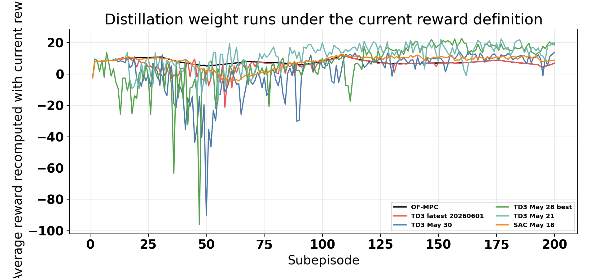
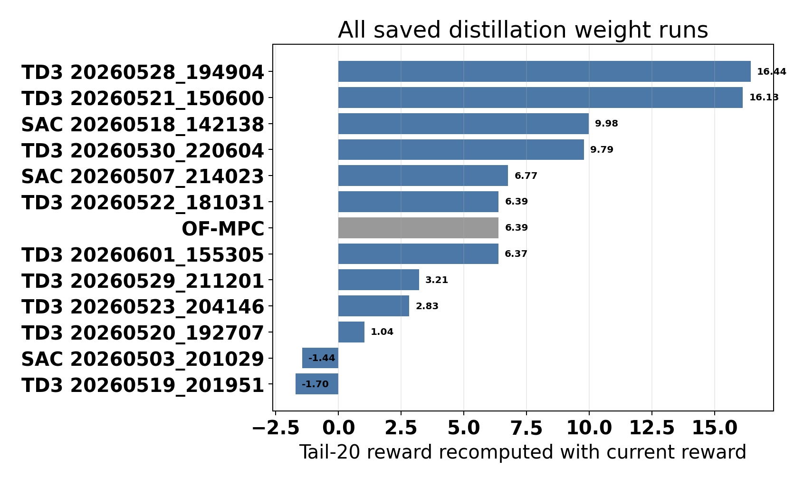
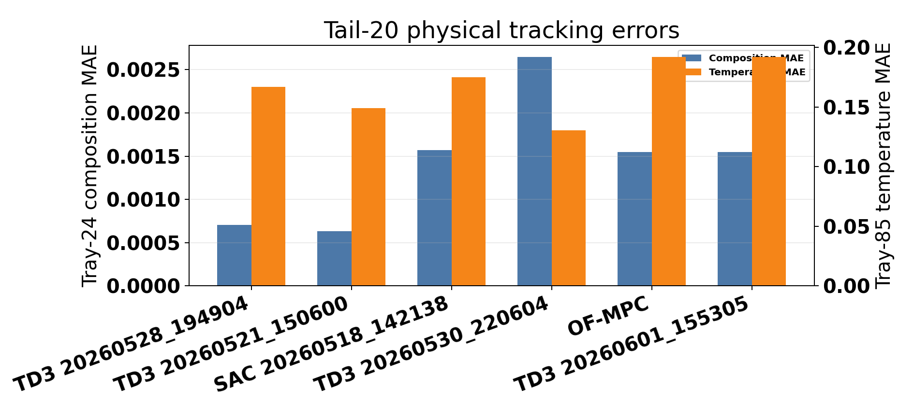
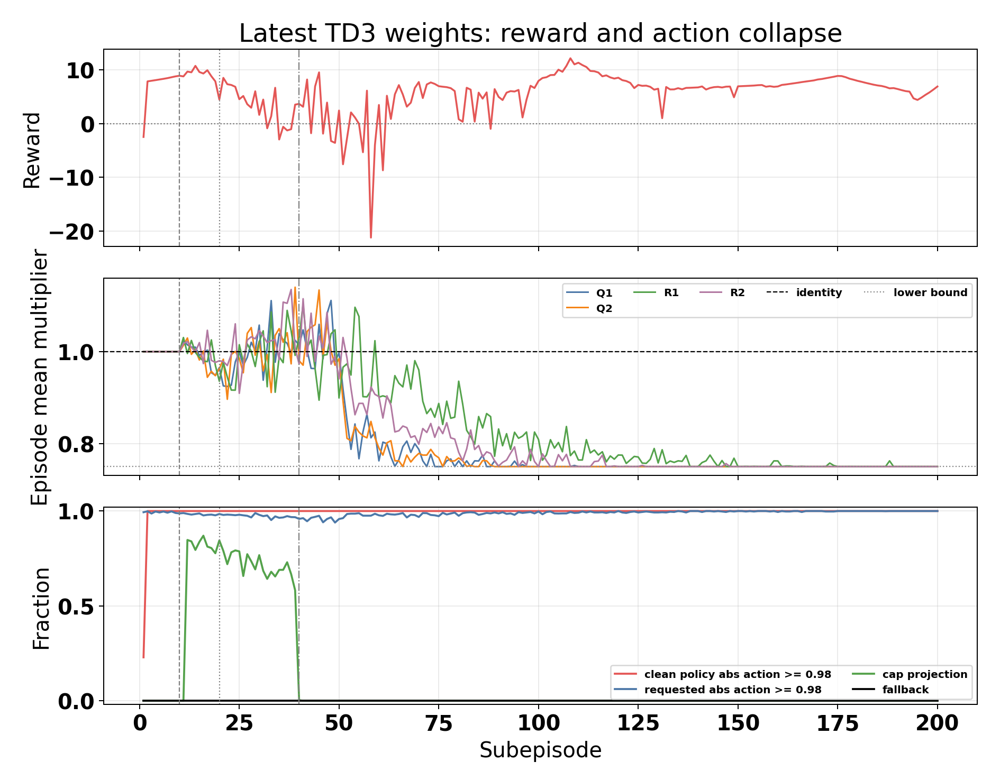
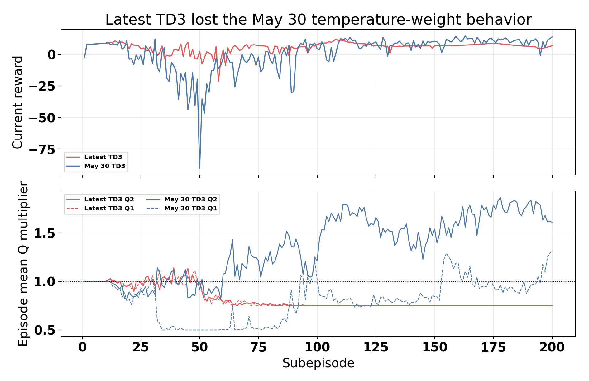

# Latest Distillation Weight-Multiplier Failure Analysis

Date: 2026-06-01  
Case study: Aspen C2 splitter distillation column  
Scenario: `run_mode = "disturb"`, `disturbance_profile = "fluctuation"`  
Method family: weight-multiplier RL supervisor  
Latest run: `Distillation/Results/distillation_weights_td3_disturb_fluctuation_mismatch_unified/20260601_155305/input_data.pkl`

## Objective

This report analyzes why the latest distillation weight-multiplier run performed poorly relative to earlier weight runs. The specific question is whether the failure is mainly caused by the reward, multiplier range, implementation, exploration noise, or the TD3 algorithm itself, and whether SAC should be preferred.

The main conclusion is that the latest run is not a tracking disaster relative to OF-MPC. It is a learned no-op. The TD3 actor saturates all four raw actions at the lower bound, producing nearly equal multipliers:

$$ m_{\mathrm{tail}} \approx [0.75,\ 0.75,\ 0.7506,\ 0.75]. $$

Scaling all Q and R penalties by nearly the same constant leaves the MPC optimizer almost unchanged. The result is essentially OF-MPC-level tracking, but much worse than the best historical weight runs.

## Files Inspected

Implementation and configuration:

- `distillation_RL_assisted_MPC_weights_unified.py`
- `utils/weights_runner.py`
- `utils/agent_step_runtime.py`
- `utils/behavioral_cloning.py`
- `TD3Agent/agent.py`
- `SACAgent/sac_agent.py`
- `utils/rewards.py`
- `systems/distillation/config.py`
- `systems/distillation/notebook_params.py`

Latest and comparison bundles:

- `Distillation/Results/distillation_weights_td3_disturb_fluctuation_mismatch_unified/20260601_155305/input_data.pkl`
- `Distillation/Results/distillation_compare_weights_td3_disturb_fluctuation_mismatch/20260601_155314/input_data.pkl`
- `Distillation/Data/mpc_results_disturb_fluctuation.pickle`

Historical weight bundles:

- all TD3 bundles under `Distillation/Results/distillation_weights_td3_disturb_fluctuation_mismatch_unified/`
- all SAC bundles under `Distillation/Results/distillation_weights_sac_disturb_fluctuation_mismatch_unified/`

Generated analysis artifacts:

- `report/scripts/analyze_distillation_weights_latest_20260601.py`
- `report/figures/distillation_weights_latest_20260601/weight_run_summary.csv`
- `report/figures/distillation_weights_latest_20260601/selected_tail_metrics.csv`
- `report/figures/distillation_weights_latest_20260601/selected_episode_profiles.csv`
- `report/figures/distillation_weights_latest_20260601/analysis_summary.json`

## Current Method

The controlled outputs are tray-24 ethane composition and tray-85 temperature:

$$ y_k = [x_{24,\mathrm{C2H6},k}, T_{85,k}]^\top. $$

The manipulated inputs are reflux flow and reboiler duty:

$$ u_k = [F_{\mathrm{reflux},k}, Q_{\mathrm{reb},k}]^\top. $$

The weight actor outputs a normalized action:

$$ a_k \in [-1,1]^4. $$

The action is mapped to four MPC penalty multipliers:

$$ m_k = m_{\min} + \frac{a_k + 1}{2}(m_{\max} - m_{\min}). $$

The latest run used:

$$ m_{\min} = [0.75,\ 0.75,\ 0.75,\ 0.75],\qquad m_{\max} = [2.0,\ 2.0,\ 2.0,\ 2.0]. $$

The corresponding identity raw action is not zero. It is:

$$ a_{\mathrm{id}} = 2\frac{1-m_{\min}}{m_{\max}-m_{\min}} - 1 = [-0.6,\ -0.6,\ -0.6,\ -0.6]. $$

At each step, MPC solves with:

$$ Q_k = \mathrm{diag}(m_{Q1,k}Q_1,\ m_{Q2,k}Q_2),\qquad R_k = \mathrm{diag}(m_{R1,k}R_1,\ m_{R2,k}R_2). $$

If all four multipliers are nearly the same scalar `c`, the MPC objective is approximately multiplied by `c`:

$$ J_k(m \approx c\mathbf{1}) \approx cJ_k(\mathbf{1}). $$

That does not materially change the optimizer. This is why the latest lower-bound action is effectively a nominal-MPC copy, not a useful new weight schedule.

The reward is the current relative-band reward. For each physical setpoint component:

$$ b_i = \max(k_{\mathrm{rel},i}|y_{\mathrm{sp},i}|,\ b_{\mathrm{floor},i}). $$

The active reward settings are:

- `Q_diag = [3.7e4, 2.0e4]`
- `R_diag = [2.5e3, 2.5e3]`
- `k_rel = [0.3, 0.01]`
- `band_floor_phys = [0.003, 0.2]`
- `reward_scale = 1.0`

Because the temperature reward weight was changed on 2026-05-30, all historical runs in this report were recomputed from saved `delta_y_storage`, `delta_u_storage`, and physical setpoints under the current reward definition.

## Evidence

### Reward Trajectories



The latest TD3 run stays near OF-MPC in the tail and no longer shows the useful May 30 temperature-improving behavior.

### Tail Reward Ranking



The latest run is not competitive with the best historical TD3 runs after recomputing rewards under the current objective.

### Tail Tracking Errors



The latest TD3 run and OF-MPC have essentially identical tail physical tracking.

### Latest Action Collapse



The latest run's clean policy and requested action saturate at the lower raw-action bound. Cap projection and fallback are inactive in the tail, so this is the actor's accepted action, not a safety override.

### Latest Versus May 30



May 30 used a distinct high-temperature-penalty strategy. The latest run loses that behavior and collapses toward the common lower multiplier bound.

## Main Metrics

Tail metrics use episodes 181 to 200. Rewards for all rows are recomputed under the current reward definition.

| Run | Tail reward | Final reward | Comp MAE | Temp MAE | Band MAE | Outside-band frac | Tail multipliers |
| --- | ---: | ---: | ---: | ---: | ---: | ---: | --- |
| TD3 20260528 | `16.443` | `19.773` | `0.000706` | `0.1669` | `0.4358` | `0.1239` | `[1.407, 1.401, 1.381, 1.240]` |
| TD3 20260521 | `16.128` | `18.507` | `0.000630` | `0.1492` | `0.3902` | `0.1031` | `[1.478, 1.394, 0.843, 1.094]` |
| SAC 20260518 | `9.980` | `8.921` | `0.001570` | `0.1752` | `0.5624` | `0.1657` | `[1.003, 1.050, 1.040, 1.020]` |
| TD3 20260530 | `9.794` | `13.857` | `0.002648` | `0.1306` | `0.6165` | `0.1936` | `[1.012, 1.739, 1.414, 1.557]` |
| OF-MPC | `6.391` | `6.926` | `0.001545` | `0.1921` | `0.5833` | `0.1633` | identity |
| TD3 20260601 latest | `6.375` | `6.924` | `0.001545` | `0.1921` | `0.5834` | `0.1633` | `[0.750, 0.750, 0.751, 0.750]` |

Latest TD3 versus OF-MPC:

- Tail reward delta: `-0.016`
- Final reward delta: `-0.0026`
- Composition MAE ratio: `1.00017`
- Temperature MAE ratio: `1.00019`
- Band-normalized MAE ratio: `1.00018`

Latest TD3 versus May 30 TD3:

- Tail reward delta: `-3.420`
- Temperature MAE worsened by `+0.0615`
- Composition MAE improved by `-0.00110`, but this is because the run reverted toward OF-MPC-like behavior rather than learning a balanced superior controller
- Tail raw-action saturation increased from `0.205` to `0.99997`
- Tail boundary fraction increased from `0.504` to `1.000`

## Diagnosis

### 1. It Is Not Mainly A Reward Bug

The current reward distinguishes better runs clearly:

- TD3 20260528 reaches current tail reward `16.443`
- TD3 20260521 reaches current tail reward `16.128`
- SAC 20260518 reaches current tail reward `9.980`
- latest TD3 reaches only `6.375`
- OF-MPC is `6.391`

So the current reward can recognize superior weight policies. The latest actor simply did not find one.

The May 30 temperature reward increase did change the ranking of older runs, which is why stored historical scalar rewards should not be compared directly. After recomputation, the best historical TD3 run is May 28, not the May 30 run.

### 2. The Range Contributed, But Range Alone Is Not The Whole Cause

The latest range is `[0.75, 2.0]`, while the May 30 run used `[0.5, 2.5]`. The latest actor collapsed to the lower corner of the narrower range. That lower corner is a common scaling of Q and R, so it has almost no closed-loop authority.

However, the range is not impossible. TD3 20260528 also used `[0.75, 2.0]` and achieved tail reward `16.443` under the current reward with useful nonuniform multipliers. Therefore the range is a contributing factor, not a complete explanation.

The stronger issue is that the action parameterization includes a redundant common-scaling direction. The actor can saturate along that direction without changing the MPC controller much.

### 3. It Is Not Evidence Of A Plant Noise Injection Bug

The latest logs separate requested, post-handoff, post-cap, and executed actions.

During the tail:

- `weight_requested_action_raw_log` is almost exactly `[-1, -1, -1, -1]`
- `weight_executed_action_raw_log` is also almost exactly `[-1, -1, -1, -1]`
- cap projection fraction is `0.0`
- fallback fraction is `0.0`
- action source is accepted TD3

So the tail behavior is not caused by a safety layer overwriting the action or noise being added after safety. The actor itself is selecting the lower corner.

There is still a training-design risk involving exploration: with BC handoff enabled, the runner calls `agent.take_action(..., explore=True)` during the warm-start period while the executed action is held at identity. This means parameter-noise actions are sampled and the actor is trained while the replay buffer contains mostly identity behavior. That can make the deterministic actor chase critic extrapolation outside the executed-action distribution.

### 4. The Warm-Start Actor Is Already Collapsing

The latest clean policy is already near the lower corner during warm start:

- warm clean-policy raw-action saturation: `0.923`
- warm requested raw-action saturation: `0.993`
- warm executed action: identity
- BC is active during warm start

So the actor is not becoming bad only after release. It is already release-unready, but the release gate is diagnostic only. In the tail, `release_gate_blocked_log = 1.0`, but `live_blocking_enabled = False`, so this did not affect execution.

### 5. Shadow Objective Values Are Risky For Weight Comparisons

The latest tail shadow selected-minus-identity objective is slightly negative, but this is not strong evidence that the selected weights are better. If all penalties are scaled down, the raw MPC objective value can decrease simply because the objective itself was rescaled.

The more reliable diagnostic is first-move difference:

- latest tail shadow first-move delta norm: `3.22e-06`

This confirms that the lower-bound action changes the first MPC move by essentially nothing.

## Is SAC Better?

SAC should be tested as a diagnostic and likely as a serious alternative, but the evidence does not say to abandon TD3 completely.

The best saved SAC run, `20260518_142138`, has current-reward tail score `9.980`, which is better than OF-MPC and better than the latest TD3 run. It also keeps tail multipliers close to identity:

$$ m_{\mathrm{SAC,tail}} \approx [1.003,\ 1.050,\ 1.040,\ 1.020]. $$

That is a useful sign. SAC's entropy-regularized actor is less prone to deterministic lower-corner collapse in the saved runs.

However, the best saved TD3 run is still much better:

- best TD3 current tail reward: `16.443`
- best SAC current tail reward: `9.980`

So the next step should not be "replace TD3 with SAC" as a conclusion. The better conclusion is:

1. Run a current SAC weights experiment with the current reward and full modern diagnostics.
2. Fix the TD3 release and action-parameterization problem.
3. Compare SAC and corrected TD3 under the same reward, same range, same disturbance profile, and same logging.

## Bugs, Inconsistencies, And Risks Found

1. The latest TD3 weight policy collapses to a redundant common-scale direction.
   This is the main failure mode. It creates OF-MPC-like behavior while looking like a nontrivial lower-bound action.

2. Actor training during warm start is risky.
   The actor is updated while executed replay actions are identity. The deterministic actor can exploit critic extrapolation before real non-identity data exists.

3. The release gate detects non-readiness but is diagnostic only.
   The latest tail gate-blocked fraction is `1.0`, but it does not block. Turning it on directly may be too conservative, but ignoring it lets the collapsed policy execute.

4. Shadow objective comparisons are not normalized for changing Q and R scale.
   A lower objective can be caused by multiplying the objective by a smaller constant. First-move differences are more reliable for weight-multiplier diagnostics.

5. The saved weight bundles do not consistently store `reward_params`.
   This report recomputed rewards from `systems/distillation/config.py`. For long-term provenance, each bundle should store the exact reward parameter dictionary used during the run.

6. `y` is physical but `y_sp` is scaled deviation in the saved bundles.
   Any metric script must inverse-scale `y_sp` before computing physical tracking errors. Otherwise the error numbers are meaningless.

## Recommended Next Experiments

### 1. TD3 Weight Critic-Warm Or SG-TD3 Weight Gate

Purpose: stop the actor from moving to an extrapolated corner before non-identity actions are supported by the critic.

Change:

- add a distillation SG-TD3 weight entrypoint, or add a critic-only warm phase to the existing weight runner
- execute identity during warm start
- train the critic on identity data
- freeze the actor during warm start and early critic warm-up
- then let the policy execute only if a critic gate prefers it over the identity supervisor

Metrics:

- clean-policy saturation during warm start
- policy-selected fraction after release
- tail reward
- tail first-move delta from identity
- tail composition and temperature MAE

Success:

- tail reward above OF-MPC
- tail policy-selected fraction not near zero
- clean-policy saturation below the latest `1.0` tail value
- no collapse to common lower-bound multipliers

### 2. Remove Or Penalize Common-Scale Weight Directions

Purpose: eliminate the redundant action direction where all Q and R multipliers move together.

Change options:

- reparameterize actions as relative Q/R ratios plus one optional bounded aggressiveness scalar
- normalize multipliers so their geometric mean stays near one
- add an action regularizer that penalizes common-mode movement and boundary saturation
- explicitly log `mean(log m)` and ratio features such as `Q2/Q1`, `R1/Q1`, and `R2/Q1`

Metrics:

- common-scale index
- Q/R ratio variation
- first-move delta from identity
- tail reward and tracking

Success:

- actor no longer converges to `[0.75, 0.75, 0.75, 0.75]`
- useful first-move differences appear without large tracking degradation

### 3. Run A Current SAC Weight Test

Purpose: test whether entropy regularization avoids deterministic corner collapse under the current reward and current diagnostics.

Change:

- run `distillation_RL_assisted_MPC_weights_unified.py` with `AGENT_KIND = "sac"`
- keep `run_mode = "disturb"` and `disturbance_profile = "fluctuation"`
- keep the current reward and `[0.75, 2.0]` multiplier range for the first fair test
- add the same action-layer logs for SAC if missing

Metrics:

- current-reward tail score
- tail multiplier boundary fraction
- entropy or log-probability traces
- tail physical tracking

Success:

- tail reward above OF-MPC and latest TD3
- no all-coordinate boundary collapse
- temperature MAE below OF-MPC without composition MAE exploding

### 4. Rerun The Best Historical TD3 Settings Under The Current Code

Purpose: determine whether May 28 performance is reproducible or a one-off random/training outcome.

Change:

- replay the current default code with the same high-level settings as `20260528_194904`
- set an explicit seed
- save `reward_params`
- preserve full action-layer logs

Metrics:

- current-reward tail score
- tail multipliers
- clean-policy saturation
- reward collapse windows

Success:

- tail reward near `16`
- balanced multipliers above identity instead of common lower-bound collapse

## Remaining Uncertainty

The analysis is from saved single-run trajectories, not a seed sweep. The evidence is strong for the latest run's mechanism because the action logs are unambiguous, but it does not prove whether TD3 will always collapse under these settings.

The best historical TD3 runs need reproducibility checks under fixed seeds. SAC looks promising as a stability diagnostic, but only a current SAC run with the same reward and logging can answer whether it should become the default weight agent.

## Files Changed

- `report/scripts/analyze_distillation_weights_latest_20260601.py`
- `report/distillation_weight_latest_failure_analysis_2026_06_01.md`
- `report/figures/distillation_weights_latest_20260601/analysis_summary.json`
- `report/figures/distillation_weights_latest_20260601/selected_episode_profiles.csv`
- `report/figures/distillation_weights_latest_20260601/selected_tail_metrics.csv`
- `report/figures/distillation_weights_latest_20260601/weight_run_summary.csv`
- `report/figures/distillation_weights_latest_20260601/fig_current_reward_trajectories.png`
- `report/figures/distillation_weights_latest_20260601/fig_latest_action_layers.png`
- `report/figures/distillation_weights_latest_20260601/fig_latest_vs_may30_multipliers.png`
- `report/figures/distillation_weights_latest_20260601/fig_tail20_reward_ranking.png`
- `report/figures/distillation_weights_latest_20260601/fig_tail_tracking_errors.png`

## How To Verify

Run:

```powershell
& 'C:\Users\hamediaa\.conda\envs\rl-env\python.exe' 'report/scripts/analyze_distillation_weights_latest_20260601.py'
```

Then inspect:

- `report/figures/distillation_weights_latest_20260601/analysis_summary.json`
- `report/figures/distillation_weights_latest_20260601/weight_run_summary.csv`
- `report/figures/distillation_weights_latest_20260601/fig_latest_action_layers.png`
