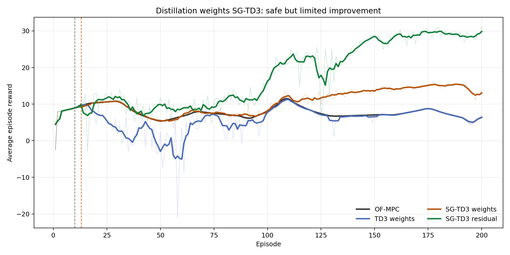
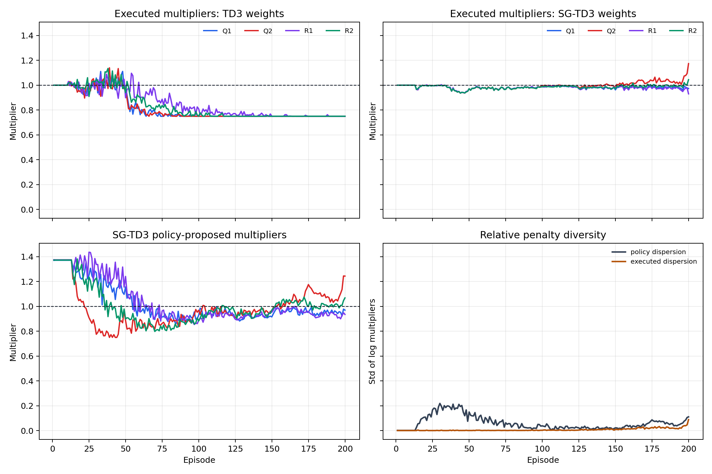
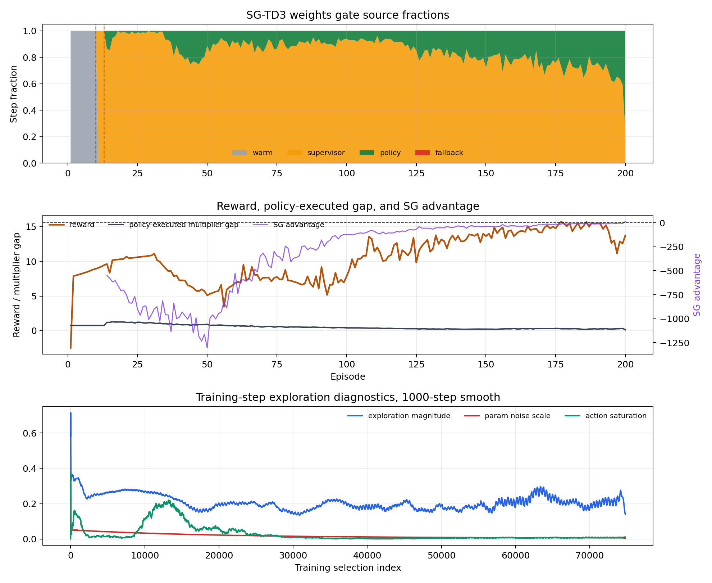
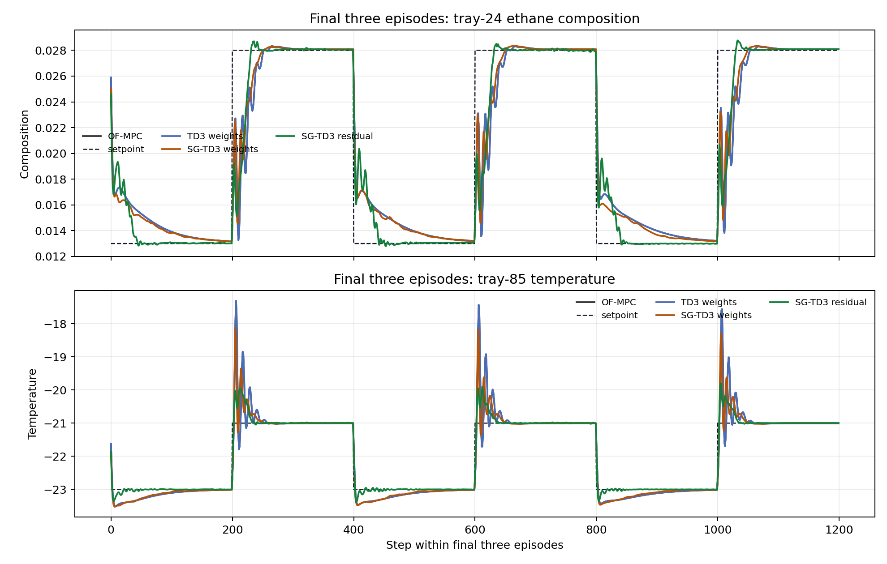
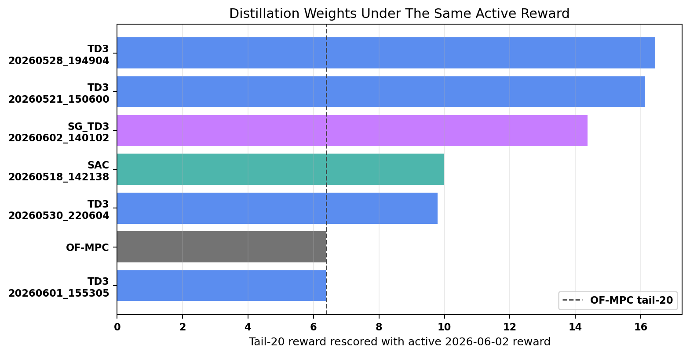
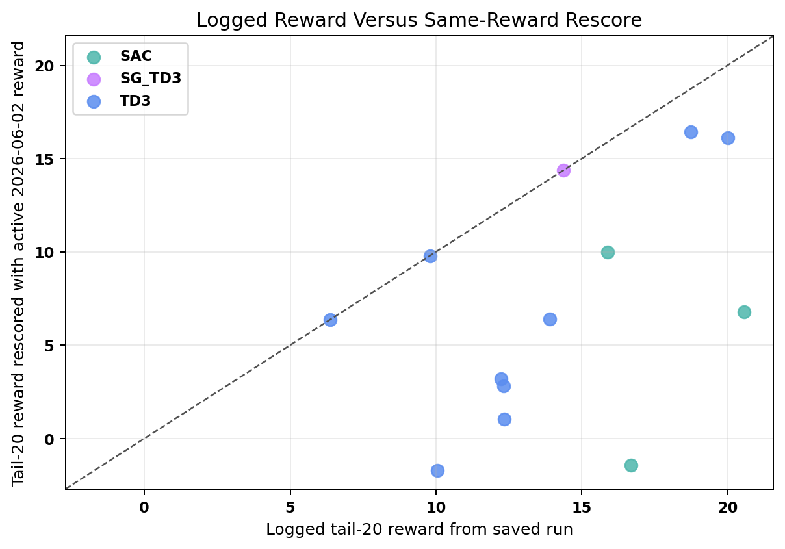
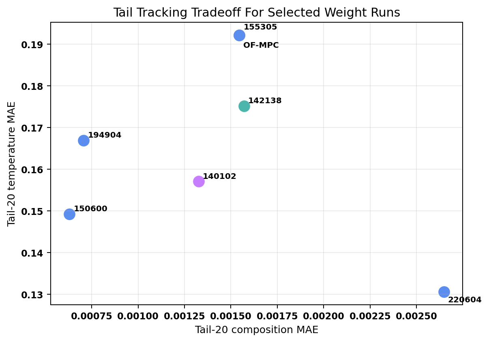

# Distillation Weight SG-TD3 Diagnosis And Next Experiments

Date: 2026-06-02

Case study: Aspen Dynamics C2 splitter distillation column

Scenario: `run_mode = "disturb"`, fluctuation feed-flow disturbance

Run analyzed: `distillation_weights_sg_td3_critic_warm3_manual_off_disturb_fluctuation_mismatch`

## Executive Summary

Your read is right: the safety is acceptable, but the result is not satisfying.

The SG-TD3 weight run is safe and improves over OF-MPC:

- OF-MPC tail-20 reward: `6.39`
- SG-TD3 weights tail-20 reward: `14.37`
- SG-TD3 weights worst post-warm reward: `3.46`
- SG-TD3 weights tail temperature MAE: `0.1571`, versus OF-MPC `0.1921`

But it is not close to the residual SG-TD3 run:

- SG-TD3 residual tail-20 reward: `28.92`
- SG-TD3 residual tail temperature MAE: `0.0726`
- SG-TD3 residual tail outside-band fraction: `0.0971`
- SG-TD3 weights tail outside-band fraction: `0.1394`

The reason is not simply "no exploration." The actor did propose nontrivial multiplier vectors, especially in the early and middle run. The problem is that the SG gate rejected most of them and executed nearly identity multipliers. During episodes 41 to 120:

- policy proposal diversity: `0.1795` mean std of log multipliers
- executed multiplier diversity: only `0.0038` mean std of log multipliers
- policy selected: only `10.6%`
- supervisor selected: `89.4%`

So the policy was exploring more than the executed controller. The gate made the run safe, but it also prevented the weight policy from learning a useful relative penalty schedule until very late.

There is a second issue. When all four multipliers are almost equal, the action is close to a common scaling of the MPC objective. A common scaling is nearly a null action:

$$ J_{c\mathbf{1}}(\Delta U)=cJ_{\mathbf{1}}(\Delta U),\qquad \arg\min_{\Delta U}J_{c\mathbf{1}}(\Delta U)=\arg\min_{\Delta U}J_{\mathbf{1}}(\Delta U). $$

This explains your observation that the average multipliers look nearly the same for each penalty until the middle of the run. That behavior is safe, but it does not give MPC a meaningfully different tradeoff.

My conclusion:

1. SG-TD3 weights is too conservative for this family.
2. Parameter noise is not the only issue. The actor proposes diverse weights, but the gate does not execute them.
3. The current action basis wastes authority on a common-scale direction that barely changes the MPC solution.
4. Reward-parameter drift is real: older logged rewards are not directly comparable with the current reward.
5. Reward drift is not the whole explanation: two older TD3 weights runs still beat the June 2 SG-TD3 weights run when rescored under the active 2026-06-02 reward.
6. The next run should combine less conservative gating, better coordinate exploration, and a relative-weight action parameterization.

The most direct next ablation is now:

$$ \epsilon_A=0.0,\qquad \kappa_{\mathrm{sup}}=0.01,\qquad \rho_Q=0.5,\qquad \kappa_{\mathrm{prev}}=0.01. $$

In config names, this means `advantage_margin = 0.0`, `score_supervisor_action_weight = 0.01`, `score_uncertainty_weight = 0.5`, and `score_previous_action_weight = 0.01`.

## Files Inspected

Implementation:

- `distillation_RL_assisted_MPC_weights_supervisor_gated_td3_critic_warm_unified.py`
- `distillation_RL_assisted_MPC_weights_unified.py`
- `utils/weights_runner.py`
- `TD3Agent/supervisor_gated_agent.py`
- `TD3Agent/supervisor_replay_buffer.py`
- `utils/supervisor_gated_action.py`
- `systems/distillation/config.py`
- `systems/distillation/notebook_params.py`

Prior reports:

- `report/distillation_latest_5runner_safety_analysis_2026_05_29.md`
- `report/polymer_sg_td3_weight_residual_latest_2026_06_01.md`
- `report/distillation_residual_sg_td3_outcome_2026_06_02.md`

Result bundles:

- `Distillation/Results/distillation_weights_sg_td3_critic_warm3_manual_off_disturb_fluctuation_mismatch/20260602_140102/input_data.pkl`
- `Distillation/Results/distillation_compare_weights_sg_td3_critic_warm3_manual_off_disturb_fluctuation/20260602_140116/input_data.pkl`
- `Distillation/Results/distillation_weights_td3_disturb_fluctuation_mismatch_unified/20260601_155305/input_data.pkl`
- `Distillation/Results/distillation_residual_sg_td3_critic_warm3_manual_off_disturb_fluctuation_mismatch_no_rho/20260602_125954/input_data.pkl`
- `Distillation/Data/mpc_results_disturb_fluctuation.pickle`

Generated analysis artifacts:

- `report/scripts/analyze_distillation_weights_sg_td3_20260602.py`
- `report/scripts/analyze_distillation_weights_reward_gate_followup_20260602.py`
- `report/figures/distillation_weights_sg_td3_20260602/summary_metrics.csv`
- `report/figures/distillation_weights_sg_td3_20260602/window_metrics.csv`
- `report/figures/distillation_weights_sg_td3_20260602/sg_episode_metrics.csv`
- `report/figures/distillation_weights_sg_td3_20260602/analysis_summary.json`
- `report/figures/distillation_weights_reward_gate_followup_20260602/reward_gate_followup_summary.csv`
- `report/figures/distillation_weights_reward_gate_followup_20260602/reward_gate_selected_runs.csv`
- `report/figures/distillation_weights_reward_gate_followup_20260602/analysis_summary.json`

## Method

The distillation outputs are tray-24 ethane composition and tray-85 temperature:

$$ y_k=\begin{bmatrix}x_{24,\mathrm{C2H6},k}\\T_{85,k}\end{bmatrix}. $$

The manipulated inputs are reflux flow and reboiler duty:

$$ u_k=\begin{bmatrix}F_{\mathrm{reflux},k}\\Q_{\mathrm{reb},k}\end{bmatrix}. $$

The weight agent does not directly change the plant input. It changes the MPC penalty multipliers:

$$ m_k=\begin{bmatrix}m_{Q_1,k}&m_{Q_2,k}&m_{R_1,k}&m_{R_2,k}\end{bmatrix}^{\top}. $$

The current bounds are:

$$ m_i\in[0.75,2.0]. $$

The MPC objective becomes:

$$ J_{m_k}(\Delta U)=\sum_{j=1}^{N_p}e_{k+j}^{\top}\mathrm{diag}(m_{Q,k}\odot Q_0)e_{k+j}+\sum_{j=0}^{N_c-1}\Delta u_{k+j}^{\top}\mathrm{diag}(m_{R,k}\odot R_0)\Delta u_{k+j}. $$

The identity supervisor is:

$$ m_{\mathrm{sup}}=\mathbf{1}. $$

Because the action is stored in normalized TD3 coordinates, identity is not raw zero. With bounds `[0.75, 2.0]`, the identity raw action is:

$$ a_{\mathrm{id}}=\begin{bmatrix}-0.6&-0.6&-0.6&-0.6\end{bmatrix}^{\top}. $$

SG-TD3 compares the actor proposal against that identity supervisor. The score is:

$$ S(s,a)=\min(Q_1(s,a),Q_2(s,a))-\rho_Q\lvert Q_1(s,a)-Q_2(s,a)\rvert-\kappa_{\mathrm{sup}}\lVert a-a_{\mathrm{sup}}\rVert_2^2-\kappa_{\mathrm{prev}}\lVert a-a_{\mathrm{prev}}\rVert_2^2. $$

The current wrapper uses:

$$ \rho_Q=0.5,\qquad \kappa_{\mathrm{sup}}=0.05,\qquad \kappa_{\mathrm{prev}}=0.01,\qquad \epsilon_A=0.5. $$

The actor executes only if:

$$ S(s_k,a_{\mathrm{policy},k})-S(s_k,a_{\mathrm{sup},k})>\epsilon_A. $$

Otherwise, SG-TD3 executes identity weights.

## Configuration Verified

| Field | Value |
| --- | --- |
| `agent_kind` | `sg_td3` |
| `notebook_source` | `distillation_RL_assisted_MPC_weights_supervisor_gated_td3_critic_warm_unified.py` |
| `state_mode` | `mismatch` |
| warm-start episodes | `10` |
| critic-warm action-freeze episodes | `3` |
| actor-freeze episodes | `3` |
| multiplier bounds | `[0.75, 2.0]` for all four weights |
| behavioral cloning | disabled |
| BC handoff | disabled |
| TD3 authority ramp | disabled |
| reward probation | disabled |
| shadow identity MPC | disabled |
| nonfinite fallback to identity | enabled |

The run is therefore a clean SG-TD3 gate test, not a result from the old hand-written safety layers.

## Figure Evidence

### Reward

SG-TD3 weights is safer than the standard TD3 weights run and better than OF-MPC in the tail. But it rises slowly and remains far below the SG-TD3 residual result.

### Multipliers

This figure directly supports your observation. Executed SG-TD3 multipliers stay near identity and nearly equal across the four penalties for a long time. The actor proposals are more diverse, but they are not executed often.

### Gate And Exploration

The policy fraction increases late, but the supervisor dominates most of training. Exploration magnitude remains nonzero, while the param-noise scale decays. This points to gate conservatism and action-space structure more than a complete absence of exploration.

### Tail Tracking

Tail tracking improves relative to OF-MPC, but the improvement is much smaller than the residual SG-TD3 run.

## Main Metrics

Tail metrics use episodes 181 to 200.

| Run | Tail-20 reward | Final reward | Worst post-warm reward | Tail comp MAE | Tail temp MAE | Tail band MAE | Tail outside-band frac |
| --- | ---: | ---: | ---: | ---: | ---: | ---: | ---: |
| OF-MPC | `6.391` | `6.926` | `4.488` | `0.001545` | `0.1921` | `0.5833` | `0.1633` |
| TD3 weights | `6.375` | `6.924` | `-21.220` | `0.001545` | `0.1921` | `0.5834` | `0.1633` |
| SG-TD3 weights | `14.375` | `13.739` | `3.456` | `0.001326` | `0.1571` | `0.4813` | `0.1394` |
| SG-TD3 residual | `28.916` | `31.090` | `-2.910` | `0.001141` | `0.0726` | `0.2696` | `0.0971` |

Interpretation:

- SG-TD3 weights is safer than standard TD3 weights.
- SG-TD3 weights improves tracking over OF-MPC.
- SG-TD3 weights does not produce the large improvement seen with SG-TD3 residual.
- Standard TD3 weights ends with nearly common lower-bound multipliers, which is both unsafe during training and unhelpful in the tail.

## Follow-Up: Advantage Margin And Reward Provenance

Your two new concerns are both valid, but they point to different failure mechanisms.

Short answer:

1. **Yes, changing the SG-TD3 advantage margin from `0.5` to `0.0` is a good next ablation for the weights family.**
2. **Yes, reward function and reward-parameter changes are part of the story.**
3. **But the reward change does not fully explain the disappointing current weights result, because two older TD3 weights runs still beat the June 2 SG-TD3 weights run when all runs are rescored under the active 2026-06-02 reward.**

The active distillation reward defaults are now:

| Reward field | Active value |
| --- | --- |
| `k_rel` | `[0.3, 0.01]` |
| `band_floor_phys` | `[0.003, 0.2]` |
| `Q_diag` | `[37000, 20000]` |
| `R_diag` | `[2500, 2500]` |
| `gate` | `geom` |
| `bonus_kind` | `exp` |
| `reward_scale` | `1.0` |

This matters because the older reports used or discussed milder temperature penalties at different times, including `Q_diag = [37000, 1500]` and `Q_diag = [37000, 5000]`. So logged rewards from older saved runs are not directly comparable to current logged rewards.

I therefore rescored the saved historical TD3/SAC weight runs and the June 2 SG-TD3 weights run with the same active 2026-06-02 reward. The result is nuanced:

| Run | Method | Current tail-20 reward | Logged tail-20 reward | Current minus OF-MPC | Tail comp MAE | Tail temp MAE | Tail band MAE | Tail weight mean |
| --- | --- | ---: | ---: | ---: | ---: | ---: | ---: | --- |
| `20260528_194904` | TD3 weights | `16.443` | `18.742` | `10.052` | `0.000706` | `0.1669` | `0.4358` | `[1.407, 1.401, 1.381, 1.240]` |
| `20260521_150600` | TD3 weights | `16.128` | `20.016` | `9.737` | `0.000630` | `0.1492` | `0.3902` | `[1.478, 1.394, 0.843, 1.094]` |
| `20260602_140102` | SG-TD3 weights | `14.375` | `14.375` | `7.984` | `0.001326` | `0.1571` | `0.4813` | `[0.982, 1.043, 0.971, 0.998]` |
| `20260518_142138` | SAC weights | `9.980` | `15.885` | `3.589` | `0.001570` | `0.1752` | `0.5624` | `[1.003, 1.050, 1.040, 1.020]` |
| `20260530_220604` | TD3 weights | `9.794` | `9.794` | `3.403` | `0.002648` | `0.1306` | `0.6165` | `[1.012, 1.739, 1.414, 1.557]` |
| OF-MPC | baseline | `6.391` | not comparable | `0.000` | `0.001545` | `0.1921` | `0.5833` | identity |
| `20260601_155305` | TD3 weights | `6.375` | `6.375` | `-0.016` | `0.001545` | `0.1921` | `0.5834` | `[0.750, 0.750, 0.751, 0.750]` |

This table answers the reward question directly.

Reward drift explains why some older SAC and TD3 logged rewards looked much better than they look now. For example, SAC `20260518_142138` logged `15.885`, but rescored to `9.980`. However, reward drift does **not** erase the older TD3 successes. TD3 `20260528_194904` and TD3 `20260521_150600` still score above the June 2 SG-TD3 weights run under the active reward.

The scatter plot shows the same point visually. Some historical points fall far below the diagonal after rescoring, which confirms that reward changes matter. But the best TD3 points remain high after rescoring, which confirms that the current SG-TD3 result is also limited by gate, exploration, and action parameterization.

The tracking tradeoff gives the practical interpretation:

- TD3 `20260521_150600` found a strong relative-weight direction: high `Q` weights, lower `R_1`, and better composition and temperature tracking than OF-MPC.
- TD3 `20260528_194904` also found a useful non-identity region, with very strong composition improvement and moderate temperature improvement.
- SG-TD3 `20260602_140102` stayed close to identity in the tail, with mean weights `[0.982, 1.043, 0.971, 0.998]`. It improved temperature and reward, but it did not move far enough in relative-weight space.

So my updated diagnosis is:

$$ \text{current weights weakness} = \text{reward drift} + \text{conservative SG gate} + \text{weak exploration/action basis}. $$

The reward drift explains why some old numbers are not comparable. The conservative SG gate explains why the current actor proposals were often not executed. The action basis explains why near-common multipliers can look active while changing the MPC solution only weakly.

### Should `advantage_margin` Be Zero?

For weights, I now recommend a direct ablation with:

| Gate field | Current | Recommended ablation |
| --- | ---: | ---: |
| `advantage_margin` | `0.5` | `0.0` |
| `score_uncertainty_weight` | `0.5` | `0.5` |
| `score_supervisor_action_weight` | `0.05` | `0.01` |
| `score_previous_action_weight` | `0.01` | `0.01` |

Mathematically, the current gate executes the policy only when:

$$ S(s_k,a_{\mathrm{policy},k})-S(s_k,a_{\mathrm{sup},k})>0.5. $$

With `advantage_margin = 0.0`, the condition becomes:

$$ S(s_k,a_{\mathrm{policy},k})>S(s_k,a_{\mathrm{sup},k}). $$

This is still not reckless. The supervisor remains the default whenever the policy score is worse or tied. The uncertainty penalty still punishes critic disagreement. The previous-action penalty still discourages abrupt jumps. The main change is that we stop requiring a large extra score gap before trying a weight action.

Why this is more appropriate for weights than for residual actions:

- residual actions directly perturb the plant input, so a stricter gate is useful;
- weight actions only perturb MPC preferences, and the MPC optimizer still enforces its own constraints;
- identity weights are a strong supervisor, so a `0.5` margin can make the actor prove too much before it gets enough executed data;
- the June 2 run already showed the actor proposing more diverse multipliers than the gate executed.

I would not change only `advantage_margin`. I would also reduce `score_supervisor_action_weight` from `0.05` to `0.01`, because the current value double-counts identity preference. The score already compares against the identity supervisor; an additional distance-to-supervisor penalty makes non-identity weights pay an extra tax before the critics can evaluate them.

### Could The Current Reward Be The Wrong Reward For Weights?

Possibly, yes. More precisely: the current reward may be good for residual control but less informative for weight adaptation.

The residual agent has direct authority. If the reward heavily emphasizes temperature, the residual policy can directly correct the input move. The weight agent is more indirect. It must learn which penalty changes cause MPC to trade composition, temperature, reflux movement, and reboiler movement differently. If the reward is too steep or too dominated by one output, many exploratory weight choices will look bad before the policy has enough data.

The current reward with:

$$ Q_{\mathrm{reward}}=\mathrm{diag}(37000,20000) $$

is much more temperature-sensitive than earlier configurations. That can make training safer and more focused, but it can also make critic targets sharper and reduce tolerance for exploratory weight schedules.

Recommended reward ablations:

| Ablation | Purpose | Expected signal |
| --- | --- | --- |
| Current reward, relaxed gate | Isolate SG conservatism | policy fraction should rise above `0.323` in the tail without worse worst-case reward |
| `Q_diag = [37000, 5000]`, relaxed gate | Test whether temperature penalty is too steep for weight learning | more exploratory relative weights, maybe better composition reward |
| `Q_diag = [37000, 10000]`, relaxed gate | Middle ground between old and current scoring | safer than `5000`, less sharp than `20000` |
| Current reward plus Gaussian action noise | Test exploration without changing objective | executed relative-weight diversity should rise earlier |
| Current reward plus relative-log weights | Remove common-scaling null direction | stronger `Q_1/Q_2`, `R_1/R_2`, and `Q/R` learning |

The cleanest next experiment is therefore:

1. keep the current reward,
2. set `advantage_margin = 0.0`,
3. set `score_supervisor_action_weight = 0.01`,
4. add Gaussian action noise,
5. keep the same 10 warm episodes and 3 critic-warm episodes,
6. turn on shadow identity MPC diagnostics only.

If that still stays near identity, then the reward and action parameterization become the main suspects. If it starts exploring useful relative weights and beats `16.44`, then the original problem was mainly gate conservatism.

## Weight-Diversity Diagnostics

The key diagnostic is relative multiplier diversity. I use the mean standard deviation of log multipliers:

$$ d_k=\mathrm{std}\left(\log m_{Q_1,k},\log m_{Q_2,k},\log m_{R_1,k},\log m_{R_2,k}\right). $$

If `d_k` is near zero, all four penalties are moving together.

| Window | Policy frac | Supervisor frac | Executed common multiplier | Executed diversity | Policy diversity | Policy-executed multiplier gap |
| --- | ---: | ---: | ---: | ---: | ---: | ---: |
| Episodes 14-40 | `0.047` | `0.953` | `0.989` | `0.0005` | `0.3515` | `1.1196` |
| Episodes 41-120 | `0.106` | `0.894` | `0.977` | `0.0038` | `0.1795` | `0.5601` |
| Episodes 121-180 | `0.203` | `0.797` | `0.989` | `0.0221` | `0.0989` | `0.2575` |
| Episodes 181-200 | `0.323` | `0.677` | `0.999` | `0.0379` | `0.1032` | `0.2484` |

This table answers the main question.

The actor was not simply failing to produce different penalty vectors. During episodes 14 to 40, policy diversity was very high at `0.3515`, but executed diversity was almost zero. During episodes 41 to 120, the actor still proposed relative changes, but the gate selected identity almost 90 percent of the time.

The late run finally starts to execute more relative penalties, but this happens after most of the training trajectory has already behaved close to OF-MPC.

## Why Common Weight Scaling Is Weak

The current action uses four independent multipliers:

$$ m_k=[m_{Q_1},m_{Q_2},m_{R_1},m_{R_2}]^{\top}. $$

But the direction

$$ m_k=c\mathbf{1} $$

is close to useless because it scales the whole objective:

$$ J_{c\mathbf{1}}(\Delta U)=cJ_{\mathbf{1}}(\Delta U). $$

For the same constraints, the optimizer is almost unchanged:

$$ \Delta U^{\star}_{c\mathbf{1}}\approx\Delta U^{\star}_{\mathbf{1}}. $$

Useful weight adaptation should change relative tradeoffs, for example:

- composition versus temperature tracking,
- output tracking versus input movement,
- reflux movement versus reboiler movement.

The current SG-TD3 execution mostly avoided those relative directions until late. That is why the result is safe but limited.

## Is Parameter Noise The Problem?

Partly, but not entirely.

The saved traces show:

| Run | Exploration magnitude mean | Tail exploration magnitude | Tail param-noise scale | Tail action saturation |
| --- | ---: | ---: | ---: | ---: |
| TD3 weights | `0.178` | `0.00039` | `0.00629` | `0.994` |
| SG-TD3 weights | `0.205` | `0.213` | `0.00643` | `0.007` |

Standard TD3 weights ends with almost full action saturation. SG-TD3 weights does not. SG-TD3 still has nonzero exploration magnitude, but the gate rejects many proposed actions. So I would not say param noise alone is the failure.

A better statement is:

Parameter noise is producing policy proposals, but the proposals are not trusted by the SG gate, and the executed action space is dominated by the identity/common-scaling region.

Gaussian action noise may still help because it perturbs coordinates independently at each step. For weight multipliers, independent local perturbations are valuable because the useful directions are relative directions, not smooth common shifts of the whole actor.

## Why The Gate Looks Too Conservative

The gate is tuned the same way as residual SG-TD3:

- `advantage_margin = 0.5`
- `score_supervisor_action_weight = 0.05`
- `score_uncertainty_weight = 0.5`
- `default_to_supervisor = True`

That was excellent for residual because residual actions can directly move the plant input. For weights, the action is indirect. MPC still enforces constraints, and many moderate multiplier changes only alter the first move slightly. Therefore, the same gate may be too conservative for the weight family.

The evidence:

- policy selected only `10.6%` in episodes 41 to 120,
- executed diversity only `0.0038` in episodes 41 to 120,
- policy-executed multiplier gap `0.5601` in episodes 41 to 120,
- policy advantage remains strongly negative until late.

The gate protected release, but it also starved the critic and actor of executed non-identity weight data.

## Recommended Next Experiments

### 1. Less-Conservative SG-TD3 Weights

Purpose: test whether weights can improve more if the actor gets authority earlier.

Suggested runner-local gate changes:

| Setting | Current | Trial |
| --- | ---: | ---: |
| `advantage_margin` | `0.5` | `0.1` |
| `score_supervisor_action_weight` | `0.05` | `0.01` |
| `score_uncertainty_weight` | `0.5` | `0.25` or keep `0.5` |
| `score_previous_action_weight` | `0.01` | keep `0.01` |
| `default_to_supervisor` | `True` | keep `True` |

Metric to watch:

- worst post-warm reward should stay above `0`,
- episodes 14 to 40 reward should not collapse,
- policy fraction should rise above `25%` before episode 80,
- executed diversity should exceed `0.05` by the middle window.

Risk:

- if critics overestimate weight actions, the gate may allow poor multiplier vectors.

### 2. Gaussian Or Hybrid Exploration

Purpose: test your hypothesis that parameter noise is not exploring the useful directions.

Suggested TD3 trial:

- set `exploration_mode = "gaussian"`,
- use `std_start = 0.15` or `0.20`,
- use `std_end = 0.03` or `0.05`,
- keep target policy smoothing unchanged,
- keep 10 warm episodes and 3 critic-warm episodes.

Why this helps:

Parameter noise gives state-correlated policy perturbations. For weight multipliers, we need independent local coordinate perturbations to learn relative penalty effects. Gaussian action noise can more directly perturb one penalty without moving all four together.

Important caution:

Gaussian noise alone may still be rejected by the gate. The best test is Gaussian noise plus the less-conservative gate above.

### 3. Relative-Weight Action Parameterization

Purpose: remove the common-scaling near-null direction from the action space.

Current action:

$$ m=[m_{Q_1},m_{Q_2},m_{R_1},m_{R_2}]. $$

Recommended action:

$$ \ell=\log m,\qquad \ell \leftarrow \ell-\frac{1}{4}\mathbf{1}^{\top}\ell. $$

Then:

$$ m=\exp(\ell). $$

This enforces geometric-mean normalization:

$$ \prod_{i=1}^{4}m_i=1. $$

That removes pure common scaling and forces the agent to use relative penalties. A richer three-coordinate version can directly control:

- \(Q_1/Q_2\), composition versus temperature,
- \(R_1/R_2\), reflux movement versus reboiler movement,
- \(Q/R\), tracking aggressiveness versus move suppression.

Metric to watch:

- executed diversity should become meaningful earlier,
- tail reward should improve above the current `14.37`,
- the run should not reproduce the standard TD3 lower-bound collapse.

### 4. Re-enable Shadow Identity MPC Diagnostics

Purpose: measure whether proposed weights actually change the MPC first move.

Current SG-TD3 weights disables:

$$ \texttt{weight\_safety.shadow\_identity\_mpc.enabled=False}. $$

For diagnosis, turn it on without blocking execution. Log:

- selected weighted-MPC objective,
- identity-MPC objective,
- selected first move,
- identity first move,
- first-move delta norm.

This will tell us whether a proposed weight vector is meaningful or just a null common-scaling change.

### 5. Safe Random Relative-Weight Probing

Purpose: give critics real executed non-identity data without unsafe jumps.

During episodes 14 to 80, sample occasional small relative-weight perturbations:

$$ \log m = \delta,\qquad \mathbf{1}^{\top}\delta=0,\qquad \lVert\delta\rVert_{\infty}\le 0.10. $$

Execute only if a shadow MPC check says the first move is close to identity MPC:

$$ \lVert\Delta u^{\star}_{m}-\Delta u^{\star}_{\mathbf{1}}\rVert_2 \le \eta_u. $$

This creates useful weight data while retaining the MPC safety cushion.

## Suggested Next Run Order

I would run these in this order:

1. **Relaxed SG gate with current action space**

   Purpose: isolate gate conservatism.

   Change: `advantage_margin = 0.1`, `score_supervisor_action_weight = 0.01`.

   Keep parameter noise unchanged.

2. **Relaxed SG gate plus Gaussian noise**

   Purpose: test exploration mode.

   Change: use Gaussian action noise with `std_start = 0.15`, `std_end = 0.03`.

3. **Relative-log weight action**

   Purpose: remove the common-scaling null direction.

   Change: reparameterize the four multipliers so geometric mean is one.

4. **Relative-log action plus shadow identity diagnostic**

   Purpose: audit whether accepted weights cause meaningful MPC first-move changes.

## Main Interpretation

The current SG-TD3 weight run is safe because it behaves close to identity for much of training. That is good from a safety perspective, but it limits learning.

The deeper issue is that the current four-multiplier action has a weak direction: moving all penalties together. The gate likes identity, and the actor's useful relative proposals are rejected early. By the time the gate becomes less negative, the run has already spent many episodes close to OF-MPC.

So I agree with both of your hypotheses, with one refinement:

- yes, we should explore more,
- yes, SG-TD3 should be less conservative for weights,
- but we should also change the weight action space so exploration targets relative penalty tradeoffs, not common scaling.

## Remaining Uncertainty

The current analysis is one SG-TD3 weights run and one standard TD3 weights comparison run. The conclusion is strong mechanistically because the logs show policy proposals versus executed multipliers, but the next design should still be tested across seeds.

The biggest uncertainty is whether weight adaptation has enough authority for this distillation case. It may be structurally weaker than residual control because it only changes MPC preferences, not the first move directly. That is not a reason to abandon it, but it means the action basis has to be much more efficient than the current four independent multipliers.
