# Matrix Multiplier Cap Calculation And Distillation Recovery

Date: 2026-04-24

This report rewrites the cap-selection logic for the matrix and structured-matrix supervisors. It also explains why the polymer cap now works while the distillation cap still does not give better-than-MPC behavior, even after tightening the `A` multiplier to `[0.99, 1.01]`, keeping `B` wide, and reducing TD3 exploration and target policy smoothing noise to `0.01`.

The latest distillation result described by the user is not available as a saved result bundle in this tree. I treat it as a user-provided observation from 2026-04-24:

- TD3 exploration noise and target policy smoothing noise were reduced to `0.01`.
- `A` multiplier authority was capped tightly, approximately `[0.99, 1.01]`.
- `B` multiplier authority was kept wide.
- Performance still degraded heavily after release, then recovered after roughly 100 episodes.
- The recovered policy still did not beat baseline MPC.

That conclusion is consistent with the current notebook and runner code. The distillation cap issue is now less about open-loop `A` stability and more about policy release, `B` authority, reward alignment, and lack of a safe-improvement acceptance layer.

## Ongoing Progress Scheme

This report is now an ongoing working document. The current implementation sequence uses **steps**. Step 1 was the offline sensitivity diagnostic; Step 2 is the release-protected advisory-cap trial. Step 2 is still an execution guard only: it does not change TD3/SAC architecture, reward, exploration settings, or the wide training action space.

| Step | Scope | Status on 2026-04-24 | Expected artifact | Next action |
|---|---|---|---|---|
| Step 1: offline `rho` + gain sensitivity | Scalar matrix and structured matrix, unified for polymer and distillation | Implemented; scalar and structured polymer diagnostics completed | `sensitivity_by_coordinate.csv`, `candidate_scan_summary.csv`, `suggested_bounds.csv`, optional plots | Use the diagnostics as advisory release bounds |
| Step 1 result update | Latest polymer scalar matrix run and latest structured matrix run | Updated here from 2026-04-24 result bundles | Result tables and report figures added | Protect the release window before trying static caps |
| Step 2 implementation | Release-protected advisory caps for scalar and structured supervisors | Implemented; polymer defaults on, distillation defaults off | Shared release schedule, clipped executed multipliers, policy-versus-executed logs | Run polymer matrix and structured trials |
| Step 2 scalar polymer result | Polymer scalar matrix TD3 disturbance | Updated from first Step 2 run and `[256, 256]` follow-up | Reward windows, policy-versus-executed multiplier table, release clip statistics | Keep Step 2; Step 3 run is now the next evidence source |
| Step 2 structured polymer result | Polymer structured matrix TD3 disturbance | Updated from first Step 2 run and `[256, 256]` follow-up | Same result summary, with per-coordinate structured multipliers | Keep Step 2; Step 3 should test whether bad candidates can be rejected |
| Step 2 distillation transfer decision | Distillation scalar and structured notebooks | Keep disabled for now | Decision note: enable Step 2, modify it, or proceed to Step 3 first | Do not transfer until Step 3 polymer results are reviewed |
| Step 3B: tolerant acceptance or fallback layer | Polymer first, then distillation | Polymer result reviewed; not sufficient | Acceptance/fallback logs, cost-margin distributions, tolerance replay curve | Do not increase tolerance blindly; move to Step 3C shadow/benefit diagnostics |
| Step 3C: dual-cost benefit diagnostics | Polymer first, then distillation | Proposed from latest results | Nominal safety penalty plus candidate-model advantage logs | Implement as shadow-only before using it for fallback |
| Step 4: release stabilization | Distillation priority | Reserved | BC decay, actor freeze, reward-shaping, or release-ramp study | Use if degradation is mainly policy-release driven |
| Step 5: closed-loop robustness scan | Distillation priority | Reserved | Short rollout grid over candidate caps and disturbances | Use before trusting distillation caps |

For Step 1, the important interpretation rule is: a suggested bound is a **diagnostic recommendation**, not a permanent training constraint. The notebooks keep `apply_suggested_caps = False`, so the existing multiplier ranges remain the actor's wide training ranges. Step 2 can temporarily clip the executed multiplier during first live release, but it keeps the actor output space wide.

## Step 1 Polymer Result Update

This update uses the latest polymer scalar matrix TD3 disturbance result:

- RL bundle: `Polymer/Results/td3_multipliers_disturb/20260424_151050/input_data.pkl`
- Comparison bundle: `Polymer/Results/disturb_compare_td3_multipliers/20260424_151105/input_data.pkl`
- Offline scalar diagnostic: `Polymer/Results/offline_multiplier_sensitivity/polymer_matrix_td3_disturb_20260424_140732/`

For context, it also compares against the latest structured matrix disturbance result:

- Structured RL bundle: `Polymer/Results/td3_structured_matrices_disturb/20260424_171709/input_data.pkl`
- Structured comparison bundle: `Polymer/Results/disturb_compare_td3_structured_matrices/20260424_171727/input_data.pkl`
- Offline structured diagnostic: `Polymer/Results/offline_multiplier_sensitivity/polymer_structured_matrix_td3_disturb_20260424_161223/`

The diagnostic result and the closed-loop result agree on the main issue: the polymer matrix method is not mainly failing because random candidates are unstable. It is failing during **policy release**, when the actor suddenly uses the full wide multiplier authority.

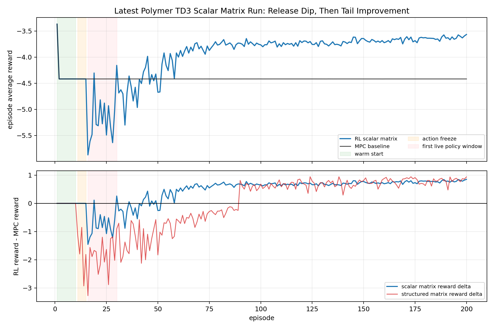

### Closed-Loop Reward Window Summary

In the table below, positive `mean_reward_delta` means RL beats the MPC baseline.

| Method | Episodes | RL mean reward | MPC mean reward | Mean reward delta | Win rate |
|---|---:|---:|---:|---:|---:|
| Scalar matrix, 2026-04-24 | 1-10 | -4.3123 | -4.3123 | -0.0000 | 40.0% |
| Scalar matrix, 2026-04-24 | 11-15 | -4.4174 | -4.4173 | -0.0001 | 40.0% |
| Scalar matrix, 2026-04-24 | 16-30 | -5.1603 | -4.4174 | -0.7429 | 13.3% |
| Scalar matrix, 2026-04-24 | 31-100 | -4.0549 | -4.4174 | +0.3625 | 78.6% |
| Scalar matrix, 2026-04-24 | 101-200 | -3.6923 | -4.4174 | +0.7251 | 100.0% |
| Scalar matrix, 2026-04-24 | 1-200 | -3.9784 | -4.4121 | +0.4337 | 81.5% |
| Structured matrix, 2026-04-24 | 1-10 | -4.3123 | -4.3123 | -0.0000 | 40.0% |
| Structured matrix, 2026-04-24 | 11-15 | -4.4174 | -4.4173 | -0.0001 | 40.0% |
| Structured matrix, 2026-04-24 | 16-30 | -5.4548 | -4.4174 | -1.0374 | 0.0% |
| Structured matrix, 2026-04-24 | 31-100 | -4.3921 | -4.4174 | +0.0253 | 61.4% |
| Structured matrix, 2026-04-24 | 101-200 | -3.5780 | -4.4174 | +0.8394 | 100.0% |
| Structured matrix, 2026-04-24 | 1-200 | -4.0614 | -4.4121 | +0.3507 | 74.5% |

Interpretation:

- The scalar matrix run is now a real success after release recovery: episodes 101-200 beat MPC in every episode.
- The first live policy window is still bad: episodes 16-30 lose by `0.7429` reward on average.
- The latest structured matrix result is much better than the older structured result. It still has a larger first-live-window loss than scalar mode, but it now finishes positive over the full 200 episodes.
- The structured tail is strongest: episodes 101-200 beat MPC by `0.8394` reward on average, larger than the scalar tail improvement of `0.7251`.
- Therefore, the next change should not simply shrink all authority forever. It should protect the release window while preserving the later authority that produced the tail improvement.

### Offline Diagnostic Summary

The scalar diagnostic sampled 2000 log-uniform candidates inside the current scalar bounds.

| Diagnostic quantity | Value |
|---|---:|
| Nominal physical spectral radius | 0.946394 |
| Unstable candidate fraction | 0.000 |
| Near-unit candidate fraction, `rho >= 0.995` | 0.006 |
| Candidate gain-ratio p95 | 0.7344 |
| Candidate gain-ratio max | 0.7855 |
| Worst `rho` coordinate | `alpha` |
| Worst gain coordinate | `alpha` |

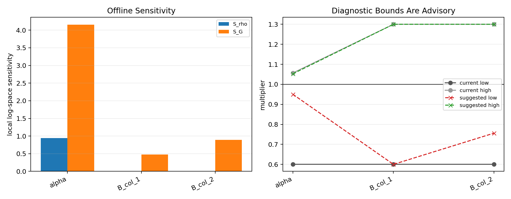

The advisory bounds from the diagnostic were:

| Coordinate | Current low | Current high | Suggested low | Suggested high | Reason |
|---|---:|---:|---:|---:|---|
| `alpha` | 0.6000 | 1.0566 | 0.9499 | 1.0527 | `rho-limited` |
| `B_col_1` | 0.6000 | 1.3000 | 0.6000 | 1.3000 | `user-bound-limited` |
| `B_col_2` | 0.6000 | 1.3000 | 0.7559 | 1.3000 | `gain-limited;user-bound-limited` |

This should **not** be applied as a permanent cap yet. The latest successful tail behavior uses `alpha` well below `0.9499`, so a permanent diagnostic `alpha` low cap may remove the useful learned behavior. The diagnostic cap is most useful as a **release protection**.

The structured diagnostic now gives the missing per-coordinate picture. It also sampled 2000 log-uniform candidates inside the current structured bounds.

| Structured diagnostic quantity | Value |
|---|---:|
| Nominal physical spectral radius | 0.946394 |
| Unstable candidate fraction | 0.000 |
| Near-unit candidate fraction, `rho >= 0.995` | 0.008 |
| Candidate gain-ratio p95 | 0.7135 |
| Candidate gain-ratio max | 0.7716 |
| Worst `rho` coordinate | `A_block_1` |
| Worst gain coordinate | `A_block_2` |

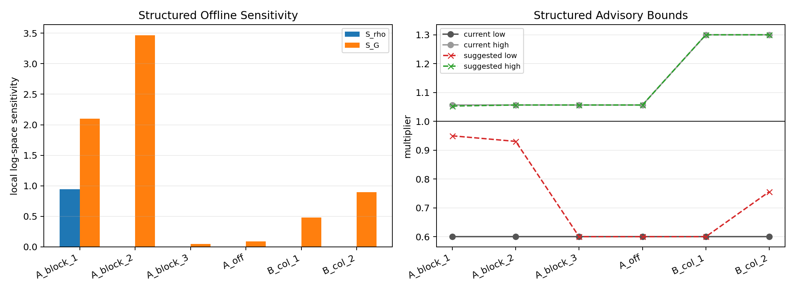

The structured advisory bounds were:

| Coordinate | Current low | Current high | Suggested low | Suggested high | Reason |
|---|---:|---:|---:|---:|---|
| `A_block_1` | 0.6000 | 1.0566 | 0.9497 | 1.0530 | `rho-limited` |
| `A_block_2` | 0.6000 | 1.0566 | 0.9304 | 1.0566 | `gain-limited;user-bound-limited` |
| `A_block_3` | 0.6000 | 1.0566 | 0.6000 | 1.0566 | `user-bound-limited` |
| `A_off` | 0.6000 | 1.0566 | 0.6000 | 1.0566 | `user-bound-limited` |
| `B_col_1` | 0.6000 | 1.3000 | 0.6000 | 1.3000 | `user-bound-limited` |
| `B_col_2` | 0.6000 | 1.3000 | 0.7559 | 1.3000 | `gain-limited;user-bound-limited` |

This explains why structured mode should not use one shared cap for all A-side multipliers. `A_block_1` is the stability-sensitive A coordinate, `A_block_2` is the gain-sensitive A coordinate, and `A_block_3` plus `A_off` look comparatively safe under this finite-horizon diagnostic.

### How The Diagnostic Caps Were Calculated

The offline diagnostic starts from the current wide bounds and asks two questions for each multiplier coordinate:

1. Does this coordinate push the physical prediction matrix too close to unstable dynamics?
2. Does this coordinate change the finite-horizon input-output gain too much?

For the scalar matrix method the candidate model is:

$$ A_{\theta}^{\mathrm{phys}} = \alpha A_0^{\mathrm{phys}}, \qquad B_{\theta}^{\mathrm{phys}} = B_0^{\mathrm{phys}}\operatorname{diag}(\delta_1,\delta_2). $$

The stability diagnostic is the physical spectral radius:

$$ \rho_{\theta} = \rho(A_{\theta}^{\mathrm{phys}}). $$

The finite-horizon gain diagnostic uses the stacked Markov matrix:

$$ G_{\theta,H} = \begin{bmatrix} C B_{\theta} \\ C A_{\theta} B_{\theta} \\ \cdots \\ C A_{\theta}^{H-1}B_{\theta} \end{bmatrix}. $$

The normalized gain drift is:

$$ g_{\theta} = \frac{\|G_{\theta,H} - G_{0,H}\|_F}{\|G_{0,H}\|_F}. $$

For each coordinate `j`, the diagnostic perturbs only that coordinate in log space around nominal:

$$ \theta_j^- = \max(\ell_j,\exp(-\epsilon_{\log})), \qquad \theta_j^+ = \min(u_j,\exp(\epsilon_{\log})). $$

Here `epsilon_log = 0.02`, so the local test is approximately a `+/-2%` multiplicative perturbation unless the current user bounds are tighter.

The local sensitivities are:

$$ S_{\rho,j} = \frac{|\rho(\theta_j^+) - \rho(\theta_j^-)|}{|\log \theta_j^+ - \log \theta_j^-|}. $$

$$ S_{G,j} = \frac{\|G(\theta_j^+) - G(\theta_j^-)\|_F}{|\log \theta_j^+ - \log \theta_j^-|\|G_{0,H}\|_F}. $$

Then the diagnostic converts sensitivities into allowed log-distance from nominal. For `A`-side coordinates:

$$ d_{\rho,j} = \frac{\rho_{\mathrm{target}} - \rho_0}{S_{\rho,j}}. $$

For all coordinates:

$$ d_{G,j} = \frac{g_{\mathrm{threshold}}}{S_{G,j}}. $$

The current diagnostic uses:

$$ \rho_{\mathrm{target}} = 0.995, \qquad g_{\mathrm{threshold}} = 0.25. $$

The final advisory log-distance is the tightest of the user bound, rho limit, and gain limit:

$$ d_j^{\mathrm{low}} = \min(|\log \ell_j^{\mathrm{wide}}|, d_{\rho,j}, d_{G,j}). $$

$$ d_j^{\mathrm{high}} = \min(|\log u_j^{\mathrm{wide}}|, d_{\rho,j}, d_{G,j}). $$

The advisory bounds are then:

$$ \ell_j^{\mathrm{diag}} = \exp(-d_j^{\mathrm{low}}), \qquad u_j^{\mathrm{diag}} = \exp(d_j^{\mathrm{high}}). $$

For `B` columns, the rho limit is ignored because `B` does not set open-loop eigenvalues. That is why `B_col_1` stayed at the user bounds while `B_col_2` received a gain-limited lower advisory bound.

### Policy-Use Summary

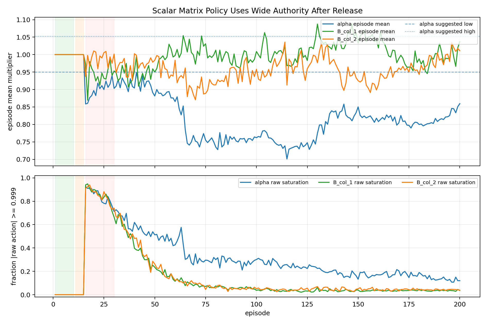

| Episodes | Mean `alpha` | `alpha` low-hit frac | `alpha` high-hit frac | Mean `B_col_1` | Mean `B_col_2` | Mean raw saturation |
|---|---:|---:|---:|---:|---:|---:|
| 16-30 | 0.8986 | 23.8% | 51.2% | 0.9434 | 0.9869 | 84.4% |
| 101-200 | 0.7961 | 6.2% | 3.5% | 1.0118 | 0.9631 | 9.1% |
| 16-200 | 0.8151 | 7.5% | 12.4% | 0.9954 | 0.9581 | 21.9% |

The early live window has extreme raw action saturation: about `84.4%` of scalar action coordinates are at the normalized action boundary. That is not a fine cap-selection signal. It means the actor is released while still behaving like a boundary-seeking policy. Later, saturation falls to about `9.1%`, and the same broad authority becomes useful.

The latest structured run shows the same pattern with more action dimensions:

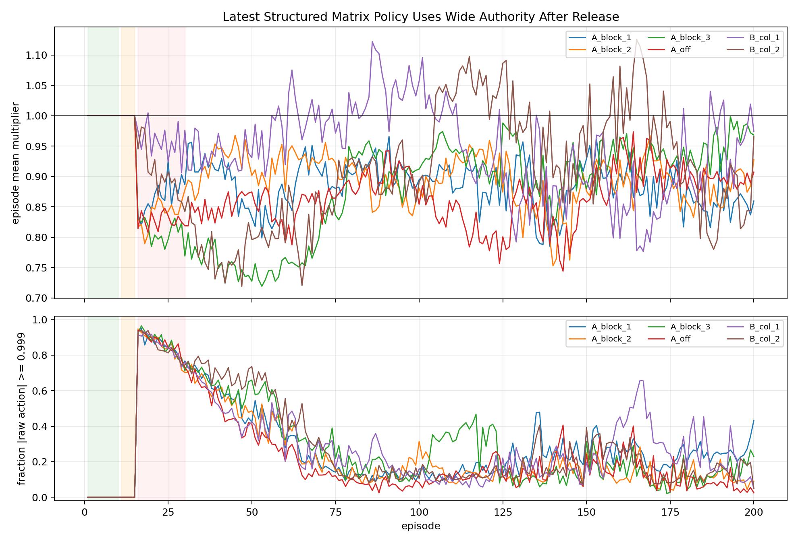

| Episodes | Mean raw saturation | `A_block_1` mean | `A_block_2` mean | `A_block_3` mean | `A_off` mean | `B_col_1` mean | `B_col_2` mean |
|---|---:|---:|---:|---:|---:|---:|---:|
| 16-30 | 85.7% | 0.8673 | 0.8398 | 0.8080 | 0.8272 | 0.9585 | 0.9039 |
| 31-100 | 33.8% | 0.8951 | 0.9080 | 0.8181 | 0.8656 | 0.9880 | 0.8374 |
| 101-200 | 17.5% | 0.8798 | 0.8870 | 0.9283 | 0.8655 | 0.9119 | 0.9628 |
| 16-200 | 29.2% | 0.8846 | 0.8911 | 0.8768 | 0.8624 | 0.9445 | 0.9106 |

Structured release saturation is slightly worse than scalar release saturation (`85.7%` versus `84.4%`), and it acts over six coordinates instead of three. This is why the structured first-live loss remains larger even though its final tail behavior is excellent.

## Step 2 Method And Result From Polymer

The implemented Step 2 method is **release-protected advisory caps**, not a permanent static cap.

The polymer trial schedule is:

| Phase | Episodes | `alpha` authority | `B` authority | Purpose |
|---|---:|---|---|---|
| Warm start | 1-10 | Nominal action only | Nominal action only | Preserve MPC behavior |
| Action freeze | 11-15 | Nominal executed action | Nominal executed action | Keep current protected release setup |
| Protected live release | 16-30 | Scalar: use `[0.95, 1.0527]`; structured: cap `A_block_1` to `[0.9497, 1.0530]` and `A_block_2` low to `0.9304` | Keep `B_col_1` wide; set `B_col_2` low to about `0.756` | Stop boundary-action release crash |
| Authority ramp | 31-60 | Gradually relax toward current wide lower bound | Gradually relax toward current wide bounds | Allow learning to recover useful wide behavior |
| Full authority | 61-200 | Current bounds | Current bounds | Preserve the tail improvement seen in polymer |

This uses the diagnostic as a temporary guardrail:

$$ \theta_j^{\mathrm{exec}}(e) = \operatorname{clip}\left(\theta_j^{\mathrm{policy}}(e),\theta_{j,\mathrm{low}}^{\mathrm{release}}(e),\theta_{j,\mathrm{high}}^{\mathrm{release}}(e)\right). $$

The release bounds should interpolate from diagnostic-safe bounds to the current training bounds:

$$ \log \theta_{j,\mathrm{low}}^{\mathrm{release}}(e) = (1-r_e)\log \theta_{j,\mathrm{low}}^{\mathrm{diag}} + r_e\log \theta_{j,\mathrm{low}}^{\mathrm{wide}}. $$

Here `r_e = 0` at the start of protected live release and `r_e = 1` after the ramp ends. Use log interpolation because the multipliers are multiplicative.

### How Protected Release, Ramp, And Full Authority Would Work

The actor should still output its normal raw action:

$$ a_t \in [-1,1]^m. $$

That raw action is mapped to the normal wide multiplier range exactly as before:

$$ \theta_{j,t}^{\mathrm{policy}} = f_{\mathrm{wide},j}(a_{j,t}). $$

Step 2 adds a second step at execution time only:

$$ \theta_{j,t}^{\mathrm{exec}} = \operatorname{clip}(\theta_{j,t}^{\mathrm{policy}},\ell_{j,t}^{\mathrm{eff}},u_{j,t}^{\mathrm{eff}}). $$

The MPC model uses `theta_exec`, not `theta_policy`. The logs should store both values so we can see whether the policy is still trying to hit unsafe authority while the guard is active.

The effective bounds are phase-dependent:

| Phase | Episodes | Effective lower bound | Effective upper bound | What happens |
|---|---:|---|---|---|
| Warm start | 1-10 | `1.0` | `1.0` | The executed multiplier is nominal. This preserves pure MPC behavior while the replay buffer fills. |
| Action freeze | 11-15 | `1.0` | `1.0` | The actor can be present internally, but the executed multiplier is still nominal. This avoids an abrupt first action after warm start. |
| Protected live release | 16-30 | `diagnostic_low` | `diagnostic_high` | The actor finally controls the model, but only inside the diagnostic-safe release box. |
| Authority ramp | 31-60 | log interpolation from diagnostic low to wide low | log interpolation from diagnostic high to wide high | The guard relaxes gradually, so the critic sees a smoother transition instead of one sudden jump to full authority. |
| Full authority | 61-200 | `wide_low` | `wide_high` | The original experiment authority returns. This preserves the successful tail behavior. |

For the scalar polymer matrix case, the resulting example schedule is:

| Episode | Phase | `alpha` bounds | `B_col_1` bounds | `B_col_2` bounds |
|---:|---|---|---|---|
| 1 | warm start | `[1.0000, 1.0000]` | `[1.0000, 1.0000]` | `[1.0000, 1.0000]` |
| 15 | action freeze | `[1.0000, 1.0000]` | `[1.0000, 1.0000]` | `[1.0000, 1.0000]` |
| 16 | protected live release | `[0.9499, 1.0527]` | `[0.6000, 1.3000]` | `[0.7559, 1.3000]` |
| 30 | protected live release | `[0.9499, 1.0527]` | `[0.6000, 1.3000]` | `[0.7559, 1.3000]` |
| 45 | authority ramp | `[0.7550, 1.0546]` | `[0.6000, 1.3000]` | `[0.6735, 1.3000]` |
| 60 | authority ramp end | `[0.6000, 1.0566]` | `[0.6000, 1.3000]` | `[0.6000, 1.3000]` |
| 61 | full authority | `[0.6000, 1.0566]` | `[0.6000, 1.3000]` | `[0.6000, 1.3000]` |

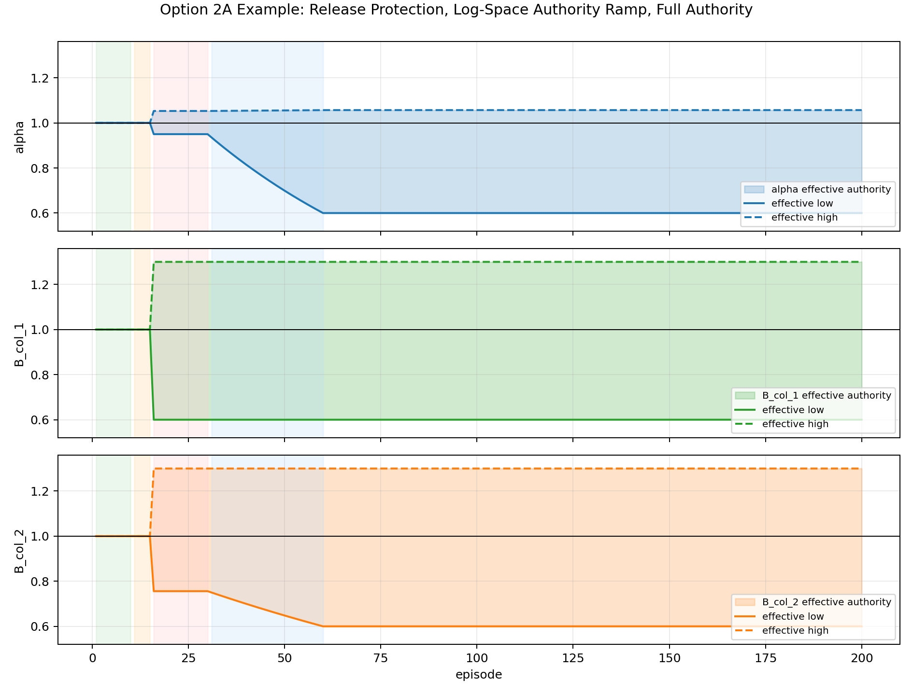

The important detail is that this is **not behavior cloning** and not a new reward. It is an execution authority schedule. The actor can still learn, but the first live policy window cannot immediately jump to the most damaging model multipliers.

For replay and critic consistency, the transition should store the executed action or executed multiplier as the action that affected the plant. The unclipped policy action should still be logged for diagnostics:

$$ \mathcal{D} \leftarrow (s_t,a_t^{\mathrm{exec}},r_t,s_{t+1},d_t), \qquad \text{log } a_t^{\mathrm{policy}} \text{ separately}. $$

This matters because if the critic trains on the unclipped action while the plant experienced the clipped action, the critic learns the wrong action-value relationship during the release window.

### Step 2 Polymer Result Update

This update uses the latest Step 2 polymer runs:

- Scalar matrix RL bundle: `Polymer/Results/td3_multipliers_disturb/20260424_204554/input_data.pkl`
- Scalar matrix comparison bundle: `Polymer/Results/disturb_compare_td3_multipliers/20260424_204610/input_data.pkl`
- Structured matrix RL bundle: `Polymer/Results/td3_structured_matrices_disturb/20260424_204732/input_data.pkl`
- Structured matrix comparison bundle: `Polymer/Results/disturb_compare_td3_structured_matrices/20260424_204751/input_data.pkl`

Both runs have `release_guard_enabled = True`. The release schedule is:

| Phase | Episodes | Scalar executed bounds | Structured executed bounds |
|---|---:|---|---|
| Warm start | 1-10 | nominal only | nominal only |
| Action freeze | 11-15 | nominal only | nominal only |
| Protected live release | 16-30 | Step 1 diagnostic bounds | Step 1 per-coordinate diagnostic bounds |
| Authority ramp | 31-60 | log-space ramp to wide bounds | log-space ramp to wide bounds |
| Full authority | 61-200 | original wide bounds | original wide bounds |

The headline result is positive: Step 2 strongly reduces the first-live release crash without removing the later full-authority improvement.

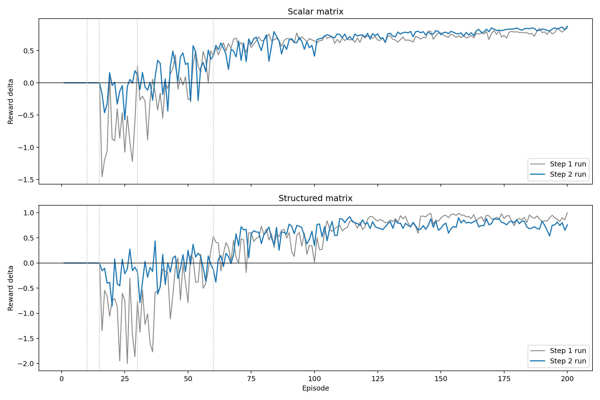

#### Step 2 Reward Windows

Positive reward delta means RL beats the MPC baseline.

| Method | Window | RL mean reward | MPC mean reward | Mean reward delta | Win rate |
|---|---|---:|---:|---:|---:|
| Scalar Step 2 | 1-10 | -4.3123 | -4.3123 | -0.0000 | 40.0% |
| Scalar Step 2 | 11-15 | -4.4174 | -4.4173 | -0.0001 | 40.0% |
| Scalar Step 2 | 16-30 protected | -4.5249 | -4.4174 | -0.1075 | 33.3% |
| Scalar Step 2 | 31-60 ramp | -4.2566 | -4.4174 | +0.1608 | 73.3% |
| Scalar Step 2 | 61-100 full | -3.8499 | -4.4173 | +0.5675 | 100.0% |
| Scalar Step 2 | 101-200 tail | -3.6415 | -4.4174 | +0.7758 | 100.0% |
| Scalar Step 2 | 1-200 full run | -3.8947 | -4.4121 | +0.5175 | 86.5% |
| Structured Step 2 | 1-10 | -4.3123 | -4.3123 | -0.0000 | 40.0% |
| Structured Step 2 | 11-15 | -4.4174 | -4.4173 | -0.0001 | 40.0% |
| Structured Step 2 | 16-30 protected | -4.6226 | -4.4174 | -0.2052 | 20.0% |
| Structured Step 2 | 31-60 ramp | -4.4964 | -4.4174 | -0.0789 | 43.3% |
| Structured Step 2 | 61-100 full | -3.9591 | -4.4173 | +0.4582 | 92.5% |
| Structured Step 2 | 101-200 tail | -3.6599 | -4.4174 | +0.7575 | 100.0% |
| Structured Step 2 | 1-200 full run | -3.9690 | -4.4121 | +0.4431 | 79.5% |

Compared with Step 1:

| Method | Step 1 protected-window delta | Step 2 protected-window delta | Improvement | Step 1 full-run delta | Step 2 full-run delta |
|---|---:|---:|---:|---:|---:|
| Scalar matrix | -0.7429 | -0.1075 | +0.6354 | +0.4337 | +0.5175 |
| Structured matrix | -1.0374 | -0.2052 | +0.8322 | +0.3507 | +0.4431 |

This is the key evidence that the Step 1 diagnostic bounds were useful as **temporary release bounds**. They were not just theoretical stability numbers; they directly reduced the release-window performance loss.

#### What The Guard Actually Did

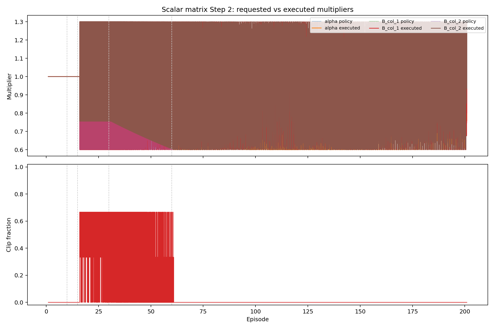

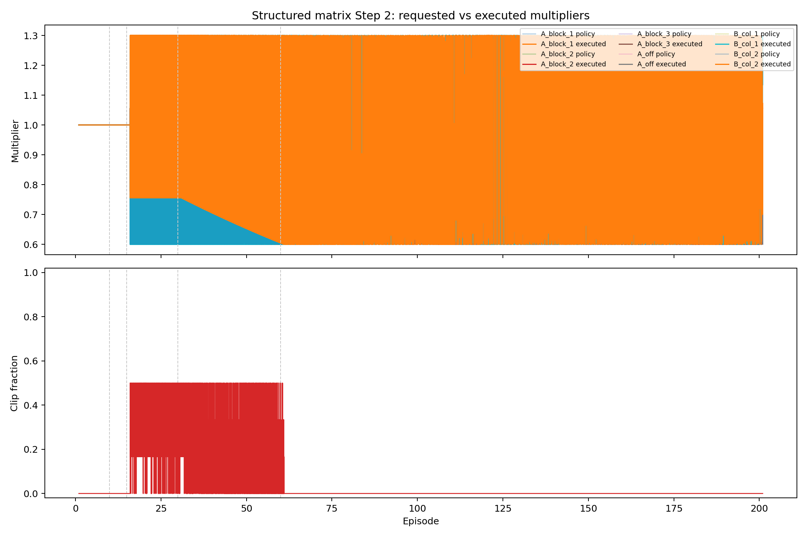

| Method | Window | Mean release clip fraction | Mean raw saturation | Mean policy-executed gap |
|---|---|---:|---:|---:|
| Scalar Step 2 | 16-30 protected | 46.4% | 87.5% | 0.0694 |
| Scalar Step 2 | 31-60 ramp | 28.4% | 48.3% | 0.0225 |
| Scalar Step 2 | 61-100 full | 0.0% | 20.1% | 0.0000 |
| Scalar Step 2 | 101-200 tail | 0.0% | 18.6% | 0.0000 |
| Structured Step 2 | 16-30 protected | 29.5% | 89.6% | 0.0562 |
| Structured Step 2 | 31-60 ramp | 23.2% | 62.2% | 0.0211 |
| Structured Step 2 | 61-100 full | 0.0% | 38.0% | 0.0000 |
| Structured Step 2 | 101-200 tail | 0.0% | 34.1% | 0.0000 |

Interpretation:

- Step 2 did **not** make the actor calm during the first live window. The scalar raw action saturation was `87.5%` in episodes 16-30, and structured raw action saturation was `89.6%`.
- Step 2 worked because the executed multipliers were clipped while the policy was still boundary-seeking.
- The guard naturally turns off after the ramp. From episode 61 onward, policy and executed multipliers match again.
- The remaining structured saturation after episode 61 is still high (`34.1%` in the tail), so structured mode probably still needs smaller networks, stronger smoothness, or an acceptance gate.

The most important scalar coordinates were:

| Window | Coordinate | Policy mean | Executed mean | Clip fraction | Mean abs gap |
|---|---|---:|---:|---:|---:|
| 16-30 protected | `alpha` | 0.8710 | 1.0087 | 95.0% | 0.1418 |
| 16-30 protected | `B_col_1` | 0.9494 | 0.9494 | 0.0% | 0.0000 |
| 16-30 protected | `B_col_2` | 0.9794 | 1.0459 | 44.1% | 0.0665 |
| 31-60 ramp | `alpha` | 0.8744 | 0.9234 | 63.3% | 0.0503 |
| 31-60 ramp | `B_col_2` | 1.0452 | 1.0623 | 21.8% | 0.0170 |
| 101-200 tail | `alpha` | 0.8435 | 0.8435 | 0.0% | 0.0000 |
| 101-200 tail | `B_col_1` | 0.9697 | 0.9697 | 0.0% | 0.0000 |
| 101-200 tail | `B_col_2` | 0.9902 | 0.9902 | 0.0% | 0.0000 |

For scalar mode, `alpha` was the release bottleneck. The policy requested an average `alpha = 0.8710` in the protected window, but the guard executed `alpha = 1.0087`. This is exactly what we wanted: keep the release model close to nominal while the actor is still unstable, then allow low `alpha` again later. The tail still uses low `alpha = 0.8435`, and it beats MPC strongly.

The most important structured coordinates were:

| Window | Coordinate | Policy mean | Executed mean | Clip fraction | Mean abs gap |
|---|---|---:|---:|---:|---:|
| 16-30 protected | `A_block_1` | 0.8597 | 1.0066 | 96.1% | 0.1506 |
| 16-30 protected | `A_block_2` | 0.8841 | 1.0069 | 38.6% | 0.1228 |
| 16-30 protected | `A_block_3` | 0.8233 | 0.8233 | 0.0% | 0.0000 |
| 16-30 protected | `A_off` | 0.8048 | 0.8048 | 0.0% | 0.0000 |
| 16-30 protected | `B_col_2` | 0.9933 | 1.0571 | 42.3% | 0.0638 |
| 31-60 ramp | `A_block_1` | 0.8571 | 0.9145 | 71.9% | 0.0588 |
| 31-60 ramp | `A_block_2` | 0.9127 | 0.9523 | 27.5% | 0.0396 |
| 31-60 ramp | `B_col_2` | 0.9427 | 0.9708 | 39.6% | 0.0281 |
| 101-200 tail | `A_block_1` | 0.8938 | 0.8938 | 0.0% | 0.0000 |
| 101-200 tail | `A_block_2` | 0.8415 | 0.8415 | 0.0% | 0.0000 |
| 101-200 tail | `B_col_1` | 1.0158 | 1.0158 | 0.0% | 0.0000 |
| 101-200 tail | `B_col_2` | 0.9911 | 0.9911 | 0.0% | 0.0000 |

For structured mode, Step 2 confirms the Step 1 diagnosis: `A_block_1`, `A_block_2`, and `B_col_2` are the coordinates that need release protection. `A_block_3`, `A_off`, and `B_col_1` were largely allowed to execute as requested during protected release.

#### Step 2 Conclusion

Step 2 should stay in the polymer matrix and structured-matrix notebooks. The remaining problem is no longer "how do we calculate release caps?" The remaining problem is "why does the actor still request saturated actions during release?"

The saved runner bundle does not record the actor/critic hidden-layer sizes, so the analysis above is based on the release-guard logs, not on a confirmed network-size comparison. The next polymer trial should keep Step 2 on and use the reduced network defaults of two hidden layers with 256 units. The success criterion is:

- protected-window reward delta should stay near zero or positive,
- full-run and tail reward should remain positive,
- raw action saturation should fall below the Step 2 values above,
- Step 2 clip fraction should decrease because the policy itself becomes less boundary-seeking.

For distillation, this result supports Step 2 conceptually, but I would still keep distillation disabled until the smaller-network polymer rerun is reviewed. Distillation has a stronger history of recovering without beating MPC, so it likely needs Step 2 plus Step 3 acceptance/fallback rather than Step 2 alone.

### Step 2 Smaller-Network Follow-Up

This update compares the first Step 2 runs above against the latest Step 2-only polymer reruns after the default TD3 network size was reduced to `[256, 256]`. The latest bundles are:

- Scalar matrix RL bundle: `Polymer/Results/td3_multipliers_disturb/20260424_212859/input_data.pkl`
- Scalar matrix comparison bundle: `Polymer/Results/disturb_compare_td3_multipliers/20260424_212913/input_data.pkl`
- Structured matrix RL bundle: `Polymer/Results/td3_structured_matrices_disturb/20260424_212944/input_data.pkl`
- Structured matrix comparison bundle: `Polymer/Results/disturb_compare_td3_structured_matrices/20260424_213002/input_data.pkl`

Important provenance note: the result bundles still do not store an explicit actor/critic architecture snapshot. This section treats the latest runs as the `[256, 256]` runs based on the run timing, the changed defaults, and the user's run note. A future runner improvement should save the hidden-layer list into `input_data.pkl` so this comparison is directly auditable.

These latest runs are **not Step 3** runs. They have `release_guard_enabled = True`, but they do not contain the Step 3 `mpc_acceptance_*` logs. So the comparison below isolates the network-size change under Step 2.

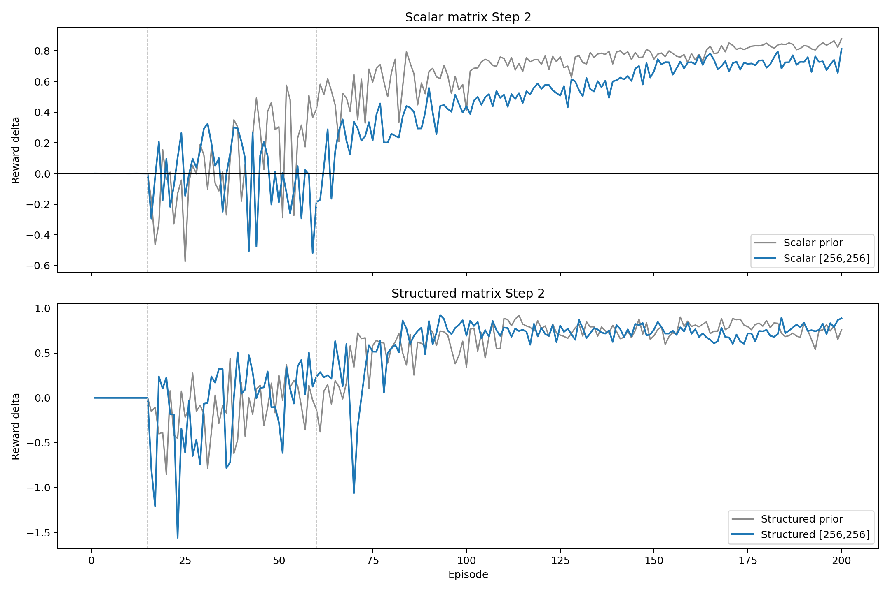

#### Reward Effect

Positive reward delta means RL beats the MPC baseline.

| Method | Window | Mean reward delta | Win rate | Raw saturation | Release clip |
|---|---|---:|---:|---:|---:|
| Scalar prior Step 2 | 16-30 protected | -0.1075 | 33.3% | 87.5% | 46.4% |
| Scalar prior Step 2 | 31-60 ramp | +0.1608 | 73.3% | 48.3% | 28.4% |
| Scalar prior Step 2 | 61-100 full | +0.5675 | 100.0% | 20.1% | 0.0% |
| Scalar prior Step 2 | 101-200 tail | +0.7758 | 100.0% | 18.6% | 0.0% |
| Scalar prior Step 2 | 1-200 full run | +0.5175 | 86.5% | 27.1% | 7.7% |
| Scalar `[256, 256]` Step 2 | 16-30 protected | +0.0204 | 53.3% | 57.6% | 36.9% |
| Scalar `[256, 256]` Step 2 | 31-60 ramp | -0.0209 | 56.7% | 44.9% | 29.4% |
| Scalar `[256, 256]` Step 2 | 61-100 full | +0.3021 | 95.0% | 29.7% | 0.0% |
| Scalar `[256, 256]` Step 2 | 101-200 tail | +0.6366 | 100.0% | 26.2% | 0.0% |
| Scalar `[256, 256]` Step 2 | 1-200 full run | +0.3771 | 84.5% | 30.1% | 7.2% |
| Structured prior Step 2 | 16-30 protected | -0.2052 | 20.0% | 89.6% | 29.5% |
| Structured prior Step 2 | 31-60 ramp | -0.0789 | 43.3% | 62.2% | 23.2% |
| Structured prior Step 2 | 61-100 full | +0.4582 | 92.5% | 38.0% | 0.0% |
| Structured prior Step 2 | 101-200 tail | +0.7575 | 100.0% | 34.1% | 0.0% |
| Structured prior Step 2 | 1-200 full run | +0.4431 | 79.5% | 40.7% | 5.7% |
| Structured `[256, 256]` Step 2 | 16-30 protected | -0.4180 | 20.0% | 63.7% | 27.1% |
| Structured `[256, 256]` Step 2 | 31-60 ramp | +0.0794 | 70.0% | 45.2% | 18.6% |
| Structured `[256, 256]` Step 2 | 61-100 full | +0.4880 | 92.5% | 41.7% | 0.0% |
| Structured `[256, 256]` Step 2 | 101-200 tail | +0.7414 | 100.0% | 53.9% | 0.0% |
| Structured `[256, 256]` Step 2 | 1-200 full run | +0.4489 | 83.5% | 46.8% | 4.8% |

The scalar result says the smaller network made the release behavior safer but gave up some final performance. The protected-window reward delta improved from `-0.1075` to `+0.0204`, and raw saturation dropped from `87.5%` to `57.6%`. That is exactly the direction we wanted for first live release. But the tail reward delta fell from `+0.7758` to `+0.6366`, and full-run reward delta fell from `+0.5175` to `+0.3771`. So the scalar `[256, 256]` policy is calmer at release, but less aggressive or less effective after full authority returns.

The structured result is more mixed. The protected-window reward got worse, from `-0.2052` to `-0.4180`, even though raw saturation dropped from `89.6%` to `63.7%`. The ramp improved from `-0.0789` to `+0.0794`, and the full-run result improved slightly from `+0.4431` to `+0.4489`. The tail result is essentially similar, falling only from `+0.7575` to `+0.7414`. This means network size alone did not solve structured release quality. It changed the action distribution, but the early structured candidates can still be bad even when they are less saturated.

#### Difference From Prior Step 2

This table reports `[256, 256]` minus the prior Step 2 run.

| Family | Window | Reward-delta change | Win-rate change | Raw-saturation change | Release-clip change |
|---|---|---:|---:|---:|---:|
| Scalar | 16-30 protected | +0.1280 | +20.0 pp | -29.9 pp | -9.5 pp |
| Scalar | 31-60 ramp | -0.1817 | -16.7 pp | -3.4 pp | +1.1 pp |
| Scalar | 101-200 tail | -0.1392 | +0.0 pp | +7.5 pp | +0.0 pp |
| Scalar | 1-200 full run | -0.1404 | -2.0 pp | +3.0 pp | -0.6 pp |
| Structured | 16-30 protected | -0.2127 | +0.0 pp | -25.9 pp | -2.4 pp |
| Structured | 31-60 ramp | +0.1584 | +26.7 pp | -17.0 pp | -4.6 pp |
| Structured | 101-200 tail | -0.0160 | +0.0 pp | +19.8 pp | +0.0 pp |
| Structured | 1-200 full run | +0.0057 | +4.0 pp | +6.1 pp | -0.9 pp |

The key point is that smaller networks reduced early saturation in both families, but this did not translate uniformly into better reward. In scalar mode, reduced saturation helped the protected window. In structured mode, reduced saturation helped the ramp but not the protected window. That tells us the structured problem is not only "the policy hits the raw action boundary." It is also "some in-bound structured candidate models still lead to locally bad MPC decisions."

#### Multiplier Behavior

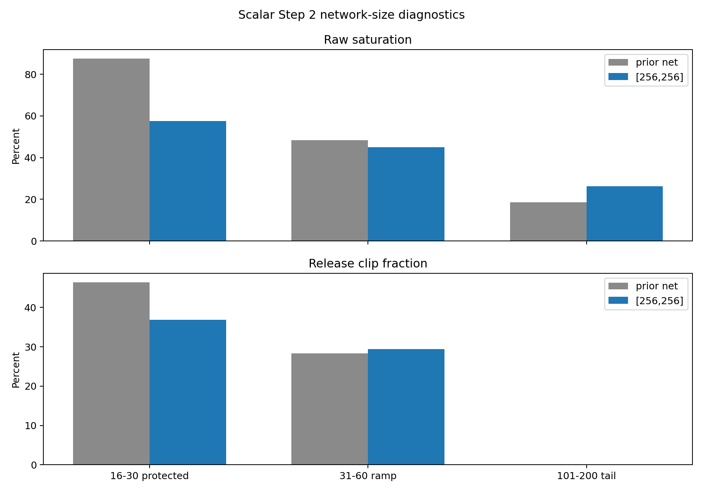

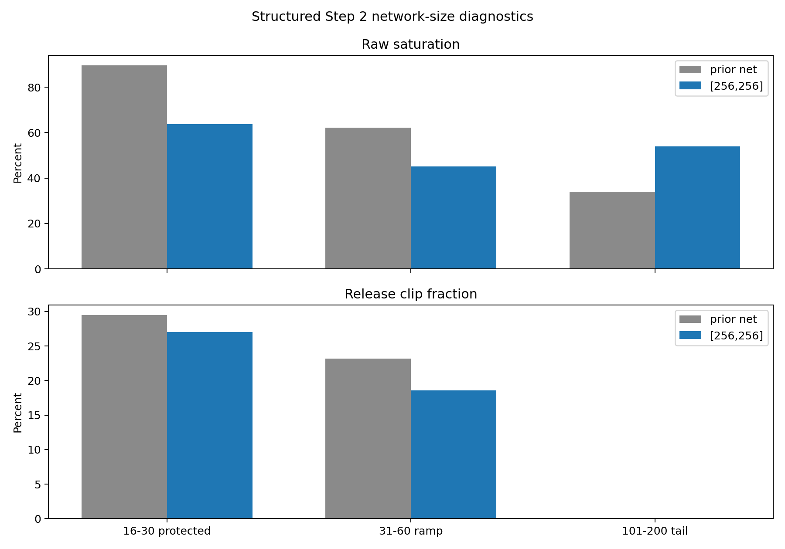

For the latest scalar `[256, 256]` run, the main release coordinate is still `alpha`:

| Window | Coordinate | Policy mean | Executed mean | Clip fraction |
|---|---|---:|---:|---:|
| 16-30 protected | `alpha` | 0.9354 | 1.0180 | 81.5% |
| 16-30 protected | `B_col_2` | 1.0504 | 1.0891 | 29.2% |
| 101-200 tail | `alpha` | 0.9550 | 0.9550 | 0.0% |
| 101-200 tail | `B_col_2` | 0.9290 | 0.9290 | 0.0% |

Compared with the prior scalar run, `alpha` is much closer to nominal during protected release: policy mean moved from `0.8710` to `0.9354`. The guard still clips it heavily, but it has less work to do. That is why the protected-window reward became slightly positive.

For the latest structured `[256, 256]` run, the sensitive coordinates remain the same:

| Window | Coordinate | Policy mean | Executed mean | Clip fraction |
|---|---|---:|---:|---:|
| 16-30 protected | `A_block_1` | 0.8887 | 1.0081 | 84.6% |
| 16-30 protected | `A_block_2` | 0.8858 | 1.0014 | 40.0% |
| 16-30 protected | `B_col_2` | 0.9966 | 1.0488 | 37.8% |
| 101-200 tail | `A_block_1` | 0.8579 | 0.8579 | 0.0% |
| 101-200 tail | `A_block_2` | 0.8063 | 0.8063 | 0.0% |
| 101-200 tail | `B_col_2` | 0.9602 | 0.9602 | 0.0% |

The structured policy still pushes `A_block_1` and `A_block_2` low, and the protected guard still moves them back toward nominal. However, the reward got worse during protected release. The likely reason is that structured mode has more coupled degrees of freedom: even if each coordinate is inside its Step 1 diagnostic box, the joint candidate can still create a poor finite-horizon MPC move for the current state. This is exactly the type of failure Step 3 is designed to catch.

#### Network-Size Conclusion

The network-size change **did matter**, but it is not a universal improvement.

| Family | Did `[256, 256]` help release? | Did `[256, 256]` help full-run reward? | Interpretation |
|---|---|---|---|
| Scalar matrix | Yes | No | Smaller network reduced first-live aggression and made protected release slightly better than MPC, but it reduced later improvement. |
| Structured matrix | Partly | Slightly | Smaller network reduced early saturation and improved the ramp/full-run result, but protected release got worse. |

For polymer, I would keep `[256, 256]` for now while Step 3 is running, because it is less extreme and the full-run results remain positive. I would not shrink below `[256, 256]` yet. The next useful evidence is the Step 3 acceptance fraction and fallback fraction:

- If scalar Step 3 rejects many early candidates but keeps the positive tail, then Step 3 is helping without removing useful authority.
- If structured Step 3 rejects the protected-window candidates that caused the `-0.4180` delta, then the problem was local candidate quality, not network size.
- If Step 3 rejects almost everything, then the gate is too strict or the learned model multipliers are not adding enough value under the nominal-cost judge.

For distillation, this comparison strengthens the argument for keeping Step 2 and Step 3 disabled until polymer Step 3 is reviewed. Distillation is more sensitive than polymer, and the structured polymer result shows that "less saturated" is not the same as "safe to execute." Distillation should receive the combined release guard plus acceptance/fallback gate, not just a smaller actor network.

### Step 3 Preview: Acceptance Or Fallback Gate

Step 2 answers: "Is the requested multiplier inside a release-safe authority box?" Step 3 would answer a different question: "Even if the multiplier is inside the allowed box, does this candidate prediction model look better than nominal MPC for the current decision?"

That distinction matters. A candidate can be stable, inside the cap, and solvable by MPC, but still produce a worse control move than the nominal model. This is especially likely in distillation because the user-reported run recovered after release but still did not beat MPC. That means the problem is not only release shock; it may be that many accepted model multipliers are **not performance-improving** for the current state and setpoint.

The Step 3 gate would compare the RL-assisted candidate against the nominal MPC model before executing the plant move:

$$ J_t^{\mathrm{cand}} = J(U_t^{\mathrm{cand}}; A_t^{\mathrm{exec}}, B_t^{\mathrm{exec}}, x_t, y_t^{\mathrm{sp}}). $$

$$ J_t^{\mathrm{nom}} = J(U_t^{\mathrm{nom}}; A_0, B_0, x_t, y_t^{\mathrm{sp}}). $$

Then use a simple acceptance rule:

$$ \mathrm{accept}_t = \mathbf{1}\{J_t^{\mathrm{cand}} \leq (1+\epsilon_J)J_t^{\mathrm{nom}} + \epsilon_{\mathrm{abs}}\}. $$

If `accept_t = 1`, execute the RL-assisted MPC candidate. If `accept_t = 0`, execute nominal MPC for that step and log the rejected policy request.

Algorithmically:

| Step | Action |
|---:|---|
| 1 | Actor proposes raw action `a_policy`. |
| 2 | Step 2 clips it to executable multipliers `theta_exec`. |
| 3 | Build candidate model `(A_exec, B_exec)`. |
| 4 | Solve candidate MPC and nominal MPC from the same state. |
| 5 | Reject candidate if the solve fails, the model is invalid, or candidate cost is worse than nominal by more than tolerance. |
| 6 | Execute candidate move if accepted; otherwise execute nominal MPC move. |
| 7 | Store the actually executed raw action in replay and log the requested action separately. |

The first Step 3 version should be conservative. I would start with:

| Parameter | First value | Meaning |
|---|---:|---|
| `epsilon_J` | `0.00` to `0.02` | Candidate must be no worse than nominal, or only slightly worse if we want exploration. |
| `epsilon_abs` | small positive value | Prevents numerical noise from causing unnecessary rejection. |
| `fallback_action` | nominal raw action | Replay should match what the plant actually experienced. |
| `log_rejected_policy` | `True` | Keep evidence of what the actor wanted, even when rejected. |

The main diagnostic outputs would be:

| Metric | Interpretation |
|---|---|
| `acceptance_fraction` | How often RL assistance is actually trusted. |
| `fallback_fraction` | How much the method relies on nominal MPC. |
| `accepted_reward_delta` | Whether accepted candidate moves are actually better than MPC. |
| `rejected_policy_saturation` | Whether the actor is still asking for boundary actions when rejected. |
| `cost_margin = J_cand - J_nom` | How far the candidate is from passing the gate. |

For polymer, Step 3 is not urgent because Step 2 already gives positive full-run and tail performance. For distillation, Step 3 is more important. Distillation has shown that recovery alone is not enough: the policy can recover from release but still fail to beat MPC. A Step 3 gate would protect distillation from executing RL-assisted models that are stable and feasible but not locally better than the nominal MPC decision.

#### Step 3 Implementation Status

Step 3 is implemented as a strict nominal-MPC cost gate for the scalar and structured matrix supervisors. The polymer matrix and structured matrix defaults enable it; the distillation matrix and structured matrix defaults keep it disabled.

The implemented gate sequence is:

| Stage | Meaning |
|---|---|
| Policy request | Actor proposes the wide raw action. |
| Step 2 candidate | Release guard clips the request to the candidate multiplier. |
| Step 3 acceptance | Candidate MPC is solved, nominal MPC is solved, and the candidate plan is judged under the nominal model. |
| Final execution | Execute candidate if accepted; otherwise execute nominal MPC. |
| Replay | Store the raw action that produced the final executed behavior. |

The result bundle now separates:

| Log group | Meaning |
|---|---|
| `policy_multiplier_log` / `mapped_multiplier_log` | Actor-requested multiplier before release clipping. |
| `candidate_multiplier_log` | Step 2 candidate multiplier after release clipping. |
| `executed_multiplier_log` / `effective_multiplier_log` | Final multiplier after Step 3 acceptance or fallback. |
| `mpc_acceptance_accepted_log` | `1` when candidate is trusted. |
| `mpc_acceptance_fallback_active_log` | `1` when nominal MPC is executed instead. |
| `mpc_acceptance_cost_margin_log` | Candidate nominal-evaluated cost minus nominal MPC cost. |

#### Step 3 Strict-Gate Polymer Result

This update uses the latest Step 3 polymer runs:

- Scalar matrix RL bundle: `Polymer/Results/td3_multipliers_disturb/20260424_231144/input_data.pkl`
- Scalar matrix comparison bundle: `Polymer/Results/disturb_compare_td3_multipliers/20260424_231155/input_data.pkl`
- Structured matrix RL bundle: `Polymer/Results/td3_structured_matrices_disturb/20260424_231221/input_data.pkl`
- Structured matrix comparison bundle: `Polymer/Results/disturb_compare_td3_structured_matrices/20260424_231233/input_data.pkl`

The user observation is correct: the Step 3 result is essentially MPC. That happened because the strict acceptance gate fell back to nominal MPC for almost every live control decision.

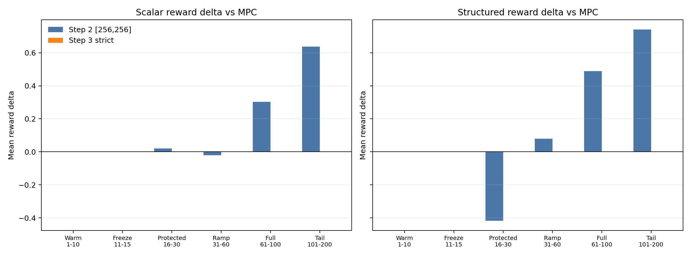

| Method | Window | Step 2 `[256, 256]` reward delta | Step 3 strict reward delta | Step 3 accepted | Step 3 fallback |
|---|---|---:|---:|---:|---:|
| Scalar matrix | 16-30 protected | +0.0204 | -0.000015 | 0.40% | 99.60% |
| Scalar matrix | 31-60 ramp | -0.0209 | +0.000045 | 0.59% | 99.41% |
| Scalar matrix | 61-100 full | +0.3021 | +0.000004 | 0.97% | 99.03% |
| Scalar matrix | 101-200 tail | +0.6366 | +0.000021 | 0.70% | 99.30% |
| Scalar matrix | 1-200 full run | +0.3771 | +0.000015 | 8.16% | 91.84% |
| Structured matrix | 16-30 protected | -0.4180 | +0.000039 | 0.36% | 99.64% |
| Structured matrix | 31-60 ramp | +0.0794 | +0.000056 | 0.22% | 99.78% |
| Structured matrix | 61-100 full | +0.4880 | -0.000015 | 0.00% | 100.00% |
| Structured matrix | 101-200 tail | +0.7414 | -0.000008 | 0.00% | 100.00% |
| Structured matrix | 1-200 full run | +0.4489 | +0.000002 | 7.56% | 92.44% |

The full-run acceptance fractions of `8.16%` and `7.56%` are misleadingly high because warm start and action freeze are nominal phases. In episodes 1-15, the candidate is already nominal, so the gate accepts `100%` of the decisions. After the first live release begins, acceptance collapses:

| Method | Live episodes 16-200 acceptance | Live episodes 16-200 fallback |
|---|---:|---:|
| Scalar matrix | 0.72% | 99.28% |
| Structured matrix | 0.064% | 99.936% |

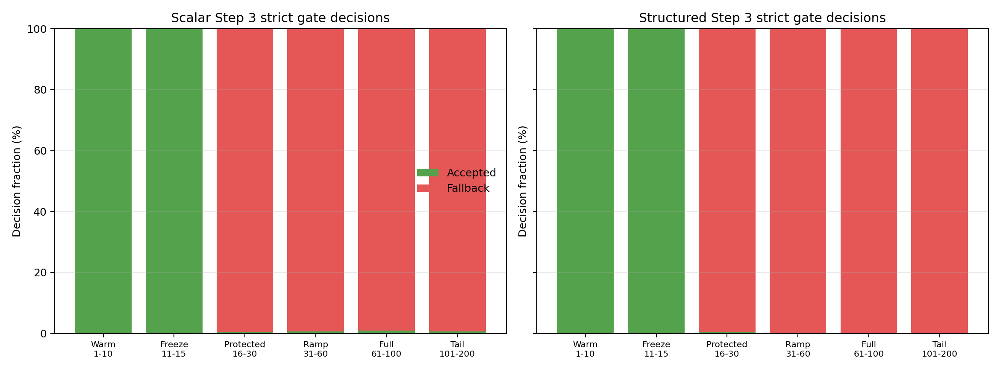

The reason-code logs show that this was **not** caused by MPC candidate solve failures. The dominant reason code is `2`, which means `REJECTED_COST`. The candidate solver produced candidate plans, but the strict nominal-cost judge rejected them.

| Method | Reason `1`: accepted | Reason `2`: rejected by cost | Reason `3`: candidate solve failed |
|---|---:|---:|---:|
| Scalar matrix | 13,061 decisions | 146,939 decisions | 0 decisions |
| Structured matrix | 12,095 decisions | 147,905 decisions | 0 decisions |

This explains why the plant behavior became almost exactly MPC. On fallback, the final executed multiplier is nominal. The runner still logs the candidate multiplier separately, but the plant receives the nominal MPC move. Therefore the reward delta collapses to numerical noise around zero.

#### Why The Strict Objective Was Too Strict

The strict Step 3 rule was:

$$ J_t^{\mathrm{cand|nom}} \leq J_t^{\mathrm{nom}} + \epsilon_{\mathrm{abs}}. $$

with `absolute_tolerance = 1e-8` and `relative_tolerance = 0.0`.

This is conservative, but it is also almost guaranteed to reject useful RL candidates. The reason is simple: `J_t^{nom}` is already the optimized nominal MPC objective for the nominal model. If the candidate sequence is evaluated under the same nominal model and the same nominal objective, it usually cannot beat the nominal optimizer. At best, it can match it up to numerical tolerance. So the strict test does not ask "is this candidate safe enough to try?" It asks "does this candidate reproduce nominal MPC?"

That is why the result became MPC.

The cost margins confirm this. Most margins are small, but they are still positive, and a positive margin larger than `1e-8` is rejected:

| Method | Mean cost margin | Median cost margin | 90th percentile margin | 90th percentile relative margin |
|---|---:|---:|---:|---:|
| Scalar matrix | 0.005056 | 0.00000810 | 0.003038 | 3.1820% |
| Structured matrix | 0.005530 | 0.00000419 | 0.002856 | 3.6719% |

The median margins are tiny. That suggests the gate is rejecting many candidates that are almost nominal under the nominal objective. The high-percentile margins are larger, so the gate is still useful as a shield; it just needs a tolerance band.

#### Offline Tolerance Replay

Using the saved cost logs, we can replay the acceptance rule without rerunning training. The table below asks: if the same Step 3 run had used a small relative tolerance, how many live decisions would have passed?

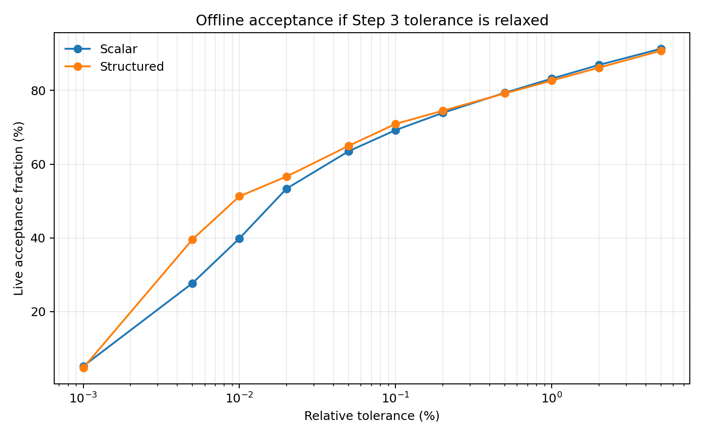

| Relative tolerance | Scalar live acceptance | Structured live acceptance |
|---:|---:|---:|
| 0.001% | 5.24% | 4.77% |
| 0.005% | 27.73% | 39.59% |
| 0.010% | 39.87% | 51.28% |
| 0.020% | 53.35% | 56.65% |
| 0.050% | 63.51% | 64.96% |
| 0.100% | 69.24% | 70.92% |
| 0.500% | 79.36% | 79.19% |
| 1.000% | 83.20% | 82.66% |

The practical conclusion is that the next Step 3 version should not use strict no-worse acceptance. It should use the nominal MPC objective as a **trust-region budget**:

$$ J_t^{\mathrm{cand|nom}} \leq (1+\epsilon_{\mathrm{rel}})J_t^{\mathrm{nom}} + \epsilon_{\mathrm{abs}}. $$

The first polymer rerun should use:

| Parameter | Recommended next value | Why |
|---|---:|---|
| `relative_tolerance` | `1e-4` | This is only `0.010%` nominal-cost slack, but would have accepted about `40%` of scalar live decisions and `51%` of structured live decisions in the saved run. |
| `absolute_tolerance` | `1e-8` initially | Keeps the next run directly comparable to the strict run; increase later only if low-cost decisions remain over-rejected. |
| Step 2 release guard | keep enabled | Still protects first live release from extreme multiplier authority. |
| Distillation Step 3 | keep disabled | Do not transfer until polymer proves that the tolerant gate beats strict fallback. |

If the tolerant run still behaves like MPC, increase `relative_tolerance` to `2e-4`. If it degrades badly, return to `5e-5` or make the tolerance phase-dependent: smaller during protected release, wider after full authority.

The target behavior for Step 3B is not `100%` acceptance. A good first target is:

- live acceptance around `30%` to `60%`,
- fallback still active on high-margin bad candidates,
- reward better than strict Step 3 and not worse than Step 2 during protected release,
- tail reward positive, ideally recovering part of the Step 2 `[256, 256]` tail gain.

Implementation update: polymer matrix and structured-matrix defaults now use `relative_tolerance = 1e-4` for `mpc_acceptance_fallback`. Distillation matrix and structured-matrix defaults remain disabled. To run Step 3B, restart or rerun the polymer notebook parameter/config cells so `CTRL["mpc_acceptance_fallback"]` is reloaded from `systems/polymer/notebook_params.py`.

#### Step 3B Polymer Result And Latest Distillation Context

This update uses the latest polymer Step 3B runs from 2026-04-25:

- Scalar matrix RL bundle: `Polymer/Results/td3_multipliers_disturb/20260425_005143/input_data.pkl`
- Scalar matrix comparison bundle: `Polymer/Results/disturb_compare_td3_multipliers/20260425_005156/input_data.pkl`
- Structured matrix RL bundle: `Polymer/Results/td3_structured_matrices_disturb/20260425_005309/input_data.pkl`
- Structured matrix comparison bundle: `Polymer/Results/disturb_compare_td3_structured_matrices/20260425_005324/input_data.pkl`

It also uses the latest distillation runs from 2026-04-25:

- Distillation residual RL bundle: `Distillation/Results/distillation_residual_td3_disturb_fluctuation_mismatch_rho_unified/20260425_082259/input_data.pkl`
- Distillation residual comparison bundle: `Distillation/Results/distillation_compare_residual_td3_disturb_fluctuation/20260425_082310/input_data.pkl`
- Distillation matrix RL bundle: `Distillation/Results/distillation_matrix_td3_disturb_fluctuation_mismatch_unified/20260425_082831/input_data.pkl`
- Distillation matrix comparison bundle: `Distillation/Results/distillation_compare_matrix_td3_disturb_fluctuation_mismatch/20260425_082842/input_data.pkl`

The Step 3B tolerance did change the gate behavior, but it did **not** improve polymer performance. The result can look MPC-like in the plots because the tail is close to MPC and fallback is still frequent. However, unlike strict Step 3, Step 3B did allow many live candidates through. The issue is not "no authority" anymore. The issue is that many accepted candidates are not plant-useful.

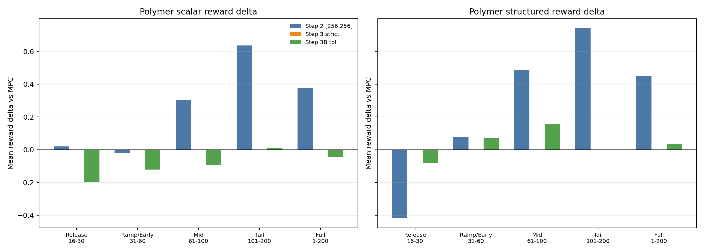

| Polymer method | Window | Step 2 `[256, 256]` delta | Step 3 strict delta | Step 3B tolerant delta |
|---|---|---:|---:|---:|
| Scalar matrix | 16-30 release | +0.0204 | -0.000015 | -0.1976 |
| Scalar matrix | 31-60 ramp/early | -0.0209 | +0.000045 | -0.1202 |
| Scalar matrix | 61-100 mid | +0.3021 | +0.000004 | -0.0919 |
| Scalar matrix | 101-200 tail | +0.6366 | +0.000021 | +0.0088 |
| Scalar matrix | 1-200 full | +0.3771 | +0.000015 | -0.0468 |
| Structured matrix | 16-30 release | -0.4180 | +0.000039 | -0.0825 |
| Structured matrix | 31-60 ramp/early | +0.0794 | +0.000056 | +0.0727 |
| Structured matrix | 61-100 mid | +0.4880 | -0.000015 | +0.1565 |
| Structured matrix | 101-200 tail | +0.7414 | -0.000008 | -0.0003 |
| Structured matrix | 1-200 full | +0.4489 | +0.000002 | +0.0359 |

Step 3B solved the strict-gate problem mechanically: it raised live acceptance into the range we expected. But the reward result shows that live acceptance alone is not the objective.

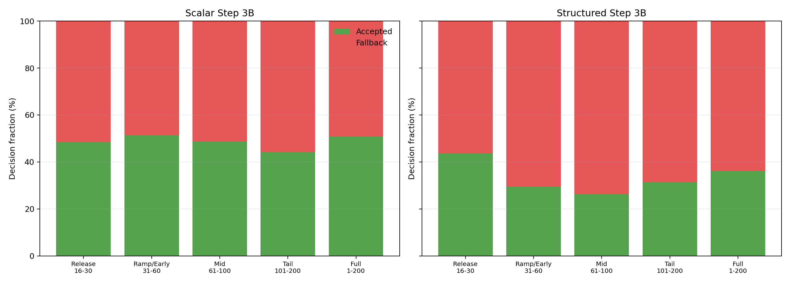

| Polymer method | Window | Accepted | Fallback | Median cost margin | 90th percentile relative margin |
|---|---|---:|---:|---:|---:|
| Scalar matrix | 16-30 release | 48.54% | 51.46% | 0.00000618 | 4.224% |
| Scalar matrix | 31-60 ramp/early | 51.42% | 48.58% | 0.00000761 | 0.899% |
| Scalar matrix | 61-100 mid | 48.69% | 51.31% | 0.00000925 | 2.297% |
| Scalar matrix | 101-200 tail | 44.27% | 55.73% | 0.00000784 | 1.864% |
| Structured matrix | 16-30 release | 43.68% | 56.32% | 0.00000939 | 12.010% |
| Structured matrix | 31-60 ramp/early | 29.48% | 70.52% | 0.00001506 | 56.552% |
| Structured matrix | 61-100 mid | 26.33% | 73.67% | 0.00002460 | 5.725% |
| Structured matrix | 101-200 tail | 31.35% | 68.65% | 0.00003351 | 13.001% |

The lesson is important: **nominal-cost closeness is a safety filter, not a performance filter**. A candidate can stay close enough to nominal MPC under the nominal objective and still be worse on the nonlinear plant. That is exactly what happened in the scalar Step 3B run. The structured run improved relative to strict Step 3, but it still lost most of the Step 2-only tail benefit.

The latest distillation runs make the same point more strongly.

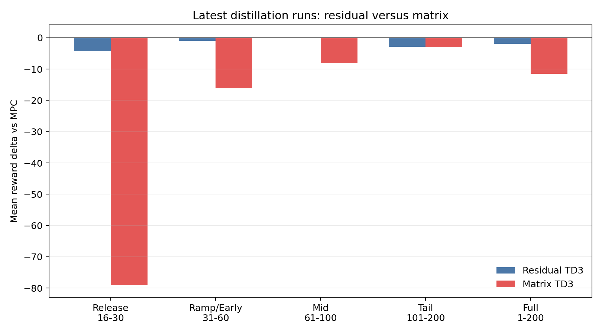

| Distillation method | Window | Mean reward delta | Win rate | Interpretation |
|---|---|---:|---:|---|
| Residual TD3 | 16-30 release | -4.3296 | 0.0% | Release is bad, but not catastrophic. |
| Residual TD3 | 31-60 early | -0.9111 | 3.3% | Recovers partially. |
| Residual TD3 | 61-100 mid | +0.1669 | 62.5% | Briefly beats MPC. |
| Residual TD3 | 101-200 tail | -2.8401 | 23.0% | Degrades again late. |
| Residual TD3 | 1-200 full | -1.8480 | 28.0% | Safer than matrix, but still not acceptable. |
| Matrix TD3 before steps | 16-30 release | -79.0156 | 0.0% | Severe release crash. |
| Matrix TD3 before steps | 31-60 early | -16.1642 | 0.0% | Recovery begins but remains far below MPC. |
| Matrix TD3 before steps | 61-100 mid | -8.0946 | 0.0% | Still much worse than MPC. |
| Matrix TD3 before steps | 101-200 tail | -3.0208 | 5.0% | Tail recovers but still loses. |
| Matrix TD3 before steps | 1-200 full | -11.4801 | 5.5% | Not transferable without protection. |

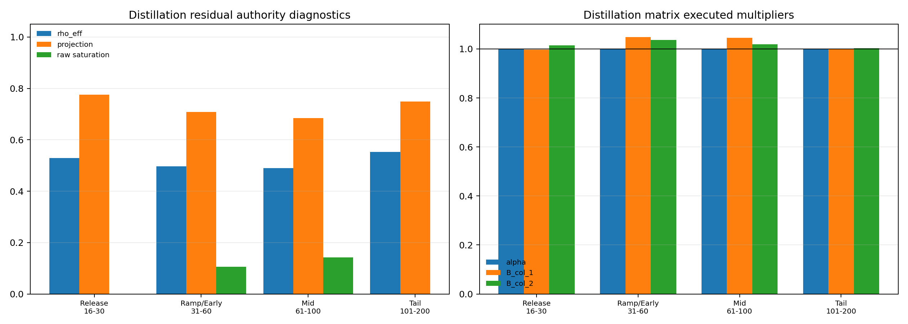

The residual run is safer because the `rho` authority layer strongly reduces the executed residual move:

| Residual diagnostic | Full-run mean | Live episodes 16-200 | Tail episodes 101-200 |
|---|---:|---:|---:|
| `projection_due_to_authority_log` | 67.56% | 73.03% | 74.86% |
| `rho_eff_log` | 0.5239 | 0.5285 | 0.5533 |
| `rho_log` | 0.4049 | 0.4106 | 0.4416 |

The actor is often asking for larger residual authority than the safety layer allows. In the tail, the raw residual action tends toward negative residual on input 1 and positive residual on input 2, but the executed residual is much smaller:

| Residual signal, tail 101-200 | Input 1 mean | Input 2 mean |
|---|---:|---:|
| Raw residual action | -0.4090 | +0.7933 |
| Executed residual action | -0.0178 | +0.0123 |
| Raw residual input correction | -0.0204 | +0.0397 |
| Executed residual input correction | -0.00089 | +0.00062 |

So residual authority is doing its safety job, but the method still does not learn a durable performance improvement. It briefly helps in episodes 61-100, then becomes worse again.

The matrix run is more alarming because it crashes even though `A` was already tight:

| Distillation matrix multiplier bounds | Low | High |
|---|---:|---:|
| `alpha` | 0.99 | 1.01 |
| `B_col_1` | 0.75 | 1.25 |
| `B_col_2` | 0.75 | 1.25 |

The latest matrix run has almost no raw action saturation (`action_saturation_trace` mean about `0.0003`). Therefore the failure is not simply "the policy hits the raw action boundary." Distillation is sensitive enough that moderate `B` movement inside the allowed range can still produce a very poor MPC decision. This matches the earlier user observation: tight `A`, wide `B`, and low exploration noise still degraded heavily.

#### Why The Distillation Residual Run Degrades Late

The latest residual run has a different failure mode from the matrix run. It does not collapse catastrophically. Instead, it improves briefly in episodes 61-100, then loses performance again in episodes 101-200.

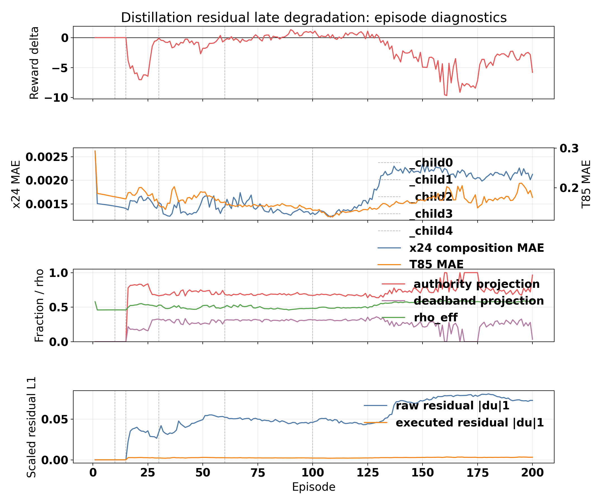

The important window comparison is:

| Window | RL reward | MPC reward | Reward delta | x24 MAE | T85 MAE | Reward bonus | Inside-band weight | Move penalty |
|---|---:|---:|---:|---:|---:|---:|---:|---:|
| 16-30 release | 13.8154 | 18.1450 | -4.3296 | 0.001544 | 0.1838 | 16.7354 | 0.7028 | 0.4958 |
| 31-60 early | 16.7218 | 17.6329 | -0.9111 | 0.001406 | 0.1731 | 19.8411 | 0.7101 | 0.6421 |
| 61-100 mid | 17.9100 | 17.7431 | +0.1669 | 0.001412 | 0.1541 | 20.8187 | 0.7157 | 0.6055 |
| 101-200 tail | 14.9184 | 17.7585 | -2.8401 | 0.001939 | 0.1637 | 18.5200 | 0.6915 | 0.6644 |

The late degradation is mostly a **tracking-quality and reward-bonus problem**, not only an input-move problem. From the good mid window to the bad tail window:

- x24 composition MAE increases from `0.001412` to `0.001939`.
- T85 MAE also worsens from `0.1541` to `0.1637`, but it remains better than the release window.
- the reward bonus drops from `20.8187` to `18.5200`;
- the inside-band weight drops from `0.7157` to `0.6915`;
- the move penalty rises only moderately, from `0.6055` to `0.6644`.

So the tail loss is driven by the controller moving farther from the reward's high-bonus tracking region. The x24 composition output matters a lot here because the distillation reward weights composition strongly (`Q1 = 3.7e4` in the current reward defaults).

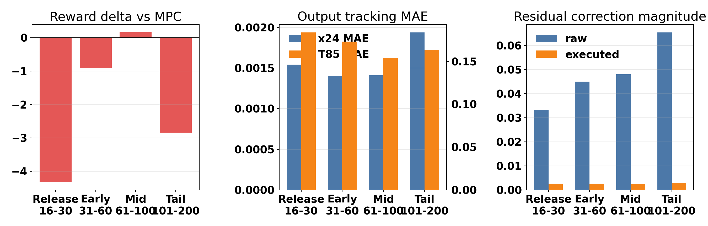

The residual authority logs show why the policy does not turn this into a useful correction:

| Window | Authority projection | Deadband projection | `rho_eff` | Raw residual L1 | Executed residual L1 | Raw input-2 action | Executed input-2 action |
|---|---:|---:|---:|---:|---:|---:|---:|
| 16-30 release | 77.5% | 22.0% | 0.5288 | 0.03314 | 0.00259 | -0.2021 | -0.0046 |
| 31-60 early | 70.9% | 28.7% | 0.4965 | 0.04503 | 0.00256 | +0.4677 | +0.0126 |
| 61-100 mid | 68.4% | 31.1% | 0.4904 | 0.04805 | 0.00236 | +0.5280 | +0.0097 |
| 101-200 tail | 74.9% | 24.7% | 0.5533 | 0.06540 | 0.00277 | +0.7933 | +0.0123 |

The raw policy request gets more aggressive in the tail. The raw residual magnitude rises from `0.04805` in the mid window to `0.06540` in the tail, and the raw second-input action rises from `+0.5280` to `+0.7933`. But the executed residual remains tiny because the authority layer clips it. In the tail, the raw residual correction is approximately:

| Tail residual signal | Input 1 | Input 2 |
|---|---:|---:|
| Raw residual correction | -0.02035 | +0.03969 |
| Executed residual correction | -0.00089 | +0.00062 |

This means the actor is increasingly asking for a correction that the authority system refuses to execute. The plant sees a very small correction, while the policy continues to move toward a larger raw correction. This is a projection mismatch in the learning problem.

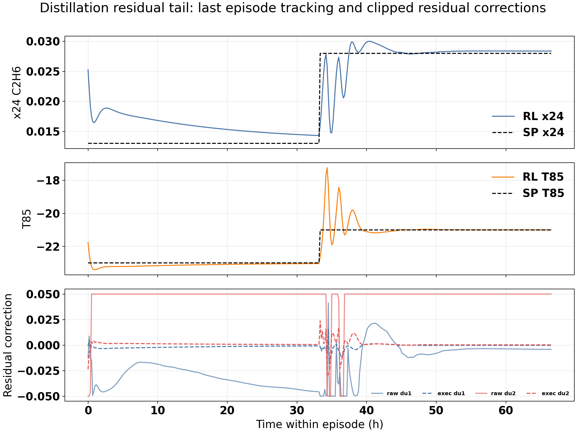

The episode-level correlations support the same diagnosis:

| Episode metric, episodes 16-200 | Correlation with reward delta |
|---|---:|
| Reward bonus term | +0.970 |
| Inside-band weight | +0.738 |
| x24 MAE | -0.693 |
| T85 MAE | -0.641 |
| Executed residual L1 | -0.779 |
| `rho_eff` | -0.786 |
| Authority projection fraction | -0.888 |
| Raw residual L1 | -0.599 |

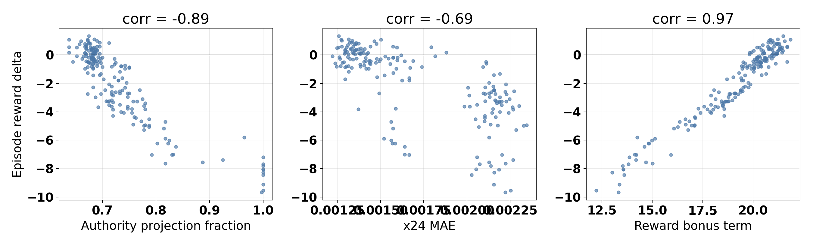

The strongest negative correlation is authority projection. This does not mean projection itself is bad; projection is preventing unsafe residual moves. It means episodes where the actor fights the projection layer are also episodes where the residual method loses to MPC. The residual policy is not learning a stable correction inside the executable authority envelope.

This connects directly to the matrix findings:

| Family | Safety layer behavior | Failure after safety layer |
|---|---|---|
| Matrix Step 3B | Nominal-cost tolerance allowed many candidates | Accepted candidates were not reliably plant-useful. |
| Residual with `rho` authority | Projection prevented large residual moves | Raw policy kept asking for mostly clipped corrections, and tail reward degraded. |

The shared lesson is: **a safety filter is not enough unless the learning problem is aligned with the filtered action that the plant actually experiences**.

For residual, the next fix should be projection-aware rather than simply widening authority. Widening `rho` or `authority_beta_res` could make the late tail worse because the raw policy is already pushing toward larger residuals. Better next candidates are:

| Candidate fix | Purpose |
|---|---|
| Add a projection penalty to the residual reward, such as `-lambda_proj ||delta_u_raw - delta_u_exec||_2^2`. | Discourage the policy from repeatedly asking for corrections that will be clipped. |
| Add a raw-action magnitude penalty when `projection_due_to_authority = 1`. | Keep the actor inside the executable authority envelope. |
| Train the actor through a projection-aware action, or add behavior-cloning pressure toward `executed_action_raw_log` when projection is active. | Reduce the off-manifold gap between actor output and replayed executed action. |
| Add a tail monitor: if authority projection stays above `70%` for a window, freeze residual authority or fall back to MPC residual zero for that window. | Prevent late drift from damaging the run after a good mid-window recovery. |

The immediate conclusion for distillation residual is: keep `rho` authority, but do not treat high projection as harmless. Persistent projection is now a diagnostic signal that the residual policy is outside the useful action envelope.

#### What To Do Next

The next improvement should not be "increase Step 3B tolerance." The scalar polymer run already shows that allowing more candidates can make performance worse. The next improvement should separate three concepts:

| Layer | Current behavior | Problem | Next change |
|---|---|---|---|
| Step 2 release guard | Clips multiplier authority during release | Useful; should stay | Keep enabled for matrix and structured polymer. |
| Step 3 nominal trust region | Accepts candidates close to nominal cost | Safety-only; not enough for performance | Convert to shadow logging or add a benefit test. |
| Performance acceptance | Not implemented | Candidate may be safe-ish but not useful | Add a candidate-benefit test before fallback is allowed to shape training. |

The most useful next version is Step 3C: a **dual-cost shadow gate**. It should log two quantities before we use it for fallback:

| Quantity | Meaning |
|---|---|
| `nominal_penalty = J(U_t^{cand}; A_0,B_0) - J(U_t^{nom}; A_0,B_0)` | How much safety budget the candidate consumes under the nominal model. |
| `candidate_advantage = J(U_t^{nom}; A_t^{cand},B_t^{cand}) - J(U_t^{cand}; A_t^{cand},B_t^{cand})` | Whether the candidate model predicts a meaningful benefit over the nominal input sequence. |

The candidate should only execute when it is both safe enough and useful enough:

$$ \mathrm{nominal\_penalty}_t \leq \epsilon_{\mathrm{safe}}. $$

$$ \mathrm{candidate\_advantage}_t \geq \epsilon_{\mathrm{benefit}}. $$

For the next polymer experiment, I would **not** keep Step 3B active as a hard fallback during training. The evidence says:

- Step 2-only is still the best polymer result so far.
- Strict Step 3 reproduced MPC.
- Tolerant Step 3B allowed authority but damaged scalar learning and removed most structured tail benefit.

Recommended next configuration for polymer:

| Setting | Recommended value |
|---|---|
| Step 1 diagnostic | on |
| Step 2 release guard | on |
| Step 3 fallback | off or shadow-only |
| Step 3C dual-cost logging | on |
| Distillation Step 2/3 | keep disabled until Step 3C is understood |

For distillation matrix, the latest pre-step run says Step 2-style release protection is necessary before any transfer. But the polymer Step 3B result says we should not transfer a simple nominal-cost fallback gate. Distillation should receive Step 2 release protection plus Step 3C shadow diagnostics first, not Step 3B hard fallback.

For distillation residual, the next question is different. Residual is already authority-limited by `rho`, but its tail still loses. That suggests a residual-specific improvement: use the `rho`/projection logs to decide when the residual policy is being mostly clipped and should stop training on its raw requested correction. In other words, residual may need executed-action replay plus a penalty for persistent authority projection, not a matrix-style multiplier cap.

### Why This Helps Distillation

The user-reported distillation behavior has the same shape as the polymer release problem, but worse: tight `A`, wide `B`, exploration noise `0.01`, and smoothing noise `0.01` still caused a heavy degradation, then recovery after about 100 episodes, and the final result still did not beat MPC.

The polymer result says the important split is:

- **Open-loop admissibility**: polymer diagnostic candidates are mostly stable, and distillation also has spectral margin.
- **Closed-loop release safety**: both systems can suffer when the actor first receives authority.
- **Gain-direction sensitivity**: `B` directions can remain dangerous even when `A` is tight.

For distillation, this means the first transfer should not be "copy polymer's wide bounds." The safer transfer is:

1. Run the same offline diagnostic with distillation still disabled by default until explicitly enabled.
2. Use release-protected caps for the first live episodes.
3. Add a performance acceptance layer before trusting wide `B` authority.

Distillation likely needs Step 3 after Step 2: an MPC acceptance or fallback gate. The reason is that the distillation run recovered but did not beat MPC, so protecting the first release dip may not be sufficient. The gate should accept the RL-assisted model only when a short nominal-cost or one-step prediction-health test is better than the nominal model; otherwise, execute nominal MPC for that decision.

## Executive Summary

The cap should not be calculated from one scalar rule. Use a two-layer rule:

1. **Admissibility cap**: remove model candidates that are numerically unsafe, unstable, infeasible, or structurally invalid.
2. **Performance cap**: among admissible candidates, keep only the region that does not degrade baseline MPC on short protected rollouts or nominal-cost checks.

For scalar matrix multipliers:

$$
\begin{aligned}
A_{\theta} &= \begin{bmatrix}
\alpha A_0^{\mathrm{phys}} & 0 \\
0 & I
\end{bmatrix}, \\
B_{\theta} &= \begin{bmatrix}
B_0^{\mathrm{phys}}\operatorname{diag}(\delta_1,\delta_2) \\
0
\end{bmatrix}.
\end{aligned}
$$

The `A` high cap has a clean analytical first pass:

$$
\alpha_{\max,\mathrm{stable}} = \frac{\rho_{\mathrm{target}}}{\rho(A_0^{\mathrm{phys}})}.
$$

### What `rho` Means

In this report, `rho(A)` means the **spectral radius** of the matrix `A`. It is not the residual-authority `rho` used in some residual notebooks. Here it is only a matrix-stability quantity.

For a discrete-time linear prediction model,

$$
x_{k+1} = A x_k + B u_k.
$$

The eigenvalues of `A` are the natural modes of the model. They are computed from:

$$
\det(\lambda I - A) = 0.
$$

If the eigenvalues are:

$$
\lambda(A) = \{\lambda_1,\lambda_2,\ldots,\lambda_n\},
$$

then the spectral radius is:

$$
\rho(A) = \max_{1 \le i \le n} |\lambda_i|.
$$

For a complex eigenvalue, the magnitude is:

$$
|\lambda_i| = \sqrt{\operatorname{Re}(\lambda_i)^2 + \operatorname{Im}(\lambda_i)^2}.
$$

For a discrete-time physical model, `rho(A) < 1` means the unforced physical-state prediction decays instead of growing. We calculate this on the physical `A` block, `A0_phys`, not on the full offset-free augmented matrix, because the augmented disturbance/integrator states intentionally include unit eigenvalues.

For the scalar matrix multiplier,

$$
A_{\theta}^{\mathrm{phys}} = \alpha A_0^{\mathrm{phys}}.
$$

Scaling a matrix by `alpha` scales every eigenvalue by `alpha`:

$$
\lambda_i(\alpha A_0^{\mathrm{phys}}) = \alpha \lambda_i(A_0^{\mathrm{phys}}).
$$

Therefore:

$$
\rho(\alpha A_0^{\mathrm{phys}}) = |\alpha| \rho(A_0^{\mathrm{phys}}).
$$

If we require the candidate model to stay below a target spectral radius,

$$
\rho(\alpha A_0^{\mathrm{phys}}) \le \rho_{\mathrm{target}},
$$

then for positive `alpha`:

$$
\alpha \le \frac{\rho_{\mathrm{target}}}{\rho(A_0^{\mathrm{phys}})}.
$$

That is the origin of the cap formula. With `rho_target = 1`:

$$
\alpha_{\max,\mathrm{polymer}} = \frac{1}{0.9464} \approx 1.0566.
$$

$$
\alpha_{\max,\mathrm{distillation}} = \frac{1}{0.8383} \approx 1.1929.
$$

For structured matrix updates, there is no scalar shortcut unless every physical `A` entry is scaled by the same `alpha`. The calculation becomes direct:

$$
\rho(A_{\theta}^{\mathrm{phys}}) = \max_i |\lambda_i(A_{\theta}^{\mathrm{phys}})|.
$$

So for structured candidates we build `A_theta_phys`, compute its eigenvalues, take their magnitudes, and keep the largest magnitude.

Using `rho_target = 1` gives the currently documented values:

| System | `rho(A0_phys)` | `1 / rho(A0_phys)` | Interpretation |
| --- | ---: | ---: | --- |
| Polymer | 0.9464 | 1.0566 | Less open-loop spectral margin, but the matrix policy still found useful corrections in the wide `A,B` search. |
| Distillation | 0.8383 | 1.1929 | More open-loop spectral margin, but much less tolerance to wrong closed-loop gain corrections. |

For `B`, there is no equivalent spectral-stability cap. `B` caps must come from finite-horizon gain trust, actuator headroom, prediction-error checks, and closed-loop baseline non-regression.

The polymer result should be read carefully. The first important polymer lesson is that the direct matrix method could benefit from a wide `A,B` search: the successful matrix policy learned a useful low-dimensional model correction instead of being harmed permanently by the larger authority. The later capped reruns then showed that adding an `A` safety cap can keep the same family in a cleaner admissible region. So polymer is not proof that "tight `A` is the only working design"; it is proof that polymer can tolerate and exploit wider model authority when the learned correction points in a useful direction.

| Polymer run | Final test phys MAE | Final test reward | `A` drift | `B` drift | Spectral p95 |
| --- | ---: | ---: | ---: | ---: | ---: |
| Matrix first capped | 0.1487 | -3.5844 | 0.1132 | 0.2146 | 1.0000 |
| Matrix latest capped | 0.1519 | -3.5773 | 0.0952 | 0.1563 | 0.9990 |
| Structured first capped | 0.2454 | -4.2549 | 0.1748 | 0.1893 | 1.1598 |
| Structured latest capped | 0.1551 | -3.5554 | 0.1788 | 0.1489 | 0.9999 |

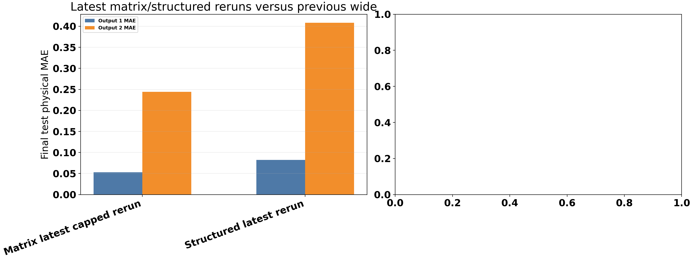

The distillation result changes the bottleneck diagnosis. Wide `A` and wide `B` was bad. Tight `A` with wide `B` was also bad. That comparison says the immediate failure is not mainly "the `A` multiplier made the model unstable." It says that distillation is sensitive to the finite-horizon input-output gain and input-allocation changes that remain after `A` has been tightened, especially the `B` direction.

The mathematical reason is that MPC does not optimize directly on `rho(A)`. MPC optimizes on the finite-horizon input-output map:

$$
\Delta Y_N = G_N(A,B)\Delta U_N + d_N.
$$

Even if `A` is almost nominal, changing `B` changes every Markov block that the optimizer sees:

$$
G_N(A_0,B_{\theta}) - G_N(A_0,B_0) = \begin{bmatrix}
C(B_{\theta}-B_0) \\
C A_0(B_{\theta}-B_0) \\
\cdots \\
C A_0^{N-1}(B_{\theta}-B_0)
\end{bmatrix}.
$$

The first block, `C(B_theta - B0)`, affects the predicted one-step output response immediately. In distillation, reflux and reboiler duty are strongly coupled, constrained, and reward-asymmetric. So a wrong `B` multiplier can make MPC believe the wrong input is more effective, or that an input has more headroom/effect than the Aspen plant actually gives. That can degrade the closed-loop decision even when:

$$
\rho(A_{\theta}^{\mathrm{phys}}) < 1.
$$

This is why tight `A` plus wide `B` is still a bad distillation result: it removes the obvious `A`-stability explanation and leaves finite-horizon gain trust, input allocation, and reward alignment as the bottleneck. The next fix should be:

- nominal-cost backtracking/fallback for both matrix and structured matrix,
- mismatch-gated effective model authority,
- staged `B` authority release,
- TD3+BC-style actor anchoring during the post-warm-start handoff,
- reward rebalance for the distillation outputs.

## Current Code Facts

The current scalar matrix path uses `utils/multiplier_mapping.py` to map normalized actor actions in `[-1, 1]` into asymmetric physical multiplier bounds. The nominal action maps to multiplier `1.0`.

For scalar matrix updates, `utils/matrix_runner.py` applies:

$$
\begin{aligned}
A^{\mathrm{phys}}_{\mathrm{cand}} &= \alpha A^{\mathrm{phys}}_0, \\
B^{\mathrm{phys}}_{\mathrm{cand}} &= B^{\mathrm{phys}}_0 \operatorname{diag}(\delta).
\end{aligned}
$$

For structured updates, `utils/structured_model_update.py` builds either a block or band multiplier family. The active distillation default is block mode:

$$
\theta_A = [\theta_{A,\mathrm{block1}},\theta_{A,\mathrm{block2}},\theta_{A,\mathrm{block3}},\theta_{A,\mathrm{off}}].
$$

$$
\theta_B = [\theta_{B,1},\theta_{B,2}].
$$

In block mode, diagonal state groups are scaled by their own `theta_A` values, off-block couplings are scaled by `theta_A_off`, and each input column of `B` is scaled by its corresponding `theta_B`.

The current distillation config in `systems/distillation/config.py` sets:

| Quantity | Current value |
| --- | --- |
| `DISTILLATION_MATRIX_ALPHA_UPPER_CAP` | `1.1929` |
| `DISTILLATION_MATRIX_ALPHA_DEFAULT_LOW` | `0.99` |
| `DISTILLATION_MATRIX_ALPHA_DEFAULT_HIGH` | `1.01` |
| `DISTILLATION_DEFAULT_MULTIPLIER_LOW` | `0.75` |
| `DISTILLATION_DEFAULT_MULTIPLIER_HIGH` | `1.25` |

The current distillation TD3 matrix defaults in `systems/distillation/notebook_params.py` now also use:

| TD3 field | Current value |
| --- | ---: |
| `target_policy_smoothing_noise_std` | 0.01 |
| `std_start` | 0.01 |
| `std_end` | 0.01 |
| `param_noise_std_start` | 0.01 |
| `param_noise_std_end` | 0.01 |
| `post_warm_start_action_freeze_subepisodes` | 5 |
| `post_warm_start_actor_freeze_subepisodes` | 5 |

That means the newest degradation is happening even after the first round of conservative release changes. In the active distillation matrix notebook output, the first several subepisodes stay at nominal multipliers, then the first live learned region degrades sharply. The visible output shows:

| Subepisode | Avg reward | Mean `alpha` | Mean `delta` |
| ---: | ---: | ---: | --- |
| 1 | 11.6800 | 1.0000 | `[1.0000, 1.0000]` |
| 2 | 17.6939 | 1.0000 | `[1.0000, 1.0000]` |
| 3 | 17.6866 | 1.0000 | `[1.0000, 1.0000]` |
| 4 | 17.6821 | 1.0000 | `[1.0000, 1.0000]` |
| 5 | 17.6792 | 1.0000 | `[1.0000, 1.0000]` |
| 6 | -1137.8245 | 0.9846 | `[0.9851, 1.0105]` |
| 7 | -915.3582 | 1.0695 | `[0.9968, 0.9943]` |

The active structured notebook output shows a similar pattern in a less extreme form: `theta_A` stays very close to `1.0`, while `theta_B` moves more, and late visible rewards remain far below the nominal warm-start reward. This supports the diagnosis that the problem is not only `A` high instability. The learned policy is still finding model changes that are admissible but bad for closed-loop performance.

## Method Algorithms

Both multiplier methods follow the same high-level idea:

> The RL agent does not directly choose the plant input. The RL agent chooses a modified prediction model. MPC then solves its normal constrained optimization problem using that modified prediction model.

This is why the method is different from a residual controller. A residual controller adds a correction to the MPC input. A multiplier controller changes the model that MPC believes, then lets MPC choose the input under constraints.

At time `t`, the RL state contains the observer state, setpoint, current input, and optionally mismatch features:

$$
s_t = \phi(\hat{x}_t,\hat{d}_t,y_t^{\mathrm{sp}},u_{t-1},e_t,\nu_t).
$$

The actor returns a normalized action:

$$
a_t = \pi_{\psi}(s_t).
$$

Each action coordinate is clipped to `[-1,1]` and mapped around nominal multiplier `1.0`. For lower bound `ell_j` and upper bound `h_j`:

$$
\theta_j(a_{t,j}) = \begin{cases}
1 + a_{t,j}(1-\ell_j), & a_{t,j} \le 0, \\
1 + a_{t,j}(h_j-1), & a_{t,j} > 0.
\end{cases}
$$

So `a_j = 0` means "use nominal model", `a_j = -1` means "use lower cap", and `a_j = 1` means "use upper cap." This centered mapping is important because the nominal action is always meaningful even when the low and high bounds are asymmetric.

After mapping, the runner builds a candidate prediction model:

$$
(A_t^{\mathrm{pred}},B_t^{\mathrm{pred}}) = \mathcal{M}_{\theta_t}(A_0,B_0).
$$

MPC then solves:

$$
U_t^\star = \arg\min_{U \in \mathcal{U}} J_N(U;A_t^{\mathrm{pred}},B_t^{\mathrm{pred}},\hat{x}_t,\hat{d}_t,y_t^{\mathrm{sp}},u_{t-1}).
$$

Only the first input move is applied:

$$
u_t = u_{t,0}^\star.
$$

The nonlinear plant evolves, the reward is computed from scaled tracking error and input movement, and the transition is pushed to the replay buffer:

$$
(s_t,a_t,r_t,s_{t+1}) \rightarrow \mathcal{D}.
$$

During test steps, the actor is evaluated without exploration. During training steps, TD3 or SAC updates from the replay buffer. In the TD3 path, the current Phase 1 hidden-release logic can execute the nominal action for several post-warm-start subepisodes while still evaluating/training the actor in the background.

### Algorithm A: Scalar Matrix Multiplier

The scalar matrix method uses one `A` multiplier and one `B` multiplier per manipulated input:

$$
\theta_t = [\alpha_t,\delta_{t,1},\ldots,\delta_{t,m}].
$$

For the two-input polymer and distillation cases:

$$
\theta_t = [\alpha_t,\delta_{t,1},\delta_{t,2}].
$$

The candidate physical model is:

$$
A_{t,\mathrm{phys}}^{\mathrm{pred}} = \alpha_t A_{0,\mathrm{phys}}.
$$

$$
B_{t,\mathrm{phys}}^{\mathrm{pred}} = B_{0,\mathrm{phys}}\operatorname{diag}(\delta_{t,1},\delta_{t,2}).
$$

The augmented offset-free structure is preserved:

$$
A_t^{\mathrm{pred}} = \begin{bmatrix}
A_{t,\mathrm{phys}}^{\mathrm{pred}} & 0 \\
0 & I
\end{bmatrix}.
$$

$$
B_t^{\mathrm{pred}} = \begin{bmatrix}
B_{t,\mathrm{phys}}^{\mathrm{pred}} \\
0
\end{bmatrix}.
$$

The current code uses the modified model for MPC prediction, but keeps the observer update on the nominal model. That means:

$$
(A_{\mathrm{observer}},B_{\mathrm{observer}}) = (A_0,B_0).
$$

This is conservative: the learned model affects the optimizer's prediction, but the state estimator is not redesigned every time the actor changes a multiplier.

The scalar algorithm is:

```text
Input:
  nominal augmented model A0, B0, C
  physical-state dimension n_phys
  actor bounds low_coef, high_coef
  observer state xhatdhat_t
  previous input u_{t-1}
  setpoint y_sp_t

At each step t:
  1. Build RL state s_t.
  2. If still in warm start or hidden release, use nominal raw action.
  3. Otherwise get actor action a_t from TD3/SAC.
  4. Map a_t to multipliers theta_t = [alpha_t, delta_t].
  5. Build A_pred by multiplying the physical A block by alpha_t.
  6. Build B_pred by multiplying each physical B input column by delta_{t,j}.
  7. Put A_pred, B_pred into the MPC object.
  8. Solve the constrained MPC optimization.
  9. Apply the first input move to the nonlinear plant.
  10. Update the nominal observer.
  11. Compute reward and push the transition if this is a training step.
  12. Train the agent after warm start.
```

The scalar method is low-dimensional and easy to interpret. Its main limitation is that it assumes all physical-state dynamics should be scaled by the same `alpha`. That is why it can work well when the useful correction is global, but it can be too blunt if only a subset of model couplings is wrong.

### Algorithm B: Structured Matrix Multiplier

The structured method keeps the same RL-MPC loop but replaces the scalar model update with a structured model family. In block mode:

$$
\theta_t = [\theta_{A,1},\theta_{A,2},\theta_{A,3},\theta_{A,\mathrm{off}},\theta_{B,1},\theta_{B,2}].
$$

The physical states are partitioned into block groups:

$$
\mathcal{G} = \{\mathcal{G}_1,\mathcal{G}_2,\mathcal{G}_3\}.
$$

For a physical `A` entry with row `i` and column `j`:

$$
[A_{t,\mathrm{phys}}^{\mathrm{pred}}]_{ij} = \begin{cases}
\theta_{A,g}[A_{0,\mathrm{phys}}]_{ij}, & i \in \mathcal{G}_g,\ j \in \mathcal{G}_g, \\
\theta_{A,\mathrm{off}}[A_{0,\mathrm{phys}}]_{ij}, & i \in \mathcal{G}_g,\ j \in \mathcal{G}_h,\ g \ne h.
\end{cases}
$$

For the `B` matrix:

$$
[B_{t,\mathrm{phys}}^{\mathrm{pred}}]_{ij} = \theta_{B,j}[B_{0,\mathrm{phys}}]_{ij}.
$$

In band mode, the `A` multiplier depends on matrix distance from the diagonal:

$$
[A_{t,\mathrm{phys}}^{\mathrm{pred}}]_{ij} = \theta_{A,|i-j|}[A_{0,\mathrm{phys}}]_{ij}.
$$

Only configured offsets are scaled; unconfigured entries remain nominal. The augmented offset-free structure is still preserved exactly, so the disturbance identity block and zero coupling blocks are not changed.

The structured runner also has a stronger fallback path than the scalar runner. If the structured action is non-finite, invalid, violates preserved augmented structure, or causes an assisted MPC solve failure, the runner can replace the candidate prediction model with the nominal model:

$$
\theta_t^{\mathrm{eff}} = \mathbf{1}.
$$

The transition stored in replay uses the effective action, not the failed raw action, when fallback occurs. This matters because the critic should learn from the action that was actually executed through MPC.

The structured algorithm is:

```text
Input:
  nominal augmented model A0, B0, C
  structured spec: block or band
  per-coordinate low/high bounds
  observer state xhatdhat_t
  previous input u_{t-1}
  setpoint y_sp_t

Before rollout:
  1. Split A0, B0 into physical and offset-free disturbance blocks.
  2. Resolve block groups or band offsets.
  3. Build action labels and low/high bounds.
  4. Build the nominal structured payload with all multipliers equal to one.

At each step t:
  1. Build RL state s_t.
  2. Use nominal raw action during warm start or hidden release.
  3. Otherwise get actor action a_t from TD3/SAC.
  4. Map a_t to structured multipliers theta_A,t and theta_B,t.
  5. Build candidate A_pred, B_pred using block or band rules.
  6. Validate finite values and preserved augmented structure.
  7. Log candidate spectral radius, A Frobenius drift, B Frobenius drift, saturation, and near-bound fraction.
  8. If candidate is invalid, fallback to nominal prediction model.
  9. Solve MPC with candidate prediction model.
  10. If the solve fails and fallback is enabled, solve again with nominal prediction model.
  11. Apply the first input move to the nonlinear plant.
  12. Update the nominal observer.
  13. Compute reward and push the effective transition if this is a training step.
  14. Train the agent after warm start.
```

Structured mode is more expressive than scalar matrix mode, but that expressiveness is exactly why it needs per-coordinate caps. `A_block_j`, `A_off`, `B_col_1`, and `B_col_2` can have very different effects on the MPC prediction. A shared cap treats them as equally risky, which is usually false.

### What The Two Algorithms Have In Common

Both methods optimize the same outer RL objective:

$$
\max_{\psi} \mathbb{E}[\sum_{t=0}^{T-1}\gamma^t r_t].
$$

But the action affects the reward indirectly:

$$
a_t \rightarrow \theta_t \rightarrow (A_t^{\mathrm{pred}},B_t^{\mathrm{pred}}) \rightarrow U_t^\star \rightarrow u_t \rightarrow y_{t+1} \rightarrow r_t.
$$

This indirect path is the reason the method can be powerful and also fragile. A small multiplier can change the optimizer's predicted gain, which changes the selected input sequence. The plant never sees the multiplier directly; it only sees the input chosen by MPC after the multiplier has changed the prediction model.

## Why Stability Caps Are Not Enough

A stability cap answers this question:

> Will the candidate prediction model have acceptable open-loop physical-model poles?

The distillation failure asks a different question:

> Will the candidate prediction model improve the closed-loop MPC decision under the real nonlinear plant, disturbance profile, reward scaling, and input constraints?

Those are not equivalent.

For scalar `A`, open-loop stability is easy:

$$
\rho(\alpha A_0^{\mathrm{phys}}) = |\alpha| \rho(A_0^{\mathrm{phys}}),
$$

so a positive upper bound can be computed directly. But even with `alpha` restricted to `[0.99, 1.01]`, the finite-horizon input-output prediction can still change through `B`:

$$
G_N(A,B) = \begin{bmatrix}
C B \\
C A B \\
C A^2 B \\
\vdots \\
C A^{N-1}B
\end{bmatrix}.
$$

The MPC optimizer sees `G_N`, not only `rho(A)`. A wide `B` range can change predicted move authority and input allocation while all poles remain stable. That is useful in polymer, but in distillation it can make the optimizer trust a gain correction that the Aspen plant does not reward.

The cap design therefore needs three levels:

1. **Pole admissibility** for `A`.
2. **Finite-horizon gain trust** for `A` and `B` together.
3. **Closed-loop non-regression** against baseline MPC.

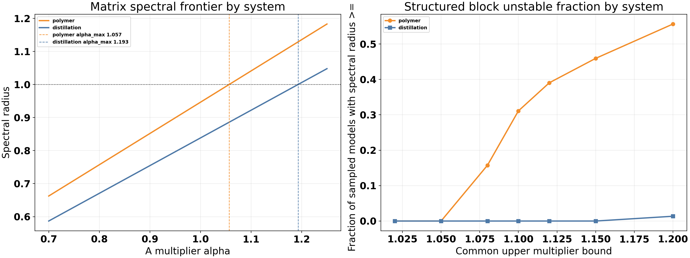

The existing cross-system admissibility figure shows why polymer and distillation split. Polymer needs the tight `A` cap because the nominal `A` is already close to the unit circle. Distillation has more open-loop spectral margin, but its saved and user-reported RL runs still degrade because admissible models can still be poor control models.

## Cap Calculation Procedure

Use this procedure for both matrix and structured matrix. The difference is only the candidate generator.

### Step 1. Define The Candidate Family

For matrix:

$$
\theta = [\alpha, \delta_1, \delta_2].
$$

For structured block mode:

$$
\theta = [\theta_{A,\mathrm{block1}},\theta_{A,\mathrm{block2}},\theta_{A,\mathrm{block3}},\theta_{A,\mathrm{off}},\theta_{B,1},\theta_{B,2}].
$$

The raw actor space can remain wide, but the effective model space should be filtered or gated before MPC receives it.

### Step 2. Compute The Analytical `A` Ceiling

Choose a target spectral margin:

$$
\rho_{\mathrm{target}} \in [0.98, 0.995]
$$

for routine closed-loop training, or `rho_target = 1.0` only for a hard mathematical upper bound.

Then:

$$
\begin{aligned}
\alpha_{\mathrm{high}}^{\mathrm{stab}} &= \min\left(
\alpha_{\mathrm{user}}^{\mathrm{high}},
\frac{\rho_{\mathrm{target}}}{\rho(A_0^{\mathrm{phys}})}
\right).
\end{aligned}
$$

For polymer, `rho(A0_phys) ~= 0.9464`, so:

$$
\frac{1.0}{0.9464} \approx 1.0566.
$$

That is why the polymer `A` cap around `1.0566` is meaningful.

For distillation, `rho(A0_phys) ~= 0.8383`, so:

$$
\frac{1.0}{0.8383} \approx 1.1929.
$$

But the active distillation default is already much tighter than that:

$$
\alpha \in [0.99, 1.01].
$$

So for distillation, the next improvement should not be "make `A` even tighter" unless diagnostics show `A` is still causing a specific issue. It should be "keep `A` tight near nominal, but add performance filters and `B` authority control."

### Step 3. Calculate A Finite-Horizon Gain Cap

For each candidate model, compute the finite-horizon Markov matrix:

$$
\begin{aligned}
G_N(A_{\theta}, B_{\theta}) &= \begin{bmatrix}
C B_{\theta} \\
C A_{\theta}B_{\theta} \\
\cdots \\
C A_{\theta}^{N-1}B_{\theta}
\end{bmatrix}.
\end{aligned}
$$

Then define a gain-change ratio:

$$
\begin{aligned}
r_G(\theta) &= \frac{\left\|G_N(A_{\theta}, B_{\theta}) - G_N(A_0, B_0)\right\|_F}{\left\|G_N(A_0, B_0)\right\|_F + \epsilon}.
\end{aligned}
$$

Use the MPC prediction horizon for `N`: polymer matrix currently uses `predict_h = 9`; distillation matrix uses `predict_h = 6`.

A practical initial rule:

$$
\begin{aligned}
r_G(\theta) &\le \epsilon_G, \\
\epsilon_G &\in [0.10, 0.25].
\end{aligned}
$$

Use `0.10` for distillation until the policy reliably beats MPC, because the latest distillation run shows that wide `B` authority still creates a bad release.

### Step 4. Add Input-Headroom And Move-Size Caps

The `B` multiplier affects how much the MPC thinks each manipulated input can move the outputs. It should be capped by headroom:

$$
\begin{aligned}
h_j(t) &= \min\left(
\frac{u_{\max,j} - u_{t,j}}{u_{\max,j} - u_{\min,j}},
\frac{u_{t,j} - u_{\min,j}}{u_{\max,j} - u_{\min,j}}
\right).
\end{aligned}
$$

If the candidate model repeatedly drives low headroom or large input moves, shrink the effective `B` range:

$$
\begin{aligned}
\delta_{j}^{\mathrm{eff}} &= 1 + \lambda_{B,j}(\delta_j^{\mathrm{raw}} - 1), \\
\lambda_{B,j} &\in [0,1].
\end{aligned}
$$

A first rule for distillation:

$$
\begin{aligned}
\lambda_{B,j} &= \min\left(
1,
\frac{\operatorname{p50}(h_j)}{h_{\mathrm{safe}}}
\right), \\
h_{\mathrm{safe}} \in [0.15,0.25].
\end{aligned}
$$

This is better than narrowing `B` permanently, because it keeps `B` available when the column has room and shrinks it when the optimizer is already near an actuator edge.

### Step 5. Add A Nominal-Cost Acceptance Test

For each step, compare the candidate model against the nominal model before applying the candidate prediction model:

$$
\begin{aligned}
J_t^{\mathrm{cand}} &= J\!\left(
U_t^{\mathrm{cand}};
A_{\theta},
B_{\theta},
x_t,
y_t^{\mathrm{sp}}
\right), \\
J_t^{\mathrm{nom}} &= J\!\left(
U_t^{\mathrm{nom}};
A_0,
B_0,
x_t,
y_t^{\mathrm{sp}}
\right).
\end{aligned}
$$

Accept the candidate only if:

$$
J_t^{\mathrm{cand}} \le J_t^{\mathrm{nom}} + \epsilon_J.
$$

If it fails, backtrack toward nominal:

$$
\begin{aligned}
\theta^{\mathrm{eff}} &= 1 + \lambda(\theta^{\mathrm{raw}} - 1), \\
\lambda &\leftarrow \beta \lambda, \\
\beta &\in [0.25,0.5].
\end{aligned}
$$

until the candidate passes or `lambda = 0`, which recovers nominal MPC.

This is the missing piece in distillation. The current structured runner has a solve-failure fallback, but a solve can succeed while the closed-loop decision is still bad. Distillation needs a **performance fallback**, not only a numerical fallback.

## Structured Cap Calculation

For structured matrix, do not derive the cap only from the scalar matrix `alpha`, and do not assume every structured multiplier should share the same cap. Structured mode has several coordinates with different meanings, so it should eventually use **per-coordinate caps**.

In the current block mode, the action is:

$$
\theta = [\theta_{A,\mathrm{block1}},\theta_{A,\mathrm{block2}},\theta_{A,\mathrm{block3}},\theta_{A,\mathrm{off}},\theta_{B,1},\theta_{B,2}].
$$

The first three values scale within-block physical-state dynamics. `theta_A_off` scales cross-block coupling. The two `B` values scale the two manipulated-input columns. These are not equally risky:

- `A_block_j` changes time-scale and local state-memory behavior for one state group.
- `A_off` changes coupling between state groups; it can be more delicate than a diagonal block because it changes interaction paths.
- `B_col_j` changes the predicted authority of one manipulated input; it directly changes MPC input allocation.

In band mode, the same logic applies, but the coordinates are band offsets:

$$
\theta = [\theta_{A,\mathrm{band0}},\theta_{A,\mathrm{band1}},\theta_{A,\mathrm{band2}},\ldots,\theta_{B,1},\theta_{B,2}].
$$

`A_band0` is the main diagonal band, while higher bands are coupling bands. The higher bands should normally receive stricter caps until sensitivity scans show they are harmless.

The current code can already represent this. In `utils/structured_model_update.py`, `a_low_override`, `a_high_override`, `b_low_override`, and `b_high_override` can be scalars or arrays. A scalar means "same cap for every coordinate in that group"; an array means "different cap per multiplier." The report recommendation is to move from scalar overrides to array overrides after the first sensitivity scan.

### Per-Multiplier Sensitivity Scan

Use log-multiplier coordinates because they make upward and downward moves comparable:

$$
\theta_j = \exp(z_j).
$$

The nominal model is:

$$
z_0 = 0.
$$

For each structured coordinate `j`, perturb only that coordinate:

$$
z^{+,j} = z_0 + \varepsilon e_j.
$$

$$
z^{-,j} = z_0 - \varepsilon e_j.
$$

Then build the two candidate models:

$$
(A^{+,j},B^{+,j}) = \mathcal{M}(\exp(z^{+,j})).
$$

$$
(A^{-,j},B^{-,j}) = \mathcal{M}(\exp(z^{-,j})).
$$

The spectral sensitivity of coordinate `j` is:

$$
S_{\rho,j} = \frac{|\rho(A^{+,j}_{\mathrm{phys}})-\rho(A^{-,j}_{\mathrm{phys}})|}{2\varepsilon}.
$$

The finite-horizon gain sensitivity is:

$$
S_{G,j} = \frac{\left\|G_N(A^{+,j},B^{+,j})-G_N(A^{-,j},B^{-,j})\right\|_F}{2\varepsilon\left(\left\|G_N(A_0,B_0)\right\|_F+\epsilon\right)}.
$$

If candidate rollouts are available, also compute a closed-loop cost sensitivity:

$$
S_{J,j} = \frac{|J^{+,j}-J^{-,j}|}{2\varepsilon(|J^{0}|+\epsilon)}.
$$

These three numbers answer different questions:

- `S_rho,j`: does this multiplier move the prediction poles?
- `S_G,j`: does this multiplier change the MPC input-output map?
- `S_J,j`: does this multiplier change the actual closed-loop objective?

The per-coordinate log authority should then shrink when a coordinate is sensitive:

$$
d_{\rho,j} = \frac{\gamma_{\rho}(\rho_{\mathrm{target}}-\rho_0)}{S_{\rho,j}+\epsilon}.
$$

$$
d_{G,j} = \frac{\gamma_G \epsilon_G}{S_{G,j}+\epsilon}.
$$

$$
d_{J,j} = \frac{\gamma_J \epsilon_J}{S_{J,j}+\epsilon}.
$$

Then:

$$
d_j = \min(d_{\mathrm{user},j},d_{\rho,j},d_{G,j},d_{J,j}).
$$

For `B` coordinates, `d_rho,j` is usually ignored because `B` does not set open-loop stability. Use `d_G,j`, `d_J,j`, actuator headroom, and input-move diagnostics instead.

Convert the log authority back to multiplier bounds:

$$
\theta_{\mathrm{low},j}^{\mathrm{sens}} = \exp(-d_j).
$$

$$
\theta_{\mathrm{high},j}^{\mathrm{sens}} = \exp(d_j).
$$

This gives different caps for every structured multiplier. A sensitive off-block or input column naturally receives a narrower interval than a harmless block.

### Accepted-Set Quantile Caps

Let:

$$
\Theta = \{\theta^{(1)}, \ldots, \theta^{(M)}\}.
$$

be random or grid-sampled candidates from the raw range. For each candidate, compute:

$$
\begin{aligned}
\rho_i &= \rho(A_{\theta^{(i)}}^{\mathrm{phys}}), \\
r_{G,i} &= r_G(\theta^{(i)}), \\
f_i &= \mathbf{1}\{\text{MPC solve and cost acceptance pass}\}.
\end{aligned}
$$

Build the accepted set:

$$
\begin{aligned}
\Theta_{\mathrm{acc}} &= \left\{
\theta^{(i)}
:
\rho_i \le \rho_{\mathrm{target}},
\quad
r_{G,i} \le \epsilon_G,
\quad
f_i = 1
\right\}.
\end{aligned}
$$

Then choose per-coordinate bounds from robust quantiles:

$$
\begin{aligned}
\theta_{\mathrm{low},j} &= Q_{0.05}(\Theta_{\mathrm{acc},j}), \\
\theta_{\mathrm{high},j} &= Q_{0.95}(\Theta_{\mathrm{acc},j}).
\end{aligned}
$$

Combine the sensitivity and accepted-set caps:

$$
\theta_{\mathrm{low},j}^{\mathrm{final}} = \max(\theta_{\mathrm{user,low},j},\theta_{\mathrm{low},j}^{\mathrm{sens}},Q_{0.05}(\Theta_{\mathrm{acc},j})).
$$

$$
\theta_{\mathrm{high},j}^{\mathrm{final}} = \min(\theta_{\mathrm{user,high},j},\theta_{\mathrm{high},j}^{\mathrm{sens}},Q_{0.95}(\Theta_{\mathrm{acc},j})).
$$

Finally, test the worst corners and random joint combinations. Per-coordinate bounds are necessary but not sufficient, because two individually safe multipliers can still combine into an unsafe model. If the joint high corner fails, shrink the high quantile from `0.95` to `0.90`, or shrink only the coordinate with the largest contribution to `r_G`.

### Practical Starting Policy

For polymer, the successful wide matrix result means the plain scalar matrix family can tolerate wide `A,B` search. Structured is different because it perturbs several model substructures at the same time. A practical polymer structured starting point is:

| Coordinate type | Initial cap logic |
| --- | --- |
| `A_block_j` | use the scalar `A` cap as the first ceiling, then shrink blocks with high `S_rho,j` or `S_G,j` |
| `A_off` | start tighter than the block caps because it changes inter-block coupling |
| `B_col_j` | keep wider than `A`, but split by input-column sensitivity and headroom |

For distillation, the evidence says the cap should be even more coordinate-specific:

| Coordinate type | Initial distillation policy |
| --- | --- |
| `A_block_j` | keep near nominal unless sensitivity scan shows a specific block is harmless |
| `A_off` | keep very close to nominal at first because coupling changes can distort interaction dynamics |
| `B_col_1`, `B_col_2` | do not force the same wide cap on both columns; cap each column by `S_G,j`, cost acceptance, and actuator headroom |

This matters because the latest distillation observation already tested tight `A` with wide `B` and still degraded. Therefore the next structured experiment should not ask "what is one cap for structured?" It should ask "which structured coordinate is causing the bad finite-horizon gain change?"

The existing polymer structured frontier supports this approach:

| Structured `A_high` | `B_high` | Unstable frac | Near-unit frac | Spectral p95 | Spectral max |
| ---: | ---: | ---: | ---: | ---: | ---: |
| 1.0000 | 1.25 | 0.0000 | 0.0000 | 0.9337 | 0.9464 |
| 1.0400 | 1.25 | 0.0000 | 0.0158 | 0.9710 | 0.9842 |
| 1.0500 | 1.25 | 0.0000 | 0.0418 | 0.9781 | 0.9936 |
| 1.0566 | 1.25 | 0.0000 | 0.0770 | 0.9870 | 0.9998 |
| 1.0800 | 1.25 | 0.0655 | 0.1870 | 1.0043 | 1.0221 |
| 1.2500 | 1.25 | 0.5945 | 0.6520 | 1.1598 | 1.1830 |

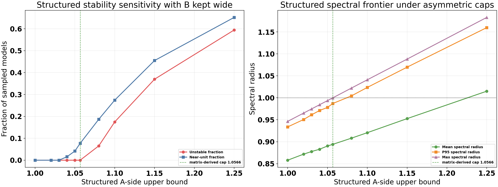

For polymer, `A_high = 1.0566` was acceptable because it kept the structured spectral p95 below `1`. For distillation, `A_high = 1.01` is already conservative. Therefore, the structured distillation cap should be computed mostly through `G_N`, cost acceptance, and `B` authority, not through a tighter stability cap.

## Why Distillation Still Degrades

The current evidence points to four causes.

### 1. The Released Actor Can Still Leave The Warm-Start Support

Warm start fills replay with nominal MPC actions. The current Phase 1 hidden release then keeps executing the nominal action for several subepisodes while the critic catches up. This is good, and it is now implemented through `utils/phase1_hidden_release.py`.

But after release, the actor objective is still the usual TD3 deterministic policy improvement:

$$
\max_{\theta_{\pi}} \mathbb{E}_{s \sim \mathcal{D}}[Q_{\phi}(s,\pi_{\theta_{\pi}}(s))].
$$

There is no term that says:

$$
\pi_{\theta_{\pi}}(s) \approx a_{\mathrm{nom}}
$$

during the first live deployment. So the critic can still overvalue actions outside the narrow baseline-action support. This is exactly the failure mode discussed in TD3 and offline RL literature: value approximation error and out-of-distribution actions can lead the actor toward bad actions [Fujimoto2018] [FujimotoGu2021] [Kumar2020].

### 2. Reducing Noise Reduces Variance, Not Bias

Changing exploration and target policy smoothing noise to `0.01` makes the run less random, but it does not fix a biased actor objective or a wrong cost landscape. If the critic ranks a bad `B` correction too highly, small noise can still converge to that correction. It can also slow discovery of useful alternatives, which explains the user-observed pattern:

- heavy degradation after release,
- recovery only after enough online data accumulates,
- final performance still below MPC.

### 3. Distillation `B` Is A Performance-Sensitive Direction

The active structured notebook output shows `theta_A` near `1.0` while `theta_B` moves noticeably. That is exactly what the configured bounds allow: tight `A`, wide `B`.

The problem is that `B` changes input-output authority directly. In distillation, reflux and reboiler duty are strongly coupled and constrained. A wrong gain correction can make MPC believe an input move will be more useful than it actually is, or make it allocate effort to the wrong manipulated input. This can worsen tray-24 composition or tray-85 temperature even when `A` is perfectly stable.

### 4. The Distillation Reward Is Still Unbalanced

The distillation reward defaults are:

$$
\begin{aligned}
Q &= \operatorname{diag}(37000, 1500), \\
R &= \operatorname{diag}(2500, 2500).
\end{aligned}
$$

The reward also uses relative bands and inside-band bonus logic from `utils/rewards.py`, so the effective importance is not just `Q1/Q2`. Still, the earlier wide-range report already found that distillation is much more reward-asymmetric than polymer. If the first output dominates policy learning, the policy can recover reward while still not beating MPC in mean physical MAE or output-2 behavior.


## Recommended Distillation Fix

Do not keep narrowing `A`. Keep the current `A` default and add a protected effective-authority layer:

$$
\theta_t^{\mathrm{eff}} = 1 + \lambda_t(\theta_t^{\mathrm{raw}} - 1).
$$

Use separate gates for `A` and `B`:

$$
\begin{aligned}
\lambda_{A,t} &= \min(g_{\tau,t}, g_{J,t}, g_{\mathrm{ramp},t}), \\
\lambda_{B,t} &= \min(g_{\tau,B,t}, g_{J,t}, g_{\mathrm{headroom},t}, g_{\mathrm{ramp},B,t}).
\end{aligned}
$$

The mismatch gate should open only when tracking is bad:

$$
\tau_t = \max_i |e_{\mathrm{raw},i}(t)|.
$$

$$
\begin{aligned}
g_{\tau,t} &= \begin{cases}
0, & \tau_t \le 1, \\
1 - \exp[-k(\tau_t - 1)], & \tau_t > 1.
\end{cases}
\end{aligned}
$$

This makes the multiplier method behave like residual authority:

- near setpoint, use nominal MPC,
- when mismatch is large, allow model correction,
- if candidate cost is worse than nominal, backtrack to nominal,
- as training progresses, widen authority gradually.


## TD3+BC Handoff Anchor

The next actor-side fix is a TD3+BC-style handoff regularizer. During the first `K` post-release subepisodes, change the actor loss from pure deterministic policy improvement to:

$$
\mathcal{L}_{Q} = -\mathbb{E}_{s \sim \mathcal{D}}[Q_{\phi}(s,\pi_{\theta}(s))].
$$

$$
\mathcal{L}_{\mathrm{BC}} = \mathbb{E}_{(s,a_0)\sim\mathcal{D}_{\mathrm{ws}}}[\|\pi_{\theta}(s)-a_0\|_2^2].
$$

$$
\mathcal{L}_{\mathrm{actor}} = \mathcal{L}_{Q} + \lambda_{\mathrm{BC}}(e)\mathcal{L}_{\mathrm{BC}}.
$$

For matrix and structured matrix:

$$
a_0 = a_{\mathrm{nom}}.
$$

This is the normalized action that maps to all multipliers equal to `1.0`.

Use a decaying weight:

$$
\lambda_{\mathrm{BC}}(e) = \lambda_{\mathrm{BC},0}\exp\left(-\frac{e-e_0}{T_{\mathrm{BC}}}\right).
$$

First distillation values to test:

| Parameter | First value |
| --- | ---: |
| `lambda_BC_0` | 0.1 |
| `T_BC` | 10 subepisodes |
| BC dataset | warm-start plus recent nominal/fallback transitions |
| apply to | TD3 matrix and structured matrix |

This is directly supported by TD3+BC and offline-to-online RL literature: when training starts from narrow logged behavior, actor regularization reduces out-of-distribution action selection [FujimotoGu2021] [Kumar2020] [Nair2021].

## Algorithm 1: Offline Cap Identification

```text
Input:
  nominal model A0, B0, C
  MPC horizons Np, Nc
  plant/result validation scenarios
  raw low/high bounds for A and B
  spectral target rho_target
  gain-change threshold eps_G
  cost-regression threshold eps_J

Build candidate set:
  if matrix:
      sample theta = [alpha, delta_1, delta_2]
  if structured:
      sample theta_A groups and theta_B columns

For each theta:
  construct A_theta, B_theta
  reject if structure is invalid or non-finite
  reject if rho(A_theta_phys) > rho_target
  compute G_N(A_theta, B_theta)
  reject if ||G_N(theta) - G_N(0)||_F / ||G_N(0)||_F > eps_G
  run short nominal-cost or rollout check
  reject if candidate cost exceeds nominal cost by eps_J

Return:
  accepted candidate set
  low/high caps as robust accepted quantiles
  corner-test report
```

## Algorithm 2: Online Protected Multiplier Execution

```text
Input:
  actor raw action a_raw
  multiplier bounds low/high
  nominal multiplier vector theta_nom = 1
  current tracking mismatch tau_t
  actuator headroom h_t
  nominal MPC cost J_nom

Map:
  theta_raw = map_action_to_bounds(a_raw, low, high)

Gate:
  lambda_A = min(mismatch_gate(tau_t), release_ramp(t), cost_gate)
  lambda_B = min(mismatch_gate_B(tau_t), release_ramp_B(t), headroom_gate(h_t), cost_gate)

Build:
  theta_eff_A = 1 + lambda_A * (theta_raw_A - 1)
  theta_eff_B = 1 + lambda_B * (theta_raw_B - 1)

Accept:
  while candidate predicted cost is worse than nominal:
      lambda_A *= beta
      lambda_B *= beta
      rebuild candidate

Fallback:
  if no accepted candidate:
      theta_eff = ones

Run MPC with theta_eff.
```

## Algorithm 3: Distillation Experiment Sequence

Run these in order. Do not open a wider search until the previous line stops degrading relative to MPC.

| Experiment | `A` range | `B` range | New protection | Success criterion |
| --- | --- | --- | --- | --- |
| D0 current TD3 | `[0.99, 1.01]` | `[0.75, 1.25]` | none beyond current Phase 1 | reproduce degradation/recovery |
| D1 cost fallback | `[0.99, 1.01]` | `[0.75, 1.25]` | nominal-cost backtracking | no release collapse |
| D2 `A` gate | raw wide or current | `[0.75, 1.25]` | mismatch-gated `A` authority | no worse than D1 |
| D3 `B` gate | current | `[0.75, 1.25]` raw | headroom and mismatch-gated `B` authority | lower final MAE than D1 |
| D4 TD3+BC | current | raw wide with gates | actor anchor to nominal action | faster recovery and no release trough |
| D5 reward rebalance | current | gated wide | lower `Q1` ablation | improve output-2 without losing output-1 |

The most important metric is not final reward alone. Track all of these:

$$
\Delta R_{\mathrm{release}} = \bar{R}_{\mathrm{live},1{:}10} - \bar{R}_{\mathrm{warm},\mathrm{tail}}.
$$

$$
\Delta \mathrm{MAE}_{\mathrm{test}} = \mathrm{MAE}_{\mathrm{RL},\mathrm{test}} - \mathrm{MAE}_{\mathrm{MPC},\mathrm{test}}.
$$

$$
\operatorname{fallback\_frac},
\quad
\operatorname{near\_bound\_frac},
\quad
\operatorname{p95}(|\theta^{\mathrm{eff}}-1|),
\quad
\operatorname{p95}(\Delta u).
$$

Declare success only if:

- `Delta R_release` is not a large negative drop,
- final test MAE beats or matches MPC,
- output-2 MAE does not silently degrade,
- fallback is not doing all the work,
- the learned policy uses nonzero authority only when mismatch warrants it.

## Literature Mapping

| Topic | Paper | Useful lesson for this project |
| --- | --- | --- |
| TD3 overestimation and target smoothing | [Fujimoto2018] | Delayed policy updates and clipped target noise reduce overestimation, but do not guarantee safe release from narrow data support. |
| TD3+BC | [FujimotoGu2021] | A simple behavior-cloning term can keep a TD3 actor close to dataset actions under offline or narrow-support training. |
| Conservative critics | [Kumar2020] | Distribution shift can make standard off-policy critics overvalue actions outside the dataset. |
| Offline-to-online handoff | [Nair2021] | Prior data can accelerate learning, but the handoff needs behavior-aware updates. |
| Safe policy improvement | [Laroche2019] | Fall back to the baseline policy where uncertainty is high. This maps directly to nominal-MPC fallback for multiplier policies. |
| Trust-region policy updates | [Schulman2015] | Large policy changes are risky; staged authority and action-distance penalties are practical trust regions. |
| Constrained policy optimization | [Achiam2017] | Safety constraints should be explicit, not only encoded in reward. |
| Learning-based MPC safety | [Hewing2020] | MPC is a good safety layer for learning, but learned model or policy changes need uncertainty-aware protection. |
| Robust MPC uncertainty sets | [Kothare1996], [Limon2013], [Mayne2005] | Treat the multiplier family as an uncertainty set and grow it only while feasibility/performance remain acceptable. |
| Adaptive MPC and excitation | [Berberich2022], [Heirung2015] | Model adaptation requires informative data and guarded model maintenance, not blind widening. |

## Final Recommendations

1. For polymer, preserve the lesson from the successful wide `A,B` matrix run: the direct matrix family can exploit broad authority. Use the capped-`A` reruns as the safer repeatable variant, not as proof that wide `A` can never work.
2. For polymer structured matrix, keep `A_high` around `1.0566` as the first block ceiling, but move toward per-coordinate caps. `A_off` should be tested tighter than the diagonal blocks, and each `B` column should be capped by its own gain/headroom sensitivity.
3. For distillation, do not spend the next run only tightening `A`. The latest observation already used `[0.99, 1.01]` and still degraded.
4. Add nominal-cost backtracking/fallback to matrix and structured matrix. This is the highest-priority distillation fix.
5. Add mismatch-gated effective authority for both `A` and `B`, with per-coordinate gates for structured mode. Do not force `A_block`, `A_off`, `B_col_1`, and `B_col_2` to share one authority schedule.
6. Add TD3+BC actor anchoring during the post-warm-start handoff. The current hidden release helps, but the first live actor can still leave safe support.
7. Run a distillation reward-balance ablation. The current reward can recover while still not beating MPC in physical MAE, especially if output 2 is underprotected.
8. Only after D1-D5 work should `A` be widened toward the larger distillation analytical stability cap. The current bottleneck is policy/performance safety, not spectral admissibility.

## Sources

- [Fujimoto2018]: Addressing Function Approximation Error in Actor-Critic Methods. https://proceedings.mlr.press/v80/fujimoto18a.html
- [FujimotoGu2021]: A Minimalist Approach to Offline Reinforcement Learning. https://proceedings.neurips.cc/paper_files/paper/2021/hash/a8166da05c5a094f7dc03724b41886e5-Abstract.html
- [Kumar2020]: Conservative Q-Learning for Offline Reinforcement Learning. https://neurips.cc/virtual/2020/poster/17621
- [Nair2021]: AWAC: Accelerating Online Reinforcement Learning with Offline Datasets. https://openreview.net/forum?id=OJiM1R3jAtZ
- [Laroche2019]: Safe Policy Improvement with Baseline Bootstrapping. https://proceedings.mlr.press/v97/laroche19a
- [Schulman2015]: Trust Region Policy Optimization. https://proceedings.mlr.press/v37/schulman15
- [Achiam2017]: Constrained Policy Optimization. https://proceedings.mlr.press/v70/achiam17a
- [Hewing2020]: Learning-Based Model Predictive Control: Toward Safe Learning in Control. https://www.annualreviews.org/content/journals/10.1146/annurev-control-090419-075625
- [Kothare1996]: Robust constrained model predictive control using linear matrix inequalities. https://doi.org/10.1016/0005-1098(96)00063-5
- [Limon2013]: Robust feedback model predictive control of constrained uncertain systems. https://doi.org/10.1016/j.jprocont.2012.08.003
- [Mayne2005]: Robust model predictive control of constrained linear systems with bounded disturbances. https://doi.org/10.1016/j.automatica.2004.08.019
- [Berberich2022]: Forward-looking persistent excitation in model predictive control. https://doi.org/10.1016/j.automatica.2021.110033
- [Heirung2015]: MPC-based dual control with online experiment design. https://doi.org/10.1016/j.jprocont.2015.04.012
