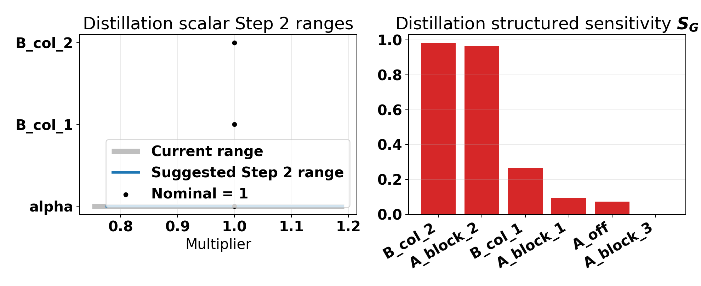
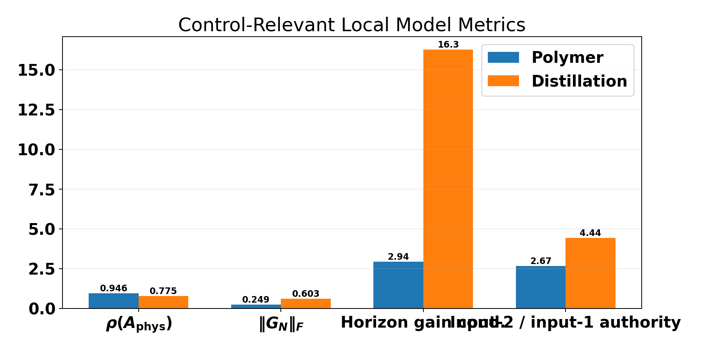
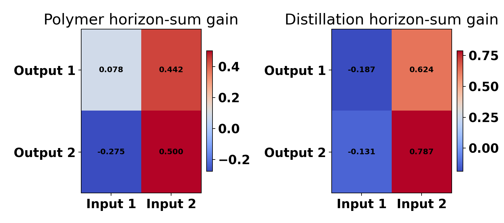
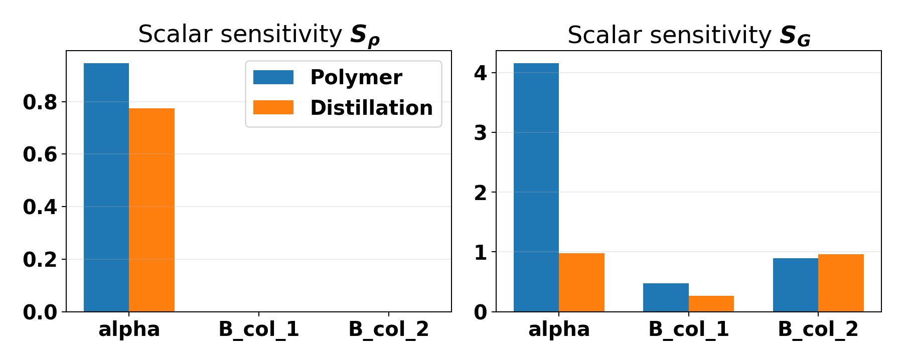

# Matrix Multiplier Progress Summary (2026-04-28)

This report is the short version of the matrix and structured-matrix handoff work. The long working document in `report/matrix_multiplier_cap_calculation_and_distillation_recovery.md` keeps the figures, derivations, and detailed run-by-run evidence. This summary keeps only the implementation sequence, the main result of each step, the current conclusions, and the current distillation transfer logic.

## Executive Summary

The overall result so far is:

- **polymer scalar matrix**: the strongest current method is **Step 4G**: behavioral cloning plus a light Step 2 release guard;
- **polymer structured matrix**: the strongest pure-BC method is **Step 4E** weighted BC, while the strongest guarded handoff is also **Step 4G**, with the caveat that the current structured guard is slightly too conservative for maximum full-run reward;
- **Step 3C** is **useful as shadow instrumentation**, but the current dual-cost terms are **not good enough to become a hard fallback gate**;
- **distillation** should not receive the old Step 3B gate as-is. The current best transfer direction is still **Step 2 plus Step 3C shadow-only logging**, not Step 3B hard fallback and not immediate Step 4G transfer.

So the short answer to the Step 3C question is:

> **No, the current report does not say Step 3C "won't work at all." It says the current Step 3C formulation is useful as a diagnostic layer, but not good enough yet to become an execution gate.**

## Step-by-Step Progress

### Step 1: Offline Sensitivity Diagnostic

Step 1 introduced the offline sensitivity scan for scalar and structured multiplier coordinates. The main purpose was not to create a permanent cap, but to identify which coordinates were dangerous and where advisory release bounds should come from. This step worked as intended. It gave a useful ranking of sensitive directions, especially for structured mode, and it provided the data needed for later guarded-execution steps. The important finding was that the diagnostic should be treated as an **advisory execution input**, not as a permanent training constraint.

### Step 2: Release-Protected Advisory Caps

Step 2 added guarded execution during early live release. The actor still trained in the wide action space, but the executed multipliers were clipped to advisory bounds during the protected and ramp windows. This materially improved polymer performance, especially by reducing the first live release shock. Step 2 established the first reliable rule of the project: **the policy may ask for aggressive actions early, so execution needs release protection even if training remains wide-range**. Step 2 alone was already good enough to produce positive full-run polymer results, which made it the first clearly useful handoff mechanism.

### Step 3B: Tolerant Acceptance / Fallback

Step 3B tested whether a nominal-cost trust-region style acceptance layer could reject bad candidates while keeping useful authority. The mechanism worked mechanically: it no longer rejected almost everything like the stricter version, and live acceptance increased. But the control result was not good enough. The accepted candidates were often "close enough" to nominal under the nominal MPC objective while still not being useful on the nonlinear plant. The finding from Step 3B was clear: **nominal-cost closeness is a safety-style filter, not a performance filter**.

### Step 3C: Shadow Dual-Cost Diagnostics

Step 3C added dual-cost shadow diagnostics without letting those diagnostics control execution. In the polymer Step 3C study runs, Step 2 stayed on, Step 4 BC was turned off, hard fallback stayed off, and the new logs recorded nominal penalty, candidate advantage, and the safe / benefit / dual pass rates. This was useful, but not in the way a hard gate needs. The candidate-benefit signal was almost always positive, so it did not separate good from bad decisions. The safe-pass signal did separate behavior, but in the wrong direction: later positive-reward episodes were **less likely** to satisfy the current safe test. So the Step 3C finding is: **keep it as instrumentation, do not promote the current formulation into a hard gate**.

### Step 4A: BC-Only Isolation

Step 4A introduced behavioral cloning as a nominal-anchor handoff method and isolated it by turning off the other protection layers in polymer. This established that BC can help, but also showed that the original BC schedule was too weak and too short, especially for structured mode. The main value of this step was diagnostic: it proved that a nominal anchor is a real lever, but not yet a complete handoff solution by itself.

### Step 4B / 4C: Stronger Scalar BC

The next scalar BC changes increased the BC weight and extended the active BC window. That improved the scalar handoff in the right direction. The first live trough got smaller while the full-run scalar reward remained competitive. This showed that scalar mode really was limited by a weak nominal anchor. The result was strong enough that stronger scalar BC became the right baseline for combining BC with guarded execution later.

### Step 4D: Stronger Structured BC

Applying the same "just make BC stronger" logic to structured mode was not enough. A larger global BC weight and a longer BC window improved the earliest release window, but it mainly moved the problem rather than solving it. The later `21-40` region became worse. This was the point where it became clear that structured mode did not just need "more BC." It needed **better-shaped BC**.

### Step 4E: Weighted Structured BC

Step 4E changed the shape of the structured BC penalty by weighting the sensitive coordinates, especially the `B` directions, more heavily than the others. This was the best structured pure-BC result. It improved both early and mid windows relative to the earlier structured BC variants and gave the strongest structured full-run reward among the BC-only designs. The key finding was that the structured problem was about **how the nominal anchor is distributed across coordinates**, not just about the total BC magnitude.

### Step 4G: BC Plus Guarded Execution

Step 4G combined the validated BC baselines with a light Step 2 release guard. This is the strongest current polymer default. For scalar matrix, it is clearly the best overall result: it improves the early live windows and also gives the best full-run reward. For structured matrix, it protects the early release much better than pure Step 4E, but it gives back some of the later tail because the current structured guard schedule is slightly too conservative. The Step 4G finding is: **this is the right default handoff family for polymer**, especially for scalar, while structured may still benefit from a lighter guarded-release schedule.

## Current Findings

### What clearly works

- Release protection during early live authority is necessary.
- BC is a real handoff improvement, especially for scalar matrix.
- Structured mode needs coordinate-aware regularization.
- The best current polymer handoff is **Step 4G**, not Step 3 and not BC-only.

### What clearly does not work

- Step 3B nominal-cost fallback is not a sufficient performance filter.
- Stronger global BC alone does not solve structured mode.
- The current Step 3C benefit signal is too weak as a discriminator because it is almost always positive.

### What Step 3C currently means

Step 3C should currently be read as a **measurement layer**, not as a control layer. It tells us how much nominal budget the candidate consumes and whether the candidate model internally prefers its own action over nominal. That is useful for diagnosis. But the polymer results show that those current quantities are not yet aligned with "this candidate should execute." So Step 3C is valuable, but only as **shadow logging** right now.

## Distillation Status

Distillation should stay more conservative than polymer. The current evidence does not support transferring Step 3B hard fallback or turning on Step 4G by default. The safer next distillation path is:

1. keep Step 2-style guarded execution available,
2. enable Step 3C in **shadow-only** mode,
3. inspect whether the distillation shadow signals are actually informative before letting them control fallback,
4. only then revisit whether a phase-aware Step 3D gate or an execution-aware BC extension is justified.

The distillation observer default has now also been switched to the `p19`-style poles:

`[0.20, 0.25, 0.30, 0.35, 0.40, 0.45, 0.50]`

That affects the shared distillation notebook defaults, but it does not change the handoff conclusion above.

### Distillation Step 2: Run Needed Or Not?

Step 2 itself does **not** need a fresh RL run to exist. It only needs `advisory_bounds`, and in this repo those bounds come from the Step 1 offline multiplier diagnostic. The important implementation detail is that the diagnostic depends on the identified model, the multiplier bounds, and the prediction horizon. It does **not** depend on the observer poles. So the recent observer change to the `p19` poles does **not** by itself force a new cap calculation.

Mathematically, the Step 1 diagnostic is a finite-horizon model diagnostic, not an observer diagnostic. Its core objects are the prediction-direction operators

$$ G_N(A,B,C) = \begin{bmatrix} C B \\ C A B \\ \cdots \\ C A^{N-1} B \end{bmatrix}, \qquad H_N(A,B,C) = \sum_{k=0}^{N-1} C A^k B. $$

The release cap logic depends on how multiplier changes distort `G_N` and `H_N`. The observer poles only affect the state estimate used online; they do not change the saved identified `A`, `B`, `C` matrices used by the offline cap diagnostic.

Operationally, the current notebook path does **not** auto-load the last saved `suggested_bounds.csv`. It expects either:

1. a fresh Step 1 diagnostic result in memory, or
2. a manual `RELEASE_PROTECTED_ADVISORY_CAPS["advisory_bounds"]` override built from a saved diagnostic.

So the correct answer is:

- if `system_dict`, multiplier ranges, structured family, and `predict_h` are unchanged, Step 2 can be turned on from the already saved diagnostic outputs;
- if those changed, rerun Step 1 first.

The bigger issue is not whether Step 2 can be enabled. The bigger issue is whether the **current distillation caps are strong enough**.

### What The Current Distillation Caps Actually Say

The latest saved scalar distillation diagnostic does **not** produce a strong upper-side clamp on the harmful `B` authority. The saved advisory table is effectively:

| Coordinate | Current range | Suggested range | Readout |
| --- | --- | --- | --- |
| `alpha` | `[0.75, 1.1929]` | `[0.7738, 1.1929]` | Mild lower-side tightening only |
| `B_col_1` | `[0.75, 1.25]` | `[0.75, 1.25]` | No tightening |
| `B_col_2` | `[0.75, 1.25]` | `[0.7753, 1.25]` | Mild lower-side tightening only |

The latest structured distillation diagnostic says the most gain-sensitive coordinates are `A_block_2` and `B_col_2`, but its suggested bounds still leave the high side wide. So Step 2 is **mechanically available** for distillation right now, but the saved caps are still too weak to fully address the bad high-side authority that shows up in the harmful runs.

That means a naive "just enable Step 2" transfer is probably not enough. Distillation likely needs either:

- tighter manual `B` upper bounds before the first transfer run, or
- a revised Step 1 gain threshold that produces a more asymmetric upper-side cap on the sensitive `B` directions.

The left panel shows the practical Step 2 problem directly: the current scalar suggestion barely shrinks the upper side. The right panel shows why the next tightening should focus on `A_block_2` and especially `B_col_2` in structured mode.

In execution terms, Step 2 currently does

$$ \theta_{B,\mathrm{exec},t} = \operatorname{clip}\!\left(\theta_{B,\mathrm{pol},t}, \ell_B, h_B\right), $$

but the saved `h_B` is still too permissive. So Step 2 can be active and still fail to prevent harmful `B`-side authority.

### Why Step 4G Should Stay Off In Distillation

Step 4G worked in polymer because polymer's main failure mode was the **handoff shock**: the first live actor release was too abrupt, and BC plus a light release guard fixed that directly. Distillation does not look like only a handoff problem. The saved distillation matrix runs show that the policy can recover after release and still fail to beat nominal MPC. That means the bottleneck is not just "first live actions are too aggressive." It is also "the learned model change is often not locally useful for the actual column."

So for distillation:

- **Step 2** can reduce the worst early release damage;
- **Step 3C shadow** can tell us whether the clipped candidate is even plausibly useful;
- **Step 4G** should stay off until those two layers show that the distillation candidate models are informative enough to justify BC-guided transfer.

### Why Distillation Reacts Worse Than Polymer

The local model comparison changes the diagnosis in an important way. Distillation does **not** look more spectrally fragile than polymer. It looks more **ill-conditioned and direction-sensitive**.

Using the saved identified models in `Polymer/Data/system_dict.pickle` and `Distillation/Data/system_dict.pickle`, the key finite-horizon quantities are:

| Local model metric | Polymer | Distillation | Reading |
| --- | ---: | ---: | --- |
| `rho(A_phys)` | `0.9464` | `0.7746` | Distillation has **more** open-loop spectral margin, so pure `A` instability is not the main explanation |
| `||G_N||_F` for the current MPC horizon | `0.2487` | `0.6026` | Distillation has larger finite-horizon input-output authority |
| Horizon-sum gain condition number | `2.94` | `16.27` | Distillation is much more ill-conditioned in the control-relevant gain directions |
| Horizon-sum RGA | moderate interaction | strongly non-diagonal with negative off-diagonals | Distillation input allocation is much more interaction-sensitive |
| Absolute horizon-sum authority of input 2 | `0.9414` | `1.4110` | Distillation is more dominated by the second manipulated input |

That last pair matters a lot. In distillation, a multiplier error on the model does not only change "how much total action" MPC wants. It changes **which manipulated input MPC thinks is effective**, in a much more ill-conditioned setting.

The heatmaps make the split more concrete. Distillation has the larger and more skewed horizon-sum gain matrix, especially through the second manipulated input. That is the control-relevant reason why `B` errors are more dangerous there than in polymer.

The scalar sensitivity comparison says the same thing from a different angle:

In polymer scalar mode, `alpha` clearly dominates the control-relevant drift, which is why `A`-focused protection and BC handoff worked so well. In distillation scalar mode, `alpha` and `B_col_2` are almost equally gain-sensitive. That is why "tighten `A` more" is no longer the right next move.

One useful control-relevant drift measure is

$$ r_G(\theta) = \frac{\left\| G_N(A_\theta, B_\theta, C) - G_N(A_0, B_0, C) \right\|_F}{\left\| G_N(A_0, B_0, C) \right\|_F}. $$

This quantity is what the distillation sensitivity scans are really warning about. Even when `\rho(A_\theta) < 1`, the horizon gain geometry seen by MPC can still move enough to produce a harmful input allocation.

This matches the literature well:

- the high-purity distillation benchmark literature describes these columns as **ill-conditioned**, **strongly interactive**, and hard to identify in the low-gain direction under feedback;
- the right-half-plane-zero literature shows that internal composition or tray-temperature specifications can introduce non-minimum-phase behavior or transmission-zero limitations;
- the observer literature for ill-conditioned distillation warns that estimator design can become sensitive because the measurement and input effects are strongly collinear.

That is also consistent with the local observer sweep:

- the old aggressive observer `p00` remained the best nominal baseline;
- the slower `p19` observer was usable but weaker;
- slower observers such as `p20` and the earlier `p01` family degraded badly.

So the current logical explanation is:

1. **Polymer** is closer to a handoff-limited problem. Its nominal model is nearer the unit circle, but its control directions are much less ill-conditioned. That is why BC plus guarded execution works well.
2. **Distillation** is closer to a gain-direction and estimator-quality problem. Its nominal model is spectrally calmer, but its control directions are much more ill-conditioned, strongly coupled, and likely closer to non-minimum-phase limitations. That is why wide multiplier authority can be harmful even when `A` remains stable.
3. The next distillation fix should therefore focus on **`B` authority and candidate usefulness**, not on making `A` even tighter and not on copying polymer Step 4G too early.

### Proposed Step 3D Direction

This is where a more detailed Step 3 can help. The current Step 3C is good instrumentation, but the next distillation version should become a **phase-aware, `B`-aware usefulness gate** built on top of Step 2-clipped candidates.

The current Step 3C quantities are

$$ \Delta J_t^{\mathrm{nom}} = J_t^{\mathrm{nom}}(U_{\mathrm{cand}}) - J_t^{\mathrm{nom}}(U_{\mathrm{nom}}), $$

$$ \Delta J_t^{\mathrm{cand}} = J_t^{\mathrm{cand}}(U_{\mathrm{nom}}) - J_t^{\mathrm{cand}}(U_{\mathrm{cand}}). $$

For a distillation-focused Step 3D, the missing term is a direct `B`-authority penalty, for example

$$ d_{B,t} = \left\| W_B \left(\theta_{B,\mathrm{exec},t} - \mathbf{1}\right) \right\|_2, $$

where `W_B` weights the more dangerous `B` directions, especially the second one.

A reasonable proposed acceptance rule is then

$$ \Delta J_t^{\mathrm{nom}} \le \tau_t^{\mathrm{safe}}, \qquad \Delta J_t^{\mathrm{cand}} \ge \tau_t^{\mathrm{use}} + \lambda_B d_{B,t}, \qquad r_G(\theta_{\mathrm{exec},t}) \le \tau_G. $$

This is **not implemented yet**. It is the next logical design for distillation because it directly couples:

- nominal safety,
- candidate usefulness,
- and the dangerous `B`-direction authority that the current runs keep exposing.

### Paper-Backed Readout

The paper search supports this interpretation:

- Skogestad's critical survey says distillation control is shaped by flow dynamics, identification difficulty from open-loop responses, estimator use from temperatures, and fundamental differences between internal and external flows.
- The IFAC benchmark on high-purity distillation explicitly describes the plant as **ill-conditioned**, **strongly interactive**, and difficult to identify in the low-gain direction even though that direction matters under feedback control.
- The IFAC paper on input multiplicity and right-half-plane zeros says that when at least one controlled specification is an internal composition or tray temperature, transmission-zero limitations may appear. That is directly relevant here because the controlled outputs are tray-24 composition and tray-85 temperature.
- The estimator paper for ill-conditioned high-purity distillation reports strong collinearity in measurement and input effects, which fits the observer-pole sensitivity seen in the local sweep.
- The learning-based MPC review supports the project-level conclusion that learned model changes need an explicit safety or uncertainty layer; plain policy improvement is not enough.

## Distillation References

- Sigurd Skogestad, *Dynamics and Control of Distillation Columns - A Critical Survey* (1997): https://doi.org/10.4173/mic.1997.3.1
- *Identification for Control of High-Purity Distillation Columns - A Benchmark Problem* (IFAC, 1995): https://www.sciencedirect.com/science/article/abs/pii/S147466701747056X
- *Input Multiplicity and Right Half Plane Zeros in Ideal Two-Product Distillation* (IFAC, 1995): https://www.sciencedirect.com/science/article/abs/pii/S1474667017470194
- *Estimators for Ill-Conditioned Plants: High-Purity Distillation* (IFAC, 1992): https://www.sciencedirect.com/science/article/abs/pii/B9780080412672500425
- Hewing, Wabersich, Menner, Zeilinger, *Learning-Based Model Predictive Control: Toward Safe Learning in Control* (2020): https://doi.org/10.1146/annurev-control-090419-075625

## Current Recommendation

- **Polymer scalar matrix**: keep **Step 4G** as the working default.
- **Polymer structured matrix**: keep **Step 4G** as the working default, but consider lightening the guard schedule if the target is maximum full-run reward rather than minimum early dip.
- **Step 3C**: keep it **shadow-only** for now.
- **Distillation**: do not transfer Step 3B or Step 4G yet; use **Step 2 + Step 3C shadow** as the next serious transfer study, and tighten `B` authority before trusting the first release.

## One-Line Takeaway

The project has moved from "how do we cap multipliers" to "how do we hand off authority safely without destroying the late RL benefit." Right now, the best answer in polymer is **BC plus guarded execution**, and the best answer in distillation is still **instrument first, gate later**.
