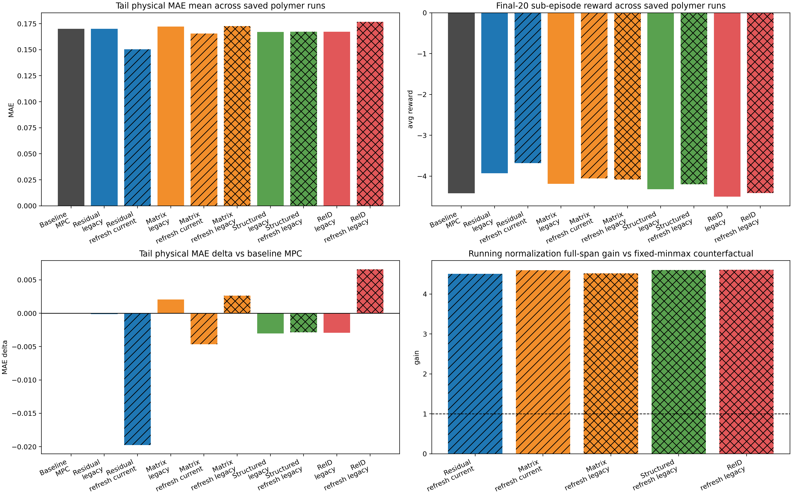
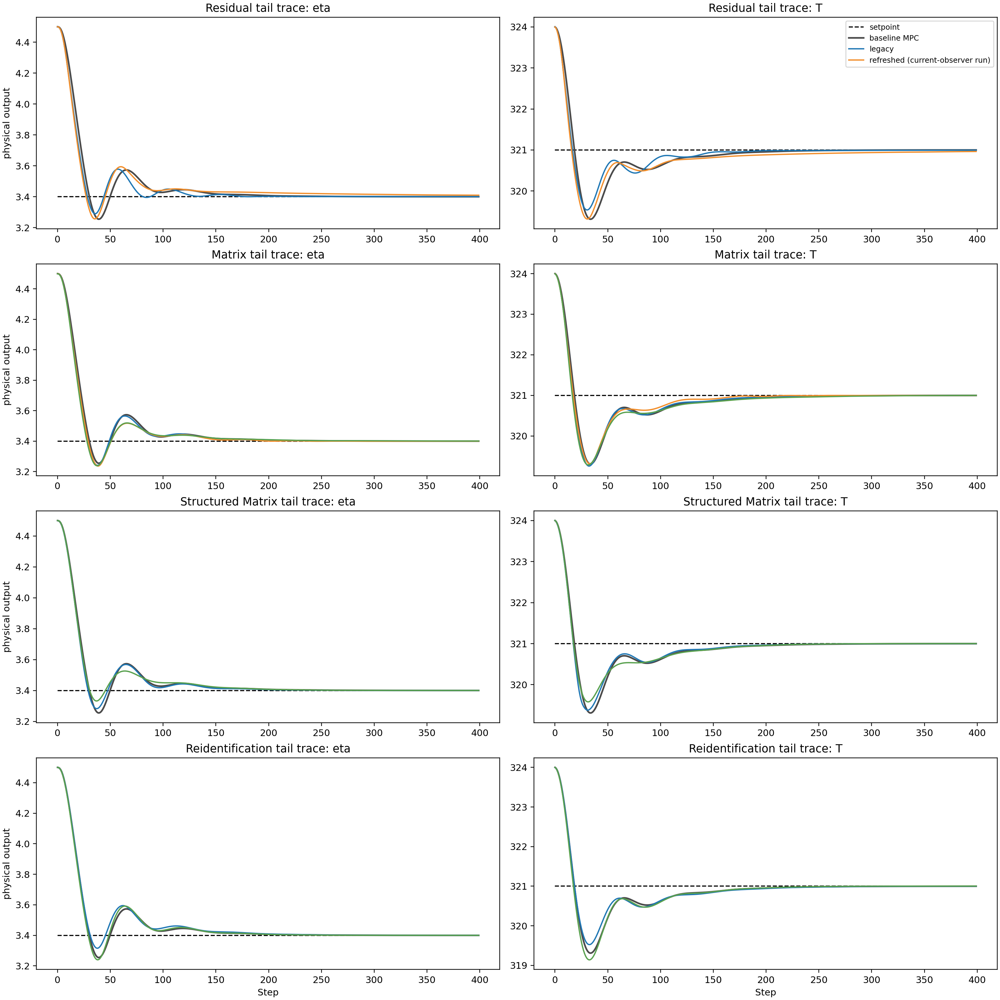
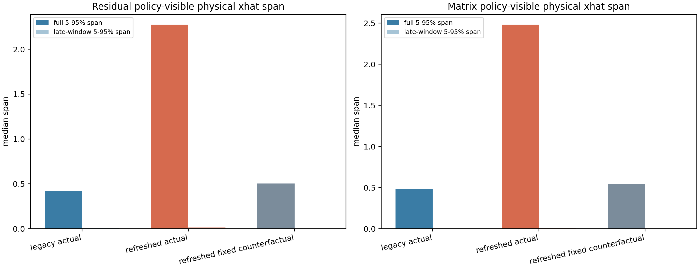
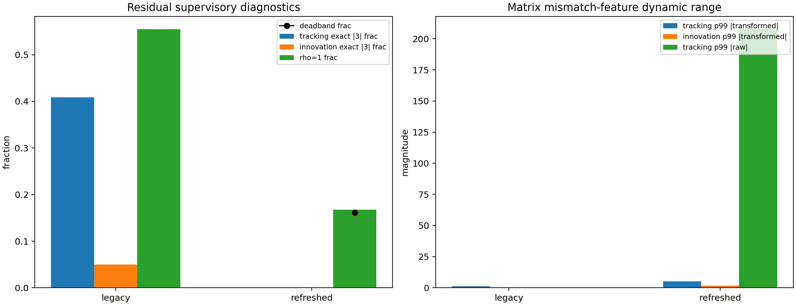
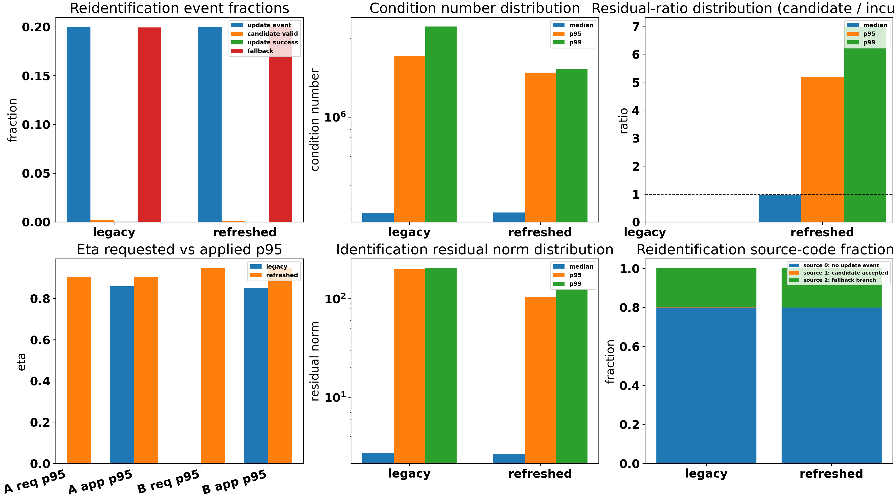
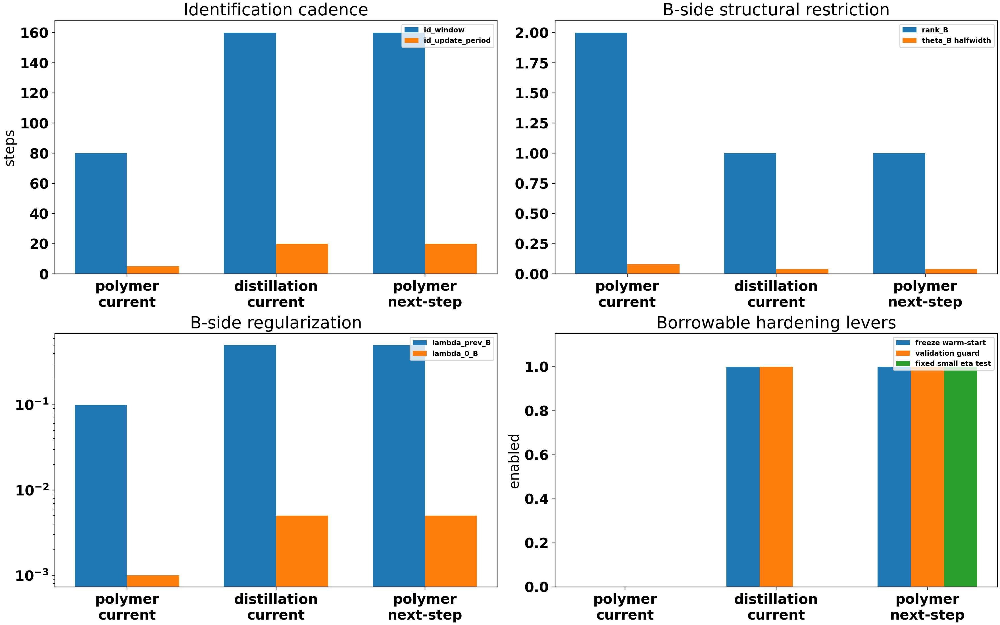

# Polymer Change-Impact Report

Date: 2026-04-21

This report is now self-contained: the comparison tables, figures, explanations, and source notes are inside the report instead of being listed as external links only.

It covers the polymer runs that are relevant to the recent method-scoped conditioning changes:

- residual legacy vs refreshed
- matrix legacy vs two refreshed runs
- structured-matrix legacy vs refreshed
- reidentification legacy vs refreshed
- the disturbance baseline MPC for reference

Two scope notes matter:

- the first refreshed residual and first refreshed matrix runs were executed before the later observer rollback, so they still used `observer_update_alignment="current_measurement_corrector"`
- the later matrix, structured-matrix, and reidentification reruns used the final default `observer_update_alignment="legacy_previous_measurement"`

## Conditioning Mathematics

The new polymer state-conditioning path changes the policy input in two places:

1. Physical `xhat` block:
   fixed min-max uses `z = 2 (x - x_min) / (x_max - x_min) - 1`
   running normalization uses `z_t = clip((x_t - mu_t) / sqrt(var_t + eps), -c, c)`

2. Mismatch extras (`innovation`, `tracking_error`):
   legacy path used hard clipping near `+/-3`
   new path uses `signed_log(e) = sign(e) log(1 + |e|)`

For polymer, the motivation is that fixed min-max gives a very small local slope when the saved width is huge. Running z-score makes the local slope proportional to `1 / sigma_t`, which is exactly the idea used by Stable Baselines3 `VecNormalize` [SB3].

For reidentification, the numerical issue is different. The identification window is solving a noisy regression problem. When the window is not informative enough, the information matrix becomes ill-conditioned, parameter updates become noise-sensitive, and a guard will reject almost every candidate. That is an inference from our logs, and it is consistent with the identification literature on persistency of excitation and regularized least squares [Mu2022] [Binette2016] [Wang2022] [Hochstenbach2011] [Lim2016].

## Run Set And Configs

| Family | Variant | Saved run | base_state_norm_mode | mismatch_transform | observer_alignment | rho_mapping | candidate_guard | blend_validity |
| --- | --- | --- | --- | --- | --- | --- | --- | --- |
| baseline | baseline | `Polymer/Data/mpc_results_dist.pickle` | `n/a` | `n/a` | `n/a` | `n/a` | `n/a` | `n/a` |
| residual | legacy | `Polymer/Results/td3_residual_disturb/20260413_004620/input_data.pkl` | `legacy_fixed_minmax` | `legacy_hard_clip` | `legacy_previous_measurement` | `legacy_clipped_linear` | `n/a` | `n/a` |
| residual | refreshed (current-observer run) | `Polymer/Results/td3_residual_disturb/20260420_225631/input_data.pkl` | `running_zscore_physical_xhat` | `signed_log` | `current_measurement_corrector` | `exp_raw_tracking` | `n/a` | `n/a` |
| matrix | legacy | `Polymer/Results/td3_multipliers_disturb/20260411_011134/input_data.pkl` | `legacy_fixed_minmax` | `legacy_hard_clip` | `legacy_previous_measurement` | `legacy_clipped_linear` | `n/a` | `n/a` |
| matrix | refreshed (current-observer run) | `Polymer/Results/td3_multipliers_disturb/20260420_215528/input_data.pkl` | `running_zscore_physical_xhat` | `signed_log` | `current_measurement_corrector` | `legacy_clipped_linear` | `n/a` | `n/a` |
| matrix | refreshed (legacy-observer run) | `Polymer/Results/td3_multipliers_disturb/20260420_234944/input_data.pkl` | `running_zscore_physical_xhat` | `signed_log` | `legacy_previous_measurement` | `legacy_clipped_linear` | `n/a` | `n/a` |
| structured | legacy | `Polymer/Results/td3_structured_matrices_disturb/20260409_193654/input_data.pkl` | `legacy_fixed_minmax` | `legacy_hard_clip` | `legacy_previous_measurement` | `legacy_clipped_linear` | `n/a` | `n/a` |
| structured | refreshed (legacy-observer run) | `Polymer/Results/td3_structured_matrices_disturb/20260420_235100/input_data.pkl` | `running_zscore_physical_xhat` | `signed_log` | `legacy_previous_measurement` | `legacy_clipped_linear` | `n/a` | `n/a` |
| reidentification | legacy | `Polymer/Results/td3_reidentification_disturb/20260415_120803/input_data.pkl` | `legacy_fixed_minmax` | `legacy_hard_clip` | `legacy_previous_measurement` | `legacy_clipped_linear` | `fro_only` | `n/a` |
| reidentification | refreshed (legacy-observer run) | `Polymer/Results/td3_reidentification_disturb/20260420_234346/input_data.pkl` | `running_zscore_physical_xhat` | `signed_log` | `legacy_previous_measurement` | `legacy_clipped_linear` | `fro_only` | `off` |

## Performance Summary

| Family | Variant | Tail phys MAE mean | Tail scaled MAE mean | Final-20 reward | Tail MAE delta vs baseline | Tracking raw p99 | Tracking exact abs3 frac |
| --- | --- | --- | --- | --- | --- | --- | --- |
| baseline | baseline | 0.1701 | 0.3156 | -4.4173 | n/a | n/a | n/a |
| residual | legacy | 0.1700 | 0.3091 | -3.9313 | -0.0001 | n/a | 0.4084 |
| residual | refreshed (current-observer run) | 0.1504 | 0.2747 | -3.6812 | -0.0197 | 203.0935 | 0.0000 |
| matrix | legacy | 0.1722 | 0.3141 | -4.1899 | 0.0020 | n/a | 0.0000 |
| matrix | refreshed (current-observer run) | 0.1655 | 0.2975 | -4.0549 | -0.0047 | 207.6566 | 0.0000 |
| matrix | refreshed (legacy-observer run) | 0.1728 | 0.3111 | -4.0844 | 0.0026 | 207.5347 | 0.0000 |
| structured | legacy | 0.1671 | 0.3100 | -4.3176 | -0.0030 | n/a | 0.0000 |
| structured | refreshed (legacy-observer run) | 0.1673 | 0.3069 | -4.1990 | -0.0028 | 206.2536 | 0.0000 |
| reidentification | legacy | 0.1672 | 0.3203 | -4.5006 | -0.0029 | n/a | 0.4458 |
| reidentification | refreshed (legacy-observer run) | 0.1767 | 0.3245 | -4.4125 | 0.0066 | 205.8527 | 0.0000 |

The top-level result is mixed rather than uniform:

- Residual improved clearly: tail physical MAE mean moved from `0.1700` to `0.1504` (-11.5%), and final-20 reward moved from `-3.9313` to `-3.6812` (-6.4%).
- Matrix improved in the first refreshed run, but not robustly in the second. The current-observer rerun reached `0.1655` tail physical MAE mean, while the later legacy-observer rerun moved back to `0.1728`. Reward stayed better than legacy in both refreshed runs, but the tail-tracking gain was not stable.
- Structured matrix changed the policy input and improved reward modestly, but not tail MAE. Tail physical MAE mean stayed essentially flat, from `0.1671` to `0.1673`, while final-20 reward improved from `-4.3176` to `-4.1990` (-2.7%).
- Reidentification is the one family that did not benefit. Tail physical MAE mean worsened from `0.1672` to `0.1767`, and the refreshed run ended slightly worse than baseline MPC by `0.0066`.

The overview figure shows two separate effects:

- the policy input changed a lot in the refreshed polymer runs, because the normalized physical `xhat` block became much wider than the fixed-minmax counterfactual
- the control benefit is family-dependent: residual benefits the most, matrix and structured matrix benefit partly, and reidentification does not

## Family Tail Traces

The tail traces make the family-level behavior easier to see:

- residual refreshed stays visibly tighter to the setpoint than residual legacy
- matrix current-observer refresh is the strongest matrix run, while the later legacy-observer refresh gives back part of that tail-tracking gain
- structured matrix refreshed is not a no-op, but its gain is milder than residual: reward improves, while tail MAE stays nearly unchanged
- reidentification refreshed does not settle better than legacy, and it does not beat baseline MPC in the tail

## State Conditioning

| Run | Actual full-span med | Fixed CF full-span med | Full-span gain | Actual late-span med | Fixed CF late-span med | Late-span gain |
| --- | --- | --- | --- | --- | --- | --- |
| Residual refreshed | 2.2758 | 0.5049 | 4.5073 | 0.0153 | 0.0035 | 4.3511 |
| Matrix refreshed current-observer | 2.4824 | 0.5402 | 4.5957 | 0.0135 | 0.0033 | 4.1197 |
| Matrix refreshed legacy-observer | 2.2733 | 0.5031 | 4.5183 | 0.0148 | 0.0037 | 4.0410 |
| Structured matrix refreshed legacy-observer | 2.1689 | 0.4717 | 4.5981 | 0.0137 | 0.0034 | 4.0837 |
| Reidentification refreshed legacy-observer | 2.1264 | 0.4618 | 4.6050 | 0.0115 | 0.0029 | 3.9733 |

This figure confirms that the observation-conditioning change is real, not cosmetic. The refreshed polymer runs all present a much wider physical `xhat` signal to the policy than the fixed-minmax counterfactual on the same saved trajectory. That is why it was reasonable to expect an effect from the new defaults, and the residual family is the clearest case where the better state spread translated into better closed-loop performance.

## Mismatch-Feature Diagnostics

The feature-diagnostic figure shows why the transform change matters:

- legacy residual tracking piled up at exact `|3|` on `0.4084` of samples on average across outputs
- refreshed residual tracking exact-`|3|` mass is effectively zero, even though raw tracking p99 stays huge at `203.0935`
- the same pattern appears in the matrix, structured-matrix, and reidentification refreshed runs: the raw mismatch magnitude is still large, but the transform is no longer flattening it into a single clipped bucket

So the transform change clearly improved what the policy can distinguish. The remaining question is whether the downstream family can exploit that richer mismatch information. Residual does. Reidentification currently does not.

## Reidentification: Why It Is Not Working

| Variant | Candidate valid frac | Update event frac | Update success frac | Fallback frac | Cond median | Cond p95 | Residual ratio median | Residual ratio p95 | eta_A req p95 | eta_A app p95 |
| --- | --- | --- | --- | --- | --- | --- | --- | --- | --- | --- |
| legacy | 0.0021 | 0.1999 | 0.0004 | 0.1995 | 184829.7 | 2932624.9 | n/a | n/a | n/a | 0.8600 |
| refreshed (legacy-observer run) | 0.0011 | 0.1999 | 0.0002 | 0.1997 | 185509.1 | 2199603.2 | 0.9714 | 5.1943 | 0.9044 | 0.9044 |

The reidentification failure diagnosis is strong:

The update math makes the failure mode explicit. The shared reidentification path is solving a regularized batch problem of the form

`theta_hat = argmin_theta ||Y - Phi theta||_2^2 + lambda_prev ||theta - theta_prev||_2^2 + lambda_0 ||theta||_2^2`

on each accepted identification window. The information content of that window is carried by the Gram matrix `G = Phi^T Phi`. If `G` is poorly conditioned, then small data noise produces large parameter movement; this is why the report tracks the condition number `kappa(G) = sigma_max(G) / sigma_min(G)` and the candidate residual ratios. In practice, a useful candidate should satisfy `r_val = ||e_val,cand|| / ||e_val,prev|| < 1` and `r_full = ||e_full,cand|| / ||e_full,prev|| <= 1` while staying inside the parameter and conditioning guards.

- Updates are attempted often enough. The update-event fraction is `0.1999` in the refreshed run, essentially the same as legacy.
- But almost none of those attempts survive the guard. Candidate-valid fraction is only `0.0011`, and update-success fraction is only `0.0002`.
- The regression windows are numerically bad. The refreshed run has a median condition number of `185509.1` and p95 of `2199603.2`.
- Even when a candidate is formed, it usually does not improve the fit enough. The refreshed residual-ratio median is `0.9714`, which is effectively one, and p95 is `5.1943`, which means many candidate windows are much worse than the incumbent model.
- The RL agent is still requesting aggressive identification authority. In the refreshed run, `eta_A` requested p95 is `0.9044` and applied p95 is `0.9044`; for `eta_B`, those are `0.9459` and `0.9459`. Because `blend_validity_mode` is off, there is almost no moderation from the validity layer.

So the main problem is not that the RL state is blind anymore. The main problem is that the online identification layer almost never produces a trustworthy candidate model. The policy is asking for identification action, but the identification engine mostly rejects or falls back, and when it does evaluate a candidate the window is poorly conditioned and often not actually better.

That interpretation is consistent with the literature:

- persistency of excitation is the condition that makes the regression informative enough to uniquely determine parameters [Mu2022]
- in process-control settings, online re-identification may be impossible without enough excitation [Binette2016]
- adaptive MPC papers therefore use information-matrix tests to decide whether a data window is informative enough to trigger a model update [Wang2022]
- when the least-squares problem is ill-conditioned, regularization is a standard fix because it reduces sensitivity to noise and numerical error [Hochstenbach2011] [Lim2016]

The result in this repository matches that story closely. The refreshed reidentification run still sees the mismatch better than before, but the identification subproblem is not healthy enough to convert that information into good model updates.

## How To Extend Polymer Reidentification

The next polymer reidentification work should not start from scratch. The shared runner already contains several hardening levers that were added for the distillation branch and can be reused here.

| Surface | id_window | id_update_period | rank_B | theta_B halfwidth | lambda_prev_B | lambda_0_B | freeze warm-start | validation guard | guard mode | blend mode | force_eta_constant |
| --- | --- | --- | --- | --- | --- | --- | --- | --- | --- | --- | --- |
| polymer current | 80 | 5 | 2 | 0.080 | 1.0e-01 | 1.0e-03 | no | no | fro_only | n/a | None |
| distillation current | 160 | 20 | 1 | 0.040 | 5.0e-01 | 5.0e-03 | yes | yes | fro_only | off | None |
| polymer next-step | 160 | 20 | 1 | 0.040 | 5.0e-01 | 5.0e-03 | yes | yes | fro_validation_clip | off (first) / diagnostic_fade later | [0.05, 0.05] |

This comparison suggests a practical three-layer extension strategy for polymer reidentification:

1. Borrow the hardening that already exists in the distillation path. The biggest immediate differences are cadence and warm-start protection: polymer still runs at `80/5`, while distillation moved to `160/20` and enables `freeze_identification_during_warm_start=True`. The distillation diagnostics in this repo showed that the slower `160/20` cadence did not cause collapse by itself; warm-start hidden drift and excessive blend authority were the real problems.
2. Make the polymer B-side more conservative. Distillation already tightened the B side to `rank_B=1`, `lambda_prev_B=5.0e-01`, `lambda_0_B=5.0e-03`, and `theta_B` halfwidth `0.040`. Polymer is still at `rank_B=2`, `lambda_prev_B=1.0e-01`, `lambda_0_B=1.0e-03`, and halfwidth `0.080`. Given how rarely polymer accepts candidate updates, reducing B flexibility is a reasonable next ablation.
3. Turn on the validation-aware guard layer before trusting the RL blend again. The shared runner already supports `guard_validation_fraction`, minimum train/validation sample thresholds, clipped-theta checks, and residual-ratio / condition-number limits. Polymer is not using any of them now, but the recommended next-step surface in the table enables them with the same thresholds already tested on distillation.

The one distillation idea that should be borrowed only as a diagnostic, not as the final method, is `force_eta_constant`. In the distillation branch, a small fixed `eta` was useful to separate "identification quality" from "RL blend authority." That same isolation test is worthwhile in polymer: if polymer still fails with a tiny fixed blend such as `[0.05, 0.05]`, the bottleneck is the identification engine itself, not the policy.

The one distillation idea that should not be copied blindly is `blend_validity_mode`. Distillation explored validity-aware fading, but the current active defaults are still `off`. For polymer, the correct order is:

- first make candidates valid more often with cadence, warm-start freeze, B-side restriction, and validation guards
- then use `diagnostic_fade` only as a second-stage ablation if candidate quality improves but aggressive blend authority still hurts control

## Literature-Backed Reidentification Roadmap

The literature suggests three extensions beyond the current repo surface:

1. Informative-window gating and explicit excitation.
   Persistence of excitation is the condition that makes identification informative. The adaptive MPC literature now includes PE conditions directly in the controller or in the update trigger, rather than passively hoping the closed-loop trajectory contains enough information [Berberich2022] [Lu2023]. For polymer, that means the update trigger should depend not only on buffer length but also on an information or singular-value test. When the test fails, the safest next step is not to update the model.

2. Active exploration when identification is starved.
   Dual/adaptive MPC literature treats control as both a performance input and an identification input [Parsi2020]. In this project that does not mean abandoning RL-assisted MPC. It means adding a small, bounded probing policy or excitation schedule that is activated only when the identification window is uninformative and the plant is in a safe region. This is more targeted than letting the blend policy indirectly create excitation.

3. More robust online estimators.
   The polymer logs look like a noisy, ill-conditioned regression problem. The recursive identification literature suggests regularized recursive least-squares or total least-squares variants when both regressors and outputs are noisy [Lim2016]. The current batch ridge solve is a reasonable baseline, but if polymer remains condition-limited after the guard/cadence changes, a recursive regularized estimator is the next algorithmic step worth testing.

A concrete borrowing path from distillation is therefore:

- Step 1: move polymer to the distillation-style hardening surface without changing the RL policy structure: slower `id_window/id_update_period`, `freeze_identification_during_warm_start=True`, smaller `rank_B`, tighter `theta_B` bounds, and the existing validation/conditioning guard thresholds.
- Step 2: run a fixed-small-eta study exactly as an isolation tool. If a tiny constant `eta` still fails, the identification engine is the blocker. If a tiny constant `eta` works but learned `eta` does not, then the next work is blend supervision rather than estimator redesign.
- Step 3: add informative-window gating before candidate construction. Concretely, require the buffer Gram matrix or its smallest singular value to clear a threshold before solving the batch update, so the policy cannot keep pushing on a statistically empty window.
- Step 4: only after steps 1-3, consider validity-aware blend fading or bounded excitation triggers. Those are second-stage tools, not substitutes for a non-informative window.

A practical order for polymer is therefore:

- Stage A: enable distillation-style hardening in the current shared runner
- Stage B: run a fixed-small-eta isolation study to separate blend problems from identification problems
- Stage C: add informative-window gating and, if needed, bounded excitation triggers
- Stage D: only after A-C, test stronger blend policies or new recursive estimators

## Conclusions

From the saved polymer runs, the recent changes did matter, but not in one uniform way:

- yes, the observation-conditioning and mismatch-transform changes are clearly changing the policy-visible state in polymer
- yes, those changes helped the residual family materially
- yes, they affected matrix and structured matrix, but matrix is sensitive to the observer choice and structured matrix is mostly reward-level improvement rather than a clear tail-MAE win
- no, the same changes did not fix polymer reidentification, because that family is currently bottlenecked by candidate-model quality, conditioning, and validity, not only by RL-state scaling

The immediate project implication is that polymer residual remains the strongest beneficiary of the new conditioning path, matrix and structured matrix are secondary candidates for further tuning, and polymer reidentification needs identification-layer changes next: distillation-style hardening first, then informative-window gating, and then stronger online estimation methods if the candidate-valid fraction remains near zero.

## Sources

- [SB3] Stable Baselines3 `VecNormalize` implementation and running-mean/running-variance observation normalization.
- [Mu2022] Mu et al., *Persistence of excitation for identifying switched linear systems*, Automatica 2022.
- [Binette2016] Binette and Srinivasan, *On the Use of Nonlinear Model Predictive Control without Parameter Adaptation for Batch Processes*, Processes 2016.
- [Wang2022] *Offset-free ARX-based adaptive model predictive control applied to a nonlinear process*, ISA Transactions 2022.
- [Berberich2022] *Forward-looking persistent excitation in model predictive control*, Automatica 2022.
- [Lu2023] *Robust adaptive model predictive control with persistent excitation conditions*, Automatica 2023.
- [Parsi2020] *Active exploration in adaptive model predictive control*, ETH Zurich research collection 2020.
- [Hochstenbach2011] Hochstenbach and Reichel, *Fractional Tikhonov regularization for linear discrete ill-posed problems*, BIT Numerical Mathematics 2011.
- [Lim2016] Lim and Pang, *l1-regularized recursive total least squares based sparse system identification for the error-in-variables*, SpringerPlus 2016.

[SB3]: https://stable-baselines3.readthedocs.io/en/v2.7.0/_modules/stable_baselines3/common/vec_env/vec_normalize.html
[Mu2022]: https://doi.org/10.1016/j.automatica.2021.110142
[Binette2016]: https://www.mdpi.com/2227-9717/4/3/27
[Wang2022]: https://www.sciencedirect.com/science/article/abs/pii/S0019057821002937
[Berberich2022]: https://doi.org/10.1016/j.automatica.2021.110033
[Lu2023]: https://doi.org/10.1016/j.automatica.2023.110959
[Parsi2020]: https://www.research-collection.ethz.ch/handle/20.500.11850/461407
[Hochstenbach2011]: https://doi.org/10.1007/s10543-011-0313-9
[Lim2016]: https://doi.org/10.1186/s40064-016-3120-6