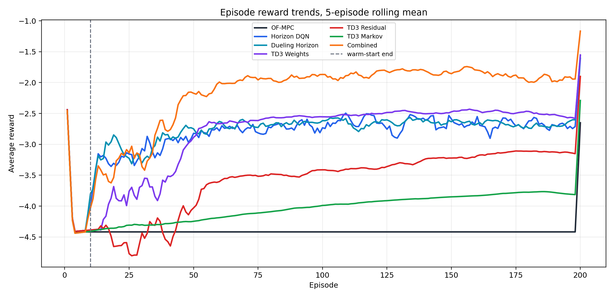
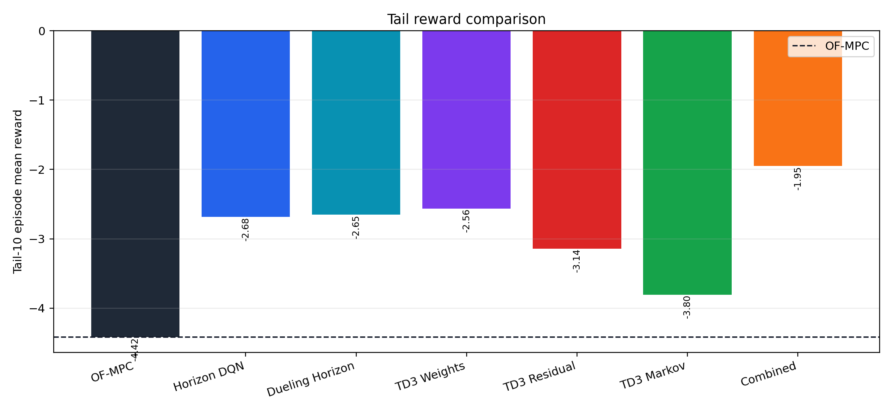
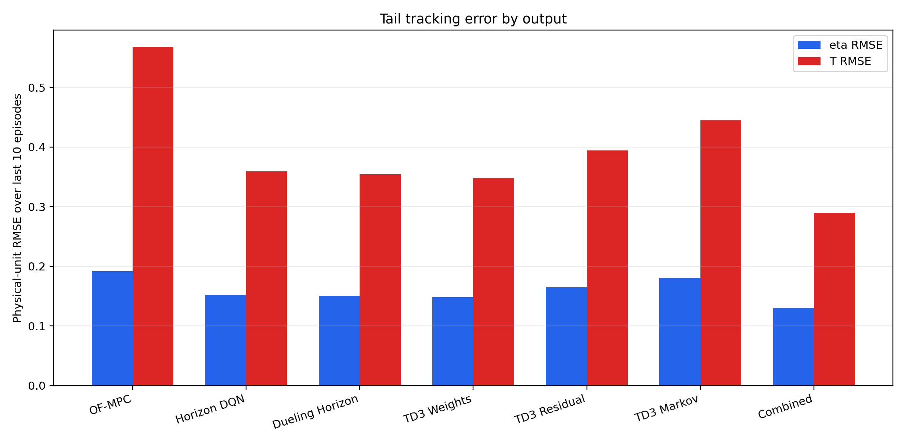
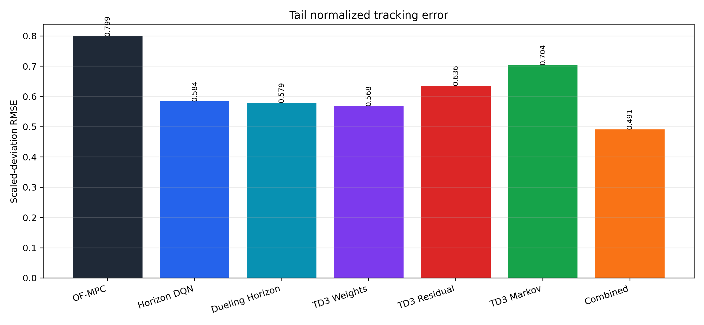
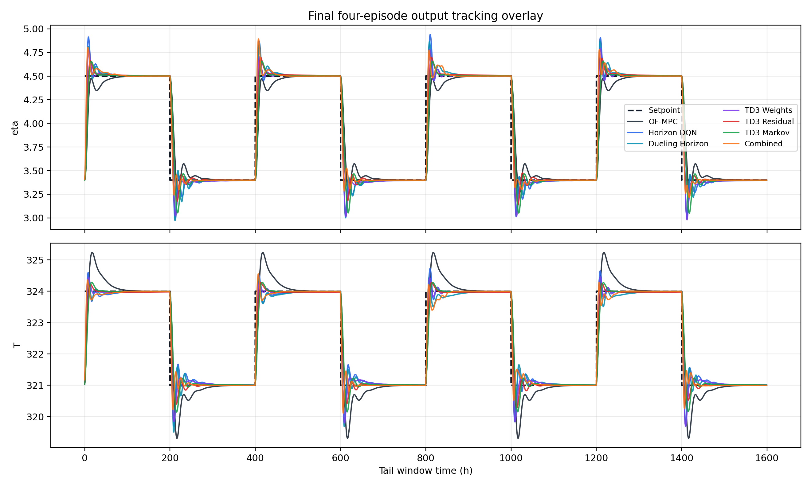
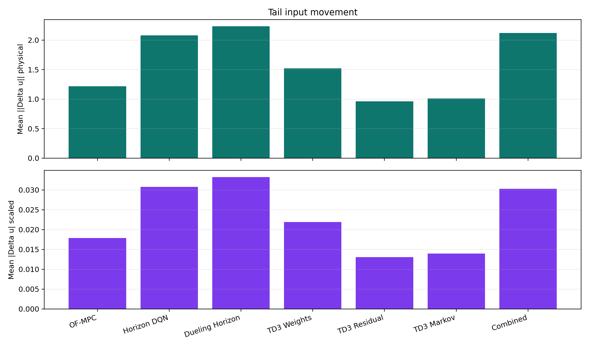
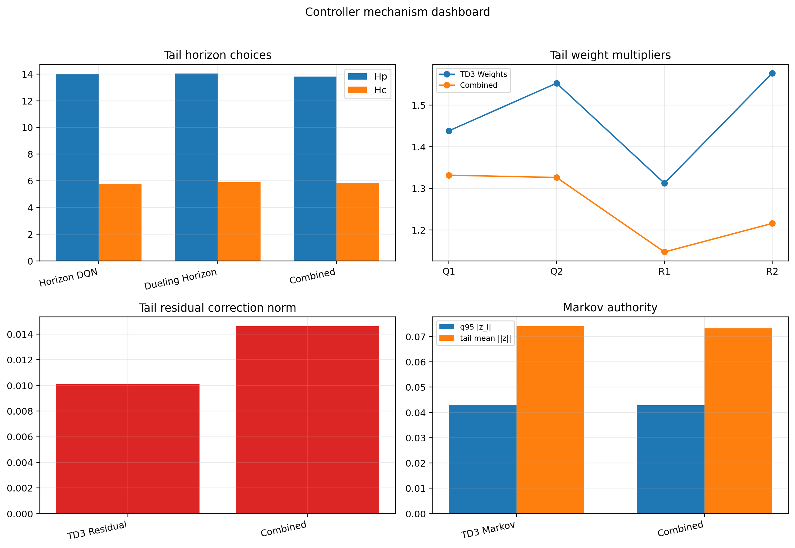
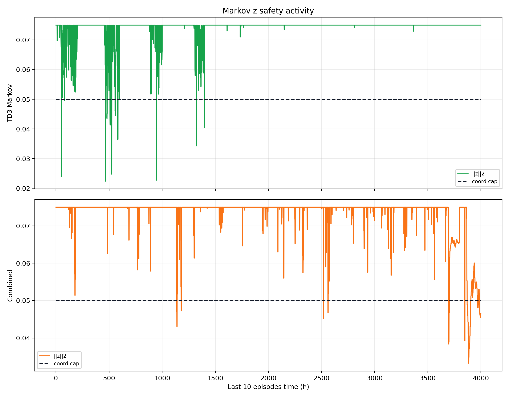
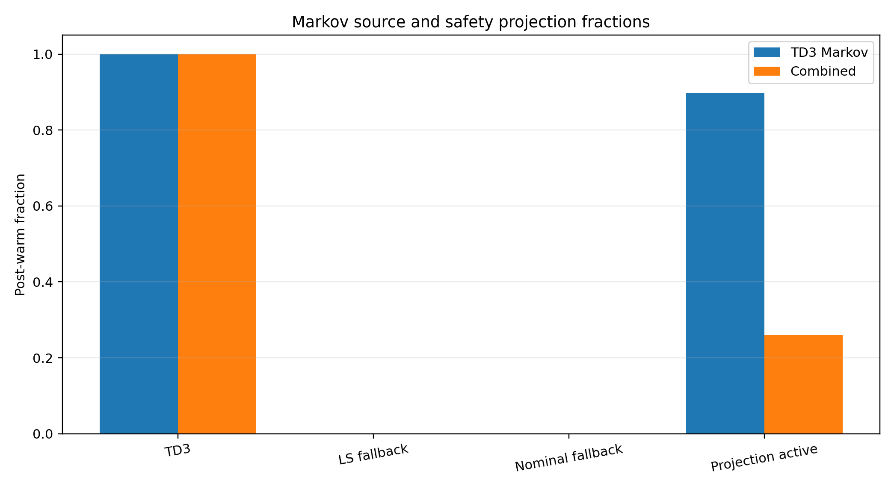

# Polymer Latest Family Runs Analysis

Date: 2026-05-21

## Objective

This report analyzes the latest disturbed polymer CSTR runs for OF-MPC, horizon DQN, dueling horizon DQN, TD3 weights, TD3 residual, TD3 Markov, and the new combined horizon + Markov + weights + residual supervisor.

## Data Provenance

| Method | Bundle | Episodes | Warm episodes |
| --- | --- | --- | --- |
| OF-MPC | Polymer/Data/mpc_results_dist.pickle | 200 | 10 |
| Horizon DQN | Polymer/Results/horizon_disturb_unified/20260520_222308/input_data.pkl | 200 | 10 |
| Dueling Horizon | Polymer/Results/dueling_horizon_disturb_unified/20260520_225756/input_data.pkl | 200 | 10 |
| TD3 Weights | Polymer/Results/td3_weights_disturb/20260520_214118/input_data.pkl | 200 | 10 |
| TD3 Residual | Polymer/Results/td3_residual_disturb/20260520_214325/input_data.pkl | 200 | 10 |
| TD3 Markov | Polymer/Results/td3_markov_disturb/20260521_032358/input_data.pkl | 200 | 10 |
| Combined | Polymer/Results/combined_disturb_h_dqn_mismatch__markov_td3_mismatch__w_td3_mismatch__r_td3_mismatch_rho/20260521_054234/input_data.pkl | 200 | 10 |

All analyzed runs use `run_mode = disturb`, 200 episodes, 800 control steps per episode, and a 10-episode warm-start window. The saved configs use `test_cycle = [False, False, False, False, False]`, so these are training-rollout comparisons rather than held-out evaluation-rollout comparisons.

## Controller Defaults Checked

The current polymer family defaults use the enlarged neural networks `[512, 512, 512, 512, 512]` with `gamma = 0.99` for the active DQN/TD3 families. The combined run uses active agents `{horizon: True, markov: True, matrix: False, weights: True, residual: True}`.

The standalone and combined Markov controllers use the shared safety profile: `z_bound = 0.05`, protected cap `0.025`, ramp cap `0.035 -> 0.05`, full cap `0.05`, probation cap `0.025`, and vector norm cap `0.075`.

## Method Summary

The polymer plant controls viscosity `eta` and reactor temperature `T` using coolant flow `Qc` and monomer flow `Qm`. The baseline is offset-free MPC in scaled-deviation coordinates. The RL supervisors modify either the MPC horizon, the output/input penalties, a residual input correction, or a Markov lifted-response correction.

The tracking error used for comparable diagnostics is

$$ e_k = y_k - r_k, \qquad \tilde e_k = y_{k,\mathrm{scaled}} - r_{k,\mathrm{scaled}}. $$

For each method, the report computes tail metrics over the final 10 episodes:

$$ \mathrm{RMSE}_j = \sqrt{\frac{1}{N}\sum_{k\in\mathcal{T}} e_{k,j}^2}, \qquad R_{\mathrm{tail}} = \frac{1}{10}\sum_{q=191}^{200}\bar R_q. $$

For Markov methods, the executed correction `z` is analyzed together with the active safety cap. The current polymer Markov profile uses `z_bound = 0.05`, dynamic coordinate caps `0.025 -> 0.05`, and vector norm cap `0.075`.

## Main Quantitative Results

| Method | Tail reward | Final reward | Tail scaled RMSE | eta RMSE | T RMSE | Tail mean abs du scaled |
| --- | --- | --- | --- | --- | --- | --- |
| OF-MPC | -4.42 | -4.42 | 0.7987 | 0.1917 | 0.568 | 0.01787 |
| Horizon DQN | -2.68 | -2.63 | 0.5839 | 0.1520 | 0.359 | 0.03074 |
| Dueling Horizon | -2.65 | -2.66 | 0.5786 | 0.1509 | 0.355 | 0.03324 |
| TD3 Weights | -2.56 | -2.64 | 0.5679 | 0.1482 | 0.348 | 0.02195 |
| TD3 Residual | -3.14 | -3.16 | 0.6360 | 0.1651 | 0.394 | 0.01308 |
| TD3 Markov | -3.80 | -3.82 | 0.7042 | 0.1812 | 0.445 | 0.01395 |
| Combined | -1.95 | -1.94 | 0.4910 | 0.1301 | 0.290 | 0.03031 |

Best tail reward: **Combined** with `-1.95`.
Best normalized tail tracking: **Combined** with scaled RMSE `0.4910`.
Best output-specific tracking: **Combined** has the lowest eta RMSE and the lowest T RMSE.

## Ranking And Interpretation

| Method | Tail reward | Tail scaled RMSE | eta RMSE | T RMSE |
| --- | --- | --- | --- | --- |
| Combined | -1.95 | 0.4910 | 0.1301 | 0.290 |
| TD3 Weights | -2.56 | 0.5679 | 0.1482 | 0.348 |
| Dueling Horizon | -2.65 | 0.5786 | 0.1509 | 0.355 |
| Horizon DQN | -2.68 | 0.5839 | 0.1520 | 0.359 |
| TD3 Residual | -3.14 | 0.6360 | 0.1651 | 0.394 |
| TD3 Markov | -3.80 | 0.7042 | 0.1812 | 0.445 |
| OF-MPC | -4.42 | 0.7987 | 0.1917 | 0.568 |

Relative to OF-MPC tail reward `-4.42`, the best RL method changes the tail reward by `2.47`. Because the reward combines tracking and input movement in scaled coordinates, the reward ranking should be read together with the RMSE and input-movement plots rather than alone.

## Controller Mechanism Diagnostics

| Method | Tail Hp | Tail Hc | Q1 mult | Q2 mult | Residual norm | q95 abs z_i | TD3 source | Proj active |
| --- | --- | --- | --- | --- | --- | --- | --- | --- |
| OF-MPC | NA | NA | NA | NA | NA | NA | NA | NA |
| Horizon DQN | 14.03 | 5.78 | NA | NA | NA | NA | NA | NA |
| Dueling Horizon | 14.03 | 5.89 | NA | NA | NA | NA | NA | NA |
| TD3 Weights | NA | NA | 1.438 | 1.553 | NA | NA | NA | NA |
| TD3 Residual | NA | NA | NA | NA | 0.01009 | NA | NA | NA |
| TD3 Markov | NA | NA | NA | NA | NA | 0.0429 | 1.000 | 0.897 |
| Combined | 13.82 | 5.85 | 1.332 | 1.326 | 0.01461 | 0.0428 | 1.000 | 0.260 |

## Findings

- The combined controller is the strongest run in this latest batch. Its tail reward `-1.95` improves over OF-MPC by `2.47` and improves over Markov-only by `1.85`.
- Markov-only is safe but conservative in performance. Its post-warm TD3 source fraction is `1.000`, so TD3 is usually the executed source, but projection activity is `0.897`. That high projection rate means the raw TD3 request often pushes outside the dynamic safety envelope and is then pulled back before execution.
- The combined Markov block has a similar q95 absolute coordinate size `0.0428` to Markov-only `0.0429`, but lower projection activity `0.260`. This suggests the other agents are helping the Markov action operate in a less frequently clipped regime.
- Residual-only has tail scaled RMSE `0.6360` and residual correction norm `0.01009`. It is the cleanest way to add direct input authority, but it can also increase input movement if the learned correction is noisy.
- Weight-only changes the optimizer objective rather than the plant model or input directly. Its tail Q multipliers are Q1 `1.438` and Q2 `1.553`, which should be read as a learned preference for viscosity versus temperature tracking.
- Horizon-only and dueling-horizon mainly alter prediction/control horizon selection. Their tail scaled RMSE values are `0.5839` and `0.5786`, so their benefit is limited if the fixed-horizon OF-MPC baseline is already near the best reachable horizon tradeoff.
- Both horizon agents and the combined horizon block used all `83` horizon recipes after warm start. This is a warning that the training rollout is still exploratory rather than a clean frozen-policy horizon schedule.

## Bugs, Inconsistencies, And Risks

- The current comparison is not a held-out evaluation because the saved test cycle is all false. This is useful for learning-progress diagnosis, but the next scientific claim should use a fixed test schedule or frozen-policy replay.
- Single-seed results are not enough to separate true controller improvement from exploration noise, especially after increasing network size to `[512, 512, 512, 512, 512]`.
- The combined runner now executes multiple high-authority mechanisms together. Even when each individual layer is safe, interactions between changed horizon, changed Q/R, Markov model correction, and residual input correction can create non-additive behavior.
- Reward and tracking can disagree. If a method improves one output but increases input movement or another output's error, the scalar reward may hide the mechanism.

## Figure Audit

The generated figures use the saved `input_data.pkl` bundles listed in the provenance table and were visually checked after generation. Output overlays include setpoints in physical units. Tracking RMSE figures separate viscosity and temperature because they have different physical scales. Markov safety figures show both executed `z` norm and active cap/projection fractions so the safety mechanism is visible rather than inferred.

## Literature Context

No new literature citations were added in this report. The goal here is an internal empirical audit of the latest saved polymer runs. If this report is later moved into a paper section, the likely literature links are safe RL/MPC filtering, residual RL for process control, and adaptive/value-augmented MPC.

## Recommended Next Experiments

1. Run a frozen-policy test pass for OF-MPC and each trained RL family using the same disturbance and setpoint schedule. Metric to watch: tail scaled RMSE and tail reward without exploration.
2. Run three seeds for Markov-only and combined with the current `[512]*5` network. Metric to watch: seed spread in tail reward and Markov source/projection fractions.
3. Add an ablation of combined without residual and combined without weights. Metric to watch: whether Markov plus horizon is already sufficient, or whether residual/weights add measurable benefit.
4. For combined, log component-wise reward terms if possible. Metric to watch: whether reward loss comes from tracking, input movement, or constraint/saturation behavior.

## Remaining Uncertainty

The report is based on completed saved bundles, not rerun simulations. It does not prove generalization because the current runs are training rollouts and appear to use one seed. The strongest next step is a frozen-policy evaluation pass with the same disturbance schedule across all controllers.
