# Polymer Markov Latest-Run Analysis

Date: 2026-05-10 (updated from 2026-05-09)

Newest unified shared-reward run analyzed:
`Polymer/Results/td3_markov_disturb/20260510_193643/input_data.pkl`

Newest unified shared-reward comparison directory:
`Polymer/Results/disturb_compare_td3_markov/20260510_193656/`

Newest prototype-default rerun analyzed:
`Polymer/Results/td3_markov_disturb/20260509_184140/input_data.pkl`

Newest prototype-default comparison directory:
`Polymer/Results/disturb_compare_td3_markov/20260509_184152/`

Earlier unified prototype-reward rerun analyzed:
`Polymer/Results/td3_markov_disturb/20260509_155540/input_data.pkl`

Earlier unified shared-reward run analyzed:
`Polymer/Results/td3_markov_disturb/20260509_023119/input_data.pkl`

Previous prototype run analyzed:
`Polymer/Results/polymer_markov_corrected_mpc/20260508_123902/input_data.pkl`

Canonical nominal baseline used by the latest unified workflow:
`Polymer/Data/mpc_results_dist.pickle`

Generated analysis artifacts:
`report/figures/polymer_markov_latest_run_20260509/`
`report/figures/polymer_markov_latest_run_20260510/`
`report/figures/polymer_markov_prototype_reward_followup_20260509/`
`report/figures/polymer_markov_prototype_nominal_solver_followup_20260509/`

## Objective

This note answers four questions:

1. What the Markov-corrected RL-assisted MPC method is, step by step, in mathematical form.
2. What the latest unified run actually achieved.
3. Why the previous prototype looked better near the end.
4. Which code and logic changes separate the previous prototype from the latest unified implementation.

## Files inspected

- `polymer_markov_corrected_mpc_unified.ipynb`
- `utils/markov_runner.py`
- `utils/rewards.py`
- `utils/plotting.py`
- `utils/plotting_core.py`
- `systems/polymer/notebook_params.py`
- `report/polymer_markov_correction_progress.md`
- `report/scripts/generate_polymer_markov_correction_assets.py`
- `report/scripts/generate_polymer_markov_latest_run_update_20260510.py`
- `Polymer/Results/td3_markov_disturb/20260510_193643/input_data.pkl`
- `Polymer/Results/disturb_compare_td3_markov/20260510_193656/input_data.pkl`
- `Polymer/Data/mpc_results_dist.pickle`
- Prototype reference from git history:
  `git show ce34e86^:report/scripts/generate_polymer_markov_correction_assets.py`

## Methodology

### 1. Scaled deviation coordinates

The unified polymer workflow uses scaled deviation variables around the steady state:

$$ \tilde{u}_k = S_u(u_k) - \bar{u}, \qquad \tilde{y}_k = S_y(y_k) - \bar{y}. $$

Here, $S_u(\cdot)$ and $S_y(\cdot)$ are the min-max scalers from the identified polymer dataset, and $(\bar{u}, \bar{y})$ are the steady-state scaled inputs and outputs.

### 2. Offset-free prediction model

The controller uses the augmented linear offset-free model:

$$ x_{k+1} = A_a x_k + B_a \tilde{u}_k + L(\tilde{y}_k - C_a x_k), \qquad \hat{y}_k = C_a x_k. $$

The observer gain $L$ is computed from the unified observer helper. The nonlinear plant that is actually stepped online is still the polymer CSTR model.

### 3. Nominal lifted MPC

For prediction horizon $P$ and control horizon $M$, the nominal lifted prediction is:

$$ Y_{k|k}^{\mathrm{nom}} = F x_k + G_0 U_{k|k}, $$

with

$$ U_{k|k} = [\tilde{u}_{k|k}^\top,\tilde{u}_{k+1|k}^\top,\dots,\tilde{u}_{k+M-1|k}^\top]^\top. $$

The nominal MPC problem is:

$$ \min_{U_{k|k}} \sum_{i=1}^{P} \lVert y_{k+i|k} - y_{sp,k} \rVert_Q^2 + \sum_{i=0}^{M-1} \lVert \Delta u_{k+i|k} \rVert_R^2. $$

In the latest unified implementation, the nominal step uses the shared `MpcSolverGeneral.mpc_opt_fun(...)` path.

### 4. Markov correction parameterization

The Markov correction does not replace the MPC structure. It perturbs the lifted Toeplitz matrix through a bounded basis expansion:

$$ G(z) = G_0 + \sum_{j=1}^{r} z_j \Delta G_j, \qquad z_j \in [-z_{\max}, z_{\max}]. $$

For both the previous prototype and the latest unified run:

- `basis_family = "io_pair_gain"`
- `z_max = 0.05`
- `prediction_window = 20`
- `lambda_z = 10^{-3}`
- `s_pred_min = 10^{-6}`
- `gain_drift_max = 0.1`

So the main Markov hyperparameters did not change across these two runs.

### 5. Prediction-improvement score

The correction is screened through a lifted prediction score over a recent window $\mathcal{T}_k$:

$$ S_{\mathrm{pred}}(z) = \sum_{\tau \in \mathcal{T}_k} \left( \lVert W_y e_{\tau}^{\mathrm{nom}} \rVert_2^2 - \lVert W_y e_{\tau}^{z} \rVert_2^2 \right) - \lambda_z \lVert z \rVert_2^2. $$

Positive score means the corrected lifted model explains the recent measured trajectories better than the nominal lifted model after the $z$-penalty is applied.

### 6. LS teacher

The constrained least-squares teacher chooses:

$$ z_k^{\mathrm{LS}} = \arg\min_{z \in [-z_{\max}, z_{\max}]^r} \sum_{\tau \in \mathcal{T}_k} \lVert W_y e_{\tau}^{z} \rVert_2^2 + \lambda_z \lVert z \rVert_2^2. $$

This teacher is used during warm start and as the fallback action when TD3 fails the filter.

### 7. TD3 state and action

The TD3 supervisor sees the state

$$ s_k = \left[ x_k^\top,\; (\tilde{y}_k - y_{sp,k})^\top,\; (\tilde{y}_k - \hat{y}_k)^\top,\; \tilde{u}_{k-1}^\top,\; z_{k-1}^\top,\; (z_k^{\mathrm{LS}})^\top,\; S_{\mathrm{pred}}(z_k^{\mathrm{LS}}),\; d_k^{\mathrm{LS}} \right]^\top, $$

where the gain-drift metric is

$$ d_k = \frac{\lVert G(z_k) - G_0 \rVert_F}{\lVert G_0 \rVert_F + \varepsilon}. $$

The TD3 actor outputs a normalized action:

$$ a_k \in [-1,1]^r, \qquad z_k^{\mathrm{TD3}} = z_{\max} a_k. $$

### 8. Safety filter and fallback logic

The TD3 proposal is accepted only if all of the following hold:

- the nominal solve succeeds
- the corrected solve succeeds
- $S_{\mathrm{pred}}(z_k^{\mathrm{TD3}}) > s_{\min}$
- $d_k^{\mathrm{TD3}} \le d_{\max}$
- the corrected candidate passes the loose nominal-cost guard

If TD3 fails, the controller falls back in this order:

1. accepted LS teacher correction
2. nominal MPC

### 9. Reward definitions

This is the biggest code-level difference between the previous prototype and the latest unified run.

The previous prototype used a legacy reward of the form

$$ r_k^{\mathrm{legacy}} = - e_k^\top Q e_k - \Delta u_k^\top R \Delta u_k + 1000 e^{-\bar{p}_k} \mathbf{1}\{ p_{k,i} \le 5\% \ \forall i \}, $$

where $p_{k,i}$ is the percentage tracking error relative to the setpoint-like denominator used in the prototype script.

The latest unified run uses the shared relative-band reward from `utils/rewards.py`. The main ingredients are:

$$ b_i(y_{sp}) = \max(k_i^{\mathrm{rel}} |y_{sp,i}|,\; b_i^{\mathrm{floor}}), \qquad s_i = \sigma \left( \frac{b_i - |e_i|}{\tau b_i} \right), $$

$$ w_{\mathrm{in}} = \left( \prod_i s_i \right)^{1/n_y}, $$

and

$$ r_k^{\mathrm{unified}} = \alpha \left( -J_{\mathrm{quad}} - J_{\Delta u} - J_{\mathrm{lin,out}} - J_{\mathrm{lin,in}} + J_{\mathrm{bonus}} \right). $$

This newer reward is smoother near the setpoint band and is exactly the same reward used by the shared unified polymer RL notebooks.

## Latest unified run results

The latest run is not a failure, but it is almost a nominal-MPC-equivalent controller rather than a strongly outperforming controller.

### Key metrics

| Quantity | Latest unified run |
| --- | ---: |
| Mean reward delta vs canonical MPC | `-0.0259` |
| Last-20-episode reward delta | `-0.0295` |
| Fraction of episodes with better reward than MPC | `0.0450` |
| TD3 accepted fraction | `0.4808` |
| LS fallback fraction | `0.4524` |
| Nominal fallback fraction | `0.0190` |
| Any-coordinate `z` saturation fraction | `0.8067` |
| Input-movement delta vs MPC | `-0.0180` |
| Last-20 input-movement delta vs MPC | `-0.0261` |

Interpretation:

- The latest controller is slightly worse than canonical MPC on the unified reward almost everywhere.
- It is smoother than canonical MPC in terms of input movement.
- It still uses TD3 often, so the near-nominal behavior is not because TD3 never activates.
- It remains heavily constrained by the `z` box, although less than the previous prototype.

### Output tracking

Using mean absolute tracking error in the scaled deviation coordinates:

| Output metric | Full run delta | Last-20 delta |
| --- | ---: | ---: |
| Viscosity MAE, Markov minus MPC | `-0.0035` | `-0.0035` |
| Temperature MAE, Markov minus MPC | `0.0009` | `0.0026` |

Interpretation:

- The latest controller slightly improves viscosity tracking.
- It slightly worsens temperature tracking, especially in the last 20 episodes.
- This is why it looks almost the same as nominal MPC in the output plots.

### Figures

The latest run reward delta stays close to zero and usually slightly below zero:

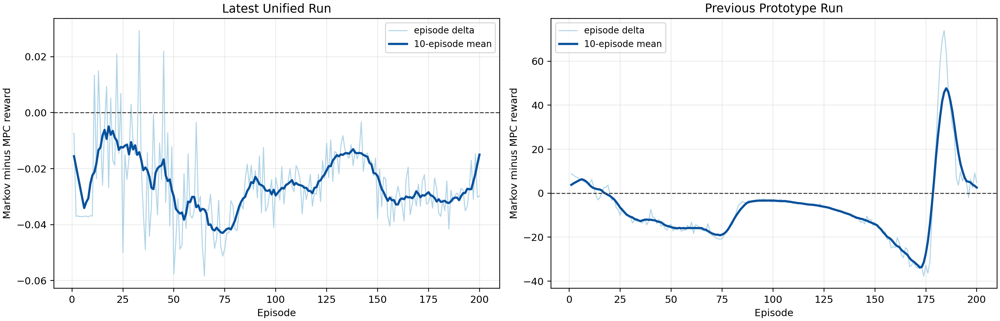

The final-episode output traces confirm that the latest unified controller stays close to the nominal response:

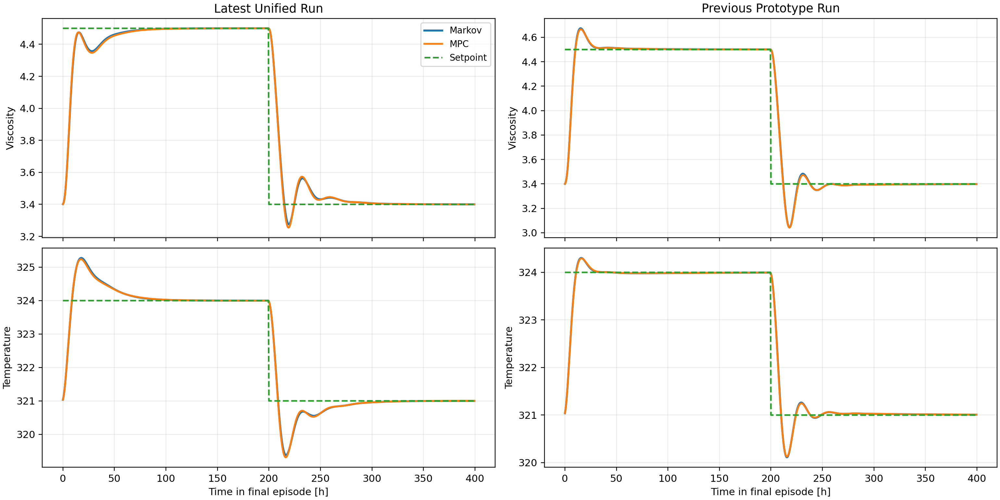

The action mix shows that TD3 and LS are both active, but the resulting corrections remain conservative:

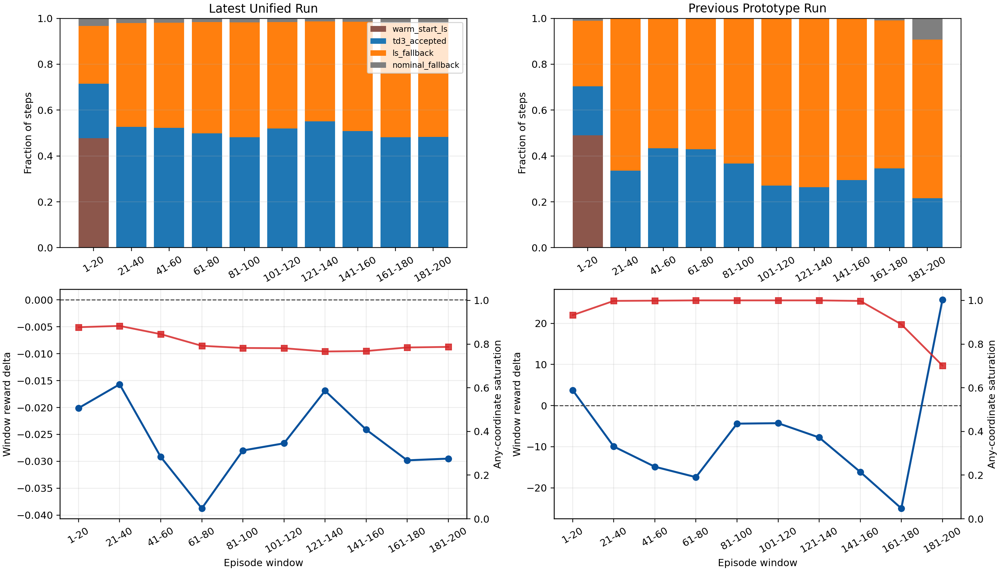

The coordinate-wise $z$ usage is still strong, but not as saturated as in the prototype:

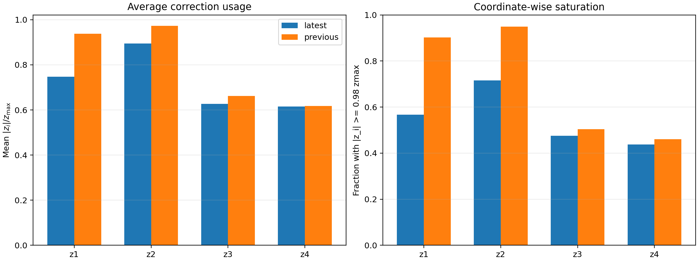

## Why the previous prototype looked better near the end

The short version is:

- under the prototype's own legacy reward, the previous run looked clearly better at the end
- under the unified reward, that late advantage disappears
- and the previous run was not compared against the same nominal reference used now

### Previous prototype metrics under its original reward

| Quantity | Previous prototype |
| --- | ---: |
| Mean reward delta vs its own nominal MPC | `-7.0366` |
| Last-20-episode reward delta | `25.7074` |
| Fraction of episodes with better reward than nominal | `0.1850` |
| Last-20 fraction with better reward than nominal | `0.9500` |
| TD3 accepted fraction | `0.3169` |
| LS fallback fraction | `0.6229` |
| Nominal fallback fraction | `0.0112` |
| Any-coordinate `z` saturation fraction | `0.9519` |

So the old prototype really did show a strong late reward advantage in its own metric, but that came with much heavier saturation and much more LS usage.

### Fair rescoring with the unified reward

When the previous prototype trajectories are rescored with the latest unified reward, the picture changes:

| Quantity | Previous prototype, rescored by unified reward |
| --- | ---: |
| Mean reward delta vs previous nominal | `0.0029` |
| Last-20 reward delta vs previous nominal | `-0.0258` |
| Fraction of episodes with better reward than previous nominal | `0.5600` |
| Last-20 fraction with better reward than previous nominal | `0.2000` |

This is the most important comparison in the whole note. The prototype's large late reward win is not robust to the reward definition. Under the shared unified reward, that late superiority disappears.

The figure below makes that point directly:

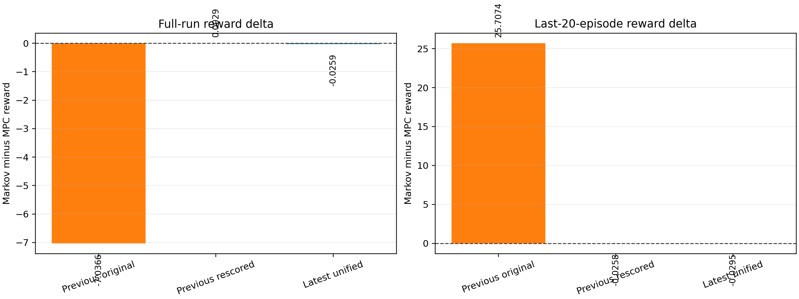

### What the prototype was actually doing at the end

The previous prototype's last-20-episode window had:

- reward advantage under the legacy reward
- higher LS fallback than the latest unified run
- larger correction magnitudes
- more frequent boundary-hitting behavior earlier in training
- slightly higher input movement than its nominal comparator

That makes the prototype's late-stage behavior look more aggressive, not necessarily more correct.

## What changed between the previous prototype and the latest unified implementation

This section separates cosmetic migration changes from the changes that actually affect the conclusion.

### Changes that matter scientifically

| Area | Previous prototype | Latest unified implementation | Why it matters |
| --- | --- | --- | --- |
| Online reward | Local `legacy_mpc_reward(...)` with a large exponential inside-band bonus | Shared `make_reward_fn_relative_QR(...)` reward | This is the biggest driver of the behavioral difference and of the changed late-stage interpretation |
| Comparison reward | Local `make_compare_reward_fn(...)` | Exactly the same shared reward function passed into the runner and into `compare_mpc_rl_from_dirs(...)` | Removes reward inconsistency between online training and offline comparison |
| Nominal comparison reference | Internally rerun nominal trajectory saved inside the prototype bundle | Canonical saved baseline pickle `Polymer/Data/mpc_results_dist.pickle` | Makes the latest comparison stricter and more consistent with the unified notebooks |
| Default experiment path | Prototype script owned config, rollout, report generation, and comparison | Notebook + shared runner + shared plotting path | Reduces experiment drift and makes the Markov method follow the same rules as the other unified polymer notebooks |

### Changes that mainly improve consistency

| Area | Previous prototype | Latest unified implementation | Likely effect |
| --- | --- | --- | --- |
| Nominal step solve | Prototype-local control flow | Shared `MpcSolverGeneral.mpc_opt_fun(...)` solve pattern | Aligns Markov nominal behavior with the standard polymer notebooks |
| Disturbance stepping | Prototype-local runtime ownership | Shared disturbance stepping helper path | Better consistency with canonical disturbed polymer runs |
| Observer and action-selection flow | Prototype-local runtime ownership | Shared observer/action helper path | Better alignment with unified RL notebooks |
| Plotting | Report-local figures plus legacy comparison wrapper | Shared RL plotter + shared compare plotter | Better auditability, but not the main cause of the control difference |

### One more important comparison issue

The previous prototype and the latest unified workflow do not even use the same nominal reference trajectory.

The prototype's internally rerun nominal MPC and the canonical baseline differ by:

| Quantity | Difference |
| --- | ---: |
| Shared-reward delta, old nominal minus canonical baseline, full run | `0.3629` |
| Shared-reward delta, old nominal minus canonical baseline, last 20 | `0.6085` |
| Max absolute output trajectory difference | `0.9675` |
| Max absolute input trajectory difference | `265.18` |

So a visual comparison between "old Markov vs old nominal" and "new Markov vs canonical nominal" is not an apples-to-apples comparison.

## Why the latest run looks almost nominal while the prototype did not

The best evidence from this analysis is:

1. The Markov hyperparameters did not materially change. The `z` range is still `[-0.05, 0.05]`, so the behavior change is not because the latest code suddenly shrank the correction authority.
2. The reward definition changed a lot. The prototype's late reward win is largely a consequence of the old reward construction and does not survive rescoring with the unified reward.
3. The comparison baseline changed. The latest workflow is compared against the canonical baseline pickle, while the old workflow compared against its own nominal rerun.
4. The latest controller is more conservative in its executed corrections. TD3 is accepted more often than before, but with smaller average $z$ magnitude and much lower overall saturation than the previous prototype.
5. The latest controller trades away some aggressiveness for smoother inputs. That is why it looks similar to nominal MPC rather than decisively better.

So the latest run is best interpreted as a conservative, nearly nominal, smoother-input Markov corrector, not as a broken controller and not as clear proof of superiority.

## Is `z` range the problem?

Not as the main explanation for the current difference between the two implementations.

Evidence:

- both runs used `z_max = 0.05`
- both runs hit the `z` wall often
- the prototype was actually more saturated than the latest unified run

So `z_max` is still a valid tuning target, but it is not the main reason the latest implementation looks close to nominal while the prototype looked more different.

The stronger explanation is:

- reward definition
- nominal comparison reference
- unified runtime alignment

## Recommended next experiments

1. Run a unified ablation with the old legacy reward but the new unified runtime. This isolates reward logic from runner logic.
2. Sweep `z_max` over `0.02`, `0.03`, `0.05`, and `0.07` under the unified reward.
3. Sweep `lambda_z` together with `z_max`, because a lower-saturation policy may need both changes together.
4. Re-score all candidate runs with the same unified reward and compare only against the canonical baseline pickle.
5. Keep reporting full-run and last-20 metrics together. The prototype looked good at the end while still being worse on the full run under its own metric.

## Follow-up: prototype-reward unified rerun

After the temporary reward switch, the newest full Markov run is:

`Polymer/Results/td3_markov_disturb/20260509_155540/input_data.pkl`

This run uses `reward_params["mode"] = "prototype_legacy"` inside the shared unified Markov notebook and shared runner.

### What changed for this rerun

Only the reward was switched back to the prototype form. The unified execution path remained in place:

- same shared Markov runner
- same canonical baseline pickle comparator
- same Markov basis and bounds
- same `s_pred_min`, `gain_drift_max`, and nominal-cost guard
- same observer-alignment default
- same replay and fallback flow

So this rerun isolates reward effects much more than it restores the old prototype runtime.

### Main result of the prototype-reward rerun

Under the prototype reward, the newest unified run is better than the canonical baseline in every episode:

| Quantity | Latest unified rerun vs canonical baseline |
| --- | ---: |
| Mean prototype reward delta | `23.3318` |
| Last-20 prototype reward delta | `27.3439` |
| Fraction of better episodes | `1.0000` |
| Fraction of better last-20 episodes | `1.0000` |

This means the reward switch did work in the narrow sense that the run now looks decisively better under the old reward definition.

But the next result is more important: the behavior still looks almost nominal in the plots because the reward gain is almost entirely bonus-driven.

### Why it still looks almost nominal

For the latest rerun versus canonical baseline:

| Prototype reward component delta | Full run | Last 20 |
| --- | ---: | ---: |
| Total reward delta | `23.3318` | `27.3439` |
| Bonus delta | `23.3432` | `27.3506` |
| Tracking-cost delta | `0.0115` | `0.0068` |
| Move-cost delta | `-0.0001` | `-0.0001` |
| Inside-5% gate fraction delta | `0.0163` | `0.0193` |

Interpretation:

- The prototype reward gain is almost exactly the prototype bonus gain.
- The raw tracking term is slightly worse than baseline, not better.
- The input-move term is essentially unchanged.
- The rerun wins because it spends slightly more time inside the old 5% gate, and the prototype reward converts that into a large exponential bonus.

This figure shows that directly:

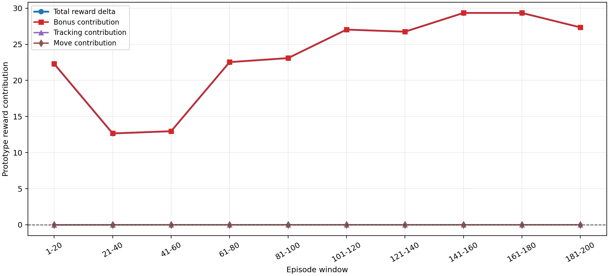

### The trajectories are still very close to nominal

For the latest rerun versus canonical baseline:

- full-run output MAE delta: viscosity `+0.00048`, temperature `-0.00385`
- last-20 output MAE delta: viscosity `+0.00095`, temperature `-0.00571`
- full-run input-movement delta: `+7.27e-05`
- whole-run maximum absolute output difference: `0.1125`
- last-episode output differences stay visually tiny

So the control law is still producing nearly the same visible closed loop, even though the old reward now declares it decisively better.

The final-episode difference traces make that clear:

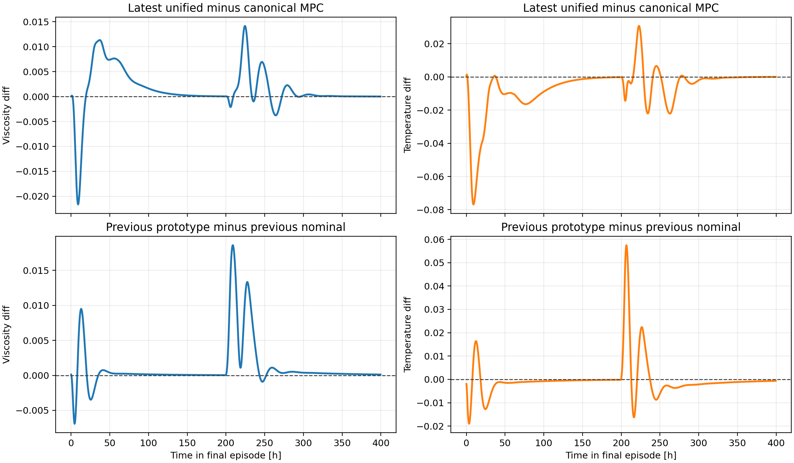

The corresponding final-episode input differences are here:

`report/figures/polymer_markov_prototype_reward_followup_20260509/last_episode_input_differences.png`

### The earlier unified run was already good under the prototype reward

This is the strongest follow-up finding.

Even before the reward switch, the earlier unified run from `20260509_023119` already outperformed the canonical baseline when its saved trajectory was rescored with the prototype reward:

| Quantity | Earlier unified run, rescored by prototype reward |
| --- | ---: |
| Mean prototype reward delta | `15.5660` |
| Last-20 prototype reward delta | `14.8186` |
| Fraction of better episodes | `1.0000` |
| Fraction of better last-20 episodes | `1.0000` |

So the prototype reward rerun did not create a brand-new type of controller. It mostly changed the evaluation lens and nudged the same shared runtime toward a somewhat larger bonus margin.

This comparison is shown below:

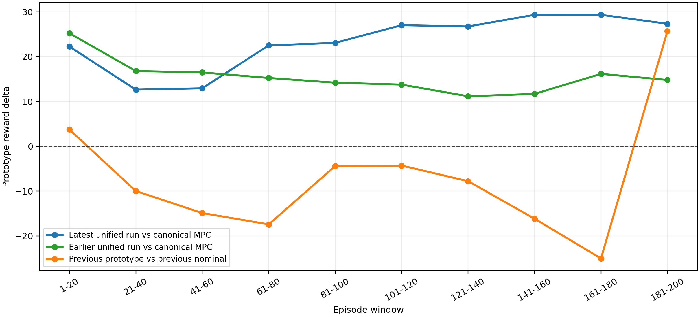

### The reward switch changed behavior only a little

The latest prototype-reward rerun and the earlier unified run remain close in actual closed-loop behavior:

| Latest unified rerun minus earlier unified run | Value |
| --- | ---: |
| Output RMSE difference, viscosity | `0.0061` |
| Output RMSE difference, temperature | `0.0261` |
| Input RMSE difference, `Qc` | `1.1270` |
| Input RMSE difference, `Qm` | `1.7364` |
| Maximum absolute output difference | `0.2240` |
| Maximum absolute input difference | `14.7116` |

That is small relative to the overall plant trajectory scales. So the reward switch changed the reported reward much more than it changed the actual closed loop.

### Why this rerun is still less aggressive than the old prototype

The action-source and correction statistics are:

| Run | TD3 accepted | LS fallback | Nominal fallback | Any-`z` saturation | Mean `||z||` |
| --- | ---: | ---: | ---: | ---: | ---: |
| Latest unified rerun | `0.4289` | `0.4984` | `0.0248` | `0.8802` | `0.0795` |
| Earlier unified run | `0.4808` | `0.4524` | `0.0190` | `0.8067` | `0.0779` |
| Previous prototype | `0.3169` | `0.6229` | `0.0112` | `0.9519` | `0.0849` |

Interpretation:

- The old prototype was the most saturated and the most aggressive.
- The latest rerun is still less aggressive than the old prototype because its `z` usage is smaller and it hits the saturation wall less often.
- The latest rerun is not near-nominal because TD3 is absent. TD3 is used often. It is near-nominal because the accepted corrections remain smaller and less saturated than in the old prototype.

This is visible in the action-mix summary:

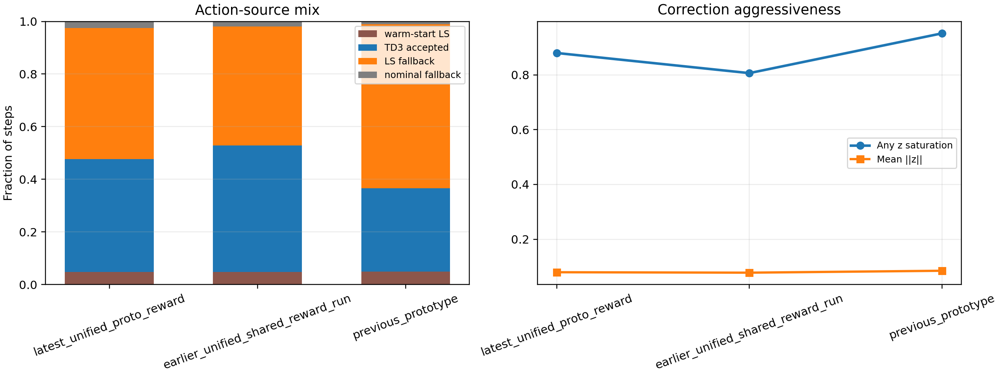

### Comparator choice still matters a lot

The old prototype did not compare against the same nominal baseline used now.

Under the prototype reward:

| Comparator delta | Full run | Last 20 |
| --- | ---: | ---: |
| Previous prototype Markov minus previous nominal | `-7.0366` | `25.7074` |
| Previous nominal minus canonical baseline | `-173.8693` | `87.7667` |

So the old internal nominal rerun and the canonical baseline are dramatically different under the prototype reward. That is why it is dangerous to compare “old Markov vs old nominal” visually against “new Markov vs canonical baseline” and assume the controller itself changed by the same amount.

This bar chart shows how much the comparator changes the conclusion:

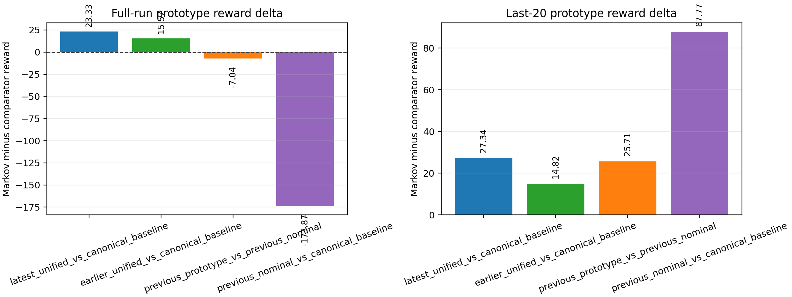

### Code-path differences that still matter after the reward switch

The reward switch did not bring back the old prototype code path. The remaining important differences are:

| Area | Previous prototype script | Latest unified rerun | Why it still matters |
| --- | --- | --- | --- |
| Nominal comparison reference | Internal nominal rerun stored in the same bundle | External canonical baseline pickle | This is still the largest non-reward difference in the reported comparisons |
| Nominal online solve | Prototype script solved nominal MPC through its local lifted path using `solve_lifted_mpc(..., G0, ...)` | Shared runner solves nominal MPC with `MpcSolverGeneral.mpc_opt_fun(...)` | This changes the nominal candidate seen by the correction gate and can shift accepted corrections even with the same reward |
| Runtime ownership | Report script owned config, reward, rollout, and comparison | Notebook + `utils.markov_runner` own rollout, plotting, and comparison | This keeps the Markov method aligned to unified polymer rules rather than prototype-local behavior |
| Reward/comparison consistency | Prototype script mixed local reward helpers and local comparison logic | Shared notebook and runner now use one selected reward function end-to-end | Good for consistency, but it means “old reward” alone does not restore “old behavior” |

Just as important, several things did *not* change:

- `basis_family = "io_pair_gain"`
- `z_bound = 0.05`
- `prediction_window = 20`
- `lambda_z = 1e-3`
- `s_pred_min = 1e-6`
- `gain_drift_max = 0.1`
- `rl_fallback_to_ls = True`
- `rl_store_executed_action_in_replay = True`
- observer alignment remains the legacy previous-measurement mode

So the follow-up evidence says the remaining behavior gap is not caused by the reward switch being incomplete. It is caused by the fact that the unified runtime is still a different controller/comparator stack than the old report script.

### Follow-up conclusion

The prototype reward rerun answers the question cleanly:

1. Yes, the old reward is enough to make the latest unified Markov run look better than nominal in reward.
2. No, that does not mean the closed-loop behavior became like the old prototype.
3. The reward improvement comes almost entirely from the old exponential bonus, not from visibly different tracking or move suppression.
4. The latest unified runtime remains more conservative than the previous prototype because it still uses the unified nominal/comparison path and produces smaller, less saturated corrections.

## Follow-up: lifted-G0 prototype nominal-solver rerun

After switching the Markov default nominal online solve from `state_space_shared` to `lifted_g0_prototype`, the newest full rerun is:

`Polymer/Results/td3_markov_disturb/20260509_184140/input_data.pkl`

This run keeps the prototype reward active and also uses the prototype-style lifted nominal solve.

### What changed for this rerun

Relative to the previous unified prototype-reward rerun `20260509_155540`, the intended controller-side change was narrow:

- reward stays `prototype_legacy`
- the Markov basis, bounds, LS teacher, gain-drift limit, and cost guard stay the same
- the nominal online solve default switches from `state_space_shared` to `lifted_g0_prototype`

One caution matters scientifically: the current Markov TD3 runs do not store a training seed in the saved bundle, and the Markov notebook defaults do not expose a dedicated Markov TD3 seed. So this rerun is informative, but a single A/B rerun does not prove that every observed difference is purely caused by the nominal-solver switch rather than some RL run-to-run variance.

### Main result

Even with the prototype nominal solve restored, the newest run still does not separate visibly from nominal MPC. In fact, under the prototype reward it is much worse than the canonical baseline:

| Quantity | Latest lifted-G0 rerun vs canonical baseline |
| --- | ---: |
| Mean prototype reward delta | `-111.4477` |
| Last-20 prototype reward delta | `-110.3465` |
| Fraction of better episodes | `0.0000` |
| Fraction of better last-20 episodes | `0.0000` |
| TD3 accepted fraction | `0.3636` |
| LS fallback fraction | `0.5539` |
| Nominal fallback fraction | `0.0352` |
| Any-`z` saturation fraction | `0.8726` |
| Mean `||z||` | `0.0795` |

So the nominal-solver restoration did not bring back the old “Markov clearly beats MPC” behavior.

The windowed reward comparison is here:

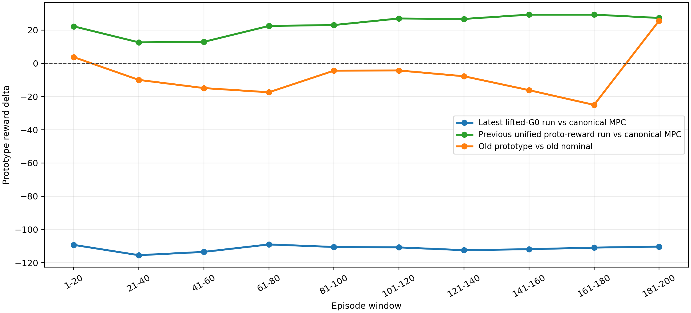

### Why it still looks almost the same as MPC

The newest rerun is still visually close to canonical MPC because the actual trajectory differences remain small:

| Latest lifted-G0 rerun minus canonical baseline | Full run | Last 20 |
| --- | ---: | ---: |
| Viscosity MAE delta | `+0.00113` | `+0.00133` |
| Temperature MAE delta | `+0.00384` | `+0.00406` |
| Input-movement delta | `-0.01214` | `-0.00980` |

Additional distance metrics:

- output RMSE difference versus canonical baseline: viscosity `0.00397`, temperature `0.01693`
- maximum absolute output difference versus canonical baseline: `0.1105`
- input RMSE difference versus canonical baseline: `Qc = 1.0227`, `Qm = 1.1858`
- maximum absolute input difference versus canonical baseline: `9.6082`

This rerun is therefore slightly worse in tracking than canonical MPC but still smoother in input movement. That is exactly the kind of controller that looks almost nominal in the plots.

The final-episode difference traces confirm this:

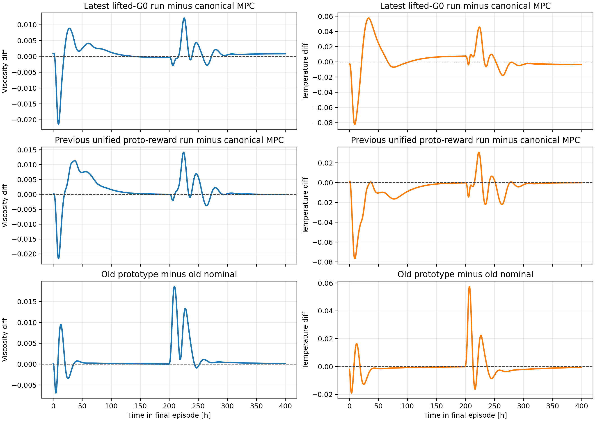

The corresponding final-episode input differences are here:

`report/figures/polymer_markov_prototype_nominal_solver_followup_20260509/last_episode_input_differences.png`

### Why the prototype reward got much worse anyway

The prototype reward collapse is almost entirely a bonus collapse, not a large trajectory change:

| Prototype reward component delta, latest lifted-G0 minus canonical baseline | Full run | Last 20 |
| --- | ---: | ---: |
| Total reward delta | `-111.4477` | `-110.3465` |
| Bonus delta | `-111.4263` | `-110.3310` |
| Tracking-cost delta | `+0.0216` | `+0.0157` |
| Move-cost delta | `-0.0003` | `-0.0002` |
| Inside-5% gate fraction delta | `-0.0059` | `-0.0055` |
| Mean percentage error delta | `+0.2531` | `+0.4035` |

Interpretation:

- almost the entire reward loss is the loss of the prototype exponential bonus
- raw tracking is only slightly worse than canonical MPC
- the move term is still negligible
- a very small reduction in time spent inside the 5% gate is amplified into a very large reward penalty

That is why the newest rerun can look nearly nominal in the outputs while being decisively worse under the old reward.

This figure shows the component breakdown directly:

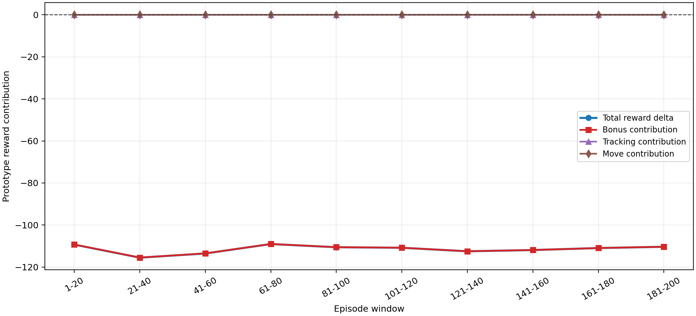

### What the nominal-solver switch actually changed

The cleanest comparison is the newest rerun versus the previous unified prototype-reward rerun `20260509_155540`, because those two runs share the same reward mode and differ mainly by the nominal-solver path plus normal RL stochasticity.

Relative to that previous rerun:

| Latest lifted-G0 rerun minus previous unified prototype-reward rerun | Value |
| --- | ---: |
| Mean prototype reward delta | `-134.7794` |
| Last-20 prototype reward delta | `-137.6904` |
| Output RMSE difference, viscosity | `0.0040` |
| Output RMSE difference, temperature | `0.0181` |
| Input RMSE difference, `Qc` | `1.4016` |
| Input RMSE difference, `Qm` | `1.0426` |
| Max absolute output difference | `0.1845` |
| Max absolute input difference | `14.6487` |
| Inside-5% gate fraction delta | `-0.0222` |
| Mean percentage error delta | `+0.5845` |

The key point is that the closed-loop outputs barely moved, but the prototype reward moved a lot because the old bonus is extremely threshold-sensitive.

This is also reflected in the action mix:

| Run | TD3 accepted | LS fallback | Nominal fallback | Any-`z` saturation | Mean `||z||` |
| --- | ---: | ---: | ---: | ---: | ---: |
| Latest lifted-G0 rerun | `0.3636` | `0.5539` | `0.0352` | `0.8726` | `0.0795` |
| Previous unified prototype-reward rerun | `0.4289` | `0.4984` | `0.0248` | `0.8802` | `0.0795` |
| Old prototype | `0.3169` | `0.6229` | `0.0112` | `0.9519` | `0.0849` |

So the newest rerun actually became a bit more fallback-heavy than the previous unified rerun:

- TD3 accepted less often
- LS fallback happened more often
- nominal fallback also rose
- the average correction norm stayed essentially unchanged

That is more consistent with “even more conservative” than with “restored old prototype behavior.”

These two figures summarize that shift:

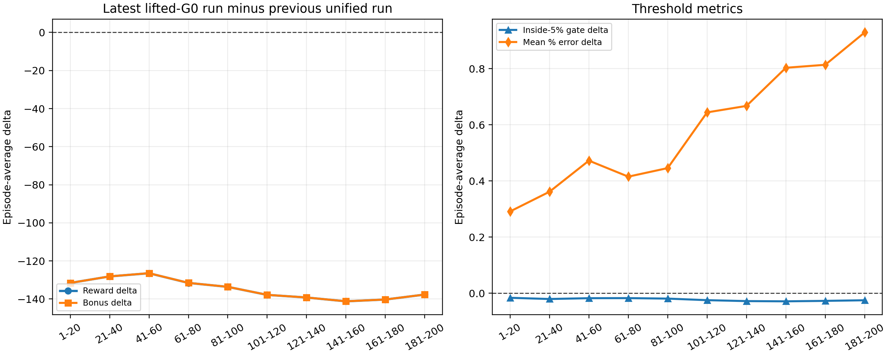

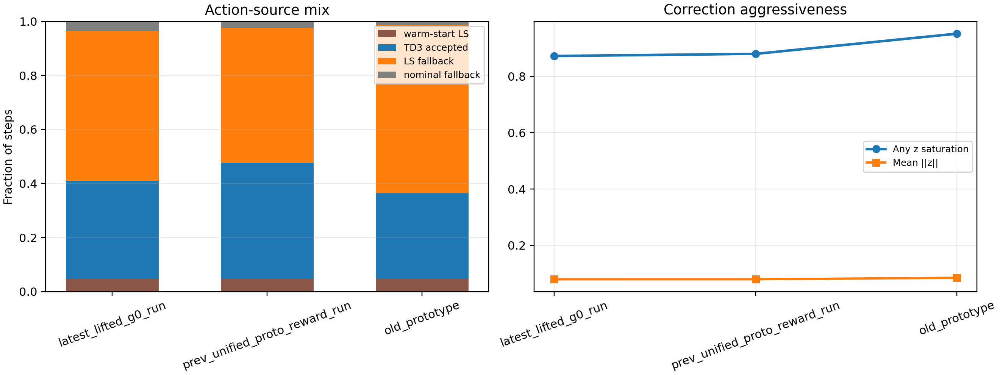

### Why this still does not reproduce the old prototype

The new rerun shows that changing the nominal online solve alone is not enough.

The remaining evidence points to three stronger explanations:

1. The prototype reward is very unstable around the 5% inside-band gate, so small trajectory shifts cause very large reward swings without a dramatic visible change in the outputs.
2. The unified runtime still uses the shared notebook/runner/comparator stack, so it is not the same experiment as the old report-script prototype even after restoring the lifted nominal solve.
3. The old prototype was still the most aggressive run. Its any-`z` saturation was `0.9519` versus `0.8726` now, and its mean `||z||` was also larger.

So the latest evidence is stronger than before:

- restoring the prototype reward alone was not enough
- restoring the prototype nominal solve alone was not enough
- the gap versus the old prototype is therefore not dominated by the nominal-solver choice

The most likely remaining reasons are the shared runtime/comparator stack and the extreme sensitivity of the prototype reward to tiny inside-band changes.

## Code-level discrepancy audit

This section answers the narrower question: if we read the old prototype script and the new shared Markov runner line by line, what is actually different in the live control loop?

### What is effectively the same

These parts of the old prototype and the current shared Markov runner are almost the same in logic:

- the LS fitting objective `fit_markov_ls_correction(...)`
- the prediction-improvement score `prediction_improvement_score(...)`
- the TD3 state definition `markov_rl_state(...)`
- the TD3 decision helper `select_continuous_action(...)`
- the fallback order `TD3 -> LS -> nominal`
- the replay push/train pattern through `pending_transition`
- the warm-start boundary `if step > warm_start_step`
- the shifted-control warm start logic

So the discrepancy is not because the current runner completely rewrote the RL gating logic. Most of that logic is still the same.

### Highest-confidence live-loop discrepancy: disturbance timing

This is the strongest concrete control-loop difference I found.

In the old prototype script, the polymer disturbances are written into the plant before the plant step:

- `system.Qi = float(ctx["qi"][step])`
- `system.Qs = float(ctx["qs"][step])`
- `system.hA = float(ctx["ha"][step])`
- `system.step()`

That means the plant transition from time step `k` to `k+1` uses the disturbance values scheduled for step `k`.

In the current shared runner, the polymer path goes through `step_system_with_disturbance(...)` in `utils/helpers.py`. The Markov runner calls:

- `step_system_with_disturbance(system, idx=step, disturbance_schedule=ctx["disturbance_schedule"], system_stepper=ctx["system_stepper"])`

But when `disturbance_schedule` is a dictionary and `system_stepper` is `None`, the helper currently does:

1. `system.step()`
2. then `setattr(system, key, value)` for the disturbance entries

So for the current shared polymer path, the disturbance dictionary is applied after the plant step rather than before it.

That has two consequences:

1. the very first step is taken with the plant's old disturbance values rather than the scheduled step-0 disturbance
2. every scheduled disturbance acts with an effective one-step lag

This matters a lot for Markov correction because the LS teacher and TD3 proposal are driven by recent prediction error. If the plant disturbance arrives one step late relative to the old prototype semantics, then:

- the measured prediction-error windows change
- the LS fit changes
- the TD3 state changes through innovation and tracking error
- the accepted correction timing changes
- the resulting closed loop can look more nominal even if the rest of the logic is unchanged

This is also not just a Markov issue. The same helper is used across the shared polymer runners. The older polymer MPC code in `Simulation/mpc.py`, however, still sets `Qi` and `Qs` before stepping the plant, which matches the old prototype semantics rather than the current shared helper semantics.

So this disturbance-order mismatch is the highest-confidence implementation reason for the discrepancy between the old prototype behavior and the new shared Markov runs.

### Nominal solve difference: real, but not the main culprit

The second major live-loop difference is the nominal reference solve:

- old prototype: `U0, J0, sol0 = solve_lifted_mpc(..., G0, ...)`
- current shared runner: `solve_nominal_reference_step(...)`, which defaults to `state_space_shared` and can optionally use `lifted_g0_prototype`

This changes the nominal action sequence and the nominal cost seen by the acceptance filter. That can shift how often LS and TD3 candidates pass the guard.

However, the dedicated rerun with `nominal_solver_mode = "lifted_g0_prototype"` did not recover the old behavior. So this is a genuine code difference, but the evidence says it is not the dominant reason the new setup remains close to MPC.

### Reward difference: large for metrics, smaller for trajectories

The reward path differs in two separate ways:

1. old prototype originally used `legacy_mpc_reward(...)`
2. unified runner can use either `make_reward_fn_relative_QR(...)` or `make_reward_fn_prototype_legacy(...)`

Once the current Markov notebook was switched back to `prototype_legacy`, the reward formula itself became effectively aligned with the old prototype.

So for the latest prototype-reward reruns, reward mismatch is no longer the main control-loop discrepancy. It still changes the reported reward a lot, but it is not the best explanation for why the trajectories remain near nominal.

### Comparator difference: important for conclusions, not for the online loop

The old prototype compared against its own internally rerun nominal trajectory.

The new shared notebook compares against the canonical saved baseline pickle.

This is a very important difference for report conclusions, but it does not explain why the online live control law itself looks close to nominal. It explains why "better than MPC" can disappear or reappear depending on which nominal reference is used in the plots and reward summaries.

### Observer update difference: mostly not the issue

The old prototype used the nominal observer update:

$$ x_{k+1} = A x_k + B u_k + L(y_k - \hat{y}_k). $$

The current shared Markov runner still defaults to the same `legacy_previous_measurement` alignment. There is now an optional `predictor_corrector_current` path, but that is not the default Markov setting.

So observer alignment is not the main discrepancy either.

### Randomness was previously uncontrolled

Until the latest change, the Markov TD3 path did not store a dedicated TD3 seed in the saved bundle, and the Markov defaults did not explicitly wire one through the agent construction.

That means some of the differences between recent reruns were contaminated by plain RL variance.

This does not explain the old-prototype versus new-shared discrepancy by itself, but it does mean that some earlier A/B conclusions were noisier than they looked.

### Bottom line from the line-by-line audit

After reading the old prototype and current shared runner line by line, the strongest explanation is:

1. the live TD3/LS gating logic is mostly the same
2. the nominal-solver difference is real but not dominant
3. the reward/comparator differences change the reported win/loss story
4. the single biggest control-loop implementation discrepancy is the disturbance timing in the shared helper

So if the goal is to reproduce the old prototype behavior more faithfully, the first code-level fix to test is not another reward or `z_bound` tweak. It is to make the shared polymer disturbance stepping use the same before-step disturbance semantics as the old prototype and the older polymer MPC code.

## Artifacts generated for this note

- `report/figures/polymer_markov_latest_run_20260509/reward_delta_compare.png`
- `report/figures/polymer_markov_latest_run_20260509/tail_output_compare.png`
- `report/figures/polymer_markov_latest_run_20260509/action_mix_and_saturation.png`
- `report/figures/polymer_markov_latest_run_20260509/z_usage_compare.png`
- `report/figures/polymer_markov_latest_run_20260509/reward_rescoring_compare.png`
- `report/figures/polymer_markov_latest_run_20260509/comparison_summary.csv`
- `report/figures/polymer_markov_latest_run_20260509/window_metrics.csv`
- `report/figures/polymer_markov_latest_run_20260509/baseline_reference_difference.csv`
- `report/figures/polymer_markov_prototype_reward_followup_20260509/prototype_reward_window_compare.png`
- `report/figures/polymer_markov_prototype_reward_followup_20260509/latest_prototype_reward_components.png`
- `report/figures/polymer_markov_prototype_reward_followup_20260509/last_episode_output_differences.png`
- `report/figures/polymer_markov_prototype_reward_followup_20260509/last_episode_input_differences.png`
- `report/figures/polymer_markov_prototype_reward_followup_20260509/action_mix_three_run_compare.png`
- `report/figures/polymer_markov_prototype_reward_followup_20260509/prototype_reward_comparator_effect.png`
- `report/figures/polymer_markov_prototype_reward_followup_20260509/prototype_reward_followup_summary.csv`
- `report/figures/polymer_markov_prototype_reward_followup_20260509/action_mix_summary.csv`
- `report/figures/polymer_markov_prototype_reward_followup_20260509/windowed_prototype_reward_deltas.csv`
- `report/figures/polymer_markov_prototype_nominal_solver_followup_20260509/reward_window_compare.png`
- `report/figures/polymer_markov_prototype_nominal_solver_followup_20260509/latest_components_vs_baseline.png`
- `report/figures/polymer_markov_prototype_nominal_solver_followup_20260509/action_mix_compare.png`
- `report/figures/polymer_markov_prototype_nominal_solver_followup_20260509/solver_mode_switch_effect.png`
- `report/figures/polymer_markov_prototype_nominal_solver_followup_20260509/last_episode_output_differences.png`
- `report/figures/polymer_markov_prototype_nominal_solver_followup_20260509/last_episode_input_differences.png`
- `report/figures/polymer_markov_prototype_nominal_solver_followup_20260509/prototype_nominal_solver_followup_summary.csv`
- `report/figures/polymer_markov_prototype_nominal_solver_followup_20260509/action_mix_summary.csv`
- `report/figures/polymer_markov_prototype_nominal_solver_followup_20260509/solver_mode_switch_window_summary.csv`
- `report/figures/polymer_markov_prototype_nominal_solver_followup_20260509/trajectory_distance_summary.csv`

## Dual-notebook follow-up after restoring the legacy notebook

Date: 2026-05-10

Newest unified-notebook run analyzed:
`Polymer/Results/td3_markov_disturb/20260510_134814/input_data.pkl`

Newest restored-legacy-notebook run analyzed:
`Polymer/Results/polymer_markov_corrected_mpc/20260510_123506/input_data.pkl`

Original legacy reference run:
`Polymer/Results/polymer_markov_corrected_mpc/20260508_123902/input_data.pkl`

New analysis artifacts:
`report/figures/polymer_markov_dual_notebook_followup_20260510/`

Additional files inspected for this follow-up:

- `polymer_markov_corrected_mpc_legacy.ipynb`
- `report/scripts/generate_polymer_markov_correction_assets_legacy.py`
- `utils/markov_runner.py`
- `TD3Agent/agent.py`
- `systems/polymer/notebook_params.py`
- `Polymer/Data/mpc_results_dist.pickle`

### Objective

After fixing the disturbance timing and restoring the old notebook into a separate legacy path, the remaining question was:

- does the restored legacy notebook actually behave like the old prototype?
- or is the gap mainly between the unified runtime and the legacy control loop?

The new comparison says the second explanation is the right one.

### Main findings

1. The restored legacy notebook is already close to the original prototype.
2. The unified notebook is still the path that behaves differently.
3. The main remaining differences are not the notebook restoration itself, but the unified runtime choices: nominal-reference solve, `z` authority, fallback frequency, and the comparator used in the report.

### Quantitative summary

| Comparison | Prototype reward delta mean | Prototype reward delta last 20 | Shared reward delta mean | Output-1 MAE delta mean | Output-2 MAE delta mean |
| --- | ---: | ---: | ---: | ---: | ---: |
| Unified latest vs canonical MPC | `45.03` | `51.61` | `-0.1059` | `0.00398` | `0.00788` |
| Legacy latest vs own nominal | `-5.29` | `9.28` | `0.0143` | `-0.00118` | `-0.00077` |
| Original legacy vs own nominal | `-7.04` | `25.71` | `0.00287` | `-0.00017` | `0.00039` |

Interpretation:

- The restored legacy notebook still shows the same basic pattern as the old prototype: weak or negative full-run average on the prototype reward, but a positive late-episode lift.
- The unified notebook tells a very different reward story against the canonical baseline, but that does not mean it reproduced the old behavior.
- The unified run can score much better on the prototype reward while still tracking slightly worse on both outputs. So the prototype reward is not a reliable proxy for visible trajectory improvement.

### The restored legacy notebook is close to the old prototype

The direct run-to-run distance between the restored legacy run and the original old prototype is small in the outputs:

| Run-to-run distance | Output-1 RMSE | Output-2 RMSE | Max output abs diff |
| --- | ---: | ---: | ---: |
| Legacy latest vs original legacy | `0.00197` | `0.00599` | `0.10735` |

The action-source and `z` statistics are also very similar:

| Run | TD3 fraction | LS fraction | Nominal fraction | `z` saturation | Mean `||z||` | Mean gain drift |
| --- | ---: | ---: | ---: | ---: | ---: | ---: |
| Legacy latest | `0.3938` | `0.5466` | `0.0106` | `0.9491` | `0.0851` | `0.0353` |
| Original legacy | `0.3169` | `0.6229` | `0.0112` | `0.9519` | `0.0849` | `0.0342` |

So the restored legacy notebook is not the main problem anymore. It is already reproducing the old control law fairly closely.

The remaining difference between the restored legacy run and the original old run is most likely ordinary RL realization noise:

- the old legacy script creates `TD3Agent(...)` without forwarding a seed
- the current `TD3Agent` now supports seeding, but that seed path is not used by the restored legacy script
- so exact replay of the old prototype is still impossible even though the top-level script is the same

This explains why the restored legacy notebook is close to the old behavior, but not numerically identical.

### The unified notebook is still the different controller

The direct distance between the newest unified run and the newest restored-legacy run is much larger:

| Run-to-run distance | Output-1 RMSE | Output-2 RMSE | Max output abs diff |
| --- | ---: | ---: | ---: |
| Unified latest vs legacy latest | `0.04578` | `0.18324` | `0.98232` |

And the input trajectories are radically different:

| Run-to-run input distance | Input-1 RMSE | Input-2 RMSE | Max input abs diff |
| --- | ---: | ---: | ---: |
| Unified latest vs legacy latest | `158.68` | `9.31` | `262.50` |

So even after fixing disturbance timing, the unified notebook is still not executing the same Markov policy as the legacy notebook.

### Why the unified notebook is still different

#### 1. The nominal online solve is still different

In the unified runner, the nominal reference each step is built through:

- `solve_nominal_reference_step(...)`
- default `nominal_solver_mode = "state_space_shared"`

in `utils/markov_runner.py`.

In the legacy script, the nominal reference each step is still:

- `solve_lifted_mpc(..., G0, ...)`

inside `report/scripts/generate_polymer_markov_correction_assets_legacy.py`.

That means the candidate filter is still comparing against a different nominal action and a different nominal reference cost.

#### 2. The unified run had twice the `z` authority

The restored legacy path kept the old setting:

$$ z_{\max}^{\mathrm{legacy}} = 0.05. $$

The unified notebook was run with:

$$ z_{\max}^{\mathrm{unified}} = 0.10. $$

This doubled the correction box and increased the executed correction norm:

- unified mean `||z|| = 0.1472`
- legacy mean `||z|| = 0.0851`

but it did not make the controller more prototype-like. Instead, it raised the gain-drift level:

- unified mean gain drift `0.0637`
- legacy mean gain drift `0.0353`

and increased the number of steps where the controller fell all the way back to nominal MPC.

#### 3. The unified run falls back to nominal much more often

| Run | TD3 fraction | LS fraction | Nominal fraction |
| --- | ---: | ---: | ---: |
| Unified latest | `0.3154` | `0.5525` | `0.0879` |
| Legacy latest | `0.3938` | `0.5466` | `0.0106` |

This is one of the clearest explanations for the visual similarity to nominal MPC.

Even though the unified run has a larger `z` box, it rejects enough proposals that it executes pure nominal MPC about eight times more often than the legacy run.

#### 4. The comparator is different

The unified report path compares against the canonical saved baseline pickle.

The legacy notebook stores and compares against its own internal nominal rerun.

That difference does not change the online control law, but it changes the story the plots tell. The baseline-choice effect is large enough to flip the apparent conclusion:

- legacy latest vs own nominal: prototype reward delta mean `-5.29`
- legacy latest vs canonical baseline: prototype reward delta mean `-179.16`
- unified latest vs canonical baseline: prototype reward delta mean `45.03`

So "better than MPC" is still highly comparator-dependent in this method family.

### Figures

The windowed prototype-reward comparison shows that the restored legacy notebook stays close to the older prototype pattern, while the unified notebook follows a different curve:

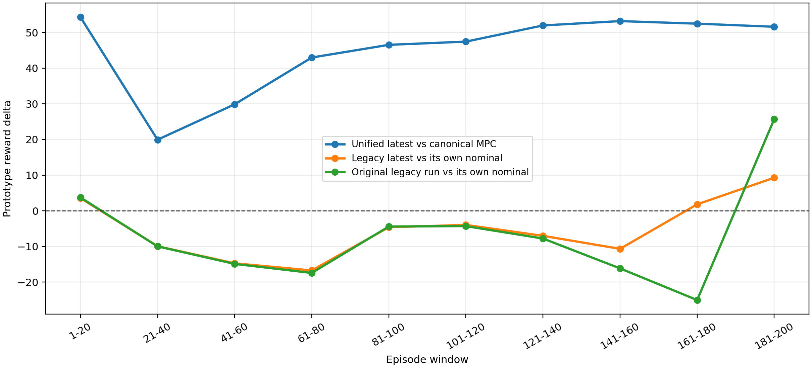

The same legacy run looks very different depending on whether it is compared to its own nominal rerun or to the canonical saved baseline:

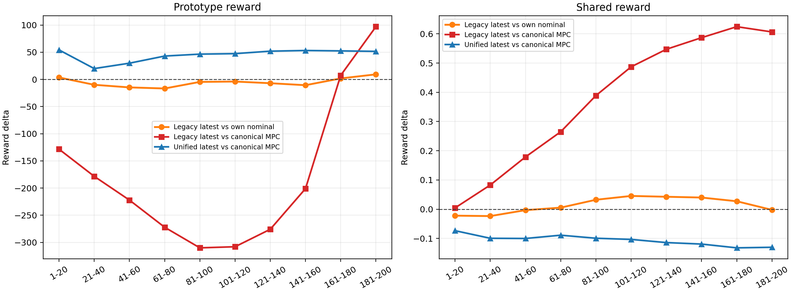

The final-episode output overlays show that the restored legacy notebook remains close to the old legacy path, while the unified notebook follows a different trajectory family:

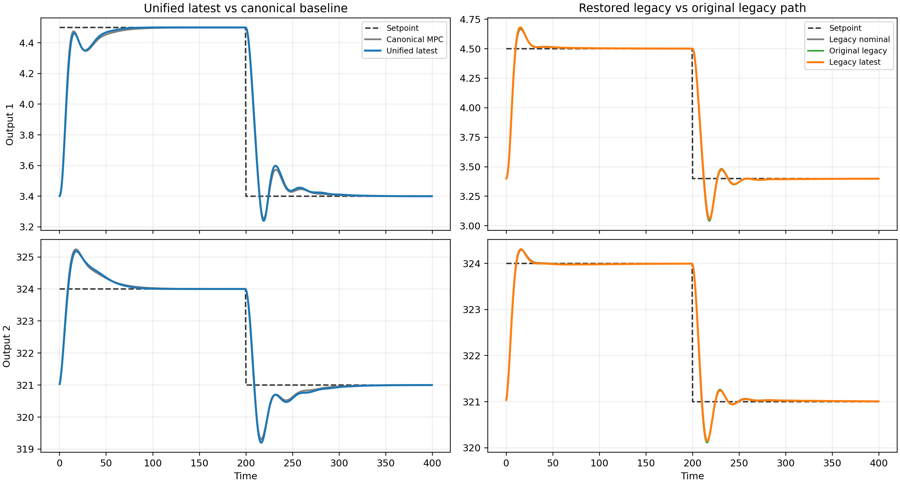

The action-source and `z`-usage summary makes the mechanism visible: the unified notebook has larger corrections, larger gain drift, and far more nominal fallback:

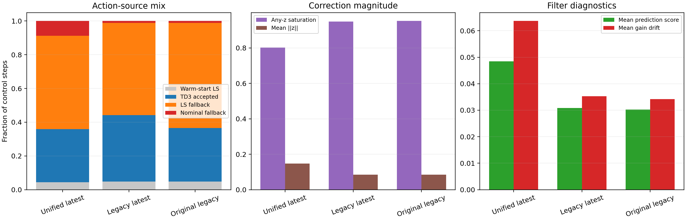

The run-to-run distance summary confirms that the restored legacy notebook is much closer to the original prototype than the unified notebook is:

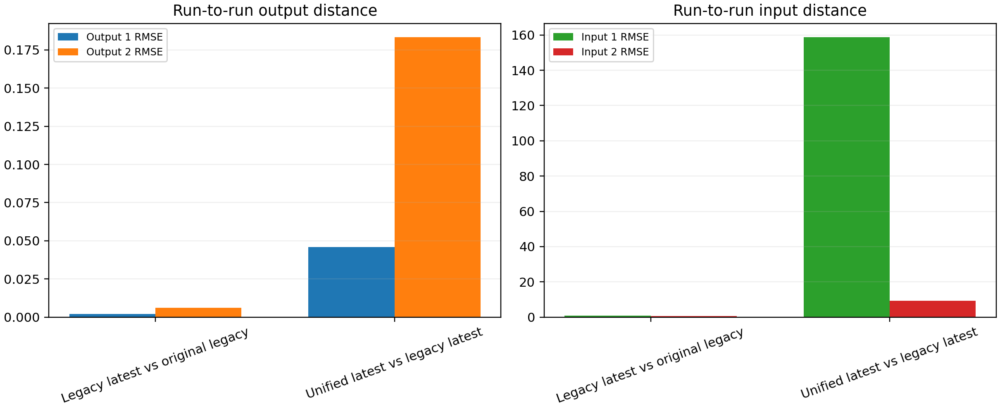

### Bottom line

The restored legacy notebook is already close to the old prototype. So the main discrepancy is no longer "the old notebook was not restored correctly."

The main discrepancy is that the unified notebook still uses a different Markov execution stack:

1. different nominal online solve
2. different `z` authority
3. much larger nominal fallback rate
4. different external comparator in the report

That is why the newest unified run can still look much more like nominal MPC even after the disturbance timing fix, while the restored legacy notebook remains close to the historical prototype behavior.

### Artifacts generated for this follow-up

- `report/figures/polymer_markov_dual_notebook_followup_20260510/prototype_reward_window_compare.png`
- `report/figures/polymer_markov_dual_notebook_followup_20260510/baseline_choice_effect.png`
- `report/figures/polymer_markov_dual_notebook_followup_20260510/tail_output_overlay.png`
- `report/figures/polymer_markov_dual_notebook_followup_20260510/action_source_and_z_summary.png`
- `report/figures/polymer_markov_dual_notebook_followup_20260510/behavioral_distance_summary.png`
- `report/figures/polymer_markov_dual_notebook_followup_20260510/comparison_summary.csv`
- `report/figures/polymer_markov_dual_notebook_followup_20260510/source_summary.csv`
- `report/figures/polymer_markov_dual_notebook_followup_20260510/behavioral_distance_summary.csv`

## Update: May 10 forced-execution run

The newest polymer Markov run is now:

`Polymer/Results/td3_markov_disturb/20260510_193643/input_data.pkl`

with comparison bundle:

`Polymer/Results/disturb_compare_td3_markov/20260510_193656/input_data.pkl`

This run matters because it removes the easiest excuse for weak Markov performance. It does not look near-nominal because TD3 was filtered away. It uses TD3 essentially all the time:

| Quantity | Latest shared-reward forced run |
| --- | ---: |
| Mean reward delta vs canonical MPC | `-0.0647` |
| Last-20 reward delta | `-0.0528` |
| Fraction of better episodes | `0.0150` |
| TD3 fraction | `0.9999` |
| LS fallback fraction | `0.0000` |
| Nominal fallback fraction | `0.0000` |
| Mean prediction score | `0.0047` |
| Mean gain drift | `0.0432` |
| Output-1 MAE delta, full run | `+0.0016` |
| Output-2 MAE delta, full run | `+0.0012` |
| Input-movement delta, full run | `-0.0276` |

The output story is slightly mixed but still not strong enough to rescue the method. In the last 20 episodes the newest run is a little better on both outputs:

- output-1 MAE delta, last 20: `-0.00093`
- output-2 MAE delta, last 20: `-0.00255`
- input-movement delta, last 20: `-0.0391`

So the newest run is smoother and somewhat better late in the run, but it still loses on the overall shared reward and only beats canonical MPC in `1.5%` of episodes.

### Why this changes the interpretation

The newest run strengthens the negative conclusion rather than weakening it.

First, all shared-reward polymer Markov runs analyzed so far are below the canonical polymer baseline:

| Shared-reward run | Reward delta mean | Reward delta last 20 | Better-episode fraction |
| --- | ---: | ---: | ---: |
| `20260509_023119` guarded TD3 | `-0.0259` | `-0.0295` | `0.0450` |
| `20260510_193643` forced TD3 execute | `-0.0647` | `-0.0528` | `0.0150` |

Second, the newest run shows that the problem is not just conservative fallback logic. The earlier shared-reward run used TD3 on `48.08%` of steps and still lost slightly. The newest run uses TD3 on `99.994%` of steps, with no LS fallback and no nominal fallback, and it still loses. That is strong evidence that the currently learned Markov corrections are not improving the polymer objective under the shared reward geometry.

Third, prediction-error validation is not translating cleanly into closed-loop benefit. The newest run still reports positive prediction-improvement statistics, but the average score is only `0.0047`, much smaller than the earlier shared-reward run's `0.0215`. In other words, even when the correction basis explains recent trajectory data a little better, the resulting control decisions are not reliably better than nominal MPC.

### Why prototype-reward runs can still look good

The prototype-reward runs remain important, but they no longer overturn the main conclusion.

- Under the prototype reward, several unified runs still show large positive deltas.
- Under the shared polymer reward, the same Markov family remains below the canonical baseline.
- The newest forced-execution run confirms that this is not only a fallback-rate artifact.

So the current polymer Markov branch appears reward-sensitive rather than robustly process-improving. It can look better when the evaluation puts more weight on bonus-like inside-band behavior, but it has not shown a reliable win under the shared polymer objective.

### Revised bottom line

The current `io_pair_gain` Markov correction family is not yet helping the polymer process in a robust way.

The best evidence for that statement is now:

1. the shared-reward runs are both negative versus canonical MPC
2. the latest forced-execution run is still negative even though TD3 is active almost everywhere
3. the method mainly buys smoother inputs and occasional late-episode local improvement, not a clear full-run control advantage

That does not prove that every Markov-style idea is hopeless, but it does mean this current polymer Markov implementation is not earning more tuning by default. The burden of proof has shifted. Any next Markov experiment should first demonstrate that LS-only or hand-selected Markov corrections can beat canonical MPC under the same shared reward and the same external baseline. If that ablation is still negative, it is reasonable to stop the polymer Markov branch and move effort to residual correction or re-identification instead.

### Note on metric provenance

For this May 10 update, all baseline-sensitive metrics were computed from the canonical baseline pickle and the saved compare bundles. The unified Markov run bundles currently store `y_mpc` and `u_mpc` equal to the RL trajectory itself, so those duplicated arrays are not used for report comparisons.

### Artifacts generated for this update

- `report/figures/polymer_markov_latest_run_20260510/reward_mode_history.png`
- `report/figures/polymer_markov_latest_run_20260510/shared_reward_window_compare.png`
- `report/figures/polymer_markov_latest_run_20260510/recent_run_summary.csv`
- `report/figures/polymer_markov_latest_run_20260510/summary.json`
