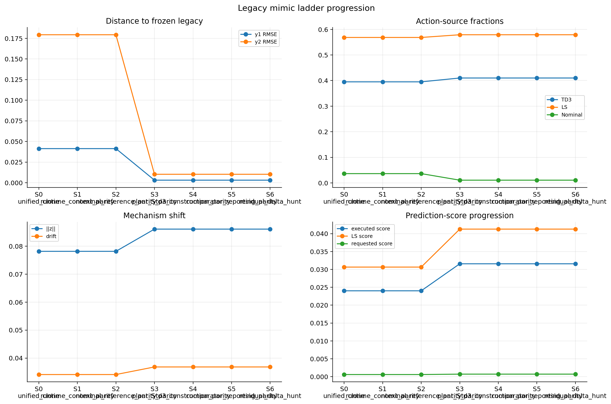

# Polymer Markov Legacy Mimic Ladder

Date updated: 2026-05-11

This report summarizes the latest full six-step unified-to-legacy mimic ladder for the isolated polymer Markov fork. The frozen references remain:

- Frozen legacy target: `Polymer/Results/polymer_markov_corrected_mpc/20260510_204243/`
- Frozen unified reference: `Polymer/Results/td3_markov_disturb/20260510_204834/`

Latest mimic runs analyzed:

- Step 0: `Polymer/Results/td3_markov_disturb_legacy_mimic_step0_unified_clone/20260510_215303/`
- Step 1: `Polymer/Results/td3_markov_disturb_legacy_mimic_step1_runtime_context_parity/20260510_222230/`
- Step 2: `Polymer/Results/td3_markov_disturb_legacy_mimic_step2_nominal_reference_parity/20260510_223817/`
- Step 3: `Polymer/Results/td3_markov_disturb_legacy_mimic_step3_plant_step_parity/20260510_225856/`
- Step 4: `Polymer/Results/td3_markov_disturb_legacy_mimic_step4_td3_construction_parity/20260510_232943/`
- Step 5: `Polymer/Results/td3_markov_disturb_legacy_mimic_step5_comparator_reporting_parity/20260510_234930/`
- Step 6: `Polymer/Results/td3_markov_disturb_legacy_mimic_step6_residual_delta_hunt/20260511_000853/`

Generated figures:

- `report/figures/polymer_markov_legacy_mimic_ladder_20260510/all_steps/legacy_mimic_all_steps_progression.png`
- one per-step comparison figure and summary JSON under:
  `report/figures/polymer_markov_legacy_mimic_ladder_20260510/<step_name>/`

## Main conclusion

The ladder answer is now clear:

1. Steps 0, 1, and 2 did not move the unified fork at all.
2. Step 3 is the big causal implementation change.
3. Step 4 did not change the deterministic ladder behavior.
4. Step 5 is useful for report parity, not controller parity.
5. Step 6 did not reveal any additional causal difference beyond Step 3.

So the dominant remaining code difference between unified and legacy is the plant-step / disturbance execution semantics, not the nominal reference solve, not the bounds source, and not replay-action storage.

## Acceptance summary

The ladder acceptance targets were:

- TD3 fraction within `+/-0.05` of frozen legacy
- LS fraction within `+/-0.05` of frozen legacy
- nominal fraction within `+/-0.02` of frozen legacy
- mean executed `||z||` within `+/-0.01` of frozen legacy
- mean gain drift within `+/-0.01` of frozen legacy
- output-1 RMSE to frozen legacy `<= 0.01`
- output-2 RMSE to frozen legacy `<= 0.03`

Best mimic result, achieved first at Step 3 and unchanged through Steps 4-6:

- TD3 fraction: `0.4100` versus frozen legacy `0.3235`
- LS fraction: `0.5791` versus frozen legacy `0.4668`
- nominal fraction: `0.01065` versus frozen legacy `0.01110`
- mean executed `||z||`: `0.08611` versus frozen legacy `0.08551`
- mean gain drift: `0.03682` versus frozen legacy `0.03595`
- output-1 RMSE to frozen legacy: `0.00307`
- output-2 RMSE to frozen legacy: `0.01023`

Interpretation:

- The trajectory criteria are satisfied by Step 3 onward.
- The nominal-fallback criterion is satisfied by Step 3 onward.
- The `||z||` and gain-drift criteria are satisfied by Step 3 onward.
- The TD3 and LS fraction criteria are **not** yet satisfied.

That means the controller mechanism is now very close to legacy in trajectory space, but the action-source mix is still not legacy-like. The most likely remaining reason is the release schedule, especially the missing legacy-style LS-only early phase in the mimic notebook runs.

## Step-by-step verdict

| Step | What changed | Outcome | Verdict |
| --- | --- | --- | --- |
| Step 0 | Unified clone baseline | Exactly reproduced frozen unified | successful baseline, non-causal |
| Step 1 | Runtime context parity | No measurable change from Step 0 | neutral |
| Step 2 | Nominal-reference solve parity | No measurable change from Step 1 | neutral |
| Step 3 | Plant-step / disturbance parity | Large move toward frozen legacy | causal and successful |
| Step 4 | TD3 construction parity | No measurable change from Step 3 in deterministic mode | neutral |
| Step 5 | Comparator / reporting parity | No control-law change, but internal nominal rerun became available | reporting-success only |
| Step 6 | Residual delta hunt | No measurable change from Step 5 | non-causal |

Success labels used in this report:

- `successful baseline`: the step did exactly what it was meant to do, but it was not expected to move the controller toward legacy
- `causal and successful`: the step changed the controller in the intended direction and materially reduced the legacy gap
- `neutral`: the step applied correctly but did not change the current notebook behavior
- `reporting-success only`: the step improved analysis parity, not control-law parity
- `non-causal`: the step completed, but the latest results show no remaining effect beyond earlier accepted steps

## Step 0

Code delta:
Unified clone baseline only.

Why this step exists:
It verifies that the forked runner actually reproduces the current unified notebook before we interpret any later delta.

Observed result:

- output RMSE to frozen legacy: `0.04132`, `0.17934`
- TD3 / LS / nominal fractions: `0.3950`, `0.5685`, `0.03628`
- distance to frozen unified: exactly zero at the saved-array level

Verdict:
This step was successful as a baseline, but it is not a legacy-mimic success. It proves the fork was clean.

Figure:
- `report/figures/polymer_markov_legacy_mimic_ladder_20260510/step0_unified_clone/step0_unified_clone_comparison.png`

## Step 1

Code delta:
Runtime context parity through the legacy bounds source from `system_data`.

Why this might have mattered:
The legacy script builds control bounds from identified system artifacts, while the unified notebook reconstructs them locally from notebook-level inputs.

Observed result:
All reported metrics remained numerically identical to Step 0.

Verdict:
This step is neutral. For the current Markov setup, the notebook-local bounds reconstruction is effectively the same as the legacy artifact source.

Figure:
- `report/figures/polymer_markov_legacy_mimic_ladder_20260510/step1_runtime_context_parity/step1_runtime_context_parity_comparison.png`

## Step 2

Code delta:
Legacy nominal lifted `G0` solve path.

Why this might have mattered:
The candidate filter should compare against the same nominal action and nominal reference cost as the legacy script.

Observed result:
All reported metrics remained numerically identical to Step 1.

Verdict:
This step is neutral in the current notebook state. The practical reason is that the frozen unified baseline was already running with `nominal_solver_mode = "lifted_g0_prototype"`, so Step 2 did not introduce a new behavior change.

Figure:
- `report/figures/polymer_markov_legacy_mimic_ladder_20260510/step2_nominal_reference_parity/step2_nominal_reference_parity_comparison.png`

## Step 3

Code delta:
Legacy-style polymer disturbance write and plant step inside the live loop.

Why this might have mattered:
The LS teacher and TD3 proposal are path-dependent. If the plant disturbance is applied with different timing or through a different stepping path, the prediction-error windows, LS fit, and accepted actions all change.

Observed result:

- output RMSE to frozen legacy dropped from `0.04132`, `0.17934` to `0.00307`, `0.01023`
- input RMSE to frozen legacy dropped from `159.34`, `8.91` to `0.660`, `0.865`
- nominal fraction dropped from `0.03628` to `0.01065`, nearly matching the frozen legacy `0.01110`
- LS score rose from `0.03065` to `0.04127`, matching the frozen legacy `0.04119`
- executed score rose from `0.02401` to `0.03157`, much closer to frozen legacy `0.03280`
- mean executed `||z||` and gain drift both moved directly onto the legacy scale

Verdict:
This is the dominant causal change. Step 3 is the first step that makes the unified fork behave like legacy in trajectory space and in Markov-mechanism scale.

Figure:
- `report/figures/polymer_markov_legacy_mimic_ladder_20260510/step3_plant_step_parity/step3_plant_step_parity_comparison.png`

## Step 4

Code delta:
Legacy-style TD3 seed semantics with deterministic default attribution mode.

Why this might have mattered:
The legacy script does not forward a dedicated seed into `TD3Agent(...)`, so network initialization and exploration history can differ.

Observed result:
All reported metrics remained numerically identical to Step 3.

Verdict:
This step is neutral in deterministic ladder mode. That is not a bug. It means the deterministic ladder setting successfully held RL variance fixed, so we could isolate the real causal implementation change first.

Recommendation:
Keep this as a sensitivity option, not as the default shared-runner behavior.

Figure:
- `report/figures/polymer_markov_legacy_mimic_ladder_20260510/step4_td3_construction_parity/step4_td3_construction_parity_comparison.png`

## Step 5

Code delta:
Always save an internal nominal rerun bundle for legacy-style comparator analysis.

Why this might have mattered:
Legacy compares against its own internal nominal rerun, not only the canonical saved baseline bundle.

Observed result:

- control-law metrics stayed identical to Step 4
- `internal_nominal_available` changed from `false` to `true`

Verdict:
This step is successful for reporting parity, not for controller parity. It is useful because it lets the unified analysis tell the same story legacy tells, but it does not change the online Markov controller.

Figure:
- `report/figures/polymer_markov_legacy_mimic_ladder_20260510/step5_comparator_reporting_parity/step5_comparator_reporting_parity_comparison.png`

## Step 6

Code delta:
Residual low-level delta hunt.

Why this step exists:
It is the catch-all in case Steps 1-5 still leave a large unexplained legacy gap.

Observed result:
All reported metrics remained numerically identical to Step 5.

Verdict:
This step is non-causal for the current latest run. The ladder did not uncover another major hidden implementation gap after Step 3.

Figure:
- `report/figures/polymer_markov_legacy_mimic_ladder_20260510/step6_residual_delta_hunt/step6_residual_delta_hunt_comparison.png`

## What should be transferred to the unified runner

### Transfer now

1. Plant-step / disturbance parity from Step 3.

Why:
It is the only step that materially changed the controller behavior and it explains almost the entire trajectory gap to legacy.

Expected impact:
Large. This is the one change that moved the unified fork onto the legacy trajectory family.

Transfer target:
The shared Markov runner, or the shared polymer disturbance stepping path it uses, should adopt the exact legacy-equivalent polymer live-step semantics.

Why this transfer is justified now:

- it reduced output RMSE to frozen legacy by more than an order of magnitude
- it pulled nominal fallback, `||z||`, gain drift, and LS prediction score onto the legacy scale
- it stayed stable through Steps 4, 5, and 6, so the effect is not a fragile one-off

### Transfer next, but as reporting support

2. Comparator / reporting parity from Step 5.

Why:
It does not change the controller, but it changes whether the report is scientifically apples-to-apples with legacy.

Expected impact:
Slight on controller behavior, moderate on interpretation. It changes the story, not the live control law.

Transfer target:
Plotting/reporting layer or optional analysis hook, not the core control loop.

Why this transfer is still worth doing:

- it lets unified and legacy be compared against the same kind of nominal reference
- it removes one avoidable interpretation mismatch from future reports
- it is low risk because it does not change online decisions

### Do not transfer as a default control change

3. TD3 construction parity from Step 4.

Why:
In deterministic mode it did not change behavior, and unseeded legacy semantics would reduce reproducibility.

Expected impact:
Slight to none for the current controlled comparisons, but potentially large variance in repeated runs if made unseeded by default.

Transfer target:
Keep only as an optional sensitivity setting.

Why this should remain optional:

- deterministic seeded comparisons are more scientifically useful for code-delta attribution
- the latest ladder shows that seed semantics were not the missing mechanism

### No need to transfer separately

4. Runtime context parity from Step 1 and nominal-reference parity from Step 2.

Why:
They did not move the current notebook at all.

Expected impact:
None in the current setup.

Transfer target:
No separate transfer is needed. Those differences are already effectively aligned in the current notebook path.

5. Residual low-level delta hunt from Step 6.

Why:
No remaining low-level difference surfaced after Step 3.

Expected impact:
None in the latest run family.

Transfer target:
No transfer. Keep it only as an investigation label if future regressions appear.

## What changed a lot versus slightly

Changed a lot:

- Step 3 plant-step / disturbance parity
  This is the big causal method. It changed both the trajectories and the Markov mechanism metrics.

Changed slightly:

- Step 5 comparator / reporting parity
  It changes report interpretation, not the live controller.

Changed almost not at all:

- Step 1 runtime context parity
- Step 2 nominal-reference parity
- Step 4 TD3 seed semantics in deterministic mode
- Step 6 residual delta hunt

Recommended transfer order:

1. Transfer Step 3 into the shared unified Markov runner.
2. Keep Step 7 notebook-specific first and only promote it after it proves causal.
3. Transfer Step 5 as an optional reporting hook.
4. Leave Step 4 as an optional sensitivity mode.
5. Do not spend more shared-runner effort on Steps 1, 2, or 6.

## Recommended next step

The next experiment should be:

### Step 7: release-schedule parity

Run the mimic notebook with Step 3 behavior retained, but add the legacy-style early LS-only release schedule:

- Episodes 1-10: use LS teacher directly
- Episode 11 onward: TD3 -> LS -> nominal

Why this is the next step:

- Step 3 already solved the trajectory mismatch.
- The remaining mismatch is mainly in the action-source fractions.
- The frozen legacy target still has `warm_start_ls_fraction = 0.1984`, while Steps 3-6 still have `0.0`.
- That is the clearest remaining reason the TD3/LS action mix still does not match legacy.

Expected outcome:

- action-source fractions should move closer to frozen legacy
- trajectories may improve slightly, but the biggest remaining visible effect should be on source mix rather than output RMSE

Implementation advice:

- keep this as a Markov-family or notebook-specific schedule first
- do not push it into all notebook families yet
- if Step 7 closes the action-mix gap without breaking the good Step 3 trajectory match, then promote it to a Markov-specific shared option

What Step 7 would probably change:

- large change in action-source fractions
- slight to moderate change in trajectory metrics
- slight change in nominal fraction, because the main nominal mismatch already disappeared at Step 3

What Step 7 would probably not change much:

- the conclusion that plant-step semantics were the dominant structural bug
- the need for Step 5 as a reporting-parity tool

## Files used

- `polymer_markov_corrected_mpc_unified_legacy_mimic.ipynb`
- `utils/markov_runner_legacy_mimic.py`
- `report/scripts/analyze_polymer_markov_legacy_mimic_ladder.py`
- `Polymer/Results/polymer_markov_corrected_mpc/20260510_204243/markov_stage_diagnostics.csv`
- `Polymer/Results/td3_markov_disturb/20260510_204834/markov_stage_diagnostics.csv`
- latest run folders for mimic Steps 0 through 6 listed at the top of this report

Files changed in this update:

- `report/scripts/analyze_polymer_markov_legacy_mimic_ladder.py`
- `report/polymer_markov_legacy_mimic_ladder_2026_05_10.md`
