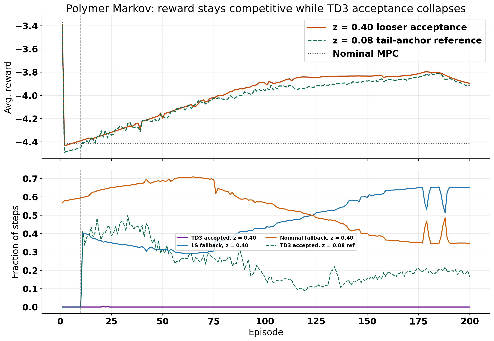
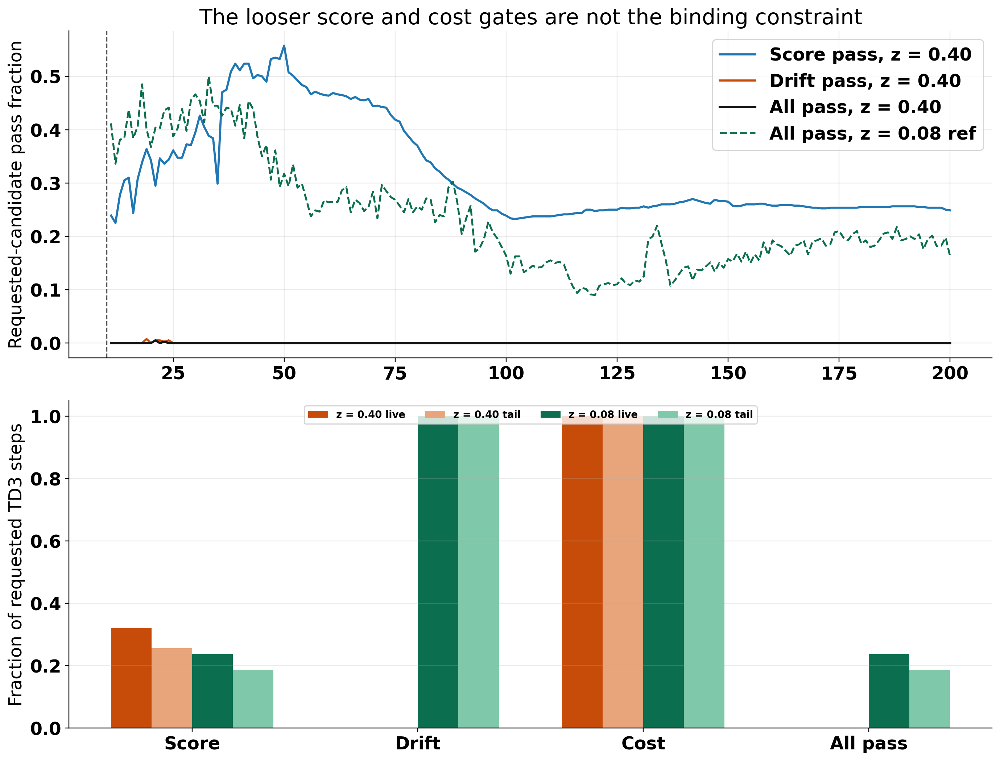
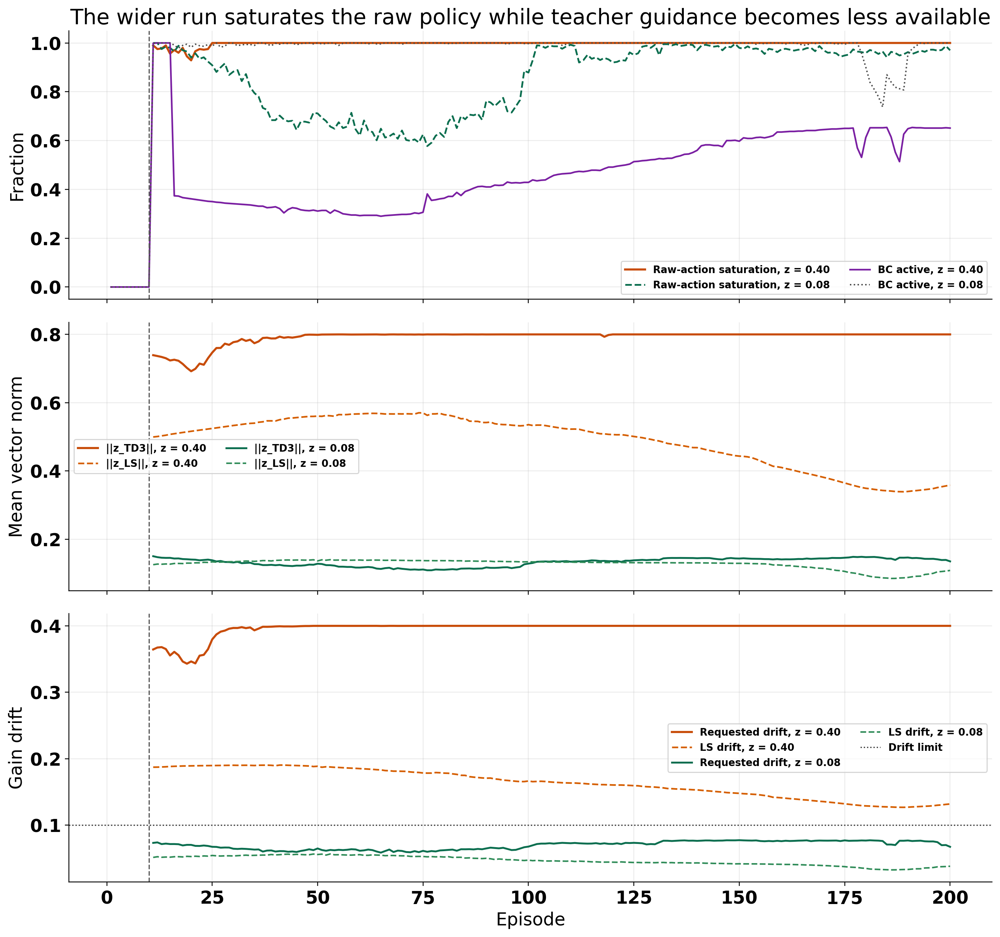
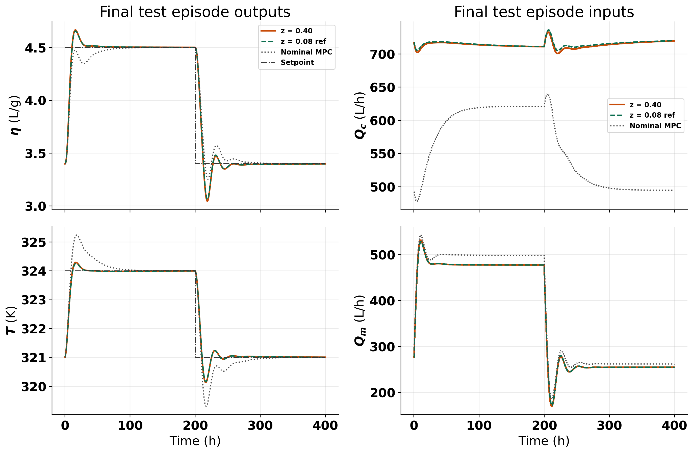

# Polymer Markov Looser-Acceptance Run Analysis

Date: 2026-05-14

## Objective

Analyze the latest polymer Markov notebook variant
[RL_assisted_MPC_markov_wider_range_looser_acceptance_unified.ipynb](/c:/Users/HAMEDI/OneDrive%20-%20McMaster%20University/PythonProjects/RL_assisted_MPC/RL_assisted_MPC_markov_wider_range_looser_acceptance_unified.ipynb)
after the user widened the Markov authority and loosened the score and nominal-cost acceptance thresholds.

The main question is:

Why did TD3 acceptance collapse to almost zero when the notebook was made looser?

## Runs compared

- latest looser notebook run:
  `Polymer/Results/td3_markov_disturb_zbound_040_looser_accept/20260514_013414/`
- most relevant polymer Markov reference:
  `Polymer/Results/td3_markov_disturb_zbound_008/20260511_230422/`
- disturbance MPC baseline:
  `Polymer/Data/mpc_results_dist.pickle`

The comparison is intentionally against the `z = 0.08` tail-anchor run, because that was the last polymer Markov configuration with meaningful late TD3 acceptance.

## What changed in the looser notebook

The new notebook variant uses:

- `z_bound = 0.40`
- `nominal_cost_relative_tol = 0.30`
- `s_pred_min = 1.0e-7`

The important non-change is:

- `gain_drift_max = 0.10` stayed fixed

That non-change is the key to the result.

## Method reminder

The polymer Markov supervisor maps the TD3 raw action `a_k` into a Markov correction vector `z_k` through

$$ z_k = \mathrm{clip}(a_k, -1, 1)\, z_{\max}. $$

The corrected candidate is executed only if all three conditions pass:

$$ S_{\mathrm{pred}}(z_k) > s_{\mathrm{pred,min}}, $$

$$ d_G(z_k) \le d_{\max}, $$

$$ J_{\mathrm{nom}}(U_{\mathrm{cand}}) \le J_{\mathrm{nom}}(U_0) + \varepsilon_{\mathrm{abs}} + \tau_{\mathrm{rel}} \lvert J_{\mathrm{nom}}(U_0) \rvert. $$

Here:

- `S_pred` is the recent prediction-improvement score
- `d_G` is the lifted gain-drift measure
- `U_0` is the nominal MPC plan
- `U_cand` is the corrected MPC plan

The critical scaling fact is:

$$ \Delta z \approx z_{\max}\, \Delta a. $$

So increasing `z_bound` from `0.08` to `0.40` multiplies the physical correction represented by the same raw action or raw exploration perturbation by about `5x`.

That affects:

- executed TD3 proposals
- exploration in raw action space
- target-policy smoothing noise in TD3 training
- the LS target represented in the same raw coordinate system

## Main result

The looser run did **not** become more TD3-driven. It became a stronger LS/nominal gated controller with almost no TD3 execution.

### High-level comparison

| Metric | `z = 0.08` reference | `z = 0.40` looser run |
| --- | ---: | ---: |
| Mean reward | `-4.0318` | `-3.9977` |
| Tail-50 mean reward | `-3.8591` | `-3.8335` |
| Final episode reward | `-3.9125` | `-3.8961` |
| TD3 fraction, episodes `11-50` | `0.4076` | `0.00019` |
| TD3 fraction, last `50` episodes | `0.1860` | `0.0000` |
| LS fallback fraction, last `50` episodes | `0.7763` | `0.6313` |
| Nominal fallback fraction, last `50` episodes | `0.0377` | `0.3687` |
| BC active fraction, last `50` episodes | `0.9608` | `0.6313` |

So the user observation is correct:

1. performance remains stable and slightly better in reward terms
2. TD3 acceptance is essentially gone
3. the small improvement is therefore **not** coming from accepted TD3 decisions

The result is a controller that performs reasonably well, but is no longer meaningfully TD3-assisted online.

## Why the looser notebook did the opposite

The answer is that the loosened score and cost thresholds were **not** the active bottleneck.

The active bottleneck became the unchanged gain-drift guard.

### Requested TD3 candidate pass rates

| Requested TD3 gate metric | `z = 0.08` live | `z = 0.08` tail | `z = 0.40` live | `z = 0.40` tail |
| --- | ---: | ---: | ---: | ---: |
| Score pass fraction | `0.2366` | `0.1860` | `0.3194` | `0.2557` |
| Drift pass fraction | `1.0000` | `1.0000` | `0.00013` | `0.0000` |
| Cost pass fraction | `1.0000` | `1.0000` | `0.9999` | `1.0000` |
| All-pass fraction | `0.2366` | `0.1860` | `0.000039` | `0.0000` |

This is the key finding.

The looser `z = 0.40` run is **not** failing because TD3 proposals have bad score or violate the nominal-cost budget.

It is failing because the proposals are structurally too large:

- the score gate is already passed on about `31.9%` of live requested steps and `25.6%` of tail requested steps
- the cost guard passes on essentially all requested steps
- the drift guard passes on only `0.013%` of live requested steps and `0%` of tail requested steps

So the relaxed score and cost settings were the wrong gates to loosen for this run.

### The geometry changed much more than the gates

The TD3 policy in raw action space is close to saturation in both runs, but after the `z_bound` jump the same raw saturation becomes a far larger physical Markov correction.

Tail-window geometry:

| Tail metric | `z = 0.08` reference | `z = 0.40` looser run |
| --- | ---: | ---: |
| Mean requested raw-action norm | `1.7949` | `2.0000` |
| Mean requested `||z_TD3||` | `0.1436` | `0.8000` |
| Mean LS `||z_LS||` | `0.1073` | `0.3750` |
| Mean requested gain drift | `0.0755` | `0.4000` |
| Mean LS gain drift | `0.0374` | `0.1341` |
| Drift limit | `0.1000` | `0.1000` |

Two consequences follow immediately:

1. TD3 requests became much larger in `z` space than in the reference run.
2. Those larger requests pushed the gain-drift statistic far beyond the fixed `0.10` guard.

This is why the result felt counterintuitive. The notebook was "looser" only in score and cost. At the same time it was much **more aggressive** in structural authority.

The authority change dominated.

## Why TD3 guidance got even weaker

There is a second mechanism on top of the drift collapse.

The LS teacher itself became less admissible under the fixed drift guard:

| LS metric | `z = 0.08` tail | `z = 0.40` tail |
| --- | ---: | ---: |
| LS score pass fraction | `0.9623` | `0.9886` |
| LS drift pass fraction | `1.0000` | `0.6428` |
| LS all-pass fraction | `0.9623` | `0.6313` |
| BC active fraction | `0.9608` | `0.6313` |

So the wider run did not only destroy TD3 admissibility. It also reduced how often the LS target itself is safe enough to be accepted and used as a behavioral-cloning anchor.

That matters because the `z = 0.08` tail-anchor run relied on persistent LS guidance to keep TD3 close to the useful correction manifold. In the `z = 0.40` run, that guidance becomes less available at exactly the same time that TD3 action magnitude increases.

So the combined effect is:

1. TD3 requested corrections are much larger
2. the drift gate rejects almost all of them
3. LS guidance is available less often
4. nominal fallback rises sharply

## Why reward can still improve slightly

This was the user's main surprise, and the logs support a clean answer.

The slight reward improvement is real:

- mean reward improved from `-4.0318` to `-3.9977`
- tail-50 mean reward improved from `-3.8591` to `-3.8335`
- final episode reward improved from `-3.9125` to `-3.8961`

But because TD3 acceptance is zero in the tail, that improvement cannot be attributed to TD3 online execution.

The improvement is more plausibly explained by a different control mixture:

- stronger LS corrections when they do pass
- more nominal fallback when LS also fails
- effectively a sparse, stronger-teacher controller rather than a stronger TD3 policy

In other words, the latest notebook behaved more like:

$$ \text{TD3 request} \rightarrow \text{reject by drift} \rightarrow \text{LS if safe} \rightarrow \text{otherwise nominal MPC}. $$

That can still perform well, but it is no longer evidence that the TD3 policy itself improved.

## Final closed-loop quality

Even with the TD3 path mostly gone, the latest run still beats the disturbance MPC baseline on the final held-out episode:

| Final-episode metric | `z = 0.40` looser run | Nominal MPC |
| --- | ---: | ---: |
| Avg. reward | `-3.8961` | `-4.4174` |
| Viscosity RMSE | `0.1831` | `0.1917` |
| Temperature RMSE | `0.4498` | `0.5678` |
| Viscosity IAE | `43.72` | `51.71` |
| Temperature IAE | `104.93` | `212.30` |
| Mean input-move norm | `1.0083` | `1.1915` |

Relative to the `z = 0.08` reference, the final-episode tracking is almost the same:

- slightly better reward and temperature RMSE for `z = 0.40`
- slightly worse temperature IAE and input movement
- no meaningful TD3-acceptance recovery

So the engineering conclusion is:

The latest run is a usable controller, but not a successful TD3-authority experiment.

## Interpretation

The user expectation was reasonable if the only change had been to loosen acceptance.

But the experiment actually changed two things in opposite directions:

1. it loosened score and nominal-cost acceptance
2. it increased structural correction authority from `0.08` to `0.40`

Because the fixed drift limit stayed at `0.10`, the second change dominated the first.

That is why the result moved in the opposite direction from what intuition based only on acceptance loosening would suggest.

## Recommended next experiment

The clean next experiment is to **separate acceptance loosening from authority widening**.

Use the same polymer Markov notebook family, but keep `z_bound = 0.08` and change only:

- `nominal_cost_relative_tol`
- `s_pred_min`

Purpose:

- test whether looser acceptance alone actually increases TD3 execution share

What to watch:

- TD3 all-pass fraction in live and tail windows
- requested drift pass fraction
- requested score pass fraction
- TD3 tail accepted fraction
- reward and final-episode RMSE versus the `z = 0.08` reference

What result would confirm the idea:

- TD3 tail acceptance rises materially above `0.186`
- drift pass remains close to `1.0`
- reward does not regress

What result would reject it:

- TD3 share stays low even when `z_bound` is kept at `0.08`

If that isolated gate-only run still does not recover TD3 share, the next stronger fix should be to decouple TD3 action scale from LS search scale in the shared runtime, for example by adding a separate actor-side `z` scale or a drift-budget projection in
[markov_runner.py](/c:/Users/HAMEDI/OneDrive%20-%20McMaster%20University/PythonProjects/RL_assisted_MPC/utils/markov_runner.py).

## Risks and provenance notes

- The saved run bundle records `markov_z_bound`, `markov_s_pred_min`, and `markov_gain_drift_max`, but it does **not** store `nominal_cost_relative_tol`. The report uses the known notebook/default value for that field.
- Because TD3 acceptance is effectively zero in the tail, reward improvements should not be interpreted as TD3 policy improvement.
- The latest run is scientifically useful, but mainly as evidence about authority scaling and gate interaction, not as evidence that TD3 learned a better online correction policy.

## Files used

- [RL_assisted_MPC_markov_wider_range_looser_acceptance_unified.ipynb](/c:/Users/HAMEDI/OneDrive%20-%20McMaster%20University/PythonProjects/RL_assisted_MPC/RL_assisted_MPC_markov_wider_range_looser_acceptance_unified.ipynb)
- [utils/markov_runner.py](/c:/Users/HAMEDI/OneDrive%20-%20McMaster%20University/PythonProjects/RL_assisted_MPC/utils/markov_runner.py)
- `Polymer/Results/td3_markov_disturb_zbound_040_looser_accept/20260514_013414/`
- `Polymer/Results/td3_markov_disturb_zbound_008/20260511_230422/`
- `Polymer/Data/mpc_results_dist.pickle`
- `report/figures/polymer_markov_looser_acceptance_20260514/summary_metrics.csv`
