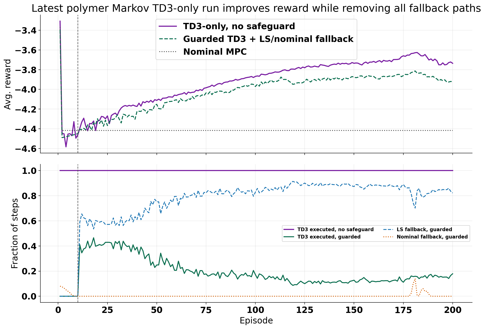
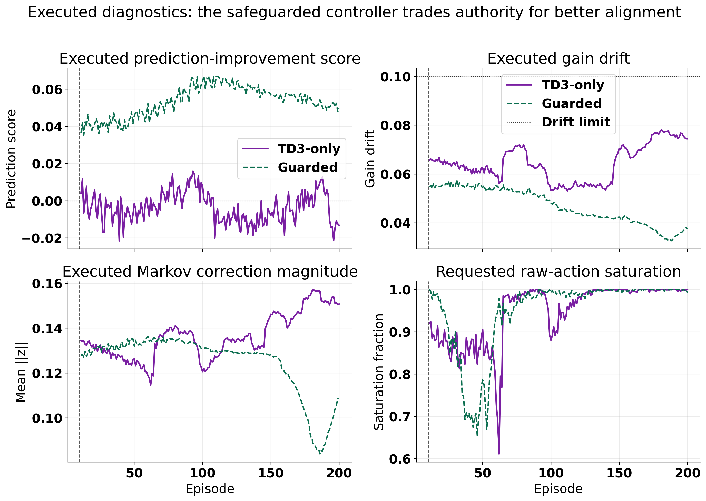
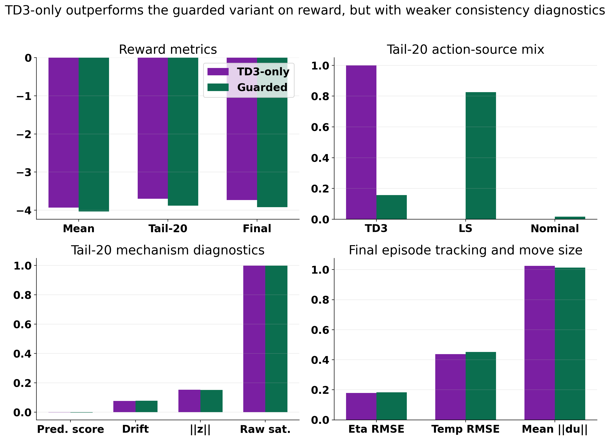
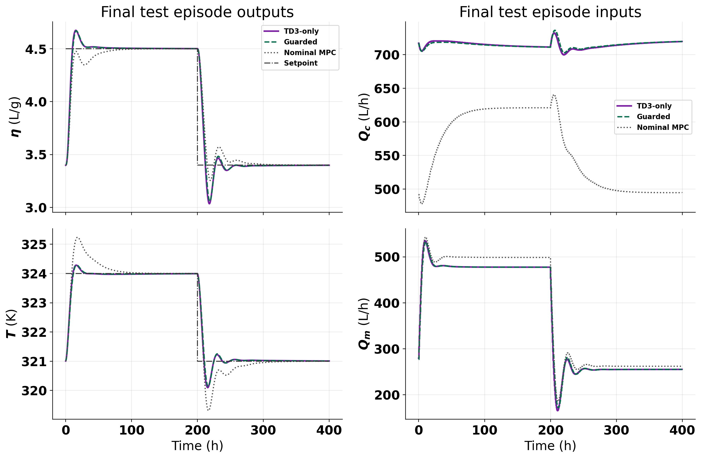

# Polymer Markov TD3-Only Run Without Safeguard

Date: 2026-05-16

## Objective

Analyze the latest polymer Markov run from
[RL_assisted_MPC_markov_zbound_008_looser_gate_only_td3_only_unified.ipynb](../RL_assisted_MPC_markov_zbound_008_looser_gate_only_td3_only_unified.ipynb)
and compare it against the safeguarded sibling
[RL_assisted_MPC_markov_zbound_008_looser_gate_only_unified.ipynb](../RL_assisted_MPC_markov_zbound_008_looser_gate_only_unified.ipynb)
and the disturbance MPC baseline.

The main question is:

What actually happens when the polymer Markov controller is forced to execute TD3 actions without LS or nominal fallback?

## Runs compared

- latest TD3-only, no-safeguard run:
  `Polymer/Results/td3_markov_disturb_zbound_008_looser_gate_only_td3_only/20260516_000338/`
- latest safeguarded sibling:
  `Polymer/Results/td3_markov_disturb_zbound_008_looser_gate_only/20260515_230958/`
- disturbance MPC baseline:
  `Polymer/Data/mpc_results_dist.pickle`

## Method reminder

The polymer Markov controller starts from a nominal offset-free MPC plan `U_{0,k}` and applies a learned Markov correction:

$$ z_k = \mathrm{clip}(a_k, -1, 1)\, z_{\max}. $$

The corrected candidate is formed as:

$$ U_{\mathrm{cand},k} = U_{0,k} + M_k z_k, $$

where `M_k` is the Markov correction map built from the local lifted prediction basis.

In the guarded notebook family, the TD3 candidate is executed only if it passes the same three tests used in the unified runner:

$$ S_{\mathrm{pred}}(z_k) > s_{\mathrm{pred,min}}, $$

$$ d_G(z_k) \le d_{\max}, $$

$$ J_{\mathrm{nom}}(U_{\mathrm{cand},k}) \le J_{\mathrm{nom}}(U_{0,k}) + \varepsilon_{\mathrm{abs}} + \tau_{\mathrm{rel}} \lvert J_{\mathrm{nom}}(U_{0,k}) \rvert. $$

If the TD3 candidate fails, the guarded notebook can fall back to the LS candidate and then to nominal MPC.

In the TD3-only notebook, the configuration changes are:

- `rl_fallback_to_ls = False`
- `force_td3_execute = True`

So the same diagnostics are still logged, but they are no longer used to block TD3 execution.

This matters because the saved result bundle confirms:

- `force_td3_execute = True`
- `td3_accepted_fraction = 1.0`
- `ls_fallback_fraction = 0.0`
- `nominal_fallback_fraction = 0.0`

That means the live controller really is a TD3-only controller online, not a fallback-dominated mixture.

## Main result

The no-safeguard TD3-only run is the best of the three in reward terms, and it is also slightly better than the safeguarded sibling on final tracking metrics.

### High-level comparison

| Metric | TD3-only no safeguard | Guarded TD3 sibling | Nominal MPC |
| --- | ---: | ---: | ---: |
| Mean reward | `-3.9313` | `-4.0360` | `-4.4174` |
| Tail-20 mean reward | `-3.6978` | `-3.8800` | `-4.4174` |
| Final episode reward | `-3.7357` | `-3.9214` | `-4.4174` |
| TD3 fraction, tail-20 | `1.0000` | `0.1570` | `0.0000` |
| LS fraction, tail-20 | `0.0000` | `0.8256` | `0.0000` |
| Nominal fraction, tail-20 | `0.0000` | `0.0174` | `1.0000` |

So the experiment succeeds in the narrow sense the user asked for:

1. all live corrective moves come from TD3
2. reward improves relative to the safeguarded variant
3. reward also improves relative to nominal disturbance MPC

## What the safeguard was buying

The reward gain does not mean the safeguards were unnecessary. It means the safeguard was trading away authority in exchange for more conservative executed behavior.

The executed diagnostics show that clearly.

### Tail-20 executed diagnostics

| Metric | TD3-only no safeguard | Guarded TD3 sibling |
| --- | ---: | ---: |
| Executed prediction score | `-0.00199` | `0.05103` |
| Executed gain drift | `0.07613` | `0.03480` |
| Executed `\|\|z\|\|` | `0.15325` | `0.09350` |
| Requested raw-action saturation | `0.99919` | `0.99900` |

The important contrast is:

- both runs ask for nearly saturated raw TD3 actions in the tail
- the TD3-only run executes those large requests directly
- the guarded run executes a much smaller correction on average because it falls back mostly to LS

So the positive executed prediction score in the guarded run is not a property of the TD3 actor by itself. It is a property of the TD3-plus-fallback controller that the safeguards assemble online.

The TD3-only run removes that protective mixture. It keeps the reward gain, but it does so with:

- slightly negative executed prediction score
- roughly `2.2x` larger executed drift in the tail
- about `1.64x` larger executed correction norm in the tail

## Final closed-loop quality

The final held-out episode still favors the TD3-only controller.

### Final episode metrics

| Metric | TD3-only no safeguard | Guarded TD3 sibling | Nominal MPC |
| --- | ---: | ---: | ---: |
| Reward | `-3.7357` | `-3.9214` | `-4.4174` |
| Viscosity RMSE | `0.1792` | `0.1836` | `0.1917` |
| Temperature RMSE | `0.4371` | `0.4520` | `0.5678` |
| Viscosity IAE | `43.06` | `44.07` | `51.71` |
| Temperature IAE | `102.27` | `105.61` | `212.30` |
| Mean input-move norm | `1.0245` | `1.0132` | `1.1915` |

So the TD3-only run is not winning only on reward shaping. It also gives slightly better final tracking than the safeguarded sibling and clearly better tracking than nominal MPC.

The one small cost visible here is control movement:

- TD3-only has slightly higher mean move size than the safeguarded sibling
- both RL variants still move less than the nominal MPC baseline on average

## Interpretation

The cleanest reading of the latest result is:

1. the TD3 actor has learned a useful correction policy in this notebook family
2. removing the safeguard allows that policy to act with full authority
3. full authority improves reward and final tracking on this seed and disturbance realization
4. the improvement comes with weaker model-alignment diagnostics, because the executed policy no longer benefits from LS/nominal filtering

So this is a promising performance result, but not yet a proof that the safeguards are obsolete.

It is still a single latest-run comparison. The current evidence supports:

- better performance for this run
- real TD3-only execution
- a measurable loss of executed safety/alignment margin

It does **not** yet support:

- robustness across seeds
- robustness across disturbance profiles
- a general claim that fallback should be removed from the Markov family

## Risks and caveats

The main scientific risk is over-crediting reward gains to an all-clear TD3 policy when the diagnostics show the opposite direction on alignment:

- the TD3-only controller executes larger corrections
- its executed prediction score is slightly negative in the tail
- its executed drift sits much closer to the guard threshold

That makes the result interesting, not invalid. But the right claim is:

The no-safeguard controller performed better on this run while spending more of its available alignment margin.

## Recommended next experiment

The next experiment should test whether this reward gain is robust or just a favorable single-seed outcome.

Recommended follow-up:

- run the same `z_bound = 0.08` looser-gate family for at least `5` seeds with and without `force_td3_execute`
- keep the disturbance profile fixed to the same disturbance notebook family for a fair A/B comparison
- compare:
  - mean reward
  - tail reward
  - final episode RMSE and IAE
  - executed prediction score
  - executed gain drift
  - executed correction norm
  - any visible instability or saturation episodes

The success criterion should be:

The TD3-only variant keeps its reward/tracking edge across seeds without a large increase in failed episodes or drift-heavy transients.

If that does not hold, then the current run is best interpreted as a high-performing but less conservative special case rather than a general design improvement.
