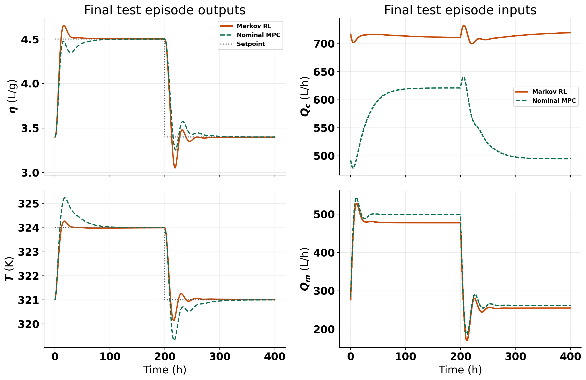

# Polymer Markov Unified Algorithm And Tuning Start

Date: 2026-05-11

This note is the new baseline algorithm document for future polymer Markov tuning runs. The active notebook surface is now [RL_assisted_MPC_markov_unified.ipynb](/c:/Users/HAMEDI/OneDrive%20-%20McMaster%20University/PythonProjects/RL_assisted_MPC/RL_assisted_MPC_markov_unified.ipynb), and the active shared runtime is the Step 3-consolidated Markov path in [markov_runner.py](/c:/Users/HAMEDI/OneDrive%20-%20McMaster%20University/PythonProjects/RL_assisted_MPC/utils/markov_runner.py) plus the shared polymer disturbance contract in [helpers.py](/c:/Users/HAMEDI/OneDrive%20-%20McMaster%20University/PythonProjects/RL_assisted_MPC/utils/helpers.py:305).

## Objective

The method keeps the offset-free polymer MPC structure, but adds a finite-horizon Markov correction layer identified online by least squares and proposed online by TD3. The corrected controller should:

- improve recent plant prediction quality
- preserve nominal MPC as the final fallback
- use the historical polymer disturbance semantics as the default live-step contract

## Plant And Offset-Free Model

The nonlinear polymer plant is the CSTR in `Simulation/system_functions.py`, with controlled outputs:

$$
y_k =
\begin{bmatrix}
\eta_k \\
T_k
\end{bmatrix},
$$

and manipulated inputs:

$$
u_k =
\begin{bmatrix}
Q_{c,k} \\
Q_{m,k}
\end{bmatrix}.
$$

The disturbed polymer live runs also vary plant-side quantities:

$$
d^{\mathrm{plant}}_k =
\begin{bmatrix}
Q_{i,k} \\
Q_{s,k} \\
hA_k
\end{bmatrix}.
$$

The nominal linear augmented model used by the offset-free controller is:

$$
x_{a,k+1} = A_{\mathrm{aug}} x_{a,k} + B_{\mathrm{aug}} \Delta u_k,
$$

$$
y_k = C_{\mathrm{aug}} x_{a,k},
$$

with observer update:

$$
\hat{x}_{a,k+1} = A_{\mathrm{aug}} \hat{x}_{a,k} + B_{\mathrm{aug}} \Delta u_k + L (y_k - \hat{y}_k).
$$

The live notebook uses scaled deviation coordinates around the steady state:

$$ \Delta u_k = u^{\mathrm{scaled}}_k - u^{\mathrm{scaled}}_{\mathrm{ss}}, \qquad \Delta y_k = y^{\mathrm{scaled}}_k - y^{\mathrm{scaled}}_{\mathrm{ss}}. $$

## Markov Correction Model

For prediction horizon $P$ and control horizon $M$, the nominal lifted prediction is:

$$
Y_k = Y^{\mathrm{free}}_k + G_0 \Delta U_k.
$$

The finite-horizon Markov blocks are:

$$
M_i = C_{\mathrm{aug}} A_{\mathrm{aug}}^{\,i-1} B_{\mathrm{aug}},
\qquad i = 1,\dots,P.
$$

The controller parameterizes a corrected block sequence as:

$$
M_i(z_k) = M_{i,0} + \sum_{j=1}^{r} z_{j,k} B^{(j)}_i,
$$

where $B^{(j)}_i$ are basis blocks and $z_k \in \mathbb{R}^r$ is the correction vector. The corrected lifted matrix is:

$$
G(z_k) = \mathrm{Toeplitz}\!\left(M_1(z_k), \dots, M_P(z_k)\right).
$$

The active notebook default uses the `io_pair_gain` basis family, so each $z_j$ scales one output-input Markov channel over the horizon.

## LS Identification And Prediction Score

The online LS candidate is fit over a recent prediction window by minimizing the corrected output error with a quadratic regularizer:

$$ z^{\mathrm{LS}}_k = \arg\min_z \sum_{\tau \in \mathcal{W}_k} \left\| Y^{\mathrm{meas}}_\tau - \left( Y^{\mathrm{free}}_\tau + G(z)\Delta U^{\mathrm{real}}_\tau \right) \right\|_{W_y}^2 + \lambda_z \|z\|_2^2. $$

The main usefulness score is the prediction-improvement score:

$$ S_{\mathrm{pred}}(z_k) = \sum_{\tau \in \mathcal{W}_k} \left( \|W_y E_0(\tau)\|_2^2 - \|W_y E_z(\tau)\|_2^2 \right) - \lambda_z \|z_k\|_2^2. $$

with

$$
E_0(\tau) = Y^{\mathrm{meas}}_\tau - \left(Y^{\mathrm{free}}_\tau + G_0 \Delta U^{\mathrm{real}}_\tau\right),
$$

$$
E_z(\tau) = Y^{\mathrm{meas}}_\tau - \left(Y^{\mathrm{free}}_\tau + G(z_k) \Delta U^{\mathrm{real}}_\tau\right).
$$

The live controller accepts a corrected candidate only if its score clears:

$$
S_{\mathrm{pred}}(z_k) > s_{\mathrm{pred,min}},
$$

and the corrected lifted model also passes a gain-drift guard.

## RL State, RL Action, And Selection Logic

The TD3 state is built from the current observer state, tracking error, innovation, previous input deviation, previous executed correction, LS correction, LS score, and LS gain drift. The TD3 action is a bounded raw action mapped into:

$$
z_k \in [-z_{\max}, z_{\max}]^r.
$$

The executed selection logic is:

1. Compute the nominal MPC move.
2. Compute the LS Markov candidate when enough history is available.
3. Let TD3 request a Markov correction.
4. Execute:

$$
\text{TD3} \rightarrow \text{LS} \rightarrow \text{nominal MPC}.
$$

The default notebook release schedule currently keeps:

- episodes 1-10: LS teacher only
- episode 11 onward: TD3, then LS fallback, then nominal fallback

Nominal MPC remains the final safety fallback whenever the corrected candidate does not pass the score, gain-drift, or feasibility guards.

## Step 3 Disturbance-Stepping Contract

The dominant implementation fix is now part of the algorithm definition.

For polymer disturbed live runs, the disturbance step at time $k$ is applied as plant attributes before the plant state is advanced:

$$
(Q_{i,k}, Q_{s,k}, hA_k) \longrightarrow \text{plant attributes} \longrightarrow \texttt{system.step()}.
$$

This is now the canonical shared contract across polymer disturbed runners. It matters because the Markov LS fit, TD3 replay, and candidate acceptance are all path-dependent. If disturbance timing is changed, the recent prediction window, executed trajectory, and replay distribution all change.

## Current Unified Defaults

The consolidated notebook currently assumes these main defaults:

| Knob | Current default |
| --- | --- |
| `run_mode` | `disturb` |
| `n_tests` | `50` |
| `warm_start` | notebook override `10` |
| `predict_h` | `9` |
| `cont_h` | `3` |
| `basis_family` | `io_pair_gain` |
| `z_bound` | `0.05` |
| `prediction_window` | `20` |
| `lambda_z` | `1.0e-3` |
| `s_pred_min` | `1.0e-6` |
| `gain_drift_max` | `0.10` |
| `nominal_solver_mode` | `lifted_g0_prototype` |
| `rl_fallback_to_ls` | `True` |
| `force_td3_execute` | `False` |
| `rl_store_executed_action_in_replay` | `True` |

## First Tuning Table

| Knob | Expected effect | Main metric to watch |
| --- | --- | --- |
| `warm_start` | Changes how much LS teacher data is injected before TD3 is trusted | action-source fractions, replay push quality |
| `z_bound` | Changes correction authority | gain drift, nominal fallback fraction, input movement |
| `prediction_window` | Changes how local or global the LS fit is | LS score, executed score, first-move difference |
| `lambda_z` | Shrinks aggressive corrections | full-sequence difference, gain drift, reward |
| `s_pred_min` | Tightens or loosens release of corrected candidates | TD3 accepted fraction, nominal fraction |
| `gain_drift_max` | Controls structural deviation from nominal lifted dynamics | gain drift, output RMSE to baseline |
| `nominal_cost_relative_tol` | Changes how conservative the cost guard is | LS fallback fraction, nominal fallback fraction |
| TD3 exploration settings | Changes policy diversity and replay coverage | requested score, executed score, reward trend |

## Immediate Tuning Workflow

Use this document as the starting point for the next iteration:

1. keep the Step 3 disturbance semantics fixed
2. tune release schedule and authority before changing the basis family
3. compare every run with:
   - action-source fractions
   - mean executed `||z||`
   - mean gain drift
   - first-move difference
   - full-sequence difference
   - nominal-cost margin
4. only revisit basis design after release scheduling and score thresholds are stable

## Latest Run Update: 2026-05-11

Latest runs compared in this follow-up:

- latest unified good run: `Polymer/Results/td3_markov_disturb/20260511_120210/`
- earlier unified bad run: `Polymer/Results/td3_markov_disturb/20260510_215724/`
- latest legacy reference: `Polymer/Results/polymer_markov_corrected_mpc/20260510_212956/`

Generated figures:

- `report/figures/polymer_markov_unified_followup_20260511/latest_run_recovery_and_reward.png`
- `report/figures/polymer_markov_unified_followup_20260511/latest_run_action_mix.png`
- `report/figures/polymer_markov_unified_followup_20260511/latest_td3_decline_diagnostics.png`
- `report/figures/polymer_markov_unified_followup_20260511/latest_test_episode_vs_nominal_mpc.png`
- `report/figures/polymer_markov_unified_followup_20260511/summary.json`

### Main result

The newest polymer Markov run is now back in the right performance regime.

Compared with the earlier nominal-like unified run, the latest run recovers the reward almost exactly to the legacy level:

| Metric | Latest unified | Earlier unified bad run | Legacy reference |
| --- | ---: | ---: | ---: |
| Mean episode reward | `-4.0424` | `-4.4345` | `-4.0398` |
| First 10 episodes | `-4.3416` | `-4.3644` | `-4.2737` |
| Last 10 episodes | `-3.8705` | `-4.4541` | `-3.8383` |
| Final episode reward | `-3.8908` | `-4.4647` | `-3.8835` |
| Overall TD3 accepted fraction | `0.3715` | `0.3833` | `0.3143` |
| Overall LS fallback fraction | `0.5686` | `0.3925` | `0.4759` |
| Overall nominal fallback fraction | `0.0108` | `0.0348` | `0.0112` |

So the current run is not behaving like the old broken unified path anymore. In reward space and nominal-fallback fraction it is now essentially at legacy quality.

### What the latest run is actually doing

The latest bundle contains `200` episodes, with:

- warm start through episode `10`
- the LS-target behavioral-cloning window active only over episodes `11` to `16`
- standard post-warm-start release after that: TD3, then LS fallback, then nominal fallback

This means the good reward is not coming from a long hidden BC phase. The BC window is short and only stabilizes the first few live episodes after warm start.

### Final test episode versus nominal MPC

The final episode in the latest run is also a **test** episode, so it gives a clean RL-versus-nominal-MPC comparison without exploration noise.

For that last test episode:

| Metric | Markov RL | Nominal MPC |
| --- | ---: | ---: |
| Average reward | `-3.8908` | `-4.4174` |
| Viscosity RMSE | `0.1830` | `0.1917` |
| Temperature RMSE | `0.4502` | `0.5678` |
| Viscosity IAE | `43.59` | `51.71` |
| Temperature IAE | `104.94` | `212.30` |
| Mean input-move norm | `1.0031` | `1.1915` |

So the latest Markov controller is not only recovering average training-run reward. On the final held-out test episode it also outperforms nominal MPC in both outputs, with the clearest gain appearing in reactor temperature tracking.

### Why TD3 role becomes less and less

The short answer is:

TD3 is losing execution share because the score gate increasingly prefers LS, not because TD3 is hitting the gain-drift or cost guards.

The latest run shows that very clearly.

#### 1. TD3 dominates early after warm start, then LS takes over late

In the latest run:

- episodes `11-50`: TD3 accepted fraction = `0.5804`
- last `50` episodes: TD3 accepted fraction = `0.1745`
- last `50` episodes: LS fallback fraction = `0.7861`
- last `50` episodes: nominal fallback fraction = `0.0394`

So the late controller is still strongly Markov-corrected, but it is increasingly **LS-carried** rather than **TD3-carried**.

#### 2. The requested TD3 score deteriorates while the LS score improves

The prediction-score panel explains the decline:

- requested TD3 score over episodes `11-50`: `+0.00281`
- requested TD3 score over the last `50` episodes: `-0.00241`
- LS score over episodes `11-50`: `+0.03439`
- LS score over the last `50` episodes: `+0.04255`
- executed score over the last `50` episodes: `+0.03326`

So late in training, the TD3 proposal is usually still feasible, but it is no longer prediction-improving enough to beat LS. The gate then accepts LS instead.

#### 3. Gain drift and cost guard are not the cause

Over the last `50` episodes:

- requested TD3 gain drift = `0.04435`
- gain-drift limit = `0.10`
- requested cost-guard pass fraction = `1.00`

So TD3 is not being pushed out because the proposed lifted model is too aggressive or because it violates the nominal-cost screen. The dominant failure mode is the **prediction score**.

#### 4. TD3 does not collapse to zero, but it also does not track the improving LS manifold

Late in the run:

- requested TD3 `||z||` stays around the same order as before
- LS `||z||` becomes smaller
- the mean gap `||z_{\mathrm{TD3}} - z_{\mathrm{LS}}||` over the last `50` episodes is still `0.1194`

That means the actor keeps proposing nontrivial corrections, but those corrections remain materially different from the LS correction that is actually improving prediction. So TD3 does not disappear by shrinking to zero. It disappears by staying off the high-score LS manifold.

#### 5. Replay distribution likely reinforces the LS takeover

The implementation still stores the **executed** action in replay:

$$ a^{\mathrm{replay}}_k = a^{\mathrm{executed}}_k. $$

That matters because in the last `50` episodes, executed actions are:

- `17.45%` TD3 accepted
- `78.61%` LS fallback
- `3.94%` nominal fallback

So the late replay stream is dominated by LS-executed actions. Combined with the short post-warm-start BC window, this gives the actor strong pressure toward safe teacher-like behavior, while the score gate still rejects TD3 proposals that fail to improve prediction enough. In other words, the current loop is good at recovering performance, but it is still not teaching TD3 to own the loop late in training.

### Interpretation

This is still a positive result.

The latest run says the Step 3 semantics, warm start, and short LS-target BC window did recover the useful Markov regime. But the run also says the current training contract is selecting a strong **LS-assisted controller**, not a steadily improving autonomous TD3 policy.

So the answer to "why is TD3 becoming less and less?" is:

1. LS prediction quality improves across the run.
2. TD3 proposals remain feasible but become prediction-score-weak relative to LS.
3. The gate therefore routes more execution to LS.
4. Because replay stores executed actions, the late buffer becomes increasingly LS-dominated.

### Best next experiment for this issue

If the goal is to make TD3 keep or grow its role late in training, the cleanest next A/B is:

1. keep the Step 3 disturbance semantics, warm start, BC window, and all guards fixed
2. compare `rl_store_executed_action_in_replay = True` versus `False`
3. track:
   - TD3 accepted fraction by episode
   - requested TD3 score by episode
   - LS score by episode
   - `||z_{\mathrm{TD3}} - z_{\mathrm{LS}}||` by episode
   - average reward

Expected interpretation:

- if TD3 role stays higher when replay stores requested actions, then late LS-dominated replay is a major cause
- if TD3 role still collapses, then the next suspect is the actor objective itself rather than the replay contract

This is the highest-signal next experiment because the current figures already show that the late decline is **not** mainly a gain-drift or cost-guard problem.

## Replay A/B Update: 2026-05-11

The replay-storage A/B has now been run with all other conditions held fixed:

- executed-action replay: `Polymer/Results/td3_markov_disturb/20260511_140736/`
- requested-action replay: `Polymer/Results/td3_markov_disturb/20260511_153101/`

Generated figures:

- `report/figures/polymer_markov_replay_storage_ab_20260511/replay_storage_ab_metrics.png`
- `report/figures/polymer_markov_replay_storage_ab_20260511/replay_storage_ab_action_mix.png`
- `report/figures/polymer_markov_replay_storage_ab_20260511/replay_storage_ab_state_saturation_diagnostics.png`
- `report/figures/polymer_markov_replay_storage_ab_20260511/summary.json`

### Replay A/B result

The replay hypothesis did **not** explain the TD3 decline.

Requested-action replay made TD3 acceptance worse:

| Metric | Executed replay | Requested replay |
| --- | ---: | ---: |
| Mean episode reward | `-4.0424` | `-4.0591` |
| Last 10 episode reward | `-3.8705` | `-3.8774` |
| TD3 fraction, episodes `11-50` | `0.5804` | `0.3132` |
| TD3 fraction, last `50` episodes | `0.1745` | `0.0924` |
| Requested TD3 score, episodes `11-50` | `+0.00281` | `-0.00289` |
| Requested TD3 score, last `50` episodes | `-0.00241` | `-0.02253` |
| LS score, last `50` episodes | `+0.04255` | `+0.04192` |
| `||z_{\mathrm{TD3}} - z_{\mathrm{LS}}||`, last `50` episodes | `0.1194` | `0.1390` |

So the replay buffer was not the main bottleneck. Storing requested actions actually pushed the actor **farther** away from the useful LS manifold.

### What the replay A/B implies

The stronger explanation is now a **Markov state-conditioning and action-saturation problem**, not a replay-storage problem.

Two diagnostics point to that:

1. The current Markov state was using raw concatenated features, while the matrix and residual runners already use the shared mismatch-state conditioner.
2. In both replay variants, the TD3 raw action is near saturation on almost every step:
   - executed replay: `99.29%` of all steps have `\max |a_{\mathrm{raw}}| \ge 0.95`
   - requested replay: `99.30%` of all steps have `\max |a_{\mathrm{raw}}| \ge 0.95`
3. Both TD3 and LS proposals are effectively at the authority boundary:
   - executed replay, last `50` episodes: mean `\max |z_{\mathrm{TD3}}| = 0.04999`, mean `\max |z_{\mathrm{LS}}| = 0.04561`
   - requested replay, last `50` episodes: mean `\max |z_{\mathrm{TD3}}| = 0.04998`, mean `\max |z_{\mathrm{LS}}| = 0.04563`
4. The raw Markov state is badly imbalanced numerically. Its per-dimension standard deviations span about `470x` between the 90th and 10th percentiles in both runs, so the large raw plant-state coordinates dominate the small `z` and score features.

This means the actor was being trained on a numerically imbalanced state and on LS targets that were already almost always at the action boundary. That is a much stronger explanation for the late TD3 collapse than the replay-storage contract.

### Next fix

The next fix is therefore **not** another replay change.

It is to move polymer Markov onto the same conditioned mismatch-state path already used by the matrix and residual methods, while keeping the current replay setting as executed-action replay. That fix is now the highest-signal next run because it addresses the clearest implementation inconsistency exposed by the replay A/B.

If TD3 still loses authority after that fix, the next suspect is the **action-range geometry itself**, not replay. In that case the clean next A/B would be to keep the new conditioned state fixed and test a slightly wider `z_bound` or a less saturating action-to-`z` mapping, because the current runs show that both TD3 and LS are almost always living at `|z| \approx 0.05`.

## Conditioned-State Update: 2026-05-11 Evening

The newest polymer Markov run is now:

- conditioned-state run: `Polymer/Results/td3_markov_disturb/20260511_171749/`

This run is the first one after moving Markov onto the same shared mismatch-state conditioning path used by the matrix and residual workflows. The saved bundle confirms that the fix is active:

- `markov_state_mode = "mismatch_conditioned"`
- RL state dimension increased from `25` to `27`
- `markov_base_state_norm_stats` is present in the result bundle

Generated figures:

- `report/figures/polymer_markov_conditioned_followup_20260511/conditioned_run_reward_and_td3_mix.png`
- `report/figures/polymer_markov_conditioned_followup_20260511/conditioned_run_geometry_and_scores.png`
- `report/figures/polymer_markov_conditioned_followup_20260511/summary.json`

### What improved

The conditioning fix clearly improved the RL geometry:

| Metric | Latest conditioned run | Previous executed replay run |
| --- | ---: | ---: |
| Mean episode reward | `-4.0329` | `-4.0424` |
| Last 10 episode reward | `-3.8576` | `-3.8705` |
| Raw-action saturation, all steps | `0.8307` | `0.9929` |
| Raw-action saturation, last `50` episodes | `0.8720` | `0.9991` |
| RL-state std. spread (`p90/p10`) | `33.16x` | `470.32x` |
| `||z_{\mathrm{TD3}} - z_{\mathrm{LS}}||`, last `50` episodes | `0.1120` | `0.1194` |

So the conditioning change did help the controller numerically:

1. reward improved slightly
2. raw actor saturation dropped a lot
3. the RL state is no longer dominated by a few huge coordinates

### Why TD3 still becomes less active late

Even after the state fix, the late TD3 decline is still mainly a **score-competition problem**.

In the newest run:

- TD3 accepted fraction, episodes `11-50`: `0.4051`
- TD3 accepted fraction, last `50` episodes: `0.1862`
- LS fallback fraction, last `50` episodes: `0.7781`
- nominal fallback fraction, last `50` episodes: `0.0357`

The critical comparison is still the score gate:

- requested TD3 score, episodes `11-50`: `+0.00431`
- requested TD3 score, last `50` episodes: `-0.00627`
- LS score, last `50` episodes: `+0.04230`
- executed score, last `50` episodes: `+0.03326`

So the state fix made the actor healthier, but it did **not** make TD3 outperform LS on the prediction score that decides execution.

### Why this is not a guard problem

The late TD3 decline is still not caused by gain-drift or cost-guard rejection:

- requested TD3 gain drift, last `50` episodes: `0.04152`
- gain-drift limit: `0.10`
- requested TD3 cost-guard pass fraction, last `50` episodes: `1.00`

So TD3 is still usually feasible. It is just not prediction-improving enough relative to LS.

### What remains wrong

The remaining issue is that TD3 still proposes corrections that are too far from the improving LS manifold while staying close to the authority edge:

- mean `\max |z_{\mathrm{TD3}}|`, last `50` episodes: `0.04847`
- mean `\max |z_{\mathrm{LS}}|`, last `50` episodes: `0.04567`
- mean `||z_{\mathrm{TD3}} - z_{\mathrm{LS}}||`, last `50` episodes: `0.1120`

This matters because the state-conditioning fix removed the clearest state-geometry bug, but TD3 still spends most late episodes requesting nearly boundary-level corrections that do not beat LS on score. That points much more strongly to the **action-range geometry and actor objective** than to replay or state scaling.

### Updated interpretation

The evidence now supports the following sequence:

1. Step-3 disturbance parity and warm-start logic recovered the good Markov regime.
2. Replay storage was not the main reason TD3 lost share.
3. Raw-state conditioning was a real issue, and fixing it improved reward and reduced saturation.
4. TD3 still loses late because LS remains much better on the execution score while TD3 keeps proposing near-boundary corrections that are not aligned tightly enough with the LS manifold.

### Best next experiment after the state fix

The next highest-signal A/B is now:

1. keep the conditioned-state path, warm start, BC window, replay mode, and all guards fixed
2. vary only the action-range geometry:
   - for example `z_bound = 0.05` versus `0.08`
3. track:
   - TD3 accepted fraction by episode
   - requested TD3 score by episode
   - LS score by episode
   - raw-action saturation by episode
   - `\max |z_{\mathrm{TD3}}|` and `\max |z_{\mathrm{LS}}|`
   - `||z_{\mathrm{TD3}} - z_{\mathrm{LS}}||`
   - average reward

Expected interpretation:

- if TD3 share rises with a slightly wider action range, then the remaining bottleneck is mainly authority saturation
- if TD3 share still collapses, then the next suspect is the actor objective itself rather than the state or replay contract

## z-Bound A/B Update: 2026-05-11 Night

The next action-range experiment has now been run:

- conditioned `z = 0.05` reference: `Polymer/Results/td3_markov_disturb/20260511_171749/`
- widened `z = 0.08` run: `Polymer/Results/td3_markov_disturb_zbound_008/20260511_213647/`

Generated figures:

- `report/figures/polymer_markov_zbound_ab_20260511/zbound_ab_metrics.png`
- `report/figures/polymer_markov_zbound_ab_20260511/zbound_ab_geometry.png`
- `report/figures/polymer_markov_zbound_ab_20260511/summary.json`

### Short answer: this was not what we wanted

If the target was **more late TD3 ownership**, then widening the action range to `z = 0.08` did **not** succeed.

It produced a small reward improvement:

- mean reward: `-4.0158` vs `-4.0329`

But it made the late TD3-role problem worse:

- TD3 fraction, episodes `11-50`: `0.3840` vs `0.4051`
- TD3 fraction, last `50`: `0.1450` vs `0.1862`
- LS fraction, last `50`: `0.8124` vs `0.7781`
- nominal fraction, last `50`: `0.0426` vs `0.0357`

So the larger authority range did not help TD3 own the loop. It shifted even more late execution toward LS.

### What improved

There is one real positive:

- early requested TD3 score improved a bit with the larger range:
  - `z = 0.05`: `+0.00431`
  - `z = 0.08`: `+0.00634`

This is consistent with the idea that the old `z = 0.05` range was somewhat restrictive early in training.

### What got worse

Late in training, the larger range amplifies the same gap we were already worried about:

- requested TD3 score, last `50`:
  - `z = 0.05`: `-0.00627`
  - `z = 0.08`: `-0.00943`
- LS score, last `50`:
  - `z = 0.05`: `+0.04230`
  - `z = 0.08`: `+0.06693`
- mean `||z_{\mathrm{TD3}} - z_{\mathrm{LS}}||`, last `50`:
  - `z = 0.05`: `0.1120`
  - `z = 0.08`: `0.1904`

So the widened range gave LS an even stronger useful-correction manifold, but TD3 did not stay close enough to it. The gate then preferred LS even more often.

### Saturation and geometry interpretation

The larger range did not remove late saturation pressure. In fact, the tail became more boundary-seeking again:

- raw-action saturation, last `50`:
  - `z = 0.05`: `0.8720`
  - `z = 0.08`: `0.9951`
- mean `max |z_{\mathrm{TD3}}|`, last `50`:
  - `z = 0.05`: `0.04847`
  - `z = 0.08`: `0.07989`
- mean `max |z_{\mathrm{LS}}|`, last `50`:
  - `z = 0.05`: `0.04567`
  - `z = 0.08`: `0.06844`

This is important. The `z = 0.08` experiment did **not** reveal a hidden TD3 regime that was waiting for a slightly larger action range. It mostly let both TD3 and LS request bigger corrections, and LS benefited more from that increased authority.

### Final test episode

The final test episode remains much better than nominal MPC in both cases, but `z = 0.08` does not clearly improve it relative to the conditioned `z = 0.05` run:

| Metric | `z = 0.05` | `z = 0.08` | Nominal MPC |
| --- | ---: | ---: | ---: |
| Final episode reward | `-3.8741` | `-3.8837` | `-4.4174` |
| Viscosity RMSE | `0.1825` | `0.1827` | reference |
| Temperature RMSE | `0.4485` | `0.4495` | reference |
| Mean input-move norm | `1.0075` | `1.0011` | reference |

So the larger range does not buy a meaningful final-test-episode tracking win either. It is basically neutral there.

### Updated conclusion

This A/B says something useful and fairly decisive:

1. the remaining bottleneck is **not mainly** that `z = 0.05` was too small
2. widening the range slightly improves mean reward but worsens late TD3 ownership
3. the main problem is now more likely the **actor objective / target alignment** than the state contract, replay contract, or authority range alone

So the `z = 0.08` run is **not** the result we wanted if the goal was to make TD3 keep or grow its role late in training.

### Best next step after the z-bound test

Because the replay contract, state conditioning, and action-range A/B have all now been tested, the next highest-signal change should target the actor objective directly.

The cleanest next idea is:

1. keep `z = 0.05` or the current safer range
2. keep the conditioned state and executed replay
3. modify training so TD3 is penalized more explicitly for drifting away from the accepted LS manifold after the BC window ends

The `z = 0.08` result is exactly the evidence for that pivot: more authority alone helps LS more than it helps TD3.

## LS Tail-Anchor Follow-Up: 2026-05-11 Late Night

The latest polymer Markov run is now:

- latest tail-anchor run: `Polymer/Results/td3_markov_disturb_zbound_008/20260511_230422/`

Important context:

- this run still uses `z = 0.08`
- it keeps the conditioned-state path and executed replay
- it adds the new weak LS tail anchor after the original short BC window

Generated figures:

- `report/figures/polymer_markov_tail_anchor_followup_20260511/tail_anchor_reward_and_td3_mix.png`
- `report/figures/polymer_markov_tail_anchor_followup_20260511/tail_anchor_diagnostics.png`
- `report/figures/polymer_markov_tail_anchor_followup_20260511/tail_anchor_final_test_episode_vs_nominal_mpc.png`
- `report/figures/polymer_markov_tail_anchor_followup_20260511/summary.json`

### What improved

Relative to the previous `z = 0.08` run without the tail anchor, the late TD3 role recovered in exactly the direction we wanted:

| Metric | Previous `z = 0.08` | Latest `z = 0.08` + tail anchor |
| --- | ---: | ---: |
| TD3 fraction, episodes `11-50` | `0.3840` | `0.4076` |
| TD3 fraction, last `50` | `0.1450` | `0.1860` |
| LS fraction, last `50` | `0.8124` | `0.7763` |
| nominal fraction, last `50` | `0.0426` | `0.0377` |
| requested TD3 score, last `50` | `-0.00943` | `+0.00516` |
| `||z_{\mathrm{TD3}} - z_{\mathrm{LS}}||`, last `50` | `0.1904` | `0.1763` |
| raw-action saturation, last `50` | `0.9951` | `0.9666` |

This is the first strong evidence that the remaining late-TD3 problem really was an **actor-alignment problem** rather than only a replay or state-conditioning problem. The new tail anchor materially improves the late requested TD3 score and restores TD3 execution share almost exactly back to the conditioned `z = 0.05` baseline.

### What did not improve

The tail anchor did **not** improve reward relative to the previous `z = 0.08` run:

| Metric | Previous `z = 0.08` | Latest `z = 0.08` + tail anchor | Conditioned `z = 0.05` |
| --- | ---: | ---: | ---: |
| Mean reward | `-4.0158` | `-4.0318` | `-4.0329` |
| Last `10` rewards | `-3.8665` | `-3.8903` | `-3.8576` |
| Final reward | `-3.8837` | `-3.9125` | `-3.8741` |

So the tail anchor helps TD3 keep its role, but it does not produce a better reward trajectory in this `z = 0.08` configuration. In reward space, the latest run is basically back to the conditioned `z = 0.05` level rather than beating it.

### The main issue now

The new anchor is supposed to be weak and selective, but the diagnostics show that it is active on almost the entire late run:

- BC / tail-anchor active over all steps: `0.9387`
- BC / tail-anchor active over the last `50` episodes: `0.9608`
- mean BC weight over the last `50` episodes: `0.0288`

That means the new mechanism is doing something useful, but it is not really acting like a rare trust-region correction. In practice, it is almost a persistent LS-guidance term after the main window ends.

This happens because the trigger condition is still easy to satisfy:

1. LS is available on most late steps
2. the LS score is still usually higher than the TD3 requested score
3. the TD3 action is still often more than the tolerance away from the LS target

So the latest result says:

1. the **idea** of a post-window LS anchor is correct
2. the **current trigger** is too broad

### Final test episode

The latest tail-anchor run still clearly beats nominal MPC on the final test episode:

| Metric | Latest `z = 0.08` + tail anchor | Nominal MPC |
| --- | ---: | ---: |
| Final episode reward | `-3.9125` | `-4.4174` |
| Viscosity RMSE | `0.1834` | `0.1917` |
| Temperature RMSE | `0.4520` | `0.5678` |
| Viscosity IAE | `43.65` | `51.71` |
| Temperature IAE | `104.20` | `212.30` |
| Mean input-move norm | `0.9950` | `1.1915` |

So the controller remains meaningfully better than nominal MPC on the held-out test episode. The issue is not loss of basic control quality. The issue is that the new alignment mechanism is probably helping too often rather than only when TD3 truly needs the LS manifold.

### Updated interpretation

The newest run gives a fairly clean causal picture:

1. the tail-anchor concept is valid
2. it does improve TD3 late acceptance and requested score
3. but in the current `z = 0.08` run it behaves almost like a persistent LS regularizer
4. that is probably why TD3 share improves without producing a reward gain

### Best next experiment from here

The next highest-signal experiment is no longer “does LS anchoring help?” because this run already answered that.

The next experiment should be:

1. move back to the safer `z = 0.05`
2. keep conditioned state and executed replay fixed
3. keep the tail-anchor idea, but tighten the trigger so it is not active almost all the time

The cleanest trigger refinement is:

- require LS target availability
- require TD3 score deficit relative to LS
- also require **negative** requested TD3 score
- optionally require that TD3 was not the executed action on that step

The latest run says the actor-alignment direction is correct. The remaining job is to make the LS tail anchor truly **conditional** rather than effectively permanent.

## Files Used

- [RL_assisted_MPC_markov_unified.ipynb](/c:/Users/HAMEDI/OneDrive%20-%20McMaster%20University/PythonProjects/RL_assisted_MPC/RL_assisted_MPC_markov_unified.ipynb)
- [markov_runner.py](/c:/Users/HAMEDI/OneDrive%20-%20McMaster%20University/PythonProjects/RL_assisted_MPC/utils/markov_runner.py)
- [helpers.py](/c:/Users/HAMEDI/OneDrive%20-%20McMaster%20University/PythonProjects/RL_assisted_MPC/utils/helpers.py)
- [notebook_params.py](/c:/Users/HAMEDI/OneDrive%20-%20McMaster%20University/PythonProjects/RL_assisted_MPC/systems/polymer/notebook_params.py)
- [analyze_polymer_markov_unified_followup_20260511.py](/c:/Users/HAMEDI/OneDrive%20-%20McMaster%20University/PythonProjects/RL_assisted_MPC/report/scripts/analyze_polymer_markov_unified_followup_20260511.py)
- [analyze_polymer_markov_replay_storage_ab.py](/c:/Users/HAMEDI/OneDrive%20-%20McMaster%20University/PythonProjects/RL_assisted_MPC/report/scripts/analyze_polymer_markov_replay_storage_ab.py)
- [analyze_polymer_markov_conditioned_followup_20260511.py](/c:/Users/HAMEDI/OneDrive%20-%20McMaster%20University/PythonProjects/RL_assisted_MPC/report/scripts/analyze_polymer_markov_conditioned_followup_20260511.py)
- [analyze_polymer_markov_zbound_ab.py](/c:/Users/HAMEDI/OneDrive%20-%20McMaster%20University/PythonProjects/RL_assisted_MPC/report/scripts/analyze_polymer_markov_zbound_ab.py)
- [analyze_polymer_markov_tail_anchor_followup_20260511.py](/c:/Users/HAMEDI/OneDrive%20-%20McMaster%20University/PythonProjects/RL_assisted_MPC/report/scripts/analyze_polymer_markov_tail_anchor_followup_20260511.py)
