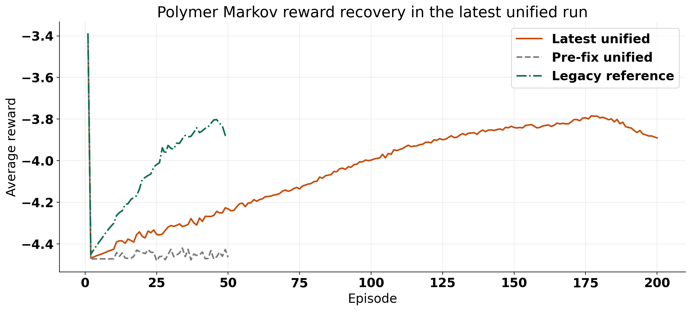
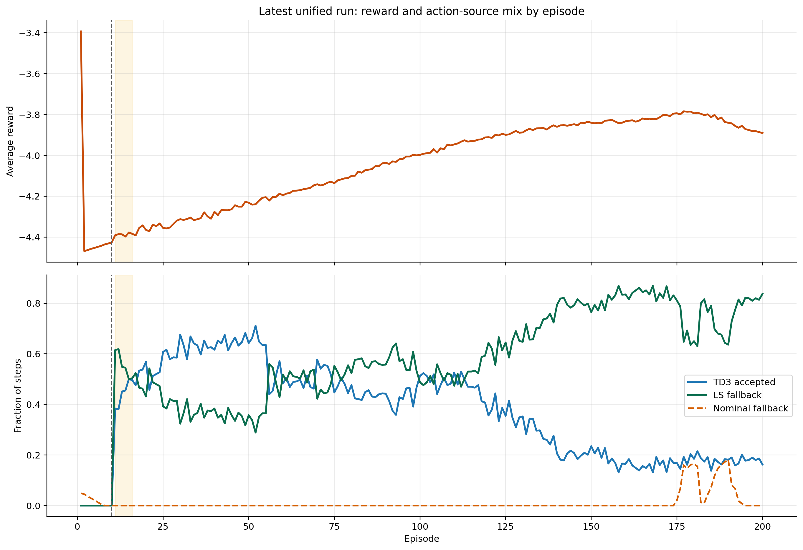
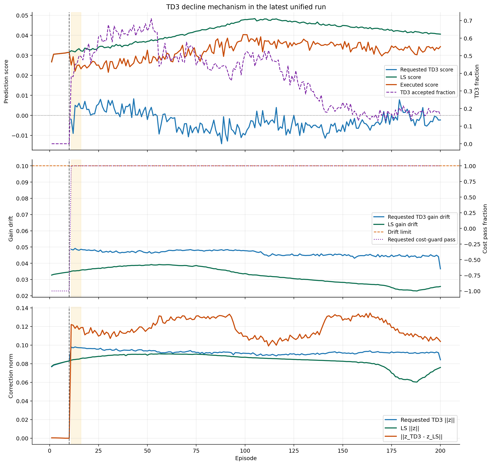

# Polymer Markov Unified Algorithm And Tuning Start

Date: 2026-05-11

This note is the new baseline algorithm document for future polymer Markov tuning runs. The active notebook surface is now [RL_assisted_MPC_markov_unified.ipynb](/c:/Users/HAMEDI/OneDrive%20-%20McMaster%20University/PythonProjects/RL_assisted_MPC/RL_assisted_MPC_markov_unified.ipynb), and the active shared runtime is the Step 3-consolidated Markov path in [markov_runner.py](/c:/Users/HAMEDI/OneDrive%20-%20McMaster%20University/PythonProjects/RL_assisted_MPC/utils/markov_runner.py) plus the shared polymer disturbance contract in [helpers.py](/c:/Users/HAMEDI/OneDrive%20-%20McMaster%20University/PythonProjects/RL_assisted_MPC/utils/helpers.py:305).

## Objective

The method keeps the offset-free polymer MPC structure, but adds a finite-horizon Markov correction layer identified online by least squares and proposed online by TD3. The corrected controller should:

- improve recent plant prediction quality
- preserve nominal MPC as the final fallback
- use the historical polymer disturbance semantics as the default live-step contract

## Plant And Offset-Free Model

The nonlinear polymer plant is the CSTR in `Simulation/system_functions.py`, with controlled outputs:

$$
y_k =
\begin{bmatrix}
\eta_k \\
T_k
\end{bmatrix},
$$

and manipulated inputs:

$$
u_k =
\begin{bmatrix}
Q_{c,k} \\
Q_{m,k}
\end{bmatrix}.
$$

The disturbed polymer live runs also vary plant-side quantities:

$$
d^{\mathrm{plant}}_k =
\begin{bmatrix}
Q_{i,k} \\
Q_{s,k} \\
hA_k
\end{bmatrix}.
$$

The nominal linear augmented model used by the offset-free controller is:

$$
x_{a,k+1} = A_{\mathrm{aug}} x_{a,k} + B_{\mathrm{aug}} \Delta u_k,
$$

$$
y_k = C_{\mathrm{aug}} x_{a,k},
$$

with observer update:

$$
\hat{x}_{a,k+1} = A_{\mathrm{aug}} \hat{x}_{a,k} + B_{\mathrm{aug}} \Delta u_k + L (y_k - \hat{y}_k).
$$

The live notebook uses scaled deviation coordinates around the steady state:

$$ \Delta u_k = u^{\mathrm{scaled}}_k - u^{\mathrm{scaled}}_{\mathrm{ss}}, \qquad \Delta y_k = y^{\mathrm{scaled}}_k - y^{\mathrm{scaled}}_{\mathrm{ss}}. $$

## Markov Correction Model

For prediction horizon $P$ and control horizon $M$, the nominal lifted prediction is:

$$
Y_k = Y^{\mathrm{free}}_k + G_0 \Delta U_k.
$$

The finite-horizon Markov blocks are:

$$
M_i = C_{\mathrm{aug}} A_{\mathrm{aug}}^{\,i-1} B_{\mathrm{aug}},
\qquad i = 1,\dots,P.
$$

The controller parameterizes a corrected block sequence as:

$$
M_i(z_k) = M_{i,0} + \sum_{j=1}^{r} z_{j,k} B^{(j)}_i,
$$

where $B^{(j)}_i$ are basis blocks and $z_k \in \mathbb{R}^r$ is the correction vector. The corrected lifted matrix is:

$$
G(z_k) = \mathrm{Toeplitz}\!\left(M_1(z_k), \dots, M_P(z_k)\right).
$$

The active notebook default uses the `io_pair_gain` basis family, so each $z_j$ scales one output-input Markov channel over the horizon.

## LS Identification And Prediction Score

The online LS candidate is fit over a recent prediction window by minimizing the corrected output error with a quadratic regularizer:

$$ z^{\mathrm{LS}}_k = \arg\min_z \sum_{\tau \in \mathcal{W}_k} \left\| Y^{\mathrm{meas}}_\tau - \left( Y^{\mathrm{free}}_\tau + G(z)\Delta U^{\mathrm{real}}_\tau \right) \right\|_{W_y}^2 + \lambda_z \|z\|_2^2. $$

The main usefulness score is the prediction-improvement score:

$$ S_{\mathrm{pred}}(z_k) = \sum_{\tau \in \mathcal{W}_k} \left( \|W_y E_0(\tau)\|_2^2 - \|W_y E_z(\tau)\|_2^2 \right) - \lambda_z \|z_k\|_2^2. $$

with

$$
E_0(\tau) = Y^{\mathrm{meas}}_\tau - \left(Y^{\mathrm{free}}_\tau + G_0 \Delta U^{\mathrm{real}}_\tau\right),
$$

$$
E_z(\tau) = Y^{\mathrm{meas}}_\tau - \left(Y^{\mathrm{free}}_\tau + G(z_k) \Delta U^{\mathrm{real}}_\tau\right).
$$

The live controller accepts a corrected candidate only if its score clears:

$$
S_{\mathrm{pred}}(z_k) > s_{\mathrm{pred,min}},
$$

and the corrected lifted model also passes a gain-drift guard.

## RL State, RL Action, And Selection Logic

The TD3 state is built from the current observer state, tracking error, innovation, previous input deviation, previous executed correction, LS correction, LS score, and LS gain drift. The TD3 action is a bounded raw action mapped into:

$$
z_k \in [-z_{\max}, z_{\max}]^r.
$$

The executed selection logic is:

1. Compute the nominal MPC move.
2. Compute the LS Markov candidate when enough history is available.
3. Let TD3 request a Markov correction.
4. Execute:

$$
\text{TD3} \rightarrow \text{LS} \rightarrow \text{nominal MPC}.
$$

The default notebook release schedule currently keeps:

- episodes 1-10: LS teacher only
- episode 11 onward: TD3, then LS fallback, then nominal fallback

Nominal MPC remains the final safety fallback whenever the corrected candidate does not pass the score, gain-drift, or feasibility guards.

## Step 3 Disturbance-Stepping Contract

The dominant implementation fix is now part of the algorithm definition.

For polymer disturbed live runs, the disturbance step at time $k$ is applied as plant attributes before the plant state is advanced:

$$
(Q_{i,k}, Q_{s,k}, hA_k) \longrightarrow \text{plant attributes} \longrightarrow \texttt{system.step()}.
$$

This is now the canonical shared contract across polymer disturbed runners. It matters because the Markov LS fit, TD3 replay, and candidate acceptance are all path-dependent. If disturbance timing is changed, the recent prediction window, executed trajectory, and replay distribution all change.

## Current Unified Defaults

The consolidated notebook currently assumes these main defaults:

| Knob | Current default |
| --- | --- |
| `run_mode` | `disturb` |
| `n_tests` | `50` |
| `warm_start` | notebook override `10` |
| `predict_h` | `9` |
| `cont_h` | `3` |
| `basis_family` | `io_pair_gain` |
| `z_bound` | `0.05` |
| `prediction_window` | `20` |
| `lambda_z` | `1.0e-3` |
| `s_pred_min` | `1.0e-6` |
| `gain_drift_max` | `0.10` |
| `nominal_solver_mode` | `lifted_g0_prototype` |
| `rl_fallback_to_ls` | `True` |
| `force_td3_execute` | `False` |
| `rl_store_executed_action_in_replay` | `True` |

## First Tuning Table

| Knob | Expected effect | Main metric to watch |
| --- | --- | --- |
| `warm_start` | Changes how much LS teacher data is injected before TD3 is trusted | action-source fractions, replay push quality |
| `z_bound` | Changes correction authority | gain drift, nominal fallback fraction, input movement |
| `prediction_window` | Changes how local or global the LS fit is | LS score, executed score, first-move difference |
| `lambda_z` | Shrinks aggressive corrections | full-sequence difference, gain drift, reward |
| `s_pred_min` | Tightens or loosens release of corrected candidates | TD3 accepted fraction, nominal fraction |
| `gain_drift_max` | Controls structural deviation from nominal lifted dynamics | gain drift, output RMSE to baseline |
| `nominal_cost_relative_tol` | Changes how conservative the cost guard is | LS fallback fraction, nominal fallback fraction |
| TD3 exploration settings | Changes policy diversity and replay coverage | requested score, executed score, reward trend |

## Immediate Tuning Workflow

Use this document as the starting point for the next iteration:

1. keep the Step 3 disturbance semantics fixed
2. tune release schedule and authority before changing the basis family
3. compare every run with:
   - action-source fractions
   - mean executed `||z||`
   - mean gain drift
   - first-move difference
   - full-sequence difference
   - nominal-cost margin
4. only revisit basis design after release scheduling and score thresholds are stable

## Latest Run Update: 2026-05-11

Latest runs compared in this follow-up:

- latest unified good run: `Polymer/Results/td3_markov_disturb/20260511_120210/`
- earlier unified bad run: `Polymer/Results/td3_markov_disturb/20260510_215724/`
- latest legacy reference: `Polymer/Results/polymer_markov_corrected_mpc/20260510_212956/`

Generated figures:

- `report/figures/polymer_markov_unified_followup_20260511/latest_run_recovery_and_reward.png`
- `report/figures/polymer_markov_unified_followup_20260511/latest_run_action_mix.png`
- `report/figures/polymer_markov_unified_followup_20260511/latest_td3_decline_diagnostics.png`
- `report/figures/polymer_markov_unified_followup_20260511/summary.json`

### Main result

The newest polymer Markov run is now back in the right performance regime.

Compared with the earlier nominal-like unified run, the latest run recovers the reward almost exactly to the legacy level:

| Metric | Latest unified | Earlier unified bad run | Legacy reference |
| --- | ---: | ---: | ---: |
| Mean episode reward | `-4.0424` | `-4.4345` | `-4.0398` |
| First 10 episodes | `-4.3416` | `-4.3644` | `-4.2737` |
| Last 10 episodes | `-3.8705` | `-4.4541` | `-3.8383` |
| Final episode reward | `-3.8908` | `-4.4647` | `-3.8835` |
| Overall TD3 accepted fraction | `0.3715` | `0.3833` | `0.3143` |
| Overall LS fallback fraction | `0.5686` | `0.3925` | `0.4759` |
| Overall nominal fallback fraction | `0.0108` | `0.0348` | `0.0112` |

So the current run is not behaving like the old broken unified path anymore. In reward space and nominal-fallback fraction it is now essentially at legacy quality.

### What the latest run is actually doing

The latest bundle contains `200` episodes, with:

- warm start through episode `10`
- the LS-target behavioral-cloning window active only over episodes `11` to `16`
- standard post-warm-start release after that: TD3, then LS fallback, then nominal fallback

This means the good reward is not coming from a long hidden BC phase. The BC window is short and only stabilizes the first few live episodes after warm start.

### Why TD3 role becomes less and less

The short answer is:

TD3 is losing execution share because the score gate increasingly prefers LS, not because TD3 is hitting the gain-drift or cost guards.

The latest run shows that very clearly.

#### 1. TD3 dominates early after warm start, then LS takes over late

In the latest run:

- episodes `11-50`: TD3 accepted fraction = `0.5804`
- last `50` episodes: TD3 accepted fraction = `0.1745`
- last `50` episodes: LS fallback fraction = `0.7861`
- last `50` episodes: nominal fallback fraction = `0.0394`

So the late controller is still strongly Markov-corrected, but it is increasingly **LS-carried** rather than **TD3-carried**.

#### 2. The requested TD3 score deteriorates while the LS score improves

The prediction-score panel explains the decline:

- requested TD3 score over episodes `11-50`: `+0.00281`
- requested TD3 score over the last `50` episodes: `-0.00241`
- LS score over episodes `11-50`: `+0.03439`
- LS score over the last `50` episodes: `+0.04255`
- executed score over the last `50` episodes: `+0.03326`

So late in training, the TD3 proposal is usually still feasible, but it is no longer prediction-improving enough to beat LS. The gate then accepts LS instead.

#### 3. Gain drift and cost guard are not the cause

Over the last `50` episodes:

- requested TD3 gain drift = `0.04435`
- gain-drift limit = `0.10`
- requested cost-guard pass fraction = `1.00`

So TD3 is not being pushed out because the proposed lifted model is too aggressive or because it violates the nominal-cost screen. The dominant failure mode is the **prediction score**.

#### 4. TD3 does not collapse to zero, but it also does not track the improving LS manifold

Late in the run:

- requested TD3 `||z||` stays around the same order as before
- LS `||z||` becomes smaller
- the mean gap `||z_{\mathrm{TD3}} - z_{\mathrm{LS}}||` over the last `50` episodes is still `0.1194`

That means the actor keeps proposing nontrivial corrections, but those corrections remain materially different from the LS correction that is actually improving prediction. So TD3 does not disappear by shrinking to zero. It disappears by staying off the high-score LS manifold.

#### 5. Replay distribution likely reinforces the LS takeover

The implementation still stores the **executed** action in replay:

$$ a^{\mathrm{replay}}_k = a^{\mathrm{executed}}_k. $$

That matters because in the last `50` episodes, executed actions are:

- `17.45%` TD3 accepted
- `78.61%` LS fallback
- `3.94%` nominal fallback

So the late replay stream is dominated by LS-executed actions. Combined with the short post-warm-start BC window, this gives the actor strong pressure toward safe teacher-like behavior, while the score gate still rejects TD3 proposals that fail to improve prediction enough. In other words, the current loop is good at recovering performance, but it is still not teaching TD3 to own the loop late in training.

### Interpretation

This is still a positive result.

The latest run says the Step 3 semantics, warm start, and short LS-target BC window did recover the useful Markov regime. But the run also says the current training contract is selecting a strong **LS-assisted controller**, not a steadily improving autonomous TD3 policy.

So the answer to "why is TD3 becoming less and less?" is:

1. LS prediction quality improves across the run.
2. TD3 proposals remain feasible but become prediction-score-weak relative to LS.
3. The gate therefore routes more execution to LS.
4. Because replay stores executed actions, the late buffer becomes increasingly LS-dominated.

### Best next experiment for this issue

If the goal is to make TD3 keep or grow its role late in training, the cleanest next A/B is:

1. keep the Step 3 disturbance semantics, warm start, BC window, and all guards fixed
2. compare `rl_store_executed_action_in_replay = True` versus `False`
3. track:
   - TD3 accepted fraction by episode
   - requested TD3 score by episode
   - LS score by episode
   - `||z_{\mathrm{TD3}} - z_{\mathrm{LS}}||` by episode
   - average reward

Expected interpretation:

- if TD3 role stays higher when replay stores requested actions, then late LS-dominated replay is a major cause
- if TD3 role still collapses, then the next suspect is the actor objective itself rather than the replay contract

This is the highest-signal next experiment because the current figures already show that the late decline is **not** mainly a gain-drift or cost-guard problem.

## Files Used

- [RL_assisted_MPC_markov_unified.ipynb](/c:/Users/HAMEDI/OneDrive%20-%20McMaster%20University/PythonProjects/RL_assisted_MPC/RL_assisted_MPC_markov_unified.ipynb)
- [markov_runner.py](/c:/Users/HAMEDI/OneDrive%20-%20McMaster%20University/PythonProjects/RL_assisted_MPC/utils/markov_runner.py)
- [helpers.py](/c:/Users/HAMEDI/OneDrive%20-%20McMaster%20University/PythonProjects/RL_assisted_MPC/utils/helpers.py)
- [notebook_params.py](/c:/Users/HAMEDI/OneDrive%20-%20McMaster%20University/PythonProjects/RL_assisted_MPC/systems/polymer/notebook_params.py)
- [analyze_polymer_markov_unified_followup_20260511.py](/c:/Users/HAMEDI/OneDrive%20-%20McMaster%20University/PythonProjects/RL_assisted_MPC/report/scripts/analyze_polymer_markov_unified_followup_20260511.py)
