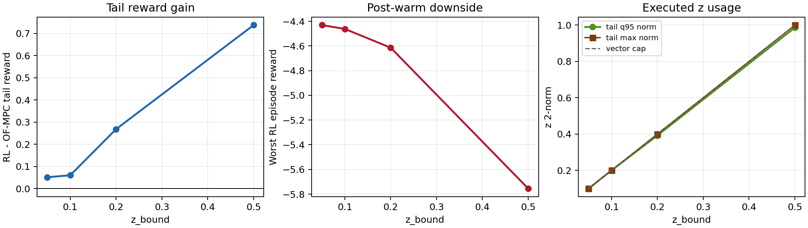
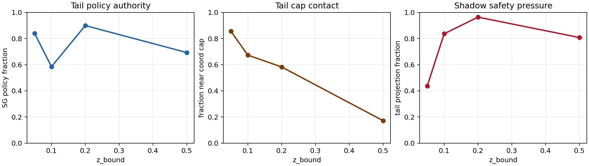

# Polymer Markov z-bound Range Analysis

Date: 2026-06-09

## Objective

Assess whether the new polymer SG-TD3 Markov standalone run with `z_bound = 0.50` improves on the earlier `0.05`, `0.10`, and `0.20` runs, and whether there is room to expand the Markov correction range further.

## Files Inspected

- `Polymer/Results/sg_td3_markov_critic_warm3_ls_else_mpc_shadow_disturb_mismatch/20260608_155310/input_data.pkl`
- `Polymer/Results/sg_td3_markov_critic_warm3_ls_else_mpc_shadow_disturb_mismatch/20260608_193914/input_data.pkl`
- `Polymer/Results/sg_td3_markov_critic_warm3_ls_else_mpc_shadow_disturb_mismatch/20260609_013736/input_data.pkl`
- `Polymer/Results/sg_td3_markov_critic_warm3_ls_else_mpc_shadow_disturb_mismatch/20260609_160219/input_data.pkl`
- Matching compare bundles under `Polymer/Results/disturb_compare_sg_td3_markov_critic_warm3_ls_else_mpc_shadow_mismatch/`
- Analysis script: `report/scripts/analyze_polymer_markov_zbound_20260609.py`
- Summary CSV: `report/figures/polymer_markov_zbound_20260609/polymer_markov_zbound_summary.csv`

## Method

The Markov action perturbs the finite-horizon dynamic matrix through four `io_pair_gain` coordinates. In the active runner, the normalized TD3 action `a_k` is mapped to a bounded Markov correction by

$$ z_k = z_{\max} a_k,\quad a_k \in [-1,1]^4. $$

For four coordinates, the largest possible 2-norm is

$$ \|z_k\|_2 \le 2 z_{\max}. $$

The analysis uses the paired compare bundles for OF-MPC reward rather than the `y_mpc` and `u_mpc` fields inside the RL bundle, because the Markov RL bundle can mirror those fields from the RL trajectory.

## Reward Results

| z_bound | Tail-20 RL reward | Tail-20 OF-MPC reward | Tail reward delta | Final reward delta | Worst post-warm RL reward |
| ---: | ---: | ---: | ---: | ---: | ---: |
| 0.05 | -3.7572 | -3.8084 | 0.0512 | 0.0520 | -4.4312 |
| 0.10 | -3.7485 | -3.8084 | 0.0598 | 0.0424 | -4.4621 |
| 0.20 | -3.5404 | -3.8084 | 0.2680 | 0.2429 | -4.6140 |
| 0.50 | -3.0706 | -3.8084 | 0.7378 | 0.7494 | -5.7549 |

The `0.50` run is clearly the best tail performer in this sweep. It improves tail reward by about `0.738` over OF-MPC, compared with `0.268` for `0.20`.

The tradeoff is the worst post-warm episode. The `0.50` run has the worst release downside among the four runs, with worst post-warm reward `-5.7549`.

## Action And Safety Diagnostics

| z_bound | Tail z 2-norm q95 | Tail z 2-norm max | Tail policy fraction | Tail near-coordinate-cap fraction | Tail shadow projection fraction |
| ---: | ---: | ---: | ---: | ---: | ---: |
| 0.05 | 0.1000 | 0.1000 | 0.8396 | 0.8554 | 0.4379 |
| 0.10 | 0.2000 | 0.2000 | 0.5848 | 0.6733 | 0.8363 |
| 0.20 | 0.3923 | 0.4000 | 0.8991 | 0.5829 | 0.9637 |
| 0.50 | 0.9866 | 1.0000 | 0.6931 | 0.1725 | 0.8077 |

The `0.50` run is not merely better because of noise. It uses the larger authority:

- The tail q95 z 2-norm is `0.9866`, close to the four-coordinate vector cap of `1.0`.
- Tail policy selection is still substantial at `69.3%`, so the actor is active.
- Tail shadow projection remains high at `80.8%`, meaning the inactive shadow safety layer would still modify many requested actions.

## Interpretation

The `0.50` result supports your observation: increasing from `0.20` to `0.50` helped polymer Markov substantially. The learned actor appears to benefit from more Markov authority in the tail.

There is probably some room to test a slightly larger range, but the room is not open-ended:

- Evidence for more room: tail reward continues improving from `0.05` to `0.10` to `0.20` to `0.50`, and high-z episodes are not automatically bad in the mature tail.
- Evidence against a large jump: the `0.50` tail q95 z norm is already `98.7%` of the vector cap, and the max reaches the cap. The actor is often asking for very large corrections.
- Safety warning: worst post-warm reward worsens as the range expands. The `0.50` run has a stronger tail but a larger early release dip.

## Recommended Next Experiment

Run one cautious expansion before changing the default again:

- File: `RL_assisted_MPC_markov_unified.py`
- Override: `Z_BOUND_OVERRIDE = 0.65`
- Keep `agent_mode = "sg"` and keep `markov_live_safety_mode = "shadow_only"` so the comparison isolates the range change.
- Compare against the current `0.50` run using:
  - tail-20 reward delta versus OF-MPC,
  - worst first-20 post-warm reward,
  - tail z 2-norm q95 and max,
  - tail near-coordinate-cap fraction,
  - shadow projection fraction,
  - SG policy versus supervisor fractions.

Accept `0.65` only if it improves tail reward without making the worst post-warm reward materially worse than `-5.75`. If `0.65` still improves but increases release risk, the better next change is not a larger bound. It is a post-warm z-bound ramp, for example starting near `0.20` and ramping to `0.65` over the first 20 post-warm episodes.

## Remaining Uncertainty

This sweep has one run per bound. The trend is strong enough to justify testing `0.65`, but not enough to claim the optimum. A two- or three-seed repeat at `0.50` and `0.65` is needed before locking in a larger default.
