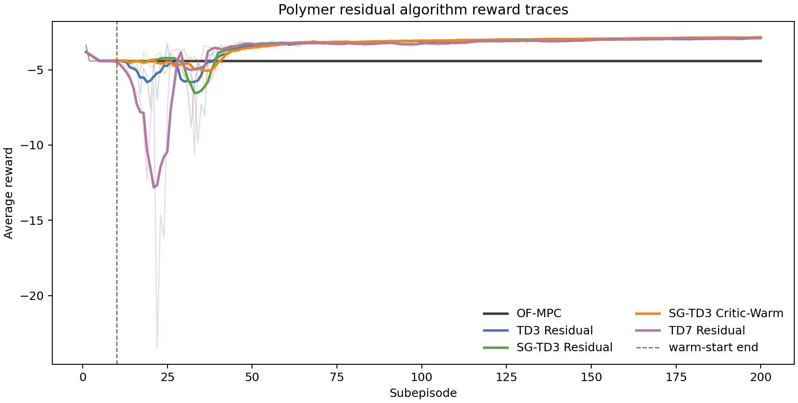
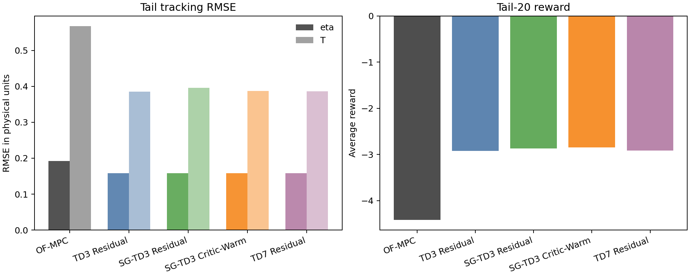
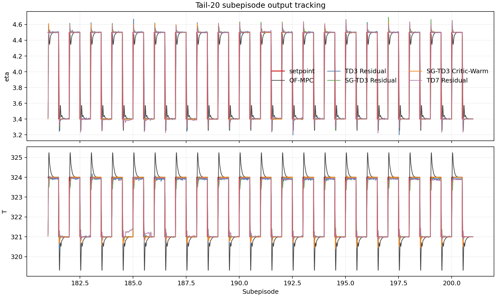
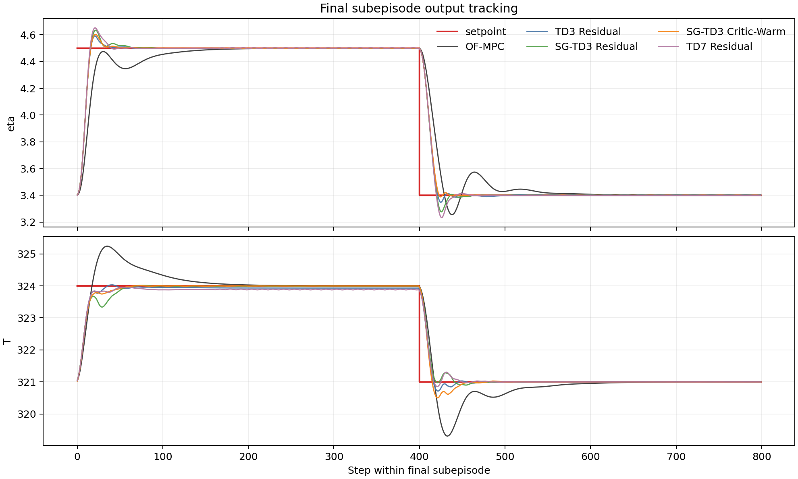
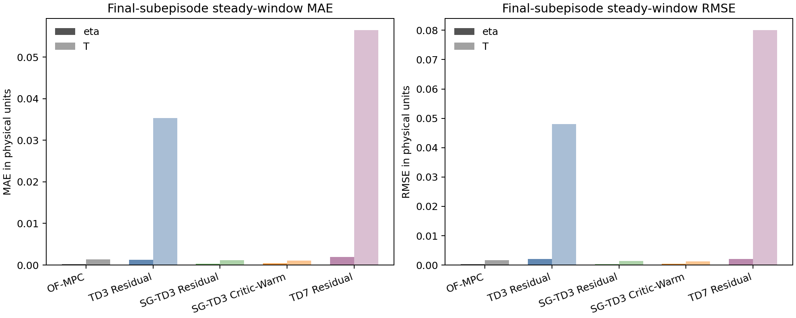
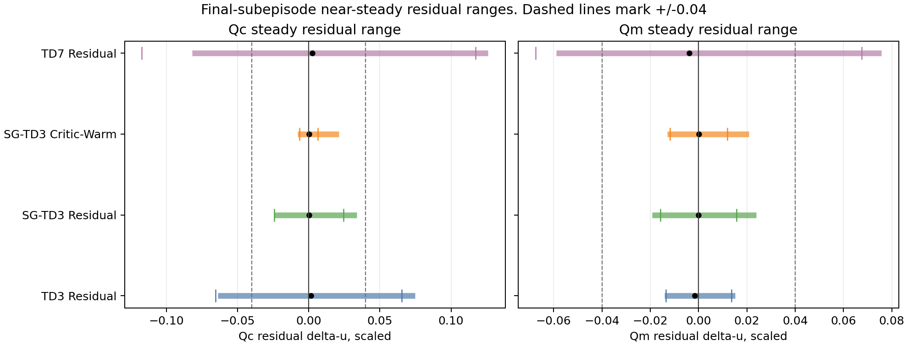
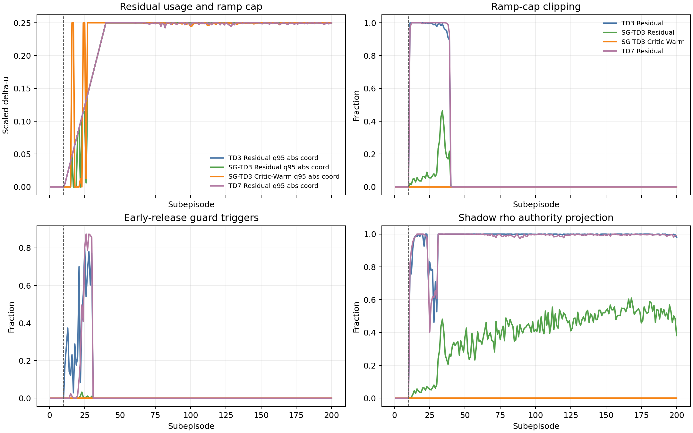
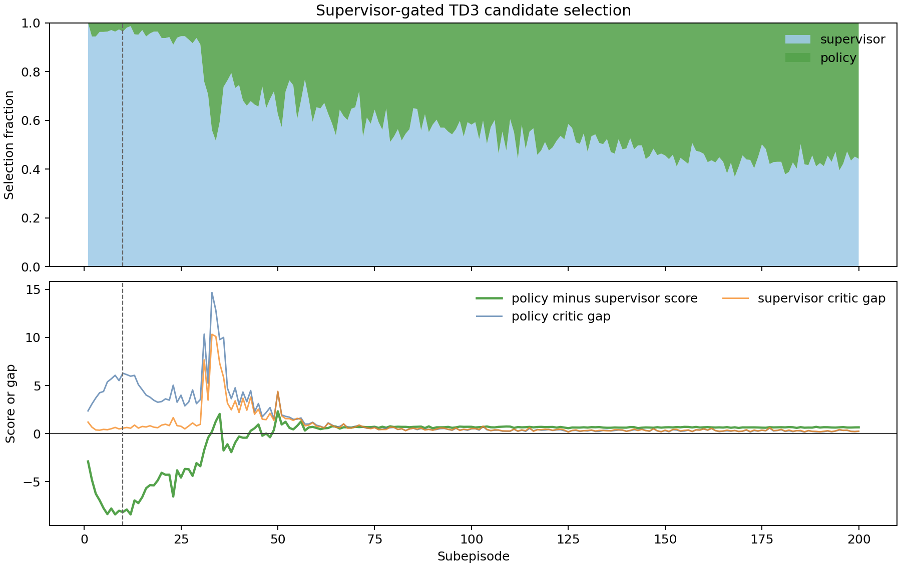
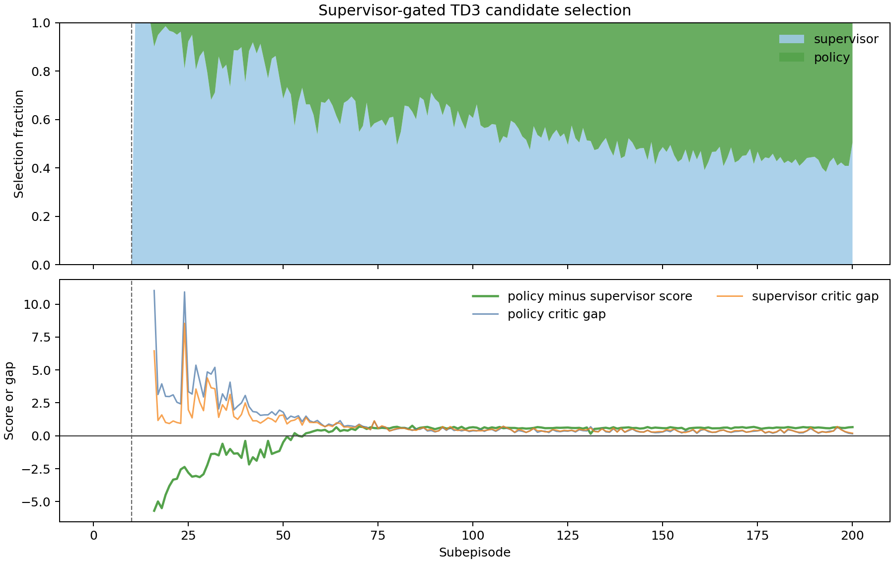

# Polymer Residual Algorithm Comparison

Date: 2026-06-01

## Objective

This report analyzes the latest disturbed polymer residual runs after the polymer authority-ramp correction and the SG-TD3 critic-warm ablation. The compared methods are standard TD3 residual control, supervisor-gated TD3 residual control, SG-TD3 with OF-MPC warm-start plus critic-only release, and TD7 residual control. The OF-MPC disturbed baseline is included as the reference controller.

The analysis uses saved result bundles only. No plant simulations were rerun.

## Data Provenance

| Method | Bundle |
| --- | --- |
| OF-MPC | `Polymer/Data/mpc_results_dist.pickle` |
| TD3 Residual | `Polymer/Results/td3_residual_disturb/20260601_021504/input_data.pkl` |
| SG-TD3 Residual | `Polymer/Results/sg_td3_residual_disturb/20260601_022723/input_data.pkl` |
| SG-TD3 Critic-Warm | `Polymer/Results/sg_td3_residual_critic_warm_disturb/20260601_140709/input_data.pkl` |
| TD7 Residual | `Polymer/Results/td7_residual_disturb/20260601_022931/input_data.pkl` |

All learned residual bundles record `run_mode = disturb`, `state_mode = mismatch`, `low_coef = [-0.25, -0.25]`, and `high_coef = [0.25, 0.25]`. TD3, original SG-TD3, and TD7 use the corrected TD3-style authority ramp `0.005 -> 0.25`. The SG-TD3 critic-warm ablation disables that ramp. The actual rho authority is disabled in all live runs: `residual_authority_enabled = False`, `authority_use_rho = False`, and `append_rho_to_state = False`. Shadow rho diagnostics are enabled for the original residual runs and disabled for the critic-warm ablation.

## Method Formulation

The polymer plant output is

$$ y_k = [\eta_k, T_k]^\top, $$

and the manipulated input is

$$ u_k = [Q_{c,k}, Q_{m,k}]^\top. $$

The residual policy does not replace MPC. It modifies the MPC input move after solving the offset-free MPC problem. The residual actor produces a normalized action

$$ a_k \in [-1,1]^2. $$

The action is mapped to a scaled input residual by

$$ \Delta u_{\mathrm{res},k}^{\mathrm{raw}} = \ell + \frac{a_k + 1}{2}\odot(h-\ell), \qquad \ell=[-0.25,-0.25]^\top,\quad h=[0.25,0.25]^\top. $$

The executed scaled input is

$$ u_k^{\mathrm{exec}} = u_k^{\mathrm{MPC}} + \Delta u_{\mathrm{res},k}^{\mathrm{exec}}. $$

The physical setpoint plotted in the figures is reconstructed from the saved scaled-deviation setpoint by

$$ r_k^{\mathrm{phys}} = y_{\min} + (r_k^{\mathrm{dev}} + y_{\mathrm{ss}}^{\mathrm{scaled}})\odot(y_{\max}-y_{\min}). $$

The tracking metrics use the physical error

$$ e_k = y_k - r_k^{\mathrm{phys}}, $$

with

$$ \mathrm{RMSE}_j(\mathcal{W}) = \sqrt{\frac{1}{|\mathcal{W}|}\sum_{k\in\mathcal{W}} e_{k,j}^2}, \qquad \mathrm{MAE}_j(\mathcal{W}) = \frac{1}{|\mathcal{W}|}\sum_{k\in\mathcal{W}} |e_{k,j}|. $$

The tail window in the tables is the final 20 subepisodes.

## Algorithm Differences

TD3 Residual uses the standard twin-critic deterministic actor structure. Its critic target is

$$ y_k^{Q} = r_k + \gamma(1-d_k)\min_i Q_i^{-}(s_{k+1}, \mu_{\theta^-}(s_{k+1})+\epsilon_k). $$

The actor is updated to maximize the critic value of its action:

$$ \mathcal{L}_{\pi}^{\mathrm{TD3}} = -\mathbb{E}[Q_1(s,\mu_\theta(s))]. $$

Supervisor-gated TD3 keeps the same residual runner but adds a zero-residual supervisor candidate. The two candidates are the actor action and supervisor action:

$$ a_{\mathrm{rl},k} = \mu_\theta(s_k), \qquad a_{\mathrm{sup},k}=a_0. $$

Here `a_0` is the normalized action corresponding to zero residual. Each candidate is scored by a conservative twin-critic value:

$$ S(s,a)=\min(Q_1(s,a),Q_2(s,a))-\lambda_Q|Q_1(s,a)-Q_2(s,a)|-\lambda_{\mathrm{sup}}\|a-a_{\mathrm{sup}}\|_2^2-\lambda_{\mathrm{prev}}\|a-a_{\mathrm{prev}}\|_2^2. $$

The policy action is executed only when it beats the supervisor by the configured margin:

$$ a_k = a_{\mathrm{rl},k}\ \mathrm{if}\ S(s_k,a_{\mathrm{rl},k}) > S(s_k,a_{\mathrm{sup},k})+\epsilon_A,\quad \mathrm{otherwise}\ a_k=a_{\mathrm{sup},k}. $$

The SG-TD3 critic-warm ablation keeps the same gate but removes behavioral cloning, BC handoff, TD3 authority cap/ramp, rho authority, residual deadband, and early-release guard. It uses 10 OF-MPC warm-start episodes followed by 5 post-warm episodes where the zero-residual supervisor is executed while replay is collected and the critics train. Actor updates begin after this critic-only window. The purpose is to test whether the supervisor gate plus critic pretraining is enough to reduce post-warm collapse without extra handrails.

TD7 Residual uses the same residual action surface and safety pipeline, but its learning update uses learned state and state-action encoders. With encoder maps `z_s(s)` and `z_{sa}(z_s,a)`, the encoder prediction loss is

$$ \mathcal{L}_{z} = \|z_{sa}(z_s(s_k),a_k)-z_s(s_{k+1})\|_2^2. $$

The critic target uses target-policy smoothing and clipped target values:

$$ y_k^{Q} = r_k + \gamma^n(1-d_k)\,\mathrm{clip}\left(\min_i Q_i^-(s_{k+n},a_{k+n}^-), Q_{\min}^{\mathrm{track}}, Q_{\max}^{\mathrm{track}}\right). $$

The TD error updates replay priorities:

$$ p_k = \max(|y_k^{Q}-Q_1(s_k,a_k)|,\ |y_k^{Q}-Q_2(s_k,a_k)|). $$

## Main Results

| Method | Mean reward | Post-warm reward | Tail-20 reward | Tail eta RMSE | Tail T RMSE | Tail eta MAE | Tail T MAE | Tail mean abs du scaled |
| --- | --- | --- | --- | --- | --- | --- | --- | --- |
| OF-MPC | -4.412 | -4.417 | -4.417 | 0.1917 | 0.5678 | 0.0646 | 0.2654 | 0.0179 |
| TD3 Residual | -3.455 | -3.411 | -2.927 | 0.1585 | 0.3851 | 0.0353 | 0.1167 | 0.0902 |
| SG-TD3 Residual | -3.374 | -3.325 | -2.870 | 0.1583 | 0.3962 | 0.0342 | 0.0989 | 0.0472 |
| SG-TD3 Critic-Warm | -3.368 | -3.319 | -2.852 | 0.1580 | 0.3873 | 0.0328 | 0.0924 | 0.0496 |
| TD7 Residual | -3.720 | -3.690 | -2.915 | 0.1585 | 0.3866 | 0.0359 | 0.1203 | 0.0419 |

## Last Episode Tracking

| Method | Last episode reward | Last eta RMSE | Last T RMSE | Last eta MAE | Last T MAE | Last eta max abs | Last T max abs |
| --- | --- | --- | --- | --- | --- | --- | --- |
| OF-MPC | -4.417 | 0.1917 | 0.5678 | 0.0646 | 0.2654 | 1.0986 | 2.9777 |
| TD3 Residual | -2.858 | 0.1580 | 0.3792 | 0.0330 | 0.1037 | 1.0978 | 2.9571 |
| SG-TD3 Residual | -2.827 | 0.1578 | 0.3969 | 0.0336 | 0.0962 | 1.0976 | 2.9673 |
| SG-TD3 Critic-Warm | -2.832 | 0.1583 | 0.3878 | 0.0320 | 0.0907 | 1.0977 | 2.9708 |
| TD7 Residual | -2.908 | 0.1587 | 0.3852 | 0.0355 | 0.1270 | 1.0995 | 2.9529 |

The last subepisode confirms the tail-window conclusion. All learned residual controllers remove most of the large OF-MPC temperature excursion after the setpoint switch. Original SG-TD3 has the best last-episode reward and eta RMSE by a small margin. SG-TD3 critic-warm has the best last-episode eta MAE and temperature MAE, and it reduces the original SG-TD3 temperature RMSE from `0.3969` to `0.3878`.

## Final Steady-State Error And Late Residual Range

The final subepisode contains two setpoint plateaus. To separate transition behavior from near-steady behavior, the steady-state audit uses the last 100 steps before each setpoint switch or episode end. In the final subepisode this corresponds to steps `300-399` and `700-799`, for 200 total steps.

| Method | Windows | Steps | Eta MAE | T MAE | Eta RMSE | T RMSE | Eta mean signed | T mean signed |
| --- | --- | --- | --- | --- | --- | --- | --- | --- |
| OF-MPC | 300-399; 700-799 | 200 | 0.000191 | 0.001320 | 0.000231 | 0.001622 | 0.000019 | -0.000247 |
| TD3 Residual | 300-399; 700-799 | 200 | 0.001299 | 0.035343 | 0.002006 | 0.048084 | 0.001286 | -0.032593 |
| SG-TD3 Residual | 300-399; 700-799 | 200 | 0.000299 | 0.001163 | 0.000328 | 0.001413 | 0.000299 | -0.000699 |
| SG-TD3 Critic-Warm | 300-399; 700-799 | 200 | 0.000363 | 0.001101 | 0.000382 | 0.001192 | 0.000363 | -0.001052 |
| TD7 Residual | 300-399; 700-799 | 200 | 0.001966 | 0.056497 | 0.002067 | 0.080083 | -0.000963 | -0.056497 |

This supports the visual impression that the SG-TD3 variants have the smallest steady-state error among the residual RL algorithms. Both are much closer to OF-MPC than TD3 or TD7 in the near-steady windows. The precise statement should be slightly qualified: OF-MPC has the smallest eta MAE, `0.000191`, while original SG-TD3 has `0.000299` and critic-warm SG-TD3 has `0.000363`. Critic-warm SG-TD3 has the smallest temperature MAE and RMSE, `0.001101` and `0.001192`, even slightly below OF-MPC on those two temperature metrics.

| Method | Window | Steps | Qc range | Qc mean abs | Qc q95 abs | Qm range | Qm mean abs | Qm q95 abs | SG policy selected | SG supervisor selected |
| --- | --- | --- | --- | --- | --- | --- | --- | --- | --- | --- |
| TD3 Residual | Final episode | 800 | [-0.2500, 0.2500] | 0.0496 | 0.2500 | [-0.2500, 0.2500] | 0.0261 | 0.2500 | NA | NA |
| TD3 Residual | Final steady windows | 200 | [-0.0637, 0.0748] | 0.0231 | 0.0653 | [-0.0141, 0.0151] | 0.0064 | 0.0136 | NA | NA |
| SG-TD3 Residual | Final episode | 800 | [-0.2500, 0.2500] | 0.0281 | 0.2500 | [-0.2500, 0.2500] | 0.0263 | 0.2500 | 55.8% | 44.2% |
| SG-TD3 Residual | Final steady windows | 200 | [-0.0242, 0.0338] | 0.0042 | 0.0244 | [-0.0193, 0.0239] | 0.0023 | 0.0157 | 41.0% | 59.0% |
| SG-TD3 Critic-Warm | Final episode | 800 | [-0.2500, 0.2500] | 0.0274 | 0.2419 | [-0.2500, 0.2500] | 0.0243 | 0.2500 | 49.5% | 50.5% |
| SG-TD3 Critic-Warm | Final steady windows | 200 | [-0.0078, 0.0213] | 0.0009 | 0.0064 | [-0.0129, 0.0209] | 0.0015 | 0.0118 | 22.0% | 78.0% |
| TD7 Residual | Final episode | 800 | [-0.2500, 0.2500] | 0.0475 | 0.2500 | [-0.2500, 0.2500] | 0.0356 | 0.2500 | NA | NA |
| TD7 Residual | Final steady windows | 200 | [-0.0818, 0.1258] | 0.0356 | 0.1172 | [-0.0589, 0.0758] | 0.0213 | 0.0675 | NA | NA |

The late residual range argues against globally shrinking the polymer residual bound below `[-0.25, 0.25]`. All learned methods still touch or nearly touch full authority during the final subepisode, because the setpoint transitions need larger corrective action. However, the near-steady residuals are much smaller. Original SG-TD3 stays within about `[-0.0242, 0.0338]` on `Qc` and `[-0.0193, 0.0239]` on `Qm` in the steady windows. Critic-warm SG-TD3 is even quieter near steady state, staying within `[-0.0078, 0.0213]` on `Qc` and `[-0.0129, 0.0209]` on `Qm`.

The SG-TD3 source split is also important. In the final steady windows, original SG-TD3 selects the policy on `41.0%` of steps and the zero-residual supervisor on `59.0%`. Critic-warm SG-TD3 selects the policy on only `22.0%` of those steady-window steps and the supervisor on `78.0%`. This means the critic-warm ablation is more conservative near setpoint while still using full residual authority during transitions.

If residual shrinking is tested, the safer hypothesis is a state-dependent steady-state envelope rather than a smaller global authority. One candidate is to keep the global transient limit at `c_{\max}=0.25` and introduce a near-setpoint cap `c_{\mathrm{ss}}`:

$$ c_{\mathrm{eff},k}=c_{\mathrm{ss}}+(c_{\max}-c_{\mathrm{ss}})\,\mathrm{clip}\left(\frac{\|e_k^{\mathrm{scaled}}\|_2-e_{\mathrm{low}}}{e_{\mathrm{high}}-e_{\mathrm{low}}},0,1\right). $$

The executed residual would then satisfy

$$ \Delta u_{\mathrm{res},k}^{\mathrm{exec}}=\Pi_{[-c_{\mathrm{eff},k},c_{\mathrm{eff},k}]^2}(\Delta u_{\mathrm{guard},k}). $$

For SG-TD3, a first steady-state cap around `0.04` is plausible because it contains most observed policy-selected steady residuals. For raw TD3 and TD7, `0.04` would heavily clip the first channel for TD3 and both channels for TD7 in the steady windows, so that test should be interpreted as a regularization experiment, not as a neutral bound change.

All learned residual algorithms improve the final 20-subepisode reward and physical tracking metrics relative to OF-MPC. SG-TD3 critic-warm has the best mean reward, post-warm reward, and tail-20 reward in this batch. It also has the best tail eta RMSE and the best tail mean absolute errors for both outputs.

TD3 has the best tail temperature RMSE by a small margin, `0.3851` versus `0.3866` for TD7 and `0.3873` for SG-TD3 critic-warm. Critic-warm SG-TD3 still has the lowest temperature MAE, `0.0924`, so it is better for typical temperature error but has a few larger temperature deviations that keep RMSE slightly above raw TD3.

TD3 uses the most residual movement in the tail window. Its tail mean absolute scaled input move is `0.0902`, compared with `0.0472` for original SG-TD3, `0.0496` for critic-warm SG-TD3, and `0.0419` for TD7. This matters because the scalar reward includes input movement. Critic-warm SG-TD3 reaches the best reward while using roughly half the TD3 tail input movement.

## Logged Safety Mathematics

For runners that enable the TD3 residual authority ramp, the corrected ramp is a per-coordinate scaled-input cap. For post-warm subepisode `q`, the live cap is

$$ c_q = c_0 + \alpha_q(c_f-c_0), \qquad c_0=0.005,\quad c_f=0.25,\quad \alpha_q=\mathrm{clip}\left(\frac{q-1}{29},0,1\right). $$

The ramp projection is

$$ \Delta u_{\mathrm{cap},k} = \Pi_{[-c_q,c_q]^2}(\Delta u_{\mathrm{handoff},k}). $$

The early-release guard compares the one-step linear prediction for the requested residual against the nominal residual. The local objective is

$$ J_k(\Delta u)=\|\hat y_{k+1}(\Delta u)-r_k\|_{Q_{\mathrm{out}}}^2+\|\Delta u_{\mathrm{base},k}+\Delta u-\Delta u_{k-1}\|_{R_{\mathrm{in}}}^2. $$

The normalized one-step tracking norm is

$$ E_k(\Delta u)=\left\|\frac{\hat y_{k+1}(\Delta u)-r_k}{s_k}\right\|_2. $$

For runners that enable the early-release guard, during the first 20 post-warm subepisodes a candidate residual is accepted only if

$$ J_k(\Delta u) \le J_k(0)+\max(\epsilon_{\mathrm{abs}},\epsilon_{\mathrm{rel}}|J_k(0)|), \qquad E_k(\Delta u) \le E_k(0)+\epsilon_E. $$

If that test fails, the guard tries scaled residuals from

$$ \{0.5\Delta u,\ 0.25\Delta u,\ 0.1\Delta u,\ 0\}. $$

The final physical headroom projection is

$$ \Delta u_{\mathrm{exec},k}=\Pi_{[\ell,h]\cap[u_{\min}-u_k^{\mathrm{MPC}},u_{\max}-u_k^{\mathrm{MPC}}]}(\Delta u_{\mathrm{guard},k}). $$

The rho authority was not active in these runs. For the original residual runs with shadow rho diagnostics enabled, the diagnostic computes

$$ \rho_k = 1-\exp(-\kappa\max_i |z_{k,i}|), $$

and

$$ \rho_{\mathrm{eff},k} = \rho_{\min} + (1-\rho_{\min})\rho_k^p. $$

The shadow authority envelope would be

$$ |\Delta u_{\mathrm{res},k,i}| \le \rho_{\mathrm{eff},k}\beta_i(|\Delta u_{\mathrm{MPC},k,i}|+d_{0,i}). $$

## Logged Safety Results

| Method | Ramp | Post-warm cap clip | Guard trigger active | Guard accepted | Guard objective worse | Guard zero selected | Headroom projection | Shadow rho authority | Shadow rho deadband | SG policy selected | SG supervisor selected |
| --- | --- | --- | --- | --- | --- | --- | --- | --- | --- | --- | --- |
| OF-MPC | NA | NA | NA | NA | NA | NA | NA | NA | NA | NA | NA |
| TD3 Residual | 0.005 -> 0.25 | 15.0% | 40.0% | 9603 | 4410 | 1987 | 0.5% | 98.4% | 0.2% | NA | NA |
| SG-TD3 Residual | 0.005 -> 0.25 | 1.9% | 0.4% | 15930 | 31 | 39 | 0.7% | 40.6% | 3.1% | 41.9% | 58.1% |
| SG-TD3 Critic-Warm | disabled | 0.0% | NA | 0 | 0 | 0 | 0.1% | 0.0% | 0.0% | 39.7% | 60.3% |
| TD7 Residual | 0.005 -> 0.25 | 15.2% | 31.6% | 10948 | 2808 | 2244 | 0.1% | 97.9% | 0.3% | NA | NA |

The safety logs explain why the gated variants are better behaved. TD3 and TD7 request large residuals early after live release. Their post-warm cap-clipping fractions are about `15%`, and the early-release guard triggers on `40.0%` of active-guard steps for TD3 and `31.6%` for TD7. Original SG-TD3 has only `1.9%` cap clipping and only `0.4%` active-guard triggering. Critic-warm SG-TD3 has no cap or guard enabled, so those intervention rates are `0.0%` by design.

The supervisor gate selected the zero-residual supervisor on `58.1%` of post-warm steps for original SG-TD3 and `60.3%` for critic-warm SG-TD3. The learned policy was still selected on `41.9%` and `39.7%` of post-warm steps, respectively. This means the critic-warm ablation did not simply collapse to OF-MPC. It remained a gated residual controller, but the gate carried more of the stabilization burden because the extra BC, ramp, and guard layers were removed.

The shadow rho logs are also informative for the original residual runs. If rho authority had been active with the current rho settings, TD3 and TD7 would have been authority-projected on about `98%` of post-warm steps. Original SG-TD3 would have been projected on about `41%` of post-warm steps. The critic-warm run disabled shadow rho diagnostics, so it should not be used for rho tuning evidence.

One log caveat: `projection_active_log` is almost always true in these runs. The cause-specific projection logs show that headroom projection is below `1%`, and rho authority was disabled. Therefore the generic `projection_active_log` should not be interpreted alone as a physical safety intervention count. The meaningful logged safety signals here are `residual_cap_projection_active_log`, `residual_guard_triggered_log`, `projection_due_to_headroom_log`, and, where enabled, the `shadow_rho_*` diagnostics.

## SG-TD3 Post-Warm Recovery

| Method | Post-warm minimum | Minimum episode | First better than OF-MPC | First 5-episode better | 80pct recovery start | 80pct recovery end | Cap clip ep11-40 | Cap clip ep41-200 | Guard trigger ep11-40 | Guard trigger ep41-200 | Policy selected tail20 |
| --- | --- | --- | --- | --- | --- | --- | --- | --- | --- | --- | --- |
| SG-TD3 Residual | -9.812 | 34 | 11 | 21 | 65 | 69 | 12.2% | 0.0% | 0.3% | 0.0% | 56.9% |
| SG-TD3 Critic-Warm | -6.212 | 36 | 11 | 11 | 65 | 69 | 0.0% | 0.0% | 0.0% | 0.0% | 57.2% |

Original SG-TD3 did recover after warm start, but the recovery was not instantaneous. The run is already better than OF-MPC on episode 11, and it has its first five-episode run above OF-MPC starting at episode 21. It then has a deeper exploration and release dip, reaching a post-warm minimum reward of `-9.812` at episode 34. A five-episode window reaches `80%` of the final tail improvement over OF-MPC from episodes 65 to 69.

The critic-warm ablation improved the release behavior. Its post-warm minimum reward is `-6.212`, much less severe than `-9.812`, and its first five-episode run above OF-MPC starts immediately at episode 11. The 80% recovery window still lands at episodes 65 to 69, so the critic-only release reduced collapse depth more than it shortened final convergence time. At the end of training, critic-warm SG-TD3 is not just falling back to the supervisor: the learned policy is selected on `57.2%` of tail-20 steps, almost identical to the original SG-TD3 tail selection fraction.

## Interpretation By Algorithm

TD3 Residual learns a strong residual correction and improves tracking substantially. Its main weakness is authority usage. It uses the largest tail input movement and causes the early-release guard to intervene often. This is consistent with an actor that learns useful corrections but pushes hard into the newly corrected full polymer residual authority.

SG-TD3 Residual is the strongest of the original three residual methods. The gate prevents many high-risk residuals from reaching the safety layers. This gives a smoother release period and lower intervention rates than raw TD3 or TD7. The zero-residual supervisor acts as a local conservative action, not as a permanent fallback, because the policy is still selected on `41.9%` of post-warm steps.

SG-TD3 Critic-Warm is the strongest single run in the expanded batch. Removing BC, handoff, cap ramp, rho/deadband authority, and the early-release guard did not hurt this run. With five episodes of critic-only release, the post-warm collapse became much shallower and the final tail reward improved from `-2.870` to `-2.852`. The mechanism appears to be better critic calibration before actor release plus continued supervisor gating, not weaker residual authority: the run still uses full residual authority during transitions, but it selects zero residual more often near steady state.

TD7 Residual recovers to nearly the same tail reward as TD3, but it has a worse average reward because of a deeper early post-warm degradation. The TD7 encoder and priority machinery do not remove the residual-authority release problem in this run. The guard and cap logs show that TD7 also asks for high-authority residuals during the release phase.

## Distillation Transfer Assessment

SG-TD3 can be transferred to the distillation residual workflow, but it is not wired as a distillation entrypoint yet. The shared residual runner already accepts `agent_kind = "sg_td3"`, and the runner logic is system-agnostic once the distillation runtime context provides the plant, MPC model, scaling, reward, and disturbance schedule. The current distillation residual scripts only construct `TD3Agent`, `SACAgent`, or `TD7Agent`, so a distillation SG-TD3 run needs a new entrypoint or a guarded branch that constructs `SupervisorGatedTD3Agent`.

The transfer is scientifically reasonable for three reasons. First, the supervisor candidate is zero residual, which is valid for both polymer and distillation because it reduces to the existing OF-MPC move. Second, distillation residual bounds are already `[-0.02, 0.02]`, and the distillation ramp already releases from `0.005` to `0.02`, so there is no authority-scale mismatch like the old polymer bug. Third, the distillation residual runs have the same mismatch-state and residual-safety logging surface, so the same diagnostics can be used: cap clipping, guard triggering, headroom projection, shadow rho authority, and SG policy-versus-supervisor selection.

The transfer should still be treated as a new experiment, not a guaranteed improvement. Distillation has different time constants, stronger input scaling asymmetry, and a smaller residual authority. A gate that helps polymer by avoiding high-authority residuals may become too conservative in distillation if the zero-residual supervisor dominates the early critic. The first distillation SG-TD3 test should therefore be no-rho, same residual bounds, same ramp, and same disturbance profile as the TD3 distillation residual baseline. Only after that should rho-enabled SG-TD3 be tested.

The practical implementation path is:

1. Create `distillation_RL_assisted_MPC_residual_supervisor_gated_td3_unified.py` from the current distillation residual entrypoint.
2. Import `SupervisorGatedTD3Agent` and `SupervisorGateConfig`.
3. Set `NB["agent_kind"] = "sg_td3"` and instantiate the supervisor-gated agent with the distillation `STATE_DIM`, `ACTION_DIM`, replay settings, and TD3 hyperparameters.
4. Keep the supervisor action as zero residual for the first test.
5. Compare against `distillation_RL_assisted_MPC_residual_unified.py` using the same `run_mode = disturb` and `disturbance_profile = fluctuation`.

## Bugs, Inconsistencies, And Risks

- The old polymer ramp bug is fixed in the ramp-enabled bundles. TD3, original SG-TD3, and TD7 show `end_cap = 0.25`, not the old distillation-scale `0.02`. The critic-warm ablation disables the ramp entirely by design.
- These are single-seed training rollouts, not frozen-policy evaluation runs. The ranking is useful, but it should not be treated as statistical evidence yet.
- The actual rho authority is disabled. The rho analysis is based on shadow logs only, and critic-warm disables those shadow diagnostics.
- TD3 and TD7 both make heavy use of the full residual authority. This improves final tracking but increases reliance on the ramp and guard.
- The SG-TD3 variants have slightly worse tail temperature RMSE than raw TD3 even though their mean absolute temperature errors are better. This points to fewer typical errors but some larger temperature excursions.
- The critic-warm result is an ablation, not proof that BC, ramp, and guard are always harmful. It combines multiple removals with a five-episode critic-only phase, so the next test should separate those factors.
- Distillation transfer requires a new entrypoint or agent-construction branch. The runner supports `sg_td3`, but the current distillation residual script does not instantiate `SupervisorGatedTD3Agent`.

## Literature Connections

No new citations were added. The local implementation connects to standard TD3-style deterministic actor-critic control, residual RL on top of model-based control, action projection for safe RL, and critic-based policy gating. This report is an internal empirical audit rather than a literature-supported paper section.

## Recommended Next Experiments

1. Run frozen-policy evaluation for TD3 residual, original SG-TD3 residual, SG-TD3 critic-warm, and TD7 residual with exploration disabled and the same disturbance schedule. The deciding metrics should be tail reward, tail eta and T RMSE, tail MAE, policy-versus-supervisor selection, cap-clipping fraction, and guard-trigger fraction.

2. Run three seeds for the four learned residual methods. Critic-warm SG-TD3 currently looks best, but the result is still a single-seed training rollout.

3. Add and run a distillation SG-TD3 residual entrypoint with no rho authority first. The confirmation metric is whether SG-TD3 reduces release shock and guard activity without collapsing to zero residual.

4. Test rho-enabled polymer residuals now that the ramp reaches `0.25`. Start with SG-TD3 because the shadow rho authority projection rate is much lower than TD3 and TD7. The key failure mode to watch is whether rho authority erases useful residual corrections near large setpoint transitions.

5. Tune rho authority for polymer separately from distillation. A useful grid is `authority_beta_res` in `{0.25, 0.5, 0.75}` and `authority_du0_res` in `{0.001, 0.005, 0.01}` while keeping the full residual bounds at `[-0.25, 0.25]`.

6. Test a near-setpoint residual envelope for SG-TD3 while keeping the global polymer residual authority at `[-0.25, 0.25]`. Start with a steady cap near `0.04` when the scaled tracking norm is small. The metric should be final steady-window MAE and RMSE, not only tail reward, because the goal is to reduce residual dithering without weakening transition recovery. Critic-warm SG-TD3 is the best starting point because its steady-window residuals are already compact.

7. Isolate the critic-warm ablation factors. Run one SG-TD3 variant with BC/ramp/guard disabled but no five-episode actor freeze, and another with five-episode actor freeze but the original BC/ramp/guard enabled. This will show whether the improvement came mainly from removing the extra handrails, from critic-only pretraining, or from their combination.

8. For TD3 and TD7, try a longer release or a critic-aware release gate. The current full-authority ramp is correct, but the cap and guard logs show that the actor often reaches full authority before the critic is reliable.

## Remaining Uncertainty

The current evidence supports SG-TD3 critic-warm as the best algorithm in this single batch, but it does not prove generalization. The most important missing evidence is a frozen evaluation rollout and multi-seed spread. The ablation also changes several mechanisms at once, so causal attribution remains uncertain. The shadow rho logs show that rho authority may help safety in the original residual runs, but they do not prove that rho-enabled execution will improve reward.

## Generated Artifacts

| Artifact | Purpose |
| --- | --- |
| `report/scripts/analyze_polymer_residual_algorithms_20260601.py` | Reproducible analysis script |
| `report/figures/polymer_residual_algorithm_comparison_20260601/performance_summary.csv` | Raw performance metrics |
| `report/figures/polymer_residual_algorithm_comparison_20260601/steady_state_summary.csv` | Final-subepisode steady-window tracking metrics |
| `report/figures/polymer_residual_algorithm_comparison_20260601/late_residual_summary.csv` | Final and near-steady residual range metrics |
| `report/figures/polymer_residual_algorithm_comparison_20260601/sg_steady_residual_source_summary.csv` | SG-TD3 steady residual ranges by selected source |
| `report/figures/polymer_residual_algorithm_comparison_20260601/safety_summary.csv` | Raw safety metrics |
| `report/figures/polymer_residual_algorithm_comparison_20260601/last_episode_summary.md` | Last-subepisode metrics |
| `report/figures/polymer_residual_algorithm_comparison_20260601/steady_state_summary.md` | Markdown final-subepisode steady-window tracking table |
| `report/figures/polymer_residual_algorithm_comparison_20260601/late_residual_summary.md` | Markdown final and near-steady residual range table |
| `report/figures/polymer_residual_algorithm_comparison_20260601/sg_steady_residual_source_summary.md` | Markdown SG-TD3 source-specific residual range table |
| `report/figures/polymer_residual_algorithm_comparison_20260601/recovery_summary.md` | SG-TD3 post-warm recovery metrics |
| `report/figures/polymer_residual_algorithm_comparison_20260601/analysis_summary.json` | Combined machine-readable summary |
| `report/figures/polymer_residual_algorithm_comparison_20260601/reward_curves.png` | Reward traces |
| `report/figures/polymer_residual_algorithm_comparison_20260601/tail_metric_bars.png` | Tail metric comparison |
| `report/figures/polymer_residual_algorithm_comparison_20260601/tail_tracking_overlay.png` | Tail output tracking |
| `report/figures/polymer_residual_algorithm_comparison_20260601/last_episode_tracking_overlay.png` | Last-subepisode output tracking |
| `report/figures/polymer_residual_algorithm_comparison_20260601/last_episode_steady_error_bars.png` | Final-subepisode steady-window tracking comparison |
| `report/figures/polymer_residual_algorithm_comparison_20260601/last_episode_steady_residual_ranges.png` | Final-subepisode near-steady residual ranges |
| `report/figures/polymer_residual_algorithm_comparison_20260601/residual_safety_dashboard.png` | Residual safety logs |
| `report/figures/polymer_residual_algorithm_comparison_20260601/supervisor_gate_diagnostics.png` | SG-TD3 gate diagnostics |
| `report/figures/polymer_residual_algorithm_comparison_20260601/supervisor_gate_diagnostics_sg_td3_residual.png` | Original SG-TD3 gate diagnostics |
| `report/figures/polymer_residual_algorithm_comparison_20260601/supervisor_gate_diagnostics_sg_td3_critic_warm.png` | Critic-warm SG-TD3 gate diagnostics |
