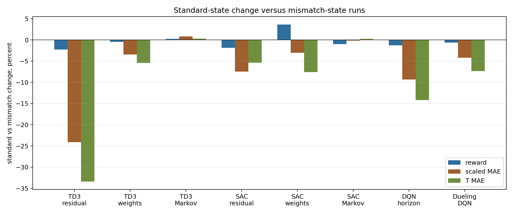
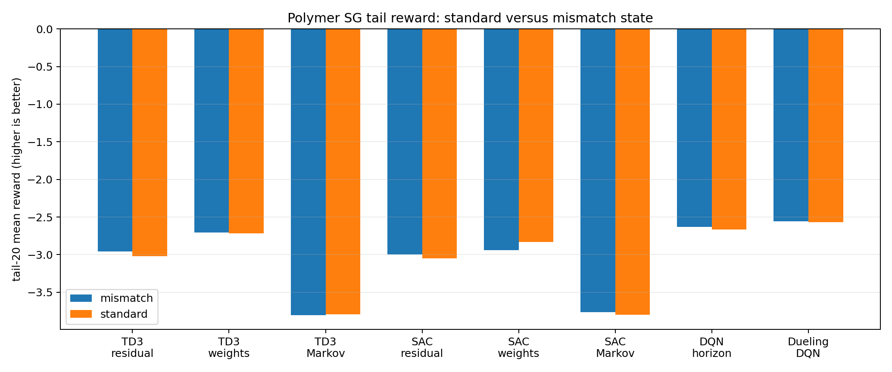
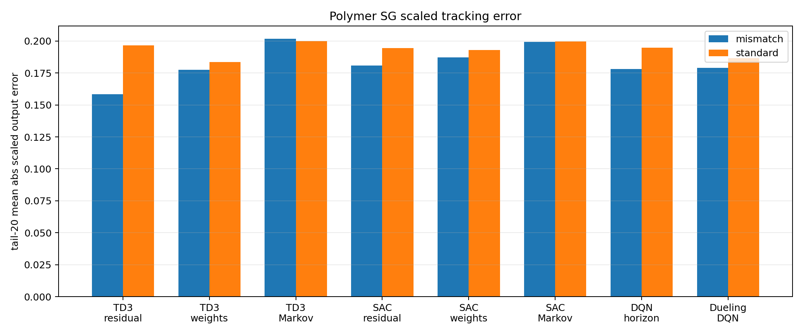
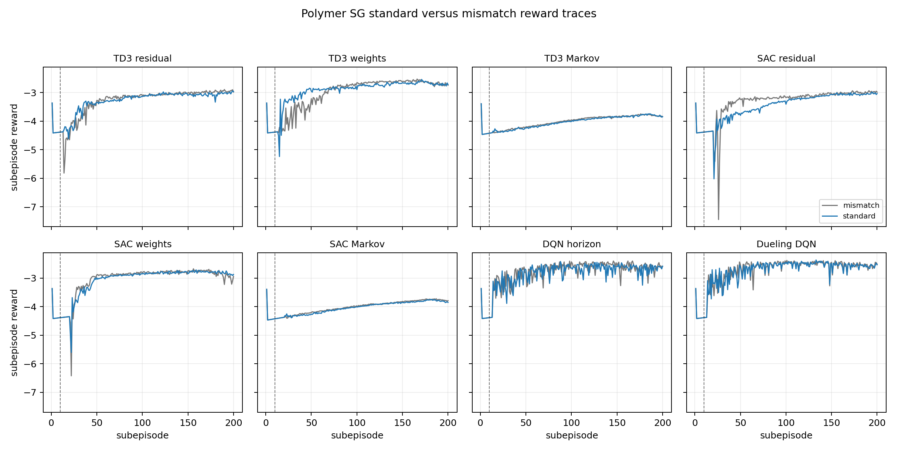
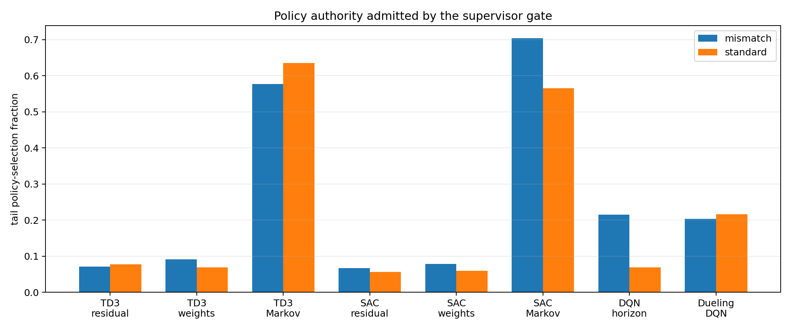
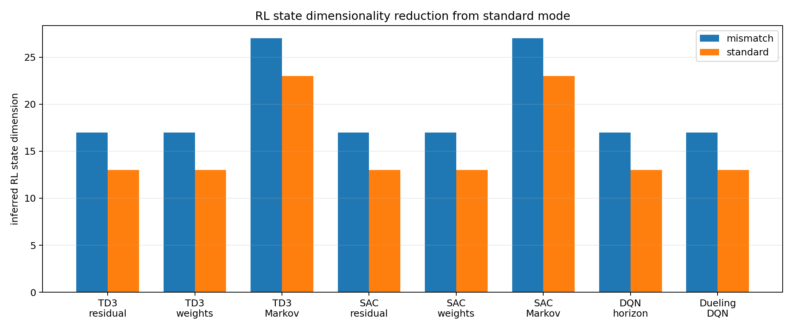

# Polymer SG-SAC and SG-DQN Finished-Run Analysis

## Objective

This report analyzes the five completed polymer disturbed runs that finished on
June 3, 2026 before the later SG-SAC deterministic-gate and hidden-7 release
code changes were implemented. The goal is to determine what changed relative to
the nearest previous runs and how much the new SG-SAC or SG-DQN versions
improved.

The five analyzed current runs are:

- SG-SAC residual: `Polymer/Results/sg_sac_residual_critic_warm3_zero_shadow_disturb/20260603_205207/input_data.pkl`
- SG-SAC weights: `Polymer/Results/sg_sac_weights_critic_warm3_identity_shadow_disturb/20260603_205218/input_data.pkl`
- SG-SAC Markov: `Polymer/Results/sg_sac_markov_critic_warm3_ls_else_mpc_shadow_disturb/20260603_212647/input_data.pkl`
- SG-DQN horizon: `Polymer/Results/horizon_sg_dqn_critic_warm3_default_ofmpc_eps02_002_disturb_mismatch/20260603_210127/input_data.pkl`
- SG-dueling-DQN horizon: `Polymer/Results/dueling_horizon_sg_dqn_critic_warm3_default_ofmpc_eps02_002_disturb_mismatch/20260603_210913/input_data.pkl`

These runs are not the new `detgate_hidden7` SG-SAC runs. The saved configs show
3 post-warm action-freeze subepisodes and 3 actor-freeze subepisodes.

## Method Summary

For each current run, I compared against the nearest previous polymer disturbed
ancestor:

- SG-SAC residual versus SG-TD3 residual critic-warm-3 conservative.
- SG-SAC weights versus SG-TD3 weights critic-warm-3 conservative.
- SG-SAC Markov versus SG-TD3 Markov critic-warm-3 LS-or-MPC supervisor.
- SG-DQN horizon versus the previous standard DQN horizon unified run.
- SG-dueling-DQN horizon versus the previous dueling DQN horizon unified run.

The comparison uses post-warm metrics and the final 20 subepisodes, where one
subepisode is 800 simulation steps. Tail-20 therefore means the final 16,000
steps. For reward, higher is better. For tracking error and input movement,
lower is better.

## Mathematical Interpretation

The supervisor-gated controller evaluates a learned policy proposal
`a_pi(s)` against a supervisor action `a_sup(s)`. The continuous SG-TD3 and
pre-detgate SG-SAC runs used a conservative score of the form:

$$ S(s,a) = \min(Q_1(s,a),Q_2(s,a)) - \lambda_Q |Q_1(s,a)-Q_2(s,a)| - \lambda_{\mathrm{sup}} \|a-a_{\mathrm{sup}}\|_2^2 - \lambda_{\mathrm{prev}} \|a-a_{\mathrm{prev}}\|_2^2. $$

The gate admits the policy if:

$$ S(s,a_\pi) > S(s,a_{\mathrm{sup}}) + m. $$

For residual and weights, the saved current SG-SAC configs used margin
`m = 0.5`. For Markov, `m = 0.0`. The completed SG-SAC runs used stochastic
SAC policy samples for live train-mode gate candidates. They did not include
the later deterministic candidate mode, twin-critic dominance veto, or hidden-7
actor/alpha training release.

For SG-DQN horizon selection, the same idea is applied to discrete horizon
actions:

$$ a_{\mathrm{exec}} = \begin{cases} a_\pi, & Q(s,a_\pi) > Q(s,a_{\mathrm{sup}}) + m, \\ a_{\mathrm{sup}}, & \mathrm{otherwise}. \end{cases} $$

The supervisor horizon was the OF-MPC default pair `(Hp,Hc) = (9,3)`, encoded as
action `6`, with zero gate margin.

## Quantitative Results

Positive percentages below mean improvement versus the previous run. Negative
percentages mean degradation. OF-MPC reward improvement is computed from the
saved compare bundles, whose tail OF-MPC reward is `-4.417343`.

| runner | tail reward current | tail reward previous | tail reward vs previous pct | tail reward vs OF-MPC pct | tail scaled MAE current | tail scaled MAE previous | tail scaled MAE vs previous pct | eta MAE current | eta MAE previous | eta MAE vs previous pct | T MAE current | T MAE previous | T MAE vs previous pct | policy post current | policy post previous |
| --- | --- | --- | --- | --- | --- | --- | --- | --- | --- | --- | --- | --- | --- | --- | --- |
| SG-SAC residual | -3.008 | -2.956 | -1.75 | 31.92 | 1.254 | 0.921 | -36.22 | 13.399 | 12.420 | -7.88 | 4.868 | 3.950 | -23.23 | 11.2% | 7.1% |
| SG-SAC weights | -2.841 | -2.703 | -5.11 | 35.68 | 1.223 | 1.210 | -1.10 | 15.316 | 14.354 | -6.71 | 4.595 | 4.205 | -9.27 | 10.6% | 6.9% |
| SG-SAC Markov | -3.792 | -3.804 | 0.33 | 14.17 | NA | NA | NA | NA | NA | NA | NA | NA | NA | 50.0% | 28.4% |
| SG-DQN horizon | -2.631 | -2.680 | 1.83 | 40.43 | 1.097 | 1.101 | 0.35 | 14.031 | 14.374 | 2.39 | 4.333 | 4.375 | 0.95 | 16.0% | NA |
| SG-dueling DQN | -2.555 | -2.672 | 4.39 | 42.17 | 1.108 | 1.157 | 4.28 | 13.990 | 14.810 | 5.54 | 4.413 | 4.531 | 2.61 | 16.9% | NA |

Generated evidence files:

- Metric CSV: `report/figures/2026-06-04_polymer_sg_runs/polymer_sg_run_metrics.csv`
- Reward chart: `report/figures/2026-06-04_polymer_sg_runs/tail_reward_comparison.png`
- Scaled tracking chart: `report/figures/2026-06-04_polymer_sg_runs/tail_scaled_tracking_mae.png`
- Viscosity MAE chart: `report/figures/2026-06-04_polymer_sg_runs/tail_eta_mae.png`
- Temperature MAE chart: `report/figures/2026-06-04_polymer_sg_runs/tail_T_mae.png`
- SG policy authority chart: `report/figures/2026-06-04_polymer_sg_runs/sg_policy_fraction.png`

## Main Interpretation

The SG-DQN family is the clear improvement among these five runs. Standard
SG-DQN improved tail reward by `1.83%`, viscosity tail MAE by `2.39%`, and
temperature tail MAE by `0.95%` versus the previous DQN horizon run. The
dueling SG-DQN was stronger, improving tail reward by `4.39%`, tail scaled
tracking MAE by `4.28%`, viscosity MAE by `5.54%`, and temperature MAE by
`2.61%`.

The SG-SAC residual run did not improve over the earlier SG-TD3 residual run.
It admitted policy actions more often after warm start, increasing from `7.1%`
to `11.2%`, but tail reward worsened by `1.75%`, tail scaled MAE worsened by
`36.22%`, and temperature MAE worsened by `23.23%`. This supports the earlier
diagnosis that residual SG-SAC was over-admitting risky stochastic residual
samples without enough critic agreement.

The SG-SAC weights run is mixed but not a tracking improvement. Post-warm input
movement decreased by `9.32%`, but tail reward worsened by `5.11%`, viscosity
MAE worsened by `6.71%`, and temperature MAE worsened by `9.27%`. This looks
like a quieter controller that did not improve output tracking.

The SG-SAC Markov run is only slightly better than SG-TD3 Markov in reward:
tail reward improved by `0.33%`. It also improved stored Markov diagnostics,
with prediction-score mean decreasing from `0.0369` to `0.0312` and gain-drift
mean decreasing from `0.0339` to `0.0297`. However, the Markov run bundle does
not save `tracking_error_log` or `tracking_error_raw_log`, so I cannot claim a
direct output-tracking improvement for Markov from this bundle alone.

All five current SG runs still beat the saved OF-MPC reward baseline in the
compare bundles. The tail reward improvement over OF-MPC ranges from `14.17%`
for SG-SAC Markov to `42.17%` for SG-dueling DQN. This is useful, but it does
not mean every new SG version beat its previous RL ancestor.

## Implementation Consistency Checks

The saved configs show that the completed SG-SAC runs used the older SG-SAC
configuration:

- action freeze subepisodes: `3`
- actor freeze subepisodes: `3`
- no `candidate_mode = "deterministic"`
- no `critic_dominance_gate_enabled`
- no sampled-action supervisor BC loss

Therefore, these results are the pre-change baseline for the later
`detgate_hidden7` implementation. They should be used as the acceptance
comparison for the new SG-SAC residual, weights, and Markov reruns.

The per-run bundles contain `y_mpc` and `y_line_full`, but in at least the
horizon SG-DQN bundle these fields mirror the live trajectory rather than
providing a separate OF-MPC tracking baseline. I therefore used the compare
bundle rewards for OF-MPC comparison and did not compute OF-MPC tracking MAE
from those per-run fields.

## Risks and Limitations

- This is a single-run comparison for each family. Most current bundles have
  `seed=None`, while the dueling horizon run records `seed=7`. Seed spread is
  needed before claiming robust superiority.
- Markov `tracking_error_log` fields are missing, so the pre-change Markov
  table above is reward and model-diagnostic based. The detgate follow-up
  recomputes output tracking from `delta_y_storage`, `y`, `y_sp`, and scaling
  artifacts.
- The previous horizon ancestors are non-SG DQN and dueling-DQN runs, so their
  SG policy-fraction fields are not available.
- The pre-change SG-SAC residual collapse was consistent with stochastic
  candidate release. The detgate follow-up below supports that diagnosis, but
  it is still a single-seed comparison rather than a robustness claim.

## Literature Connections

No new external citations were added in this pass. The local result pattern is
consistent with the standard safe policy improvement interpretation: value
gates help only when the critic ranking is reliable. For residual actions, a
small admitted fraction can still dominate closed-loop behavior because the
action changes the MPC move directly. This is why the later deterministic
candidate and twin-critic dominance changes are scientifically well motivated
without adding a manual residual safety layer.

## SG-SAC Detgate Hidden-7 Follow-Up

The new safer SG-SAC reruns finished after the pre-change analysis above. I
compared the three continuous SG-SAC families against their immediate
pre-detgate SG-SAC counterparts:

- residual: `critic_warm3_zero_shadow` versus `detgate_hidden7_zero_shadow`
- weights: `critic_warm3_identity_shadow` versus `detgate_hidden7_identity_shadow`
- Markov: `critic_warm3_ls_else_mpc_shadow` versus `detgate_hidden7_ls_else_mpc_shadow`

The new runs use the intended protected handover:

| family | previous release | detgate release | candidate | dominance gate | sampled supervisor BC |
| --- | ---: | ---: | --- | --- | ---: |
| residual | action freeze `3`, actor freeze `3` | action freeze `10`, actor freeze `3`, hidden actor train `7` | deterministic | enabled, margin `0.5` | `0.01` |
| weights | action freeze `3`, actor freeze `3` | action freeze `10`, actor freeze `3`, hidden actor train `7` | deterministic | enabled, margin `0.5` | `0.01` |
| Markov | action freeze `3`, actor freeze `3` | action freeze `10`, actor freeze `3`, hidden actor train `7` | deterministic | enabled, margin `0.0` | `0.01` |

Tracking metrics in this follow-up are recomputed from saved plant outputs,
setpoints, steady states, and scaling artifacts. This means the eta and
temperature MAEs below are true physical output errors. The earlier table in
this report used `tracking_error_raw_log`, which is a mismatch-feature raw
error normalized by the reward band, not a physical-unit error.

### Detgate Performance Table

| family | tail reward previous | tail reward detgate | reward change | detgate vs OF-MPC | scaled MAE previous | scaled MAE detgate | eta MAE detgate | T MAE detgate | tail policy previous | tail policy detgate |
| --- | ---: | ---: | ---: | ---: | ---: | ---: | ---: | ---: | ---: | ---: |
| residual | `-3.008` | `-2.995` | `+0.42%` | `+32.20%` | `0.1831` | `0.1809` | `0.0430` | `0.1311` | `7.71%` | `6.69%` |
| weights | `-2.841` | `-2.939` | `-3.43%` | `+33.48%` | `0.1913` | `0.1872` | `0.0490` | `0.1197` | `10.75%` | `7.86%` |
| Markov | `-3.792` | `-3.762` | `+0.77%` | `+14.83%` | `0.2009` | `0.1994` | `0.0521` | `0.1280` | `71.55%` | `70.36%` |

### Gate and Handover Diagnostics

| family | first live-10 reward previous | first live-10 reward detgate | detgate hidden-window reward | score gap previous | score gap detgate | dominance previous | dominance detgate |
| --- | ---: | ---: | ---: | ---: | ---: | ---: | ---: |
| residual | `-10.488` | `-4.768` | `-4.361` | `0.577` | `0.690` | `6.82%` | `7.04%` |
| weights | `-3.467` | `-4.081` | `-4.361` | `1.206` | `2.388` | `7.59%` | `8.94%` |
| Markov | `-4.364` | `-4.353` | `-4.389` | `11.207` | `13.480` | `65.01%` | `74.73%` |

The residual result is the clearest win for the safer handover. The old
critic-warm-3 run had a severe first-live-window dip, with mean reward
`-10.49`; detgate hidden-7 improves that window to `-4.77`, then ends with a
slightly better tail reward and lower scaled/physical tracking error. This
supports the original diagnosis: residual SG-SAC was risky mainly at handover,
not because residual authority must be manually safety-filtered.

The weights result is mixed. Detgate hidden-7 reduces tail scaled tracking
error and improves physical temperature MAE, but tail reward worsens by
`3.43%`. The likely reason is that the deterministic dominance gate admits a
smaller policy fraction and improves output tracking while not improving the
full reward objective, which also penalizes moves. Post-warm input movement is
almost unchanged, so this is not yet a clean reward improvement.

The Markov result is modestly positive on closed-loop reward and tracking:
tail reward improves by `0.77%`, scaled MAE improves by `0.76%`, and physical
temperature MAE improves by `1.32%`. However, Markov model diagnostics move in
the wrong direction: prediction-score mean increases from `0.0312` to `0.0335`,
and gain-drift mean increases from `0.0297` to `0.0309`. So the Markov detgate
run is a closed-loop improvement, but not a model-correction diagnostic
improvement.

All three detgate runs remain above the saved disturbed OF-MPC reward baseline
of `-4.417`. The important difference is that the residual run now also looks
protected at handover, which was the main failure mode we wanted to fix without
adding a manual residual safety layer.

Generated follow-up artifacts:

- `report/figures/2026-06-04_polymer_sg_sac_detgate_hidden7/polymer_sg_sac_detgate_hidden7_metrics.csv`
- `report/figures/2026-06-04_polymer_sg_sac_detgate_hidden7/summary.json`
- `report/figures/2026-06-04_polymer_sg_sac_detgate_hidden7/sg_sac_reward_traces.png`
- `report/figures/2026-06-04_polymer_sg_sac_detgate_hidden7/tail_reward_detgate_vs_critic_warm3.png`
- `report/figures/2026-06-04_polymer_sg_sac_detgate_hidden7/tail_scaled_mae_detgate_vs_critic_warm3.png`
- `report/figures/2026-06-04_polymer_sg_sac_detgate_hidden7/tail_eta_phys_mae_detgate_vs_critic_warm3.png`
- `report/figures/2026-06-04_polymer_sg_sac_detgate_hidden7/tail_T_phys_mae_detgate_vs_critic_warm3.png`
- `report/figures/2026-06-04_polymer_sg_sac_detgate_hidden7/tail_policy_fraction_detgate_vs_critic_warm3.png`
- `report/figures/2026-06-04_polymer_sg_sac_detgate_hidden7/tail_critic_dominance_detgate_vs_critic_warm3.png`

## Standard-State Versus Mismatch-State Follow-Up

The standard-state polymer SG reruns are now complete for the TD3, SAC, and DQN
families. I compared each standard run against the closest mismatch-state run
with the same algorithmic recipe. Standard mode removes the appended
innovation/tracking-error mismatch features from the RL observation:

$$ s_{\mathrm{standard}} = [\hat{x}_{\mathrm{aug}}, y_{\mathrm{sp}}, u_{\mathrm{prev}}], \qquad s_{\mathrm{mismatch}} = [s_{\mathrm{standard}}, e_{\mathrm{innov}}, e_{\mathrm{track}}]. $$

For the two-output polymer plant, this removes four RL inputs. The continuous
residual, weights, horizon, and dueling-horizon agents therefore drop from an
inferred state dimension of `17` to `13`, a `23.53%` reduction. Markov drops
from `27` to `23`, a `14.81%` reduction, because its Markov-specific `z`
features remain appended in both modes.

### Standard-State Comparison Table

Positive percentages below mean standard mode improved over mismatch mode.
Negative percentages mean standard mode worsened.

| family | reward standard | reward mismatch | reward change | scaled MAE standard | scaled MAE mismatch | scaled change | T MAE standard | T MAE mismatch | T change | policy standard | policy mismatch | state reduction |
| --- | ---: | ---: | ---: | ---: | ---: | ---: | ---: | ---: | ---: | ---: | ---: | ---: |
| TD3 residual | `-3.022` | `-2.956` | `-2.23%` | `0.197` | `0.158` | `-24.10%` | `0.143` | `0.107` | `-33.44%` | `7.74%` | `7.13%` | `23.53%` |
| TD3 weights | `-2.716` | `-2.703` | `-0.48%` | `0.184` | `0.177` | `-3.43%` | `0.121` | `0.114` | `-5.44%` | `6.89%` | `9.13%` | `23.53%` |
| TD3 Markov | `-3.795` | `-3.804` | `+0.23%` | `0.200` | `0.202` | `+0.83%` | `0.129` | `0.129` | `+0.31%` | `63.54%` | `57.73%` | `14.81%` |
| SAC residual | `-3.050` | `-2.995` | `-1.85%` | `0.194` | `0.181` | `-7.48%` | `0.138` | `0.131` | `-5.36%` | `5.59%` | `6.69%` | `23.53%` |
| SAC weights | `-2.831` | `-2.939` | `+3.65%` | `0.193` | `0.187` | `-3.02%` | `0.129` | `0.120` | `-7.60%` | `5.91%` | `7.86%` | `23.53%` |
| SAC Markov | `-3.799` | `-3.762` | `-0.97%` | `0.200` | `0.199` | `-0.13%` | `0.128` | `0.128` | `+0.27%` | `56.51%` | `70.36%` | `14.81%` |
| DQN horizon | `-2.665` | `-2.631` | `-1.27%` | `0.195` | `0.178` | `-9.36%` | `0.135` | `0.118` | `-14.20%` | `6.91%` | `21.51%` | `23.53%` |
| Dueling DQN | `-2.571` | `-2.555` | `-0.63%` | `0.186` | `0.179` | `-4.20%` | `0.129` | `0.120` | `-7.32%` | `21.58%` | `20.30%` | `23.53%` |

### Handover and Movement Diagnostics

| family | first-live reward standard | first-live reward mismatch | first-live change | post abs du standard | post abs du mismatch | du change | pred score standard | pred score mismatch | gain drift standard | gain drift mismatch |
| --- | ---: | ---: | ---: | ---: | ---: | ---: | ---: | ---: | ---: | ---: |
| TD3 residual | `-4.338` | `-4.736` | `+8.41%` | `0.0228` | `0.0269` | `+15.02%` | `NA` | `NA` | `NA` | `NA` |
| TD3 weights | `-4.137` | `-4.320` | `+4.23%` | `0.0225` | `0.0230` | `+2.17%` | `NA` | `NA` | `NA` | `NA` |
| TD3 Markov | `-4.369` | `-4.398` | `+0.65%` | `0.0163` | `0.0165` | `+1.11%` | `0.0293` | `0.0369` | `0.0285` | `0.0339` |
| SAC residual | `-4.367` | `-4.367` | `+0.00%` | `0.0193` | `0.0235` | `+18.10%` | `NA` | `NA` | `NA` | `NA` |
| SAC weights | `-4.367` | `-4.367` | `+0.00%` | `0.0228` | `0.0209` | `-8.89%` | `NA` | `NA` | `NA` | `NA` |
| SAC Markov | `-4.397` | `-4.397` | `+0.00%` | `0.0163` | `0.0164` | `+0.61%` | `0.0352` | `0.0335` | `0.0284` | `0.0309` |
| DQN horizon | `-3.599` | `-3.554` | `-1.27%` | `0.0298` | `0.0303` | `+1.56%` | `NA` | `NA` | `NA` | `NA` |
| Dueling DQN | `-3.582` | `-3.571` | `-0.30%` | `0.0315` | `0.0311` | `-1.34%` | `NA` | `NA` | `NA` | `NA` |

### Interpretation and Recipe Decision

Reward is close enough that standard mode should become the default SG recipe
for polymer. Seven of the eight standard-vs-mismatch reward changes are within
`2.3%`, and SAC weights improves by `3.65%`. Standard mode also improves the
first-live handover window for all three TD3 families and removes four
observation dimensions, which reduces avoidable feature engineering around
observer innovation and tracking bands.

The caveat is tracking: mismatch still gives better tail scaled error in six of
the eight families and is clearly stronger for TD3 residual and DQN horizon
tracking. That means mismatch features are informative, but the current single
runs do not show enough reward benefit to justify making them the default
execution recipe. The clean decision is:

- Use standard state as the default for future polymer SG-TD3, SG-SAC, and
  SG-DQN recipes.
- Keep mismatch as an explicit ablation or tracking-focused fallback, especially
  for residual and horizon studies.
- Do not add more live manual safety layers to compensate for removing mismatch
  features; the simpler standard observation is already reward-competitive.

Generated standard-vs-mismatch artifacts:

- `report/figures/2026-06-04_polymer_sg_standard_vs_mismatch/polymer_sg_standard_vs_mismatch_metrics.csv`
- `report/figures/2026-06-04_polymer_sg_standard_vs_mismatch/summary.json`
- `report/figures/2026-06-04_polymer_sg_standard_vs_mismatch/standard_vs_mismatch_percent_change.png`
- `report/figures/2026-06-04_polymer_sg_standard_vs_mismatch/standard_vs_mismatch_reward_traces.png`
- `report/figures/2026-06-04_polymer_sg_standard_vs_mismatch/state_dim_standard_vs_mismatch.png`
- `report/figures/2026-06-04_polymer_sg_standard_vs_mismatch/tail_policy_fraction_standard_vs_mismatch.png`
- `report/figures/2026-06-04_polymer_sg_standard_vs_mismatch/tail_reward_standard_vs_mismatch.png`
- `report/figures/2026-06-04_polymer_sg_standard_vs_mismatch/tail_scaled_mae_standard_vs_mismatch.png`
- `report/figures/2026-06-04_polymer_sg_standard_vs_mismatch/tail_T_mae_standard_vs_mismatch.png`

## Files Inspected

- `change-reports/2026-06-03_polymer_sg_dqn_horizon_runners.md`
- `change-reports/2026-06-03_polymer_sg_sac_continuous_runners.md`
- `change-reports/2026-06-03_sac_corrections_and_sg_sac_core.md`
- `SACAgent/supervisor_gated_sac_agent.py`
- `DQN/supervisor_gated_dqn_agent.py`
- `TD3Agent/supervisor_replay_buffer.py`
- The five current run bundles listed in the objective.
- The five previous comparison bundles listed in the method summary.
- The five current `disturb_compare_*` bundles used for OF-MPC reward.
- Detgate hidden-7 SG-SAC bundles:
  - `Polymer/Results/sg_sac_residual_detgate_hidden7_zero_shadow_disturb/20260603_230146/input_data.pkl`
  - `Polymer/Results/sg_sac_weights_detgate_hidden7_identity_shadow_disturb/20260603_230130/input_data.pkl`
  - `Polymer/Results/sg_sac_markov_detgate_hidden7_ls_else_mpc_shadow_disturb/20260603_234148/input_data.pkl`
- Detgate hidden-7 compare bundles:
  - `Polymer/Results/disturb_compare_sg_sac_residual_detgate_hidden7_zero_shadow/20260603_230203/input_data.pkl`
  - `Polymer/Results/disturb_compare_sg_sac_weights_detgate_hidden7_identity_shadow/20260603_230144/input_data.pkl`
  - `Polymer/Results/disturb_compare_sg_sac_markov_detgate_hidden7_ls_else_mpc_shadow/20260603_234211/input_data.pkl`
- Standard-vs-mismatch SG bundles:
  - `Polymer/Results/sg_td3_residual_critic_warm3_conservative_disturb/20260601_182754/input_data.pkl`
  - `Polymer/Results/sg_td3_residual_critic_warm3_conservative_disturb_standard/20260604_023110/input_data.pkl`
  - `Polymer/Results/sg_td3_weights_critic_warm3_conservative_disturb/20260601_184718/input_data.pkl`
  - `Polymer/Results/sg_td3_weights_critic_warm3_conservative_disturb_standard/20260604_023040/input_data.pkl`
  - `Polymer/Results/sg_td3_markov_critic_warm3_ls_else_mpc_shadow_disturb/20260601_215126/input_data.pkl`
  - `Polymer/Results/sg_td3_markov_critic_warm3_ls_else_mpc_shadow_disturb_standard/20260604_031237/input_data.pkl`
  - `Polymer/Results/sg_sac_residual_detgate_hidden7_zero_shadow_disturb/20260603_230146/input_data.pkl`
  - `Polymer/Results/sg_sac_residual_detgate_hidden7_zero_shadow_disturb_standard/20260604_025548/input_data.pkl`
  - `Polymer/Results/sg_sac_weights_detgate_hidden7_identity_shadow_disturb/20260603_230130/input_data.pkl`
  - `Polymer/Results/sg_sac_weights_detgate_hidden7_identity_shadow_disturb_standard/20260604_025515/input_data.pkl`
  - `Polymer/Results/sg_sac_markov_detgate_hidden7_ls_else_mpc_shadow_disturb/20260603_234148/input_data.pkl`
  - `Polymer/Results/sg_sac_markov_detgate_hidden7_ls_else_mpc_shadow_disturb_standard/20260604_032618/input_data.pkl`
  - `Polymer/Results/horizon_sg_dqn_critic_warm3_default_ofmpc_eps02_002_disturb_mismatch/20260603_210127/input_data.pkl`
  - `Polymer/Results/horizon_sg_dqn_critic_warm3_default_ofmpc_eps02_002_disturb_standard/20260604_014818/input_data.pkl`
  - `Polymer/Results/dueling_horizon_sg_dqn_critic_warm3_default_ofmpc_eps02_002_disturb_mismatch/20260603_210913/input_data.pkl`
  - `Polymer/Results/dueling_horizon_sg_dqn_critic_warm3_default_ofmpc_eps02_002_disturb_standard/20260604_022558/input_data.pkl`
- Standard-vs-mismatch compare bundles listed in
  `report/scripts/analyze_polymer_sg_standard_vs_mismatch_20260604.py`.

## Files Changed

- `report/polymer_sg_sac_sg_dqn_finished_runs_2026-06-04.md`
- `tools/analyze_polymer_sg_finished_runs.py`
- `report/scripts/analyze_polymer_sg_sac_detgate_hidden7_20260604.py`
- `report/figures/2026-06-04_polymer_sg_runs/polymer_sg_run_metrics.csv`
- `report/figures/2026-06-04_polymer_sg_runs/tail_reward_comparison.png`
- `report/figures/2026-06-04_polymer_sg_runs/tail_scaled_tracking_mae.png`
- `report/figures/2026-06-04_polymer_sg_runs/tail_eta_mae.png`
- `report/figures/2026-06-04_polymer_sg_runs/tail_T_mae.png`
- `report/figures/2026-06-04_polymer_sg_runs/sg_policy_fraction.png`
- `report/figures/2026-06-04_polymer_sg_sac_detgate_hidden7/polymer_sg_sac_detgate_hidden7_metrics.csv`
- `report/figures/2026-06-04_polymer_sg_sac_detgate_hidden7/summary.json`
- `report/figures/2026-06-04_polymer_sg_sac_detgate_hidden7/sg_sac_reward_traces.png`
- `report/figures/2026-06-04_polymer_sg_sac_detgate_hidden7/tail_reward_detgate_vs_critic_warm3.png`
- `report/figures/2026-06-04_polymer_sg_sac_detgate_hidden7/tail_scaled_mae_detgate_vs_critic_warm3.png`
- `report/figures/2026-06-04_polymer_sg_sac_detgate_hidden7/tail_eta_phys_mae_detgate_vs_critic_warm3.png`
- `report/figures/2026-06-04_polymer_sg_sac_detgate_hidden7/tail_T_phys_mae_detgate_vs_critic_warm3.png`
- `report/figures/2026-06-04_polymer_sg_sac_detgate_hidden7/tail_policy_fraction_detgate_vs_critic_warm3.png`
- `report/figures/2026-06-04_polymer_sg_sac_detgate_hidden7/tail_critic_dominance_detgate_vs_critic_warm3.png`
- `report/scripts/analyze_polymer_sg_standard_vs_mismatch_20260604.py`
- `report/figures/2026-06-04_polymer_sg_standard_vs_mismatch/polymer_sg_standard_vs_mismatch_metrics.csv`
- `report/figures/2026-06-04_polymer_sg_standard_vs_mismatch/summary.json`
- `report/figures/2026-06-04_polymer_sg_standard_vs_mismatch/standard_vs_mismatch_percent_change.png`
- `report/figures/2026-06-04_polymer_sg_standard_vs_mismatch/standard_vs_mismatch_reward_traces.png`
- `report/figures/2026-06-04_polymer_sg_standard_vs_mismatch/state_dim_standard_vs_mismatch.png`
- `report/figures/2026-06-04_polymer_sg_standard_vs_mismatch/tail_policy_fraction_standard_vs_mismatch.png`
- `report/figures/2026-06-04_polymer_sg_standard_vs_mismatch/tail_reward_standard_vs_mismatch.png`
- `report/figures/2026-06-04_polymer_sg_standard_vs_mismatch/tail_scaled_mae_standard_vs_mismatch.png`
- `report/figures/2026-06-04_polymer_sg_standard_vs_mismatch/tail_T_mae_standard_vs_mismatch.png`
