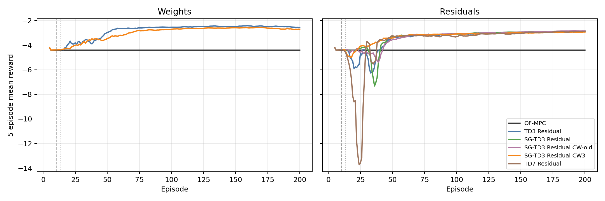
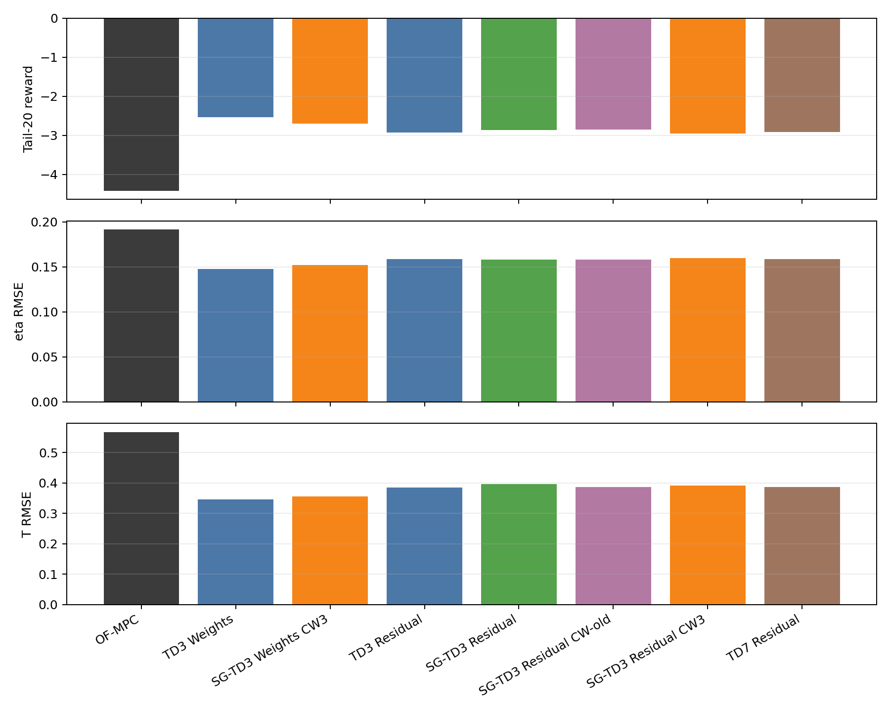
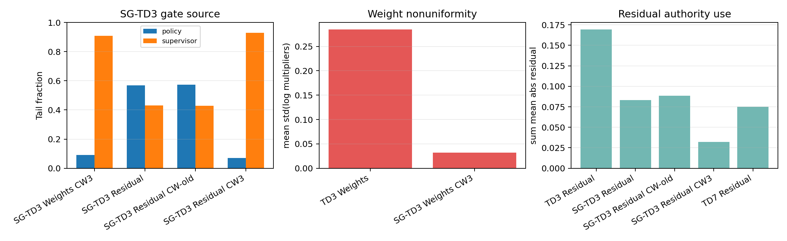
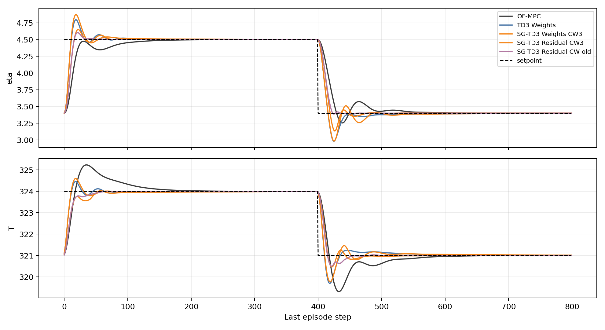

# Latest Polymer SG-TD3 Weight And Residual Analysis

Date: 2026-06-01  
Case study: polymer CSTR  
Scenario: `run_mode = "disturb"`  
Methods: supervisor-gated TD3 weight multipliers and residual corrections with conservative critic-warm-3 release

## Objective

This report analyzes the two latest polymer SG-TD3 runs:

- `Polymer/Results/sg_td3_residual_critic_warm3_conservative_disturb/20260601_182754/input_data.pkl`
- `Polymer/Results/sg_td3_weights_critic_warm3_conservative_disturb/20260601_184718/input_data.pkl`

The question is whether the new implementation and runner-local configs were successful. The answer is split:

- Implementation and config success: yes. Both runs used the intended SG-TD3 wrappers, disabled BC/handoff/ramp/probation-style handrails, and used the 3-subepisode critic-only/action-freeze release window.
- Control-performance success versus OF-MPC: yes. Both latest SG-TD3 runs beat OF-MPC in tail reward and tail tracking.
- Ranking versus the strongest previous polymer RL runs: not yet. Both latest runs are conservative and do not beat the best existing runs in their families.
- Steady-state protection: yes in the saved runs. In the final steady windows, the latest SG-TD3 weight and residual CW3 runs select the supervisor on `100%` of steps, giving identity weights and essentially zero residual action.

## Files Inspected

Implementation and configuration:

- `RL_assisted_MPC_weights_supervisor_gated_td3_critic_warm_unified.py`
- `RL_assisted_MPC_residual_supervisor_gated_td3_critic_warm_unified.py`
- `RL_assisted_MPC_weights_unified.py`
- `RL_assisted_MPC_residual_supervisor_gated_td3_unified.py`
- `utils/weights_runner.py`
- `utils/residual_runner.py`
- `TD3Agent/supervisor_gated_agent.py`
- `TD3Agent/supervisor_replay_buffer.py`
- `utils/supervisor_gated_action.py`

Data bundles:

| Method | Bundle |
| --- | --- |
| OF-MPC | `Polymer/Data/mpc_results_dist.pickle` |
| TD3 Weights | `Polymer/Results/td3_weights_disturb/20260520_214118/input_data.pkl` |
| SG-TD3 Weights CW3 | `Polymer/Results/sg_td3_weights_critic_warm3_conservative_disturb/20260601_184718/input_data.pkl` |
| TD3 Residual | `Polymer/Results/td3_residual_disturb/20260601_021504/input_data.pkl` |
| SG-TD3 Residual | `Polymer/Results/sg_td3_residual_disturb/20260601_022723/input_data.pkl` |
| SG-TD3 Residual CW-old | `Polymer/Results/sg_td3_residual_critic_warm_disturb/20260601_140709/input_data.pkl` |
| SG-TD3 Residual CW3 | `Polymer/Results/sg_td3_residual_critic_warm3_conservative_disturb/20260601_182754/input_data.pkl` |
| TD7 Residual | `Polymer/Results/td7_residual_disturb/20260601_022931/input_data.pkl` |

Generated analysis artifacts:

| Artifact | Purpose |
| --- | --- |
| `report/scripts/analyze_polymer_sg_td3_latest_20260601.py` | Reproducible metric and figure generation |
| `report/figures/polymer_sg_td3_latest_20260601/performance_summary.csv` | Tail and post-warm performance metrics |
| `report/figures/polymer_sg_td3_latest_20260601/steady_state_summary.csv` | Final-subepisode steady-window metrics |
| `report/figures/polymer_sg_td3_latest_20260601/weight_diagnostics.csv` | Weight multiplier and SG source diagnostics |
| `report/figures/polymer_sg_td3_latest_20260601/residual_diagnostics.csv` | Residual authority and safety diagnostics |
| `report/figures/polymer_sg_td3_latest_20260601/gate_diagnostics.csv` | SG critic-score diagnostics |
| `report/figures/polymer_sg_td3_latest_20260601/steady_gate_diagnostics.csv` | Final steady-window SG source diagnostics |
| `report/figures/polymer_sg_td3_latest_20260601/recovery_summary.csv` | Post-warm recovery metrics |
| `report/figures/polymer_sg_td3_latest_20260601/analysis_summary.json` | Machine-readable combined summary |

## Current Method

The polymer plant output and manipulated input are

$$ y_k=[\eta_k,T_k]^\top,\qquad u_k=[Q_{c,k},Q_{m,k}]^\top. $$

The disturbed offset-free MPC baseline remains the inner controller. SG-TD3 only chooses between a learned actor action and a supervisor action in the same normalized action space.

For the weight run, the actor action is four-dimensional:

$$ a^{w}_k\in[-1,1]^4,\qquad m_k=m_{\min}+\frac{a^{w}_k+1}{2}\odot(m_{\max}-m_{\min}). $$

The new weight run uses

$$ m_{\min}=[0.75,0.75,0.75,0.75]^\top,\qquad m_{\max}=[2.0,2.0,2.0,2.0]^\top. $$

The identity weight supervisor is the raw action corresponding to `m = 1`, not the zero raw action:

$$ a_{\mathrm{id}}=2\frac{\mathbf{1}-m_{\min}}{m_{\max}-m_{\min}}-\mathbf{1}=[-0.6,-0.6,-0.6,-0.6]^\top. $$

For the residual run, the actor action is two-dimensional:

$$ a^{r}_k\in[-1,1]^2,\qquad \Delta u_{\mathrm{res},k}=\ell+\frac{a^{r}_k+1}{2}\odot(h-\ell). $$

The new residual run uses

$$ \ell=[-0.25,-0.25]^\top,\qquad h=[0.25,0.25]^\top. $$

The residual supervisor is the zero-residual raw action.

For both SG-TD3 runs, the gate scores the actor and supervisor candidates by a conservative twin-critic score:

$$ S(s,a)=\min(Q_1(s,a),Q_2(s,a))-\rho_Q|Q_1(s,a)-Q_2(s,a)|-\kappa_{\mathrm{sup}}\|a-a_{\mathrm{sup}}\|_2^2-\kappa_{\mathrm{prev}}\|a-a_{\mathrm{prev}}\|_2^2. $$

The actor is selected only when

$$ S(s_k,a_{\mathrm{policy},k})>S(s_k,a_{\mathrm{sup},k})+\epsilon_A. $$

Both latest conservative runners used `epsilon_A = 0.5`, `rho_Q = 0.5`, `kappa_sup = 0.05`, and `kappa_prev = 0.01`. Both used 10 warm-start episodes, then 3 action-freeze and actor-freeze subepisodes.

## Configuration Audit

The latest weight bundle records:

- `agent_kind = "sg_td3"`
- `notebook_source = "RL_assisted_MPC_weights_supervisor_gated_td3_critic_warm_unified.py"`
- `post_warm_start_action_freeze_subepisodes = 3`
- `post_warm_start_actor_freeze_subepisodes = 3`
- `behavioral_cloning.enabled = False`
- `behavioral_cloning.handoff.enabled = False`
- `td3_authority_ramp.enabled = False`
- `weight_safety.reward_probation.enabled = False`
- `weight_safety.shadow_identity_mpc.enabled = False`

The latest residual bundle records:

- `agent_kind = "sg_td3"`
- `notebook_source = "RL_assisted_MPC_residual_supervisor_gated_td3_critic_warm_unified.py"`
- `post_warm_start_action_freeze_subepisodes = 3`
- `post_warm_start_actor_freeze_subepisodes = 3`
- `behavioral_cloning.enabled = False`
- `behavioral_cloning.handoff.enabled = False`
- `td3_authority_ramp.enabled = False`
- `residual_authority_enabled = False`
- `authority_use_rho = False`
- `append_rho_to_state = False`
- `residual_zero_deadband_enabled = False`
- `residual_safety.early_release_guard.enabled = False`

This confirms that the new runner-local configs were applied as intended.

## Main Quantitative Results

Tail metrics use the final 20 subepisodes.

| Method | Mean reward | Worst post-warm | Tail-20 reward | Final reward | Tail eta RMSE | Tail T RMSE | Tail eta MAE | Tail T MAE | Tail mean abs du |
| --- | --- | --- | --- | --- | --- | --- | --- | --- | --- |
| OF-MPC | -4.412 | -4.418 | -4.417 | -4.417 | 0.1917 | 0.5678 | 0.0646 | 0.2654 | 0.0179 |
| TD3 Weights | -2.858 | -4.488 | -2.536 | -2.638 | 0.1477 | 0.3461 | 0.0412 | 0.1044 | 0.0221 |
| SG-TD3 Weights CW3 | -3.034 | -4.404 | -2.703 | -2.743 | 0.1519 | 0.3559 | 0.0462 | 0.1145 | 0.0226 |
| TD3 Residual | -3.455 | -8.799 | -2.927 | -2.858 | 0.1585 | 0.3851 | 0.0353 | 0.1167 | 0.0902 |
| SG-TD3 Residual | -3.374 | -9.812 | -2.870 | -2.827 | 0.1583 | 0.3962 | 0.0342 | 0.0989 | 0.0472 |
| SG-TD3 Residual CW-old | -3.368 | -6.212 | -2.852 | -2.832 | 0.1580 | 0.3873 | 0.0328 | 0.0924 | 0.0496 |
| SG-TD3 Residual CW3 | -3.320 | -5.822 | -2.956 | -2.983 | 0.1597 | 0.3919 | 0.0398 | 0.1071 | 0.0243 |
| TD7 Residual | -3.720 | -23.532 | -2.915 | -2.908 | 0.1585 | 0.3866 | 0.0359 | 0.1203 | 0.0419 |

The SG-TD3 weight run is a clear improvement over OF-MPC: tail reward improves from `-4.417` to `-2.703`, eta RMSE improves from `0.1917` to `0.1519`, and temperature RMSE improves from `0.5678` to `0.3559`. This is a successful OF-MPC improvement. The qualification is only relative to the latest standard TD3 weight run, which reaches tail reward `-2.536`.

The SG-TD3 residual CW3 run is also better than OF-MPC: tail reward improves from `-4.417` to `-2.956`, eta RMSE improves from `0.1917` to `0.1597`, and temperature RMSE improves from `0.5678` to `0.3919`. This is also a successful OF-MPC improvement. The qualification is only relative to the earlier residual SG-TD3 variants, whose tail rewards are `-2.870` and `-2.852`.

## Post-Warm Recovery

| Method | Warm mean | Worst post-warm | Worst episode | First ep above OF-MPC | First 5 above OF-MPC | Tail20 delta | Final delta |
| --- | --- | --- | --- | --- | --- | --- | --- |
| TD3 Weights | -4.298 | -4.488 | 22 | 11 | 11 | 1.882 | 1.780 |
| SG-TD3 Weights CW3 | -4.298 | -4.404 | 14 | 11 | 11 | 1.714 | 1.674 |
| TD3 Residual | -4.298 | -8.799 | 32 | 11 | 42 | 1.490 | 1.559 |
| SG-TD3 Residual | -4.298 | -9.812 | 34 | 11 | 21 | 1.548 | 1.590 |
| SG-TD3 Residual CW-old | -4.298 | -6.212 | 36 | 11 | 11 | 1.565 | 1.585 |
| SG-TD3 Residual CW3 | -4.298 | -5.822 | 14 | 11 | 21 | 1.461 | 1.434 |
| TD7 Residual | -4.298 | -23.532 | 22 | 11 | 26 | 1.502 | 1.509 |

The strongest positive evidence for the latest residual config is post-warm robustness. The worst post-warm reward improves from `-8.799` for TD3 residual, `-9.812` for original SG-TD3 residual, and `-6.212` for the earlier critic-warm residual run to `-5.822` for the new CW3 run. That means the conservative release did what it was supposed to do: it reduced the depth of the release transient.

The cost is that the learned residual is released much less often, and the tail reward is worse than the earlier SG-TD3 residual runs.

## Weight Diagnostics

| Method | Tail policy | Tail supervisor | Tail multipliers mean | Tail common std | Tail boundary | Post identity source | Tail cap projection | Tail fallback |
| --- | --- | --- | --- | --- | --- | --- | --- | --- |
| TD3 Weights | NA | NA | [1.510, 1.637, 1.273, 1.502] | 0.2848 | 35.0% | NA | 0.0% | 0.0% |
| SG-TD3 Weights CW3 | 9.1% | 90.9% | [1.026, 1.055, 1.028, 0.983] | 0.0320 | 6.7% | 93.1% | 0.0% | 0.0% |

The latest SG-TD3 weight run avoided the distillation-style lower-bound collapse. Its tail mean multipliers are close to identity rather than `[0.75, 0.75, 0.75, 0.75]`. That is good.

However, it is very conservative. The policy is selected only `9.1%` of tail steps, and the tail multipliers are nearly common-scale identity multipliers. The mean standard deviation of `log(m)` across the four multipliers is only `0.0320`, compared with `0.2848` for standard TD3 weights. Since useful weight control usually comes from changing relative penalties, not nearly common identity scaling, this explains why the run improves OF-MPC but underperforms TD3 weights.

## Residual Diagnostics

| Method | Tail policy | Tail supervisor | Tail residual mean abs | Tail residual q95 abs | Tail full-bound | Tail cap projection | Tail guard | Tail headroom | Tail zero fallback |
| --- | --- | --- | --- | --- | --- | --- | --- | --- | --- |
| TD3 Residual | NA | NA | [0.1020, 0.0674] | [0.2500, 0.2500] | 7.7% | 0.0% | 0.0% | 0.0% | 0.0% |
| SG-TD3 Residual | 56.9% | 43.1% | [0.0437, 0.0395] | [0.2500, 0.2500] | 6.2% | 0.0% | 0.0% | 1.1% | 0.0% |
| SG-TD3 Residual CW-old | 57.2% | 42.8% | [0.0446, 0.0437] | [0.2469, 0.2499] | 4.9% | 0.0% | 0.0% | 0.2% | 0.0% |
| SG-TD3 Residual CW3 | 7.1% | 92.9% | [0.0150, 0.0172] | [0.2460, 0.2500] | 5.2% | 0.0% | 0.0% | 0.0% | 0.0% |
| TD7 Residual | NA | NA | [0.0442, 0.0309] | [0.2472, 0.2457] | 5.3% | 0.0% | 0.0% | 0.0% | 0.0% |

The latest residual CW3 run is much quieter than the earlier residual variants. Tail mean absolute residuals drop to `[0.0150, 0.0172]`, compared with `[0.0446, 0.0437]` for the earlier critic-warm run and `[0.1020, 0.0674]` for TD3 residual.

That quietness is not caused by a cap, early-release guard, headroom projection, or zero fallback in the tail. Those fractions are all `0.0%` for the latest CW3 run. It is caused by the SG-TD3 gate choosing the zero-residual supervisor on `92.9%` of tail steps.

## Final Steady-State Error

The steady-window audit uses the final 100 steps before each setpoint switch or episode end in the last subepisode. For this schedule those windows are `300-399` and `700-799`.

| Method | Windows | Steps | Eta MAE | T MAE | Eta RMSE | T RMSE | Eta mean signed | T mean signed |
| --- | --- | --- | --- | --- | --- | --- | --- | --- |
| OF-MPC | 300-399; 700-799 | 200 | 0.000191 | 0.001320 | 0.000231 | 0.001622 | 0.000019 | -0.000247 |
| TD3 Weights | 300-399; 700-799 | 200 | 0.002836 | 0.011731 | 0.003133 | 0.012448 | -0.001192 | 0.003659 |
| SG-TD3 Weights CW3 | 300-399; 700-799 | 200 | 0.003048 | 0.015500 | 0.003310 | 0.016830 | -0.001153 | 0.005863 |
| TD3 Residual | 300-399; 700-799 | 200 | 0.001299 | 0.035343 | 0.002006 | 0.048084 | 0.001286 | -0.032593 |
| SG-TD3 Residual | 300-399; 700-799 | 200 | 0.000299 | 0.001163 | 0.000328 | 0.001413 | 0.000299 | -0.000699 |
| SG-TD3 Residual CW-old | 300-399; 700-799 | 200 | 0.000363 | 0.001101 | 0.000382 | 0.001192 | 0.000363 | -0.001052 |
| SG-TD3 Residual CW3 | 300-399; 700-799 | 200 | 0.001379 | 0.006994 | 0.001506 | 0.007645 | 0.001379 | -0.006994 |
| TD7 Residual | 300-399; 700-799 | 200 | 0.001966 | 0.056497 | 0.002067 | 0.080083 | -0.000963 | -0.056497 |

Near setpoint, OF-MPC still has the smallest eta MAE. The earlier SG-TD3 residual runs are closest to OF-MPC in steady temperature error. The latest residual CW3 run remains much better than raw TD3 residual and TD7 residual near steady state, but it is not as close to OF-MPC as the earlier SG residual variants.

The important steady-state mechanism is visible in the SG source logs, not only in the tracking-error table. The latest CW3 runs fall back completely to the supervisor in the final steady windows:

| Method | Windows | Steady policy | Steady supervisor | Steady adv mean | Steady adv q95 | Steady action summary |
| --- | --- | --- | --- | --- | --- | --- |
| SG-TD3 Weights CW3 | 300-399; 700-799 | 0.0% | 100.0% | -0.266 | 0.228 | m mean [1.000000, 1.000000, 1.000000, 1.000000] |
| SG-TD3 Residual | 300-399; 700-799 | 41.0% | 59.0% | -0.002 | 0.011 | mean abs du_res [0.00423967, 0.00232571] |
| SG-TD3 Residual CW-old | 300-399; 700-799 | 22.0% | 78.0% | -0.001 | 0.004 | mean abs du_res [0.00092050, 0.00151251] |
| SG-TD3 Residual CW3 | 300-399; 700-799 | 0.0% | 100.0% | -0.067 | 0.021 | mean abs du_res [0.00000012, 0.00000006] |

This supports the intended steady-state argument. The latest weight CW3 controller uses identity multipliers at steady state, and the latest residual CW3 controller uses essentially zero residual action. Therefore the RL layer is not injecting a persistent learned bias at steady state in these runs. The formal guarantee is conditional: it holds when the gate selects the supervisor and the offset-free MPC target remains feasible. Empirically, that condition is met on `100%` of the audited final steady-window steps for both latest CW3 runs.

## Gate Score Diagnostics

| Method | Post policy | Post supervisor | Tail policy | Tail supervisor | Tail adv mean | Tail adv q95 | Policy q-gap | Supervisor q-gap |
| --- | --- | --- | --- | --- | --- | --- | --- | --- |
| SG-TD3 Weights CW3 | 6.9% | 93.1% | 9.1% | 90.9% | 0.896 | 2.449 | 0.624 | 0.586 |
| SG-TD3 Residual | 41.9% | 58.1% | 56.9% | 43.1% | 0.647 | 0.934 | 0.254 | 0.275 |
| SG-TD3 Residual CW-old | 39.7% | 60.3% | 57.2% | 42.8% | 0.620 | 0.551 | 0.344 | 0.362 |
| SG-TD3 Residual CW3 | 7.1% | 92.9% | 7.1% | 92.9% | 0.577 | 1.750 | 0.399 | 0.338 |

The latest two CW3 runs have similar behavior: the gate heavily prefers the supervisor. This is not a software failure. It is the intended consequence of a positive margin, critic-disagreement penalty, supervisor-distance penalty, and no supervisor actor loss. This is beneficial near steady state because it prevents a persistent learned residual or non-identity weight bias. The practical issue is only that the same conservatism limits performance if the goal is to match or beat the best previous polymer RL runs.

## Bugs, Inconsistencies, And Risks Found

1. The SG-TD3 wrappers and configs were applied correctly.
   The saved metadata confirms the latest runs came from the intended wrapper files and not from the base notebook defaults.

2. The latest SG-TD3 weight run does not collapse to the lower multiplier corner.
   This is a useful improvement over the distillation weight failure mode. The tail multiplier mean is near identity, not the lower bound.

3. The latest SG-TD3 weight run is likely under-releasing relative to the best TD3 weight run.
   Policy selection is only `9.1%` in the tail, and the multipliers are close to common identity scaling. This limits the weight supervisor's authority, but it still beats OF-MPC clearly.

4. The latest SG-TD3 residual run reduced post-warm collapse and preserved steady-state fallback.
   Worst post-warm reward improved to `-5.822`, and final steady-window supervisor selection is `100%`. Tail reward is still lower than the earlier SG residual critic-warm result, `-2.956` versus `-2.852`.

5. `weight_action_source_log` labels SG supervisor identity execution as `identity_fallback`.
   This is not a closed-loop bug, but it is a diagnostic naming issue. For SG-TD3 weights, source analysis should use `sg_selected_source_log`; otherwise intended supervisor choices can be confused with error fallbacks.

6. These are single-seed training rollouts.
   The report should not claim generalization. The runs are useful for mechanism diagnosis, not final algorithm ranking.

## Interpretation

The new implementation succeeded as a conservative release mechanism. It stopped obvious unsafe release behavior, avoided safety-layer intervention in the tail, improved both latest runs over OF-MPC, and reduced the residual post-warm collapse depth.

The new implementation did not yet succeed as the best polymer controller configuration. The conservative gate is too reluctant to execute the policy if the benchmark is the strongest prior RL run rather than OF-MPC. For weights, this produces near-identity multipliers and gives up some of the TD3 weight benefit. For residuals, this gives a very quiet zero-supervisor-dominated policy that improves OF-MPC and protects steady state, but trails the earlier SG residual settings in tail reward.

The best one-sentence summary is:

The latest polymer SG-TD3 configs are successful conservative OF-MPC-improving ablations with strong steady-state fallback, but they are not yet tuned as the highest-performance polymer RL settings.

## Literature Connections

No new literature citations were added. This is an internal empirical audit of saved simulation bundles. If this result is later moved into a paper section, the relevant literature links remain safe RL action filtering, residual RL for process control, and MPC weight adaptation. Those citations should be added only from verified local bibliography entries or checked sources.

## Recommended Next Experiments

1. Run a softer SG-TD3 gate for polymer weights.
   Change `advantage_margin` from `0.5` to `0.2` or `0.1`, keep the 3-subepisode critic warm window, and keep BC/handoff disabled. Success means tail policy selection rises above `20%` without boundary collapse, and tail reward approaches or exceeds standard TD3 weights `-2.536`.

2. Add a common-mode penalty or normalized weight parameterization.
   The weight run is safe but close to identity. Penalize common-mode `mean(log m)` or parameterize relative ratios so useful nonuniform penalty changes are easier than common scaling. Success means tail `std(log m)` rises above `0.10` while cap projection and fallback remain near zero.

3. Test an intermediate residual release margin.
   Compare residual CW3 with `advantage_margin = 0.25` and the same critic-warm-3 window. Success means worst post-warm reward stays better than `-6.212` while tail reward moves back toward the earlier SG residual value `-2.852`.

4. Save a frozen-policy evaluation pass.
   The current runs are training rollouts. A fair next result should evaluate OF-MPC, TD3 weights, SG-TD3 weights CW3, earlier SG residual, and SG residual CW3 under the same disturbance and setpoint schedule without exploration.

5. Clean up source labels for SG-TD3 weights.
   Add a distinct `identity_supervisor` or `supervisor_identity` code to `weight_action_source_codes`, while preserving `sg_selected_source_log` for policy-versus-supervisor analysis.

## Remaining Uncertainty

The conclusions are based on saved single-run bundles and no plant reruns. The SG-TD3 critics are evaluated only through the logged training rollout. It is still possible that a different seed or frozen evaluation would change the relative ranking, but the mechanism conclusion is clear: the latest CW3 configs are deliberately conservative and are currently under-releasing the learned policy.
