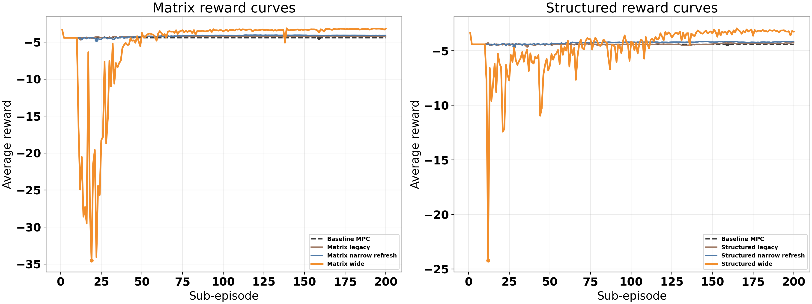
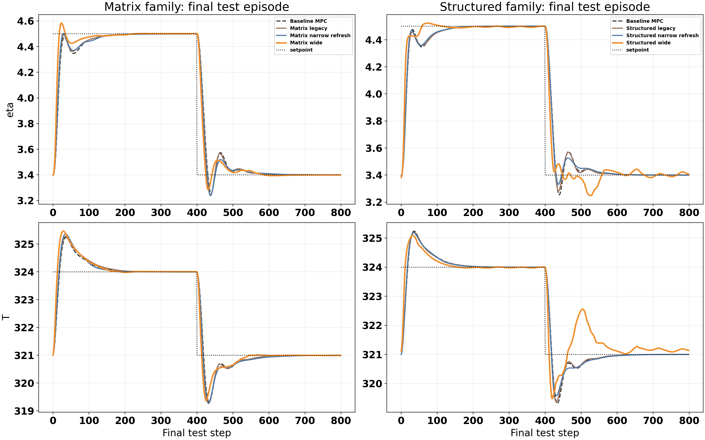
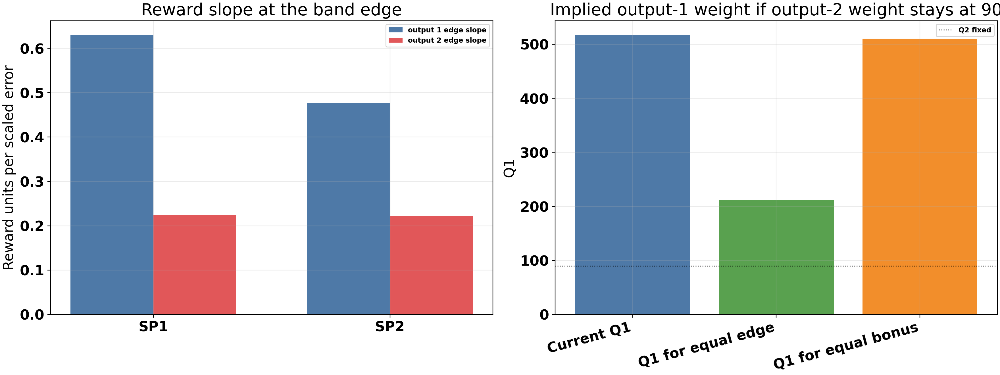
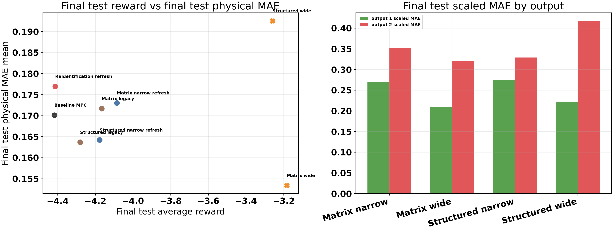
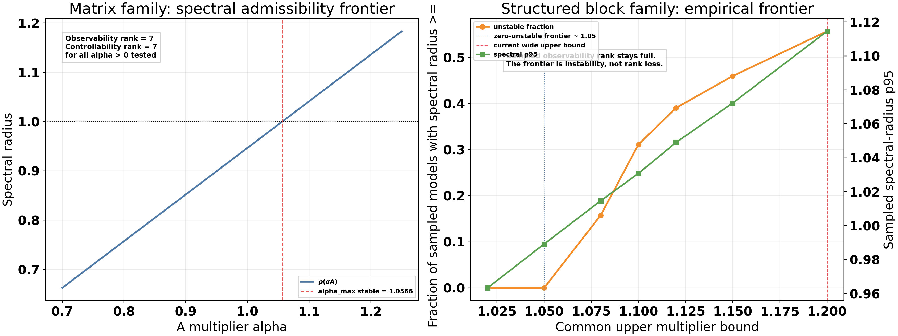
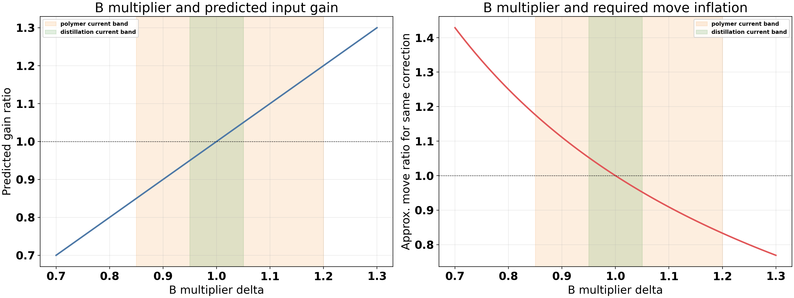
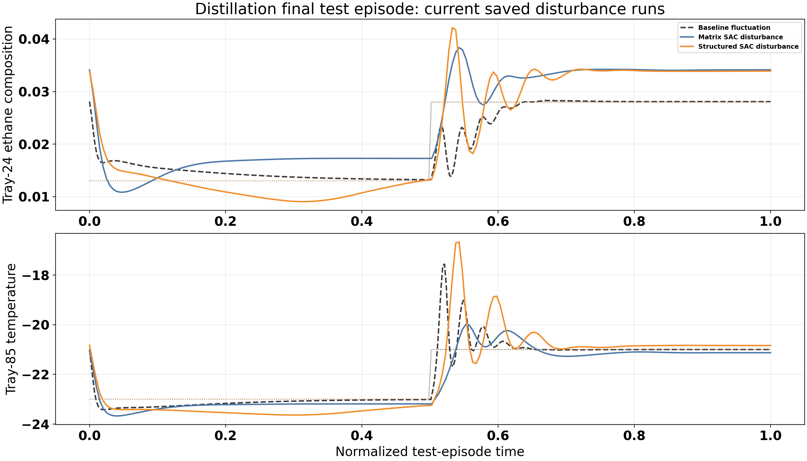
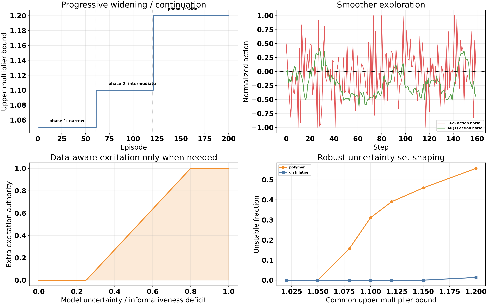
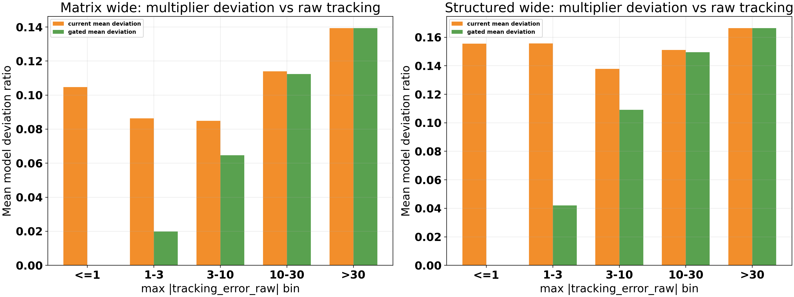
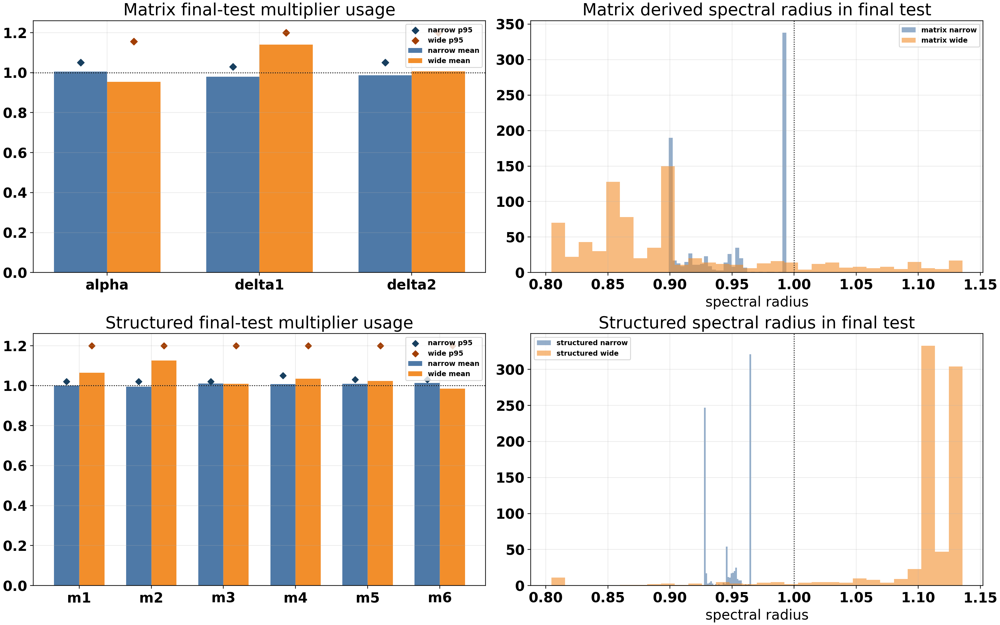

# Polymer Wide-Range Matrix and Structured Report With Distillation Counterpart

Date: 2026-04-21

This report focuses on the latest widened-range polymer matrix and structured-matrix runs, then extends the same admissibility and design logic to the distillation column as a cross-system counterpart.

The goal is to answer five questions with data from the saved runs and the shared polymer model:

1. Why did the widened matrix/structured methods improve, and why did reidentification still fail?
2. What reward is actually used in polymer, and how should it be changed if both outputs should matter more evenly?
3. Is there a mathematical way to set the multiplier range, instead of widening blindly?
4. Why do the wide runs first degrade and then recover, and how can residual-style ideas help?
5. Is polymer reidentification still worth pursuing, or is it currently dominated by direct multiplier methods?

## Run Set

| Run | Saved bundle | run_mode | state_mode | observer | base_state_norm | mismatch_transform | range_profile | update_family | disturbance consistent |
| --- | --- | --- | --- | --- | --- | --- | --- | --- | --- |
| Baseline MPC | `Polymer/Data/mpc_results_dist.pickle` | disturb | n/a | n/a | n/a | n/a | n/a | n/a | yes |
| Matrix legacy | `Polymer/Results/td3_multipliers_disturb/20260411_011134/input_data.pkl` | disturb | mismatch | n/a | n/a | n/a | n/a | n/a | yes |
| Matrix narrow refresh | `Polymer/Results/td3_multipliers_disturb/20260420_234944/input_data.pkl` | disturb | mismatch | legacy_previous_measurement | running_zscore_physical_xhat | signed_log | n/a | n/a | yes |
| Matrix wide | `Polymer/Results/td3_multipliers_disturb/20260421_011145/input_data.pkl` | disturb | mismatch | legacy_previous_measurement | running_zscore_physical_xhat | signed_log | n/a | n/a | yes |
| Structured legacy | `Polymer/Results/td3_structured_matrices_disturb/20260409_193654/input_data.pkl` | disturb | mismatch | n/a | n/a | n/a | tight | block | yes |
| Structured narrow refresh | `Polymer/Results/td3_structured_matrices_disturb/20260420_235100/input_data.pkl` | disturb | mismatch | legacy_previous_measurement | running_zscore_physical_xhat | signed_log | tight | block | yes |
| Structured wide | `Polymer/Results/td3_structured_matrices_disturb/20260421_013208/input_data.pkl` | disturb | mismatch | legacy_previous_measurement | running_zscore_physical_xhat | signed_log | wide | block | yes |
| Reidentification refresh | `Polymer/Results/td3_reidentification_disturb/20260420_234346/input_data.pkl` | disturb | mismatch | legacy_previous_measurement | running_zscore_physical_xhat | signed_log | n/a | n/a | yes |

All compared runs use the same polymer disturbance schedule. The saved `qi`, `qs`, and `ha` arrays in the result bundles are numerically identical to the baseline schedule, so the widened-range comparison is not confounded by different disturbances.

## Main Comparison

| Run | Tail phys MAE | Final test phys MAE | Final test out1 MAE | Final test out2 MAE | Final test reward | Final-10 reward | Final test input move |
| --- | --- | --- | --- | --- | --- | --- | --- |
| Baseline MPC | 0.1701 | 0.1701 | 0.0674 | 0.2729 | -4.4174 | -4.4173 | 0.0305 |
| Matrix legacy | 0.1722 | 0.1717 | 0.0645 | 0.2789 | -4.1667 | -4.1908 | 0.0310 |
| Matrix narrow refresh | 0.1728 | 0.1730 | 0.0627 | 0.2833 | -4.0860 | -4.0888 | 0.0306 |
| Matrix wide | 0.1592 | 0.1534 | 0.0494 | 0.2574 | -3.1837 | -3.2069 | 0.0338 |
| Structured legacy | 0.1671 | 0.1637 | 0.0651 | 0.2623 | -4.2805 | -4.3062 | 0.0317 |
| Structured narrow refresh | 0.1673 | 0.1642 | 0.0637 | 0.2647 | -4.1771 | -4.1885 | 0.0294 |
| Structured wide | 0.1537 | 0.1925 | 0.0521 | 0.3330 | -3.2593 | -3.2519 | 0.0702 |
| Reidentification refresh | 0.1767 | 0.1770 | 0.0678 | 0.2862 | -4.4135 | -4.4127 | 0.0325 |

- Matrix wide is the strongest run in this study. Final test physical MAE drops from `0.1730` in the previous narrow refresh to `0.1534` (-11.3%), beating both the legacy matrix run `0.1717` and baseline MPC `0.1701`.
- Structured wide is mixed. Its overall late-run tail MAE improves from `0.1673` to `0.1537`, but the held-out final test gets worse: `0.1642` to `0.1925` (+17.2%).
- Reidentification still fails to convert the richer RL state into better control. Its final test MAE remains `0.1770`, worse than matrix wide and worse than baseline MPC.

The reward curves show the same pattern in both wide runs: a severe early deterioration followed by recovery to a better late-stage reward than the narrow runs. The matrix wide trough is deeper (`-34.5039` at episode `19`) than the structured wide trough (`-24.2145` at episode `12`), but both recover only much later, around episodes `139` and `141` respectively.

## Final Test Episode

Matrix wide improves both outputs in the held-out test episode: output 1 MAE falls from `0.0627` to `0.0494`, and output 2 MAE falls from `0.2833` to `0.2574`.
Structured wide does not. Output 1 improves from `0.0637` to `0.0521`, but output 2 gets substantially worse: `0.2647` to `0.3330`. This is why the final test mean degrades even though the overall late-run tail and reward look better.

## Why Matrix Wide Worked And Reidentification Did Not

The latest matrix result is successful because the controller is allowed to choose from a small, direct, always-realized model family. There is no identification gate between the action and the prediction model used by MPC. The action changes three smooth multipliers and the model correction is immediately available to the optimizer on every step.

In the final test episode, matrix wide mainly uses a damped `A` correction and a stronger first-input `B` correction: `alpha` mean is `0.9536`, while `delta1` mean is `1.1400` and its p95 reaches `1.2000`. That is a coherent low-dimensional correction, not a noisy online identification problem.

Reidentification is fundamentally different. The policy may request strong blend authority, but the online identification engine almost never produces an admissible new model. In the latest polymer reidentification run, candidate-valid fraction is only `0.0011` and update-success fraction is only `0.0002`. Median condition number is `185509.1` and p95 is `2199603.2`. So reidentification is bottlenecked by data informativity and numerical conditioning, not by the policy alone.

This difference matches the literature. The direct multiplier methods behave like bounded parametric adaptation inside a fixed low-dimensional family. Reidentification, by contrast, needs persistently informative data and a numerically healthy regression problem. The adaptive MPC and identification literature repeatedly stresses persistence of excitation, targeted excitation, and dual control/experiment design as prerequisites for successful online model maintenance [Berberich2022] [Heirung2015] [Heirung2017] [Oshima2024].

## The Polymer Reward Actually Used

The RL notebooks do not use a plain `Q = [5, 1]` quadratic reward. They use the shared relative-band reward from `utils/rewards.py` with setpoint-dependent bands, inside-band gating, linear edge penalties, and an inside-band bonus.

$$
r_t = \Big(-\sum_i e^{\mathrm{eff}}_{i,t} - \sum_i \ell_{i,t} - \sum_j m_{j,t} + \sum_i b_{i,t}\Big) \cdot \texttt{reward\_scale}
$$

where the output balance depends on the scaled band

$$
\text{band}_{i,t} = \frac{\max(k_{\mathrm{rel},i}|y^{sp}_{i,t}|,\; \text{band\_floor}_{i})}{y^{max}_i - y^{min}_i},
\qquad
\text{slope at edge}_i = 2 Q_i \cdot \text{band}_{i,t}.
$$

So the relevant output balance is not just the raw `Q_diag`. It is `Q_diag` filtered through the setpoint-dependent band width.

| Setpoint | Output | Physical setpoint | Band (phys) | Band (scaled) | Edge slope | Bonus prefactor |
| --- | --- | --- | --- | --- | --- | --- |
| SP1 | out1 | 4.500 | 0.0135 | 0.06091 | 0.6310 | 0.1345 |
| SP1 | out2 | 324.000 | 0.0972 | 0.12437 | 0.2239 | 0.0974 |
| SP2 | out1 | 3.400 | 0.0102 | 0.04602 | 0.4767 | 0.0768 |
| SP2 | out2 | 321.000 | 0.0963 | 0.12322 | 0.2218 | 0.0957 |

If `Q2` stays at `90`, then an edge-equalized `Q1` would be about `212.4`, while a bonus-equalized `Q1` would be about `510.3`. The current `Q1 = 518.0` is therefore almost exactly the bonus-equalized value, not the edge-equalized value.
That is the rigorous explanation for the "even output" issue. Inside the reward band, the outputs are treated much more evenly than the old report implied. But outside the band, output 1 still carries a much steeper correction slope, so the policy can gain reward by helping output 1 more aggressively even when output 2 gets worse.

A practical reward fix depends on what you want to equalize:

- Equal band-edge urgency: move `Q1` toward about `212` while keeping `Q2 = 90`.
- Keep the current inside-band bonus balance: leave `Q1` near about `510` and increase output-2 edge penalties separately.
- Clean implementation: separate inside-band bonus weights from outside-band penalty weights instead of forcing one `Q_diag` to do both jobs.

The saved runs already show this reward tradeoff in the final test episode:

| Run | Final test scaled MAE out1 | Final test scaled MAE out2 | Reward quad out1 | Reward quad out2 | Reward linear out1 | Reward linear out2 | Reward bonus out1 | Reward bonus out2 | Final test input move | Final test reward |
| --- | --- | --- | --- | --- | --- | --- | --- | --- | --- | --- |
| Matrix narrow refresh | 0.2706 | 0.3530 | 3.5152 | 0.4906 | 0.0677 | 0.0335 | 0.0099 | 0.0210 | 0.0306 | -4.0860 |
| Matrix wide | 0.2105 | 0.3198 | 2.6903 | 0.4212 | 0.0507 | 0.0305 | 0.0119 | 0.0188 | 0.0338 | -3.1837 |
| Structured narrow refresh | 0.2751 | 0.3292 | 3.6805 | 0.4387 | 0.0692 | 0.0310 | 0.0278 | 0.0234 | 0.0294 | -4.1771 |
| Structured wide | 0.2227 | 0.4169 | 2.6586 | 0.4779 | 0.0523 | 0.0381 | 0.0051 | 0.0075 | 0.0702 | -3.2593 |

Structured wide improves output 1 sharply: final test scaled MAE drops from `0.2751` to `0.2227`. But output 2 worsens from `0.3292` to `0.4169`. Under the actual polymer reward, the output-1 quadratic and linear penalties both fall materially, while the output-2 penalties rise by less. The reward therefore improves even though the held-out mean physical error gets worse.

## Mathematical Limits For The Multiplier Range

For the plain matrix family, observability and controllability rank are not what limit the range. If the physical model is changed only through `A -> alpha A`, then

$$
\mathcal{O}(\alpha A, C) = \begin{bmatrix} C \\ \alpha C A \\ \alpha^2 C A^2 \\ \vdots \end{bmatrix},
\qquad
\mathcal{C}(\alpha A, B) = \begin{bmatrix} B & \alpha A B & \alpha^2 A^2 B & \cdots \end{bmatrix}.
$$

For any `alpha > 0`, these are just row-wise or column-wise scalings of the nominal observability and controllability matrices, so the rank stays the same. That is exactly what the polymer model shows numerically:

| alpha | rho(alpha A) | obs rank | ctrb rank | obs cond | ctrb cond |
| --- | --- | --- | --- | --- | --- |
| 0.850 | 0.8044 | 7 | 7 | 171.2 | 1136.9 |
| 1.000 | 0.9464 | 7 | 7 | 108.4 | 716.3 |
| 1.200 | 1.1357 | 7 | 7 | 97.1 | 550.0 |

The useful matrix bound comes instead from open-loop spectral admissibility. Since `rho(A_nom) = 0.9464`, requiring `rho(alpha A) < 1` gives `alpha < 1 / rho(A_nom) = 1.0566`. That is the clean analytical upper bound if every candidate prediction `A` must remain open-loop stable.
The lower bound is different. For positive `alpha`, neither observability nor open-loop stability imposes a nontrivial lower bound. So there is no comparable analytical `alpha_min > 0` from these criteria alone. The practical lower bound comes from how much model-speed distortion you are willing to tolerate, not from rank loss.

There are two practical lower-bound rules that do make sense:

1. Trust-region rule: require the relative model change to stay small,

$$
\frac{\|\alpha A - A\|_F}{\|A\|_F} = |\alpha - 1| \le \varepsilon_A
\quad \Rightarrow \quad
\alpha \in [1-\varepsilon_A,\; 1+\varepsilon_A].
$$

2. Time-scale rule: require the dominant spectral radius to stay above a chosen fraction of nominal,

$$
\rho(\alpha A) \ge \kappa \rho(A) \quad \Rightarrow \quad \alpha \ge \kappa,
$$

where `kappa` is a modeling-choice floor such as `0.85` or `0.90`. This is not a stability necessity. It is a way to stop the learned prediction model from becoming unrealistically fast.

For the structured block family, entrywise multipliers can in principle change the rank properties, so a sampled frontier is useful. On the polymer model, however, the sampled positive ranges still keep full observability rank. The frontier is again instability, not rank loss:

| Upper bound | Unstable frac | Near-unit frac | Spectral p95 | Min obs rank | Bad obs frac |
| --- | --- | --- | --- | --- | --- |
| 1.02 | 0.000 | 0.000 | 0.9634 | 7 | 0.000 |
| 1.05 | 0.000 | 0.143 | 0.9892 | 7 | 0.000 |
| 1.08 | 0.158 | 0.381 | 1.0146 | 7 | 0.000 |
| 1.10 | 0.311 | 0.474 | 1.0308 | 7 | 0.000 |
| 1.12 | 0.391 | 0.518 | 1.0490 | 7 | 0.000 |
| 1.15 | 0.460 | 0.566 | 1.0723 | 7 | 0.000 |
| 1.20 | 0.556 | 0.617 | 1.1145 | 7 | 0.000 |
This gives a practical polymer rule. If you want a mostly stable structured family without frequent unstable prediction models, the common upper bound should stay near about `1.05`. By `1.08`, instability already appears. By `1.20`, roughly half the sampled block models are unstable.

## What About The B Multipliers?

The `B` side is different from `A`. In the matrix family the model update is `B(\delta) = B \operatorname{diag}(\delta_1, \delta_2)`. For any strictly positive `delta_j`, controllability rank is preserved for exactly the same reason as above: the controllability matrix is just column-scaled block by block. So, again, rank does not give a useful finite bound.

What `delta_j` changes is the perceived input authority. If `G_ss = C(I-A)^{-1}B` is the steady-state gain, then

$$
G_{ss}(\delta) = G_{ss}\,\operatorname{diag}(\delta_1, \delta_2).
$$

So the predicted output gain of input `j` scales linearly with `delta_j`, while the input move required to get the same correction scales approximately like `1 / delta_j`.

That gives a practical design rule for `B` multipliers:

- Lower bound: choose `delta_min` so the required move inflation `1 / delta_min` still fits inside actuator headroom on representative disturbances.
- Upper bound: choose `delta_max` so the predicted input gain increase stays inside the uncertainty set you are willing to trust, or inside a symmetric trust region such as `|log(delta_j)| <= eps_B`.

For the current defaults, polymer `delta \in [0.85, 1.20]` means the controller is allowed to believe an input is only `85%` as effective or as much as `120%` as effective. In move terms, that means up to about `1.176x` required-move inflation on the low side. Distillation `delta \in [0.95, 1.05]` is much tighter: only about `1.053x` inflation on the low side.

That is why the safest widening order is still `B` before `A`: `B` does not move the open-loop poles, but it does change how hard the MPC will push the actuators. So `B` should be bounded by input-headroom and validation logic, not by spectral radius.

## Distillation Counterpart

The same mathematics does not transfer one-for-one across systems. Distillation is much less fragile than polymer at the model level.

| System | rho(A_nom) | alpha_max stable | Structured unstable frac at 1.20 | Structured p95 spectral at 1.20 |
| --- | --- | --- | --- | --- |
| Polymer | 0.9464 | 1.0566 | 0.556 | 1.1145 |
| Distillation | 0.8383 | 1.1929 | 0.013 | 0.9872 |
Polymer has `alpha_max_stable = 1.0566`, while distillation has `alpha_max_stable = 1.1929`. At the same structured upper bound `1.20`, polymer's sampled unstable fraction is `0.556`, but distillation's is only `0.013`. So distillation is mathematically much more tolerant of multiplier widening than polymer.

However, the currently saved disturbance runs do not yet show that widening alone solves distillation performance. The latest disturbance bundles available in this tree are baseline fluctuation, matrix SAC disturbance, and structured SAC disturbance:

| Run | Final test phys MAE | Final test out1 MAE | Final test out2 MAE | Final test reward | Alpha / spectral usage |
| --- | --- | --- | --- | --- | --- |
| Distillation baseline fluctuation | 0.0954 | 0.0016 | 0.1892 | -0.2651 | n/a |
| Distillation matrix SAC disturbance | 0.1569 | 0.0047 | 0.3091 | -0.5055 | alpha mean 0.9849, p95 0.9943 |
| Distillation structured SAC disturbance | 0.2544 | 0.0042 | 0.5045 | -0.7832 | spectral mean 0.7721, p95 0.7758 |

The current saved disturbance matrix run does not beat baseline (`0.1569` vs `0.0954`), and the current saved structured disturbance run is worse still (`0.2544`). So the distillation section changes the conclusion in an important way: the model-level admissibility landscape is wider, but the currently saved RL policies are not exploiting it well.

That is exactly why the cross-system figure matters. Polymer needs guards because the model family is fragile. Distillation does not need those guards for the same mathematical reason, but it still needs better policy learning and reward alignment before wider ranges will automatically help.

## Why The Wide Runs First Degrade And Then Recover

The early deterioration is consistent with a larger action/model-search space. Widening the multiplier ranges expands the set of prediction models the agent can induce. Early in training, the replay buffer is dominated by low-quality exploratory transitions from this larger space, so the policy gets worse before it learns which stronger corrections are actually useful. Once enough informative transitions accumulate, the policy recovers and starts exploiting the wider authority.

The control literature and RL literature both suggest practical fixes:

- Progressive widening / continuation: instead of jumping directly from narrow to wide bounds, increase the bounds in stages once reward, solver success, and held-out tracking have stabilized [Seo2025].
- Smoother exploration: use temporally coherent exploration rather than step-to-step jagged action noise [Korenkevych2019].
- Data-aware excitation only when needed: if model learning is part of the method, add excitation only when uncertainty is high or the data are not informative enough [Heirung2015] [Heirung2017] [Oshima2024].
- Robust uncertainty-set shaping: treat the multiplier family as an uncertainty set and grow that set only while feasibility and worst-case behavior remain acceptable [Chen2024] [Limon2013] [Kothare1996].

The four panels in the figure are not copied from the papers. They are explanatory plots built from the mechanisms those papers discuss, translated into this project's setting.

What each paper-backed idea means here in concrete terms:

- Progressive widening / continuation: widen the allowed multiplier range in phases. In this repo, that means promoting `high_coef` and the structured range profile only after held-out MAE, fallback rate, and p95 multiplier saturation are acceptable. This directly addresses the early degradation seen in the wide polymer reward curves.
- Smoother exploration: replace jagged per-step multiplier noise with temporally coherent exploration, so the replay buffer contains locally consistent trajectories rather than violent model jumps. In practical terms, use an autoregressive action-noise process or a slower parameter-noise refresh for matrix and structured agents.
- Data-aware excitation only when needed: make extra exploration or model-learning authority a function of uncertainty or poor informativeness. In this repo, that can be the same mismatch-based gate used for residual-style authority, but applied to exploration amplitude or reidentification authority instead of directly to `u_res`.
- Robust uncertainty-set shaping: use the admissibility frontier to decide whether a candidate range should even be trainable. The polymer structured frontier shows why a uniform `1.20` upper bound is too wide as a default uncertainty set, while the distillation frontier shows that the same number is not equally dangerous there.

A practical implementation in this repository would be:

1. Start from the current narrow run.
2. Continue training with an intermediate range first, not with the full wide range.
3. Use a smoothed exploration process for the multiplier action.
4. Gate extra exploration or multiplier authority by mismatch magnitude when the trajectory is already near setpoint.
5. Only promote to the next wider range if held-out MAE improves and p95 multiplier use is not already saturating.
6. Stop widening when the held-out episode stops improving or the sampled spectral statistics cross the chosen admissibility limit.

## Residual-Style Gating For Matrix And Structured Multipliers

The saved wide runs show another practical issue. The policy keeps the model far from nominal even when the band-normalized raw tracking error is already small. That is exactly the situation where the residual method's deadband idea can help.

Use the same raw mismatch feature already logged in mismatch mode:

$$
\tau_t = \max_i |\mathrm{tracking\_error\_raw}_{i,t}|.
$$

Because `tracking_error_raw` is already normalized by the tracking scale, `tau_t \le 1` means the outputs are inside the reward band. Then apply a residual-style gate to the multiplier deviation:

$$
g_t = \begin{cases}
0, & \tau_t \le 1, \\
1 - \exp(-k(\tau_t - 1)), & \tau_t > 1,
\end{cases}
\qquad
m^{eff}_t = 1 + g_t (m^{rl}_t - 1).
$$

The same equation applies to structured multipliers `theta_t`. This keeps the policy free to make large corrections when tracking is bad, but collapses back toward the nominal model near setpoint.

| Run | Tracking bin | Count | Current mean deviation | Gated mean deviation |
| --- | --- | --- | --- | --- |
| Matrix wide | <=1 | 346 | 0.1047 | 0.0000 |
| Matrix wide | 1-3 | 113 | 0.0864 | 0.0198 |
| Matrix wide | 3-10 | 91 | 0.0849 | 0.0647 |
| Matrix wide | 10-30 | 132 | 0.1139 | 0.1124 |
| Matrix wide | >30 | 118 | 0.1393 | 0.1393 |
| Structured wide | <=1 | 101 | 0.1555 | 0.0000 |
| Structured wide | 1-3 | 199 | 0.1557 | 0.0421 |
| Structured wide | 3-10 | 219 | 0.1378 | 0.1090 |
| Structured wide | 10-30 | 146 | 0.1511 | 0.1496 |
| Structured wide | >30 | 135 | 0.1664 | 0.1664 |
In the current wide matrix run, the mean deviation in the low-tracking bin is still about `0.1047`, and `52.9%` of low-tracking test steps still deviate from nominal by more than `0.1`. The structured-wide run is even more aggressive. The gate figure shows that a deadband plus exponential gate would cut that low-tracking authority sharply without changing the high-tracking regime nearly as much.

This is the cleanest way to borrow the residual idea here. The same mismatch signal and the same authority logic can be reused, but the action being gated is the model deviation instead of a residual control move.

## How Far Can The Range Be Widened Safely?

The nominal polymer physical `A` has spectral radius `0.9464`. In the final test episode, matrix wide already reaches a derived p95 spectral radius of `1.0934` and max `1.1357`. Structured wide is more aggressive still: mean spectral radius is `1.1054`, p95 is `1.1357`, max is `1.1357`, and several structured multipliers hit the hard upper bound `1.2` at p95.

So the answer is different for the two methods:

- Matrix: a slightly wider range may still be worth testing, but not symmetrically. The successful wide matrix policy mainly uses stronger `B` correction and slightly smaller `A`, so the safer next ablation is to widen `B` more than `A`, not to raise every bound uniformly.
- Structured: the current wide run already looks too aggressive for held-out evaluation. It pushes multiple grouped multipliers to `1.2`, keeps the test spectral radius above `1.0` on average, and doubles the final-test input movement from `0.0294` to `0.0702`. Widening further before adding guards is not justified by these results.

With a state-space model in the loop, the practical limit is not a single scalar bound. It is the largest uncertainty set for which the prediction model remains numerically admissible for MPC: stabilizable/detectable enough for the observer-controller pair, solver-feasible, and not so aggressive that held-out performance collapses. Robust MPC literature frames this as keeping the model family inside an uncertainty set where feasibility and robust performance can still be guaranteed or approximated [Chen2024] [Limon2013] [Kothare1996].

For this project, a practical safe-widening recipe is:

1. Keep the current solve fallback for structured wide.
2. Add an explicit spectral-radius cap or smooth fade-back to nominal when the prediction model gets too aggressive.
3. Widen bounds asymmetrically, favoring `B` before `A`.
4. Use a staged widening schedule tied to held-out test MAE and solver/fallback statistics.
5. Treat the empirical limit as reached when p95 multiplier use is already on the hard bound and held-out test performance no longer improves.

## Model-Usage Diagnostics

Matrix wide uses the expanded range in a targeted way. It does not simply saturate everything upward. Instead, it tends to push the first input gain higher while keeping `A` on average below nominal. Structured wide behaves differently: several grouped multipliers have p95 equal to the hard upper bound `1.2`, and the test spectral radius stays above `1.1` on average. That explains why structured wide can still improve reward while giving an over-aggressive held-out trajectory.

## Is Reidentification Useless Now?

For the current polymer implementation, the honest answer is: reidentification is currently dominated, not theoretically useless. The widened direct-multiplier methods are clearly more effective today because they avoid the identification bottleneck and exploit a low-dimensional model family that the MPC can use immediately.

On the evidence in these runs, the research priority should be matrix/structured continuation before polymer reidentification. Matrix wide reaches final-test MAE `0.1534` while reidentification stays at `0.1770` with candidate-valid fraction `0.0011`. Until the identification windowing, excitation, and candidate validation are redesigned, polymer reidentification is not competitive with direct multiplier supervision.

That said, the literature does not support calling reidentification useless in general. It says the opposite: reidentification can work when the controller deliberately creates informative data and validates updates carefully [Berberich2022] [Heirung2015] [Heirung2017] [Oshima2024]. In this project, that means reidentification should be treated as a separate adaptive-control problem, not as a drop-in replacement for multiplier tuning.

## Conclusions

- The latest matrix wide run is genuinely more successful than the previous matrix runs. Its final test MAE `0.1534` beats the previous narrow refresh `0.1730`, the legacy matrix run `0.1717`, and baseline MPC `0.1701`.
- Structured wide is not a clean success. It improves late-run reward and aggregate tail MAE, but its held-out final test MAE degrades from `0.1642` to `0.1925` because it over-optimizes the first output relative to the evaluation metric and becomes much more aggressive on the prediction model and control effort.
- The actual polymer reward is bonus-balanced more than edge-balanced. If both outputs should matter more evenly in evaluation, the most direct reward fix is to reduce `Q1` toward about `212` or to separate inside-band bonus weights from outside-band penalty weights.
- For the matrix family, observability and controllability do not bound positive `alpha`; the meaningful analytical upper bound is `alpha < 1.0566` if all candidate `A` matrices must stay open-loop stable. There is no comparable analytical lower bound, so the lower side should be chosen by a trust-region or time-scale rule. For `B`, the useful bounds are about gain-trust and actuator headroom, not spectral stability.
- Distillation is mathematically much less fragile than polymer: `alpha_max_stable` is `1.1929` instead of `1.0566`, and the structured unstable fraction at `1.20` is only `0.013` instead of `0.556`. But the currently saved disturbance RL runs still do not beat the distillation baseline, so wider admissibility alone is not enough.
- The degradation-then-recovery pattern is expected after abrupt widening. The most practical fix is staged widening, smoother exploration, mismatch-gated authority, and uncertainty-set shaping before wider training ranges are accepted.
- Polymer reidentification is currently dominated by the widened direct-multiplier methods and should be deprioritized until the identification layer itself is redesigned around informative-window generation and candidate validation.

## Sources

- [Berberich2022] Forward-looking persistent excitation in model predictive control.
- [Heirung2015] MPC-based dual control with online experiment design.
- [Heirung2017] Dual adaptive model predictive control.
- [Oshima2024] Targeted excitation and re-identification methods for multivariate process and model predictive control.
- [Korenkevych2019] Autoregressive Policies for Continuous Control Deep Reinforcement Learning.
- [Seo2025] Continuous Control with Coarse-to-fine Reinforcement Learning.
- [Chen2024] Robust model predictive control with polytopic model uncertainty through System Level Synthesis.
- [Limon2013] Robust feedback model predictive control of constrained uncertain systems.
- [Kothare1996] Robust constrained model predictive control using linear matrix inequalities.

[Berberich2022]: https://doi.org/10.1016/j.automatica.2021.110033
[Heirung2015]: https://doi.org/10.1016/j.jprocont.2015.04.012
[Heirung2017]: https://doi.org/10.1016/j.automatica.2017.01.030
[Oshima2024]: https://doi.org/10.1016/j.jprocont.2024.103190
[Korenkevych2019]: https://www.ijcai.org/proceedings/2019/0382.pdf
[Seo2025]: https://proceedings.mlr.press/v270/seo25a.html
[Chen2024]: https://doi.org/10.1016/j.automatica.2023.111431
[Limon2013]: https://doi.org/10.1016/j.jprocont.2012.08.003
[Kothare1996]: https://doi.org/10.1016/0005-1098(96)00063-5