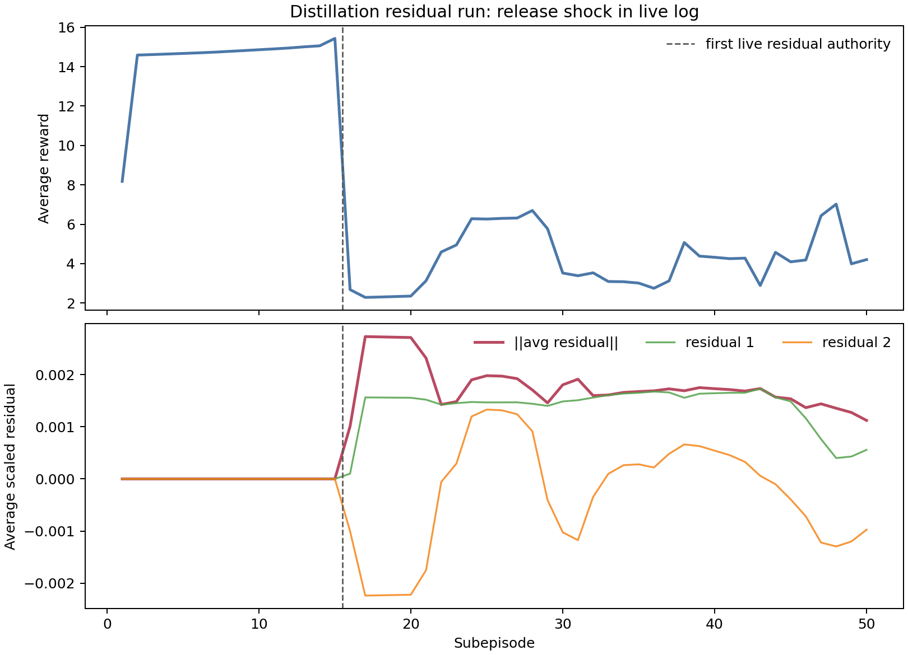
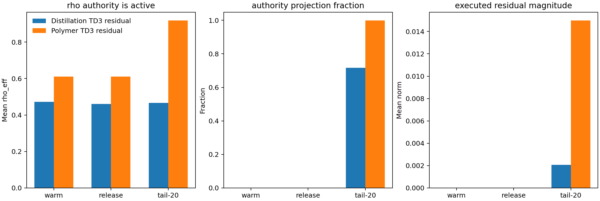
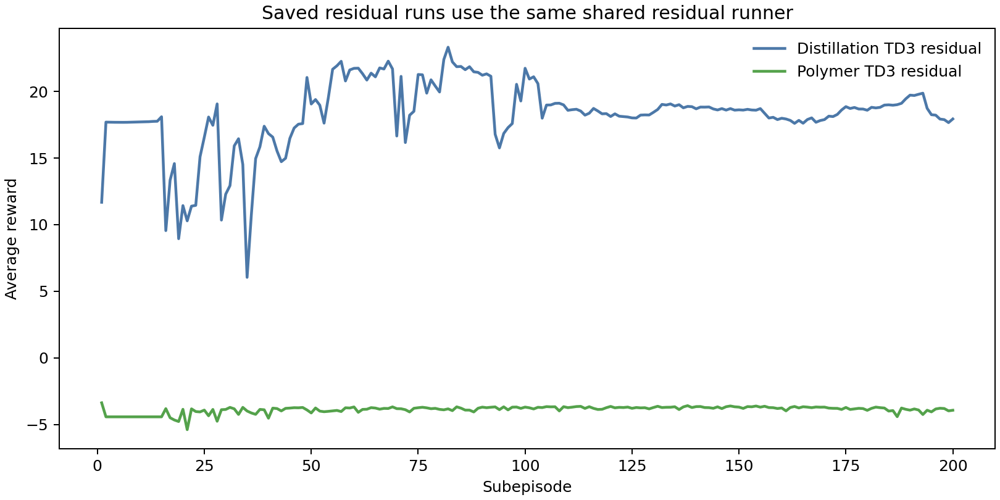

# Residual Algorithm Audit For Polymer And Distillation

Date: 2026-05-18

## Objective

Audit whether the polymer and distillation residual notebooks use the same residual-control methodology, and interpret the current distillation residual behavior reported from the live notebook run.

The immediate concern is whether the residual `rho` authority mechanism is actually functional, because the live distillation run shows a sharp reward drop when residual actions become nonzero.

## Files and runs inspected

Implementation:

- `utils/residual_runner.py`
- `utils/residual_authority.py`
- `RL_assisted_MPC_residual_unified.ipynb`
- `distillation_RL_assisted_MPC_residual_unified.ipynb`
- `systems/polymer/notebook_params.py`
- `systems/distillation/notebook_params.py`

Saved result bundles:

- distillation: `Distillation/Results/distillation_residual_td3_disturb_fluctuation_mismatch_rho_unified/20260507_212833/`
- polymer: `Polymer/Results/td3_residual_disturb/20260501_000607/`

Live-run evidence:

- the first `50` subepisodes pasted from the current distillation residual run.

## Shared method

Both polymer and distillation residual notebooks use the same shared runner:

`run_residual_supervisor(residual_cfg, runtime_ctx)`

The residual controller first solves the nominal offset-free MPC problem and then lets RL add a residual move:

$$ u_{\mathrm{base},k} = \mathrm{MPC}(x_k, y_{\mathrm{sp},k}) $$

$$ u_{\mathrm{applied},k} = u_{\mathrm{base},k} + \Delta u_{\mathrm{res},k}. $$

The actor outputs a raw action `a_raw` in `[-1, 1]`, which is mapped to residual bounds:

$$ \Delta u_{\mathrm{res,raw},k} = \ell + \frac{a_{\mathrm{raw},k}+1}{2}(h-\ell). $$

When `state_mode = "mismatch"`, the residual action is projected through the rho authority mechanism before execution:

$$ \Delta u_{\mathrm{res,exec},k} = \mathrm{clip}(\Delta u_{\mathrm{res,raw},k}, \Delta u_{\min,k}, \Delta u_{\max,k}). $$

The authority interval is based on the nominal MPC move size and the tracking-dependent rho:

$$ \rho_k = 1 - \exp(-k_\rho \lVert e_{\mathrm{track},k} \rVert_\infty). $$

$$ \rho_{\mathrm{eff},k} = \rho_{\min} + (1-\rho_{\min})\rho_k^{p}. $$

$$ \lvert \Delta u_{\mathrm{res},k} \rvert \le \rho_{\mathrm{eff},k}\,\beta_{\mathrm{res}}\left(\lvert \Delta u_{\mathrm{MPC},k}\rvert + d u_{0,\mathrm{res}}\right). $$

Both active notebooks pass the rho settings into `residual_cfg`, and both saved bundles contain:

- `authority_use_rho = True`
- `append_rho_to_state = True`
- `rho_mapping_mode = "exp_raw_tracking"`
- `rho_log`
- `rho_eff_log`
- `projection_due_to_authority_log`
- `delta_u_res_raw_log`
- `delta_u_res_exec_log`

So the rho mechanism is not missing.

## Cross-case default comparison

| Setting | Polymer residual | Distillation residual |
| --- | ---: | ---: |
| shared runner | yes | yes |
| `state_mode` | `mismatch` | `mismatch` |
| `authority_use_rho` | `True` | `True` |
| `append_rho_to_state` | `True` | `True` |
| `authority_beta_res` | `[0.5, 0.5]` | `[0.3, 0.3]` |
| `authority_du0_res` | `[0.001, 0.001]` | `[0.003, 0.003]` |
| `authority_rho_floor` | `0.15` | `0.20` |
| action freeze after warm start | `5` subepisodes | `5` subepisodes |
| actor freeze after warm start | `5` subepisodes | `5` subepisodes |
| behavioral cloning | executed-action target | executed-action target |

The methodology is shared, but not numerically identical. Distillation has a smaller `beta_res` but a larger `du0_res` and higher rho floor. That means when the nominal MPC move is small, distillation can still allow a baseline residual authority of about:

$$ 0.2 \times 0.3 \times 0.003 = 1.8\times 10^{-4} $$

per input, and more when tracking error increases.

## Live distillation behavior

The first `15` live subepisodes are effectively zero-residual:

- mean reward over episodes `1:15`: `14.3943`
- mean residual norm over episodes `1:15`: `2.59e-9`

At subepisode `16`, residual authority becomes visible:

- reward drops from `15.4328` at subepisode `15` to `2.6813` at subepisode `16`
- mean residual norm over episodes `16:20`: `2.38e-3`
- maximum residual norm over episodes `16:50`: `2.73e-3`

This timing matches the configured release schedule:

- `warm_start = 10`
- `post_warm_start_action_freeze_subepisodes = 5`
- residual actions become live at approximately subepisode `16`

So the first interpretation should not be "rho is absent." The sharper interpretation is:

The residual policy is released after a long zero-action phase, and the first nonzero residual move is harmful for the distillation column.

## Saved-run rho diagnostics

The saved distillation and polymer residual runs both show active rho/projection logging.

| Metric | Distillation tail-20 | Polymer tail-20 |
| --- | ---: | ---: |
| mean `rho_eff` | `0.4664` | `0.9181` |
| authority projection fraction | `0.7165` | `0.9990` |
| deadband projection fraction | `0.2794` | `0.0004` |
| raw residual norm | `0.0377` | `0.2783` |
| executed residual norm | `0.0021` | `0.0150` |
| policy-executed raw-action gap | `0.7163` | `0.9926` |

This proves that rho/projection is doing real work: raw actor residuals are much larger than executed residuals, and authority projection is frequently active.

The saved reward traces also show that the residual method can run stably in both case studies under some conditions:

## Why the current distillation run can still fail

The rho mechanism is functional, but it is not a closed-loop safety filter. It does not check whether the residual improves the MPC objective, reward, output tracking, Aspen feasibility margin, or input direction. It only limits residual magnitude based on tracking error and nominal MPC movement.

That leaves several plausible failure modes for the current distillation run:

1. **Release shock after zero-action warm/freeze**

   The actor sees mostly zero/executed-action behavior through warm start and the five frozen subepisodes. At subepisode `16`, it begins to affect the plant. That is a distribution shift.

2. **Rho increases authority when tracking error is large**

   Rho is designed to allow more residual authority away from the setpoint. If the actor's residual direction is wrong, large tracking error can make the harmful action easier to execute, not harder.

3. **Distillation is highly sensitive to small scaled residuals**

   The live residual norm is only around `0.002-0.003`, but the reward collapse is large. This suggests the input-to-output sensitivity and sign of the residual are more important than its norm alone.

4. **The projection is magnitude-only**

   Projection clips the residual into an interval. It does not ask whether the residual points in a direction that helps the tray-24 composition or tray-85 temperature.

5. **Behavioral cloning may anchor the actor to executed residuals, not good residuals**

   The active BC target is `executed_action`. That can reduce wild actor behavior, but if the executed residual is harmful, BC can reinforce a poor local behavior.

## Answer to the rho concern

The rho mechanism is wired and logged. It is not obviously nonfunctional.

But the current design can still allow a harmful residual because rho answers a narrow authority question:

How much residual magnitude is allowed?

It does not answer the control-quality question:

Should this residual direction be executed?

So the current distillation behavior is better interpreted as an authority-policy mismatch than as rho being absent.

## Recommended next changes

For distillation residual, the next change should mirror the Markov lesson: keep residual RL active, but soften and test the handoff.

Recommended implementation direction:

- add residual authority ramp after the freeze window
- add reward-collapse probation that temporarily shrinks residual authority
- log phase, authority scale, and probation status
- add a residual shadow diagnostic that evaluates nominal MPC versus residual-applied first move
- optionally reduce distillation `authority_du0_res` from `[0.003, 0.003]` to `[0.001, 0.001]` for the first release experiment

For analysis of the current run, save and inspect:

- `rho_log`
- `rho_eff_log`
- `delta_u_res_raw_log`
- `delta_u_res_exec_log`
- `projection_due_to_authority_log`
- `projection_due_to_deadband_log`
- `policy_executed_gap_norm_log`
- output tracking errors around subepisodes `15:25`

The key test is whether subepisode `16` has high `rho_eff`, a large policy-executed gap, or a residual sign that pushes the sensitive output away from the setpoint.
