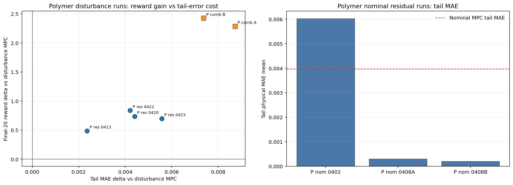
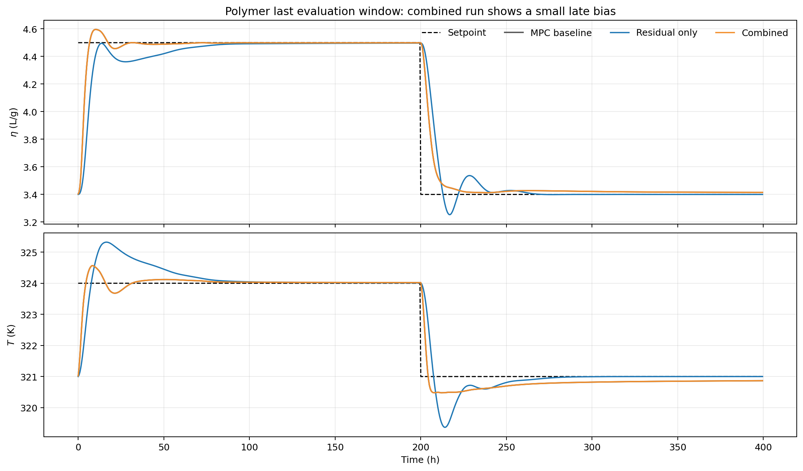
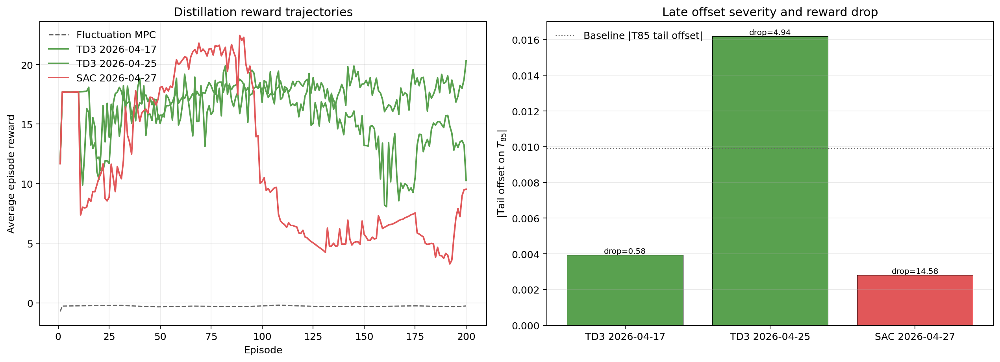
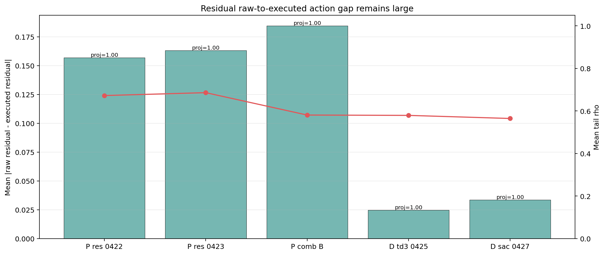

# Residual and Combined Supervisor Progress Review

Date: 2026-04-29

## Objective

This report reviews the saved residual-policy runs for polymer and distillation, with special emphasis on the latest polymer combined runs where the residual agent is active. The aim is to judge whether the methods are working in a control sense, not only whether the scalar RL reward improves.

The analysis is supported by new figures generated from the saved `input_data.pkl` bundles and the corresponding baseline MPC result files. Summary data are saved in `report/figures/residual_and_combined_progress_20260429/residual_and_combined_progress_summary.csv`.

## Files inspected

- `RL_assisted_MPC_residual_unified.ipynb`
- `distillation_RL_assisted_MPC_residual_unified.ipynb`
- `RL_assisted_MPC_combined_unified.ipynb`
- `utils/residual_runner.py`
- `utils/combined_runner.py`
- `utils/residual_authority.py`
- `systems/polymer/notebook_params.py`
- `systems/distillation/notebook_params.py`
- `Polymer/Data/mpc_results_dist.pickle`
- `Polymer/Data/mpc_results_nominal.pickle`
- `Distillation/Data/mpc_results_disturb_fluctuation.pickle`
- polymer residual bundles under `Polymer/Results/td3_residual_nominal/` and `Polymer/Results/td3_residual_disturb/`
- polymer combined bundles under `Polymer/Results/combined_disturb_h_dqn_mismatch__m_td3_mismatch__w_td3_mismatch__r_td3_mismatch_rho/`
- distillation residual bundles under `Distillation/Results/distillation_residual_td3_disturb_fluctuation_mismatch_rho_unified/` and `Distillation/Results/distillation_residual_sac_disturb_fluctuation_mismatch_rho_unified/`

## Method and metrics

The residual controller keeps the MPC action as the base move and adds a bounded RL correction:

$$
u_t^{\mathrm{RL}} = \Pi_{\mathcal{U}}\left(u_t^{\mathrm{MPC}} + \Delta u_t^{\mathrm{res}}\right).
$$

The actor proposes a raw action `a_t^raw`, then the authority layer projects it into the executable envelope:

$$
\Delta u_t^{\mathrm{res,exec}} = \rho_t \Delta u_t^{\mathrm{res,raw}}, \qquad \rho_t \in [\rho_{\min}, 1].
$$

The mismatch residual state uses tracking and innovation terms:

$$
e_t^{\mathrm{trk}} = y_t - y_t^{\mathrm{sp}}, \qquad e_t^{\mathrm{inn}} = y_t - \hat{y}_t.
$$

For the saved refreshed runs, mismatch features are transformed with

$$
\phi(e) = \operatorname{sign}(e)\log(1 + |e|).
$$

Setpoints were reconstructed in physical coordinates from the saved min-max scaling and steady-state offsets. The main tracking metric is the tail physical MAE over the late part of each setpoint segment:

$$
\mathrm{MAE}_{\mathrm{tail}} = \frac{1}{|\mathcal{T}_{\mathrm{late}}|n_y} \sum_{t \in \mathcal{T}_{\mathrm{late}}} \|y_t - y_t^{\mathrm{sp}}\|_1.
$$

The late offset vector is

$$
\bar{e}_{\mathrm{tail}} = \frac{1}{|\mathcal{T}_{\mathrm{late}}|} \sum_{t \in \mathcal{T}_{\mathrm{late}}} \left(y_t - y_t^{\mathrm{sp}}\right).
$$

The reward-degradation metric is

$$
\Delta R_{\mathrm{drop}} = \bar{R}_{\mathrm{best10}} - \bar{R}_{\mathrm{last10}}.
$$

Larger `Delta R_drop` means the run reached a better reward region earlier and then degraded.

## Polymer residual progress

The polymer evidence splits into two separate conclusions.

1. The nominal residual runs after April 8 remove the visible nominal offset.
2. The disturbance residual runs improve reward, but they do not beat the disturbance MPC baseline in tail physical tracking.

Figure interpretation:

- Left panel: every polymer disturbance residual or combined run sits in the reward-positive and tracking-negative quadrant relative to disturbance MPC.
- Right panel: the later nominal residual runs reduce nominal tail MAE well below the nominal MPC reference, which matches the visual observation that nominal offset disappears.

### Polymer residual run summary

| Run | Mode | Tail MAE mean | Delta tail MAE vs matching MPC | Tail offset `[eta, T]` | Final-20 reward | Delta reward vs matching MPC | Reward drop | Tail rho |
| --- | --- | ---: | ---: | --- | ---: | ---: | ---: | ---: |
| `td3_residual_nominal/20260402_174941` | nominal | 0.0060 | +0.0021 | `[0.0024, -0.0077]` | -3.5934 | +15.6676 | 0.0272 | n/a |
| `td3_residual_nominal/20260408_121130` | nominal | 0.0003 | -0.0037 | `[0.0000, -0.0001]` | -3.5446 | +15.7163 | 0.0007 | n/a |
| `td3_residual_nominal/20260408_131932` | nominal | 0.0002 | -0.0038 | `[-0.0000, 0.0001]` | -3.5092 | +15.7517 | 0.0163 | n/a |
| `td3_residual_disturb/20260413_004620` | disturb | 0.0026 | +0.0024 | `[-0.0005, 0.0015]` | -3.9313 | +0.4860 | 0.0573 | 0.7259 |
| `td3_residual_disturb/20260420_225631` | disturb | 0.0047 | +0.0044 | `[0.0017, -0.0067]` | -3.6812 | +0.7362 | 0.0257 | 0.6801 |
| `td3_residual_disturb/20260422_181610` | disturb | 0.0045 | +0.0042 | `[0.0003, -0.0001]` | -3.5788 | +0.8386 | 0.0000 | 0.6723 |
| `td3_residual_disturb/20260423_025802` | disturb | 0.0059 | +0.0056 | `[-0.0018, 0.0071]` | -3.7190 | +0.6984 | 0.0438 | 0.6860 |

### Interpretation

The polymer residual method is therefore only partially successful:

- yes, it solves the nominal offset problem in the later nominal runs
- yes, it learns reward-improving disturbance behavior
- no, the saved disturbance residual runs do not yet show a physical tail-tracking win relative to disturbance MPC

The strongest disturbance residual reward is the April 22 run, with `+0.8386` final-20 reward delta. Even that run has `+0.0042` worse tail MAE than the disturbance MPC baseline. The method should therefore be described as reward-positive but not yet tracking-positive under disturbance.

## Polymer combined runs with residual active

The polymer combined runs are the most important current result because they produce much larger reward gains than residual-only training.

| Run | Tail MAE mean | Delta tail MAE vs disturbance MPC | Tail offset `[eta, T]` | Final-20 reward | Delta reward vs disturbance MPC | Reward drop | Tail rho |
| --- | ---: | ---: | --- | ---: | ---: | ---: | ---: |
| `combined_disturb...rho/20260426_042026` | 0.0090 | +0.0087 | `[0.0006, -0.0015]` | -2.1311 | +2.2863 | 0.0122 | 0.6655 |
| `combined_disturb...rho/20260426_193310` | 0.0077 | +0.0074 | `[0.0008, 0.0036]` | -1.9912 | +2.4261 | 0.0348 | 0.5807 |

Figure interpretation:

- The latest combined run improves reward much more than the residual-only run.
- The same run leaves a small but systematic late bias in the last evaluation window.
- The combined tail MAE is worse than both disturbance MPC and the latest residual-only disturbance run.

This supports the user's observation directly. The combined supervisor is learning according to the shared scalar reward, but the residual-active closed loop is not preserving the near-zero late error of the baseline MPC. The most likely reason is reward-track mismatch across agents. Horizon, model, and weight agents can improve the shared reward through transient and move-shaping effects, while the residual agent still contributes to a biased late trajectory.

The correct claim is not that the combined method failed. The correct claim is narrower: it is the best reward result so far, but it is not yet a clean tracking result.

## Distillation residual degradation and offset

The disturbance distillation residual runs reproduce the two issues described by the user:

1. reward can improve well above the disturbance MPC reward reference and still degrade later
2. a non-negligible late offset can appear, especially in the tray-85 temperature output

Figure interpretation:

- The April 17 TD3 run stays comparatively stable.
- The April 25 TD3 run peaks higher and then degrades, ending with a noticeably larger reward drop and late temperature offset.
- The April 27 SAC run shows an even larger reward collapse from its best-10 window to its last-10 window, even though its final tail physical MAE is better than the disturbance MPC baseline.

That last SAC point matters. It means reward degradation and final physical tail MAE are not the same signal. The degradation is likely tied to reward components, action penalties, or earlier late-training behavior rather than only to the final output trace.

### Distillation disturbance summary

| Run | Agent | Tail MAE mean | Delta tail MAE vs fluctuation MPC | Tail offset `[x24, T85]` | Final-20 reward | Delta reward vs fluctuation MPC | Reward drop | Tail rho |
| --- | --- | ---: | ---: | --- | ---: | ---: | ---: | ---: |
| `20260414_063405` | TD3 | 0.0196 | +0.0145 | `[0.0002, -0.0162]` | -0.3857 | -0.0830 | 0.1644 | 0.9848 |
| `20260415_191909` | SAC | 0.0109 | +0.0058 | `[-0.0012, -0.0196]` | -0.5291 | -0.2264 | 0.2610 | 1.0000 |
| `20260417_181426` | TD3 | 0.0081 | +0.0030 | `[0.0000, -0.0039]` | 18.0986 | +18.4014 | 0.5753 | 0.5774 |
| `20260420_175629` | TD3 | 0.0113 | +0.0062 | `[0.0004, -0.0098]` | 16.0567 | +16.3595 | 1.2601 | 0.7087 |
| `20260425_082259` | TD3 | 0.0085 | +0.0034 | `[0.0005, -0.0162]` | 14.0966 | +14.3993 | 4.9443 | 0.5790 |
| `20260427_194850` | SAC | 0.0025 | -0.0026 | `[-0.0001, -0.0028]` | 5.5393 | +5.8421 | 14.5848 | 0.5645 |

## Projection mismatch is a real mechanism

The figure below summarizes the gap between raw residual actions requested by the actor and the residual actions actually executed after projection.

This is the most important implementation-level diagnosis from the saved runs:

- the mean raw-to-executed residual action gap is large in both polymer and distillation
- tail `rho` values stay far below `1.0` in the more relevant later runs
- projection is active almost continuously in the mismatch disturbance runs

So the actor is learning with a policy output that is consistently collapsed by the safety or authority layer before the plant sees it. That is a plausible explanation for both observed problems:

- polymer combined can improve reward while leaving a small offset
- distillation can peak in reward and then degrade as the actor drifts toward raw actions that are less useful after projection

## Main conclusions

1. Polymer residual is not yet a disturbance-tracking win. It does remove nominal offset in the later nominal runs, and it improves disturbance reward, but its saved disturbance runs still have worse tail physical MAE than disturbance MPC.
2. Polymer combined is the highest-reward result and should stay central in the project narrative. But it currently trades that reward gain for a small late bias and a larger tail MAE than the baseline.
3. Distillation residual has the same deeper issue in another form. Reward can improve, then degrade, and the late output offset can grow, especially in tray-85 temperature.
4. The common technical mechanism is the gap between raw actor output and projected executable residual action.

## Recommended next experiments

### 1. Executed-action anchoring for the residual actor

Purpose: reduce the raw or executed mismatch.

Files:

- `TD3Agent/agent.py`
- `SACAgent/sac_agent.py`
- `utils/residual_runner.py`
- `utils/combined_runner.py`

Proposed change:

$$
\mathcal{L}_{\mathrm{actor}} = -\mathbb{E}[Q(s,\pi(s))] + \lambda_{\mathrm{exec}} \mathbb{E}\left[\|\pi(s) - a^{\mathrm{exec}}\|_2^2\right].
$$

Success signal:

- lower raw-executed gap
- smaller late offset
- no major loss in final-20 reward

Expected scope:

- This is the highest-priority mechanism fix because it directly targets the raw-versus-executed mismatch seen in both polymer and distillation.
- It is likely to help with distillation degradation if projection mismatch is the dominant cause of the late reward collapse.
- It is not guaranteed to fix the distillation problem by itself, because the latest SAC run still needs reward-window decomposition. Part of the degradation may come from reward-term imbalance, critic drift, or changing late-episode behavior rather than only from projection mismatch.

Suggested rollout plan:

1. Add the anchor behind a config flag and log the anchor weight, actor loss split, and raw-executed action gap.
2. Rerun polymer residual only first, because it is the cleanest place to test whether the gap shrinks without multi-agent confounding.
3. Rerun polymer combined second, using the same anchor setting, to see whether the late offset decreases while preserving the large reward gain.
4. Rerun distillation TD3 next, because the April 25 TD3 run is the clearest degradation case with a large late offset.
5. Rerun distillation SAC after that, together with the reward-window diagnostic breakdown, because the latest SAC run has a large reward drop but still ends with better final tail MAE than MPC.

Decision rule:

- If the anchor lowers the raw-executed gap and reduces reward drop or late offset, keep it and tune its strength.
- If the gap improves but the distillation reward still degrades strongly, the next blocker is likely reward design or critic stability rather than projection mismatch alone.

### 2. Near-setpoint offset penalty for polymer combined

Purpose: keep the combined reward gain while removing the small steady-state bias.

Files:

- `systems/polymer/notebook_params.py`
- `utils/rewards.py`
- `utils/combined_runner.py`

Proposed change:

$$
r_t^{\mathrm{offset}} = -\lambda_{\mathrm{off}} \|y_t - y_t^{\mathrm{sp}}\|_1 \mathbf{1}\left\{ \|y_t - y_t^{\mathrm{sp}}\|_{\infty} < \epsilon_{\mathrm{near}} \right\}.
$$

Success signal:

- combined tail MAE moves closer to the residual-only run
- combined late offset decreases without collapsing the reward gain

### 3. Distillation reward-window diagnostic breakdown

Purpose: identify which reward term drives the late collapse.

Files:

- latest TD3 and SAC distillation residual bundles
- `report/scripts/generate_residual_and_combined_progress_assets.py` as an extension point

Proposed outputs:

- per-episode reward-term breakdown
- per-episode tail MAE
- per-episode raw-executed projection gap

Success signal:

- a clear attribution of the late degradation to output error, move penalty, bonus loss, or projection mismatch

## Remaining uncertainty

- The nominal polymer reward comparison is weak because the saved nominal baseline file contains only two reward episodes.
- The latest SAC distillation run has a very large reward drop but a better final tail MAE than fluctuation MPC, so the next diagnostic pass must be windowed by episode rather than judged only from the last episode.
- The combined polymer runs still confound four agents under one reward. A targeted combined ablation with residual disabled would make the source of the late bias easier to isolate.
- Executed-action anchoring is the best current hypothesis-level fix for the distillation degradation mechanism, but the report does not claim it is already proven to solve the full degradation problem.
