# RL State Scaling Diagnostics

Date: 2026-04-20

This report extends the earlier scaling check in four directions:

1. it switches the distillation residual TD3 representative run to the latest saved bundle,
2. it adds a dedicated analysis of the last distillation residual evaluation episode against the standalone baseline MPC,
3. it expands the `VecNormalize` discussion with mathematics and width/sensitivity plots,
4. it compares transform choices for `innovation`, `tracking_error`, and `rho`, then connects them to relevant safe-RL and MPC-shielding literature.

Artifacts generated for this report:

- Figures: [report/rl_state_scaling_diagnostics/figures](./rl_state_scaling_diagnostics/figures)
- CSV summaries: [report/rl_state_scaling_diagnostics/data](./rl_state_scaling_diagnostics/data)
- Reproduction script: [report/generate_rl_state_scaling_report.py](./generate_rl_state_scaling_report.py)

Key CSVs:

- [run_summary.csv](./rl_state_scaling_diagnostics/data/run_summary.csv)
- [raw_mismatch_feature_summary.csv](./rl_state_scaling_diagnostics/data/raw_mismatch_feature_summary.csv)
- [rho_authority_summary.csv](./rl_state_scaling_diagnostics/data/rho_authority_summary.csv)
- [residual_refresh_offline_summary.csv](./rl_state_scaling_diagnostics/data/residual_refresh_offline_summary.csv)
- [distillation_residual_eval_summary.csv](./rl_state_scaling_diagnostics/data/distillation_residual_eval_summary.csv)
- [unified_method_defaults_summary.csv](./rl_state_scaling_diagnostics/data/unified_method_defaults_summary.csv)
- [combined_default_modes_summary.csv](./rl_state_scaling_diagnostics/data/combined_default_modes_summary.csv)
- [method_parameter_summary.csv](./rl_state_scaling_diagnostics/data/method_parameter_summary.csv)

## Scope

Cross-run scaling sample used in the report:

- Distillation:
  - `distillation_horizon_disturb_fluctuation_standard_unified/20260416_192434`
  - `distillation_matrix_sac_disturb_fluctuation_standard_unified/20260415_104840`
  - `distillation_weights_sac_disturb_fluctuation_standard_unified/20260416_192555`
  - `distillation_residual_td3_disturb_fluctuation_mismatch_rho_unified/20260420_180906`
  - `distillation_residual_sac_disturb_fluctuation_mismatch_rho_unified/20260415_191909`
  - `distillation_reidentification_td3_disturb_fluctuation_mismatch_unified/20260418_115020`
- Polymer:
  - `horizon_disturb_unified/20260407_175020`
  - `dueling_horizon_disturb_unified/20260417_035217`
  - `td3_multipliers_disturb/20260411_011134`
  - `td3_weights_disturb/20260417_031734`
  - `td3_residual_disturb/20260413_004620`
  - `td3_reidentification_disturb/20260415_120803`

Additional distillation residual comparison bundles used only for the episode-level section:

- baseline MPC: `distillation_baseline_disturb_fluctuation_unified/20260413_085608`
- previous residual TD3: `distillation_residual_td3_disturb_fluctuation_mismatch_rho_unified/20260417_181426`
- latest residual TD3: `distillation_residual_td3_disturb_fluctuation_mismatch_rho_unified/20260420_180906`
- residual SAC: `distillation_residual_sac_disturb_fluctuation_mismatch_rho_unified/20260415_191909`

All four distillation comparison bundles use the same saved setpoint schedule and the same last evaluation window `79600:80000`.

## Implemented Runtime Refresh

The repo now includes the method-scoped runtime changes discussed in this report:

- shared observation conditioning for mismatch-capable agents with opt-in running z-score normalization on physical `xhat`
- configurable mismatch-feature transforms: `hard_clip`, `soft_tanh`, and `signed_log`
- residual-family-only `rho` redesign inputs and a near-setpoint residual deadband
- an observer-alignment switch for mismatch runners: `legacy_previous_measurement` or `current_measurement_corrector`
- additional result-bundle diagnostics:
  - raw and transformed mismatch logs
  - normalization stats/config
  - `rho_raw`, `rho_mapping_mode`, and `deadband_active`
  - `observer_update_alignment`

Main implementation files:

- [utils/observation_conditioning.py](../utils/observation_conditioning.py)
- [utils/state_features.py](../utils/state_features.py)
- [utils/residual_authority.py](../utils/residual_authority.py)
- mismatch-capable runners under [utils/](../utils/)
- notebook defaults in [systems/polymer/notebook_params.py](../systems/polymer/notebook_params.py) and [systems/distillation/notebook_params.py](../systems/distillation/notebook_params.py)

## How The Diagnostics Were Computed

Base RL state scaling uses the repo min-max mapping:

- `z_mm = 2 * ((x - min_s) / (max_s - min_s)) - 1`

Mismatch extras are reconstructed from the saved logs as:

- `innovation_raw = (y_prev_scaled - yhat_pred) / innovation_scale_ref`
- `tracking_raw = (y_prev_scaled - y_sp) / tracking_scale_now`

For each augmented state and each run, the report computes:

- full-span ratio: `(q95 - q05) / (saved_max - saved_min)`
- late/full ratio: late-window span divided by full-run span
- outside fraction: fraction of steps outside the saved min-max box
- peak/late ratio: early transient peak divided by late steady magnitude

For mismatch runs, it also computes:

- clipped fractions at `|innovation| >= 3` and `|tracking_error| >= 3`
- raw exceedance fractions before clipping
- `rho = 1` fraction
- authority-projection fraction
- executed/raw residual attenuation

The late window is the last quarter of each constant-setpoint segment, clipped between 10 and 30 steps.

## Saved Min/Max Ranges

Distillation saved state bounds:

```text
min_s = [-0.2, -0.2, -0.5, -0.2, -0.5, -1.5, -2.0]
max_s = [ 0.5,  0.5,  1.5,  1.0,  0.1,  1.0,  1.0]
width = [ 0.7,  0.7,  2.0,  1.2,  0.6,  2.5,  3.0]
```

Polymer saved state bounds:

```text
min_s = [-147.8189, -150.3832,  -62.3958,  -82.8958,  -1.5897,  -1.7964,  -1.6054,  -2.7692,  -6.8015]
max_s = [ 222.4886,  218.4708,   36.9137,  120.8246,   2.4171,   2.7129,   2.4163,   3.9945,   6.0797]
width = [ 370.3074,  368.8540,   99.3095,  203.7204,   4.0068,   4.5092,   4.0217,   6.7637,  12.8811]
```

Saved widths:

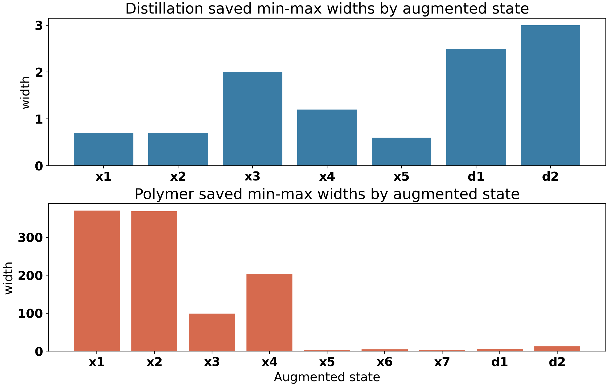

The polymer widths are not just larger. Some are two to three orders of magnitude larger than the distillation widths, so the fixed min-max map is much less sensitive there.

## What "Unified" Means In This Repo And What It Does Not Mean

Your concern is correct: the project uses unified runners and a shared mismatch-state API, but that does not mean every supervisory idea should be unified across all RL-assisted MPC methods.

In this repo, "unified" mostly means:

- shared runner structure
- shared state-builder interfaces
- shared notebook parameter layout
- shared logging/output shape

It does not mean:

- the same agent semantics across horizon, matrix, weights, residual, and reidentification
- the same safety logic across all families
- the same mismatch-state default across polymer and distillation

Method surface from the actual notebook defaults:

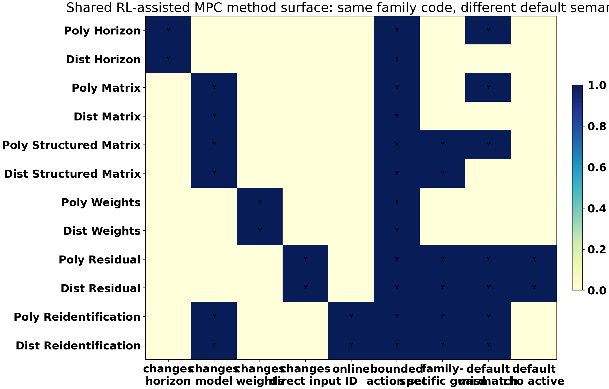

What that figure shows:

- Horizon changes only the MPC horizon grid.
- Matrix and structured-matrix methods change model multipliers, not direct actuator moves.
- Weights changes only the MPC penalty multipliers.
- Residual is the only standalone family that directly perturbs the manipulated inputs after the MPC solve.
- Reidentification is not a residual method. It is an online model-update method with candidate guards and observer/model blending.

So a residual-style supervisory idea such as `rho` authority is structurally aligned only with the residual family, not with every method.

Code paths supporting that:

- horizon grid logic: [utils/horizon_runner.py](../utils/horizon_runner.py)
- matrix multipliers: [utils/matrix_runner.py](../utils/matrix_runner.py)
- structured matrix updates: [utils/structured_matrix_runner.py](../utils/structured_matrix_runner.py)
- weight multipliers: [utils/weights_runner.py](../utils/weights_runner.py)
- residual action projection and `rho`: [utils/residual_runner.py](../utils/residual_runner.py), [utils/residual_authority.py](../utils/residual_authority.py)
- reidentification candidate selection and guards: [utils/reidentification_runner.py](../utils/reidentification_runner.py), [utils/reidentification.py](../utils/reidentification.py)

## The Shared Code Is Already System-Specific In Its Defaults

The default notebook settings are not symmetric between polymer and distillation even when the runner code is shared.

Combined-supervisor defaults:

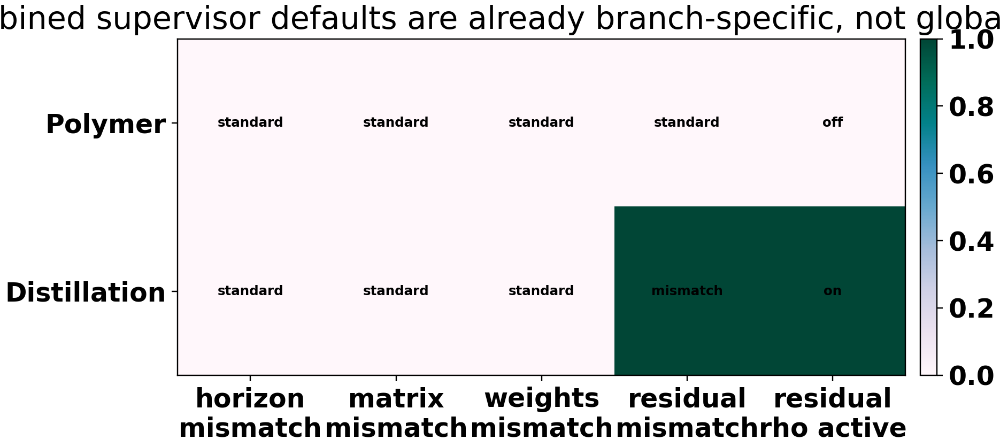

From [combined_default_modes_summary.csv](./rl_state_scaling_diagnostics/data/combined_default_modes_summary.csv):

- Polymer combined defaults:
  - horizon `standard`
  - matrix `standard`
  - weights `standard`
  - residual `standard`
  - residual `rho` authority effectively off by default
- Distillation combined defaults:
  - horizon `standard`
  - matrix `standard`
  - weights `standard`
  - residual `mismatch`
  - residual `rho` authority active by default

That means the unified combined runner already does not treat `rho` as a universal concept. It is only active when the residual branch is in mismatch mode.

This is exactly the right design direction:

- unify the implementation surface
- do not force the same supervisory feature into every branch

## Current Family-Specific Guardrails Are Already Different

The current methods already have different built-in guardrails before adding any new idea like shielding or Lyapunov constraints.

Current default guardrail types:

- Horizon:
  - discrete prediction/control grids
- Matrix:
  - bounded multiplier box around the nominal model
- Structured matrix:
  - bounded multiplier box plus structured update family
- Weights:
  - bounded penalty-multiplier box
- Residual:
  - bounded residual action plus projection against input headroom and optional `rho` authority
- Reidentification:
  - bounded identification action plus candidate guard, condition-number checks, residual-ratio checks, and observer/model blending

This matters because the base project is already RL-assisted MPC.

For horizon, matrix, and weights:

- the agent does not directly bypass MPC
- MPC remains the inner optimization and feasibility mechanism
- a residual-style safety filter is usually not the first thing needed

For residual:

- the agent does directly perturb the final applied input
- so extra residual-specific authority or shielding makes structural sense there

For reidentification:

- the relevant supervision is model-validity and observer-validity logic
- a residual `rho` gate is not the right abstraction

## The Parameter Surface Also Shows Why One Unified `rho` Idea Is Not Enough

Residual-family defaults differ substantially:

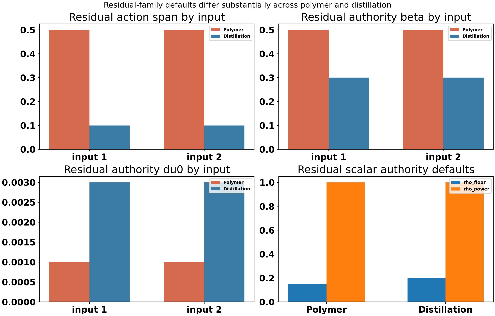

Mismatch/reward scales differ substantially:

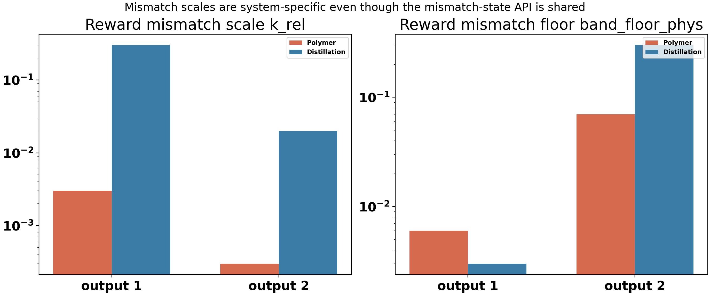

Key numbers from [method_parameter_summary.csv](./rl_state_scaling_diagnostics/data/method_parameter_summary.csv):

- Residual action span:
  - polymer: `0.5` per input
  - distillation: `0.1` per input
- `authority_beta_res`:
  - polymer: `0.5`
  - distillation: `0.3`
- `authority_du0_res`:
  - polymer: `0.001`
  - distillation: `0.003`
- `authority_rho_floor`:
  - polymer: `0.15`
  - distillation: `0.2`
- `k_rel`:
  - polymer: `[0.003, 0.0003]`
  - distillation: `[0.3, 0.02]`
- `band_floor_phys`:
  - polymer: `[0.006, 0.07]`
  - distillation: `[0.003, 0.3]`

Two important implications:

1. The same shared `rho` formula is not operating on the same effective scale in the two systems.
2. Even within the residual family, a parameterization that is reasonable for one system is not automatically reasonable for the other.

So the right interpretation is:

- shared `rho` code path: yes
- one shared `rho` design philosophy across every family and both systems: no

## What Should And Should Not Be Unified

Based on the current repo structure, the right unification split is:

- unify:
  - runner structure
  - mismatch-state builder API
  - logging and diagnostics
  - notebook parameter schema
- do not blindly unify:
  - residual authority logic
  - shielding ideas
  - Lyapunov-style supervision
  - model-validity guards

Method-specific recommendation:

- Horizon:
  - keep grid constraints and MPC feasibility as the main guard
  - if extra supervision is needed, it should be horizon-specific, not residual-style `rho`
- Matrix and structured matrix:
  - keep multiplier boxes as the main hard constraint
  - if extra supervision is needed, use model-validity or spectral diagnostics, not direct residual shielding
- Weights:
  - keep weight boxes as the main hard constraint
  - if extra supervision is needed, use cost-feasibility or move-suppression diagnostics, not `rho`
- Residual:
  - this is the one family where `rho`, deadbands, or shielding ideas naturally fit
- Reidentification:
  - candidate guards, residual-ratio checks, condition-number checks, and observer blending are the right supervision family here

So your point is right:

- because this is already an RL-assisted MPC project, a blanket safety filter or Lyapunov layer on every agent is not the natural first step
- the place where an extra action-space shield makes the most sense is the residual family
- for the other families, the unified MPC layer is already the main stabilizing mechanism, and the more useful next step is family-specific diagnostics and constraints

## `VecNormalize`: What It Is, Why Width Matters, And What The Math Says

Stable Baselines3 `VecNormalize` keeps running per-feature observation statistics and applies an online z-score before the policy sees the state.

In simplified form:

- running mean:
  - `mu_t = mean(o_1, ..., o_t)`
- running variance:
  - `sigma_t^2 = var(o_1, ..., o_t)`
- normalized observation:
  - `z_vn(t) = clip((o_t - mu_t) / sqrt(sigma_t^2 + eps), -clip_obs, clip_obs)`

The important difference from fixed min-max is local sensitivity.

For min-max scaling:

- `z_mm = 2 * ((x - min) / W) - 1`
- `W = max - min`
- local slope:
  - `dz_mm / dx = 2 / W`

So if one saved width `W` is very large, the normalized feature becomes flat:

- a raw change `delta_x` only becomes `delta_z_mm = 2 * delta_x / W`

For running z-score normalization:

- `z_vn = (x - mu_t) / sigma_t`
- local slope:
  - `dz_vn / dx = 1 / sigma_t`

So the sensitivity is set by the current spread of the observation stream, not by one old global extreme.

Project-specific sensitivity figure:

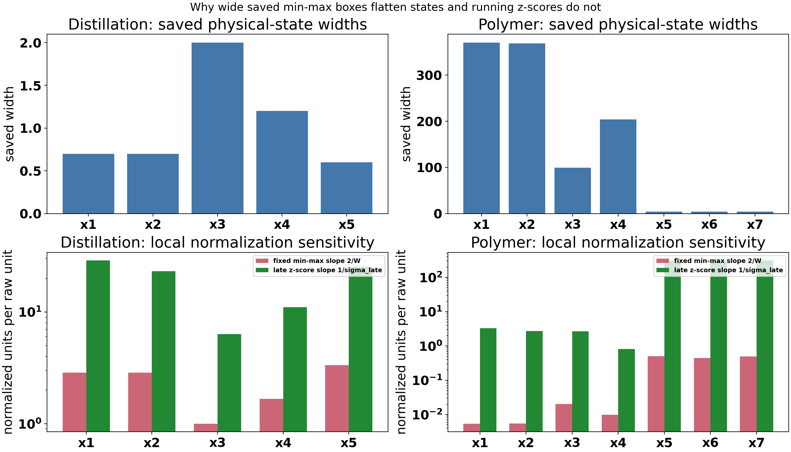

Important numeric examples from the latest distillation residual TD3 run and the polymer residual TD3 run:

- Distillation physical states:
  - fixed min-max slope `2/W` ranges from about `1.0` to `3.33`
  - late-window z-score slope `1/sigma_late` ranges from about `6.34` to `28.86`
  - running normalization is about `6x` to `10x` more sensitive than fixed min-max
- Polymer physical states:
  - fixed min-max slope `2/W` ranges from about `0.0054` to `0.499`
  - late-window z-score slope `1/sigma_late` ranges from about `0.816` to `310.64`
  - running normalization is about `83x` to `676x` more sensitive than fixed min-max
- A concrete polymer example:
  - state `x1` has saved width about `370.3`
  - its fixed min-max slope is only `0.0054`
  - a raw change of `1.0` in that state only moves the normalized value by about `0.0054`

This is the cleanest mathematical explanation of the polymer problem. The box is so wide that late useful motion is flattened.

Project comparison figure:

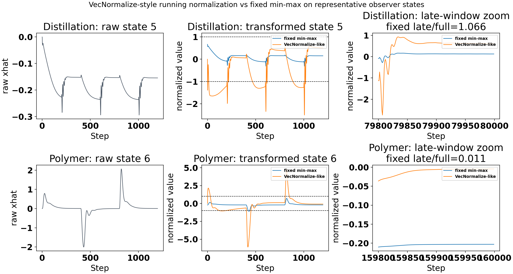

What these two figures imply here:

- distillation does not show a severe base-`xhat` fixed-scaling failure
- polymer does
- the strongest direct use case for `VecNormalize`-style running observation normalization in this repo is polymer physical `xhat`

Implementation note:

- `VecNormalize` should be treated as a policy-input transform
- the running statistics should be learned during training and frozen during evaluation
- feature groups should not all share one blind global normalizer

The natural grouping here is:

- physical `xhat`
- `dhat`
- setpoint and input features
- mismatch extras (`innovation`, `tracking_error`)
- optional `rho`

## Cross-Run Scaling Findings

### 1. Distillation Base `xhat` Scaling Does Not Look Severe

Across the six distillation runs:

- median physical-state late/full ratio is `0.968` to `1.066`
- median `dhat` late/full ratio is `0.947` to `1.036`
- outside-box fraction is zero on five runs and only `0.0158` on the matrix SAC run

Heatmap:

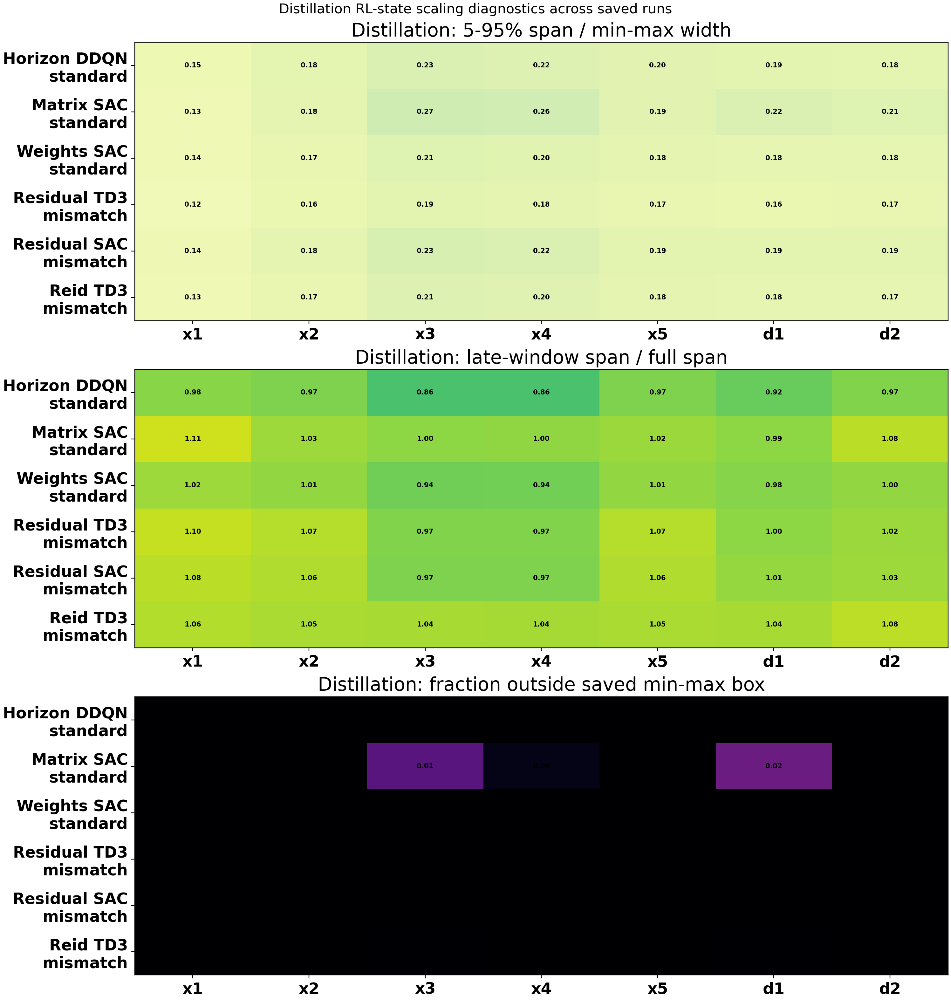

Interpretation:

- the distillation fixed min-max ranges are not making physical `xhat` nearly useless
- late steady-state information is still present in the scaled observer states
- the main distillation problem is not base `xhat`

### 2. Polymer Physical `xhat` Scaling Is Still The Strongest Problem

Across the six polymer runs:

- median physical-state late/full ratio is only `0.0037` to `0.0522`
- median `dhat` late/full ratio stays much larger at `0.852` to `0.967`

Heatmap:

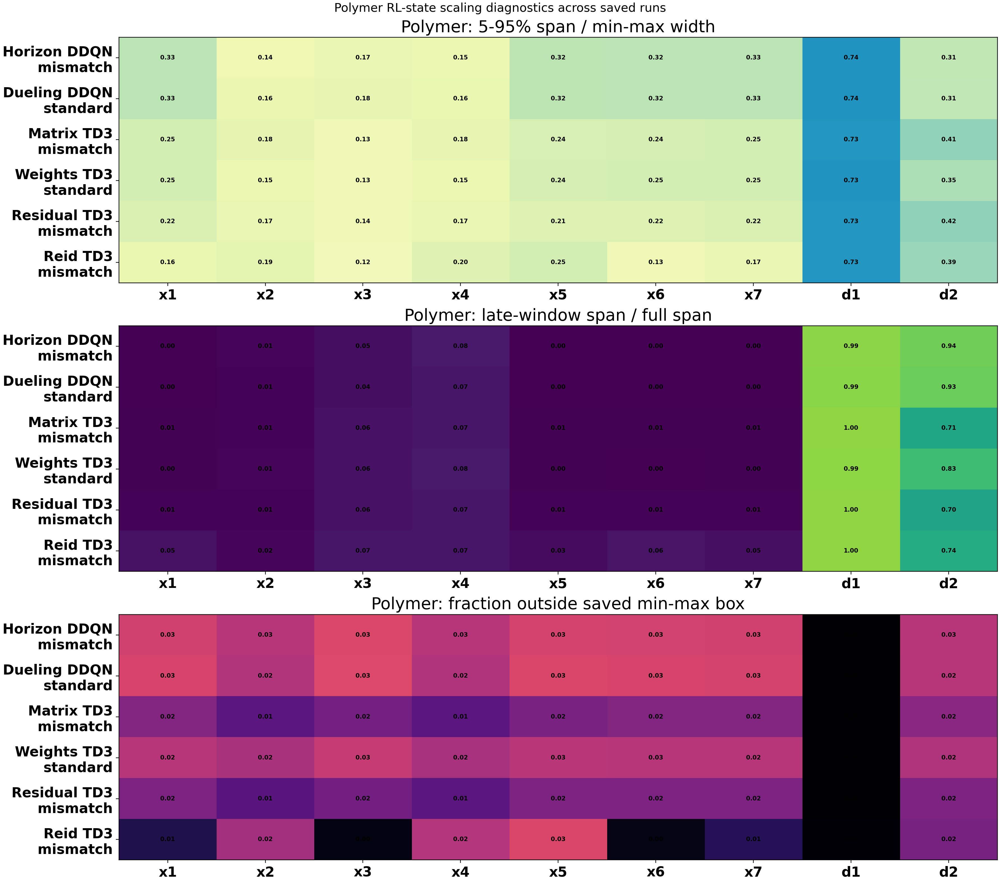

Interpretation:

- polymer physical `xhat` really is being flattened across multiple agent families
- the policy is likely leaning on `dhat`, setpoint/input terms, and mismatch extras much more than on the physical `xhat` block once transients are gone

### 3. Distillation Mismatch Extras Saturate On Some Agents

The latest distillation residual TD3 run is moderate, not catastrophic:

- tracking clip fraction: `10.45%`
- innovation clip fraction: `0.0%`
- `rho = 1` fraction: `41.57%`

But the residual SAC run is severe:

- tracking clip fraction: `68.07%`
- innovation clip fraction: `3.40%`
- `rho = 1` fraction: `97.91%`

The reidentification TD3 run is also nontrivial:

- tracking clip fraction: `12.16%`
- innovation clip fraction: near `0.0%`

Mismatch summary:

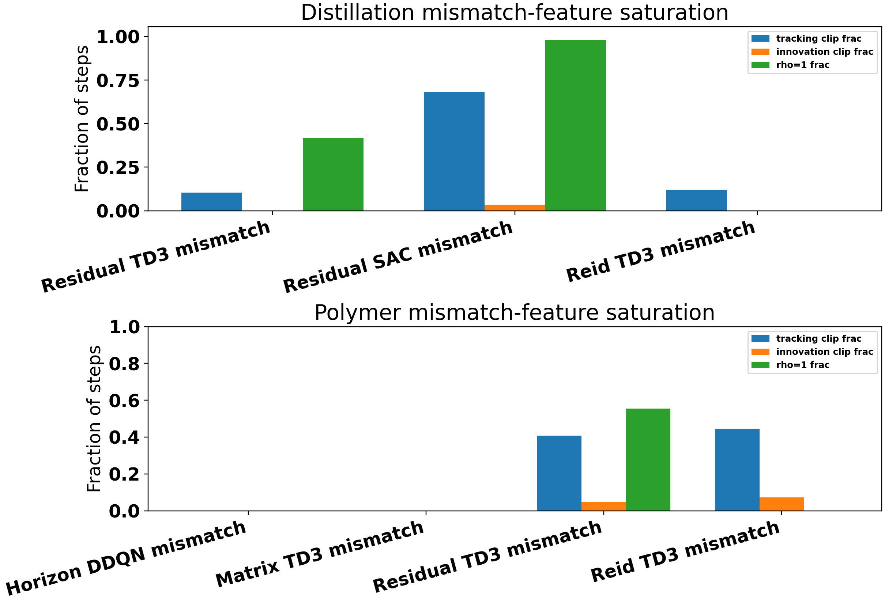

Interpretation:

- distillation base `xhat` is mostly okay
- the appended mismatch features can still become saturated summary variables
- residual SAC is the clearest failure case in distillation

### 4. Polymer Has Both Problems At Once

Polymer mismatch runs combine:

- base `xhat` compression
- raw mismatch magnitudes that can be one to two orders of magnitude larger than the clip threshold

For the polymer residual TD3 run:

- tracking clip fraction: `40.84%`
- innovation clip fraction: `4.97%`
- `rho = 1` fraction: `55.47%`

Representative traces:

- Distillation residual TD3:

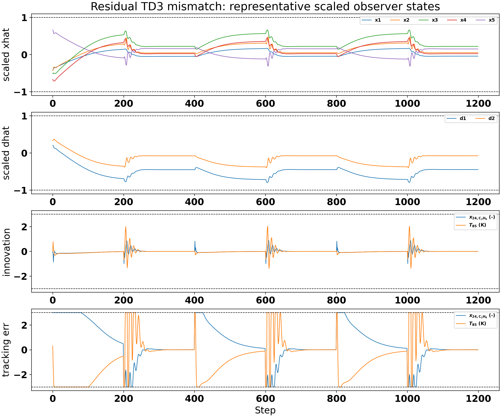

- Polymer residual TD3:

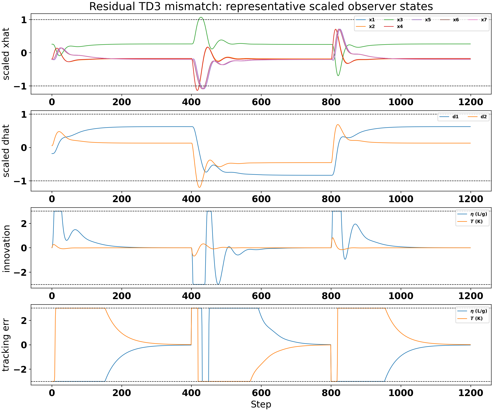

## Observer-Alignment Note

The current RL mismatch runners still build the mismatch features from the previous measurement and also update the observer with the previous innovation:

- [utils/state_features.py](../utils/state_features.py)
- [utils/horizon_runner.py](../utils/horizon_runner.py)
- [utils/matrix_runner.py](../utils/matrix_runner.py)
- [utils/weights_runner.py](../utils/weights_runner.py)
- [utils/residual_runner.py](../utils/residual_runner.py)
- [utils/reidentification_runner.py](../utils/reidentification_runner.py)

The standalone baseline layer already contains a current-measurement predictor-corrector path:

- [utils/mpc_baseline_runner.py](../utils/mpc_baseline_runner.py)

This does not explain the polymer fixed-width problem by itself, because that problem appears across standard and mismatch families. But it is still a plausible reason the mismatch spikes are sharper than they need to be.

## Latest Distillation Residual Agent: Why The Last Evaluation Episode Still Shows Offset

The user concern here is specific:

- if the plant is at the setpoint,
- if the tracking error is zero,
- and if the MPC objective is already satisfied,
- then the residual correction should ideally go to zero.

The latest distillation residual TD3 evaluation episode does not fully satisfy that ideal.

Episode-level figures:

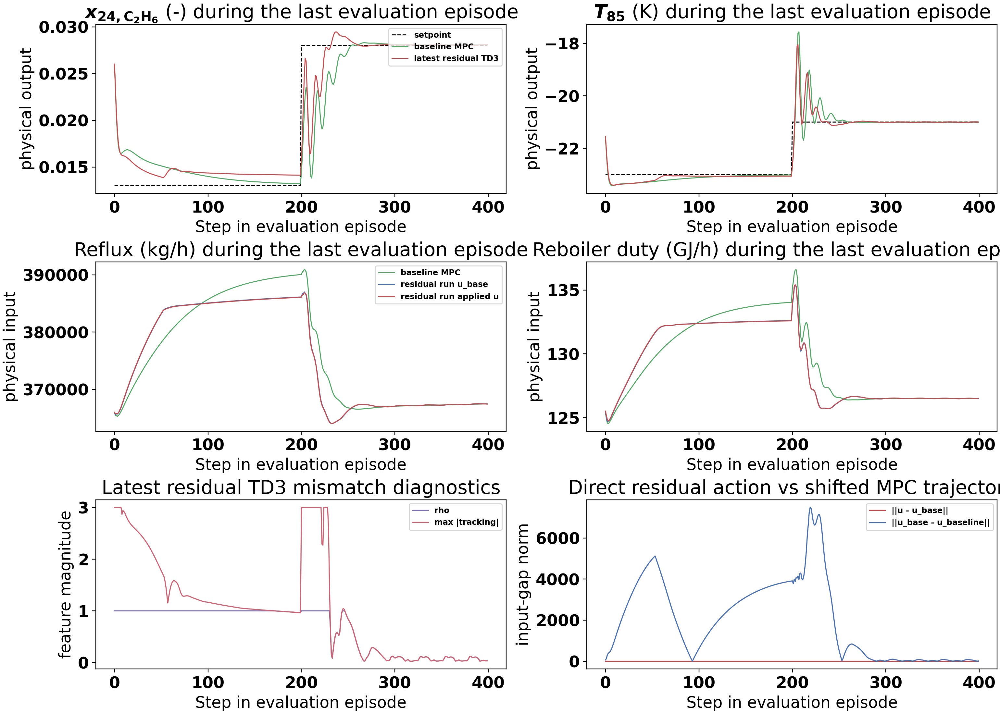

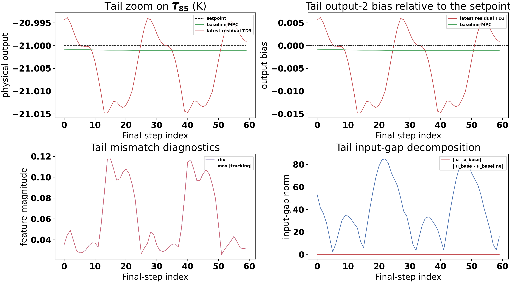

Family comparison:

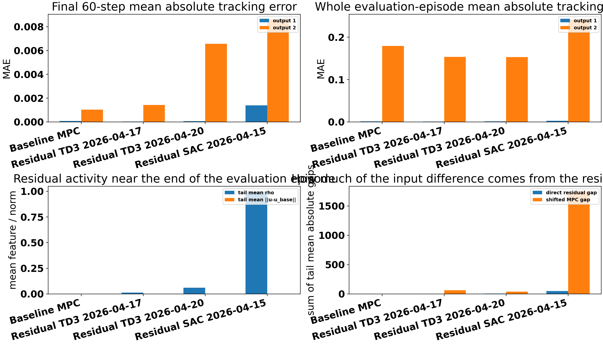

Key numbers from [distillation_residual_eval_summary.csv](./rl_state_scaling_diagnostics/data/distillation_residual_eval_summary.csv):

- Baseline MPC final 60-step MAE on output 2: `0.00104`
- Residual TD3 `2026-04-17` final 60-step MAE on output 2: `0.00143`
- Residual TD3 `2026-04-20` final 60-step MAE on output 2: `0.00657`
- Residual SAC `2026-04-15` final 60-step MAE on output 2: `0.00863`

So the latest residual TD3 run is clearly worse than the standalone baseline on the final part of the evaluation episode, and it is also worse than the earlier TD3 residual run.

For the latest residual TD3 run specifically:

- final 60-step mean output-2 bias vs setpoint: about `-0.00414`
- final 60-step mean output-2 bias vs baseline MPC: about `-0.00311`
- final 60-step mean `rho`: `0.0600`
- final 60-step `rho = 1` fraction: `0.0`
- final 60-step mean residual norm `||u - u_base||`: `2.69e-4`

This means:

- the residual is small near the end
- but it is not exactly zero
- the output is still more biased than the baseline MPC output

### Is the direct residual action the main cause of the offset?

Not in the latest run.

The tail input-gap decomposition shows:

- direct residual gap:
  - `|u - u_base|` is about `6.60` and `0.0030` on the two inputs
- shifted MPC gap:
  - `|u_base - u_baseline|` is about `39.39` and `0.0147`

So most of the difference from the standalone baseline does not come from a large steady residual action. It comes from the fact that the MPC inside the residual rollout has settled to a different operating trajectory.

That is an important distinction:

- the residual policy is not slamming a large steady action at the end
- but the residual-assisted closed loop has still drifted to a different local operating policy than the standalone baseline MPC

### Why the residual is not exactly zero even near the setpoint

The current implementation does not contain an exact zero-residual rule.

Relevant code:

- mismatch features and clipped tracking state:
  - [utils/state_features.py](../utils/state_features.py)
- residual projection and `rho` authority:
  - [utils/residual_authority.py](../utils/residual_authority.py)
- residual rollout:
  - [utils/residual_runner.py](../utils/residual_runner.py)

Current authority map:

- `rho_raw = max(abs(tracking_error_feat))`
- `rho = clip(rho_raw, 0, 1)`
- `rho_eff = rho_floor + (1 - rho_floor) * rho^power`
- `mag = rho_eff * beta_res * (|delta_u_mpc| + du0_res)`

For the latest distillation residual TD3 run:

- `rho_floor = 0.2`
- `beta_res = [0.3, 0.3]`
- `du0_res = [0.003, 0.003]`

So even if `rho` goes to zero, a nonzero `rho_floor` still leaves nonzero residual authority. The controller therefore only tends toward zero residual; it does not enforce zero residual exactly.

Practical conclusion:

- your intuition is right at the design level
- near-setpoint residual action should usually be driven to zero more aggressively than it is now
- the latest saved distillation residual TD3 run shows that the present design can leave a small but real steady bias that baseline MPC does not need

## Innovation And Tracking Error: Can `VecNormalize` Be Used There Too?

Current mismatch-state construction:

- [utils/state_features.py](../utils/state_features.py)

Current clipped features:

- `innovation = clip((y_prev_scaled - yhat_pred) / innovation_scale_ref, -3, 3)`
- `tracking_error = clip((y_prev_scaled - y_sp) / tracking_scale_now, -3, 3)`

Raw exceedance summary:

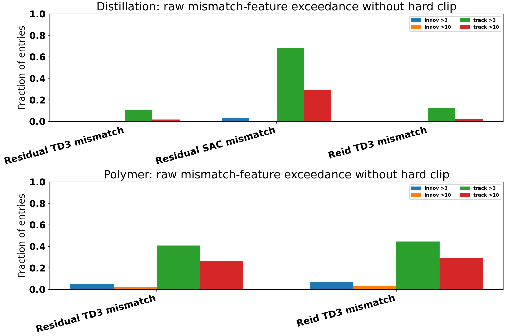

Representative raw-vs-clipped figure:

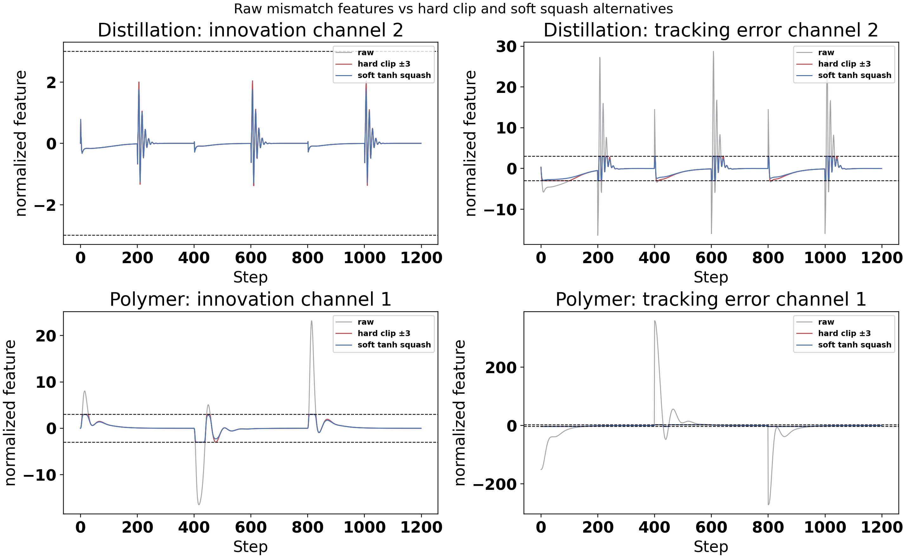

Candidate transform curves:

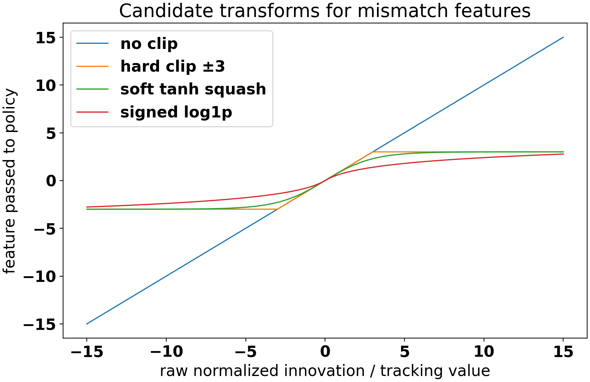

Real-feature transform comparison:

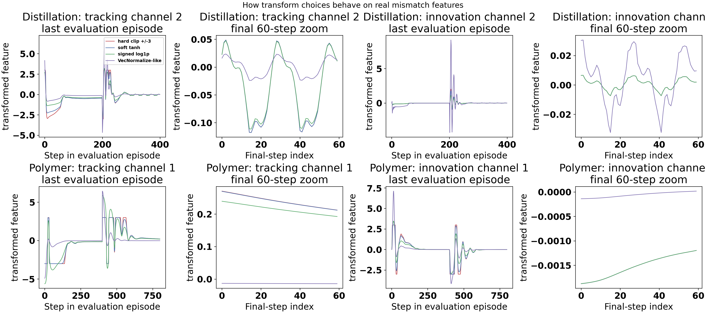

Raw magnitude examples:

- Distillation residual TD3:
  - raw tracking p99: about `5.95` and `16.27`
  - raw innovation p99: about `0.67` and `1.14`
- Distillation residual SAC:
  - raw tracking p99: about `64.22` and `80.36`
  - raw innovation p99: about `5.63` and `6.41`
- Polymer residual TD3:
  - raw tracking p99: about `311.78` and `93.42`
  - raw innovation p99: about `21.06` and `0.88`

### Comparison of transform choices

#### 1. Pure `VecNormalize`-style running z-score

Strengths:

- removes dependence on a fixed global clip
- preserves dynamic range during large transients
- adapts when the feature scale drifts over training

Weaknesses for `innovation` and `tracking_error`:

- near the setpoint, the variance can become very small
- then the same running z-score can magnify tiny late noise instead of leaving it close to zero
- this is visible in the late-window panels of [mismatch_transform_timeseries.png](./rl_state_scaling_diagnostics/figures/mismatch_transform_timeseries.png)

So pure `VecNormalize` is a better fit for physical `xhat` than for mismatch extras by themselves.

#### 2. Soft bounded squash such as `3 * tanh(x / 3)`

Strengths:

- keeps the zero neighborhood intuitive
- still distinguishes `4` from `20`, unlike hard clipping
- cannot explode when the late variance becomes tiny

Weakness:

- it still compresses large magnitudes strongly

#### 3. Signed-log compression such as `sign(x) * log1p(|x|)`

Strengths:

- handles one-to-two-order-of-magnitude spreads well
- preserves severity ordering much better than hard clip
- does not amplify tiny late noise as strongly as a pure running z-score

Weakness:

- it is unbounded, so a final loose outer clip is still useful

### Recommendation for this repo

The best split is not one transform for everything.

Recommended:

- physical `xhat` and possibly `dhat`:
  - `VecNormalize`-style running normalization by feature group
- `innovation` and `tracking_error`:
  - stop hard clipping at `+/-3`
  - first apply a smooth compression such as signed-log or tanh
  - then optionally apply a slower or robust running normalization

Short version:

- `VecNormalize` is good for the polymer state-width problem
- it is not the best standalone answer for `innovation` and `tracking_error`
- for those two features, a soft compression plus optional normalization is better behaved

## `rho`: How It Works Today, Why It Saturates, And How It Could Be Improved

Current `rho` behavior:

- residual-only state feature when `append_rho_to_state=True`
- action-authority gate in [utils/residual_authority.py](../utils/residual_authority.py)
- reused in the combined supervisor residual branch in [utils/combined_runner.py](../utils/combined_runner.py)

Empirical diagnostics:

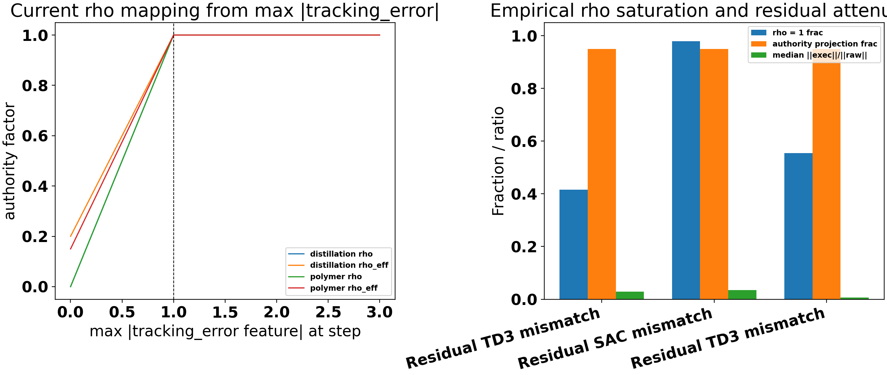

Candidate wider-range mappings:

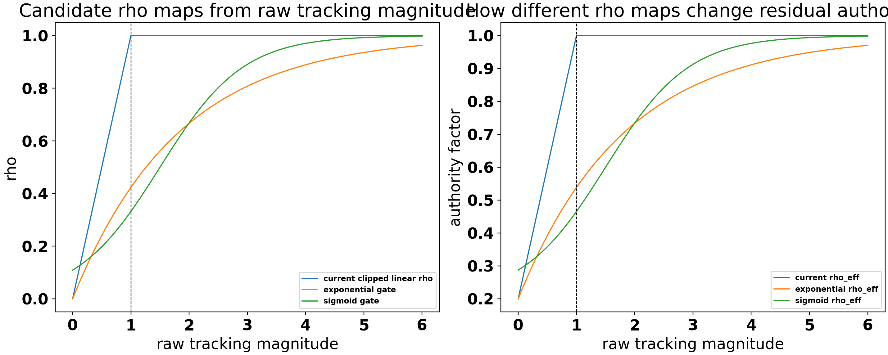

Current issue:

- `rho` is computed from the already clipped tracking feature
- then clipped again to `[0, 1]`

So:

- any `|tracking_error| > 1` already saturates `rho`
- the dynamic range is only the interval `[0, 1]` of the already normalized and clipped tracking feature

Current residual-run usage from [rho_authority_summary.csv](./rl_state_scaling_diagnostics/data/rho_authority_summary.csv):

- Distillation residual TD3:
  - `rho = 1` on `41.57%` of steps
  - authority projection active on `94.94%` of steps
  - median `||delta_u_exec|| / ||delta_u_raw||` about `0.0284`
- Distillation residual SAC:
  - `rho = 1` on `97.91%` of steps
  - authority projection active on `94.98%` of steps
  - median `||delta_u_exec|| / ||delta_u_raw||` about `0.0348`
- Polymer residual TD3:
  - `rho = 1` on `55.47%` of steps
  - authority projection active on `94.91%` of steps
  - median `||delta_u_exec|| / ||delta_u_raw||` about `0.00637`

Interpretation:

- as a coarse safety gate, `rho` is doing something useful
- as a residual-family supervisory signal that might later be reused in combined residual branches, it is too saturated and too low-resolution

### What should improve first

1. Build `rho` from raw tracking magnitude, not the already clipped tracking state.
2. Move the transition scale above the current `normalized error = 1` threshold.
3. Use a smoother map such as:
   - `rho = 1 - exp(-k * ||e||)`
   - `rho = sigmoid(a * (||e|| - b))`
4. Consider a short moving average or exponential moving average of tracking, not only the instantaneous max across outputs.
5. If near-setpoint zero residual is important, add an explicit deadband where the residual action is forced to zero.

### Is scalar `rho` the best long-term supervisor?

Probably not by itself.

For the residual family, the literature suggests stronger supervisory ideas than one clipped scalar:

- action shielding:
  - a runtime supervisor corrects unsafe or undesirable actions before they reach the plant
- predictive safety filtering:
  - a model-based certificate accepts the learned action only when a safe fallback exists
- Lyapunov- or constraint-based supervision:
  - the learning update or the runtime policy is tied to a measurable stability or feasibility margin
- uncertainty-aware gating:
  - the RL authority depends on model uncertainty, not only tracking magnitude

For this project, the best long-term direction is likely:

- keep a lightweight `rho`-type summary if it helps,
- but move the real supervision to an MPC-style shield or predictive safety filter around the residual action, not around every RL-assisted MPC family by default.

That is a closer match to what you want:

- small or zero residual near the setpoint
- more authority only when the mismatch signal and the safety certificate both support it

## Literature Directions Relevant To This Project

The following external sources were checked on the web because the user explicitly requested papers and journal guidance for better supervision and normalization:

1. Stable Baselines3 `VecNormalize`
   - official docs and implementation of running mean/variance normalization plus clipping
   - relevant because it matches the polymer fixed-width compression problem directly
2. Johannink et al., "Residual Reinforcement Learning for Robot Control"
   - relevant because it studies baseline-controller plus learned residual structure directly
3. Achiam et al., "Constrained Policy Optimization"
   - relevant mainly as a reference point for constrained residual-action supervision, not as a blanket design target for every family in this repo
4. Chow et al., "Lyapunov-based Safe Policy Optimization for Continuous Control"
   - relevant mainly as a reference point for residual-action supervision, not as evidence that every RL-assisted MPC branch should get a Lyapunov layer
5. Alshiekh et al., "Safe Reinforcement Learning via Shielding"
   - relevant because it uses a runtime shield instead of trusting the raw learned action
6. Wabersich and Zeilinger, "A Predictive Safety Filter for Learning-Based Control of Constrained Nonlinear Dynamical Systems"
   - relevant because it is essentially a model-based safety certificate around a learning controller
7. Berkenkamp et al., "Safe Model-based Reinforcement Learning with Stability Guarantees"
   - relevant because it ties authority to uncertainty and stability regions rather than only tracking magnitude
8. Rosolia et al., "Safety-Critical Reinforcement Learning for Process Control Systems Using Adaptive Robust Model Predictive Shielding"
   - especially relevant because it is process-control specific and uses robust MPC shielding around RL

What these papers suggest for this repo:

- if you only need better scaling, `VecNormalize`-style grouped observation normalization is enough for polymer `xhat`
- if you need better mismatch-feature conditioning, use soft compression before or together with normalization
- if you want `rho` as a reusable summary inside the residual family, scalar clipping is too weak
- for the residual agent in particular, MPC shielding or predictive safety filtering is more aligned with the control objective than the current clipped-`rho` gate
- for horizon, matrix, weights, and reidentification, the more natural next step is to strengthen their existing family-specific constraints rather than to copy residual-style shielding

## Offline Replay Of The New Residual Refresh

The new residual logic was also evaluated offline on the saved residual TD3 trajectories using the saved raw residual actions, `u_base`, raw mismatch features, and headroom limits. This is not a new closed-loop rollout. It is a replay of the new residual projection on the saved trajectories, so it isolates the residual-side effect of:

- `rho_mapping_mode = "exp_raw_tracking"`
- `authority_rho_k = 0.55`
- `residual_zero_deadband_enabled = True`
- thresholds `0.1` on both raw tracking and raw innovation

Figure:

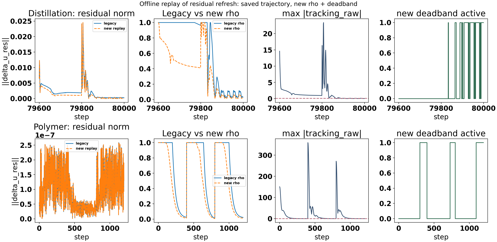

Summary from [residual_refresh_offline_summary.csv](./rl_state_scaling_diagnostics/data/residual_refresh_offline_summary.csv):

- Distillation residual TD3:
  - legacy `rho = 1` fraction: `51.25%`
  - new replay `rho = 1` fraction: `0.0%`
  - new deadband active fraction: `22.5%`
  - tail residual norm reduced from about `2.69e-4` to `4.60e-5`
  - authority-limited fraction reduced from `93.75%` to `73.5%`
- Polymer residual TD3:
  - legacy `rho = 1` fraction: `53.25%`
  - new replay `rho = 1` fraction: `19.17%`
  - new deadband active fraction: `23.08%`
  - tail residual norm is essentially unchanged and already near zero
  - authority-limited fraction stays `0.0%`

Interpretation:

- On the saved distillation residual trajectory, the new residual-side logic does what we wanted from a supervisory refresh:
  - it removes `rho` saturation,
  - creates a meaningful zero-residual region,
  - and materially reduces tail residual activity on the same saved trajectory.
- On the saved polymer residual trajectory, the residual branch was already nearly inactive in the tail, so the main benefit is reduced `rho` saturation rather than further residual suppression.
- This replay does not prove the closed-loop output offset is fixed. That still needs deterministic reevaluation of the agent with the new runtime path. It does show that the new residual supervisor is substantially less aggressive on the saved late-window distillation trajectory.

## Practical Recommendations

1. Fix polymer physical `xhat` scaling first.
   - This is the clearest and broadest problem.

2. Do not keep the current hard `+/-3` clip on `innovation` and `tracking_error`.
   - It is hiding important severity information in both systems.

3. Use different transforms for different feature groups.
   - `xhat`: `VecNormalize`-style running normalization.
   - `innovation` and `tracking_error`: signed-log or tanh compression, optionally followed by slower running normalization.

4. For residual agents, add an explicit near-setpoint deadband.
   - If `max |tracking_raw|` is below a threshold and the MPC residual benefit is negligible, force `delta_u_res = 0`.

5. Redesign `rho` only if it will stay a residual-family supervisory signal.
   - raw tracking input
   - smoother map
   - wider dynamic range
   - optional EMA or uncertainty term

6. If residual RL remains important, move beyond scalar `rho`.
   - use MPC shielding or a predictive safety filter around the residual action

## Main Conclusions

- Distillation base `xhat` scaling is not the main problem in the saved runs.
- Polymer physical `xhat` scaling is a real and severe fixed-width problem across multiple agents.
- The current hard clip on `innovation` and `tracking_error` is too aggressive and masks real severity.
- `VecNormalize` is a strong answer for polymer observer-state scaling, but not the best standalone answer for `innovation` and `tracking_error`.
- The latest distillation residual TD3 evaluation episode does show extra near-steady offset versus baseline MPC.
- That offset is not mainly a large steady residual injection. Most of the difference comes from the shifted residual-run MPC trajectory, while the direct residual action stays small but nonzero.
- The current `rho` is useful as a coarse residual-family guardrail, but too saturated to serve as a high-quality reusable supervisory feature.
- For long-term residual supervision, MPC shielding or predictive safety filtering is a better direction than the current clipped scalar `rho`.

## Sources

- Stable Baselines3 `VecNormalize`: https://stable-baselines3.readthedocs.io/en/v2.7.0/_modules/stable_baselines3/common/vec_env/vec_normalize.html
- Johannink et al., "Residual Reinforcement Learning for Robot Control": https://arxiv.org/abs/1812.03201
- Achiam et al., "Constrained Policy Optimization": https://proceedings.mlr.press/v70/achiam17a.html
- Chow et al., "Lyapunov-based Safe Policy Optimization for Continuous Control": https://openreview.net/forum?id=SJgUYBVLsN
- Alshiekh et al., "Safe Reinforcement Learning via Shielding": https://doi.org/10.1609/aaai.v32i1.11797
- Wabersich and Zeilinger, "A Predictive Safety Filter for Learning-Based Control of Constrained Nonlinear Dynamical Systems": https://doi.org/10.1016/j.automatica.2021.109597
- Berkenkamp et al., "Safe Model-based Reinforcement Learning with Stability Guarantees": https://proceedings.neurips.cc/paper/2017/hash/766ebcd59621e305170616ba3d3dac32-Abstract.html
- Rosolia et al., "Safety-Critical Reinforcement Learning for Process Control Systems Using Adaptive Robust Model Predictive Shielding": https://www.sciencedirect.com/science/article/pii/S0098135425001365
