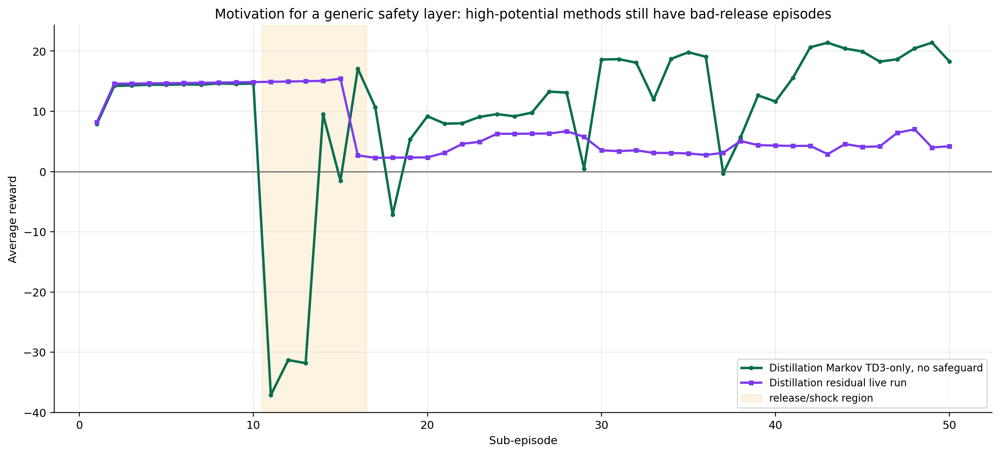
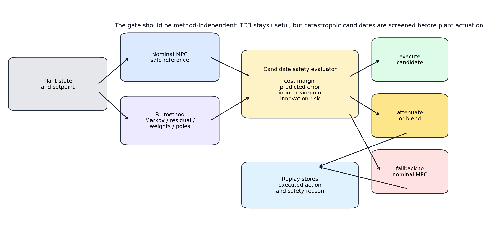
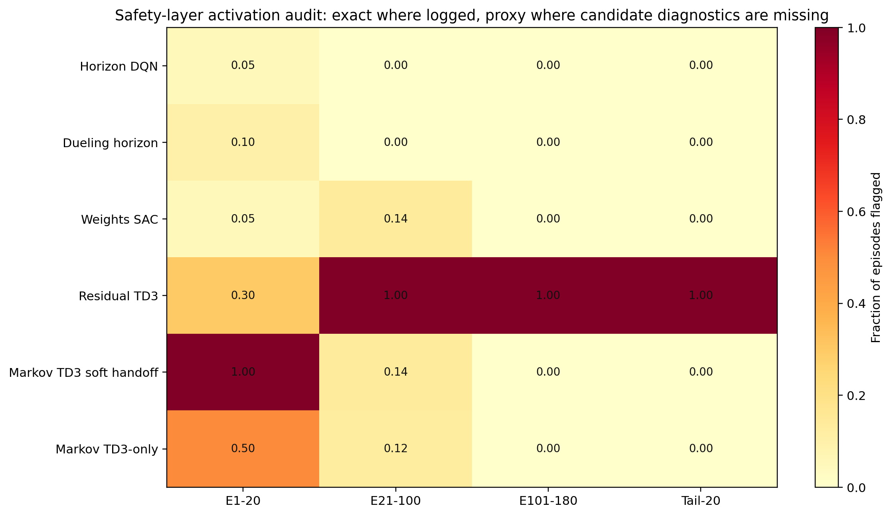

# Generic Safety Layer, Residual Gap, And Online Pole Adaptation

Date: 2026-05-18

## Objective

Create a research plan for a reusable safety layer that can protect the plant from bad RL release episodes without removing the useful TD3 or residual learning signal.

The motivating cases are:

- distillation Markov TD3-only no-safeguard, where the May 18 run eventually becomes very strong but has severe early negative rewards
- distillation residual, where a small nonzero residual causes a large reward drop after the release window
- polymer residual, where the same residual methodology is much more successful

Generated assets:

- `report/figures/safety_layer_and_online_poles_20260518/`
- `report/scripts/generate_safety_layer_assets_20260518.py`

## Files inspected

- `utils/markov_runner.py`
- `utils/residual_runner.py`
- `utils/residual_authority.py`
- `utils/observer.py`
- `utils/matrix_runner.py`
- `systems/polymer/notebook_params.py`
- `systems/distillation/notebook_params.py`
- `RL_assisted_MPC_Poles.ipynb`
- `report/residual_algorithm_polymer_distillation_2026_05_18.md`
- `Distillation/Results/distillation_markov_td3_disturb_fluctuation_td3_only_no_safeguard_unified/20260518_091937/`

## Motivation

The latest no-safeguard TD3-only distillation result is very promising, but it is not safe enough as a deployment rule. It reaches a native tail-20 reward of `21.9784` and a final reward of `22.2229`, but its first-20 minimum reward is `-37.1003` at subepisode `11`.

The distillation residual live run shows a different version of the same problem. Rewards are around `15` before residual release, then drop to `2.6813` at subepisode `16` and `2.2857` at subepisode `17`.

The key lesson is:

Soft handoff helps reduce release shock, but it does not prove a candidate action is good before that action is applied to the nonlinear plant.

## Proposed Safety Layer

The safety layer should be a method-independent candidate evaluator. Every assisted method still proposes its action, but before the plant sees it, the runner compares that candidate against the nominal MPC reference.

At each step, the runner already has or can compute:

$$ u_{\mathrm{nom},k} = \mathrm{MPC}(x_k, y_{\mathrm{sp},k}). $$

The assisted method proposes:

$$ u_{\mathrm{cand},k} = u_{\mathrm{nom},k} + \Delta u_{\mathrm{RL},k}. $$

The safety layer evaluates the candidate with the same linear prediction model used by MPC, plus method-specific diagnostic terms when available.

A practical first metric is the nominal MPC objective margin:

$$ \Delta J_k = \frac{J_{\mathrm{nom}}(u_{\mathrm{cand},k}) - J_{\mathrm{nom}}(u_{\mathrm{nom},k})}{\max(1,\lvert J_{\mathrm{nom}}(u_{\mathrm{nom},k})\rvert)}. $$

The second metric should be predicted tracking risk over the MPC horizon:

$$ E_{\mathrm{pred},k} = \sum_{j=1}^{N_p}\sum_i q_i\left(\frac{\hat y_{\mathrm{cand},k+j,i} - y_{\mathrm{sp},k+j,i}}{d_i}\right)^2. $$

The third metric should protect against actions that are near input limits or too far from the nominal first move:

$$ D_{u,k} = \left\lVert W_u (u_{\mathrm{cand},k} - u_{\mathrm{nom},k}) \right\rVert_2. $$

For methods with additional diagnostics, add them as optional risk channels:

- Markov: gain drift, prediction score, cost margin, `z` norm
- Residual: residual norm, raw-executed action gap, rho value, projection reason
- Matrix and weights: solved-candidate feasibility, objective margin, model/gain drift
- Poles: observer gain norm, pole-placement success, innovation amplification

The decision should have three levels:

1. **Accept** when the candidate is clearly within the phase-aware safety budget.
2. **Soften** when the candidate is questionable but not catastrophic.
3. **Fallback** to nominal MPC when the candidate is catastrophic or cannot be evaluated.

The soften step should be a blend, not a silent rejection:

$$ u_{\mathrm{exec},k} = u_{\mathrm{nom},k} + \alpha_k (u_{\mathrm{cand},k} - u_{\mathrm{nom},k}), \qquad 0 \leq \alpha_k \leq 1. $$

This keeps the RL method in the loop and avoids returning to the old pattern where LS or nominal MPC dominates almost every step.

## Replay Rule

The replay buffer should store the executed action, not the original unsafe proposal, whenever the safety layer modifies the action.

For actor-critic methods this is important because the transition actually observed by the plant is:

$$ (s_k, a_{\mathrm{exec},k}, r_k, s_{k+1}). $$

The rejected or raw action should still be logged for diagnostics:

- `a_raw`
- `a_candidate`
- `a_executed`
- `safety_scale`
- `safety_reason`
- `nominal_cost_margin`
- `predicted_tracking_margin`

This makes the data scientifically useful without training the critic on an action that did not actually cause the observed transition.

## Why Residual Works Better In Polymer Than Distillation

The residual report already showed that rho is wired and active in both case studies. The issue is not that rho is missing.

The issue is that rho is a magnitude authority rule, not a direction-quality test.

In polymer, the residual correction is often helpful because the CSTR output response is smoother and the residual move can compensate slowly varying mismatch without having to solve a delicate multivariable transition. The saved polymer residual run also had high tail-20 `rho_eff` around `0.9181`, frequent projection, and a larger executed residual norm around `0.0150`. That suggests the actor found a useful residual direction under the authority cap.

In distillation, the residual live run shows that a much smaller executed residual norm around `0.002-0.003` can still cause a large reward drop. That points to three likely causes:

1. **Directional sensitivity**

   Tray-24 composition and tray-85 temperature are strongly coupled. A small residual with the wrong sign can move one controlled output away from its setpoint while appearing small in norm.

2. **Release distribution shift**

   The live run is almost zero-residual through subepisode `15`, then residual actions become active at subepisode `16`. The actor is suddenly controlling a sensitive plant from a state distribution it did not yet shape.

3. **Rho grows when tracking error is large**

   This is reasonable for authority, but dangerous for direction. If the actor direction is wrong, larger tracking error increases the allowed bad residual.

The safety layer should therefore not replace rho. It should sit after rho and ask a different question:

Does the residual-implied first move look better than nominal MPC under the prediction model and safety metrics?

## Markov TD3 And Residual Need The Same Protection

The Markov TD3-only result and the residual result are different algorithms, but the failure mode is structurally similar:

- a learned action is released
- the learned action can be highly valuable later
- the early candidate can be much worse than nominal MPC
- magnitude limits and soft handoff reduce risk but do not certify candidate quality

That means the generic safety layer should live in shared utilities, not only in one notebook.

Recommended implementation surface:

- add `utils/candidate_safety.py`
- call it from `utils/markov_runner.py`
- call it from `utils/residual_runner.py`
- later call it from `utils/matrix_runner.py` and weights runners where an assisted candidate can be compared to nominal

The first implementation can reuse what Markov already logs:

- nominal cost
- candidate nominal cost
- cost margin
- first-move difference
- gain drift when applicable

Residual will need one extra shadow prediction around the residual-applied first move, because it does not currently solve a full assisted MPC candidate.

## Online Observer-Pole Adjustment

Online pole adaptation is a natural next idea, but it needs the same safety layer.

The observer update has the form:

$$ \hat x_{k+1} = A\hat x_k + Bu_k + L(y_k - C\hat x_k). $$

The current shared helper computes `L` from requested observer poles:

`utils/observer.py::compute_observer_gain(A, C, desired_poles)`

An online poles agent would propose either:

- direct observer pole locations
- bounded pole multipliers around the nominal poles
- grouped pole shifts for fast, medium, and slow observer modes

A safe mapping should keep all discrete-time poles inside a conservative interval:

$$ p_i \in [p_{\min}, p_{\max}], \qquad 0 < p_{\min} < p_{\max} < 1. $$

For example:

$$ p_i(a_i) = p_{\min} + \frac{a_i + 1}{2}(p_{\max} - p_{\min}). $$

Before accepting a pole candidate, the safety evaluator should check:

- pole-placement success
- finite observer gain
- bounded observer gain norm
- bounded innovation amplification
- improved or neutral one-step prediction error in shadow mode
- no excessive oscillation in estimated disturbances

The initial online-poles experiment should not directly control the plant. It should run in shadow mode first:

1. keep the nominal observer gain for execution
2. compute the candidate observer gain in parallel
3. compare one-step prediction error and innovation statistics
4. only allow low-authority online poles after the candidate repeatedly passes

This would turn pole adjustment into a supervised/adaptive layer similar to the other RL families, but with a stronger safety requirement because the observer affects every downstream MPC solve.

## Step-By-Step Experiment Plan

### Step 1: Add Safety Diagnostics Only

Purpose:
measure how often the current no-safeguard and residual candidates would be blocked or softened.

Files:

- `utils/markov_runner.py`
- `utils/residual_runner.py`
- new `utils/candidate_safety.py`

Expected output:

- `safety_risk_score_log`
- `safety_decision_log`
- `safety_scale_log`
- `safety_reason_log`

Success metric:
the first bad-release episodes should show high predicted risk before the plant reward collapses.

### Step 2: Enable Softening, Not Fallback

Purpose:
prevent catastrophic candidates while keeping TD3 and residual actions active.

Suggested first rule:

- accept when all margins are inside the protected cap
- use `alpha = 0.25` when risk is moderate
- fallback only when candidate solve fails, cost margin is catastrophic, or predicted error is much worse than nominal

Success metric:
bad-release reward drops should be smaller, while tail-20 TD3 or residual action usage remains high.

### Step 3: Add Residual Direction Check

Purpose:
fix the rho limitation in distillation residual.

Implementation idea:

- compute the nominal one-step predicted output
- compute the residual-applied one-step predicted output
- reject or shrink the residual if it increases a weighted tracking error by more than the phase cap

Success metric:
distillation residual subepisodes `16:25` should no longer collapse after release.

### Step 4: Shadow Online Poles

Purpose:
test whether observer-pole adaptation has useful signal before giving it authority.

Implementation idea:

- add a poles agent or schedule that proposes bounded pole groups
- compute `L_candidate` with `compute_observer_gain`
- log one-step prediction error under nominal and candidate observer gains
- do not execute candidate poles until shadow metrics are consistently neutral or positive

Success metric:
candidate poles should reduce prediction/innovation error without increasing control move size or causing observer-gain spikes.

## Main Recommendation

Do not return to a conservative hard veto that makes TD3 or residual irrelevant.

Use a shared safety layer with three outcomes:

- execute the learned action when it is safe
- shrink the learned action when it is risky but informative
- fall back to nominal MPC only when it is catastrophic

This keeps TD3 and residual learning at the center of the decision while making the bad-release episodes much less likely to corrupt a long run.

## Current Method Activation Audit

The May 18 cross-method audit gives a first estimate of where the safety layer would actually be active. The audit is exact for Markov soft handoff where authority scale, action source, cost margin, gain drift, and probation are saved. It is also informative for residual because rho, projection, residual norm, and raw/executed gap are saved. For horizon, dueling horizon, and weights, it is only a proxy because full candidate-vs-nominal diagnostics are not currently stored.

| Method | Proxy episodes flagged | Interpretation |
| --- | ---: | --- |
| Horizon DQN | `1` | essentially quiet after the first transient |
| Dueling horizon | `2` | mostly quiet, one release-period dip |
| Weights SAC | `12` | move-change proxy around episodes `56-66` |
| Residual TD3 | `186` | persistent projection/raw-executed-gap risk |
| Markov TD3 soft handoff | `31` | real ramp/probation activity plus a few reward dips |
| Markov TD3-only | `20` | release-collapse proxy with no active protection |

The audit supports three safety-layer levels:

1. **Monitor-only for horizon and dueling horizon at first.**
   These methods do not show severe current release risk, and their bundles need better candidate diagnostics before a hard gate is justified.

2. **Soft intervention for Markov.**
   The soft-handoff result shows that authority scaling and probation are beneficial. The next layer should add predicted tracking-risk checks rather than returning to a positive-score veto.

3. **Direction-aware intervention for residual.**
   Residual projection is active on most steps, but projection is not enough. The safety layer should evaluate whether the residual-applied first move improves or worsens predicted tracking before applying it to the plant.

The exact additional logs needed before using one safety layer everywhere are:

- `candidate_nominal_cost`
- `nominal_cost`
- `candidate_first_move`
- `nominal_first_move`
- `predicted_tracking_error_candidate`
- `predicted_tracking_error_nominal`
- `safety_decision`
- `safety_scale`
- `safety_reason`
- `raw_action`
- `executed_action`

## Remaining Uncertainty

- The May 18 TD3-only result is one saved run, not a multi-seed conclusion.
- The residual live run values came from the notebook output pasted by the user, not a saved bundle from that exact run.
- The proposed safety layer needs shadow-mode validation before it is allowed to change plant actions.
- Online observer-pole adaptation is promising, but it can destabilize estimation if observer gain norms or innovation amplification are not bounded.
